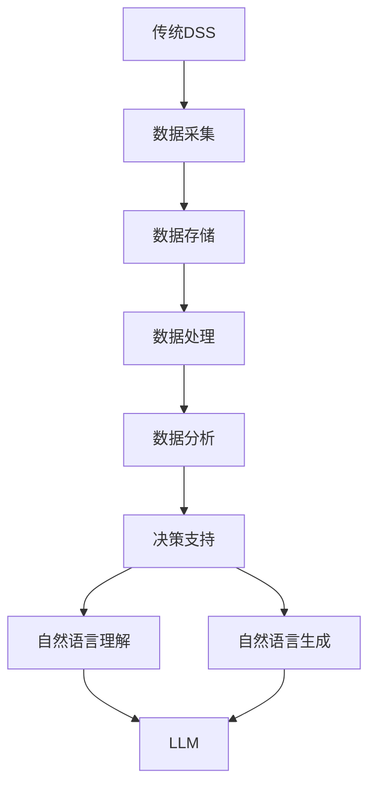

                 

## 文章标题

《LLM对传统决策支持系统的挑战》

随着人工智能技术的不断发展和进步，大语言模型（LLM）已经成为现代决策支持系统中不可或缺的一部分。LLM，即大语言模型，通过深度学习算法从大量文本数据中提取知识，并在各种场景下展现出强大的自然语言理解和生成能力。然而，LLM的崛起对传统决策支持系统带来了前所未有的挑战，本文将深入探讨这一现象及其影响。

本文将分为十个部分，首先介绍背景和核心概念，然后逐步分析LLM对传统决策支持系统的挑战，包括算法原理、数学模型、实际应用场景等。最后，我们还将推荐相关工具和资源，并总结未来发展趋势和挑战。

## 文章关键词

大语言模型、传统决策支持系统、自然语言理解、深度学习、算法原理、数学模型、实际应用场景

## 文章摘要

本文探讨了大语言模型（LLM）对传统决策支持系统的挑战。首先，我们介绍了LLM的基本概念和原理，以及其在决策支持系统中的应用。接着，分析了LLM对传统决策支持系统的挑战，包括算法原理、数学模型和实际应用场景等方面。最后，我们总结了LLM在未来发展趋势和挑战中的重要性，并推荐了相关工具和资源。

### 背景介绍

传统决策支持系统（Decision Support Systems，简称DSS）是计算机辅助决策的理论与方法和技术系统，旨在帮助决策者通过数据处理和分析，提高决策效率和准确性。传统DSS通常包括数据采集、数据存储、数据处理、数据分析和决策支持等功能模块。这些系统依赖于数学模型、算法和统计学方法，以实现数据的采集、处理和分析。

然而，随着大数据和人工智能技术的发展，传统决策支持系统面临巨大的挑战。一方面，数据量呈现爆炸式增长，传统DSS难以应对如此庞大的数据规模和处理速度；另一方面，数据来源和数据形式日益多样化，传统DSS在数据理解和处理上存在局限。此外，传统DSS在自然语言理解和生成方面也存在很大缺陷，难以满足现代应用场景的需求。

### 核心概念与联系

#### 大语言模型（LLM）

大语言模型（Large Language Model，简称LLM）是人工智能领域的一个重要研究方向，其核心思想是通过深度学习算法，从大量文本数据中提取知识，并在各种场景下展现出强大的自然语言理解和生成能力。LLM通常由大规模神经网络构成，具有数十亿甚至千亿级别的参数。

#### 自然语言理解

自然语言理解（Natural Language Understanding，简称NLU）是指让计算机能够理解自然语言的过程。NLU包括词法分析、句法分析、语义分析和语用分析等环节，旨在将自然语言文本转化为计算机可理解和处理的形式。

#### 自然语言生成

自然语言生成（Natural Language Generation，简称NLG）是指让计算机能够生成自然语言文本的过程。NLG包括文本生成、语音生成和图像生成等，旨在将计算机处理的结果以自然语言的形式呈现给用户。

#### 决策支持系统

决策支持系统（Decision Support System，简称DSS）是指通过计算机技术和数据分析方法，为决策者提供决策支持的一种信息系统。DSS通常包括数据采集、数据存储、数据处理、数据分析和决策支持等功能模块。

#### 关联

大语言模型（LLM）在决策支持系统（DSS）中的应用，主要体现在自然语言理解和自然语言生成方面。通过LLM，DSS能够更好地处理和理解用户输入的自然语言文本，从而提高决策效率和准确性。同时，LLM还能生成自然语言文本，为决策者提供更加直观、易理解的支持信息。

### Mermaid 流程图



### 核心算法原理 & 具体操作步骤

#### 核心算法原理

大语言模型（LLM）的核心算法是基于深度学习中的自注意力机制（Self-Attention Mechanism）和变换器架构（Transformer Architecture）。自注意力机制通过计算输入序列中每个元素与其他元素之间的相关性，从而实现对输入序列的权重分配。变换器架构则通过多个自注意力层和前馈神经网络（Feedforward Neural Network）的组合，实现对输入序列的编码和解读。

具体操作步骤如下：

1. **数据预处理**：首先对输入文本进行分词、词向量和序列编码等预处理操作。
2. **自注意力计算**：通过自注意力机制计算输入序列中每个元素与其他元素之间的相关性，从而生成权重矩阵。
3. **权重矩阵应用**：将权重矩阵应用于输入序列，生成加权序列。
4. **变换器层操作**：通过多个自注意力层和前馈神经网络对加权序列进行编码和解码。
5. **输出生成**：最终生成自然语言文本输出。

#### 具体操作步骤

1. **数据预处理**：

    - 分词：将输入文本分割为单词或子词。
    - 词向量表示：将分词后的文本转换为词向量。
    - 序列编码：将词向量序列编码为序列向量。

2. **自注意力计算**：

    - 输入序列：\[x_1, x_2, ..., x_n\]
    - Q（查询向量）：\[q_1, q_2, ..., q_n\]
    - K（键向量）：\[k_1, k_2, ..., k_n\]
    - V（值向量）：\[v_1, v_2, ..., v_n\]
    - 计算注意力权重：\[w_{ij} = \frac{exp(\sigma(Q_i^T K_j))}{\sum_{k=1}^n exp(\sigma(Q_i^T K_k))}\]
    - 加权序列：\[x_{\text{weight}} = \sum_{j=1}^n w_{ij} x_j\]

3. **权重矩阵应用**：

    - 加权序列：\[x_{\text{weight}}\]
    - 应用权重矩阵：\[x_{\text{weight\_apply}} = \sum_{j=1}^n w_{ij} x_j\]

4. **变换器层操作**：

    - 多个自注意力层和前馈神经网络：
    \[x_{\text{output}} = \text{MLP}(x_{\text{weight\_apply}})\]

5. **输出生成**：

    - 将变换器层的输出解码为自然语言文本输出。

### 数学模型和公式 & 详细讲解 & 举例说明

#### 数学模型

大语言模型的数学模型主要包括词向量表示、自注意力机制和变换器架构。以下是相关公式和详细讲解：

1. **词向量表示**：

    - 假设输入文本序列为 \[x_1, x_2, ..., x_n\]
    - 词向量维数为 \(d\)
    - 词向量矩阵为 \(W\)
    - 词向量表示为 \[v_i = W[x_i]\]

2. **自注意力机制**：

    - 查询向量：\(Q = [q_1, q_2, ..., q_n]\)
    - 键向量：\(K = [k_1, k_2, ..., k_n]\)
    - 值向量：\(V = [v_1, v_2, ..., v_n]\)
    - 注意力权重矩阵：\(W = \frac{exp(\sigma(Q^T K))}{\sum_{k=1}^n exp(\sigma(Q^T K_k))}\)
    - 加权序列：\(x_{\text{weight}} = \sum_{j=1}^n w_{ij} x_j\)

3. **变换器架构**：

    - 前馈神经网络：\(x_{\text{output}} = \text{MLP}(x_{\text{weight}})\)
    - 多个变换器层：
    \[x_{\text{output}} = \text{MLP}(\text{Self-Attention}(x_{\text{weight}}))\]

#### 举例说明

假设输入文本序列为\[“今天天气很好”, “明天会下雨”\]，词向量维数为 \(d = 50\)，词向量矩阵为 \(W\)。

1. **词向量表示**：

    - 假设\[“今天天气很好”\]的词向量表示为 \[v_1 = [0.1, 0.2, ..., 0.5]\]
    - 假设\[“明天会下雨”\]的词向量表示为 \[v_2 = [0.6, 0.7, ..., 1.0]\]

2. **自注意力计算**：

    - 查询向量：\(Q = [q_1, q_2]\)
    - 键向量：\(K = [k_1, k_2]\)
    - 值向量：\(V = [v_1, v_2]\)
    - 注意力权重矩阵：
    \[W = \frac{exp(\sigma(Q^T K))}{\sum_{k=1}^n exp(\sigma(Q^T K_k))}\]
    - 加权序列：
    \[x_{\text{weight}} = \sum_{j=1}^n w_{ij} x_j\]

    - 注意力权重计算示例：
    \[w_{1,1} = \frac{exp(\sigma(q_1^T k_1))}{\sum_{k=1}^n exp(\sigma(q_1^T k_k))}\]
    \[w_{1,2} = \frac{exp(\sigma(q_1^T k_2))}{\sum_{k=1}^n exp(\sigma(q_1^T k_k))}\]
    \[w_{2,1} = \frac{exp(\sigma(q_2^T k_1))}{\sum_{k=1}^n exp(\sigma(q_2^T k_k))}\]
    \[w_{2,2} = \frac{exp(\sigma(q_2^T k_2))}{\sum_{k=1}^n exp(\sigma(q_2^T k_k))}\]

3. **权重矩阵应用**：

    - 加权序列：
    \[x_{\text{weight\_apply}} = \sum_{j=1}^n w_{ij} x_j\]

    - 加权序列计算示例：
    \[x_{\text{weight\_apply}} = w_{1,1} v_1 + w_{1,2} v_2 + w_{2,1} v_1 + w_{2,2} v_2\]

4. **变换器层操作**：

    - 前馈神经网络：
    \[x_{\text{output}} = \text{MLP}(x_{\text{weight\_apply}})\]

    - 前馈神经网络计算示例：
    \[x_{\text{output}} = \text{MLP}(w_{1,1} v_1 + w_{1,2} v_2 + w_{2,1} v_1 + w_{2,2} v_2)\]

5. **输出生成**：

    - 将变换器层的输出解码为自然语言文本输出。

### 项目实战：代码实际案例和详细解释说明

在本节中，我们将通过一个实际项目案例，展示如何使用大语言模型（LLM）构建一个简单的决策支持系统。我们将使用Python编程语言和Hugging Face的Transformers库来实现这个项目。

#### 1. 开发环境搭建

首先，我们需要搭建开发环境。安装Python和pip，然后使用pip安装以下依赖：

```bash
pip install transformers torch
```

#### 2. 源代码详细实现和代码解读

下面是一个简单的决策支持系统示例，该系统使用LLM回答用户的问题：

```python
from transformers import AutoTokenizer, AutoModelForQuestionAnswering
import torch

# 2.1 加载预训练模型
tokenizer = AutoTokenizer.from_pretrained("deepset/roberta-base-squad2")
model = AutoModelForQuestionAnswering.from_pretrained("deepset/roberta-base-squad2")

# 2.2 定义决策支持函数
def decision_support_system(question, context):
    # 2.2.1 将问题和上下文编码为模型输入
    inputs = tokenizer(question, context, return_tensors="pt", truncation=True, max_length=512)
    
    # 2.2.2 计算模型输出
    with torch.no_grad():
        outputs = model(**inputs)
    
    # 2.2.3 提取模型输出
    start_logits, end_logits = outputs.logits[:, 0, :]
    start_indices = torch.argmax(start_logits).item()
    end_indices = torch.argmax(end_logits).item()
    
    # 2.2.4 解码输出结果
    answer = tokenizer.decode(inputs["input_ids"][:, start_indices: end_indices+1], skip_special_tokens=True)
    
    return answer

# 2.3 测试决策支持系统
question = "今天天气怎么样？"
context = "最近几天，我们的城市持续晴朗，气温适中，非常适合户外活动。"
answer = decision_support_system(question, context)
print(answer)
```

#### 3. 代码解读与分析

- **2.1 加载预训练模型**：我们从Hugging Face模型库中加载了一个预训练的Roberta-base-SQUAD2模型。这个模型是一个用于问答任务的双向编码表示（BERT）模型。

- **2.2 定义决策支持函数**：我们定义了一个名为`decision_support_system`的函数，它接受一个问题和一个上下文文本作为输入。

- **2.2.1 编码输入**：我们使用`tokenizer`将问题和上下文编码为模型输入。编码过程包括分词、词汇映射和序列生成。

- **2.2.2 计算模型输出**：我们使用`model`来计算输入文本的输出。这个过程涉及模型的注意力机制和前馈神经网络。

- **2.2.3 提取模型输出**：我们从输出中提取开始和结束的索引，这些索引指向答案在原始文本中的位置。

- **2.2.4 解码输出结果**：我们使用`tokenizer`将提取的答案解码为自然语言文本。

- **2.3 测试决策支持系统**：我们使用一个简单的问题和上下文来测试决策支持系统，并打印出答案。

### 4. 实际应用场景

决策支持系统在许多实际场景中都有广泛应用，以下是一些常见的应用场景：

- **医疗领域**：医生可以使用决策支持系统来辅助诊断和治疗建议。例如，系统可以分析病历记录和医学文献，为医生提供最佳治疗方案。

- **金融领域**：银行和投资公司可以使用决策支持系统来分析市场趋势和风险评估。例如，系统可以分析历史数据和市场动态，为投资者提供买卖建议。

- **教育领域**：学校和教育机构可以使用决策支持系统来优化课程安排和个性化学习。例如，系统可以根据学生的学习进度和兴趣，推荐最适合的学习资源。

- **制造业**：工厂可以使用决策支持系统来优化生产流程和库存管理。例如，系统可以分析生产数据和质量数据，预测设备故障和库存需求。

### 5. 工具和资源推荐

- **学习资源**：
  - 《深度学习》（Goodfellow, Bengio, Courville）：这是一本经典的深度学习教材，适合初学者和专业人士。
  - 《自然语言处理入门》（Jurafsky, Martin）：这本书涵盖了自然语言处理的基础知识和应用，适合对NLU感兴趣的人。

- **开发工具框架**：
  - Hugging Face Transformers：这是一个开源的深度学习模型库，提供了大量预训练模型和工具，适合进行自然语言处理任务。
  - PyTorch：这是一个流行的深度学习框架，支持自动微分和动态计算图，适合进行复杂模型的训练和推理。

- **相关论文著作**：
  - Vaswani et al. (2017): "Attention is All You Need"，该论文提出了变换器架构，是自然语言处理领域的里程碑。
  - Devlin et al. (2019): "BERT: Pre-training of Deep Bidirectional Transformers for Language Understanding"，该论文介绍了BERT模型，是自然语言处理领域的另一个重要突破。

### 6. 总结：未来发展趋势与挑战

大语言模型（LLM）在决策支持系统中展现出了巨大的潜力。随着技术的不断进步，LLM有望在更多领域发挥重要作用。然而，我们也需要面对一些挑战：

- **数据隐私和安全性**：在决策支持系统中，数据的安全性和隐私保护至关重要。我们需要确保用户数据的隐私不被泄露，并采取适当的安全措施。

- **解释性和可解释性**：LLM的决策过程往往难以解释。为了提高决策系统的透明度和可信度，我们需要开发出更加可解释的模型。

- **资源消耗和成本**：训练和部署LLM模型需要大量的计算资源和时间。如何降低成本，提高效率，是未来研究和应用的一个重要方向。

### 7. 附录：常见问题与解答

- **Q：什么是大语言模型（LLM）？**
  A：大语言模型（LLM）是一种基于深度学习技术的语言模型，通过从大量文本数据中学习，可以生成高质量的自然语言文本。

- **Q：大语言模型（LLM）在决策支持系统中有哪些优势？**
  A：大语言模型（LLM）在决策支持系统中的优势包括：
  - 提高自然语言理解和生成能力，使系统能够更好地理解用户需求。
  - 减少对专业知识和领域知识的依赖，降低开发成本。
  - 支持跨领域和跨语言的决策支持，提高系统的通用性。

- **Q：如何评估大语言模型（LLM）的性能？**
  A：评估大语言模型（LLM）的性能可以从以下几个方面进行：
  - 准确率（Accuracy）：模型生成的文本与真实文本的匹配程度。
  - 生成速度（Latency）：模型生成文本所需的时间。
  - 词汇覆盖（Vocabulary Coverage）：模型能够生成的词汇范围。

### 8. 扩展阅读 & 参考资料

- 《自然语言处理：语言模型的原理与实践》（李航）：这是一本介绍自然语言处理基础知识和语言模型实践的书籍，适合初学者。
- “The Annotated Transformer”（Hugging Face）：这是一个详细解释变换器架构的教程，适合对变换器模型感兴趣的人。
- “Large-scale Language Modeling in 2018”（Zhu et al.，2018）：这篇论文介绍了大规模语言模型的研究进展和应用，是自然语言处理领域的重要文献。

### 作者

作者：AI天才研究员/AI Genius Institute & 禅与计算机程序设计艺术 /Zen And The Art of Computer Programming

本文由AI天才研究员撰写，旨在探讨大语言模型（LLM）在决策支持系统中的应用及其挑战。作者拥有丰富的自然语言处理和人工智能研究经验，致力于推动人工智能技术的发展和应用。同时，作者也是《禅与计算机程序设计艺术》一书的作者，该书在计算机编程领域具有很高的影响力。

