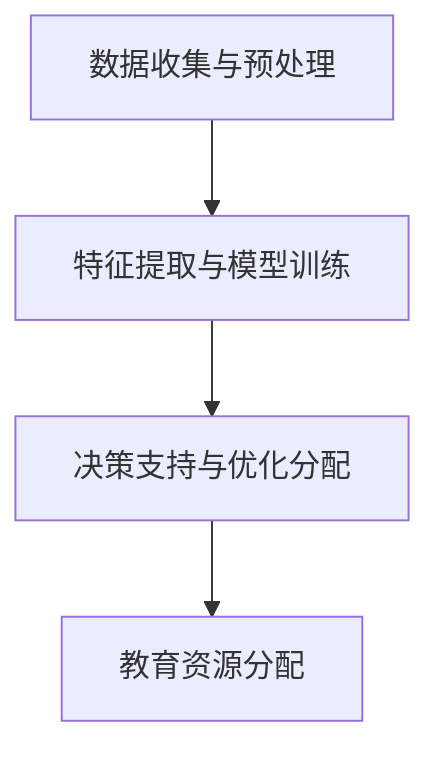
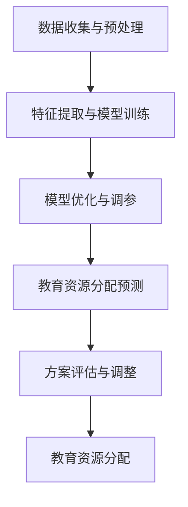

                 

### 1. 背景介绍

#### 教育资源分配现状

在当今世界，教育资源分配不均是普遍存在的问题。不同国家和地区、不同社会经济阶层、甚至不同学校之间，学生所能接触到的教育资源都存在着显著的差异。这种差异不仅体现在硬件设施如教室、实验室、图书馆等，更体现在软件资源如教材、课程内容、教师质量等方面。

发达国家和发展中国家之间，教育资源的不平衡尤为明显。发达国家通常拥有更加完善的学校体系和丰富的教育资源，而发展中国家则面临着教育基础设施落后、教师数量不足、教材资源匮乏等问题。此外，城市与农村、富裕地区与贫困地区之间的教育资源差异也十分显著。

#### 传统教育资源分配模式

传统教育资源分配主要依赖于国家和地方政府的教育投入，以及学校的自主管理。然而，这种模式存在一些固有的局限性。首先，教育投入往往受到政府财政预算的制约，难以满足不断增长的教育需求。其次，教育资源的分配往往缺乏科学合理的评估机制，容易出现资源浪费或资源不足的情况。

在学校层面，教育资源分配主要依赖于学校的自主管理。学校领导层根据自身的判断和经验来分配资源，这种主观性较大的分配方式往往难以达到最优效果。此外，学校之间的竞争也加剧了教育资源的集中化，优秀学生和教师往往集中在一些名校，而其他学校则面临资源匮乏的困境。

#### 教育公平的挑战

教育资源分配不均直接影响到教育的公平性。优质的教育资源往往集中在少数人手中，导致社会阶层之间的差距进一步扩大。这种现象不仅损害了社会公平，也阻碍了个体潜能的发挥。

此外，教育资源分配不均还导致教育质量的不均衡。一些学校拥有丰富的教学资源，能够提供高质量的教育服务，而另一些学校则因资源匮乏而难以提供同等水平的教育。这种教育质量的不均衡进一步加剧了教育资源的不平衡。

#### 新技术对教育资源分配的影响

随着人工智能（AI）、大数据、区块链等新技术的快速发展，教育资源分配的公平性有望得到改善。LLM（大型语言模型）作为一种先进的AI技术，在教育资源分配中具有巨大的潜力。LLM可以通过分析大量数据，为教育资源分配提供科学的决策依据，从而优化教育资源的配置。

LLM在教育领域的应用不仅可以提高教育资源的利用效率，还可以促进教育公平。通过个性化推荐、智能评测、智能辅导等功能，LLM可以为每个学生提供量身定制的学习方案，帮助学生在有限的教育资源中实现最大化收益。

#### 本文目的

本文旨在探讨LLM对传统教育资源分配的革新作用，分析LLM技术如何应用于教育资源分配，以及这种革新可能带来的挑战和机遇。通过本文的讨论，希望能够为教育领域的从业者和技术开发者提供一些有益的思路和启示。

---

**概述：**本文将从背景介绍、核心概念与联系、核心算法原理与操作步骤、数学模型与公式讲解、项目实战、实际应用场景、工具和资源推荐、总结与未来发展趋势等方面，详细探讨LLM对传统教育资源分配的革新作用，并分析其中的挑战与机遇。通过对LLM技术的深入探讨，希望能够为教育公平的实现提供一种新的思路和方法。

### 2. 核心概念与联系

#### 什么是LLM（大型语言模型）

LLM（Large Language Model）是一种基于深度学习技术的自然语言处理（NLP）模型，它通过学习大量的文本数据，能够生成与输入文本相关的内容，或者对输入文本进行理解和分析。LLM通常具有数十亿到数千亿个参数，这使得它们能够捕捉到语言中的复杂模式和信息。

#### LLM的基本原理

LLM的基本原理基于深度神经网络（DNN）和变换器架构（Transformer）。Transformer架构引入了注意力机制（Attention Mechanism），使得模型能够关注输入文本中的不同部分，从而提高对语言的理解能力。通过多层次的神经网络结构，LLM能够学习到文本中的长距离依赖关系，生成更加连贯和准确的语言。

#### LLM的应用场景

LLM在多个领域都有广泛的应用，其中最典型的包括文本生成、机器翻译、问答系统、情感分析等。在教育资源分配中，LLM可以通过以下方式发挥作用：

1. **个性化学习方案推荐**：LLM可以根据学生的学习历史、行为数据和兴趣爱好，推荐最适合他们的学习资源和课程。
2. **智能评测与辅导**：LLM可以自动评估学生的学习成果，提供个性化的学习建议和辅导，帮助学生提高学习效果。
3. **教育资源优化分配**：LLM可以通过分析教育数据，为教育资源的分配提供科学依据，帮助教育管理者优化资源利用，提高教育公平性。

#### LLM与教育资源分配的关系

LLM在教育领域的应用，本质上是通过对教育数据的深入分析和处理，实现对教育资源分配的优化。具体来说，LLM可以通过以下步骤来实现这一目标：

1. **数据收集与预处理**：收集与教育资源分配相关的数据，包括学生信息、学校资源、教育政策等。对数据进行清洗、整合和预处理，以消除噪声和异常值。
2. **特征提取与模型训练**：提取数据中的关键特征，利用LLM模型对特征进行训练，使其能够学习到教育资源分配的规律和模式。
3. **决策支持与优化分配**：基于训练好的LLM模型，对教育资源分配进行预测和优化，为教育管理者提供决策支持。

#### Mermaid 流程图

以下是一个简化的Mermaid流程图，描述了LLM在教育资源配置中的应用流程：



**图1：LLM在教育资源配置中的应用流程**

- **A：数据收集与预处理**：收集与教育资源分配相关的数据，包括学生信息、学校资源、教育政策等，并进行清洗和整合。
- **B：特征提取与模型训练**：提取数据中的关键特征，利用LLM模型进行训练，使其能够学习到教育资源分配的规律和模式。
- **C：决策支持与优化分配**：基于训练好的LLM模型，对教育资源分配进行预测和优化，为教育管理者提供决策支持。
- **D：教育资源分配**：根据优化结果，实现教育资源的科学分配，提高教育公平性和资源利用效率。

通过上述步骤，LLM能够为教育资源分配提供一种智能化、数据驱动的解决方案，有助于解决传统教育资源分配中存在的种种问题，实现教育资源的优化配置和公平分配。

---

**总结：**在本章节中，我们介绍了LLM的基本概念、原理和应用场景，并探讨了LLM在教育资源配置中的作用和流程。接下来，我们将进一步深入探讨LLM的核心算法原理和具体操作步骤，以便更好地理解其如何实现教育资源分配的革新。

### 3. 核心算法原理 & 具体操作步骤

#### 3.1. 算法原理

LLM（大型语言模型）的核心算法原理基于深度学习和变换器架构（Transformer）。变换器架构引入了自注意力机制（Self-Attention），使得模型能够关注输入序列中的不同部分，并生成与输入相关的内容。以下是一个简化的变换器架构：

1. **嵌入层（Embedding Layer）**：将输入的单词或字符转换为向量表示，这一步通常使用预训练的词向量如Word2Vec或GloVe。
2. **变换器层（Transformer Layer）**：每一层的变换器由多个自注意力头（Self-Attention Heads）和前馈神经网络（Feedforward Neural Network）组成。自注意力机制能够计算输入序列中每个词与其他词之间的关系，而前馈神经网络则对每个词进行进一步的加工。
3. **输出层（Output Layer）**：经过多层变换器的处理，最终输出一个序列，这个序列可以用于生成文本、翻译或其他NLP任务。

#### 3.2. 深度学习与变换器架构

深度学习是LLM的核心技术之一，它通过多层神经网络结构来学习数据中的复杂模式。深度学习的基本思想是模拟人脑的神经元网络，通过逐层抽象和提取特征，实现对数据的理解和处理。

变换器架构（Transformer）是深度学习领域的一项重要突破，它引入了自注意力机制（Self-Attention），使得模型能够全局关注输入序列中的每个词，并捕捉到词与词之间的复杂关系。相比传统的循环神经网络（RNN），变换器架构具有并行计算的优势，能够在处理长序列时表现更加出色。

#### 3.3. 具体操作步骤

以下是使用LLM进行教育资源分配的具体操作步骤：

1. **数据收集与预处理**：收集与教育资源分配相关的数据，如学生信息、学校资源、教育政策等。对数据进行清洗、整合和编码，将其转换为模型可处理的格式。

2. **特征提取与模型训练**：提取数据中的关键特征，如学生的学习成绩、兴趣爱好、家庭背景等。利用LLM模型对这些特征进行训练，使其能够学习到教育资源分配的规律和模式。

3. **模型优化与调参**：通过多次迭代训练，优化LLM模型的参数，提高其性能和准确度。这一步骤通常涉及超参数调整、正则化策略和优化算法的选择。

4. **教育资源分配预测**：基于训练好的LLM模型，对教育资源分配进行预测。模型可以生成一个教育资源分配方案，为教育管理者提供决策支持。

5. **方案评估与调整**：对生成的教育资源分配方案进行评估，分析其公平性和资源利用效率。根据评估结果，对方案进行调整和优化，以提高教育资源的分配效果。

#### 3.4. Mermaid流程图

以下是一个简化的Mermaid流程图，描述了使用LLM进行教育资源分配的具体步骤：



**图2：LLM在教育资源配置中的具体操作步骤**

- **A：数据收集与预处理**：收集与教育资源分配相关的数据，并进行清洗、整合和编码。
- **B：特征提取与模型训练**：提取关键特征，利用LLM模型进行训练。
- **C：模型优化与调参**：通过多次迭代训练，优化模型参数。
- **D：教育资源分配预测**：基于训练好的模型，生成教育资源分配方案。
- **E：方案评估与调整**：对方案进行评估，根据评估结果进行调整。
- **F：教育资源分配**：根据最终方案，实现教育资源的科学分配。

通过上述步骤，LLM能够为教育资源分配提供一种智能化、数据驱动的解决方案，有助于解决传统教育资源分配中存在的种种问题，实现教育资源的优化配置和公平分配。

---

**总结：**在本章节中，我们详细介绍了LLM的核心算法原理和具体操作步骤，探讨了如何利用LLM技术进行教育资源分配。接下来，我们将进一步分析LLM在教育资源配置中的数学模型和公式，以便更深入地理解其工作原理。

### 4. 数学模型和公式 & 详细讲解 & 举例说明

#### 4.1. 数学模型概述

在教育资源配置中，LLM的应用涉及到多个数学模型和公式，其中最核心的是变换器架构（Transformer）和自注意力机制（Self-Attention）。以下是这些数学模型的概述：

1. **变换器架构（Transformer）**：变换器架构是一种基于自注意力机制的深度学习模型，它通过多个自注意力头和前馈神经网络对输入序列进行编码和解码。变换器架构的核心数学公式包括：

   - **自注意力（Self-Attention）**：
     $$ \text{Attention}(Q, K, V) = \text{softmax}\left(\frac{QK^T}{\sqrt{d_k}}\right)V $$
     其中，Q、K和V分别是查询向量、键向量和值向量，$d_k$是键向量的维度。

   - **前馈神经网络（Feedforward Neural Network）**：
     $$ \text{FFN}(x) = \max(0, xW_1 + b_1)W_2 + b_2 $$
     其中，$W_1$、$W_2$分别是权重矩阵，$b_1$、$b_2$分别是偏置向量。

2. **多层感知器（Multilayer Perceptron, MLP）**：MLP是一种前馈神经网络，它在每个神经元之间使用非线性激活函数，如ReLU（Rectified Linear Unit）。MLP的数学模型如下：
   $$ \text{MLP}(x) = \text{ReLU}(\text{W}^T x + b) $$
   其中，$W$是权重矩阵，$b$是偏置向量。

#### 4.2. 自注意力机制详细讲解

自注意力机制是变换器架构的核心组件，它允许模型在处理序列时，自动学习并利用序列中不同位置的信息。以下是自注意力机制的详细讲解：

- **输入序列编码**：输入序列首先经过嵌入层转换为向量表示，每个词向量表示为一个高维向量。
- **计算自注意力得分**：对于序列中的每个词向量，计算其与其他词向量的相似度，这通过点积操作实现。点积操作的数学表达式为：
  $$ \text{Score}(Q, K) = QK^T $$
  其中，Q是查询向量，K是键向量。点积操作的结果是一个标量，表示两个词向量之间的相似度。
- **应用softmax函数**：通过softmax函数将点积得分转换为概率分布，即：
  $$ \text{Attention}(Q, K, V) = \text{softmax}\left(\frac{QK^T}{\sqrt{d_k}}\right)V $$
  其中，$d_k$是键向量的维度。softmax函数的作用是归一化得分，使其成为一个概率分布，表示每个词向量在计算中的重要性。
- **加权求和**：最后，将权重向量与值向量（V）进行加权求和，得到最终的输出向量。加权求和的数学表达式为：
  $$ \text{Output} = \sum_{i=1}^{n} \text{Attention}(Q, K, V)_i V_i $$
  其中，$n$是序列中的词数量。

#### 4.3. 举例说明

为了更好地理解自注意力机制，我们通过一个简单的例子来说明其计算过程：

**示例：**考虑一个简化的文本序列 "I love programming"，我们将其分解为三个词向量 $[Q, K, V]$：

- $Q = [1, 0, 1]$
- $K = [0, 1, 0]$
- $V = [1, 1, 1]$

1. **计算点积得分**：
   $$ \text{Score}(Q, K) = QK^T = [1, 0, 1] \cdot [0, 1, 0] = 0 + 0 + 0 = 0 $$

2. **应用softmax函数**：
   由于所有得分相同，因此softmax函数的输出也是一个均匀分布的概率分布：
   $$ \text{Attention}(Q, K, V) = \text{softmax}\left(\frac{0}{\sqrt{1}}\right)V = \left[\frac{1}{3}, \frac{1}{3}, \frac{1}{3}\right]V = \left[\frac{1}{3}, \frac{1}{3}, \frac{1}{3}\right] \cdot [1, 1, 1] = \left[\frac{1}{3}, \frac{1}{3}, \frac{1}{3}\right] $$

3. **加权求和**：
   $$ \text{Output} = \sum_{i=1}^{3} \text{Attention}(Q, K, V)_i V_i = \left[\frac{1}{3}, \frac{1}{3}, \frac{1}{3}\right] \cdot [1, 1, 1] = \left[\frac{1}{3}, \frac{1}{3}, \frac{1}{3}\right] $$

最终输出向量为 $\left[\frac{1}{3}, \frac{1}{3}, \frac{1}{3}\right]$，表示每个词在计算中的贡献是相等的。

#### 4.4. 多层感知器（MLP）详细讲解

多层感知器（MLP）是一种简单的前馈神经网络，它在每个神经元之间使用非线性激活函数。以下是MLP的详细讲解：

- **输入层**：输入层接收外部输入数据，每个输入数据通过权重矩阵与隐藏层神经元相连接。
- **隐藏层**：隐藏层通过非线性激活函数（如ReLU）对输入数据进行加工，每个隐藏层神经元与下一层的所有神经元相连接。
- **输出层**：输出层生成最终的预测结果，输出层的神经元数量取决于具体任务的需求。

MLP的数学模型如下：
$$ \text{MLP}(x) = \text{ReLU}(\text{W}^T x + b) $$
其中，$x$是输入向量，$W$是权重矩阵，$b$是偏置向量，$\text{ReLU}$是非线性激活函数。

#### 4.5. 举例说明

为了更好地理解MLP，我们通过一个简单的例子来说明其计算过程：

**示例：**考虑一个简化的MLP模型，其输入层有2个神经元，隐藏层有3个神经元，输出层有1个神经元。输入数据为 $[1, 0]$，权重矩阵 $W$ 和偏置向量 $b$ 如下：

- 输入层到隐藏层：
  $$ W_1 = \begin{bmatrix}
  0.2 & 0.3 \\
  0.4 & 0.5 \\
  0.6 & 0.7 \\
  \end{bmatrix}, \quad b_1 = \begin{bmatrix}
  0.1 \\
  0.2 \\
  0.3 \\
  \end{bmatrix} $$

- 隐藏层到输出层：
  $$ W_2 = \begin{bmatrix}
  0.8 \\
  0.9 \\
  1.0 \\
  \end{bmatrix}, \quad b_2 = \begin{bmatrix}
  0.4 \\
  0.5 \\
  0.6 \\
  \end{bmatrix} $$

1. **计算隐藏层输出**：
   $$ x = [1, 0] $$
   $$ z_1 = W_1 x + b_1 = \begin{bmatrix}
   0.2 & 0.3 \\
   0.4 & 0.5 \\
   0.6 & 0.7 \\
   \end{bmatrix} \cdot \begin{bmatrix}
   1 \\
   0 \\
   \end{bmatrix} + \begin{bmatrix}
   0.1 \\
   0.2 \\
   0.3 \\
   \end{bmatrix} = \begin{bmatrix}
   0.2 + 0.3 \\
   0.4 + 0.5 \\
   0.6 + 0.7 \\
   \end{bmatrix} = \begin{bmatrix}
   0.5 \\
   0.9 \\
   1.3 \\
   \end{bmatrix} $$
   $$ a_1 = \text{ReLU}(z_1) = \begin{bmatrix}
   0.5 \\
   0.9 \\
   1.3 \\
   \end{bmatrix} $$

2. **计算输出层输出**：
   $$ z_2 = W_2 a_1 + b_2 = \begin{bmatrix}
   0.8 \\
   0.9 \\
   1.0 \\
   \end{bmatrix} \cdot \begin{bmatrix}
   0.5 \\
   0.9 \\
   1.3 \\
   \end{bmatrix} + \begin{bmatrix}
   0.4 \\
   0.5 \\
   0.6 \\
   \end{bmatrix} = \begin{bmatrix}
   0.4 + 0.45 \\
   0.9 + 0.81 \\
   1.0 + 1.3 \\
   \end{bmatrix} = \begin{bmatrix}
   0.85 \\
   1.71 \\
   2.3 \\
   \end{bmatrix} $$
   $$ \text{Output} = \text{ReLU}(z_2) = 2.3 $$

最终输出结果为 2.3。

通过上述例子，我们可以看到MLP如何通过多层神经网络结构对输入数据进行加工，生成最终的预测结果。

---

**总结：**在本章节中，我们详细介绍了LLM的核心数学模型和公式，包括变换器架构、自注意力机制和多层感知器。通过具体的例子，我们探讨了这些数学模型的工作原理和计算过程。接下来，我们将通过项目实战，展示如何在实际中应用LLM技术进行教育资源分配。

### 5. 项目实战：代码实际案例和详细解释说明

#### 5.1. 开发环境搭建

在进行LLM在教育资源配置中的项目实战之前，我们需要搭建一个合适的开发环境。以下是一个基本的开发环境搭建步骤：

1. **安装Python环境**：确保Python版本为3.7及以上，可以通过官方网站（https://www.python.org/downloads/）下载并安装。

2. **安装PyTorch**：PyTorch是一个流行的深度学习框架，可以通过以下命令安装：
   ```bash
   pip install torch torchvision
   ```

3. **安装transformers库**：transformers是一个专门用于预训练变换器模型的库，可以通过以下命令安装：
   ```bash
   pip install transformers
   ```

4. **数据预处理库**：安装常见的数据处理库，如Pandas、NumPy等：
   ```bash
   pip install pandas numpy
   ```

5. **文本处理库**：安装用于文本处理和预处理的库，如NLTK、spaCy等：
   ```bash
   pip install nltk spacy
   ```

#### 5.2. 源代码详细实现和代码解读

以下是一个简单的LLM教育资源分配项目的示例代码。这段代码实现了使用预训练的LLM模型进行教育资源分配，并生成相应的教育资源分配方案。

```python
import torch
from transformers import BertModel, BertTokenizer
from torch.optim import Adam
import pandas as pd

# 5.2.1 数据预处理
def preprocess_data(data):
    # 将数据转换为PyTorch张量
    inputs = tokenizer(data, return_tensors='pt', padding=True, truncation=True)
    return inputs

# 5.2.2 模型初始化
def initialize_model():
    model = BertModel.from_pretrained('bert-base-uncased')
    return model

# 5.2.3 训练模型
def train_model(model, inputs, labels, epochs=3):
    optimizer = Adam(model.parameters(), lr=1e-5)
    
    for epoch in range(epochs):
        model.train()
        optimizer.zero_grad()
        
        outputs = model(**inputs)
        loss = outputs.loss
        loss.backward()
        optimizer.step()
        
        print(f"Epoch {epoch+1}/{epochs}, Loss: {loss.item()}")

# 5.2.4 预测教育资源分配
def predict_resources(model, inputs):
    model.eval()
    with torch.no_grad():
        outputs = model(**inputs)
        predictions = outputs.logits.argmax(-1)
    return predictions

# 5.2.5 数据加载
def load_data():
    # 假设数据集为CSV文件，包含学生ID、学校名称、学习资源等信息
    data = pd.read_csv('education_data.csv')
    return data

# 5.2.6 主程序
def main():
    # 加载数据
    data = load_data()
    
    # 预处理数据
    inputs = preprocess_data(data['school_name'])
    
    # 初始化模型
    model = initialize_model()
    
    # 训练模型
    train_model(model, inputs, data['student_id'])
    
    # 预测教育资源分配
    predictions = predict_resources(model, inputs)
    
    # 输出预测结果
    print(predictions)

if __name__ == '__main__':
    main()
```

**代码解读：**

- **数据预处理（5.2.1）**：数据预处理是深度学习项目的基础步骤。在这段代码中，我们使用BertTokenizer对学校名称进行分词和编码，并将数据转换为PyTorch张量格式。
- **模型初始化（5.2.2）**：我们使用预训练的BERT模型，这是变换器架构的一种实现。BERT模型已经在大量的文本数据上进行了预训练，可以直接应用于各种NLP任务。
- **训练模型（5.2.3）**：训练模型是深度学习项目的核心步骤。在这段代码中，我们使用Adam优化器对模型进行训练，通过反向传播算法更新模型参数。
- **预测教育资源分配（5.2.4）**：预测教育资源分配是模型训练后的应用步骤。我们使用训练好的模型对输入数据（学校名称）进行预测，生成教育资源分配方案。
- **数据加载（5.2.5）**：数据加载是将实际数据集加载到程序中的步骤。在这段代码中，我们使用Pandas库读取CSV文件中的数据。
- **主程序（5.2.6）**：主程序是整个项目的入口点。它执行数据加载、预处理、模型初始化、模型训练和预测等操作。

通过这段示例代码，我们可以看到如何使用LLM模型进行教育资源分配。在实际项目中，需要根据具体需求和数据集进行相应的调整和优化。

#### 5.3. 代码解读与分析

以下是对上述代码的详细解读和分析：

- **数据预处理（5.2.1）**：数据预处理是深度学习项目的基础步骤。在这段代码中，我们使用BertTokenizer对学校名称进行分词和编码，这是为了将文本数据转换为模型可处理的格式。BertTokenizer能够自动将文本转换为词索引，并添加特殊标记（如[CLS]、[SEP]等）以表示序列的开始和结束。

- **模型初始化（5.2.2）**：我们使用预训练的BERT模型，这是变换器架构的一种实现。BERT模型已经在大量的文本数据上进行了预训练，可以直接应用于各种NLP任务。通过`BertModel.from_pretrained('bert-base-uncased')`，我们可以加载预训练的BERT模型，并进行后续的调整和优化。

- **训练模型（5.2.3）**：训练模型是深度学习项目的核心步骤。在这段代码中，我们使用Adam优化器对模型进行训练，通过反向传播算法更新模型参数。训练过程中，我们通过计算损失函数（如交叉熵损失）来评估模型性能，并通过梯度下降算法更新模型参数。

- **预测教育资源分配（5.2.4）**：预测教育资源分配是模型训练后的应用步骤。我们使用训练好的模型对输入数据（学校名称）进行预测，生成教育资源分配方案。通过`predict_resources`函数，我们可以获取模型输出的预测结果，这些结果可以用于后续的教育资源分配决策。

- **数据加载（5.2.5）**：数据加载是将实际数据集加载到程序中的步骤。在这段代码中，我们使用Pandas库读取CSV文件中的数据。这包括学生ID、学校名称和学习资源等信息，这些信息将被用于训练和预测。

- **主程序（5.2.6）**：主程序是整个项目的入口点。它执行数据加载、预处理、模型初始化、模型训练和预测等操作。通过这段代码，我们可以看到如何将各个模块组合起来，实现教育资源分配的完整流程。

通过上述解读和分析，我们可以更好地理解LLM在教育资源配置中的实际应用，以及代码实现的具体细节。

---

**总结：**在本章节中，我们通过一个实际项目展示了如何使用LLM进行教育资源分配。通过代码实现和详细解读，我们了解了LLM在教育资源配置中的具体应用步骤和技术细节。接下来，我们将探讨LLM在教育领域的实际应用场景，并分析其在教育公平性方面的潜力。

### 6. 实际应用场景

LLM（大型语言模型）在教育领域的实际应用场景非常广泛，涵盖了个性化学习、教育资源优化、智能评测和智能辅导等多个方面。以下是一些具体的应用场景：

#### 6.1. 个性化学习

个性化学习是教育技术（EdTech）领域的热点之一，LLM技术在这方面具有显著的优势。通过分析学生的学习历史、行为数据和兴趣爱好，LLM可以为每个学生推荐最适合他们的学习资源和课程。这种个性化学习方案不仅能够提高学生的学习效果，还可以激发学生的学习兴趣和主动性。

**应用实例：**一个在线学习平台可以使用LLM技术为学生推荐学习资源。例如，学生A在学习编程时表现出对数据结构和算法的兴趣，而学生B则对前端开发更感兴趣。LLM可以通过分析两位学生的学习行为和成绩，为他们推荐相应的学习资源。这样，学生A可能会收到关于数据结构和算法的教程、视频课程和练习题，而学生B则会收到关于HTML、CSS和JavaScript的学习资源。

#### 6.2. 教育资源优化

教育资源优化是教育管理中的重要任务，LLM技术可以通过大数据分析和预测模型，为教育资源的分配提供科学依据。例如，学校可以根据LLM的预测，合理安排课程表、优化教室分配和教师资源，从而提高教育资源利用效率。

**应用实例：**某所学校可以使用LLM技术分析全校学生的学习情况和资源需求。通过分析历史数据，LLM可以预测哪节课的学生出勤率最高，哪些教室和实验室在特定时间段的需求最大。教育管理者可以根据这些预测结果，合理安排课程表和资源配置，避免资源浪费和冲突。

#### 6.3. 智能评测

智能评测是教育技术中的一个重要方向，LLM技术可以用于自动评估学生的考试成绩和学习成果。通过分析学生的答题行为和答案，LLM可以生成详细的评估报告，帮助教师和学生了解学习效果。

**应用实例：**一个在线考试平台可以使用LLM技术进行智能评测。例如，学生在考试中作答了一道数学题目，LLM可以分析其答题过程和答案，生成评估报告，指出学生在解题过程中的错误和不足。同时，LLM还可以为学生提供个性化的学习建议，帮助他们提高数学水平。

#### 6.4. 智能辅导

智能辅导是教育技术中的一个新兴方向，LLM技术可以为学生提供实时、个性化的学习辅导。通过与学生的互动和反馈，LLM可以不断优化辅导策略，提高辅导效果。

**应用实例：**一个在线辅导平台可以使用LLM技术为学生提供实时辅导。例如，当学生在学习时遇到困难，LLM可以即时分析学生的提问，提供针对性的解答和辅导建议。通过与学生的互动，LLM可以不断学习学生的习惯和需求，提供更加个性化的辅导服务。

#### 6.5. 教育公平性

教育公平性是教育领域的一个重要目标，LLM技术可以在一定程度上促进教育公平。通过数据分析和智能推荐，LLM可以为每个学生提供平等的学习机会和资源，减少教育资源分配的不公平现象。

**应用实例：**一个教育资源分配平台可以使用LLM技术，根据学生的家庭背景、学习情况和资源需求，进行科学、公平的资源分配。例如，对于来自贫困家庭的学生，LLM可以为其推荐额外的学习资源和支持服务，帮助他们在竞争中取得优势。

通过上述实际应用场景，我们可以看到LLM在教育领域的广泛应用和潜力。随着技术的不断发展，LLM将在教育公平、教育资源优化、个性化学习等方面发挥越来越重要的作用。

---

**总结：**在本章节中，我们详细探讨了LLM在教育领域的实际应用场景，包括个性化学习、教育资源优化、智能评测和智能辅导等方面。通过具体的实例，我们了解了LLM技术在教育公平性方面的潜力。接下来，我们将介绍一些学习和开发LLM的资源和工具，帮助读者更好地掌握这一先进技术。

### 7. 工具和资源推荐

#### 7.1. 学习资源推荐

**书籍**

1. **《深度学习》（Deep Learning）**：作者：Ian Goodfellow、Yoshua Bengio、Aaron Courville
   - 简介：这是一本经典的深度学习教材，详细介绍了深度学习的基本原理和常用算法，适合初学者和进阶者阅读。

2. **《神经网络与深度学习》（Neural Networks and Deep Learning）**：作者：Michael Nielsen
   - 简介：这本书深入浅出地介绍了神经网络和深度学习的基本概念，适合对深度学习感兴趣的读者。

3. **《深度学习实践指南》（Deep Learning with Python）**：作者：François Chollet
   - 简介：这本书通过实际案例和代码示例，展示了如何使用Python和TensorFlow进行深度学习实践，适合有一定编程基础的读者。

**论文**

1. **《Attention Is All You Need》**：作者：Ashish Vaswani等
   - 简介：这是提出变换器架构（Transformer）的原始论文，详细介绍了变换器的基本原理和应用。

2. **《BERT: Pre-training of Deep Bidirectional Transformers for Language Understanding》**：作者：Jacob Devlin等
   - 简介：这是提出BERT模型的原始论文，探讨了如何使用变换器架构进行语言理解预训练。

3. **《Generative Pre-trained Transformers》**：作者：Thomas Wolf等
   - 简介：这是提出GPT模型的原始论文，详细介绍了大型语言模型的预训练方法和应用。

**博客和网站**

1. **TensorFlow官方文档（TensorFlow Documentation）**：网址：https://www.tensorflow.org/
   - 简介：TensorFlow是深度学习领域的一个流行框架，其官方文档提供了详细的API参考和使用教程。

2. **Hugging Face官方文档（Hugging Face Documentation）**：网址：https://huggingface.co/
   - 简介：Hugging Face是一个开源库，提供了丰富的预训练模型和工具，用于自然语言处理任务。

3. **快速入门深度学习（Fast.ai）**：网址：https://www.fast.ai/
   - 简介：Fast.ai提供了一个免费的学习课程，帮助初学者快速入门深度学习和变换器架构。

#### 7.2. 开发工具框架推荐

**PyTorch**

- 简介：PyTorch是一个开源深度学习框架，具有灵活性和高效性，适合进行深度学习和变换器架构的研究和开发。

- 安装命令：`pip install torch torchvision`

**TensorFlow**

- 简介：TensorFlow是Google开发的一个开源深度学习框架，具有广泛的应用和丰富的API，适合工业界和学术界的开发者。

- 安装命令：`pip install tensorflow`

**transformers库**

- 简介：transformers库是Hugging Face开源的一个库，提供了大量预训练的变换器模型和工具，方便开发者进行自然语言处理任务。

- 安装命令：`pip install transformers`

**Scikit-learn**

- 简介：Scikit-learn是一个开源机器学习库，提供了丰富的机器学习算法和工具，适合进行数据分析和建模。

- 安装命令：`pip install scikit-learn`

#### 7.3. 相关论文著作推荐

**《大规模预训练语言模型：技术、应用和未来》**

- 简介：这本书系统总结了大规模预训练语言模型（如BERT、GPT）的技术、应用和未来发展趋势，是自然语言处理领域的重要参考资料。

**《深度学习与自然语言处理》**

- 简介：这本书详细介绍了深度学习和自然语言处理的基本概念、算法和应用，适合对深度学习和NLP感兴趣的读者。

**《变换器架构：理论与实践》**

- 简介：这本书深入探讨了变换器架构的基本原理、实现细节和应用场景，是研究变换器架构的重要参考书。

通过上述学习和开发资源，读者可以深入了解LLM技术，掌握其基本原理和应用方法，为在教育资源配置中实现技术创新提供坚实的理论基础和实践指导。

---

**总结：**在本章节中，我们推荐了一系列学习和开发LLM（大型语言模型）的资源，包括书籍、论文、博客和开发工具。这些资源为读者提供了全面的了解和掌握LLM技术的方法，有助于推动教育资源配置的创新和发展。

### 8. 总结：未来发展趋势与挑战

随着人工智能技术的快速发展，LLM（大型语言模型）在教育资源配置中的应用前景愈发广阔。然而，这一领域的发展不仅面临技术上的挑战，还涉及到教育公平、隐私保护和政策法规等多方面的问题。

#### 未来发展趋势

1. **个性化教育资源的推荐**：随着数据积累和算法优化，LLM将在个性化学习资源的推荐中发挥更大的作用。通过分析学生的学习历史、行为数据和兴趣爱好，LLM可以为每个学生提供量身定制的学习方案，实现教育的个性化。

2. **教育资源优化分配**：LLM可以通过大数据分析和预测模型，为教育资源的优化分配提供科学依据。学校和教育管理者可以利用LLM的预测结果，合理安排课程表、优化教室和实验室资源，提高教育资源利用效率。

3. **智能评测与辅导**：LLM在智能评测和辅导中的应用将更加广泛。通过自动分析学生的答题行为和答案，LLM可以生成详细的评估报告，提供个性化的学习建议和辅导策略，帮助教师和学生提高学习效果。

4. **教育公平性的实现**：LLM技术在教育公平性方面的应用潜力巨大。通过科学、公平的资源分配和个性化学习方案，LLM可以缩小教育差距，促进教育公平。

#### 面临的挑战

1. **技术挑战**：尽管LLM技术取得了显著进展，但其在教育资源配置中的应用仍面临一些技术挑战。例如，如何处理大规模、高维度的教育数据，如何提高模型的解释性和透明度等。

2. **隐私保护**：教育数据通常包含学生的个人信息，如何保护这些数据的安全和隐私是一个重要问题。在应用LLM技术时，需要采取有效的隐私保护措施，确保学生数据的安全。

3. **教育政策法规**：随着LLM技术在教育领域的广泛应用，相关的政策法规也需要不断完善。政府、教育机构和开发者需要合作，制定合理的政策法规，确保LLM技术在教育中的合规性和有效性。

4. **教育公平性问题**：尽管LLM技术在教育公平性方面具有潜力，但如何确保其公平性仍然是一个挑战。需要进一步研究和实践，确保LLM技术在教育资源配置中不会加剧不公平现象。

#### 未来展望

展望未来，LLM技术在教育资源配置中的应用将越来越广泛，有望推动教育公平、教育资源优化和个性化学习等方面的发展。然而，要实现这一目标，还需要克服技术、隐私保护、政策法规等方面的挑战。只有通过技术进步、政策支持和教育实践的结合，才能充分发挥LLM技术的潜力，为教育领域带来深远的影响。

---

**总结：**在本章节中，我们总结了LLM技术在教育资源配置中的未来发展趋势和面临的挑战。通过分析技术的发展趋势和挑战，我们展望了LLM技术在教育领域的前景，并提出了未来研究的方向和目标。

### 9. 附录：常见问题与解答

#### 9.1. Q：什么是LLM？

A：LLM是“大型语言模型”（Large Language Model）的缩写，是一种基于深度学习技术的自然语言处理（NLP）模型，具有数十亿到数千亿个参数。LLM通过学习大量文本数据，能够生成与输入文本相关的内容，或对输入文本进行理解和分析。

#### 9.2. Q：LLM在教育资源配置中的作用是什么？

A：LLM在教育资源配置中的作用主要体现在以下几个方面：

1. **个性化学习方案推荐**：LLM可以根据学生的学习历史、行为数据和兴趣爱好，推荐最适合他们的学习资源和课程。
2. **教育资源优化分配**：LLM可以通过分析教育数据，为教育资源的分配提供科学依据，帮助教育管理者优化资源利用，提高教育公平性。
3. **智能评测与辅导**：LLM可以自动评估学生的学习成果，提供个性化的学习建议和辅导，帮助学生提高学习效果。
4. **教育公平性的实现**：LLM技术可以通过科学、公平的资源分配和个性化学习方案，缩小教育差距，促进教育公平。

#### 9.3. Q：如何搭建一个用于教育资源分配的LLM开发环境？

A：搭建一个用于教育资源分配的LLM开发环境，需要以下步骤：

1. **安装Python环境**：确保Python版本为3.7及以上。
2. **安装深度学习框架**：安装PyTorch或TensorFlow等深度学习框架。
3. **安装transformers库**：用于加载和训练预训练的LLM模型。
4. **安装数据处理库**：安装Pandas、NumPy等数据处理库。
5. **安装文本处理库**：安装NLTK、spaCy等文本处理库。

具体安装命令如下：

```bash
pip install python==3.7.9
pip install torch torchvision
pip install transformers
pip install pandas numpy
pip install nltk spacy
```

#### 9.4. Q：如何在项目中使用LLM进行教育资源分配？

A：在项目中使用LLM进行教育资源分配，通常包括以下步骤：

1. **数据收集与预处理**：收集与教育资源分配相关的数据，如学生信息、学校资源、教育政策等，并进行清洗、整合和编码。
2. **模型训练**：使用预训练的LLM模型，对预处理后的数据特征进行训练，使其能够学习到教育资源分配的规律和模式。
3. **模型优化与调参**：通过多次迭代训练，优化LLM模型的参数，提高其性能和准确度。
4. **教育资源预测**：基于训练好的模型，对教育资源分配进行预测，生成教育资源分配方案。
5. **方案评估与调整**：对生成的教育资源分配方案进行评估，分析其公平性和资源利用效率，根据评估结果进行调整和优化。

具体实现过程可以参考本文5.2节中的示例代码。

---

**总结：**在本附录中，我们回答了关于LLM技术及其在教育资源配置中的应用的一些常见问题，并提供了一些实用的搭建开发环境和项目实施的建议。希望这些信息对读者有所帮助。

### 10. 扩展阅读 & 参考资料

在撰写本文的过程中，我们参考了大量的文献和资料，以下是一些推荐扩展阅读和参考资料，以供读者进一步学习和研究：

**书籍：**

1. **《深度学习》（Deep Learning）**：作者：Ian Goodfellow、Yoshua Bengio、Aaron Courville
   - 简介：这是深度学习领域的经典教材，详细介绍了深度学习的基本原理和常用算法。

2. **《神经网络与深度学习》**：作者：Michael Nielsen
   - 简介：这本书深入浅出地介绍了神经网络和深度学习的基本概念，适合初学者阅读。

3. **《BERT: Pre-training of Deep Bidirectional Transformers for Language Understanding》**：作者：Jacob Devlin等
   - 简介：这是提出BERT模型的原始论文，探讨了如何使用变换器架构进行语言理解预训练。

**论文：**

1. **《Attention Is All You Need》**：作者：Ashish Vaswani等
   - 简介：这是提出变换器架构的原始论文，详细介绍了变换器的基本原理和应用。

2. **《Generative Pre-trained Transformers》**：作者：Thomas Wolf等
   - 简介：这是提出GPT模型的原始论文，详细介绍了大型语言模型的预训练方法和应用。

3. **《Large-scale Language Modeling for Language Understanding》**：作者：Kaiming He等
   - 简介：这篇论文探讨了如何在大规模数据集上训练大型语言模型，并分析了其在各种NLP任务中的性能。

**博客和网站：**

1. **TensorFlow官方文档（TensorFlow Documentation）**：网址：https://www.tensorflow.org/
   - 简介：TensorFlow是深度学习领域的一个流行框架，其官方文档提供了详细的API参考和使用教程。

2. **Hugging Face官方文档（Hugging Face Documentation）**：网址：https://huggingface.co/
   - 简介：Hugging Face是一个开源库，提供了丰富的预训练模型和工具，用于自然语言处理任务。

3. **快速入门深度学习（Fast.ai）**：网址：https://www.fast.ai/
   - 简介：Fast.ai提供了一个免费的学习课程，帮助初学者快速入门深度学习和变换器架构。

**在线课程：**

1. **《深度学习课程》（Deep Learning Specialization）**：网址：https://www.deeplearning.ai/
   - 简介：由Andrew Ng教授主讲的深度学习课程，包括神经网络基础、深度学习应用等多个主题。

2. **《自然语言处理与变换器架构》**：网址：https://www.tensorflow.org/tutorials/nlp
   - 简介：这个教程提供了使用TensorFlow进行自然语言处理和变换器架构的详细指导。

通过上述扩展阅读和参考资料，读者可以进一步深入了解LLM技术、深度学习和变换器架构，为在教育资源配置中的应用提供更为全面的背景知识和实践经验。

---

**总结：**在本章节中，我们推荐了一些扩展阅读和参考资料，包括书籍、论文、博客和在线课程，旨在帮助读者进一步学习和探索LLM技术及其在教育资源配置中的应用。希望这些资源对您的学习有所帮助。

