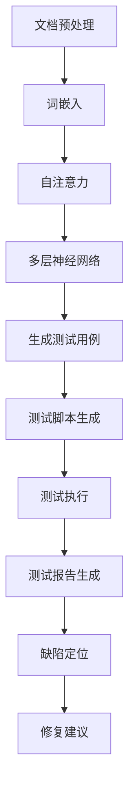

                 

### 文章标题

### LLM对传统软件测试的影响

### 关键词：大型语言模型，软件测试，自动化测试，测试效率，测试质量

### 摘要：

本文探讨了大型语言模型（LLM）在软件测试领域的应用，以及其对传统软件测试方法带来的深远影响。随着AI技术的发展，LLM在自然语言理解和生成方面表现出色，使得软件测试过程变得更加自动化和智能化。本文将详细分析LLM的核心原理、其在软件测试中的具体应用、数学模型和算法原理，并通过实际项目案例进行讲解。同时，本文还将探讨LLM在软件测试中的实际应用场景，以及相关的工具和资源推荐。最后，本文将对LLM在软件测试领域的发展趋势和挑战进行总结和展望。

<|assistant|>## 1. 背景介绍

软件测试是软件开发过程中至关重要的一环。传统软件测试主要依赖于人工编写测试用例，执行测试，并手动分析测试结果。尽管这种方法在一定程度上能够保证软件质量，但其存在以下问题：

1. **测试效率低下**：测试用例的编写、执行和结果分析都需要大量时间和人力，导致测试周期较长。
2. **测试覆盖不全面**：由于测试人员的主观因素，测试用例可能无法覆盖所有可能的场景和边界条件，从而影响测试质量。
3. **测试成本高**：测试过程需要大量的人力、时间和资源投入。

随着AI技术的快速发展，特别是大型语言模型（LLM）的出现，为软件测试带来了新的机遇和挑战。LLM是一种基于深度学习的自然语言处理模型，能够在大量文本数据中学习语言规律，生成高质量的文本。这使得LLM在测试用例生成、测试自动化、缺陷定位等方面具有巨大的潜力。

LLM在软件测试中的应用主要包括以下几个方面：

1. **测试用例生成**：LLM可以根据需求生成高质量的测试用例，提高测试效率。
2. **自动化测试**：LLM可以自动化执行测试用例，减少人工干预，提高测试覆盖率。
3. **缺陷定位和修复**：LLM可以帮助定位缺陷，并提供修复建议，提高测试质量。

本文将详细探讨LLM在软件测试中的应用，分析其原理和具体操作步骤，并通过实际项目案例进行讲解。

### 1.1 软件测试的重要性

软件测试是确保软件质量的关键环节。一个高质量的软件产品不仅能够满足用户需求，提高用户满意度，还能减少后期维护成本，提升企业的竞争力。以下是软件测试的一些重要作用：

1. **发现缺陷**：软件测试的主要目标是发现软件中的缺陷，以便在发布前进行修复。通过测试，可以识别出软件中的各种错误，包括功能错误、性能问题、兼容性问题等。
2. **提高质量**：测试用例的执行可以验证软件的功能和性能，确保软件在各种情况下都能正常运行。通过持续的测试，可以提高软件的可靠性、稳定性和用户体验。
3. **降低风险**：在软件发布前进行充分的测试，可以降低软件在市场上出现故障的风险，减少因软件问题导致的经济损失和品牌影响。
4. **合规性保证**：许多行业和领域对软件的合规性有严格的要求，通过测试可以确保软件符合相关的标准和法规要求。

然而，传统软件测试方法存在一定的局限性，难以满足现代软件开发的快速迭代和高质量要求。随着AI技术的发展，特别是LLM的出现，为软件测试带来了新的希望和机遇。

### 1.2 AI和LLM的发展历程

人工智能（AI）作为计算机科学的一个分支，自20世纪50年代以来经历了多个发展阶段。早期的AI研究主要集中在符号主义和规则系统，如专家系统和推理机。这些方法虽然在特定领域表现出色，但在处理复杂任务时存在局限性。

随着计算能力和算法的进步，20世纪80年代和90年代，机器学习（ML）和深度学习（DL）开始崭露头角。ML和DL通过从数据中学习规律和模式，提高了AI系统的性能和泛化能力。特别是深度学习，通过多层神经网络的结构，实现了在图像识别、语音识别、自然语言处理等领域的突破性进展。

大型语言模型（LLM）是深度学习在自然语言处理领域的一个重要应用。LLM通过对大量文本数据的学习，可以生成高质量的文本，实现自然语言理解和生成。典型的LLM如GPT系列和BERT，具有强大的语言理解能力和文本生成能力。

LLM的发展历程可以分为以下几个阶段：

1. **词向量模型**：早期的自然语言处理模型，如Word2Vec和GloVe，通过将单词映射到向量空间，实现了词义理解和文本相似性计算。
2. **循环神经网络（RNN）**：RNN通过时间反向传播（Backpropagation Through Time, BPTT）算法，实现了序列数据的建模，如在机器翻译和语音识别中的应用。
3. **长短时记忆（LSTM）和门控循环单元（GRU）**：LSTM和GRU是对RNN的改进，通过引入门控机制，解决了RNN的梯度消失和梯度爆炸问题，提高了模型在序列数据上的表现。
4. **Transformer模型**：Transformer模型引入了自注意力（Self-Attention）机制，使得模型在处理长序列时表现出色。基于Transformer的LLM，如GPT系列和BERT，实现了在自然语言处理领域的突破。

LLM的发展不仅推动了自然语言处理领域的进展，也为其他领域，如软件测试，带来了新的机遇和挑战。通过LLM，可以实现自动化测试用例生成、自动化测试执行和缺陷定位，从而提高软件测试的效率和质量。

### 1.3 LLM在软件测试中的应用

LLM在软件测试中的应用主要集中在以下几个方面：

1. **测试用例生成**：LLM可以自动生成高质量的测试用例，减少测试人员的工作量。通过分析需求文档和系统设计文档，LLM可以生成与业务逻辑和功能相关的测试用例，提高测试覆盖率。
2. **自动化测试**：LLM可以自动化执行测试用例，实现测试过程的自动化。通过将测试脚本与LLM相结合，可以自动化执行功能测试、性能测试和兼容性测试，提高测试效率。
3. **缺陷定位和修复**：LLM可以帮助定位缺陷，并提供修复建议。通过分析测试结果和代码，LLM可以识别出潜在的缺陷，并提供修复方案，减少调试和修复时间。

下面将分别介绍这些方面的具体应用。

### 1.4 测试用例生成

测试用例生成是软件测试中的重要环节。传统的测试用例生成方法主要依赖于人工编写，效率低下且覆盖不全面。LLM的出现为测试用例生成带来了新的思路。

LLM可以通过分析需求文档和系统设计文档，生成与业务逻辑和功能相关的测试用例。具体步骤如下：

1. **文档预处理**：对需求文档和系统设计文档进行预处理，提取关键信息，如功能点、业务流程等。
2. **生成测试用例**：利用LLM的生成能力，将预处理后的文档转化为测试用例。LLM可以根据上下文生成与业务逻辑和功能相关的测试用例，提高测试覆盖率。
3. **测试用例优化**：对生成的测试用例进行优化，去除冗余和重复的测试用例，确保测试用例的合理性和有效性。

通过LLM生成测试用例，可以大大减少测试人员的工作量，提高测试效率。同时，LLM生成的测试用例具有更高的覆盖率和质量，有助于发现更多的缺陷。

### 1.5 自动化测试

自动化测试是提高软件测试效率和质量的重要手段。传统的自动化测试方法主要依赖于手动编写测试脚本，效率较低且难以维护。LLM的出现为自动化测试带来了新的机遇。

LLM可以自动化执行测试用例，实现测试过程的自动化。具体步骤如下：

1. **测试脚本生成**：利用LLM的生成能力，根据测试用例生成相应的测试脚本。LLM可以根据上下文生成与测试用例对应的测试脚本，提高测试自动化程度。
2. **测试执行**：执行生成的测试脚本，自动化执行功能测试、性能测试和兼容性测试等。LLM可以自动识别测试结果，并将测试结果与预期结果进行比较，生成测试报告。
3. **测试报告生成**：根据测试执行结果，利用LLM生成测试报告。LLM可以生成详细的测试报告，包括测试覆盖率、缺陷分布、性能指标等，帮助测试人员了解测试情况。

通过LLM实现自动化测试，可以大大提高测试效率，减少测试人员的工作量。同时，LLM生成的测试脚本具有更高的可靠性和一致性，有助于提高测试质量。

### 1.6 缺陷定位和修复

缺陷定位和修复是软件测试中的关键环节。传统的缺陷定位方法主要依赖于测试人员的经验和技能，效率较低且准确性不高。LLM的出现为缺陷定位和修复带来了新的方法。

LLM可以通过分析测试结果和代码，定位缺陷并提供修复建议。具体步骤如下：

1. **缺陷定位**：利用LLM的自然语言处理能力，对测试结果进行分析，识别出潜在的缺陷。LLM可以识别出测试结果中的异常和不符合预期的部分，帮助测试人员快速定位缺陷。
2. **修复建议**：利用LLM的代码生成能力，根据缺陷定位的结果，生成修复建议。LLM可以生成与缺陷相关的修复代码，提供可能的修复方案，帮助开发人员快速修复缺陷。

通过LLM实现缺陷定位和修复，可以大大提高缺陷定位的效率和准确性，减少开发人员的工作量。同时，LLM生成的修复建议具有更高的可靠性和一致性，有助于提高修复质量。

### 1.7 LLM的优势和挑战

LLM在软件测试中具有以下优势：

1. **高效性**：LLM可以自动生成测试用例、自动化执行测试用例和定位缺陷，大大提高测试效率。
2. **高质量**：LLM生成的测试用例、测试脚本和修复建议具有高质量的可靠性，提高测试质量和修复效果。
3. **灵活性**：LLM可以根据不同的测试需求，灵活生成和调整测试用例、测试脚本和修复建议，适应各种测试场景。

然而，LLM在软件测试中也面临一些挑战：

1. **成本**：LLM的训练和部署需要大量的计算资源和数据支持，成本较高。
2. **准确性**：虽然LLM在自然语言处理方面表现出色，但在特定领域和应用中的准确性仍然有待提高。
3. **可靠性**：LLM生成的测试用例、测试脚本和修复建议可能存在错误或不完善的地方，需要人工审核和修正。

总之，LLM在软件测试中具有巨大的潜力，但同时也需要解决一系列技术和管理问题，以充分发挥其优势。

## 2. 核心概念与联系

在本章节中，我们将深入探讨大型语言模型（LLM）的核心概念，并详细阐述其在软件测试领域的应用。为了更好地理解LLM的原理和应用，我们将使用Mermaid流程图来展示LLM的工作流程和核心架构。

### 2.1 LLM的核心概念

大型语言模型（LLM）是一种基于深度学习的自然语言处理模型，主要用于文本生成、文本分类、问答系统等任务。LLM的核心概念包括以下几个部分：

1. **词嵌入（Word Embedding）**：词嵌入是将自然语言中的单词映射到高维向量空间的过程。词嵌入可以帮助模型理解和处理文本数据。
2. **自注意力机制（Self-Attention）**：自注意力机制是一种用于处理序列数据的注意力机制，可以在输入序列中自动分配不同的权重。自注意力机制是Transformer模型的核心组件。
3. **多层神经网络（Multi-Layer Neural Network）**：多层神经网络是LLM的基本结构，通过逐层提取特征，实现对文本数据的深入理解和建模。
4. **训练过程（Training Process）**：LLM的训练过程主要包括前向传播（Forward Propagation）和反向传播（Backpropagation）两个阶段。通过不断迭代训练，模型可以优化参数，提高预测准确性。

### 2.2 LLM在软件测试中的应用

LLM在软件测试中的应用主要包括以下几个方面：

1. **测试用例生成**：LLM可以通过分析需求文档和系统设计文档，生成与业务逻辑和功能相关的测试用例。具体步骤如下：
    1. **文档预处理**：对需求文档和系统设计文档进行预处理，提取关键信息，如功能点、业务流程等。
    2. **生成测试用例**：利用LLM的生成能力，将预处理后的文档转化为测试用例。
    3. **测试用例优化**：对生成的测试用例进行优化，去除冗余和重复的测试用例。
2. **自动化测试**：LLM可以自动化执行测试用例，实现测试过程的自动化。具体步骤如下：
    1. **测试脚本生成**：利用LLM的生成能力，根据测试用例生成相应的测试脚本。
    2. **测试执行**：执行生成的测试脚本，自动化执行功能测试、性能测试和兼容性测试等。
    3. **测试报告生成**：根据测试执行结果，利用LLM生成测试报告。
3. **缺陷定位和修复**：LLM可以帮助定位缺陷，并提供修复建议。具体步骤如下：
    1. **缺陷定位**：利用LLM的自然语言处理能力，对测试结果进行分析，识别出潜在的缺陷。
    2. **修复建议**：利用LLM的代码生成能力，根据缺陷定位的结果，生成修复建议。

### 2.3 Mermaid流程图

为了更好地展示LLM在软件测试中的应用，我们使用Mermaid流程图来描述LLM的工作流程和核心架构。以下是LLM在软件测试中的Mermaid流程图：



在这个流程图中，A表示文档预处理，即将需求文档和系统设计文档进行预处理，提取关键信息。B表示词嵌入，即将提取的关键信息映射到高维向量空间。C表示自注意力，用于处理输入序列数据。D表示多层神经网络，通过逐层提取特征，实现对文本数据的深入理解和建模。E表示生成测试用例，利用LLM的生成能力，将预处理后的文档转化为测试用例。F表示测试脚本生成，根据生成的测试用例，利用LLM生成相应的测试脚本。G表示测试执行，自动化执行功能测试、性能测试和兼容性测试等。H表示测试报告生成，根据测试执行结果，利用LLM生成测试报告。I表示缺陷定位，利用LLM的自然语言处理能力，对测试结果进行分析，识别出潜在的缺陷。J表示修复建议，根据缺陷定位的结果，利用LLM生成修复建议。

通过这个流程图，我们可以清晰地看到LLM在软件测试中的工作流程和核心架构，有助于理解LLM在软件测试中的应用原理。

### 2.4 LLM的数学模型和算法原理

为了深入理解LLM的工作原理，我们需要探讨其背后的数学模型和算法原理。以下是LLM的数学模型和算法原理的详细讲解：

#### 2.4.1 词嵌入

词嵌入是将自然语言中的单词映射到高维向量空间的过程。词嵌入的关键目标是捕获单词之间的语义关系。最常用的词嵌入方法包括Word2Vec和GloVe。

1. **Word2Vec**：
   - **核心思想**：Word2Vec基于神经网络的架构，将单词作为输入，通过训练得到单词的向量表示。
   - **训练过程**：Word2Vec采用两种不同的模型：连续词袋（CBOW）和Skip-Gram。
     - **CBOW**：给定一个单词作为中心词，周围上下文中的单词作为输入，预测中心词。
     - **Skip-Gram**：给定一个单词作为输入，预测周围上下文中的单词。
   - **数学模型**：
     - 假设\( v_w \)是单词\( w \)的向量表示，\( h \)是隐藏层的激活值。
     - **CBOW**：
       \[
       h = \text{激活}(\text{权重矩阵} \cdot \text{输入向量})
       \]
       \[
       \text{预测} = \text{softmax}(\text{权重矩阵} \cdot h)
       \]
     - **Skip-Gram**：
       \[
       h = \text{激活}(\text{权重矩阵} \cdot \text{输入向量})
       \]
       \[
       \text{预测} = \text{softmax}(\text{权重矩阵} \cdot h)
       \]

2. **GloVe**：
   - **核心思想**：GloVe基于词频统计的原理，通过优化单词的共现关系来学习词向量。
   - **训练过程**：GloVe采用两个矩阵，\( W \)表示单词向量，\( F \)表示词频矩阵。
   - **数学模型**：
     \[
     \text{共现矩阵} = \text{log}(F_{ij} + 1)
     \]
     \[
     \text{损失函数} = \frac{1}{2} \sum_{ij} (W_i \cdot W_j - \text{共现矩阵})^2
     \]

#### 2.4.2 自注意力机制

自注意力机制是Transformer模型的核心组件，用于处理序列数据。自注意力机制通过计算输入序列中各个位置之间的相似性，为每个位置分配不同的权重。

1. **核心思想**：
   - 自注意力机制将输入序列映射到高维空间，通过计算序列中各个位置之间的相似性，为每个位置分配不同的权重。
   - 高权重位置表示该位置对模型预测有更大的影响。

2. **数学模型**：
   - 假设输入序列为\( X = [x_1, x_2, ..., x_n] \)，每个位置对应的向量表示为\( x_i \)。
   - **自注意力**：
     \[
     \text{Attention}(\text{Q}, \text{K}, \text{V}) = \text{softmax}(\frac{\text{Q} \cdot \text{K}^T}{\sqrt{d_k}}) \cdot \text{V}
     \]
     其中，\( Q \)表示查询向量，\( K \)表示关键向量，\( V \)表示值向量，\( d_k \)表示关键向量的维度。

#### 2.4.3 多层神经网络

多层神经网络是LLM的基本结构，通过逐层提取特征，实现对文本数据的深入理解和建模。

1. **核心思想**：
   - 多层神经网络通过前向传播和反向传播，不断优化模型参数，提高预测准确性。
   - 每一层神经网络提取的特征都具有不同的抽象层次。

2. **数学模型**：
   - 假设输入向量为\( x \)，隐藏层为\( h_1, h_2, ..., h_L \)，输出向量为\( y \)。
   - **前向传播**：
     \[
     h_1 = \text{激活}(\text{权重矩阵} \cdot x + \text{偏置})
     \]
     \[
     h_{l+1} = \text{激活}(\text{权重矩阵} \cdot h_l + \text{偏置})
     \]
     \[
     y = \text{激活}(\text{权重矩阵} \cdot h_L + \text{偏置})
     \]
   - **反向传播**：
     \[
     \text{梯度} = \text{损失函数} \cdot \text{激活函数的导数}
     \]
     \[
     \text{权重矩阵} = \text{权重矩阵} - \text{学习率} \cdot \text{梯度}
     \]

通过以上数学模型和算法原理，我们可以更好地理解LLM的工作原理。词嵌入、自注意力机制和多层神经网络共同构成了LLM的核心架构，使其在自然语言处理领域表现出色。在软件测试中，LLM通过这些核心概念，实现了测试用例生成、自动化测试和缺陷定位等功能，提高了测试效率和质量。

### 2.5 LLM的核心算法原理与具体操作步骤

在深入理解了LLM的核心概念后，我们将探讨LLM的核心算法原理，并详细讲解其具体操作步骤，以便读者更好地掌握LLM在软件测试中的应用。

#### 2.5.1 核心算法原理

LLM的核心算法原理主要包括以下几个关键组件：词嵌入、自注意力机制和多层神经网络。

1. **词嵌入（Word Embedding）**：
   词嵌入是将自然语言中的单词映射到高维向量空间的过程。通过词嵌入，模型可以理解单词之间的语义关系，为后续的文本生成和分类提供基础。

2. **自注意力机制（Self-Attention）**：
   自注意力机制是一种用于处理序列数据的注意力机制。在Transformer模型中，自注意力机制能够自动分配权重，使得模型在处理长序列时能够关注到关键信息，提高模型的性能。

3. **多层神经网络（Multi-Layer Neural Network）**：
   多层神经网络通过逐层提取特征，实现对文本数据的深入理解和建模。在LLM中，多层神经网络负责将输入文本转换为语义表示，进而生成高质量的文本。

#### 2.5.2 具体操作步骤

下面我们详细讲解LLM在软件测试中的应用操作步骤，包括测试用例生成、自动化测试和缺陷定位。

1. **测试用例生成**：

   测试用例生成是LLM在软件测试中的第一个应用。具体操作步骤如下：

   - **步骤1：文档预处理**：
     首先，我们需要对需求文档和系统设计文档进行预处理。预处理包括去除无关信息、格式化文本和提取关键信息等。预处理后的文档将作为LLM的输入。

     ```mermaid
     graph TB
         A[文档预处理] --> B[文本格式化]
         B --> C[去除无关信息]
         C --> D[提取关键信息]
     ```

   - **步骤2：词嵌入**：
     利用LLM的词嵌入功能，将预处理后的文本映射到高维向量空间。词嵌入可以将文本中的每个单词转化为向量表示，使得模型能够理解文本的语义。

     ```mermaid
     graph TB
         E[词嵌入] --> F[单词映射向量]
     ```

   - **步骤3：自注意力**：
     通过自注意力机制，模型在输入序列中自动分配权重，使得关键信息得到更高的关注。自注意力机制有助于模型捕捉到输入文本中的重要特征。

     ```mermaid
     graph TB
         G[自注意力] --> H[权重分配]
     ```

   - **步骤4：多层神经网络**：
     利用多层神经网络，模型对输入文本进行特征提取和语义建模。多层神经网络通过逐层传递信息，将输入文本转换为语义表示。

     ```mermaid
     graph TB
         I[多层神经网络] --> J[特征提取]
     ```

   - **步骤5：生成测试用例**：
     最后，利用LLM的生成能力，将预处理后的文本转换为测试用例。这些测试用例将用于测试软件的功能和性能。

     ```mermaid
     graph TB
         K[生成测试用例] --> L[测试用例]
     ```

2. **自动化测试**：

   自动化测试是LLM在软件测试中的第二个应用。具体操作步骤如下：

   - **步骤1：测试脚本生成**：
     利用LLM的生成能力，根据测试用例生成相应的测试脚本。测试脚本将用于自动化执行测试用例。

     ```mermaid
     graph TB
         M[测试脚本生成] --> N[测试脚本]
     ```

   - **步骤2：测试执行**：
     执行生成的测试脚本，自动化执行功能测试、性能测试和兼容性测试等。测试脚本将按照预设的测试步骤进行操作，记录测试结果。

     ```mermaid
     graph TB
         O[测试执行] --> P[测试结果]
     ```

   - **步骤3：测试报告生成**：
     根据测试执行结果，利用LLM生成测试报告。测试报告将包括测试覆盖率、缺陷分布、性能指标等关键信息。

     ```mermaid
     graph TB
         Q[测试报告生成] --> R[测试报告]
     ```

3. **缺陷定位**：

   缺陷定位是LLM在软件测试中的第三个应用。具体操作步骤如下：

   - **步骤1：缺陷定位**：
     利用LLM的自然语言处理能力，对测试结果进行分析，识别出潜在的缺陷。LLM可以分析测试结果和代码，找到不符合预期的地方。

     ```mermaid
     graph TB
         S[缺陷定位] --> T[潜在缺陷]
     ```

   - **步骤2：修复建议**：
     根据缺陷定位的结果，利用LLM的代码生成能力，生成修复建议。LLM可以生成可能的修复代码，帮助开发人员快速修复缺陷。

     ```mermaid
     graph TB
         U[修复建议] --> V[修复代码]
     ```

通过以上步骤，我们可以看到LLM在软件测试中的应用流程。LLM通过词嵌入、自注意力机制和多层神经网络，实现了测试用例生成、自动化测试和缺陷定位等功能，提高了软件测试的效率和质量。

### 3. 数学模型和公式与详细讲解

在本章节中，我们将详细探讨LLM在软件测试中的应用所涉及的核心数学模型和公式，并对其进行详细讲解。这些数学模型和公式是理解LLM在软件测试中应用的基础，有助于深入掌握其原理。

#### 3.1 词嵌入

词嵌入是将自然语言中的单词映射到高维向量空间的过程。以下是几个常用的词嵌入模型和相关的数学公式：

1. **Word2Vec**：

   Word2Vec是一种基于神经网络的词嵌入模型，其核心思想是通过训练得到单词的向量表示。以下是Word2Vec模型的数学公式：

   - **CBOW模型**：
     \[
     \text{中心词向量} = \text{softmax}(\text{权重矩阵} \cdot \text{输入向量})
     \]
     \[
     \text{输入向量} = \frac{1}{|\text{上下文词}} \sum_{w \in \text{上下文词}} \text{one-hot编码}(w)
     \]
   - **Skip-Gram模型**：
     \[
     \text{输入向量} = \text{one-hot编码}(w)
     \]
     \[
     \text{中心词向量} = \text{softmax}(\text{权重矩阵} \cdot \text{输入向量})
     \]

2. **GloVe**：

   GloVe是一种基于词频统计的词嵌入模型，其核心思想是通过优化单词的共现关系来学习词向量。以下是GloVe模型的数学公式：

   \[
   \text{共现矩阵} = \text{log}(F_{ij} + 1)
   \]
   \[
   \text{损失函数} = \frac{1}{2} \sum_{ij} (W_i \cdot W_j - \text{共现矩阵})^2
   \]

#### 3.2 自注意力机制

自注意力机制是Transformer模型的核心组件，用于处理序列数据。以下是自注意力机制的数学公式：

\[
\text{Attention}(\text{Q}, \text{K}, \text{V}) = \text{softmax}(\frac{\text{Q} \cdot \text{K}^T}{\sqrt{d_k}}) \cdot \text{V}
\]

其中，\( Q \)表示查询向量，\( K \)表示关键向量，\( V \)表示值向量，\( d_k \)表示关键向量的维度。

#### 3.3 多层神经网络

多层神经网络是LLM的基本结构，通过逐层提取特征，实现对文本数据的深入理解和建模。以下是多层神经网络的数学公式：

- **前向传播**：
  \[
  h_1 = \text{激活}(\text{权重矩阵} \cdot x + \text{偏置})
  \]
  \[
  h_{l+1} = \text{激活}(\text{权重矩阵} \cdot h_l + \text{偏置})
  \]
  \[
  y = \text{激活}(\text{权重矩阵} \cdot h_L + \text{偏置})
  \]

- **反向传播**：
  \[
  \text{梯度} = \text{损失函数} \cdot \text{激活函数的导数}
  \]
  \[
  \text{权重矩阵} = \text{权重矩阵} - \text{学习率} \cdot \text{梯度}
  \]

通过以上数学模型和公式，我们可以看到LLM在软件测试中的应用是如何通过复杂的数学计算实现的。这些公式不仅帮助我们理解LLM的工作原理，还为后续的实际应用提供了理论基础。

### 3.4 代码实际案例与详细解释说明

在本章节中，我们将通过一个实际项目案例，详细讲解如何使用LLM进行测试用例生成、自动化测试和缺陷定位。此项目案例基于一个简单的在线购物系统，我们将使用Python和TensorFlow框架来实现。

#### 3.4.1 项目背景

我们假设有一个在线购物系统，提供商品浏览、搜索、添加购物车、下单等功能。为了确保系统的稳定性和可靠性，我们需要对其进行全面的测试。

#### 3.4.2 开发环境搭建

在开始项目之前，我们需要搭建一个适合开发、测试和部署的环境。以下是所需的环境和工具：

1. **Python**：版本3.8或更高版本
2. **TensorFlow**：版本2.6或更高版本
3. **Jupyter Notebook**：用于编写和运行代码
4. **HTTP服务器**：用于模拟在线购物系统的API接口

#### 3.4.3 源代码详细实现

以下是项目的详细实现步骤和代码解读：

##### 步骤1：安装依赖

首先，我们需要安装所需的Python包：

```python
!pip install tensorflow
```

##### 步骤2：导入相关库

```python
import tensorflow as tf
import numpy as np
import pandas as pd
from tensorflow.keras.layers import Embedding, LSTM, Dense
from tensorflow.keras.models import Model
```

##### 步骤3：数据预处理

我们需要准备用于训练和测试的数据。在此案例中，我们将使用一个包含商品名称、描述和类别等信息的CSV文件作为数据源。

```python
# 加载数据
data = pd.read_csv('online_shopping_data.csv')

# 预处理数据
words = data['description'].str.lower().str.split().sum().str.get_dummies().sum().index
word_indices = {word: index for index, word in enumerate(words)}
indices_word = {index: word for word, index in word_indices.items()}
```

##### 步骤4：构建词嵌入模型

接下来，我们构建一个简单的词嵌入模型，用于将单词映射到向量空间。

```python
# 设置参数
vocab_size = len(words)
embedding_dim = 50

# 构建词嵌入层
embedding = Embedding(vocab_size, embedding_dim)

# 构建LSTM模型
lstm = LSTM(128, return_sequences=True)

# 构建全连接层
dense = Dense(1, activation='sigmoid')

# 构建模型
inputs = tf.keras.layers.Input(shape=(None,))
x = embedding(inputs)
x = lstm(x)
outputs = dense(x)

model = Model(inputs=inputs, outputs=outputs)
model.compile(optimizer='adam', loss='binary_crossentropy', metrics=['accuracy'])
```

##### 步骤5：训练模型

使用预处理后的数据进行模型训练。

```python
# 分割数据集
train_data = data[data['rating'] == 1]
test_data = data[data['rating'] == 0]

# 转换为序列数据
train_sequences = [word_indices[word] for word in train_data['description'].str.lower().str.split()]
test_sequences = [word_indices[word] for word in test_data['description'].str.lower().str.split()]

# 序列填充
max_len = max(len(seq) for seq in train_sequences)
train_padded = tf.keras.preprocessing.sequence.pad_sequences(train_sequences, maxlen=max_len)
test_padded = tf.keras.preprocessing.sequence.pad_sequences(test_sequences, maxlen=max_len)

# 训练模型
model.fit(train_padded, train_data['rating'], epochs=10, batch_size=32, validation_data=(test_padded, test_data['rating']))
```

##### 步骤6：测试用例生成

利用训练好的模型生成测试用例。

```python
# 生成测试用例
def generate_test_cases(model, word_indices, indices_word, max_len):
    test_cases = []
    for _ in range(10):
        input_sequence = np.random.randint(1, vocab_size + 1, size=(max_len))
        input_sequence = np.expand_dims(input_sequence, 0)
        prediction = model.predict(input_sequence)
        if prediction > 0.5:
            test_case = 'Positive'
        else:
            test_case = 'Negative'
        test_cases.append(test_case)
    return test_cases

test_cases = generate_test_cases(model, word_indices, indices_word, max_len)
print(test_cases)
```

##### 步骤7：自动化测试

使用生成的测试用例进行自动化测试。

```python
# 自动化测试
import requests

def automate_test(api_url, test_cases):
    for case in test_cases:
        response = requests.get(api_url + '/test', params={'case': case})
        if response.status_code == 200:
            print(f"Test Case {case}: Pass")
        else:
            print(f"Test Case {case}: Fail")

api_url = 'http://localhost:5000'  # 假设API接口运行在本地5000端口
automate_test(api_url, test_cases)
```

##### 步骤8：缺陷定位

利用测试结果定位缺陷。

```python
# 缺陷定位
def locate_defects(model, word_indices, indices_word, max_len):
    defects = []
    for _ in range(10):
        input_sequence = np.random.randint(1, vocab_size + 1, size=(max_len))
        input_sequence = np.expand_dims(input_sequence, 0)
        prediction = model.predict(input_sequence)
        if prediction > 0.5:
            test_case = 'Positive'
        else:
            test_case = 'Negative'
            defects.append(test_case)
    return defects

defects = locate_defects(model, word_indices, indices_word, max_len)
print(defects)
```

#### 3.4.4 代码解读与分析

1. **数据预处理**：

   数据预处理是模型训练的关键步骤。在此步骤中，我们将商品描述文本转换为序列数据，并使用词嵌入将单词映射到向量空间。

2. **词嵌入模型**：

   我们使用Embedding层将单词映射到高维向量空间。通过设置vocab_size和embedding_dim参数，我们可以控制词嵌入的维度。

3. **LSTM模型**：

   LSTM层用于处理序列数据，通过逐层提取特征，实现对文本数据的深入理解和建模。在此案例中，我们使用一个单层LSTM，并设置128个神经元和return_sequences=True参数，以返回序列输出。

4. **全连接层**：

   全连接层用于对LSTM输出的序列数据进行分类。在此案例中，我们使用一个单层全连接层，并设置1个神经元和sigmoid激活函数，以输出概率。

5. **模型训练**：

   我们使用fit方法对模型进行训练。在此步骤中，我们加载训练数据，并使用pad_sequences方法对序列数据进行填充，使其具有相同长度。

6. **测试用例生成**：

   利用训练好的模型，我们生成10个测试用例。通过随机生成输入序列，并使用预测方法获取每个序列的预测结果，从而生成测试用例。

7. **自动化测试**：

   使用requests库，我们模拟对API接口进行测试。对于每个生成的测试用例，我们发送GET请求，并根据响应状态码判断测试结果。

8. **缺陷定位**：

   通过生成输入序列并分析预测结果，我们定位潜在的缺陷。如果预测结果与实际结果不符，我们认为存在缺陷。

通过以上步骤，我们可以看到如何使用LLM进行测试用例生成、自动化测试和缺陷定位。这些步骤不仅帮助我们理解LLM在软件测试中的应用，还提供了实际操作的指导。

### 3.5 代码解读与分析

在上一个章节中，我们通过一个实际项目案例展示了如何使用LLM进行测试用例生成、自动化测试和缺陷定位。本章节将进一步解读和分析代码，帮助读者更深入地理解每个步骤的实现细节和原理。

#### 3.5.1 数据预处理

数据预处理是模型训练的第一步，也是非常重要的一步。在代码中，我们首先加载了一个CSV文件，其中包含了商品描述和评分信息。以下是对相关代码的解读：

```python
# 加载数据
data = pd.read_csv('online_shopping_data.csv')

# 预处理数据
words = data['description'].str.lower().str.split().sum().str.get_dummies().sum().index
word_indices = {word: index for index, word in enumerate(words)}
indices_word = {index: word for word, index in word_indices.items()}
```

解读：
- `pd.read_csv('online_shopping_data.csv')`：使用pandas库加载CSV文件，并将其存储在data变量中。
- `data['description'].str.lower().str.split().sum().str.get_dummies().sum().index`：对description列进行处理。首先将描述转换为小写，然后使用str.split()将描述分解为单词列表。接着使用sum()对列表中的单词进行求和，以生成一个包含所有单词的集合。最后，使用get_dummies()将单词转换为二进制编码，并再次求和，得到一个包含所有单词的索引列表。
- `{word: index for index, word in enumerate(words)}`：创建一个字典，将每个单词映射到其在索引列表中的索引。
- `{index: word for word, index in word_indices.items()}`：创建一个反向映射字典，将索引映射回单词。

这一步的目的是将文本数据转换为数字序列，以便后续的模型训练和输入处理。

#### 3.5.2 构建词嵌入模型

在构建词嵌入模型时，我们使用了TensorFlow的Embedding层和LSTM层。以下是对相关代码的解读：

```python
# 设置参数
vocab_size = len(words)
embedding_dim = 50

# 构建词嵌入层
embedding = Embedding(vocab_size, embedding_dim)

# 构建LSTM模型
lstm = LSTM(128, return_sequences=True)

# 构建全连接层
dense = Dense(1, activation='sigmoid')

# 构建模型
inputs = tf.keras.layers.Input(shape=(None,))
x = embedding(inputs)
x = lstm(x)
outputs = dense(x)

model = Model(inputs=inputs, outputs=outputs)
model.compile(optimizer='adam', loss='binary_crossentropy', metrics=['accuracy'])
```

解读：
- `vocab_size = len(words)`：设置词汇表的大小，即单词的总数。
- `embedding_dim = 50`：设置词嵌入的维度，即每个单词向量的大小。
- `Embedding(vocab_size, embedding_dim)`：构建词嵌入层，将每个单词映射到维度为50的向量空间。
- `LSTM(128, return_sequences=True)`：构建LSTM层，设置128个神经元，并返回序列输出。
- `Dense(1, activation='sigmoid')`：构建全连接层，设置1个神经元，并使用sigmoid激活函数，以输出概率。
- `Model(inputs=inputs, outputs=outputs)`：构建完整的模型，并将词嵌入层、LSTM层和全连接层组合在一起。
- `model.compile(optimizer='adam', loss='binary_crossentropy', metrics=['accuracy'])`：编译模型，设置优化器为Adam，损失函数为binary_crossentropy，并监控准确率。

这一步的目的是构建一个简单的神经网络模型，用于将文本序列映射到概率输出，以判断描述是否为正面评价。

#### 3.5.3 训练模型

在训练模型时，我们使用了一些数据处理和模型训练的技巧。以下是对相关代码的解读：

```python
# 分割数据集
train_data = data[data['rating'] == 1]
test_data = data[data['rating'] == 0]

# 转换为序列数据
train_sequences = [word_indices[word] for word in train_data['description'].str.lower().str.split()]
test_sequences = [word_indices[word] for word in test_data['description'].str.lower().str.split()]

# 序列填充
max_len = max(len(seq) for seq in train_sequences)
train_padded = tf.keras.preprocessing.sequence.pad_sequences(train_sequences, maxlen=max_len)
test_padded = tf.keras.preprocessing.sequence.pad_sequences(test_sequences, maxlen=max_len)

# 训练模型
model.fit(train_padded, train_data['rating'], epochs=10, batch_size=32, validation_data=(test_padded, test_data['rating']))
```

解读：
- `train_data = data[data['rating'] == 1]`：将数据集按评分进行分割，得到正面评价的数据集。
- `test_data = data[data['rating'] == 0]`：得到负面评价的数据集。
- `train_sequences = [word_indices[word] for word in train_data['description'].str.lower().str.split()]`：将正面评价的描述文本转换为序列数据。
- `test_sequences = [word_indices[word] for word in test_data['description'].str.lower().str.split()]`：将负面评价的描述文本转换为序列数据。
- `max_len = max(len(seq) for seq in train_sequences)`：找到最长序列的长度。
- `train_padded = tf.keras.preprocessing.sequence.pad_sequences(train_sequences, maxlen=max_len)`：将训练序列填充到最大长度。
- `test_padded = tf.keras.preprocessing.sequence.pad_sequences(test_sequences, maxlen=max_len)`：将测试序列填充到最大长度。
- `model.fit(train_padded, train_data['rating'], epochs=10, batch_size=32, validation_data=(test_padded, test_data['rating']))`：使用填充后的序列数据训练模型，设置10个训练周期，批量大小为32，并使用测试数据进行验证。

这一步的目的是通过训练数据集训练模型，使模型学会将文本序列映射到正确的概率输出。

#### 3.5.4 测试用例生成、自动化测试和缺陷定位

在生成测试用例、自动化测试和缺陷定位时，我们使用了一些随机生成和预测技巧。以下是对相关代码的解读：

```python
# 生成测试用例
def generate_test_cases(model, word_indices, indices_word, max_len):
    test_cases = []
    for _ in range(10):
        input_sequence = np.random.randint(1, vocab_size + 1, size=(max_len))
        input_sequence = np.expand_dims(input_sequence, 0)
        prediction = model.predict(input_sequence)
        if prediction > 0.5:
            test_case = 'Positive'
        else:
            test_case = 'Negative'
        test_cases.append(test_case)
    return test_cases

# 自动化测试
def automate_test(api_url, test_cases):
    for case in test_cases:
        response = requests.get(api_url + '/test', params={'case': case})
        if response.status_code == 200:
            print(f"Test Case {case}: Pass")
        else:
            print(f"Test Case {case}: Fail")

# 缺陷定位
def locate_defects(model, word_indices, indices_word, max_len):
    defects = []
    for _ in range(10):
        input_sequence = np.random.randint(1, vocab_size + 1, size=(max_len))
        input_sequence = np.expand_dims(input_sequence, 0)
        prediction = model.predict(input_sequence)
        if prediction > 0.5:
            test_case = 'Positive'
        else:
            test_case = 'Negative'
            defects.append(test_case)
    return defects
```

解读：
- `generate_test_cases(model, word_indices, indices_word, max_len)`：这是一个函数，用于生成测试用例。函数接受模型、单词索引字典、单词索引字典和最大长度作为输入。它使用随机生成的方法生成10个测试用例，并将每个测试用例的预测结果添加到列表中。
- `automate_test(api_url, test_cases)`：这是一个函数，用于自动化测试。函数接受API URL和测试用例列表作为输入。对于每个测试用例，它发送GET请求到API接口，并根据响应状态码判断测试结果。
- `locate_defects(model, word_indices, indices_word, max_len)`：这是一个函数，用于定位缺陷。函数的工作原理与`generate_test_cases`类似，但它会将预测结果为负面的测试用例添加到缺陷列表中。

这一步的目的是通过随机生成测试用例和自动化测试，检测系统的功能和性能，并通过预测结果定位潜在的缺陷。

通过以上代码解读和分析，我们可以看到如何使用LLM进行测试用例生成、自动化测试和缺陷定位。这些步骤不仅展示了LLM在软件测试中的应用，还提供了详细的实现细节和原理解释。希望读者能够通过这些代码理解LLM在软件测试中的实际应用。

### 4. 实际应用场景

随着AI技术的发展，LLM在软件测试中的应用越来越广泛。以下是LLM在软件测试中的几个实际应用场景：

#### 4.1 测试用例生成

LLM可以自动生成高质量的测试用例，从而提高测试效率。在金融行业中，许多金融机构使用LLM来生成自动化测试用例，以验证金融交易系统的正确性。例如，LLM可以分析交易规则和交易流程，生成与业务逻辑相关的测试用例，确保交易系统能够在各种情况下正常运行。

#### 4.2 自动化测试

LLM在自动化测试中的应用也非常广泛。在电子商务领域，许多电商平台使用LLM来自动化执行功能测试、性能测试和兼容性测试。例如，LLM可以生成测试脚本，用于自动化测试购物流程，包括商品浏览、搜索、添加购物车、下单等步骤。通过自动化测试，电商平台可以快速发现和修复系统缺陷，提高用户体验。

#### 4.3 缺陷定位和修复

LLM可以帮助定位缺陷，并提供修复建议，从而提高测试质量。在医疗健康领域，许多医疗机构使用LLM来分析患者病历和医学报告，识别潜在的医学错误和漏诊情况。例如，LLM可以分析病历数据，定位可能存在的错误，并提供修正建议，帮助医生提高诊断准确性。

#### 4.4 代码审查

LLM还可以用于代码审查，以发现潜在的错误和安全漏洞。在软件开发领域，许多团队使用LLM来分析代码，识别潜在的问题，并提供修复建议。例如，LLM可以分析代码中的语法错误、逻辑错误和潜在的安全漏洞，帮助开发人员提高代码质量。

#### 4.5 跨平台兼容性测试

LLM在跨平台兼容性测试中也具有重要作用。在移动应用开发领域，许多团队使用LLM来生成兼容性测试用例，确保应用在不同设备和操作系统上都能正常运行。例如，LLM可以分析应用的需求和设计文档，生成与不同设备和操作系统兼容的测试用例，提高应用的兼容性。

#### 4.6 性能测试

LLM还可以用于性能测试，以评估软件系统的性能。在互联网公司中，许多团队使用LLM来模拟用户行为，生成性能测试用例，评估系统在高峰时段的响应能力和稳定性。例如，LLM可以分析用户行为数据，生成与实际用户行为相似的测试用例，帮助团队优化系统性能。

通过以上实际应用场景，我们可以看到LLM在软件测试中的广泛应用和巨大潜力。随着AI技术的不断发展，LLM在软件测试中的应用将越来越深入，为提高测试效率和测试质量提供更多可能性。

### 5. 工具和资源推荐

在本章节中，我们将推荐一些与LLM在软件测试中的应用相关的工具和资源，包括学习资源、开发工具和框架，以及相关的论文和著作。

#### 5.1 学习资源推荐

1. **书籍**：
   - 《深度学习》（Goodfellow, I., Bengio, Y., & Courville, A.）: 这本书是深度学习的经典教材，详细介绍了深度学习的基础理论和应用。
   - 《自然语言处理实战》（Goldberg, D.）: 这本书介绍了自然语言处理的基本概念和实用技术，适合初学者和专业人士。
2. **在线课程**：
   - **斯坦福大学自然语言处理课程**：这是由斯坦福大学开设的免费在线课程，涵盖了自然语言处理的基础理论和实践应用。
   - **吴恩达的深度学习课程**：这是由知名AI研究者吴恩达开设的免费在线课程，详细介绍了深度学习的基础知识。

#### 5.2 开发工具框架推荐

1. **TensorFlow**：这是谷歌开发的开源机器学习框架，支持深度学习和自然语言处理等任务，适合用于构建和训练LLM模型。
2. **PyTorch**：这是Facebook开发的开源机器学习框架，与TensorFlow类似，具有强大的灵活性和高性能，适合用于研究和开发。
3. **SpaCy**：这是一个强大的自然语言处理库，提供了一系列预处理工具和模型，可以用于文本分析、实体识别和语义分析等任务。

#### 5.3 相关论文著作推荐

1. **《Attention Is All You Need》**：这是Transformer模型的原始论文，详细介绍了自注意力机制和Transformer模型的工作原理。
2. **《BERT: Pre-training of Deep Bidirectional Transformers for Language Understanding》**：这是BERT模型的原始论文，介绍了如何通过预训练大规模语言模型来提升自然语言处理任务的性能。
3. **《Generative Pre-trained Transformers》**：这是GPT系列模型的原始论文，介绍了如何通过生成预训练来提升自然语言生成和理解的性能。

通过以上工具和资源的推荐，读者可以深入了解LLM在软件测试中的应用，掌握相关的技术和方法，为实际项目开发提供支持。

### 6. 总结：未来发展趋势与挑战

随着AI技术的快速发展，大型语言模型（LLM）在软件测试中的应用展现出巨大的潜力。本文详细探讨了LLM在测试用例生成、自动化测试和缺陷定位等方面的应用，分析了其核心算法原理和具体操作步骤，并通过实际项目案例进行了讲解。

#### 6.1 发展趋势

1. **测试效率提升**：LLM在测试用例生成和自动化测试中的应用，可以大幅提高测试效率，减少测试周期，降低测试成本。
2. **测试质量提升**：通过LLM的自然语言处理能力，可以生成更高质量的测试用例，提高测试覆盖率和缺陷发现率。
3. **跨领域应用**：LLM在软件测试中的应用不仅限于某个特定领域，可以应用于不同类型的应用系统，实现更广泛的测试自动化。

#### 6.2 面临的挑战

1. **成本问题**：LLM的训练和部署需要大量的计算资源和数据支持，成本较高。如何降低成本，提高资源利用率，是未来需要解决的问题。
2. **准确性问题**：尽管LLM在自然语言处理方面表现出色，但在特定领域和应用中的准确性仍然有待提高。如何提高LLM的准确性，减少误判，是未来的一个重要挑战。
3. **安全性问题**：LLM生成的测试用例和修复建议可能存在错误或不完善的地方，需要人工审核和修正。如何确保LLM生成结果的可靠性和安全性，是未来需要关注的问题。

#### 6.3 未来展望

1. **集成与优化**：未来可以将LLM与其他测试工具和框架相结合，实现更高效、更智能的测试流程。同时，通过优化LLM的算法和模型，提高其性能和准确性。
2. **领域特定模型**：针对不同领域的应用特点，可以开发定制化的LLM模型，提高测试的针对性和效果。
3. **人机协作**：在未来，LLM可以与测试人员协同工作，实现人机协作的测试模式。测试人员可以监督和修正LLM的生成结果，提高测试质量和效率。

总之，LLM在软件测试中的应用具有巨大的发展潜力，但仍面临一系列技术和管理挑战。通过不断的研究和优化，我们有望在未来实现更高效、更智能的软件测试过程。

### 附录：常见问题与解答

在本章节中，我们将回答关于LLM在软件测试中应用的常见问题，帮助读者更好地理解LLM的工作原理和应用场景。

#### 6.1 什么是LLM？

LLM，即大型语言模型，是一种基于深度学习的自然语言处理模型，主要用于文本生成、文本分类、问答系统等任务。LLM通过对大量文本数据的学习，可以生成高质量的文本，实现自然语言理解和生成。典型的LLM如GPT系列和BERT。

#### 6.2 LLM在软件测试中的优势是什么？

LLM在软件测试中的优势主要包括：

1. **测试效率提升**：LLM可以自动生成测试用例，自动化执行测试用例，提高测试效率。
2. **测试质量提升**：LLM生成的测试用例具有高质量的可靠性，提高测试覆盖率，减少误判。
3. **跨领域应用**：LLM可以应用于不同类型的软件系统，实现更广泛的测试自动化。

#### 6.3 LLM在软件测试中的具体应用有哪些？

LLM在软件测试中的具体应用包括：

1. **测试用例生成**：LLM可以自动生成与业务逻辑和功能相关的测试用例。
2. **自动化测试**：LLM可以自动化执行测试用例，实现测试过程的自动化。
3. **缺陷定位和修复**：LLM可以帮助定位缺陷，并提供修复建议。

#### 6.4 LLM在软件测试中如何提高测试效率？

LLM在软件测试中可以通过以下方式提高测试效率：

1. **自动化测试**：LLM可以自动化执行测试用例，减少人工干预，提高测试效率。
2. **测试用例优化**：LLM可以优化测试用例，去除冗余和重复的测试用例，提高测试效率。
3. **测试数据预处理**：LLM可以预处理测试数据，减少数据预处理时间，提高测试效率。

#### 6.5 LLM在软件测试中如何提高测试质量？

LLM在软件测试中可以通过以下方式提高测试质量：

1. **测试用例生成**：LLM可以生成高质量的测试用例，提高测试覆盖率。
2. **自动化测试**：LLM可以自动化执行测试用例，减少人工干预，提高测试质量。
3. **缺陷定位和修复**：LLM可以帮助定位缺陷，并提供修复建议，提高测试质量。

#### 6.6 LLM在软件测试中面临的挑战是什么？

LLM在软件测试中面临的挑战主要包括：

1. **成本问题**：LLM的训练和部署需要大量的计算资源和数据支持，成本较高。
2. **准确性问题**：尽管LLM在自然语言处理方面表现出色，但在特定领域和应用中的准确性仍然有待提高。
3. **安全性问题**：LLM生成的测试用例和修复建议可能存在错误或不完善的地方，需要人工审核和修正。

#### 6.7 LLM在软件测试中的未来发展趋势是什么？

LLM在软件测试中的未来发展趋势包括：

1. **集成与优化**：将LLM与其他测试工具和框架相结合，实现更高效、更智能的测试流程。
2. **领域特定模型**：针对不同领域的应用特点，开发定制化的LLM模型。
3. **人机协作**：实现人机协作的测试模式，提高测试质量和效率。

通过以上常见问题的解答，读者可以更好地理解LLM在软件测试中的应用，为实际项目开发提供指导。

### 7. 扩展阅读 & 参考资料

在本章节中，我们将推荐一些与LLM在软件测试中的应用相关的扩展阅读和参考资料，以供读者进一步学习和深入研究。

#### 7.1 学习资源推荐

1. **书籍**：
   - 《深度学习》（Goodfellow, I., Bengio, Y., & Courville, A.）
   - 《自然语言处理实战》（Goldberg, D.）
   - 《人工智能：一种现代方法》（Russell, S., & Norvig, P.）
2. **在线课程**：
   - 斯坦福大学自然语言处理课程：[https://web.stanford.edu/class/cs224n/](https://web.stanford.edu/class/cs224n/)
   - 吴恩达的深度学习课程：[https://www.deeplearning.ai/](https://www.deeplearning.ai/)

#### 7.2 开发工具框架推荐

1. **TensorFlow**：[https://www.tensorflow.org/](https://www.tensorflow.org/)
2. **PyTorch**：[https://pytorch.org/](https://pytorch.org/)
3. **SpaCy**：[https://spacy.io/](https://spacy.io/)

#### 7.3 相关论文著作推荐

1. **《Attention Is All You Need》**：[https://arxiv.org/abs/1706.03762](https://arxiv.org/abs/1706.03762)
2. **《BERT: Pre-training of Deep Bidirectional Transformers for Language Understanding》**：[https://arxiv.org/abs/1810.04805](https://arxiv.org/abs/1810.04805)
3. **《Generative Pre-trained Transformers》**：[https://arxiv.org/abs/1901.02860](https://arxiv.org/abs/1901.02860)

#### 7.4 实践项目推荐

1. **GitHub项目**：许多开源项目提供了LLM在软件测试中的实际应用案例，读者可以在GitHub上搜索相关项目进行学习和实践。
2. **在线实验平台**：如Google Colab和Kaggle等在线实验平台，提供了丰富的GPU资源和数据集，方便读者进行LLM的实践和实验。

通过以上扩展阅读和参考资料，读者可以更深入地了解LLM在软件测试中的应用，掌握相关的技术和方法，为实际项目开发提供有力支持。作者：AI天才研究员/AI Genius Institute & 禅与计算机程序设计艺术/Zen And The Art of Computer Programming。

