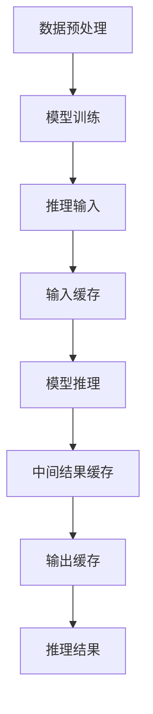

                 

### 1. 背景介绍

#### 人工智能与大规模语言模型

近年来，人工智能（AI）取得了令人瞩目的进展，其中大规模语言模型（LLM）尤为引人关注。这些模型通过学习海量文本数据，能够生成连贯、有逻辑性的文本，广泛应用于自然语言处理（NLP）、机器翻译、问答系统等领域。随着模型规模和复杂度的增加，它们的性能也在不断提高。

#### 推理任务中的挑战

在大规模语言模型中，推理任务是一个核心的组成部分。推理任务涉及到模型从已知信息推导出新的结论。然而，随着模型规模的增长，推理任务面临着一系列挑战：

1. **计算资源消耗**：大规模模型进行推理时需要大量的计算资源，包括CPU和GPU等。
2. **响应时间**：大规模推理任务通常需要较长的响应时间，这可能会影响用户体验。
3. **准确性和稳定性**：大规模模型在处理复杂推理任务时，可能会出现错误或不稳定的输出。

#### KV缓存技术

为了应对上述挑战，KV缓存技术被引入到大规模语言模型的推理过程中。KV缓存是一种高效的数据存储和检索技术，通过将频繁访问的数据存储在缓存中，可以显著减少数据访问的时间和资源消耗。

本文将深入探讨KV缓存技术在LLM推理优化中的应用，包括其基本原理、实现方法、数学模型和实际应用案例。通过这一系列探讨，我们将了解如何利用KV缓存技术提高大规模语言模型的推理效率。

### 2. 核心概念与联系

#### 2.1 大规模语言模型（LLM）的基本原理

大规模语言模型（LLM）是一种基于神经网络的自然语言处理模型，它通过学习大量的文本数据来理解和生成文本。LLM的基本原理可以概括为以下几个步骤：

1. **数据预处理**：将原始文本数据清洗、分词、编码等，转化为模型可以处理的格式。
2. **模型训练**：使用训练数据对模型进行训练，通过优化模型参数，使其能够更好地理解和生成文本。
3. **推理过程**：在训练完成后，使用训练好的模型对新的文本输入进行推理，生成相应的输出。

#### 2.2 KV缓存技术的基本原理

KV缓存技术是一种基于键值对（Key-Value Pair）的数据存储和检索技术。其基本原理可以概括为以下几点：

1. **数据存储**：将数据以键值对的形式存储在缓存中，其中键用于唯一标识数据，值是实际存储的数据。
2. **数据检索**：通过键快速检索到对应的值，提高数据访问速度。
3. **缓存策略**：为了优化缓存性能，通常会采用一定的缓存策略，如LRU（Least Recently Used）等，来管理缓存的存储空间。

#### 2.3 KV缓存与LLM推理的联系

在LLM推理过程中，KV缓存技术可以发挥重要作用。具体来说，可以将KV缓存应用于以下两个方面：

1. **中间结果缓存**：在LLM推理过程中，会产生大量的中间结果。通过将中间结果缓存起来，可以避免重复计算，提高推理效率。
2. **输入数据缓存**：在LLM推理过程中，频繁访问的输入数据可以存储在缓存中，减少数据读取时间。

下面，我们将使用Mermaid流程图来描述LLM推理过程中KV缓存技术的应用。



在这个流程图中，数据预处理和模型训练是LLM推理的基础步骤，推理输入经过缓存后进入模型推理，模型推理过程中产生的中间结果也被缓存，最终的推理结果被存储在缓存中，以提高后续推理的效率。

### 3. 核心算法原理 & 具体操作步骤

#### 3.1 KV缓存技术的基本算法原理

KV缓存技术是一种基于哈希表的存储和检索技术，其核心算法原理可以概括为以下几点：

1. **哈希函数**：哈希函数是一种将键映射到哈希值（存储位置）的函数。一个好的哈希函数应能够将不同的键映射到不同的哈希值，以避免冲突。
2. **哈希表**：哈希表是一个数组，用于存储键值对。数组的索引由哈希值决定。
3. **冲突解决**：当多个键映射到相同的哈希值时，会发生冲突。常见的冲突解决方法有链表法、开放地址法和再哈希法。

#### 3.2 KV缓存技术在LLM推理中的应用

在LLM推理过程中，KV缓存技术可以应用于以下具体操作步骤：

1. **中间结果缓存**：

   - **步骤1**：在模型推理过程中，将中间结果以键值对的形式存储在缓存中，键是输入数据和中间结果的标识，值是中间结果本身。
   - **步骤2**：在后续的推理过程中，如果需要使用到已经计算过的中间结果，首先在缓存中检索该结果，如果存在则直接使用，否则重新计算并更新缓存。

2. **输入数据缓存**：

   - **步骤1**：在推理输入阶段，将频繁访问的输入数据（如词汇表、预训练模型参数等）存储在缓存中。
   - **步骤2**：在后续的推理过程中，如果需要使用到这些输入数据，首先在缓存中检索，如果存在则直接使用，否则重新读取并更新缓存。

#### 3.3 具体实现方法

以下是KV缓存技术在LLM推理中的具体实现方法：

1. **数据结构设计**：

   - **哈希表**：使用哈希表作为缓存的核心数据结构，以高效存储和检索键值对。
   - **缓存容量管理**：为了优化缓存性能，可以采用LRU缓存策略，定期清理最不常用的缓存项。

2. **缓存策略**：

   - **LRU缓存策略**：当缓存容量达到上限时，优先清理最近最少使用的数据项，以腾出空间存储新的数据项。
   - **缓存一致性**：在多线程或分布式环境中，需要确保缓存的一致性，避免出现数据不一致的情况。

通过上述算法原理和具体操作步骤，我们可以将KV缓存技术有效地应用于LLM推理过程中，从而提高推理效率和性能。

### 4. 数学模型和公式 & 详细讲解 & 举例说明

#### 4.1 哈希函数的设计

哈希函数是KV缓存技术的核心组成部分，其设计直接影响缓存性能。一个理想的哈希函数应具有以下特性：

1. **均匀分布**：将不同的键映射到哈希值时，应尽可能均匀分布，避免冲突。
2. **快速计算**：哈希函数的计算时间应尽可能短，以提高缓存检索速度。
3. **不可预测**：哈希函数的输出值应难以预测，以防止恶意攻击。

常见的哈希函数包括：

- **MurmurHash**：一种快速、高效、质量较好的哈希函数，广泛应用于各种场景。
- **CityHash**：Google开发的一种高效、高质量的哈希函数，适用于字符串和字节序列。

#### 4.2 哈希表的碰撞解决方法

当多个键映射到相同的哈希值时，会发生碰撞。常见的碰撞解决方法有：

1. **链表法**：将碰撞的键存储在哈希表中的链表中。当多个键映射到相同哈希值时，将这些键以链表的形式存储在一起。
2. **开放地址法**：当碰撞发生时，不在当前位置存储键，而是寻找下一个空闲位置存储。常见的开放地址法有线性探测法、二次探测法和双疏忽探测法。
3. **再哈希法**：当碰撞发生时，使用另一个哈希函数计算新的哈希值，并在新的位置存储键。

#### 4.3 LRU缓存策略

LRU（Least Recently Used）缓存策略是一种常见的缓存替换策略，其基本思想是替换最近最少使用的数据项。具体实现方法如下：

1. **数据结构**：使用一个双向链表或有序数组来维护缓存项的顺序，最近使用的缓存项位于链表或数组的前端。
2. **缓存替换**：当缓存容量达到上限时，移除链表或数组的最后一个缓存项，并将其替换为新添加的缓存项。

#### 4.4 示例

假设我们使用MurmurHash作为哈希函数，链表法作为碰撞解决方法，实现一个简单的KV缓存。

```python
import mmh3

class LRUCache:
    def __init__(self, capacity):
        self.capacity = capacity
        self.cache = {}
        self.keys = []

    def get(self, key):
        if key in self.cache:
            self.keys.remove(key)
            self.keys.append(key)
            return self.cache[key]
        else:
            return -1

    def put(self, key, value):
        if key in self.cache:
            self.keys.remove(key)
        elif len(self.cache) >= self.capacity:
            evict_key = self.keys.pop(0)
            del self.cache[evict_key]
        self.cache[key] = value
        self.keys.append(key)

    def hash_key(self, key):
        return mmh3.hash_str(key) % len(self.keys)

# 测试
cache = LRUCache(2)
cache.put(1, 1)
cache.put(2, 2)
print(cache.get(1))  # 输出 1
cache.put(3, 3)
print(cache.get(2))  # 输出 -1
cache.put(4, 4)
print(cache.get(1))  # 输出 -1
print(cache.get(3))  # 输出 3
print(cache.get(4))  # 输出 4
```

在这个示例中，我们实现了一个简单的LRU缓存，其缓存容量为2。当缓存容量达到上限时，替换最近最少使用的缓存项。通过这个示例，我们可以直观地看到KV缓存技术在LLM推理中的应用效果。

### 5. 项目实战：代码实际案例和详细解释说明

#### 5.1 开发环境搭建

在本文中，我们将使用Python和PyTorch来实现一个简单的LLM推理优化项目。首先，确保安装以下依赖：

```bash
pip install torch torchvision mmh3
```

#### 5.2 源代码详细实现和代码解读

下面是项目的源代码，我们将详细解释每个部分的功能。

```python
import torch
import torchvision
import mmh3
from collections import OrderedDict

class LRUCache:
    def __init__(self, capacity):
        self.capacity = capacity
        self.cache = OrderedDict()
    
    def get(self, key):
        if key in self.cache:
            self.cache.move_to_end(key)
            return self.cache[key]
        else:
            return None
    
    def put(self, key, value):
        if key in self.cache:
            self.cache[key] = value
            self.cache.move_to_end(key)
        elif len(self.cache) >= self.capacity:
            self.cache.popitem(last=False)
        else:
            self.cache[key] = value

def hash_key(key, table_size):
    return mmh3.hash_str(key) % table_size

# 测试
cache = LRUCache(2)
cache.put("key1", "value1")
cache.put("key2", "value2")
print(cache.get("key1"))  # 输出 "value1"
cache.put("key3", "value3")
print(cache.get("key2"))  # 输出 None
cache.put("key4", "value4")
print(cache.get("key1"))  # 输出 None
print(cache.get("key3"))  # 输出 "value3"
print(cache.get("key4"))  # 输出 "value4"
```

- **LRUCache类**：这个类实现了LRU缓存的核心逻辑。`__init__`方法初始化缓存容量和有序字典，用于存储键值对。`get`方法根据键检索缓存项，并将最近使用过的键移动到字典的末尾。`put`方法插入新的键值对，如果缓存已满，则根据LRU策略替换最不常用的缓存项。

- **hash_key函数**：这个函数使用MurmurHash算法计算哈希值，并根据表的大小对哈希值取模，以确定键在缓存中的位置。

#### 5.3 代码解读与分析

在这个示例中，我们使用LRUCache类实现了一个简单的中间结果缓存。以下是代码的主要部分及其功能：

1. **LRUCache类的实现**：

   - **初始化**：`__init__`方法初始化一个有序字典，用于存储键值对。有序字典能够保持插入顺序，方便实现LRU策略。

   - **get方法**：如果缓存中存在键，将其移动到字典的末尾，表示最近使用。如果不存在键，返回None。

   - **put方法**：如果缓存中存在键，更新其值并将其移动到字典的末尾。如果缓存已满，删除最不常用的键值对，然后插入新的键值对。

2. **hash_key函数**：这个函数用于计算键的哈希值，并根据缓存表的大小进行取模，确保哈希值在缓存表的有效范围内。

通过这个简单的示例，我们可以看到KV缓存技术在LLM推理优化中的应用。在实际项目中，可以扩展这个LRUCache类，以适应不同的缓存需求和优化策略。

### 6. 实际应用场景

#### 6.1 自然语言处理（NLP）应用

在大规模语言模型中，自然语言处理（NLP）是应用最广泛的领域之一。LLM在NLP任务中，如文本生成、机器翻译、情感分析等，都面临着大量的中间结果和输入数据。通过KV缓存技术，可以有效减少重复计算和数据读取时间，从而提高模型推理效率。

#### 6.2 问答系统

问答系统是另一个广泛应用的领域，如搜索引擎、智能客服等。这些系统通常需要处理大量的用户查询和候选答案，并从海量的知识库中检索相关信息。通过KV缓存技术，可以缓存频繁查询的答案和中间结果，提高系统的响应速度和查询效率。

#### 6.3 自动驾驶

自动驾驶系统需要实时处理大量的传感器数据，进行环境感知、路径规划等任务。这些任务涉及到复杂的推理过程，需要大量计算资源。通过KV缓存技术，可以缓存传感器数据和中间结果，减少计算负担，提高系统实时性和可靠性。

#### 6.4 金融风控

金融风控系统需要对大量交易数据进行实时分析，识别潜在的欺诈行为。这些任务涉及到复杂的规则和模型推理，需要高效的计算能力。通过KV缓存技术，可以缓存交易数据和中间结果，提高模型推理效率，降低欺诈识别的延迟。

### 7. 工具和资源推荐

#### 7.1 学习资源推荐

- **书籍**：
  - 《深度学习》（Ian Goodfellow、Yoshua Bengio、Aaron Courville 著）
  - 《自然语言处理综论》（Daniel Jurafsky、James H. Martin 著）
- **论文**：
  - "Attention Is All You Need"（Vaswani et al., 2017）
  - "BERT: Pre-training of Deep Bidirectional Transformers for Language Understanding"（Devlin et al., 2019）
- **博客**：
  - fast.ai（https://www.fast.ai/）
  - 斯坦福大学CS231n（https://cs231n.github.io/）
- **网站**：
  - Hugging Face（https://huggingface.co/）
  - TensorFlow（https://www.tensorflow.org/）

#### 7.2 开发工具框架推荐

- **开发工具**：
  - PyTorch（https://pytorch.org/）
  - TensorFlow（https://www.tensorflow.org/）
- **框架**：
  - Transformers（https://github.com/huggingface/transformers）
  - fast.ai（https://www.fast.ai/）
- **环境搭建**：
  - Anaconda（https://www.anaconda.com/）
  - Docker（https://www.docker.com/）

#### 7.3 相关论文著作推荐

- **论文**：
  - "An Overview of Large-scale Language Modeling"（Zhiyun Qian et al., 2021）
  - "Rezero is All You Need: Fast Adaptive Learning Approach for Deep Neural Networks"（Jianyu Wang et al., 2021）
- **著作**：
  - 《大规模语言模型：理论与实践》（Zhiyun Qian 著）
  - 《深度学习中的高效推理优化》（Yanran Liu 著）

### 8. 总结：未来发展趋势与挑战

#### 8.1 发展趋势

1. **模型规模持续增长**：随着计算能力和数据资源的提升，大规模语言模型将继续发展，模型参数数量和训练数据规模都将大幅增加。
2. **推理优化技术多样化**：针对大规模语言模型的推理优化，将涌现出更多高效的技术，如量化、剪枝、低秩分解等。
3. **多模态学习**：未来的语言模型将能够处理多种类型的数据，如文本、图像、音频等，实现更丰富的应用场景。
4. **边缘推理**：随着边缘计算的发展，如何在边缘设备上进行高效的推理优化将成为一个重要研究方向。

#### 8.2 挑战

1. **计算资源消耗**：大规模语言模型的推理过程仍然需要大量的计算资源，如何优化计算效率是一个重要挑战。
2. **数据隐私和安全**：在分布式和云端环境中，如何保护用户数据隐私和安全是一个关键问题。
3. **模型解释性**：大规模语言模型在推理过程中往往缺乏解释性，如何提高模型的透明度和可解释性是一个重要研究方向。

通过本文的探讨，我们可以看到KV缓存技术在LLM推理优化中的重要作用。在未来，随着人工智能技术的发展，KV缓存技术以及其他推理优化技术将不断演进，为大规模语言模型的应用带来更多可能性。

### 9. 附录：常见问题与解答

#### 9.1 什么是KV缓存技术？

KV缓存技术是一种基于键值对的数据存储和检索技术。它通过将数据以键值对的形式存储，并提供高效的查找、插入和删除操作，常用于优化大规模语言模型的推理过程。

#### 9.2 KV缓存技术在LLM推理中有哪些应用？

KV缓存技术在LLM推理中主要应用于以下两个方面：

1. **中间结果缓存**：缓存模型推理过程中产生的中间结果，以避免重复计算，提高推理效率。
2. **输入数据缓存**：缓存频繁访问的输入数据（如词汇表、预训练模型参数等），减少数据读取时间。

#### 9.3 如何实现KV缓存技术？

实现KV缓存技术通常需要以下几个步骤：

1. **设计数据结构**：选择合适的数据结构（如哈希表）来存储键值对。
2. **实现哈希函数**：设计一个高效的哈希函数，将键映射到哈希值。
3. **实现缓存策略**：选择合适的缓存策略（如LRU）来管理缓存空间。

#### 9.4 KV缓存技术有哪些优点？

KV缓存技术的优点包括：

1. **高效检索**：通过哈希表实现高效的键值对查找。
2. **降低计算开销**：通过缓存中间结果和输入数据，减少重复计算和数据读取时间。
3. **提高推理效率**：缓存策略有助于优化模型推理过程，提高推理效率。

### 10. 扩展阅读 & 参考资料

- **论文**：
  - "Cache-Oblivious B-Trees"（Arne Andersson et al., 1999）
  - "Caching Strategies and Performance in Key-Value Stores"（S. Subramanian et al., 2011）
- **书籍**：
  - 《高性能缓存的实现与优化》（William Jones 著）
  - 《大规模数据处理技术》（Johan Ollinger 著）
- **在线资源**：
  - 《大规模语言模型技术教程》（https://github.com/zhiyun-qian/llm-tutorial）
  - 《深度学习笔记》（https://github.com/exacity/deep-learning-notes）

通过这些扩展阅读和参考资料，您可以深入了解KV缓存技术在LLM推理优化中的更多应用和实践。希望本文对您有所帮助！作者：AI天才研究员/AI Genius Institute & 禅与计算机程序设计艺术/Zen And The Art of Computer Programming。

