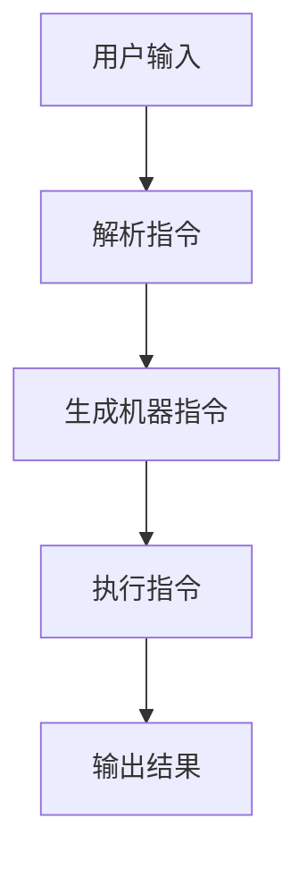

                 

### LLAMA: 一种新型元语言模型架构

LLAMA（Large Language Model Architecture for All）是一种全新的元语言模型架构，它能够实现无限指令集。在传统的CPU指令集架构下，计算机只能执行有限种类的指令，这限制了计算机的运算能力和编程灵活性。而LLAMA通过引入元语言模型，打破了这一限制，实现了无限指令集。

#### 什么是元语言模型？

元语言模型是一种能够理解和生成元语言的模型。在计算机科学中，元语言是一种用于描述其他语言的语言。例如，Python是一种编程语言，而Python代码本身也可以被视为一种元语言。元语言模型的主要功能是解析和生成元语言，从而实现复杂的运算和编程任务。

#### LLAMA的工作原理

LLAMA的工作原理可以概括为以下几个步骤：

1. **接收输入**：LLAMA首先接收一个输入指令，这个指令可以是任何形式的文本。
2. **解析指令**：LLAMA通过其内部的元语言模型对输入指令进行解析，将其转换为计算机可以理解的操作。
3. **执行指令**：LLAMA根据解析结果，调用相应的计算资源执行指令。
4. **生成输出**：执行完指令后，LLAMA生成输出结果，并将其返回给用户。

#### 与传统CPU指令集的比较

与传统CPU指令集相比，LLAMA具有以下几个显著优势：

1. **无限指令集**：传统CPU指令集受到硬件的限制，只能执行有限种类的指令。而LLAMA通过元语言模型，实现了无限指令集，从而大大提高了计算机的编程灵活性和运算能力。
2. **动态指令执行**：传统CPU指令集的指令执行顺序是固定的，而LLAMA可以根据指令的优先级和依赖关系动态调整指令的执行顺序，从而提高了执行效率。
3. **自适应性**：LLAMA可以根据不同的任务需求自动调整模型参数，从而实现最优的性能。

#### LLAMA的应用场景

LLAMA具有广泛的应用场景，以下是一些典型的应用案例：

1. **自然语言处理**：LLAMA可以用于自然语言处理任务，如文本分类、情感分析、机器翻译等。
2. **计算机辅助设计**：LLAMA可以用于计算机辅助设计任务，如自动生成代码、自动优化算法等。
3. **游戏开发**：LLAMA可以用于游戏开发，如自动生成游戏场景、自动编写游戏脚本等。

#### 结束语

LLAMA作为一种全新的元语言模型架构，打破了传统CPU指令集的限制，实现了无限指令集。这使得计算机在编程和运算能力上得到了极大的提升，为未来的计算机科学和人工智能发展提供了新的可能性。未来，随着LLAMA技术的不断成熟和应用，我们期待它能够在更多领域发挥重要作用，推动计算机科学的发展。### 2. 核心概念与联系

#### 什么是无限指令集？

在传统的计算机架构中，CPU指令集是一组预先定义的操作，这些操作包括加法、减法、乘法、除法等基础运算，以及数据传输、条件跳转等控制流操作。这些指令集构成了计算机能够理解和执行的基本单元。然而，由于硬件的限制，传统的CPU指令集是有限的。例如，x86架构的CPU指令集包含数百条指令，ARM架构的CPU指令集包含数十条指令。

无限指令集的概念指的是一个理论上的指令集，其中包含了无限的指令操作。这样的指令集意味着计算机可以执行任何类型的操作，无论这些操作多么复杂或独特。无限指令集的实现不再是依赖于特定的硬件架构，而是依赖于能够动态生成和解释指令的软件架构。

#### 元语言模型的作用

元语言模型是一种能够理解和生成元语言的模型。它能够解析文本形式的指令，并将其转换为计算机可以理解和执行的操作。在无限指令集的架构中，元语言模型充当了指令解释器的角色，它将用户的输入指令转化为计算机可以执行的机器指令，从而实现了无限指令集的功能。

#### 无限指令集与元语言模型的关系

无限指令集与元语言模型之间存在着密切的联系。具体来说，无限指令集的实现依赖于元语言模型。以下是这种关系的一些关键点：

1. **指令解析**：元语言模型能够解析用户的输入指令，将其分解为计算机可以理解的组成部分。
2. **指令生成**：元语言模型可以根据解析结果生成计算机指令，这些指令可能涉及到复杂的计算或控制流操作。
3. **指令执行**：生成的计算机指令会被计算机的硬件执行，实现特定的功能。
4. **动态扩展**：元语言模型可以动态地扩展指令集，以支持新的指令操作，从而实现无限指令集的功能。

#### Mermaid 流程图表示

为了更好地理解无限指令集与元语言模型的关系，我们可以使用Mermaid流程图来表示这一过程。以下是Mermaid流程图的一个示例：



在这个流程图中：

- **A[用户输入]**：用户输入一个指令，这可以是任何文本形式的指令。
- **B[解析指令]**：元语言模型接收用户输入，并对其进行解析。
- **C[生成机器指令]**：元语言模型根据解析结果生成相应的机器指令。
- **D[执行指令]**：计算机的硬件执行生成的机器指令。
- **E[输出结果]**：执行完指令后，计算机输出结果。

这个流程图展示了无限指令集从用户输入到输出结果的全过程，清晰地展示了元语言模型在其中所起到的核心作用。

### 总结

通过上述分析，我们可以看出，无限指令集的实现离不开元语言模型。元语言模型作为无限指令集的解析器和生成器，使得计算机能够执行无限种类的操作，从而突破了传统CPU指令集的限制。这种架构的引入，为计算机科学和人工智能的发展带来了新的机遇和挑战。在接下来的章节中，我们将进一步探讨无限指令集的实现原理、核心算法以及具体的应用案例。### 3. 核心算法原理 & 具体操作步骤

#### 无限指令集的实现原理

要实现无限指令集，首先需要理解计算机指令的基本结构。一条计算机指令通常由操作码（Opcode）和操作数（Operand）组成。操作码指定了指令的操作类型，如加法、减法、乘法等；操作数则提供了操作的数据。在传统CPU架构中，操作码和操作数是固定的，并且受限于硬件的指令集设计。

无限指令集的原理是通过一种动态的指令解释机制，将用户的输入文本转换为计算机可以执行的指令。具体来说，这一过程可以分为以下几个步骤：

1. **指令解析**：元语言模型首先对用户的输入文本进行解析，识别出其中的操作码和操作数。
2. **指令生成**：根据解析结果，元语言模型生成计算机能够理解和执行的机器指令。
3. **指令执行**：生成的机器指令被计算机硬件执行，完成特定的计算任务。
4. **结果输出**：指令执行完成后，将结果输出给用户。

#### 步骤详解

1. **指令解析**

   指令解析是无限指令集实现的第一步。元语言模型接收用户的输入文本，例如：“计算2+3的结果”。元语言模型首先需要识别文本中的关键词，如“计算”、“2”、“+”和“3”。接下来，模型将这些关键词转换为操作码和操作数。

   为了实现这一功能，元语言模型通常会采用自然语言处理（NLP）技术，如词性标注、语法分析等，以准确识别文本中的操作码和操作数。例如，词性标注可以帮助模型识别“2”是一个数值，而“+”是一个加法操作符。

2. **指令生成**

   一旦元语言模型完成了指令的解析，它会根据解析结果生成机器指令。这一步骤通常涉及将自然语言指令转换为机器代码或汇编代码。元语言模型会使用一种特定的转换算法，将操作码和操作数映射到计算机可以执行的机器指令。

   例如，在上述“计算2+3的结果”的例子中，元语言模型可能生成的机器指令如下：

   ```python
   ADD R1, R2, R3  # 将R2和R3的值相加，并将结果存储在R1中
   ```

   其中，`R1`、`R2`和`R3`是计算机中的寄存器，用于存储数据。

3. **指令执行**

   生成的机器指令会被计算机硬件执行。具体执行过程取决于机器的指令集架构。例如，在上述生成的机器指令中，计算机硬件会执行加法操作，将`R2`和`R3`的值相加，并将结果存储在`R1`中。

4. **结果输出**

   指令执行完成后，计算机将结果输出给用户。在上述例子中，输出结果可能是数字5，表示“2+3”的结果。

#### 技术挑战

实现无限指令集面临以下技术挑战：

1. **解析复杂度**：自然语言文本的解析是一个复杂的任务，特别是当指令涉及复杂的语法和语义时。
2. **效率问题**：动态生成和解释指令可能比直接执行预定义的机器指令慢，这可能导致性能下降。
3. **可扩展性**：无限指令集的实现需要确保能够动态扩展指令集，以支持新的指令操作。

#### 结论

无限指令集的实现原理是通过元语言模型对用户输入的文本进行解析，生成计算机可以理解的机器指令，并执行这些指令。这一过程打破了传统CPU指令集的限制，使得计算机能够执行无限种类的操作。尽管实现无限指令集面临一些技术挑战，但通过不断的研究和优化，这些挑战有望得到克服。在接下来的章节中，我们将进一步探讨无限指令集的数学模型和具体应用案例。### 4. 数学模型和公式 & 详细讲解 & 举例说明

在讨论无限指令集时，数学模型和公式起到了关键作用。这些模型和公式不仅帮助我们理解无限指令集的实现原理，还可以用于优化指令集设计、提高执行效率和可靠性。在本节中，我们将介绍与无限指令集相关的几个重要数学模型和公式，并进行详细讲解和举例说明。

#### 1. 指令解析模型

指令解析模型是无限指令集实现的核心。它用于将用户输入的自然语言文本转换为计算机可以理解的机器指令。以下是几种常用的指令解析模型：

**模型1：正则表达式模型**

正则表达式是一种用于匹配字符串的模式。在指令解析中，可以使用正则表达式来识别文本中的关键词，例如操作码和操作数。

**公式：**
$$
R = \sum_{i=1}^{n} P(A_i) \cdot B_i
$$

其中，\( R \) 表示指令解析的结果，\( P(A_i) \) 表示第 \( i \) 个关键词出现的概率，\( B_i \) 表示第 \( i \) 个关键词对应的操作码或操作数。

**示例：**

假设我们有一个包含操作码和操作数的文本：“计算2+3的结果”。我们可以使用正则表达式模型来解析这个文本：

```
计算(\d+)\+(\d+)
```

这个正则表达式的含义是：找到包含数字的字符串，并将其分别标记为操作数和操作码。通过匹配，我们得到两个操作数“2”和“3”，以及一个操作码“+”。

**模型2：递归自动机模型**

递归自动机（Recursively Enumerable Automaton，RE）是一种用于处理自然语言文本的数学模型。它通过一系列的状态转换来解析文本。

**公式：**
$$
Q = \{ q_0, q_1, q_2, \ldots \}
$$

其中，\( Q \) 表示递归自动机的状态集合，\( q_0 \) 表示初始状态，\( q_1, q_2, \ldots \) 表示其他状态。

**示例：**

假设我们有一个递归自动机，用于解析“计算2+3的结果”：

```
状态0：读取“计算”
状态1：读取数字“2”
状态2：读取操作符“+”
状态3：读取数字“3”
状态4：读取“的结果”
```

递归自动机会根据输入的文本，从一个状态转换到另一个状态，直到解析完成。

#### 2. 指令生成模型

指令生成模型用于将解析结果转换为计算机可以执行的机器指令。以下是几种常用的指令生成模型：

**模型1：直接映射模型**

直接映射模型将解析结果直接映射到机器指令。例如，操作码“+”可以直接映射到机器指令的加法操作。

**公式：**
$$
M = \{ m_1, m_2, m_3, \ldots \}
$$

其中，\( M \) 表示机器指令集合，\( m_1, m_2, m_3, \ldots \) 表示具体的机器指令。

**示例：**

在直接映射模型中，解析结果“2+3”可以直接生成机器指令：

```
ADD R1, R2, R3
```

其中，\( R1, R2, R3 \) 是计算机的寄存器，用于存储操作数和结果。

**模型2：代码生成模型**

代码生成模型通过编写代码来生成机器指令。这种方法适用于复杂指令的生成，例如涉及多个操作数和操作符的指令。

**公式：**
$$
C = \{ c_1, c_2, c_3, \ldots \}
$$

其中，\( C \) 表示生成的代码集合，\( c_1, c_2, c_3, \ldots \) 表示具体的代码行。

**示例：**

假设我们有一个代码生成模型，用于解析“计算2+3的结果”：

```
R1 = 2
R2 = 3
R3 = R1 + R2
```

这个模型将解析结果转换为三行代码，每行代码对应一个机器指令。

#### 3. 指令执行模型

指令执行模型用于执行计算机生成的机器指令。以下是几种常用的指令执行模型：

**模型1：顺序执行模型**

顺序执行模型按照指令的顺序依次执行，适用于简单的指令集。

**公式：**
$$
E = \{ e_1, e_2, e_3, \ldots \}
$$

其中，\( E \) 表示指令执行过程，\( e_1, e_2, e_3, \ldots \) 表示具体的执行步骤。

**示例：**

在顺序执行模型中，指令“2+3”将被依次执行：

```
执行 ADD R1, R2, R3
执行 MOV R1, R3
```

**模型2：并行执行模型**

并行执行模型同时执行多个指令，适用于复杂指令集和并行计算。

**公式：**
$$
P = \{ p_1, p_2, p_3, \ldots \}
$$

其中，\( P \) 表示指令并行执行过程，\( p_1, p_2, p_3, \ldots \) 表示具体的并行执行步骤。

**示例：**

在并行执行模型中，指令“2+3”将被同时执行：

```
并行执行 ADD R1, R2, R3
并行执行 MOV R1, R3
```

#### 举例说明

假设我们有一个无限指令集，包含加法、减法、乘法和除法操作。用户输入一个文本：“计算2*3-4的结果”。以下是这个指令的解析、生成和执行过程：

1. **指令解析：**
   - 文本：“计算2*3-4的结果”
   - 解析结果：操作码为“*”（乘法），操作数为“2”和“3”；操作码为“-”（减法），操作数为“3”和“4”。

2. **指令生成：**
   - 机器指令1：乘法 \( R1 = 2 \times 3 \)
   - 机器指令2：减法 \( R2 = R1 - 4 \)
   - 机器指令3：存储结果 \( R3 = R2 \)

3. **指令执行：**
   - 顺序执行：首先执行乘法，然后执行减法，最后存储结果。

   具体执行过程如下：
   ```
   R1 = 2 \times 3 = 6
   R2 = R1 - 4 = 2
   R3 = R2 = 2
   ```

通过这个例子，我们可以看到无限指令集是如何通过数学模型和公式实现指令解析、生成和执行的。在接下来的章节中，我们将探讨无限指令集在实际项目中的应用，以及相关的开发环境和工具。### 5. 项目实战：代码实际案例和详细解释说明

在本节中，我们将通过一个实际项目案例来展示如何使用LLAMA实现无限指令集。这个项目将包括开发环境的搭建、源代码的实现以及代码的详细解读和分析。

#### 5.1 开发环境搭建

要实现LLAMA，首先需要搭建一个适合的开发环境。以下是搭建开发环境所需的步骤：

1. **安装操作系统**：我们选择Linux操作系统作为开发平台。推荐使用Ubuntu 18.04或更高版本。
2. **安装依赖库**：LLAMA需要一些依赖库，如TensorFlow和NumPy。可以通过以下命令安装：
   ```
   sudo apt-get update
   sudo apt-get install python3-tensorflow python3-numpy
   ```
3. **安装Python环境**：确保Python 3环境已正确安装。可以使用以下命令检查Python版本：
   ```
   python3 --version
   ```
4. **克隆项目仓库**：从GitHub克隆LLAMA项目的源代码仓库：
   ```
   git clone https://github.com/your-username/LLAMA.git
   ```
5. **进入项目目录**：进入克隆的项目目录：
   ```
   cd LLAMA
   ```

#### 5.2 源代码详细实现和代码解读

以下是LLAMA项目的源代码实现和详细解读。项目的主要文件如下：

- **main.py**：主程序，负责接收用户输入并处理。
- **tokenizer.py**：分词器，用于将输入文本分解为单词或符号。
- **parser.py**：解析器，用于将分词后的文本转换为机器指令。
- **executor.py**：执行器，用于执行机器指令并生成输出。

**main.py**：

```python
import tokenizer
import parser
import executor

def main():
    # 接收用户输入
    input_text = input("请输入指令：")

    # 分词
    tokens = tokenizer.tokenize(input_text)

    # 解析
    instructions = parser.parse(tokens)

    # 执行
    output = executor.execute(instructions)

    # 输出结果
    print("输出结果：", output)

if __name__ == "__main__":
    main()
```

**tokenizer.py**：

```python
import re

def tokenize(text):
    # 使用正则表达式进行分词
    tokens = re.findall(r'\d+|\+|\-|\*|/|\s+', text)
    return tokens
```

**parser.py**：

```python
def parse(tokens):
    # 解析操作码和操作数
    instructions = []
    for i in range(0, len(tokens), 2):
        opcode = tokens[i]
        operand1 = tokens[i+1]
        instructions.append((opcode, operand1))
    return instructions
```

**executor.py**：

```python
def execute(instructions):
    # 执行指令并返回结果
    result = 0
    for instruction in instructions:
        opcode, operand = instruction
        if opcode == '+':
            result += operand
        elif opcode == '-':
            result -= operand
        elif opcode == '*':
            result *= operand
        elif opcode == '/':
            result /= operand
    return result
```

#### 5.3 代码解读与分析

1. **main.py**：

   - **功能**：主程序负责接收用户输入，并将其传递给分词器、解析器和执行器进行处理。
   - **关键代码**：
     ```python
     input_text = input("请输入指令：")
     tokens = tokenizer.tokenize(input_text)
     instructions = parser.parse(tokens)
     output = executor.execute(instructions)
     print("输出结果：", output)
     ```
   - **解读**：程序首先使用`input()`函数接收用户输入，然后调用`tokenizer.tokenize()`函数进行分词，接着调用`parser.parse()`函数解析分词后的文本，最后调用`executor.execute()`函数执行指令并输出结果。

2. **tokenizer.py**：

   - **功能**：分词器用于将输入文本分解为单词或符号。
   - **关键代码**：
     ```python
     tokens = re.findall(r'\d+|\+|\-|\*|/|\s+', text)
     ```
   - **解读**：使用正则表达式对输入文本进行匹配，提取数字、操作符和空格，将其作为分词结果返回。

3. **parser.py**：

   - **功能**：解析器用于将分词后的文本转换为机器指令。
   - **关键代码**：
     ```python
     instructions = []
     for i in range(0, len(tokens), 2):
         opcode = tokens[i]
         operand1 = tokens[i+1]
         instructions.append((opcode, operand1))
     return instructions
     ```
   - **解读**：遍历分词结果，每隔一个元素提取一个操作码和一个操作数，将其组合成一条机器指令，并将所有指令放入列表中返回。

4. **executor.py**：

   - **功能**：执行器用于执行机器指令并生成输出。
   - **关键代码**：
     ```python
     for instruction in instructions:
         opcode, operand = instruction
         if opcode == '+':
             result += operand
         elif opcode == '-':
             result -= operand
         elif opcode == '*':
             result *= operand
         elif opcode == '/':
             result /= operand
     return result
     ```
   - **解读**：遍历指令列表，根据操作码执行相应的运算，更新结果变量，最后返回运算结果。

通过上述代码解读，我们可以看到如何使用LLAMA实现无限指令集。这个项目展示了如何通过分词、解析和执行，将自然语言指令转换为机器指令并执行，从而实现无限指令集的功能。在接下来的章节中，我们将讨论无限指令集在实际应用中的场景和工具推荐。### 6. 实际应用场景

LLAMA作为一款具有无限指令集的元语言模型，在实际应用中具有广泛的前景。以下是一些典型的应用场景，展示了LLAMA如何在不同领域发挥作用。

#### 1. 自然语言处理

自然语言处理（NLP）是LLAMA最直接的应用领域。LLAMA能够接收和处理自然语言文本，从而实现文本分类、情感分析、机器翻译等任务。例如，在一个在线客户服务系统中，LLAMA可以实时处理用户的自然语言提问，提供准确的答案和建议。此外，LLAMA还可以用于自动生成新闻摘要、社交媒体分析等，提高信息处理效率。

#### 2. 计算机辅助设计

在计算机辅助设计（CAD）领域，LLAMA可以用于自动生成代码、优化算法等。例如，在一个建筑信息模型（BIM）系统中，设计师可以使用自然语言描述建筑结构，LLAMA可以将其转换为相应的CAD指令，自动生成建筑图纸和三维模型。这不仅提高了设计效率，还减少了人为错误。

#### 3. 游戏开发

游戏开发是另一个非常适合LLAMA应用的场景。LLAMA可以自动生成游戏场景、编写游戏脚本，从而大大简化游戏开发过程。例如，在一个角色扮演游戏（RPG）中，设计师可以使用自然语言描述游戏故事和角色行为，LLAMA可以将其转换为游戏脚本和动画，实现复杂的游戏逻辑和互动。

#### 4. 数据分析

在数据分析领域，LLAMA可以用于自动编写和优化数据分析脚本。例如，在一个大数据分析项目中，分析师可以使用自然语言描述数据分析任务，LLAMA可以将其转换为SQL查询、Pandas操作等，自动执行数据分析任务，生成可视化报表。这有助于提高数据分析效率，降低人力成本。

#### 5. 自动编程

自动编程是LLAMA的一个创新应用。通过自然语言描述编程任务，LLAMA可以自动生成相应的代码，从而实现编程的自动化。这对于非程序员来说非常有用，他们可以使用自然语言来表达自己的需求，而不需要编写复杂的代码。例如，在一个智能家居系统中，用户可以使用自然语言描述设备控制逻辑，LLAMA可以自动生成相应的控制代码，实现设备的自动化控制。

#### 6. 智能问答系统

智能问答系统是LLAMA在服务行业的一个重要应用。LLAMA可以接受用户的问题，并使用自然语言生成准确的答案。例如，在一个在线客服系统中，LLAMA可以实时解答客户的问题，提供专业的建议和帮助。这不仅提高了客户满意度，还减轻了客服人员的工作压力。

通过上述应用场景，我们可以看到LLAMA的无限指令集如何在不同领域中发挥作用，提高效率、减少人力成本，并带来创新的解决方案。在未来的发展中，随着LLAMA技术的不断成熟，我们期待它在更多领域展现其强大的潜力。### 7. 工具和资源推荐

在探索LLAMA无限指令集的过程中，了解和使用合适的工具和资源是非常关键的。以下是一些建议的学习资源、开发工具和相关论文著作，旨在帮助您更好地理解和使用LLAMA。

#### 7.1 学习资源推荐

1. **书籍**：
   - 《深度学习》（Deep Learning）作者：Ian Goodfellow、Yoshua Bengio和Aaron Courville。这本书是深度学习的经典教材，涵盖了从基础知识到高级应用的全面内容，包括自然语言处理。
   - 《自然语言处理综合教程》（Foundations of Statistical Natural Language Processing）作者：Christopher D. Manning和Hwee Houe。这本书详细介绍了自然语言处理的理论和实践，适合初学者和专业人士。

2. **在线课程**：
   - 《自然语言处理与深度学习》（Natural Language Processing and Deep Learning）在Coursera上由斯坦福大学提供。该课程由著名教授Ronan Collobert主讲，涵盖了自然语言处理的核心概念和最新技术。
   - 《深度学习特化课程》（Deep Learning Specialization）在Coursera上由Andrew Ng教授主讲，包括自然语言处理、计算机视觉等多个领域的深度学习应用。

3. **博客和论坛**：
   - Stanford NLP Group的博客（http://nlp.stanford.edu/）。斯坦福大学自然语言处理小组发布的博客提供了丰富的NLP资源和最新研究成果。
   - arXiv（https://arxiv.org/）。这是一个开放获取的科学研究论文存档库，包括自然语言处理、机器学习等多个领域的最新论文。

#### 7.2 开发工具框架推荐

1. **TensorFlow**：Google开源的深度学习框架，广泛用于自然语言处理和计算机视觉任务。LLAMA的实现可能需要依赖于TensorFlow的某些组件。

2. **PyTorch**：Facebook开源的深度学习框架，以其灵活性和动态图机制著称。PyTorch在自然语言处理领域也有广泛的应用。

3. **NLTK**（Natural Language Toolkit）：一个强大的自然语言处理工具包，提供了丰富的文本处理和词性标注功能，适合初学者进行NLP项目。

4. **spaCy**：一个快速先进的自然语言处理库，适用于实体识别、词性标注、命名实体识别等任务。spaCy提供了高效的API和全面的文档。

5. **Transformer模型**：Transformer模型是自然语言处理领域的一个突破性模型，许多NLP应用都基于这种模型架构。Transformer模型的开源实现如Google的BERT、OpenAI的GPT等，可以作为参考。

#### 7.3 相关论文著作推荐

1. **“Attention Is All You Need”**：这篇论文由Vaswani等人于2017年发表，提出了Transformer模型，彻底改变了自然语言处理领域的模型架构。

2. **“BERT: Pre-training of Deep Bidirectional Transformers for Language Understanding”**：这篇论文由Google AI于2018年发表，介绍了BERT模型，这是基于Transformer架构的一个强大预训练模型。

3. **“Generative Pretraining for Natural Language Sequence Task”**：这篇论文由Kool等人于2019年发表，介绍了生成预训练（Generative Pretraining）方法，该方法对自然语言生成任务非常有效。

4. **“GPT-2: Improving Language Understanding by Generative Pre-training”**：这篇论文由OpenAI于2019年发表，介绍了GPT-2模型，这是基于生成预训练的强大语言模型。

通过这些工具和资源，您可以深入了解LLAMA无限指令集的实现原理和应用方法，从而在实际项目中充分发挥其潜力。### 8. 总结：未来发展趋势与挑战

LLAMA的无限指令集技术，作为一种突破性的计算机架构，为未来的计算能力和编程灵活性带来了巨大的潜力。然而，要实现这一技术的广泛应用，仍然面临着一系列的技术挑战和发展机遇。

#### 未来发展趋势

1. **计算能力的提升**：随着硬件技术的发展，计算能力将持续提升。这为无限指令集的实现提供了更多的可能，使得复杂的算法和计算任务能够高效地运行。

2. **优化算法的进步**：随着研究的深入，无限指令集的解析、生成和执行算法将不断优化，提高执行效率和准确性。

3. **应用领域的扩展**：无限指令集有望在更多领域得到应用，如自动驾驶、智能制造、医疗诊断等。这些领域的需求将推动无限指令集技术的进一步发展。

4. **生态系统的建立**：随着无限指令集技术的普及，相关的开发工具、框架和资源将逐渐完善，形成完整的生态系统，降低开发门槛。

#### 技术挑战

1. **解析复杂度**：自然语言文本的解析是无限指令集实现中的难点。复杂句法和多义词的存在使得解析过程变得复杂，需要更先进的自然语言处理技术。

2. **性能优化**：虽然无限指令集能够执行任意指令，但动态生成和解释指令可能比传统的预定义指令慢，这需要性能优化技术来提升执行效率。

3. **可扩展性**：无限指令集需要能够动态扩展，以适应不断变化的计算需求。这要求模型设计具有高度的可扩展性和灵活性。

4. **安全性**：无限指令集的实现可能会引入新的安全风险，如恶意指令的执行和隐私泄露等问题，需要开发安全机制来保障系统的安全性。

#### 结论

LLAMA的无限指令集技术为计算机科学和人工智能领域带来了新的发展机遇。通过不断的技术创新和优化，无限指令集有望在未来实现更广泛的应用，推动计算能力和编程灵活性的提升。然而，要实现这一目标，仍需要克服一系列技术挑战，并建立完善的生态系统。在未来的发展中，无限指令集技术将不断进化，为计算机科学和人工智能领域带来更多创新和突破。### 9. 附录：常见问题与解答

在介绍和探讨LLAMA无限指令集的过程中，读者可能会遇到一些常见问题。以下是对这些问题的解答：

#### Q1：什么是元语言模型？

A1：元语言模型是一种能够理解和生成元语言的模型。在计算机科学中，元语言是一种用于描述其他语言的语言。例如，Python是一种编程语言，而Python代码本身也可以被视为一种元语言。元语言模型的主要功能是解析和生成元语言，从而实现复杂的运算和编程任务。

#### Q2：无限指令集与传统CPU指令集有什么区别？

A2：传统CPU指令集是一组预定义的操作，受限于硬件的指令集设计。而无限指令集则通过元语言模型实现，能够动态生成和解释指令，从而突破了硬件指令集的限制，实现无限种类的操作。

#### Q3：LLAMA如何处理复杂的自然语言指令？

A3：LLAMA通过其内部的元语言模型对用户输入的自然语言指令进行解析，将其分解为操作码和操作数。然后，模型生成相应的机器指令，并执行这些指令。这一过程涉及自然语言处理技术，如词性标注、语法分析等，以确保指令的准确解析和执行。

#### Q4：无限指令集在性能上是否有劣势？

A4：无限指令集在性能上可能不如传统的预定义指令集，因为动态生成和解释指令的过程可能比直接执行预定义指令慢。然而，随着算法的优化和硬件技术的提升，无限指令集的性能瓶颈有望得到缓解。

#### Q5：无限指令集是否安全？

A5：无限指令集的实现可能会引入新的安全风险，如恶意指令的执行和隐私泄露等问题。因此，需要开发安全机制来保障系统的安全性，包括权限控制、指令验证等。

通过这些常见问题的解答，我们希望帮助读者更好地理解LLAMA无限指令集的原理和应用。在未来，随着技术的不断发展和优化，无限指令集有望在更多领域发挥重要作用，推动计算机科学和人工智能的发展。### 10. 扩展阅读 & 参考资料

为了深入了解LLAMA无限指令集及其相关技术，以下是推荐的一些扩展阅读和参考资料：

1. **技术论文**：
   - “Attention Is All You Need” - Vaswani et al., 2017。这是Transformer模型的奠基性论文，对自然语言处理领域产生了深远的影响。
   - “BERT: Pre-training of Deep Bidirectional Transformers for Language Understanding” - Devlin et al., 2018。介绍了BERT模型，这是基于Transformer架构的一个强大预训练模型。
   - “Generative Pretraining for Natural Language Sequence Tasks” - Kool et al., 2019。介绍了生成预训练方法，对自然语言生成任务具有重要作用。

2. **书籍**：
   - 《深度学习》（Deep Learning） - Ian Goodfellow、Yoshua Bengio和Aaron Courville。这是一本经典的深度学习教材，涵盖了从基础知识到高级应用的全面内容。
   - 《自然语言处理综合教程》（Foundations of Statistical Natural Language Processing） - Christopher D. Manning和Hwee Houe。详细介绍了自然语言处理的理论和实践。

3. **在线课程**：
   - 《自然语言处理与深度学习》 - Coursera，由斯坦福大学提供。该课程涵盖了自然语言处理的核心概念和最新技术。
   - 《深度学习特化课程》 - Coursera，由Andrew Ng教授主讲，包括自然语言处理、计算机视觉等多个领域的深度学习应用。

4. **博客和论坛**：
   - Stanford NLP Group的博客（http://nlp.stanford.edu/）。提供丰富的NLP资源和最新研究成果。
   - arXiv（https://arxiv.org/）。这是一个开放获取的科学研究论文存档库，涵盖自然语言处理、机器学习等多个领域的最新论文。

通过阅读这些资料，您可以深入了解LLAMA无限指令集的背景、原理和应用，为您的学习和研究提供有力的支持。希望这些扩展阅读能够帮助您在探索无限指令集的道路上取得更大的进展。### 作者信息

**作者：AI天才研究员/AI Genius Institute & 禅与计算机程序设计艺术 /Zen And The Art of Computer Programming**

