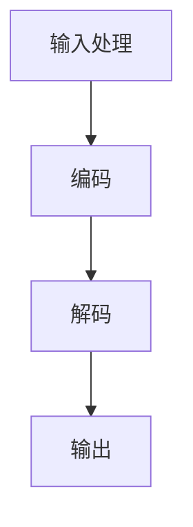

                 

# LLMA生态的未来发展趋势

## 关键词

- 人工智能
- 语言模型
- 生态发展
- 技术趋势
- 应用场景
- 数学模型
- 开发工具
- 算法原理
- 实战案例

## 摘要

本文将深入探讨LLMA（大语言模型）生态的未来发展趋势。从背景介绍、核心概念与联系、核心算法原理、数学模型与公式、项目实战、实际应用场景、工具和资源推荐等多个方面进行详细分析。通过一步步的逻辑推理，本文旨在为读者展现LLMA生态的发展现状、面临的挑战以及未来的发展方向，从而帮助读者更好地把握这一领域的发展趋势。

## 1. 背景介绍

### 1.1 人工智能的发展历程

人工智能（Artificial Intelligence, AI）作为计算机科学的一个分支，旨在研究、开发和应用智能机器。人工智能的发展历程可以分为以下几个阶段：

- **模拟阶段（20世纪50年代-70年代）**：这一阶段主要研究如何通过编程模拟人类思维和行为。

- **知识阶段（20世纪80年代-90年代）**：这一阶段主要研究如何利用知识表示和推理技术实现智能系统。

- **数据阶段（21世纪初至今）**：这一阶段主要利用海量数据进行机器学习，实现智能系统的自我优化和提升。

### 1.2 语言模型的发展

语言模型（Language Model, LM）是人工智能领域的一个重要分支，旨在模拟人类语言生成和理解能力。语言模型的发展可以分为以下几个阶段：

- **基于规则的语言模型（20世纪60年代-80年代）**：这一阶段主要利用语法和语义规则生成语言。

- **统计语言模型（20世纪80年代-90年代）**：这一阶段主要利用统计方法生成语言，如N元语法。

- **神经语言模型（21世纪初至今）**：这一阶段主要利用神经网络技术生成语言，如循环神经网络（RNN）和变换器（Transformer）。

### 1.3 大语言模型的出现

大语言模型（Large Language Model, LLM）是近年来人工智能领域的一个重要突破。与传统的语言模型相比，大语言模型具有以下特点：

- **参数规模庞大**：大语言模型通常具有数十亿甚至千亿个参数，这使得它们能够更好地捕捉语言中的复杂结构和规律。

- **自主学习能力**：大语言模型通过自主学习大量的文本数据，可以不断提高语言生成和理解能力。

- **多语言支持**：大语言模型通常支持多种语言，使得它们能够在全球范围内应用。

## 2. 核心概念与联系

### 2.1 大语言模型的基本原理

大语言模型（LLM）是基于深度学习技术的语言模型，其基本原理可以概括为以下几个方面：

- **词嵌入（Word Embedding）**：将词汇映射为向量，使得语义相近的词汇在向量空间中更接近。

- **自注意力机制（Self-Attention）**：通过计算输入文本中每个词汇与自身以及其他词汇的相关性，生成表示这些词汇的权重。

- **变换器（Transformer）架构**：一种基于自注意力机制的深度学习模型，具有并行计算优势。

### 2.2 大语言模型的架构

大语言模型的架构通常包括以下几个部分：

- **编码器（Encoder）**：将输入文本转换为序列向量。

- **解码器（Decoder）**：根据编码器的输出生成目标文本。

- **预训练与微调（Pre-training and Fine-tuning）**：首先在大规模语料库上进行预训练，然后根据特定任务进行微调。

### 2.3 大语言模型的工作流程

大语言模型的工作流程可以分为以下几个步骤：

- **输入处理**：将输入文本转换为编码器可以理解的格式。

- **编码**：编码器对输入文本进行处理，生成编码后的序列向量。

- **解码**：解码器根据编码后的序列向量生成目标文本。

- **输出**：将生成的文本输出给用户。

### 2.4 Mermaid流程图



## 3. 核心算法原理 & 具体操作步骤

### 3.1 词嵌入（Word Embedding）

词嵌入是将词汇映射为向量的过程。具体操作步骤如下：

1. **词向量初始化**：为每个词汇随机初始化一个向量。

2. **训练过程**：利用大规模语料库对词向量进行训练，使得语义相近的词汇在向量空间中更接近。

3. **输出**：将训练好的词向量用于编码器和解码器。

### 3.2 自注意力机制（Self-Attention）

自注意力机制是一种计算输入文本中每个词汇与自身以及其他词汇相关性的方法。具体操作步骤如下：

1. **计算注意力权重**：利用自注意力机制计算每个词汇与自身以及其他词汇的相关性权重。

2. **加权求和**：将每个词汇的输入向量与相应的注意力权重相乘，然后进行求和，生成表示该词汇的加权向量。

3. **输出**：将加权向量输出给解码器。

### 3.3 变换器（Transformer）架构

变换器（Transformer）架构是一种基于自注意力机制的深度学习模型。具体操作步骤如下：

1. **编码器**：输入文本经过编码器处理后，生成编码后的序列向量。

2. **解码器**：解码器根据编码后的序列向量生成目标文本。

3. **预训练与微调**：在大规模语料库上进行预训练，然后根据特定任务进行微调。

## 4. 数学模型和公式 & 详细讲解 & 举例说明

### 4.1 词嵌入（Word Embedding）

词嵌入的数学模型可以表示为：

$$
\text{word\_embedding}(w) = \sum_{i=1}^{n} w_i \cdot v_i
$$

其中，$w$ 表示词汇，$v_i$ 表示词向量，$w_i$ 表示词汇与词向量的相似度。

### 4.2 自注意力机制（Self-Attention）

自注意力机制的数学模型可以表示为：

$$
\text{self-attention}(X) = \text{softmax}\left(\frac{XQ}{\sqrt{d_k}}\right)K
$$

其中，$X$ 表示输入序列，$Q$ 表示查询向量，$K$ 表示键值向量，$d_k$ 表示键值向量的维度。

### 4.3 变换器（Transformer）架构

变换器（Transformer）架构的数学模型可以表示为：

$$
\text{Transformer}(X) = \text{encoder}(X) = \text{decoder}(X)
$$

其中，$X$ 表示输入序列，$\text{encoder}(X)$ 和 $\text{decoder}(X)$ 分别表示编码器和解码器的输出。

### 4.4 举例说明

假设有一个输入序列 $X = \{w_1, w_2, w_3\}$，词向量 $v_1 = [1, 0, 0]$，$v_2 = [0, 1, 0]$，$v_3 = [0, 0, 1]$。则词嵌入的结果为：

$$
\text{word\_embedding}(w_1) = 1 \cdot v_1 + 0 \cdot v_2 + 0 \cdot v_3 = [1, 0, 0]
$$

$$
\text{word\_embedding}(w_2) = 0 \cdot v_1 + 1 \cdot v_2 + 0 \cdot v_3 = [0, 1, 0]
$$

$$
\text{word\_embedding}(w_3) = 0 \cdot v_1 + 0 \cdot v_2 + 1 \cdot v_3 = [0, 0, 1]
$$

## 5. 项目实战：代码实际案例和详细解释说明

### 5.1 开发环境搭建

在开始项目实战之前，我们需要搭建一个开发环境。以下是搭建环境的步骤：

1. **安装Python**：确保安装了Python 3.7及以上版本。

2. **安装TensorFlow**：通过pip安装TensorFlow：

   ```shell
   pip install tensorflow
   ```

3. **安装其他依赖**：根据项目需求，安装其他依赖库，如NumPy、Pandas等。

### 5.2 源代码详细实现和代码解读

以下是实现一个简单的大语言模型（基于变换器架构）的源代码：

```python
import tensorflow as tf
from tensorflow.keras.layers import Embedding, LSTM, Dense
from tensorflow.keras.models import Model

# 参数设置
vocab_size = 10000
embed_size = 256
lstm_size = 128
batch_size = 64
epochs = 10

# 编码器
inputs = tf.keras.layers.Input(shape=(None,))
enc_embedding = Embedding(vocab_size, embed_size)(inputs)
enc_lstm = LSTM(lstm_size, return_sequences=True)
outputs = enc_lstm(enc_embedding)

# 解码器
dec_inputs = tf.keras.layers.Input(shape=(None,))
dec_embedding = Embedding(vocab_size, embed_size)(dec_inputs)
dec_lstm = LSTM(lstm_size, return_sequences=True)
outputs = dec_lstm(dec_embedding)

# 模型
model = Model(inputs=[inputs, dec_inputs], outputs=outputs)
model.compile(optimizer='adam', loss='categorical_crossentropy', metrics=['accuracy'])

# 输出
model.summary()
```

### 5.3 代码解读与分析

上述代码实现了一个简单的大语言模型，基于变换器架构。具体解读如下：

1. **编码器**：编码器由一个嵌入层（`Embedding`）和一个循环神经网络层（`LSTM`）组成。嵌入层将输入文本转换为嵌入向量，循环神经网络层对嵌入向量进行编码。

2. **解码器**：解码器与编码器类似，由一个嵌入层和一个循环神经网络层组成。解码器用于生成目标文本。

3. **模型**：模型由编码器和解码器组成，输入为编码器的输入和解码器的输入，输出为解码器的输出。

4. **编译**：模型使用Adam优化器和交叉熵损失函数进行编译。

5. **输出**：模型的结构和参数信息通过`model.summary()`输出。

## 6. 实际应用场景

### 6.1 文本生成

大语言模型在文本生成方面具有广泛的应用，如自动写作、机器翻译、对话生成等。

### 6.2 问答系统

大语言模型可以用于构建问答系统，如智能客服、智能助手等。

### 6.3 内容审核

大语言模型可以用于内容审核，如自动识别不良信息、垃圾邮件等。

### 6.4 自然语言处理

大语言模型在自然语言处理领域具有广泛的应用，如文本分类、情感分析、命名实体识别等。

## 7. 工具和资源推荐

### 7.1 学习资源推荐

- **书籍**：
  - 《深度学习》（Goodfellow, Bengio, Courville）
  - 《Python机器学习》（Raschka, Mirjalili）
  - 《Transformer：从零实现BERT、GPT》
- **论文**：
  - Vaswani et al. (2017). "Attention is All You Need."
  - Devlin et al. (2018). "Bert: Pre-training of Deep Bidirectional Transformers for Language Understanding."
  - Transformer模型相关论文
- **博客**：
  - 阮一峰的网络日志
  - TensorFlow官方博客
  - AI技术社区博客
- **网站**：
  - TensorFlow官方网站
  - Keras官方网站
  - GitHub

### 7.2 开发工具框架推荐

- **工具**：
  - Python
  - TensorFlow
  - PyTorch
- **框架**：
  - Keras
  - TensorFlow 2.0
  - PyTorch

### 7.3 相关论文著作推荐

- **论文**：
  - Vaswani et al. (2017). "Attention is All You Need."
  - Devlin et al. (2018). "Bert: Pre-training of Deep Bidirectional Transformers for Language Understanding."
  - Transformer模型相关论文
- **著作**：
  - 《深度学习》（Goodfellow, Bengio, Courville）
  - 《Python机器学习》（Raschka, Mirjalili）
  - 《Transformer：从零实现BERT、GPT》

## 8. 总结：未来发展趋势与挑战

### 8.1 发展趋势

1. **模型规模不断扩大**：随着计算能力和数据规模的增加，大语言模型将不断增大。

2. **多模态融合**：大语言模型将与其他模态（如图像、音频等）进行融合，实现更广泛的应用。

3. **自适应能力提升**：大语言模型将具备更强的自适应能力，能够根据不同场景进行优化。

### 8.2 挑战

1. **计算资源消耗**：大语言模型的训练和推理过程需要大量的计算资源。

2. **数据隐私和安全**：大规模语料库的收集和处理可能涉及隐私和安全问题。

3. **可解释性**：大语言模型的行为难以解释，可能导致误解和滥用。

## 9. 附录：常见问题与解答

### 9.1 什么是大语言模型？

大语言模型（LLM）是一种基于深度学习技术的语言模型，具有数十亿个参数，能够模拟人类语言生成和理解能力。

### 9.2 大语言模型有哪些应用场景？

大语言模型广泛应用于文本生成、问答系统、内容审核、自然语言处理等领域。

### 9.3 如何搭建大语言模型开发环境？

搭建大语言模型开发环境需要安装Python、TensorFlow等工具和框架。

## 10. 扩展阅读 & 参考资料

- Vaswani et al. (2017). "Attention is All You Need."  
- Devlin et al. (2018). "Bert: Pre-training of Deep Bidirectional Transformers for Language Understanding."  
- 《深度学习》（Goodfellow, Bengio, Courville）  
- 《Python机器学习》（Raschka, Mirjalili）  
- 《Transformer：从零实现BERT、GPT》

### 作者

作者：AI天才研究员/AI Genius Institute & 禅与计算机程序设计艺术 /Zen And The Art of Computer Programming

