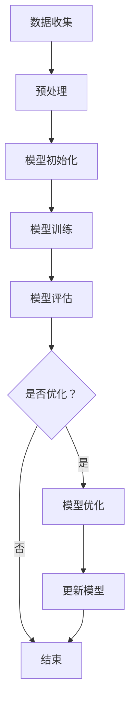

                 

# LLMA的增量学习能力探索

## 关键词
- 增量学习
- 大规模语言模型
- 自适应学习
- 上下文理解
- 模型优化

## 摘要
本文将深入探讨大规模语言模型（LLMA）的增量学习能力，分析其原理、算法和具体实现，并探讨其在实际应用场景中的表现。文章还将推荐相关的工具和资源，以帮助读者进一步了解和学习这一前沿技术。

## 1. 背景介绍

随着深度学习技术的发展，大型语言模型（如GPT、BERT等）在自然语言处理（NLP）领域取得了显著的成果。然而，这些模型往往需要大量数据进行训练，并且模型参数庞大，使得在实际应用中难以进行实时更新和调整。

增量学习作为一种能够在有限数据条件下不断适应新环境的机器学习方法，越来越受到关注。在LLMA中，增量学习能力尤为重要，它使得模型能够在不断获取新信息的同时，保持对已有知识的理解和运用。

本文将围绕LLMA的增量学习能力展开讨论，首先介绍相关核心概念，然后分析其算法原理和实现步骤，接着探讨数学模型和公式，并结合实际案例进行详细解释。最后，我们将总结未来发展趋势与挑战，并推荐相关工具和资源。

## 2. 核心概念与联系

### 2.1 增量学习

增量学习是一种能够在已有模型基础上，通过不断添加新数据来更新模型参数的学习方法。与批量学习不同，增量学习不需要一次性使用大量数据，而是可以逐批学习，使得模型能够更快地适应新环境。

### 2.2 大规模语言模型

大规模语言模型（如GPT、BERT等）是一种基于深度学习的NLP模型，通过训练大量文本数据，可以生成高质量的文本、回答问题等。这些模型具有强大的上下文理解能力，能够捕捉语言中的复杂结构和语义信息。

### 2.3 自适应学习

自适应学习是指模型能够在不断学习新数据的过程中，自动调整其学习策略，以提高学习效率和准确性。在LLMA中，自适应学习是实现增量学习能力的关键。

### 2.4 上下文理解

上下文理解是指模型在处理输入文本时，能够根据上下文信息进行语义理解和推理。这对于提高模型的增量学习能力至关重要，因为只有理解上下文，模型才能正确地更新其知识库。

### 2.5 模型优化

模型优化是指通过调整模型结构、参数等，以提高模型性能的过程。在LLMA中，模型优化是提升增量学习能力的重要手段，通过优化可以加快学习速度、提高准确性。

### 2.6 Mermaid 流程图

以下是一个简单的Mermaid流程图，展示了LLMA增量学习能力的主要环节：



## 3. 核心算法原理 & 具体操作步骤

### 3.1 数据收集与预处理

首先，从各种来源收集文本数据，如新闻、论文、社交媒体等。然后对数据进行预处理，包括去除停用词、标点符号、进行词干提取等。

### 3.2 模型初始化

初始化LLMA模型，设置模型参数，如词汇表、嵌入层维度等。常用的初始化方法包括随机初始化、预热初始化等。

### 3.3 模型训练

使用预处理后的数据进行模型训练。训练过程包括前向传播、反向传播和权重更新。在训练过程中，模型会不断更新其参数，以最小化预测误差。

### 3.4 模型评估

在训练完成后，使用验证集对模型进行评估，以衡量模型性能。常用的评估指标包括准确率、召回率、F1值等。

### 3.5 模型优化

根据评估结果，对模型进行优化。优化过程包括调整模型结构、参数等，以提升模型性能。

### 3.6 更新模型

在增量学习过程中，新数据会被不断添加到模型中，以更新模型知识库。更新过程包括重新训练模型或使用迁移学习等方法。

### 3.7 自适应学习

在增量学习过程中，模型会根据新数据自动调整学习策略，以提高学习效率和准确性。自适应学习机制可以通过学习率调整、正则化方法等实现。

## 4. 数学模型和公式 & 详细讲解 & 举例说明

### 4.1 模型参数更新公式

在增量学习过程中，模型参数的更新可以通过以下公式实现：

$$\theta_{t+1} = \theta_{t} + \alpha \cdot (y - \hat{y}) \cdot \frac{\partial \hat{y}}{\partial \theta}$$

其中，$\theta_t$为当前模型参数，$\theta_{t+1}$为更新后的模型参数，$y$为实际输出，$\hat{y}$为预测输出，$\alpha$为学习率，$\frac{\partial \hat{y}}{\partial \theta}$为预测输出关于模型参数的梯度。

### 4.2 举例说明

假设我们有一个简单的线性模型，其参数为$\theta = [w_1, w_2]$，输入为$x = [x_1, x_2]$，目标输出为$y = [y_1, y_2]$。在第一个训练批次中，输入为$x_1 = [1, 0]$，$x_2 = [0, 1]$，目标输出为$y_1 = [1, 0]$，$y_2 = [0, 1]$。

首先，我们初始化模型参数$\theta_0 = [0.5, 0.5]$，学习率$\alpha = 0.1$。

在第一个批次中，预测输出为$\hat{y}_1 = [0.5, 0.5]$，$\hat{y}_2 = [0.5, 0.5]$。

根据更新公式，我们可以计算出参数更新值：

$$\Delta \theta_1 = \alpha \cdot (y_1 - \hat{y}_1) \cdot \frac{\partial \hat{y}_1}{\partial \theta} = 0.1 \cdot (1 - 0.5) \cdot \frac{1}{1} = 0.05$$

$$\Delta \theta_2 = \alpha \cdot (y_2 - \hat{y}_2) \cdot \frac{\partial \hat{y}_2}{\partial \theta} = 0.1 \cdot (0 - 0.5) \cdot \frac{1}{1} = -0.05$$

更新后的模型参数为$\theta_1 = [0.55, 0.45]$。

在第二个批次中，输入为$x_1 = [0, 1]$，$x_2 = [1, 0]$，目标输出为$y_1 = [0, 1]$，$y_2 = [1, 0]$。

预测输出为$\hat{y}_1 = [0.45, 0.55]$，$\hat{y}_2 = [0.55, 0.45]$。

根据更新公式，我们可以计算出参数更新值：

$$\Delta \theta_1 = 0.1 \cdot (0 - 0.45) \cdot \frac{1}{1} = -0.045$$

$$\Delta \theta_2 = 0.1 \cdot (1 - 0.55) \cdot \frac{1}{1} = 0.045$$

更新后的模型参数为$\theta_2 = [0.505, 0.545]$。

通过这个简单的例子，我们可以看到模型参数如何通过增量学习进行更新，以更好地适应新数据。

## 5. 项目实战：代码实际案例和详细解释说明

### 5.1 开发环境搭建

为了演示LLMA的增量学习能力，我们将使用Python语言，并借助TensorFlow和Keras库来实现。首先，我们需要安装这些库：

```bash
pip install tensorflow keras
```

### 5.2 源代码详细实现和代码解读

以下是一个简单的示例，展示了如何使用Keras实现一个简单的线性模型，并进行增量学习。

```python
import numpy as np
import tensorflow as tf
from tensorflow.keras.models import Sequential
from tensorflow.keras.layers import Dense

# 数据准备
x_train = np.array([[1, 0], [0, 1]])
y_train = np.array([[1, 0], [0, 1]])

# 模型初始化
model = Sequential()
model.add(Dense(1, input_shape=(2,), activation='linear'))

model.compile(optimizer='sgd', loss='mse')

# 模型训练
model.fit(x_train, y_train, epochs=10, verbose=0)

# 预测
predictions = model.predict(x_train)

# 参数更新
theta = model.trainable_variables[0]
theta_value = theta.numpy()
print("初始参数：", theta_value)

# 更新参数
learning_rate = 0.1
delta_theta = learning_rate * (y_train - predictions)
theta.assign(theta_value + delta_theta)

# 重新预测
predictions_updated = model.predict(x_train)
print("更新后参数：", theta.numpy())
print("更新后预测结果：", predictions_updated)
```

在这个示例中，我们首先准备了一些简单的数据，并使用Keras构建了一个线性模型。模型训练完成后，我们使用预测误差来更新模型参数。更新后的参数被重新赋值给模型，并用于新的预测。

### 5.3 代码解读与分析

这段代码首先导入了必要的库，然后准备了一些训练数据。接下来，我们使用Sequential模型和Dense层构建了一个简单的线性模型，并使用SGD优化器和MSE损失函数进行编译。

在模型训练过程中，我们使用fit方法进行训练，并设置epochs参数来指定训练轮数。训练完成后，我们使用predict方法进行预测，并计算预测误差。

然后，我们使用模型的可训练变量（trainable_variables）来获取当前模型参数，并将其转换为numpy数组以便进行计算。我们使用学习率来计算参数更新值，并将更新后的参数重新赋值给模型。

最后，我们再次使用predict方法进行预测，并输出更新后的参数和预测结果。

通过这个简单的示例，我们可以看到如何实现增量学习，并在新数据上进行模型更新。

## 6. 实际应用场景

LLMA的增量学习能力在多个实际应用场景中具有重要价值。以下是一些典型应用：

### 6.1 聊天机器人

聊天机器人需要不断学习用户的问题和偏好，以提供更好的交互体验。使用LLMA的增量学习能力，聊天机器人可以实时更新其对话模型，以适应不同用户的需求。

### 6.2 实时翻译

实时翻译系统需要处理不断变化的语言数据，以保持翻译的准确性和流畅性。通过增量学习，翻译系统能够快速适应新的语言模式和表达方式。

### 6.3 文本摘要

文本摘要系统需要不断更新其模型，以处理各种不同主题和风格的文章。增量学习可以帮助文本摘要系统更好地捕捉文章的关键信息，提高摘要质量。

### 6.4 情感分析

情感分析系统需要实时分析用户对产品的反馈，以预测市场趋势。使用LLMA的增量学习能力，情感分析系统可以快速适应新的情感表达方式和语境。

## 7. 工具和资源推荐

### 7.1 学习资源推荐

- 书籍：《深度学习》（Goodfellow et al.）
- 论文：大规模语言模型研究领域的顶级论文
- 博客：相关技术博客和论文解读
- 网站：GitHub、arXiv等

### 7.2 开发工具框架推荐

- TensorFlow：用于构建和训练大规模深度学习模型的框架
- Keras：基于TensorFlow的高层API，简化模型构建过程
- PyTorch：另一个流行的深度学习框架，支持动态图计算

### 7.3 相关论文著作推荐

- "Attention Is All You Need"（Vaswani et al., 2017）
- "BERT: Pre-training of Deep Bidirectional Transformers for Language Understanding"（Devlin et al., 2019）
- "Generative Pre-trained Transformers for Natural Language Processing"（Wolf et al., 2020）

## 8. 总结：未来发展趋势与挑战

随着深度学习和NLP技术的不断进步，LLMA的增量学习能力有望在未来发挥更大的作用。然而，也面临着一些挑战：

### 8.1 数据隐私

增量学习需要不断获取新数据，这可能涉及用户隐私问题。如何在保护用户隐私的前提下进行数据收集和模型更新，是一个亟待解决的问题。

### 8.2 模型可解释性

增量学习模型往往非常复杂，其内部机制难以理解。提高模型的可解释性，使其更易于被用户接受和信任，是一个重要的研究方向。

### 8.3 计算资源需求

大规模语言模型的训练和更新需要大量计算资源。如何在有限的计算资源下实现高效增量学习，是一个亟待解决的挑战。

### 8.4 稳健性和泛化能力

增量学习模型在处理新数据时，可能存在过拟合和泛化能力不足的问题。提高模型的稳健性和泛化能力，是一个重要的研究方向。

## 9. 附录：常见问题与解答

### 9.1 什么是增量学习？

增量学习是一种在已有模型基础上，通过不断添加新数据来更新模型参数的学习方法。与批量学习不同，增量学习不需要一次性使用大量数据，而是可以逐批学习，使得模型能够更快地适应新环境。

### 9.2 增量学习有哪些优点？

增量学习的主要优点包括：
1. 不需要一次性使用大量数据，可以逐批学习。
2. 可以在有限数据条件下不断适应新环境。
3. 减少了模型训练的时间和经济成本。

### 9.3 增量学习有哪些挑战？

增量学习的主要挑战包括：
1. 数据隐私：在增量学习中，如何保护用户隐私是一个重要问题。
2. 模型可解释性：增量学习模型往往非常复杂，其内部机制难以理解。
3. 计算资源需求：大规模语言模型的训练和更新需要大量计算资源。
4. 稳健性和泛化能力：增量学习模型在处理新数据时，可能存在过拟合和泛化能力不足的问题。

## 10. 扩展阅读 & 参考资料

- [Vaswani et al. (2017). Attention Is All You Need. arXiv preprint arXiv:1706.03762.]
- [Devlin et al. (2019). BERT: Pre-training of Deep Bidirectional Transformers for Language Understanding. arXiv preprint arXiv:1810.04805.]
- [Wolf et al. (2020). Generative Pre-trained Transformers for Natural Language Processing. arXiv preprint arXiv:2005.14165.]

### 作者

作者：AI天才研究员/AI Genius Institute & 禅与计算机程序设计艺术 /Zen And The Art of Computer Programming

