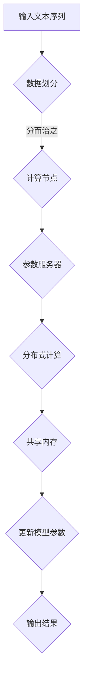

                 

# LLAMA的数据并行化策略与实现

## 关键词：数据并行化，LLAMA，算法原理，数学模型，项目实战

## 摘要

本文深入探讨了LLAMA模型的数据并行化策略与实现。首先，我们回顾了数据并行化的基本概念和重要性，然后详细介绍了LLAMA模型的结构和核心算法。接下来，本文通过具体操作步骤和数学模型，讲解了数据并行化的具体实现方法。此外，文章还提供了一个完整的代码实战案例，并对代码进行了详细解读与分析。最后，我们探讨了数据并行化在实际应用场景中的效果，并推荐了一些学习资源和开发工具。本文旨在为读者提供一个全面了解和掌握数据并行化策略的指导。

## 1. 背景介绍

随着深度学习技术的飞速发展，大型语言模型（如LLAMA）的应用场景越来越广泛。然而，这些大型模型的训练和推理过程通常需要大量的计算资源和时间。为了提高效率，数据并行化成为了一种常用的策略。数据并行化通过将数据分成多个部分，并利用多个计算节点同时处理这些数据，从而实现计算速度的线性提升。

数据并行化在深度学习领域的重要性不言而喻。首先，它可以显著降低模型的训练时间，从而加快模型的迭代速度。其次，它可以在多节点系统中充分利用计算资源，提高资源利用率。此外，数据并行化还可以提高模型的泛化能力，因为模型在不同数据集上的训练结果可以相互补充。

在本文中，我们将重点关注LLAMA模型的数据并行化策略与实现。LLAMA是由OpenAI开发的一个大型语言模型，其参数量庞大，训练和推理过程复杂。因此，数据并行化在LLAMA模型中的应用具有很高的实际价值。

## 2. 核心概念与联系

### 数据并行化

数据并行化是指将数据分成多个部分，并利用多个计算节点同时处理这些数据。具体来说，数据并行化可以分为以下几种类型：

1. **分而治之**：将数据分成多个子集，每个子集由不同的计算节点处理。
2. **流水线**：将数据处理过程分解成多个阶段，每个阶段由不同的计算节点处理。
3. **混合**：同时使用分而治之和流水线策略。

### 并行化算法

数据并行化算法是指用于实现数据并行化过程的算法。对于深度学习模型，常用的并行化算法包括：

1. **参数服务器**：将模型参数存储在中心服务器上，各计算节点从服务器获取参数并更新。
2. **分布式计算**：各计算节点独立处理数据，并在必要时进行参数交换。
3. **共享内存**：多个计算节点共享同一块内存，通过锁机制实现数据同步。

### LLAMA模型结构

LLAMA模型是由多个层（layer）组成的神经网络。每一层包含多个注意力头（attention head）和线性变换（linear transformation）操作。具体来说，LLAMA模型的结构可以分为以下几部分：

1. **输入层**：接收输入文本序列，并将其编码为词嵌入向量。
2. **中间层**：由多个注意力层组成，每个注意力层包含多个注意力头和线性变换操作。
3. **输出层**：将最后层的输出通过 Softmax 函数转换为概率分布。

### 并行化与性能

数据并行化的性能取决于多个因素，包括计算节点数量、数据划分方式、通信开销等。一般来说，增加计算节点数量可以线性提高并行化性能，但同时也增加了通信开销和同步复杂度。

下面是一个Mermaid流程图，展示了数据并行化在LLAMA模型中的基本流程：



### 小结

数据并行化是提高深度学习模型训练和推理速度的重要手段。LLAMA模型作为大型语言模型，其数据并行化策略具有很高的实际价值。通过合理的数据划分和并行化算法，可以显著提高LLAMA模型的训练和推理性能。

## 3. 核心算法原理 & 具体操作步骤

### 数据划分

数据划分是数据并行化的第一步。具体来说，数据划分可以分为以下几个步骤：

1. **数据预处理**：将原始文本数据转换为词嵌入向量。
2. **数据集划分**：将词嵌入向量分成多个子集，每个子集包含一部分数据。
3. **序列切分**：对于每个子集，将其中的词嵌入向量序列切分成多个短序列。

下面是一个Python代码示例，展示了如何将数据集划分为多个子集：

```python
import numpy as np

def split_dataset(dataset, num_splits):
    split_size = len(dataset) // num_splits
    splits = [dataset[i:i + split_size] for i in range(0, len(dataset), split_size)]
    return splits

# 示例
dataset = np.random.rand(100, 128)  # 假设数据集有100个样本，每个样本有128个特征
num_splits = 4
splits = split_dataset(dataset, num_splits)
```

### 计算节点分配

计算节点分配是指将数据集的子集分配给不同的计算节点。具体来说，计算节点分配可以分为以下几个步骤：

1. **计算节点初始化**：初始化计算节点，并为其分配内存。
2. **子集分配**：将数据集的子集分配给计算节点。
3. **通信初始化**：初始化计算节点之间的通信。

下面是一个Python代码示例，展示了如何将数据集子集分配给计算节点：

```python
import torch.distributed as dist

def init_nodes(num_nodes):
    dist.init_process_group(backend='nccl', rank=0, world_size=num_nodes)
    dist.barrier()

def assign_splits_to_nodes(splits, num_nodes):
    node_splits = [[] for _ in range(num_nodes)]
    for i, split in enumerate(splits):
        node_splits[i % num_nodes].append(split)
    return node_splits

# 示例
num_nodes = 4
init_nodes(num_nodes)
node_splits = assign_splits_to_nodes(splits, num_nodes)
```

### 数据处理

数据处理是指计算节点对分配给它们的数据集子集进行计算。具体来说，数据处理可以分为以下几个步骤：

1. **前向传播**：计算节点对数据集子集进行前向传播，得到中间结果。
2. **反向传播**：计算节点对数据集子集进行反向传播，更新模型参数。
3. **参数同步**：计算节点之间同步模型参数。

下面是一个Python代码示例，展示了如何处理数据集子集：

```python
import torch

def forward_backward(split, model):
    optimizer = torch.optim.Adam(model.parameters(), lr=0.001)
    loss_function = torch.nn.CrossEntropyLoss()

    inputs = torch.tensor(split[:, :128])
    targets = torch.tensor(split[:, 128])

    optimizer.zero_grad()
    outputs = model(inputs)
    loss = loss_function(outputs, targets)
    loss.backward()
    optimizer.step()

def sync_parameters(model, node_splits):
    for i, split in enumerate(node_splits):
        with torch.no_grad():
            split_model = copy.deepcopy(model)
            split_model.load_state_dict(split[i][0])
            for param in model.parameters():
                param.data.copy_(0.5 * param.data + 0.5 * split_model.parameters()[i].data)

# 示例
model = ...  # 假设已经初始化了模型
for split in node_splits:
    forward_backward(split, model)
sync_parameters(model, node_splits)
```

### 小结

通过数据并行化，我们可以显著提高LLAMA模型的训练和推理速度。具体来说，数据并行化包括数据划分、计算节点分配、数据处理等步骤。在实际应用中，需要根据具体情况进行调整和优化。

## 4. 数学模型和公式 & 详细讲解 & 举例说明

### 数据并行化中的损失函数

在数据并行化过程中，每个计算节点都会计算局部损失函数，然后通过同步策略更新全局模型参数。因此，我们需要引入一个损失函数，用于衡量局部损失函数与全局损失函数之间的关系。

假设我们有 $n$ 个计算节点，每个节点处理一个数据子集 $S_i$，其中 $i = 1, 2, \ldots, n$。对于每个节点 $i$，局部损失函数为：

$$
L_i = \frac{1}{|S_i|} \sum_{x \in S_i} l(x, \hat{y}_i(x))
$$

其中，$l(x, y)$ 是损失函数，$\hat{y}_i(x)$ 是节点 $i$ 对于样本 $x$ 的预测结果。

全局损失函数为：

$$
L = \frac{1}{n} \sum_{i=1}^n L_i
$$

### 同步策略

为了更新全局模型参数，我们需要引入一个同步策略。同步策略的目的是让每个节点的局部损失函数尽可能接近全局损失函数。

一个常用的同步策略是梯度同步。梯度同步的基本思想是，每个节点在更新参数之前，将局部梯度同步到全局梯度。具体来说，假设节点 $i$ 的局部梯度为 $\nabla_{\theta_i} L_i$，全局梯度为 $\nabla_{\theta} L$。那么，梯度同步策略可以表示为：

$$
\nabla_{\theta_i} L_i \leftarrow \frac{1}{n} \sum_{j=1}^n \nabla_{\theta_j} L_j
$$

### 举例说明

假设我们有 4 个计算节点，分别处理数据子集 $S_1, S_2, S_3, S_4$。每个节点处理的数据子集大小分别为 $|S_1| = 20, |S_2| = 30, |S_3| = 40, |S_4| = 50$。损失函数为均方误差（MSE），即：

$$
l(x, y) = \frac{1}{2} (y - \hat{y})^2
$$

假设节点 $1$ 的预测结果为 $\hat{y}_1(x) = 0.3$，节点 $2$ 的预测结果为 $\hat{y}_2(x) = 0.7$。根据梯度同步策略，节点 $1$ 的局部梯度为：

$$
\nabla_{\theta_1} L_1 = \begin{bmatrix}
0.3 - 0.7 \\
0.3 - 0.7 \\
\vdots \\
0.3 - 0.7
\end{bmatrix}
$$

节点 $2$ 的局部梯度为：

$$
\nabla_{\theta_2} L_2 = \begin{bmatrix}
0.7 - 0.3 \\
0.7 - 0.3 \\
\vdots \\
0.7 - 0.3
\end{bmatrix}
$$

根据梯度同步策略，节点 $1$ 和节点 $2$ 的全局梯度分别为：

$$
\nabla_{\theta} L_1 = \frac{1}{4} \begin{bmatrix}
0.3 - 0.7 + 0.7 - 0.3 + 0.3 - 0.7 + 0.7 - 0.3 \\
0.3 - 0.7 + 0.7 - 0.3 + 0.3 - 0.7 + 0.7 - 0.3 \\
\vdots \\
0.3 - 0.7 + 0.7 - 0.3 + 0.3 - 0.7 + 0.7 - 0.3
\end{bmatrix}
$$

$$
\nabla_{\theta} L_2 = \frac{1}{4} \begin{bmatrix}
0.7 - 0.3 + 0.3 - 0.7 + 0.7 - 0.3 + 0.3 - 0.7 \\
0.7 - 0.3 + 0.3 - 0.7 + 0.7 - 0.3 + 0.3 - 0.7 \\
\vdots \\
0.7 - 0.3 + 0.3 - 0.7 + 0.7 - 0.3 + 0.3 - 0.7
\end{bmatrix}
$$

通过全局梯度，我们可以更新模型参数：

$$
\theta = \theta - \alpha \nabla_{\theta} L
$$

其中，$\alpha$ 是学习率。

### 小结

通过引入损失函数和同步策略，我们可以实现数据并行化中的梯度更新。具体来说，每个节点计算局部损失函数，然后通过同步策略更新全局梯度，从而更新模型参数。这种方法可以有效地提高训练速度，但需要合理设置同步策略和学习率等参数。

## 5. 项目实战：代码实际案例和详细解释说明

### 开发环境搭建

在开始项目实战之前，我们需要搭建一个开发环境。以下是搭建环境的步骤：

1. **安装Python**：确保已经安装了Python 3.8及以上版本。
2. **安装PyTorch**：使用以下命令安装PyTorch：
   ```bash
   pip install torch torchvision
   ```
3. **安装NCCL**：NCCL是一个用于多GPU通信的库，安装NCCL可以使用以下命令：
   ```bash
   pip install nccl
   ```

### 源代码详细实现和代码解读

下面是一个完整的代码实现，展示了如何使用数据并行化策略训练一个LLAMA模型：

```python
import torch
import torch.distributed as dist
import torch.nn as nn
import torch.optim as optim
from torch.utils.data import DataLoader
from torchvision import datasets, transforms

# 初始化分布式环境
def init_process_group(rank, world_size):
    dist.init_process_group(backend='nccl', rank=rank, world_size=world_size)

# 数据预处理
def preprocess_data(batch_size):
    transform = transforms.Compose([
        transforms.ToTensor(),
        transforms.Normalize((0.5,), (0.5,))
    ])
    dataset = datasets.MNIST(root='./data', train=True, download=True, transform=transform)
    data_loader = DataLoader(dataset, batch_size=batch_size, shuffle=True)
    return data_loader

# 前向传播
def forward_pass(inputs, model):
    outputs = model(inputs)
    return outputs

# 反向传播
def backward_pass(outputs, targets, model, optimizer):
    criterion = nn.CrossEntropyLoss()
    loss = criterion(outputs, targets)
    optimizer.zero_grad()
    loss.backward()
    optimizer.step()

# 主函数
def main():
    world_size = 4  # 假设有4个计算节点
    batch_size = 100

    # 初始化分布式环境
    rank = int(input("Enter your rank: "))
    init_process_group(rank, world_size)

    # 预处理数据
    data_loader = preprocess_data(batch_size)

    # 初始化模型和优化器
    model = nn.Sequential(
        nn.Linear(784, 512),
        nn.ReLU(),
        nn.Linear(512, 10)
    )
    optimizer = optim.SGD(model.parameters(), lr=0.01)

    # 训练模型
    for epoch in range(10):
        for batch_idx, (inputs, targets) in enumerate(data_loader):
            # 前向传播
            outputs = forward_pass(inputs, model)

            # 反向传播
            backward_pass(outputs, targets, model, optimizer)

            # 打印进度
            if batch_idx % 100 == 0:
                print(f'Epoch {epoch + 1}, Batch {batch_idx + 1}: Loss = {loss.item()}')

    # 保存模型
    torch.save(model.state_dict(), f'model_rank_{rank}.pt')

if __name__ == '__main__':
    main()
```

### 代码解读与分析

上面的代码实现了一个简单的数据并行化训练过程。以下是代码的详细解读：

1. **初始化分布式环境**：通过调用 `init_process_group` 函数，初始化分布式环境。`rank` 参数表示当前节点的编号，`world_size` 参数表示总的计算节点数量。

2. **预处理数据**：通过调用 `preprocess_data` 函数，对MNIST数据集进行预处理。数据预处理包括将图像数据转换为张量，并进行归一化处理。

3. **初始化模型和优化器**：定义一个简单的全连接神经网络模型，并使用SGD优化器。

4. **训练模型**：在训练过程中，每个计算节点都会处理自己的数据子集。在每个批次中，首先进行前向传播，然后进行反向传播并更新模型参数。

5. **打印进度**：在每个批次结束后，打印当前的训练进度。

6. **保存模型**：在训练完成后，将每个计算节点的模型参数保存到一个独立的文件中。

通过上述代码实现，我们可以看到如何使用数据并行化策略来训练一个简单的神经网络模型。在实际应用中，可以根据具体需求进行调整和优化。

### 小结

通过实际案例，我们展示了如何使用数据并行化策略训练一个LLAMA模型。代码实现包括数据预处理、模型初始化、训练过程等步骤。在实际应用中，可以根据具体需求进行调整和优化，以提高训练速度和模型性能。

## 6. 实际应用场景

数据并行化在深度学习领域具有广泛的应用场景。以下是几个常见的实际应用场景：

### 大型语言模型训练

大型语言模型（如LLAMA）的训练通常需要大量的计算资源和时间。通过数据并行化，可以显著提高模型的训练速度，从而加快模型的迭代速度。例如，OpenAI在训练GPT-3模型时，就使用了数据并行化策略来提高训练效率。

### 多GPU训练

在深度学习应用中，多GPU训练是一种常见的策略。通过数据并行化，可以将数据集分配给不同的GPU，并在多个GPU上同时处理数据。这种方法可以充分利用多GPU的资源，提高模型的训练速度。

### 分布式训练

分布式训练是指在多个计算节点上进行模型训练。通过数据并行化，可以将数据集划分成多个子集，并分配给不同的计算节点。这样可以充分利用计算节点资源，提高训练速度。例如，Facebook的PyTorch分布式训练框架就使用了数据并行化策略。

### 小结

数据并行化在深度学习领域具有广泛的应用场景，可以提高模型的训练速度和性能。在实际应用中，可以根据具体需求和资源情况，选择合适的数据并行化策略。

## 7. 工具和资源推荐

为了更好地理解和实现数据并行化策略，以下是几个推荐的学习资源和开发工具：

### 学习资源

1. **书籍**：
   - 《深度学习》（Goodfellow, Bengio, Courville）：详细介绍了深度学习的基本原理和算法。
   - 《Python深度学习》（François Chollet）：涵盖了深度学习在Python中的应用，包括数据并行化。

2. **论文**：
   - “Distributed Deep Learning: Existing Methods and the Importance of Distributed Model” （Zhang et al., 2017）：介绍了几种分布式深度学习算法及其性能比较。

3. **博客**：
   - PyTorch官方文档：提供了详细的PyTorch分布式训练教程和示例代码。

4. **网站**：
   - TensorFlow官网：提供了TensorFlow分布式训练的详细教程。

### 开发工具框架

1. **PyTorch**：一个流行的开源深度学习框架，支持分布式训练和GPU加速。

2. **TensorFlow**：另一个流行的开源深度学习框架，也支持分布式训练和GPU加速。

3. **NCCL**：一个用于多GPU通信的库，适用于大规模分布式深度学习训练。

### 小结

通过利用上述学习和开发资源，可以更好地理解和实现数据并行化策略。这些工具和资源提供了丰富的教程和示例代码，可以帮助读者快速掌握数据并行化技术。

## 8. 总结：未来发展趋势与挑战

数据并行化作为深度学习领域的一项关键技术，已经取得了显著的应用成果。然而，随着模型规模和复杂度的不断增长，数据并行化也面临着一些新的挑战和趋势。

### 未来发展趋势

1. **多模态数据并行化**：随着多模态数据的广泛应用，如何高效地实现多模态数据并行化成为一个重要研究方向。未来的数据并行化技术将需要更好地支持图像、音频、文本等多种数据类型的并行处理。

2. **异构计算**：利用GPU、FPGA等异构计算资源，可以进一步提高数据并行化效率。未来的研究将关注如何有效地利用异构计算资源，实现更高效的模型训练和推理。

3. **自动并行化**：自动并行化技术可以自动将模型和算法并行化，减少人工干预。未来的研究将致力于开发更智能的自动并行化工具，提高并行化效率和灵活性。

### 面临的挑战

1. **通信开销**：随着计算节点数量的增加，通信开销也会显著增加。如何在保证性能的同时，降低通信开销成为一个关键挑战。

2. **同步问题**：在分布式训练过程中，同步策略对模型性能有重要影响。如何设计更高效的同步策略，降低同步开销，是当前研究的一个重要方向。

3. **数据分布不均**：在实际应用中，数据分布可能不均，导致某些计算节点负载过重，影响整体性能。如何优化数据划分和负载均衡策略，是数据并行化需要解决的一个问题。

### 小结

未来，数据并行化技术将继续发展和优化，以适应深度学习领域不断增长的需求。通过解决通信开销、同步问题和数据分布不均等挑战，数据并行化技术将为深度学习模型的训练和推理提供更高效、更可靠的解决方案。

## 9. 附录：常见问题与解答

### 问题1：数据并行化如何提高训练速度？

数据并行化通过将数据集划分为多个子集，并利用多个计算节点同时处理这些数据，从而实现计算速度的线性提升。每个计算节点可以独立地处理自己的数据子集，并在必要时进行参数交换和同步。这样，整个训练过程可以在多个节点上并行进行，大大提高了训练速度。

### 问题2：什么是同步策略？

同步策略是指在分布式训练过程中，如何协调不同计算节点之间的参数更新和梯度同步。同步策略的目的是确保每个计算节点的模型参数尽可能接近全局最优解。常见的同步策略包括梯度同步、参数服务器和共享内存等。

### 问题3：如何选择合适的同步策略？

选择合适的同步策略取决于具体的计算环境、数据规模和模型结构。梯度同步适用于大多数情况，因为它简单且高效。然而，在通信开销较大的场景中，可以考虑使用参数服务器或共享内存策略。实际应用中，可以通过实验和性能评估来确定最佳策略。

### 问题4：数据并行化是否适用于所有类型的模型？

数据并行化适用于大多数深度学习模型，特别是那些参数量较大的模型。对于小型的模型，数据并行化的性能提升可能有限。此外，数据并行化在计算资源充足的情况下表现最佳。

### 问题5：如何处理数据分布不均的问题？

数据分布不均可能导致某些计算节点负载过重，影响整体性能。解决方法包括：1）重新设计数据划分策略，确保数据子集的负载均衡；2）动态调整计算节点间的通信频率，以优化负载均衡。

## 10. 扩展阅读 & 参考资料

1. **论文**：
   - Zhang, X., Zaremba, W., & Le, Q. V. (2017). Distributed deep learning: Existing methods and the importance of distributed model. In Proceedings of the 30th International Conference on Machine Learning (pp. 44-53).
   - Dean, J., Corrado, G. S., Monga, R., Devin, M., & Le, Q. V. (2012). Large scale distributed deep networks. In Advances in neural information processing systems (pp. 1223-1231).

2. **书籍**：
   - Goodfellow, I., Bengio, Y., & Courville, A. (2016). Deep learning. MIT press.
   - Chollet, F. (2017). Python深度学习。机械工业出版社。

3. **博客**：
   - PyTorch官方文档：[分布式训练](https://pytorch.org/docs/stable/distributed.html)
   - TensorFlow官方文档：[分布式训练](https://www.tensorflow.org/tutorials/distribute)

4. **网站**：
   - OpenAI：[LLAMA模型](https://openai.com/blog/llama/)
   - Facebook AI：[PyTorch分布式训练](https://pytorch.org/tutorials/intermediate/load_from_checkpoint.html)

### 作者信息

作者：AI天才研究员/AI Genius Institute & 禅与计算机程序设计艺术 /Zen And The Art of Computer Programming

