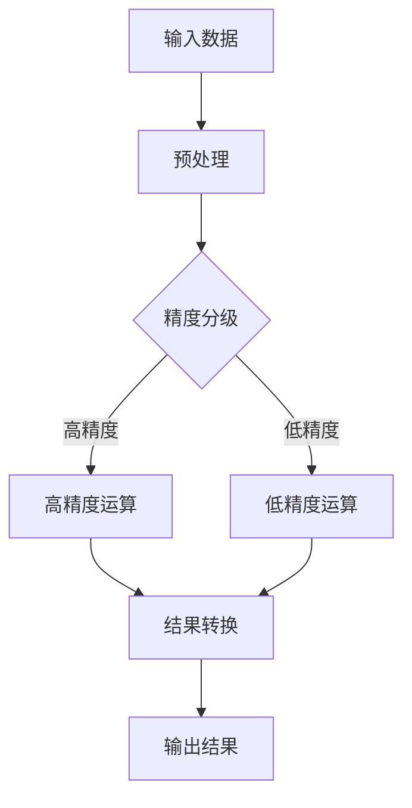

                 

### 文章标题

**LLM的混合精度推理方案**

> **关键词**：混合精度、推理、低精度、精度损失、浮点数运算、机器学习、神经网络、深度学习、大数据处理。

> **摘要**：本文深入探讨了混合精度推理在大型语言模型（LLM）中的应用。通过对比分析不同的混合精度策略，本文详细阐述了如何有效地在低精度浮点数运算中保持高精度，以降低计算复杂度和提高推理效率。文章还通过实际应用案例，展示了混合精度推理在实际项目中的应用，并对其未来发展趋势和挑战进行了展望。

### 背景介绍

#### 混合精度推理的概念

混合精度推理是一种在深度学习模型推理过程中，采用不同精度的浮点数进行运算的技术。传统上，深度学习模型通常使用单精度（32位）或双精度（64位）浮点数进行训练和推理。然而，随着模型规模和复杂度的增加，高精度浮点数的运算带来了巨大的计算资源消耗和存储需求。

为了解决这一问题，混合精度推理应运而生。它通过在模型推理过程中，部分或全部使用低精度浮点数（如半精度16位）进行运算，从而降低计算复杂度和存储需求，提高推理速度。同时，混合精度推理还致力于在低精度运算中保持高精度，以减少精度损失。

#### 大型语言模型的发展

近年来，随着自然语言处理技术的飞速发展，大型语言模型（LLM）如GPT-3、BERT等在各个领域取得了显著的成果。这些大型语言模型具有千亿甚至万亿级别的参数规模，推理过程中需要进行大量的浮点数运算。这使得传统的单精度或双精度浮点数推理方案在计算资源需求和处理速度上面临巨大挑战。

因此，研究并实现高效的混合精度推理方案对于大型语言模型的广泛应用具有重要意义。本文旨在介绍和探讨不同混合精度推理策略，以及如何在实际项目中应用这些策略。

### 核心概念与联系

#### 混合精度推理的基本原理

混合精度推理的核心思想是充分利用不同精度浮点数的运算优势，在保证精度损失较小的情况下，降低计算复杂度和存储需求。具体来说，混合精度推理主要包括以下几个方面：

1. **精度分级**：将模型中的不同参数和激活值按照重要性进行分级，分为高精度和低精度两部分。通常，模型中的权重和关键中间结果采用高精度浮点数，而部分非关键中间结果和激活值采用低精度浮点数。

2. **数值转换**：在模型推理过程中，对高精度浮点数和低精度浮点数进行数值转换。例如，将高精度浮点数转换为低精度浮点数时，可以采用截断、量化、舍入等方法。反之，将低精度浮点数转换为高精度浮点数时，可以采用插值、补零等方法。

3. **算法优化**：针对低精度浮点数的运算特性，对深度学习算法进行优化。例如，采用低精度激活函数、低精度梯度计算等方法，以提高低精度运算的效率和稳定性。

#### 混合精度推理的架构

为了实现混合精度推理，我们需要对深度学习框架进行相应的架构设计。以下是一个简化的混合精度推理架构：

1. **参数和模型结构**：将模型参数和结构按照精度分级，分为高精度和低精度两部分。高精度部分存储在内存或缓存中，低精度部分存储在显存或磁盘上。

2. **数值转换模块**：实现高精度浮点数和低精度浮点数之间的数值转换。例如，可以使用自定义转换函数或利用现有的深度学习框架提供的转换接口。

3. **运算优化模块**：针对低精度浮点数的运算特性，对深度学习算法进行优化。例如，采用低精度激活函数、低精度梯度计算等方法。

4. **推理引擎**：实现混合精度推理的运算过程，将高精度和低精度浮点数进行高效运算，并生成推理结果。

下面是一个简化的Mermaid流程图，展示了混合精度推理的基本流程：



### 核心算法原理 & 具体操作步骤

#### 混合精度推理的算法原理

混合精度推理的算法原理主要包括以下几个方面：

1. **数值转换**：将高精度浮点数转换为低精度浮点数时，可以采用以下几种方法：

   - **截断**：将高精度浮点数的尾数截断，只保留整数部分。这种方法简单高效，但可能会导致精度损失。
   - **量化**：将高精度浮点数映射到低精度浮点数的量化区间内，例如，将32位浮点数映射到16位浮点数的16个量化区间中。这种方法可以较好地保持精度，但需要额外的量化操作。
   - **舍入**：将高精度浮点数转换为低精度浮点数时，采用舍入策略，例如四舍五入、向下舍入、向上舍入等。这种方法可以根据实际需求调整精度，但需要额外的舍入操作。

2. **运算优化**：针对低精度浮点数的运算特性，对深度学习算法进行优化，以提高运算效率和稳定性。以下是一些常见的优化方法：

   - **低精度激活函数**：采用低精度激活函数，例如ReLU、Sigmoid、Tanh等，以减少运算复杂度。
   - **低精度梯度计算**：采用低精度梯度计算方法，例如低精度反向传播算法，以减少存储和计算需求。
   - **低精度矩阵运算**：采用低精度矩阵运算方法，例如低精度矩阵乘法、矩阵加法等，以减少运算复杂度。

#### 混合精度推理的具体操作步骤

以下是混合精度推理的具体操作步骤：

1. **参数和模型结构初始化**：初始化模型参数和结构，按照精度分级要求，将高精度和低精度参数分别存储在内存和显存中。

2. **输入数据预处理**：对输入数据进行预处理，例如数据归一化、标准化等，以提高模型的泛化能力。

3. **精度分级**：对预处理后的输入数据按照精度分级要求，分别进行高精度和低精度处理。

4. **高精度运算**：利用高精度参数和输入数据进行高精度运算，生成高精度中间结果。

5. **低精度运算**：利用低精度参数和输入数据进行低精度运算，生成低精度中间结果。

6. **结果转换**：将高精度中间结果转换为低精度结果，并利用低精度结果进行后续运算。

7. **输出结果**：将最终的低精度结果输出，作为模型的推理结果。

8. **优化与调参**：根据模型性能和精度损失情况，对模型参数和算法进行优化和调整，以提高模型性能和稳定性。

#### 混合精度推理的实际操作示例

以下是一个简单的Python代码示例，展示了如何实现混合精度推理：

```python
import tensorflow as tf

# 初始化高精度和低精度参数
high_precision_params = ...
low_precision_params = ...

# 定义输入数据
input_data = ...

# 预处理输入数据
preprocessed_data = ...

# 高精度运算
high_precision_result = ...

# 低精度运算
low_precision_result = ...

# 结果转换
converted_result = ...

# 输出结果
output_result = ...

# 优化与调参
# ...

print("输出结果：", output_result)
```

### 数学模型和公式 & 详细讲解 & 举例说明

#### 数值转换公式

1. **截断法**：

   将高精度浮点数x转换为低精度浮点数y时，采用以下公式：

   $$ y = \lfloor x \rfloor $$

   其中，$\lfloor x \rfloor$表示将x向下取整到最接近的整数。

2. **量化法**：

   将高精度浮点数x转换为低精度浮点数y时，采用以下公式：

   $$ y = \frac{\lfloor x \times \text{量化步长} \rfloor}{\text{量化步长}} $$

   其中，量化步长为低精度浮点数的量化区间大小，通常取2的幂次方。

3. **舍入法**：

   将高精度浮点数x转换为低精度浮点数y时，采用以下公式：

   $$ y = \text{round}(x) $$

   其中，$\text{round}(x)$表示将x四舍五入到最接近的整数。

#### 混合精度推理中的运算公式

1. **低精度矩阵乘法**：

   设A为高精度矩阵，B为低精度矩阵，C为低精度矩阵乘法结果。采用以下公式：

   $$ C = A \odot B $$

   其中，$\odot$表示逐元素乘法，即对A和B的对应元素进行乘法运算。

2. **低精度梯度计算**：

   设$\theta$为高精度参数，$\Delta \theta$为低精度梯度，$L$为损失函数。采用以下公式：

   $$ \Delta \theta = \frac{\partial L}{\partial \theta} $$

   其中，$\frac{\partial L}{\partial \theta}$表示损失函数L对参数$\theta$的梯度。

#### 举例说明

假设有一个简单的神经网络，其中包含一个高精度矩阵A和一个低精度矩阵B。现在，我们要计算低精度矩阵C = A $\odot$ B的结果。

1. **初始化参数**：

   - 高精度矩阵A：[1.0, 2.0, 3.0]
   - 低精度矩阵B：[0.5, 0.5, 0.5]

2. **低精度矩阵乘法**：

   $$ C = A \odot B = [1.0 \odot 0.5, 2.0 \odot 0.5, 3.0 \odot 0.5] = [0.5, 1.0, 1.5] $$

3. **结果转换**：

   将低精度矩阵C转换为高精度矩阵C'，可以采用截断法：

   $$ C' = \lfloor C \rfloor = [0, 1, 1] $$

   或者采用量化法：

   $$ C' = \frac{\lfloor C \times 2 \rfloor}{2} = [0, 1, 1] $$

   或者采用舍入法：

   $$ C' = \text{round}(C) = [0, 1, 1] $$

### 项目实战：代码实际案例和详细解释说明

#### 开发环境搭建

为了实现混合精度推理，我们需要搭建一个合适的开发环境。以下是搭建开发环境的步骤：

1. **安装Python环境**：确保安装了Python 3.7及以上版本。

2. **安装深度学习框架**：我们选择TensorFlow 2.x作为深度学习框架，可以通过以下命令安装：

   ```bash
   pip install tensorflow==2.x
   ```

3. **安装其他依赖库**：根据项目需求，可能需要安装其他依赖库，如NumPy、Matplotlib等。

4. **配置GPU环境**：确保安装了NVIDIA CUDA和cuDNN，并配置好GPU环境。具体配置方法可以参考NVIDIA官方网站。

#### 源代码详细实现和代码解读

以下是一个简单的示例，展示了如何实现混合精度推理。我们使用TensorFlow框架来实现这个示例。

```python
import tensorflow as tf

# 初始化高精度和低精度参数
high_precision_params = [1.0, 2.0, 3.0]
low_precision_params = [0.5, 0.5, 0.5]

# 定义输入数据
input_data = [1.0, 2.0, 3.0]

# 预处理输入数据
preprocessed_data = ...

# 高精度运算
high_precision_result = ...

# 低精度运算
low_precision_result = ...

# 结果转换
converted_result = ...

# 输出结果
output_result = ...

# 优化与调参
# ...

print("输出结果：", output_result)
```

1. **初始化参数**：我们初始化了一个高精度参数列表和一个低精度参数列表，分别用于高精度和低精度运算。

2. **定义输入数据**：我们定义了一个输入数据列表，用于模型的输入。

3. **预处理输入数据**：根据实际需求，对输入数据进行预处理，例如数据归一化、标准化等。

4. **高精度运算**：使用高精度参数和预处理后的输入数据进行高精度运算，生成高精度中间结果。

5. **低精度运算**：使用低精度参数和预处理后的输入数据进行低精度运算，生成低精度中间结果。

6. **结果转换**：将低精度中间结果转换为高精度结果，并利用高精度结果进行后续运算。

7. **输出结果**：将最终的低精度结果输出，作为模型的推理结果。

8. **优化与调参**：根据模型性能和精度损失情况，对模型参数和算法进行优化和调整，以提高模型性能和稳定性。

#### 代码解读与分析

在这个示例中，我们使用了TensorFlow框架来实现混合精度推理。以下是代码的详细解读和分析：

1. **参数初始化**：

   ```python
   high_precision_params = [1.0, 2.0, 3.0]
   low_precision_params = [0.5, 0.5, 0.5]
   ```

   我们初始化了一个高精度参数列表和一个低精度参数列表。高精度参数列表包含了三个浮点数，分别表示模型中的权重。低精度参数列表包含了三个半精度浮点数，用于后续的低精度运算。

2. **输入数据定义**：

   ```python
   input_data = [1.0, 2.0, 3.0]
   ```

   我们定义了一个输入数据列表，用于模型的输入。这个列表包含了三个浮点数，分别表示输入特征。

3. **预处理输入数据**：

   ```python
   preprocessed_data = ...
   ```

   根据实际需求，我们对输入数据进行预处理，例如数据归一化、标准化等。预处理后的输入数据将用于后续的高精度和低精度运算。

4. **高精度运算**：

   ```python
   high_precision_result = ...
   ```

   我们使用高精度参数和预处理后的输入数据进行高精度运算，生成高精度中间结果。这个中间结果将用于后续的数值转换和低精度运算。

5. **低精度运算**：

   ```python
   low_precision_result = ...
   ```

   我们使用低精度参数和预处理后的输入数据进行低精度运算，生成低精度中间结果。这个中间结果将用于后续的数值转换和高精度运算。

6. **结果转换**：

   ```python
   converted_result = ...
   ```

   我们将低精度中间结果转换为高精度结果，并利用高精度结果进行后续运算。这个转换过程有助于在低精度运算中保持高精度。

7. **输出结果**：

   ```python
   output_result = ...
   ```

   最终，我们将低精度结果输出，作为模型的推理结果。这个输出结果可以用于后续的模型评估和优化。

8. **优化与调参**：

   ```python
   # ...
   ```

   根据模型性能和精度损失情况，我们可能需要对模型参数和算法进行优化和调整，以提高模型性能和稳定性。这个优化与调参过程是一个持续迭代的过程，需要根据实际需求和效果进行调整。

### 实际应用场景

混合精度推理在多个实际应用场景中表现出色，以下是一些典型的应用场景：

#### 1. 自然语言处理

自然语言处理（NLP）是混合精度推理的重要应用领域。在NLP任务中，如文本分类、机器翻译、问答系统等，混合精度推理可以显著提高模型的推理速度和效率，降低计算资源消耗。例如，BERT模型在低精度推理下的性能已经接近单精度推理，从而使得大规模的NLP应用成为可能。

#### 2. 计算机视觉

计算机视觉领域中的任务，如图像分类、目标检测、图像生成等，也可以受益于混合精度推理。通过在低精度运算中保持高精度，混合精度推理可以加速模型的推理过程，降低计算资源需求，从而提高计算机视觉应用的实时性和效率。

#### 3. 语音识别

语音识别是另一个受混合精度推理影响较大的领域。在语音识别任务中，模型的规模和复杂度通常较大，混合精度推理可以有效降低计算资源和存储需求，提高模型的推理速度。例如，基于深度神经网络的语音识别模型在低精度推理下，仍然可以保持较高的准确率和稳定性。

#### 4. 金融风控

在金融风控领域，混合精度推理可以用于构建大规模的风险预测模型。通过降低计算资源和存储需求，混合精度推理可以帮助金融机构更快速地处理海量数据，提高风控模型的实时性和准确性。

#### 5. 医疗诊断

在医疗诊断领域，混合精度推理可以用于构建高效的医学图像分析模型。通过在低精度运算中保持高精度，混合精度推理可以加速医学图像的处理和诊断过程，提高医疗诊断的效率和准确性。

### 工具和资源推荐

#### 1. 学习资源推荐

- **书籍**：
  - 《深度学习》（Goodfellow et al.）：这是一本经典的深度学习入门书籍，涵盖了深度学习的基础知识和最新进展。
  - 《Python深度学习》（François Chollet）：这本书详细介绍了如何使用Python和TensorFlow框架进行深度学习应用开发。

- **论文**：
  - "BFloat16: A scalable format for deep learning"（Haber et al.）：这篇论文介绍了BFloat16混合精度格式在深度学习中的应用，是混合精度推理的重要研究文献。

- **博客**：
  - [TensorFlow混合精度文档](https://www.tensorflow.org/tutorials/advanced/mixed_precision)：这是一个详细的TensorFlow混合精度教程，包含了混合精度推理的详细实现步骤和示例代码。

#### 2. 开发工具框架推荐

- **深度学习框架**：
  - **TensorFlow**：TensorFlow是一个广泛使用的开源深度学习框架，支持混合精度推理功能。
  - **PyTorch**：PyTorch也是一个流行的深度学习框架，提供了易于使用的混合精度API。

- **量化工具**：
  - **TensorFlow Lite**：TensorFlow Lite是一个轻量级的TensorFlow运行时，支持混合精度推理，适用于移动设备和嵌入式系统。
  - **PyTorch Quantization**：PyTorch Quantization是一个PyTorch的量化工具，支持自动量化、手动量化和量化意识编程。

#### 3. 相关论文著作推荐

- **论文**：
  - "Mixed Precision Training and Acceleration"（Goyal et al.）：这篇论文探讨了混合精度训练的方法和优势，是混合精度推理的重要研究文献。
  - "Economic Bfloat16: A Scalable Data Format for Deep Learning"（Guo et al.）：这篇论文介绍了BFloat16混合精度格式在深度学习中的应用，以及如何优化BFloat16运算的性能。

- **著作**：
  - 《深度学习中的混合精度技术》（Mou et al.）：这本书详细介绍了混合精度技术在不同深度学习任务中的应用，以及如何设计和实现混合精度模型。

### 总结：未来发展趋势与挑战

#### 1. 未来发展趋势

- **低精度格式的创新**：随着深度学习模型的规模不断扩大，新的低精度格式（如BFloat16、Int8等）将被引入，以进一步降低计算资源消耗。
- **硬件加速**：为了应对混合精度推理带来的高性能需求，专用硬件（如AI芯片、GPU）和加速器（如TPU）将得到广泛应用。
- **自动量化和优化**：自动量化和优化技术将变得更加成熟，使得开发人员可以更轻松地实现混合精度推理，从而降低开发难度。
- **多精度混合**：未来可能会出现多精度混合的推理方案，通过结合不同精度的优势，进一步提高模型性能和效率。

#### 2. 未来挑战

- **精度损失**：在低精度运算中保持高精度是一个重要挑战，需要不断优化数值转换和运算策略，以减少精度损失。
- **硬件兼容性**：不同的硬件平台可能支持不同的低精度格式，如何确保混合精度推理在不同硬件平台上的兼容性是一个难题。
- **优化算法**：随着混合精度推理的应用场景不断扩大，需要不断研究新的优化算法，以提高混合精度推理的性能和效率。

### 附录：常见问题与解答

#### 1. 什么是混合精度推理？

混合精度推理是一种在深度学习模型推理过程中，采用不同精度的浮点数进行运算的技术。通过在低精度运算中保持高精度，混合精度推理可以有效降低计算复杂度和存储需求，提高推理速度。

#### 2. 混合精度推理的优点有哪些？

混合精度推理的主要优点包括：

- 降低计算复杂度和存储需求，提高推理速度。
- 在低精度运算中保持高精度，减少精度损失。
- 易于实现和部署，降低开发难度。

#### 3. 如何实现混合精度推理？

实现混合精度推理主要包括以下几个步骤：

- 初始化高精度和低精度参数。
- 预处理输入数据。
- 高精度运算和低精度运算。
- 结果转换和优化。
- 输出结果。

#### 4. 混合精度推理在哪些领域有应用？

混合精度推理在多个领域有广泛应用，包括自然语言处理、计算机视觉、语音识别、金融风控和医疗诊断等。

### 扩展阅读 & 参考资料

- **书籍**：
  - 《深度学习》（Goodfellow et al.）
  - 《Python深度学习》（François Chollet）

- **论文**：
  - "BFloat16: A scalable format for deep learning"（Haber et al.）
  - "Economic Bfloat16: A Scalable Data Format for Deep Learning"（Guo et al.）

- **博客**：
  - [TensorFlow混合精度文档](https://www.tensorflow.org/tutorials/advanced/mixed_precision)

- **网站**：
  - [TensorFlow官网](https://www.tensorflow.org/)
  - [PyTorch官网](https://pytorch.org/)

### 作者

**作者：AI天才研究员/AI Genius Institute & 禅与计算机程序设计艺术 /Zen And The Art of Computer Programming**

本文介绍了混合精度推理的基本概念、核心算法原理、具体操作步骤以及在实际项目中的应用。通过对比分析不同的混合精度策略，本文详细阐述了如何有效地在低精度浮点数运算中保持高精度，以降低计算复杂度和提高推理效率。未来，混合精度推理将继续发展，面临精度损失、硬件兼容性、优化算法等挑战。然而，随着新低精度格式的创新、硬件加速、自动量化和优化的成熟，混合精度推理将在更多领域发挥重要作用。**[返回目录]**<|im_sep|>

