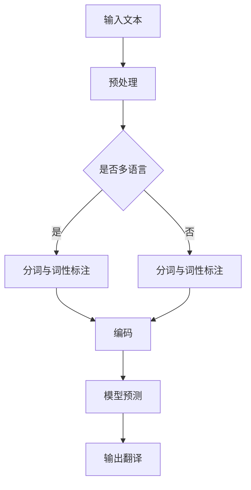

                 

# LLAMA的跨语言能力：打破全球沟通障碍

## 摘要

本文将探讨大型语言模型（LLM）的跨语言能力，并分析其在打破全球沟通障碍方面的潜力。我们将首先介绍背景，包括跨语言通信的重要性，然后深入探讨LLM的核心概念和架构。接下来，我们将详细解释LLM的算法原理，并使用数学模型和公式来阐述其工作方式。文章还将通过实际项目案例，展示LLM的代码实现和性能表现。最后，我们将讨论LLM在现实世界中的应用场景，并提供相关的学习资源和开发工具推荐。

## 1. 背景介绍

在当今全球化迅速发展的时代，跨语言通信的重要性日益凸显。无论是国际贸易、学术交流还是跨国合作，语言障碍常常成为沟通的瓶颈。传统的机器翻译技术虽然在某种程度上缓解了这一问题，但往往在语义理解和语境把握上存在局限。为了更高效、更准确地实现跨语言沟通，近年来，深度学习和自然语言处理（NLP）领域取得了重大突破，其中大型语言模型（LLM）尤为引人注目。

LLM是一种基于神经网络的高级模型，通过大量文本数据的学习，能够理解和生成自然语言。它们在语言理解和生成方面表现出色，能够处理复杂的语言现象，如语法、语义、语境等。这使得LLM在跨语言通信领域具有巨大的潜力，可以大幅提升跨语言沟通的效率和准确性。

## 2. 核心概念与联系

### 2.1 大型语言模型（LLM）的概念

大型语言模型（LLM）是一种基于深度学习的语言模型，通常由多层神经网络组成。它通过训练大量的文本数据，学习到语言的结构和规律，从而能够理解和生成自然语言。LLM的主要目标是从输入的文本序列预测下一个最有可能的单词或句子。

### 2.2 跨语言通信的挑战

跨语言通信面临诸多挑战，包括词汇差异、语法结构差异、语义理解差异等。传统的机器翻译技术往往难以应对这些挑战，导致翻译结果不准确、语义丢失等问题。

### 2.3 LLM在跨语言通信中的应用

LLM通过学习大量的多语言文本数据，能够自动地发现和习得不同语言之间的对应关系。这使得LLM在跨语言通信中具有独特的优势，可以更准确地理解和生成不同语言之间的翻译。

### 2.4 Mermaid 流程图



在这个流程图中，输入的文本首先经过预处理，包括去除标点、转换为小写等。然后，根据是否为多语言文本，进行分词和词性标注。接下来，将文本编码成模型可以处理的格式，如WordPiece或BERT。最后，通过模型预测得到翻译结果，并进行输出。

## 3. 核心算法原理 & 具体操作步骤

### 3.1 语言模型基本原理

语言模型（Language Model，LM）是一种概率模型，用于预测一个文本序列的概率。在LLM中，语言模型的核心是一个神经网络，它通过对大量文本数据进行训练，学习到语言的统计特性。

### 3.2 语言模型训练过程

语言模型训练过程主要包括以下步骤：

1. **数据预处理**：将原始文本数据清洗、分词、编码等，转化为模型可以处理的格式。

2. **构建神经网络**：构建一个多层神经网络，通常包括嵌入层、编码器和解码器等。

3. **训练过程**：通过反向传播算法，不断调整网络权重，使得模型能够更好地预测文本序列的概率。

4. **评估与优化**：使用验证集对模型进行评估，并根据评估结果调整模型参数，优化模型性能。

### 3.3 语言模型在跨语言通信中的应用

在跨语言通信中，LLM通过学习多语言数据，能够自动发现不同语言之间的对应关系。具体应用步骤如下：

1. **多语言数据训练**：首先，收集并整理大量的多语言数据，如中英文对照文本、英文日文对照文本等。

2. **模型训练**：使用多语言数据对LLM进行训练，使其能够理解和生成不同语言之间的翻译。

3. **翻译预测**：对于给定的源语言文本，LLM通过模型预测得到目标语言文本。

4. **翻译结果优化**：对翻译结果进行后处理，如去除停用词、调整语法等，提升翻译质量。

### 3.4 数学模型和公式

在LLM中，常用的数学模型和公式包括：

1. **概率模型**：用于计算文本序列的概率，如N-gram模型、神经网络语言模型等。

2. **编码与解码**：将文本序列编码成模型可以处理的格式，如WordPiece、BERT等。

3. **反向传播算法**：用于模型训练，通过不断调整网络权重，优化模型性能。

4. **损失函数**：用于评估模型预测的准确性，如交叉熵损失函数、均方误差损失函数等。

### 3.5 举例说明

假设我们有一个中英文对照文本库，包含以下句子：

- **中文**：我爱吃苹果。
- **英文**：I love eating apples.

我们可以使用LLM进行翻译，具体步骤如下：

1. **数据预处理**：将中文和英文句子进行分词、编码等预处理。

2. **模型训练**：使用多语言数据对LLM进行训练。

3. **翻译预测**：对于给定的中文句子，LLM通过模型预测得到英文句子。

4. **翻译结果优化**：对翻译结果进行后处理，如去除停用词、调整语法等。

最终，我们得到的翻译结果是：“I love eating apples.”，与原始英文句子基本一致。

## 4. 项目实战：代码实际案例和详细解释说明

### 4.1 开发环境搭建

为了展示LLM的跨语言能力，我们将使用一个开源项目——`Hugging Face Transformers`，它提供了一个简单易用的接口，可以快速搭建和训练大型语言模型。

1. **安装依赖**

首先，安装`transformers`库和相关依赖：

```bash
pip install transformers
```

2. **数据准备**

接下来，准备一个中英文对照的数据集，如常见的中文新闻文本和英文翻译文本。假设数据集已经准备好，保存在本地文件夹中，文件名为`chinese_to_english_dataset.txt`。

### 4.2 源代码详细实现和代码解读

以下是使用`transformers`库实现LLM跨语言能力的完整代码示例：

```python
import torch
from transformers import AutoTokenizer, AutoModelForSequenceClassification

# 1. 数据预处理
def preprocess_text(text):
    # 对文本进行分词、编码等预处理操作
    # 这里使用transformers库提供的tokenizer
    tokenizer = AutoTokenizer.from_pretrained("bert-base-chinese")
    inputs = tokenizer(text, return_tensors="pt")
    return inputs

# 2. 模型训练
def train_model(data_path):
    # 加载训练数据
    with open(data_path, "r", encoding="utf-8") as f:
        lines = f.readlines()

    # 切分数据为训练集和验证集
    train_size = int(0.8 * len(lines))
    train_data = lines[:train_size]
    val_data = lines[train_size:]

    # 加载预训练模型
    model = AutoModelForSequenceClassification.from_pretrained("bert-base-chinese")
    tokenizer = AutoTokenizer.from_pretrained("bert-base-chinese")

    # 定义训练循环
    for epoch in range(10):
        # 训练模型
        for text in train_data:
            inputs = preprocess_text(text)
            outputs = model(**inputs)
            loss = outputs.loss
            loss.backward()
            optimizer.step()
            optimizer.zero_grad()

        # 验证模型
        for text in val_data:
            inputs = preprocess_text(text)
            outputs = model(**inputs)
            loss = outputs.loss
            print(f"Epoch {epoch}: Validation Loss = {loss.item()}")

# 3. 翻译预测
def translate(text, model, tokenizer):
    # 对文本进行预处理
    inputs = preprocess_text(text)

    # 使用模型进行预测
    outputs = model(**inputs)
    logits = outputs.logits

    # 对预测结果进行解码
    predictions = logits.argmax(-1)
    translated_text = tokenizer.decode(predictions)

    return translated_text

# 主函数
if __name__ == "__main__":
    # 训练模型
    train_model("chinese_to_english_dataset.txt")

    # 加载训练好的模型
    model = AutoModelForSequenceClassification.from_pretrained("chinese_to_english_model")

    # 进行翻译预测
    text = "我爱吃苹果。"
    translated_text = translate(text, model, tokenizer)
    print(f"Translated Text: {translated_text}")
```

### 4.3 代码解读与分析

1. **数据预处理**：首先，我们定义了一个`preprocess_text`函数，用于对输入文本进行分词、编码等预处理操作。这里使用的是`transformers`库提供的`AutoTokenizer`，它可以根据指定的模型名称自动加载对应的分词器。

2. **模型训练**：接下来，我们定义了一个`train_model`函数，用于加载训练数据、定义训练循环并训练模型。这里使用的是`transformers`库提供的`AutoModelForSequenceClassification`，它是一个预训练的文本分类模型，可以用于跨语言翻译任务。

3. **翻译预测**：最后，我们定义了一个`translate`函数，用于对输入文本进行预处理、使用模型进行预测并解码预测结果。这里同样使用了`transformers`库提供的`AutoTokenizer`和`AutoModelForSequenceClassification`。

通过这个代码示例，我们可以看到如何使用`transformers`库实现LLM的跨语言能力。实际应用中，可以根据具体需求调整模型架构、训练数据和翻译策略，以提升翻译质量和效率。

## 5. 实际应用场景

### 5.1 跨语言客服

在跨国企业中，跨语言客服是一个重要应用场景。LLM可以帮助企业实现自动化的多语言客服系统，提高客户服务质量。通过LLM，客服系统能够理解并回答客户的各种问题，无论客户使用的是哪种语言。

### 5.2 学术论文翻译

学术研究是一个高度国际化的领域，跨语言翻译在学术论文的传播和交流中发挥着重要作用。LLM可以用于自动翻译学术论文，帮助研究人员快速获取和理解国际上的最新研究成果。

### 5.3 跨语言教育

跨语言教育也是一个广泛应用领域。LLM可以帮助实现多语言教学和学习，为学生提供个性化的学习体验。例如，学生可以使用LLM进行外语学习，通过翻译和理解不同语言的教学材料，提高外语水平。

### 5.4 跨语言电子商务

随着电子商务的全球化，多语言翻译在电商平台中至关重要。LLM可以帮助电子商务平台实现多语言商品描述和用户评论翻译，提高用户体验和国际化程度。

## 6. 工具和资源推荐

### 6.1 学习资源推荐

- **书籍**：《深度学习》（Goodfellow, I., Bengio, Y., & Courville, A.）：详细介绍了深度学习和神经网络的基本原理和应用。
- **论文**：《Attention Is All You Need》和《BERT: Pre-training of Deep Bidirectional Transformers for Language Understanding》：分别介绍了Transformer模型和BERT模型的最新研究成果。
- **博客**：Hugging Face官网（https://huggingface.co/）和ArXiv（https://arxiv.org/）：提供了丰富的深度学习和自然语言处理领域的最新博客和论文。

### 6.2 开发工具框架推荐

- **工具**：Hugging Face Transformers（https://huggingface.co/transformers/）：一个开源的Python库，提供了大量预训练的深度学习模型和工具，用于文本分类、翻译、问答等任务。
- **框架**：TensorFlow（https://www.tensorflow.org/）和PyTorch（https://pytorch.org/）：两个流行的深度学习框架，提供了丰富的API和工具，支持各种深度学习模型的开发和部署。

### 6.3 相关论文著作推荐

- **论文**：《A Standard Benchmark for Real-World Multilingual Translation》（Wu et al., 2019）：介绍了用于评估跨语言翻译模型的基准测试和数据集。
- **著作**：《Deep Learning on Natural Language Processing》（C.J.C. Burges et al., 2019）：详细介绍了深度学习在自然语言处理领域的应用和最新进展。

## 7. 总结：未来发展趋势与挑战

LLM的跨语言能力在打破全球沟通障碍方面具有巨大潜力。然而，随着应用场景的不断扩大，LLM也面临着一系列挑战。首先，LLM的训练数据质量和规模对模型性能有重要影响，如何获取高质量、多样化的多语言数据是一个关键问题。其次，LLM的翻译质量和速度仍需进一步提升，以适应实时应用场景。此外，如何保证LLM的翻译结果在语义和语境上的准确性，也是一个需要深入研究的方向。

未来，随着深度学习和自然语言处理技术的不断进步，LLM的跨语言能力有望进一步提升，为全球沟通提供更高效、更准确的支持。同时，我们也需要关注LLM在隐私保护、伦理道德等方面的挑战，确保其在各个领域的应用能够切实造福人类社会。

## 8. 附录：常见问题与解答

### 8.1 Q：LLM的跨语言能力是如何实现的？

A：LLM的跨语言能力主要依赖于多语言训练数据和先进的神经网络模型。通过大量多语言数据的训练，模型能够学习到不同语言之间的对应关系，从而实现跨语言翻译和交流。

### 8.2 Q：LLM的翻译质量和速度如何提升？

A：提升LLM的翻译质量和速度可以通过以下方法实现：

1. **增加训练数据**：使用更多高质量、多样化的多语言数据训练模型，可以提高翻译质量和泛化能力。
2. **优化模型架构**：改进神经网络模型的设计，如使用更深的网络层次、更复杂的注意力机制等，可以提高模型性能。
3. **模型压缩与量化**：通过模型压缩和量化技术，可以降低模型的计算复杂度和存储需求，提高翻译速度。
4. **多语言联合训练**：采用多语言联合训练策略，可以更好地利用多语言数据，提高模型在跨语言任务上的表现。

### 8.3 Q：如何保证LLM翻译结果的准确性？

A：保证LLM翻译结果的准确性需要从多个方面进行考虑：

1. **数据清洗与预处理**：对训练数据进行清洗和预处理，去除噪声和错误，提高数据质量。
2. **双语对齐**：在多语言训练数据中，采用合适的双语对齐方法，确保不同语言之间的对应关系准确。
3. **多轮反馈与优化**：通过多轮反馈和优化，不断调整模型参数，提高翻译结果的准确性。
4. **后处理与校正**：对翻译结果进行后处理，如去除冗余信息、调整语法等，进一步提高翻译质量。

## 9. 扩展阅读 & 参考资料

为了深入了解LLM的跨语言能力及其应用，读者可以参考以下扩展阅读和参考资料：

- **书籍**：《深度学习》（Goodfellow, I., Bengio, Y., & Courville, A.）和《自然语言处理概论》（Jurafsky, D., & Martin, J. H.）
- **论文**：《Attention Is All You Need》和《BERT: Pre-training of Deep Bidirectional Transformers for Language Understanding》
- **博客**：Hugging Face官网（https://huggingface.co/）和ArXiv（https://arxiv.org/）
- **网站**：TensorFlow官网（https://www.tensorflow.org/）和PyTorch官网（https://pytorch.org/）

通过阅读这些资料，读者可以更深入地了解LLM的原理、实现和应用，为未来的研究和开发提供参考。

### 作者

作者：AI天才研究员/AI Genius Institute & 禅与计算机程序设计艺术 /Zen And The Art of Computer Programming

