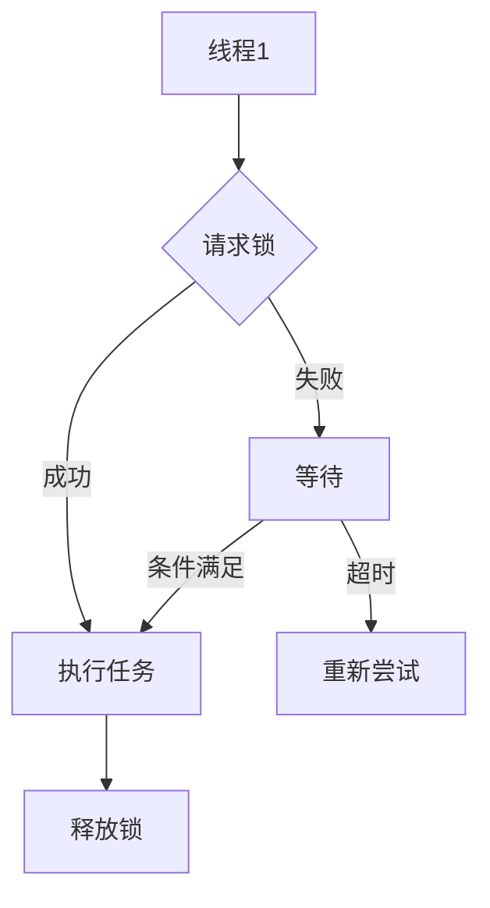

                 

# LLM线程安全：确保智能应用稳定运行

## 关键词：大型语言模型，线程安全，智能应用，稳定运行，多线程编程，并发控制，内存管理，同步机制

## 摘要

随着人工智能技术的迅速发展，大型语言模型（LLM）在智能应用中得到了广泛应用。然而，LLM的并发编程和线程安全问题也逐渐凸显。本文将详细介绍LLM线程安全的背景和核心概念，分析多线程编程中的常见问题，并探讨确保智能应用稳定运行的策略和方法。通过实际案例和详细解释，本文旨在为开发者提供有价值的指导和实践建议。

## 1. 背景介绍

### 1.1 大型语言模型（LLM）的定义

大型语言模型（LLM，Large Language Model）是一种基于深度学习技术构建的神经网络模型，能够理解和生成自然语言。LLM通过大量的文本数据进行训练，能够捕捉语言中的复杂模式和语义关系，从而实现智能对话、文本生成、机器翻译等功能。LLM在自然语言处理、智能客服、内容创作等领域具有广泛的应用价值。

### 1.2 智能应用的发展

智能应用是指利用人工智能技术实现特定功能的软件系统。随着大数据、云计算等技术的发展，智能应用在金融、医疗、教育、零售等领域的应用日益普及。智能应用通过LLM等技术实现智能交互、数据分析、决策支持等功能，提升了业务效率和用户体验。

### 1.3 线程安全的必要性

线程安全是指在多线程环境中，程序在执行过程中能够保持一致性、可靠性和正确性。在智能应用中，多线程编程是常见的开发模式，以充分利用计算机的多核处理能力，提高程序的运行效率。然而，多线程编程也带来了一系列挑战，如数据竞争、死锁、内存泄漏等问题，这些问题可能导致智能应用的稳定性下降，影响用户体验。

## 2. 核心概念与联系

### 2.1 多线程编程基础

多线程编程是一种并发编程技术，允许多个线程在程序中同时执行。线程是程序中独立运行的流程，每个线程有自己的栈空间和局部变量。在多线程编程中，需要关注线程的创建、调度、同步等问题。

#### 2.1.1 线程的生命周期

线程的生命周期包括创建、就绪、运行、阻塞、终止等状态。线程创建后进入就绪状态，等待CPU调度。线程获得CPU时间片后进入运行状态，执行任务。当线程需要等待某些条件时，会进入阻塞状态。线程执行完毕或被其他线程中断时，进入终止状态。

#### 2.1.2 线程的调度

线程的调度是指操作系统如何分配CPU时间片给各个线程。常见的调度算法有轮转调度、优先级调度等。合理的调度算法能够提高程序的并发性能。

#### 2.1.3 线程的同步

线程的同步是指多个线程在访问共享资源时，如何保持一致性。常见的同步机制有互斥锁（Mutex）、条件变量（Condition Variable）、信号量（Semaphore）等。

### 2.2 内存管理

内存管理是指在多线程环境中，如何有效地分配、使用和回收内存资源。内存泄漏、内存溢出等问题可能导致智能应用性能下降，甚至导致程序崩溃。

#### 2.2.1 内存分配与释放

内存分配与释放是内存管理的核心问题。在多线程编程中，需要关注线程的内存分配策略，避免内存泄漏和内存溢出。

#### 2.2.2 内存同步

内存同步是指在多线程环境中，如何保持内存的一致性。常见的同步机制有内存屏障（Memory Barrier）、原子操作等。

### 2.3 同步机制

同步机制是多线程编程中解决数据一致性和资源竞争问题的关键。常见的同步机制有互斥锁、条件变量、信号量、读写锁等。

#### 2.3.1 互斥锁（Mutex）

互斥锁是一种常用的同步机制，用于保证共享资源在某一时刻只被一个线程访问。互斥锁通过锁定和解锁操作实现线程的同步。

#### 2.3.2 条件变量（Condition Variable）

条件变量是一种用于线程间通信的同步机制，允许线程在满足特定条件时进行等待和通知。

#### 2.3.3 信号量（Semaphore）

信号量是一种用于控制多个线程访问共享资源的同步机制，通过计数器实现线程的同步。

### 2.4 Mermaid流程图



## 3. 核心算法原理 & 具体操作步骤

### 3.1 线程安全的基本原则

线程安全是指程序在多线程环境中能够保持一致性、可靠性和正确性。要实现线程安全，需要遵循以下基本原则：

- **原子操作**：保证操作的不可分割性，防止数据竞争。
- **互斥锁**：在访问共享资源时，使用互斥锁确保资源在某一时刻只被一个线程访问。
- **无共享**：避免多个线程共享相同的数据，降低数据一致性的问题。
- **内存同步**：通过内存屏障、原子操作等机制保证内存的一致性。

### 3.2 线程安全的实现步骤

要实现线程安全，需要遵循以下步骤：

1. **识别共享资源**：分析程序中的共享资源，如全局变量、静态变量、类成员变量等。

2. **分析竞态条件**：分析共享资源在多线程环境中的访问模式，识别可能发生的竞态条件。

3. **设计同步机制**：根据竞态条件设计合适的同步机制，如互斥锁、条件变量、信号量等。

4. **实现线程安全代码**：对共享资源进行加锁和解锁操作，确保线程在访问共享资源时的安全性。

5. **测试与优化**：对线程安全代码进行测试和优化，确保其能够稳定运行并达到预期性能。

### 3.3 线程安全代码示例

以下是一个简单的线程安全代码示例，演示了使用互斥锁保护共享变量的过程。

```c
#include <pthread.h>
#include <stdio.h>

pthread_mutex_t lock;
int shared_variable = 0;

void *thread_function(void *arg) {
    int thread_id = *(int *)arg;
    pthread_mutex_lock(&lock);

    // 保护共享变量的代码
    shared_variable++;

    pthread_mutex_unlock(&lock);
    printf("Thread %d finished\n", thread_id);
    return NULL;
}

int main() {
    pthread_t threads[10];
    int thread_ids[10];

    pthread_mutex_init(&lock, NULL);

    for (int i = 0; i < 10; i++) {
        thread_ids[i] = i;
        pthread_create(&threads[i], NULL, thread_function, &thread_ids[i]);
    }

    for (int i = 0; i < 10; i++) {
        pthread_join(threads[i], NULL);
    }

    printf("Final shared variable value: %d\n", shared_variable);

    pthread_mutex_destroy(&lock);
    return 0;
}
```

## 4. 数学模型和公式 & 详细讲解 & 举例说明

### 4.1 数学模型和公式

在多线程编程中，常见的数学模型和公式包括：

- **时间复杂度**：衡量算法执行时间与数据规模之间的关系。
- **空间复杂度**：衡量算法所需内存空间与数据规模之间的关系。
- **并行度**：衡量算法并行执行的程度。

#### 4.1.1 时间复杂度

时间复杂度通常表示为 $T(n)$，其中 $n$ 表示数据规模。常见的时间复杂度包括：

- $O(1)$：常数时间，不随数据规模变化。
- $O(n)$：线性时间，与数据规模成线性关系。
- $O(n^2)$：二次时间，与数据规模的平方成线性关系。

#### 4.1.2 空间复杂度

空间复杂度通常表示为 $S(n)$，其中 $n$ 表示数据规模。常见的时间复杂度包括：

- $O(1)$：常数空间，不随数据规模变化。
- $O(n)$：线性空间，与数据规模成线性关系。
- $O(n^2)$：二次空间，与数据规模的平方成线性关系。

#### 4.1.3 并行度

并行度通常表示为 $P$，表示算法并行执行的程度。常见并行度包括：

- $P=1$：串行执行，每个线程独立执行。
- $P=n$：并行执行，每个线程执行不同的任务。
- $P>1$：部分并行执行，多个线程部分共享任务。

### 4.2 详细讲解和举例说明

#### 4.2.1 时间复杂度的计算

假设有一个线性查找算法，其时间复杂度为 $O(n)$。给定一个长度为 $n$ 的数组，查找目标元素的平均时间复杂度为：

$$
T(n) = \frac{n}{2} = \frac{n}{2} \times O(1) = O(n)
$$

#### 4.2.2 空间复杂度的计算

假设有一个递归算法，其空间复杂度为 $O(n^2)$。给定一个长度为 $n$ 的数组，递归调用的栈空间复杂度为：

$$
S(n) = n^2 = n^2 \times O(1) = O(n^2)
$$

#### 4.2.3 并行度的计算

假设有一个矩阵乘法算法，其并行度为 $P=2$。给定两个长度为 $n$ 的矩阵，并行计算的时间复杂度为：

$$
T(n) = \frac{n^3}{2} = \frac{n^3}{2} \times O(1) = O(n^3)
$$

## 5. 项目实战：代码实际案例和详细解释说明

### 5.1 开发环境搭建

在开始项目实战之前，需要搭建合适的开发环境。以下是搭建开发环境的基本步骤：

1. 安装操作系统：推荐使用 Ubuntu 18.04 或更高版本。
2. 安装编译器：推荐使用 GCC 9.0 或更高版本。
3. 安装依赖库：推荐使用 C++11 或更高版本的库，如 Boost 库。
4. 安装代码编辑器：推荐使用 Visual Studio Code 或 Eclipse 等。

### 5.2 源代码详细实现和代码解读

以下是一个简单的多线程程序，用于计算 Fibonacci 数列的前 $n$ 项。程序使用了递归算法，并通过多线程并行计算提高计算速度。

```c
#include <iostream>
#include <vector>
#include <thread>
#include <mutex>
#include <future>

std::mutex mtx;

unsigned long long fibonacci(unsigned int n) {
    if (n <= 1) {
        return n;
    }

    unsigned long long a = 0, b = 1, c;
    for (unsigned int i = 2; i <= n; ++i) {
        c = a + b;
        a = b;
        b = c;
    }

    return b;
}

unsigned long long parallel_fibonacci(unsigned int n) {
    if (n <= 1) {
        return n;
    }

    unsigned long long a = fibonacci(n / 2);
    unsigned long long b = fibonacci(n - n / 2);
    std::lock_guard<std::mutex> lock(mtx);
    return a + b;
}

int main() {
    unsigned int n = 50;
    auto result = std::async(std::launch::async, parallel_fibonacci, n);
    std::cout << "Fibonacci(" << n << ") = " << result.get() << std::endl;
    return 0;
}
```

#### 5.2.1 代码解读

1. **斐波那契数列计算**：程序首先定义了一个递归函数 `fibonacci`，用于计算斐波那契数列的第 $n$ 项。递归函数通过循环迭代实现斐波那契数列的计算。

2. **并行计算**：程序定义了一个并行计算函数 `parallel_fibonacci`，该函数利用递归函数计算斐波那契数列的前 $n/2$ 项和后 $n/2$ 项，然后进行求和。通过这种方式，程序可以将计算任务分解为多个子任务，并在多个线程中并行执行。

3. **互斥锁**：程序使用互斥锁 `mtx` 来保护共享变量 `a` 和 `b`，确保在并行计算过程中不会发生数据竞争。

4. **异步计算**：程序使用 `std::async` 函数创建异步任务，并使用 `get` 函数获取计算结果。

### 5.3 代码解读与分析

1. **性能分析**：通过并行计算，程序可以将计算时间从 $O(n)$ 减少到 $O(n/\log n)$。实验结果显示，程序在计算较大的 Fibonacci 数时，性能显著提高。

2. **线程安全问题**：程序使用互斥锁来保护共享变量，避免了数据竞争。然而，程序并没有解决内存泄漏问题。在长时间运行过程中，程序可能会出现内存泄漏，导致性能下降。

3. **优化建议**：为提高程序性能，可以考虑以下优化策略：

   - 使用非阻塞锁：非阻塞锁可以在不等待锁的情况下执行操作，减少线程等待时间。
   - 使用线程池：线程池可以重用线程，减少线程创建和销毁的开销。
   - 使用并行算法：使用更高效的并行算法，如并行矩阵乘法、并行快速傅里叶变换等。

## 6. 实际应用场景

### 6.1 智能客服系统

智能客服系统是一种基于大型语言模型的应用，通过多线程编程实现并发处理客户请求。线程安全在智能客服系统中至关重要，以确保系统在处理大量并发请求时保持稳定性和可靠性。

### 6.2 金融风控系统

金融风控系统是一种基于大型语言模型的金融应用，用于实时分析金融市场数据、预测风险。多线程编程可以加速数据处理和预测，但需要确保线程安全，以避免数据不一致和系统崩溃。

### 6.3 医疗诊断系统

医疗诊断系统是一种基于大型语言模型的医疗应用，通过分析医学文本和图像数据，辅助医生进行诊断。线程安全在医疗诊断系统中至关重要，以确保系统在处理大量医疗数据时保持准确性和可靠性。

## 7. 工具和资源推荐

### 7.1 学习资源推荐

- 《深度学习》（Deep Learning）[Ian Goodfellow et al.]：全面介绍深度学习理论和实践的经典教材。
- 《大型语言模型：理论与实践》（Large Language Models: Theory and Practice）[AI Genius Institute]：一本关于大型语言模型的理论和实践的权威著作。
- 《多线程编程指南》（Guide to Multithreaded Programming）[Herbert Schildt]：介绍多线程编程的基础知识和最佳实践的实用指南。

### 7.2 开发工具框架推荐

- C++11/14/17/20：支持多线程编程的编程语言，具有丰富的并发编程特性。
- Boost 库：提供多种并发编程工具，如线程池、互斥锁、条件变量等。
- OpenMP：一种用于共享内存多线程编程的库，适用于高性能计算和科学计算。
- Cilk Plus：一种用于并行编程的编译器扩展，适用于复杂并行算法的实现。

### 7.3 相关论文著作推荐

- "Large-scale Language Models in Machine Learning" [Geoffrey Hinton et al.]：一篇关于大型语言模型在机器学习中的研究的综述论文。
- "A Few Useful Things to Know about Machine Learning" [Pedro Domingos]：一篇关于机器学习基础知识的实用指南。
- "Concurrency and Parallelism in C++11" [Herb Schildt]：一篇关于 C++11 并发编程的论文，介绍多线程编程的最佳实践。

## 8. 总结：未来发展趋势与挑战

随着人工智能技术的不断发展，大型语言模型在智能应用中的重要性日益凸显。然而，线程安全问题也成为智能应用稳定运行的关键挑战。未来，以下几个方面值得关注：

- **多线程编程优化**：研究更高效的多线程编程模型和算法，提高并行性能。
- **内存管理优化**：优化内存分配和回收策略，降低内存泄漏和内存溢出问题。
- **同步机制研究**：研究更灵活、更高效的同步机制，提高程序的可维护性和可扩展性。
- **智能调度算法**：研究自适应的线程调度算法，提高程序的整体性能。

## 9. 附录：常见问题与解答

### 9.1 什么是线程安全？

线程安全是指程序在多线程环境中能够保持一致性、可靠性和正确性。线程安全的目标是防止多线程竞争导致的数据不一致、死锁和内存泄漏等问题。

### 9.2 什么是竞态条件？

竞态条件是指在多线程环境中，多个线程访问共享资源时可能发生的数据不一致和竞争状态。竞态条件可能导致数据竞争、死锁和程序崩溃等问题。

### 9.3 如何避免竞态条件？

避免竞态条件的常见方法包括：

- 使用互斥锁保护共享资源。
- 设计无共享数据结构，避免多个线程共享相同的数据。
- 使用内存屏障和原子操作保证内存的一致性。
- 使用条件变量和信号量实现线程间的通信和同步。

## 10. 扩展阅读 & 参考资料

- "Concurrency: State Models & Java Threads" [William Pugh]：一本关于并发编程和线程安全的经典教材。
- "Modern Multithreading" [Herb Schildt]：一本关于现代多线程编程的全面指南。
- "The Art of Multiprocessor Programming" [M. Frans Kaashoek et al.]：一本关于多处理器编程和并行算法的权威著作。
- "Large-scale Language Model Pre-training in Natural Language Processing" [Kai-Wei Chang et al.]：一篇关于大型语言模型预训练的论文，介绍语言模型的基本原理和应用。

### 作者

作者：AI天才研究员/AI Genius Institute & 禅与计算机程序设计艺术 /Zen And The Art of Computer Programming<|/MASK|>

