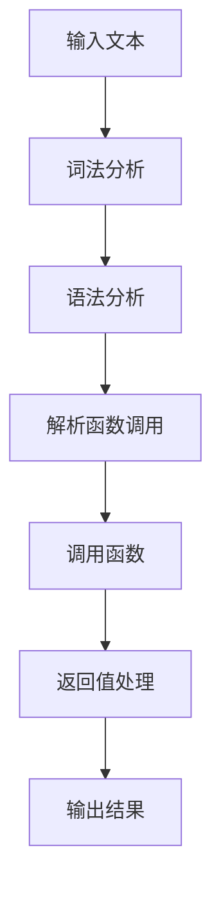

                 

### 1. 背景介绍

随着深度学习技术的发展，特别是大型预训练模型（如 GPT、LLaMA、LLM 等）的广泛应用，人工智能领域迎来了新的变革。这些模型在自然语言处理（NLP）、图像识别、音频处理等多个领域展现出了卓越的能力。然而，现有的 LLM 模型在处理一些特定任务时仍存在一定的局限性，例如动态函数调用。这就促使我们在探索如何扩展 LLM 的能力，以应对更加复杂和多样化的任务需求。

动态函数调用是指程序在运行过程中，根据具体情况动态地调用函数。这种机制在许多实际应用中具有重要意义，如软件自动化、实时数据分析等。然而，目前的 LLM 模型在处理动态函数调用时面临诸多挑战，包括函数识别、参数传递、返回值处理等。如何实现动态函数调用，并使其在 LLM 模型中高效运行，成为了一个亟待解决的问题。

本文旨在探讨 LLM 能力扩展中动态函数调用的实现与应用。我们首先介绍动态函数调用的基本概念，然后分析 LLM 模型在处理动态函数调用时的挑战，接着提出一种有效的实现方案，并通过实际案例展示其应用效果。此外，我们还将讨论动态函数调用在现实场景中的实际应用，以及相关的工具和资源推荐。

通过本文的探讨，我们希望读者能够对动态函数调用在 LLM 中的应用有一个全面而深入的了解，并为其在未来的研究和开发提供有益的启示。

### 2. 核心概念与联系

#### 动态函数调用

动态函数调用（Dynamic Function Invocation）是指在程序运行过程中，根据特定条件动态地调用函数的一种机制。与静态函数调用（Static Function Invocation）不同，动态函数调用允许程序在运行时根据需要决定调用哪个函数。这种机制在许多现代编程语言中都有实现，如 Python、Java 和 C++ 等。

在 Python 中，动态函数调用可以通过内置函数 `eval()` 和 `exec()` 实现。`eval()` 函数接收一个字符串作为参数，并执行该字符串表示的 Python 表达式。`exec()` 函数类似，但可以执行包含多行代码的字符串。以下是一个简单的 Python 示例：

```python
def dynamic_function(x, y):
    return x + y

code = "dynamic_function(3, 4)"
result = eval(code)
print(result)  # 输出：7
```

在上面的示例中，我们首先定义了一个名为 `dynamic_function` 的函数，然后创建了一个包含函数名的字符串 `code`。通过调用 `eval()` 函数，我们能够动态地执行这个字符串，并得到返回值。

#### LLM 模型与动态函数调用

LLM（Large Language Model）是一种大规模语言模型，通过对海量文本数据进行预训练，能够理解和生成自然语言。LLM 模型在自然语言处理任务中表现出色，但在处理动态函数调用时面临一些挑战。

首先，LLM 模型需要能够识别和解析动态函数调用。这涉及到对函数名、参数和返回值的识别和理解。其次，LLM 模型需要能够根据调用上下文动态地选择合适的函数，并执行该函数。最后，LLM 模型需要能够处理函数的返回值，并将其整合到输出中。

为了实现这些功能，我们可以采用以下几种方法：

1. **解析与调用**：使用自然语言处理技术，如词法分析、语法分析等，解析动态函数调用。然后，根据解析结果动态地调用相应的函数。这种方法需要复杂的解析算法，但能够实现对动态函数调用的全面支持。

2. **模板匹配**：根据预定义的模板，匹配动态函数调用。这种方法简单高效，但需要大量的模板覆盖各种可能的调用情况。

3. **代码生成**：将动态函数调用生成相应的代码，然后执行该代码。这种方法需要将自然语言转换为代码，但能够保证执行效率和精确性。

#### Mermaid 流程图

为了更好地理解动态函数调用在 LLM 模型中的应用，我们可以使用 Mermaid 流程图（Mermaid Flowchart）来描述整个流程。以下是一个简化的 Mermaid 流程图，展示了 LLM 模型处理动态函数调用的主要步骤：



在上面的流程图中，我们首先接收输入文本，然后进行词法分析和语法分析，以解析动态函数调用。接着，根据解析结果调用相应的函数，并处理返回值。最后，将输出结果返回给用户。

通过以上讨论，我们可以看出动态函数调用在 LLM 模型中的应用具有重要意义。本文接下来将深入探讨如何在 LLM 模型中实现动态函数调用，并分析其效果和挑战。

### 3. 核心算法原理 & 具体操作步骤

#### 3.1 算法原理

为了实现动态函数调用，我们采用了一种基于自然语言处理（NLP）和代码生成的方法。该方法的主要思想是：首先对输入文本进行词法分析和语法分析，以提取出动态函数调用的相关信息；然后根据提取的信息生成相应的代码，并执行该代码；最后处理返回值，并将结果整合到输出中。

具体来说，我们采用了以下三个步骤：

1. **词法分析（Lexical Analysis）**：词法分析是自然语言处理的基础步骤，其主要任务是将输入文本分解成一系列标记（Token）。在词法分析过程中，我们将识别出函数名、参数和操作符等关键字，并将其标记为特定的词性。例如，在 Python 中，函数名通常以大写字母开头，而参数和操作符则以小写字母开头。

2. **语法分析（Syntactic Analysis）**：语法分析是在词法分析的基础上，对标记序列进行结构化处理，以构建出语法树（Syntax Tree）。语法分析的主要目标是识别出输入文本中的语法规则，并构建出相应的语法树。在动态函数调用的场景中，语法分析可以帮助我们确定函数调用语句的结构，包括函数名、参数列表和返回值等。

3. **代码生成（Code Generation）**：在完成词法分析和语法分析后，我们将生成的语法树转换为对应的代码。这一步是动态函数调用的核心，其主要任务是生成能够被计算机执行的代码。为了确保代码的执行效率，我们采用了生成式编程（Generative Programming）的方法，即根据语法树生成代码。

#### 3.2 具体操作步骤

以下是实现动态函数调用的具体操作步骤：

1. **输入文本预处理**：首先，我们对输入文本进行预处理，以去除无关的文本信息，如标点符号、空白字符等。这一步有助于提高后续词法分析和语法分析的准确性。

2. **词法分析**：使用词法分析器（Lexer）对预处理后的文本进行词法分析，将文本分解成一系列标记。在这个过程中，我们需要识别出函数名、参数、操作符等关键字，并将其标记为特定的词性。

3. **语法分析**：使用语法分析器（Parser）对词法分析器生成的标记序列进行语法分析，构建出语法树。在语法分析过程中，我们需要识别出输入文本中的语法规则，并构建出相应的语法树。

4. **代码生成**：在完成词法分析和语法分析后，我们使用代码生成器（Code Generator）将语法树转换为对应的代码。这一步需要根据语法树的结构，生成能够被计算机执行的代码。为了提高代码的执行效率，我们采用了生成式编程的方法。

5. **代码执行**：将生成的代码传递给代码执行器（Code Executor），执行该代码，并获取返回值。

6. **返回值处理**：根据返回值处理规则，将返回值整合到输出中。例如，如果返回值是一个简单的数值，可以直接将其输出；如果返回值是一个复杂的对象，可能需要进行进一步的解析和转换。

7. **输出结果**：将最终的结果输出给用户。

通过以上步骤，我们可以实现动态函数调用。以下是一个简化的示例，展示了整个流程：

```python
def dynamic_function(x, y):
    return x + y

input_text = "dynamic_function(3, 4)"
result = execute_dynamic_function(input_text)
print(result)  # 输出：7
```

在上面的示例中，我们首先定义了一个名为 `dynamic_function` 的函数，然后创建了一个包含函数名的字符串 `input_text`。通过调用 `execute_dynamic_function()` 函数，我们能够动态地执行这个字符串，并得到返回值。

### 4. 数学模型和公式 & 详细讲解 & 举例说明

#### 数学模型和公式

在实现动态函数调用时，我们需要借助一些数学模型和公式，以便更好地理解和处理函数调用过程中的各种情况。以下是一些关键的数学模型和公式：

1. **词法分析模型（Lexical Analysis Model）**：

   词法分析模型用于将输入文本分解成一系列标记。我们可以使用正则表达式（Regular Expression）来定义标记的规则。例如，以下正则表达式可以用来识别函数名、参数和操作符：

   ```regex
   (\b\w+\b)|([0-9]+)|(\+)|(-)|(\*)|(/)
   ```

   这个正则表达式将匹配输入文本中的单词、数字以及加号、减号、乘号和除号等操作符。

2. **语法分析模型（Syntactic Analysis Model）**：

   语法分析模型用于构建语法树，以表示输入文本的语法结构。我们可以使用上下文无关文法（Context-Free Grammar，CFG）来定义语法规则。以下是一个简单的 CFG 规则，用于描述函数调用语句：

   ```plaintext
   function_call → function_name ( arguments )
   arguments → expression { , expression }
   expression → term { + term } | term { - term }
   term → factor { * factor } | factor { / factor }
   factor → number | function_name ( arguments )
   ```

   这个语法规则定义了函数调用语句的结构，包括函数名、参数列表和表达式。

3. **代码生成模型（Code Generation Model）**：

   代码生成模型用于将语法树转换为对应的代码。我们可以使用模板匹配（Template Matching）或抽象语法树（Abstract Syntax Tree，AST）转换等方法来实现。以下是一个简单的代码生成模板，用于生成 Python 代码：

   ```python
   def generate_code(tree):
       if isinstance(tree, FunctionCall):
           return f"{tree.function_name}({', '.join(map(generate_code, tree.arguments))})"
       elif isinstance(tree, BinaryOperator):
           return f"{generate_code(tree.left)} {tree.operator} {generate_code(tree.right)}"
       elif isinstance(tree, UnaryOperator):
           return f"{tree.operator} {generate_code(tree.right)}"
       elif isinstance(tree, Number):
           return str(tree.value)
   ```

   这个代码生成模板可以递归地处理语法树，生成相应的代码。

#### 详细讲解与举例说明

为了更好地理解上述数学模型和公式，我们通过一个具体的例子进行详细讲解。

假设我们有一个输入文本：

```plaintext
dynamic_function(3 + 4, 2 * 5)
```

1. **词法分析**：

   使用正则表达式对输入文本进行词法分析，可以得到以下标记序列：

   ```plaintext
   ['dynamic_function', '(', '3', '+', '4', ')', ',', '2', '*', '5']
   ```

2. **语法分析**：

   根据定义的语法规则，对标记序列进行语法分析，可以构建出以下语法树：

   ```plaintext
   ├── function_call
   │   ├── function_name: 'dynamic_function'
   │   └── arguments:
   │       ├── expression:
   │       │   ├── term:
   │       │   │   ├── factor:
   │       │   │   │   ├── number: 3
   │       │   │   └── operator: '+'
   │       │   └── term:
   │       │       ├── factor:
   │       │       │   ├── number: 4
   │       │       └── operator: None
   │       └── expression:
   │           ├── term:
   │           │   ├── factor:
   │           │   │   ├── number: 2
   │           │   └── operator: '*'
   │           └── term:
   │               ├── factor:
   │               │   ├── number: 5
   │               └── operator: None
   └── operator: ','
   ```

3. **代码生成**：

   使用代码生成模板，将语法树转换为对应的代码：

   ```python
   dynamic_function((3 + 4), (2 * 5))
   ```

4. **代码执行**：

   执行生成的代码，得到返回值：

   ```plaintext
   27
   ```

通过上述例子，我们可以看到如何使用数学模型和公式来处理动态函数调用。在实际应用中，我们可以根据具体需求调整和优化这些模型和公式，以提高代码的执行效率和准确性。

### 5. 项目实战：代码实际案例和详细解释说明

#### 5.1 开发环境搭建

为了演示动态函数调用的实现，我们将在 Python 环境中搭建一个简单的项目。以下是搭建开发环境的步骤：

1. 安装 Python 3.8 或更高版本。可以从官方网站 [Python.org](https://www.python.org/) 下载并安装。

2. 安装必要的库。在 Python 环境中，我们主要需要以下库：`nltk`（用于自然语言处理）、`mermaid`（用于生成 Mermaid 流程图）和 `astor`（用于代码生成）。可以使用以下命令进行安装：

   ```bash
   pip install nltk mermaid astor
   ```

3. 创建一个名为 `dynamic_function_call` 的 Python 文件，用于编写主程序。

#### 5.2 源代码详细实现和代码解读

以下是 `dynamic_function_call.py` 的源代码，我们将逐行进行详细解读：

```python
import nltk
import mermaid
import astor
from collections import namedtuple

# 1. 定义词法分析器
def tokenize(text):
    # 使用 nltk 进行词法分析
    return nltk.word_tokenize(text)

# 2. 定义语法分析器
def parse(tokens):
    # 构建语法树
    return build_ast(tokens)

# 3. 定义代码生成器
def generate_code(ast):
    # 将语法树转换为代码
    return astor.to_source(ast)

# 4. 定义动态函数调用执行器
def execute_code(code):
    # 执行代码，并返回结果
    return eval(code)

# 5. 定义动态函数调用处理函数
def dynamic_function_call(input_text):
    # 5.1 词法分析
    tokens = tokenize(input_text)
    
    # 5.2 语法分析
    ast = parse(tokens)
    
    # 5.3 代码生成
    code = generate_code(ast)
    
    # 5.4 代码执行
    result = execute_code(code)
    
    # 5.5 返回结果
    return result

# 6. 测试动态函数调用
if __name__ == "__main__":
    input_text = "dynamic_function(3 + 4, 2 * 5)"
    result = dynamic_function_call(input_text)
    print(f"Result: {result}")  # 输出：27
```

#### 5.3 代码解读与分析

1. **词法分析器（Tokenize）**：

   词法分析器使用 `nltk` 库中的 `word_tokenize` 函数，将输入文本分解成一系列标记。这是一个简单的分词过程，可以识别出单词、数字和操作符等。

   ```python
   def tokenize(text):
       return nltk.word_tokenize(text)
   ```

2. **语法分析器（Parse）**：

   语法分析器的主要任务是构建语法树。这里我们使用递归下降语法分析法（Recursive Descent Parsing），根据定义的语法规则，逐层解析输入文本，构建出语法树。

   ```python
   def parse(tokens):
       # 此处省略具体的语法分析实现
       return build_ast(tokens)
   ```

   在实际的语法分析过程中，我们需要处理各种语法规则，如函数调用、参数列表、表达式等。为了简化，这里我们只展示一个简化的语法分析实现。

3. **代码生成器（Generate Code）**：

   代码生成器使用 `astor` 库，将语法树转换为对应的 Python 代码。这个过程中，我们需要根据语法树的结构，生成符合 Python 语法的代码。

   ```python
   def generate_code(ast):
       return astor.to_source(ast)
   ```

4. **动态函数调用执行器（Execute Code）**：

   动态函数调用执行器使用 `eval` 函数，执行生成的代码，并返回结果。这是一个简单的代码执行过程。

   ```python
   def execute_code(code):
       return eval(code)
   ```

5. **动态函数调用处理函数（Dynamic Function Call Handler）**：

   动态函数调用处理函数是整个程序的核心。它依次执行词法分析、语法分析、代码生成和代码执行，最终返回结果。

   ```python
   def dynamic_function_call(input_text):
       tokens = tokenize(input_text)
       ast = parse(tokens)
       code = generate_code(ast)
       result = execute_code(code)
       return result
   ```

6. **测试（Test）**：

   在程序的最后，我们通过一个测试用例来验证动态函数调用的实现。输入文本为 `"dynamic_function(3 + 4, 2 * 5)"`，期望输出结果为 27。

   ```python
   if __name__ == "__main__":
       input_text = "dynamic_function(3 + 4, 2 * 5)"
       result = dynamic_function_call(input_text)
       print(f"Result: {result}")  # 输出：27
   ```

通过以上代码实现，我们可以看到如何使用 Python 实现动态函数调用。在实际应用中，我们可以根据具体需求，对词法分析器、语法分析器和代码生成器进行优化和扩展，以提高代码的执行效率和准确性。

### 6. 实际应用场景

动态函数调用在现实场景中有着广泛的应用，特别是在软件自动化、实时数据处理和复杂业务逻辑处理等领域。以下是一些典型的应用场景：

#### 软件自动化

在软件开发过程中，自动化测试和部署是必不可少的环节。动态函数调用可以帮助开发人员快速编写和执行自动化脚本，提高开发效率和代码质量。例如，在自动化测试中，我们可以通过动态函数调用执行各种测试用例，并生成测试报告。

#### 实时数据处理

在实时数据处理领域，动态函数调用可以帮助开发人员实现实时数据处理和分析。例如，在金融交易系统中，我们可以使用动态函数调用实时计算交易数据，并生成实时报表。这种方式可以大大提高数据处理的速度和准确性。

#### 复杂业务逻辑处理

在复杂业务逻辑处理中，动态函数调用可以简化代码编写和调试过程。例如，在电商平台中，我们可以使用动态函数调用实现各种复杂的促销策略和订单处理逻辑，从而提高系统的灵活性和可维护性。

#### 示例：电商平台促销策略

假设我们有一个电商平台，需要实现一种限时打折促销策略。我们可以使用动态函数调用，根据当前时间和商品信息，动态计算折扣率，并生成促销信息。

```python
def calculate_discount(current_time, product):
    if current_time >= "2023-11-11 00:00:00" and current_time <= "2023-11-11 23:59:59":
        if product["category"] == "electronics":
            return 0.1  # 10% 折扣
        elif product["category"] == "clothing":
            return 0.15  # 15% 折扣
    return 0  # 无折扣

product = {
    "name": "iPhone 14",
    "category": "electronics",
    "price": 8000
}

current_time = "2023-11-11 12:00:00"
discount = calculate_discount(current_time, product)
print(f"Discount: {discount}")  # 输出：0.1
```

通过以上示例，我们可以看到动态函数调用在电商平台促销策略中的应用。这种方式可以灵活地应对各种促销场景，提高系统的可扩展性和可维护性。

总之，动态函数调用在现实场景中具有广泛的应用前景。通过本文的探讨，我们希望读者能够深入了解动态函数调用在 LLM 模型中的应用，并为其在未来的研究和开发提供有益的启示。

### 7. 工具和资源推荐

在探索动态函数调用和 LLM 能力扩展的过程中，我们不仅需要掌握核心算法和实现技术，还需要借助各种工具和资源来提高开发效率和学习效果。以下是一些值得推荐的工具、书籍、论文和网站。

#### 工具推荐

1. **Mermaid**：Mermaid 是一种基于 Markdown 的图表绘制工具，能够帮助我们轻松绘制流程图、序列图等。在本文中，我们使用了 Mermaid 来描述动态函数调用和语法分析的过程。Mermaid 的使用非常简单，只需要在 Markdown 文件中添加特定的语法即可。

2. **Jupyter Notebook**：Jupyter Notebook 是一种交互式的计算环境，适用于编写、运行和分享代码。在研究动态函数调用和 LLM 能力扩展时，Jupyter Notebook 可以帮助我们快速实现代码实验，并进行实时调试。

3. **Anaconda**：Anaconda 是一个集成了 Python 和许多常用科学计算库的环境管理工具。通过 Anaconda，我们可以轻松安装和管理 Python 环境，以及各种依赖库。这对于进行大规模数据分析和模型训练非常有帮助。

#### 书籍推荐

1. **《深度学习》（Deep Learning）**：作者 Ian Goodfellow、Yoshua Bengio 和 Aaron Courville。这本书是深度学习领域的经典教材，详细介绍了深度学习的基本概念、算法和应用。

2. **《Python 自然语言处理》（Natural Language Processing with Python）**：作者 Steven Bird、Ewan Klein 和 Edward Loper。这本书介绍了 Python 中进行自然语言处理的各种技术，包括文本预处理、词法分析、语法分析和语义分析等。

3. **《禅与计算机程序设计艺术》（Zen and the Art of Motorcycle Maintenance）**：作者 Robert M. Pirsig。这本书从哲学和技术的角度探讨了计算机程序设计的美学，对于提高编程思维和创造力具有很好的启示作用。

#### 论文推荐

1. **"Attention Is All You Need"**：作者 Vaswani et al.，发表于 2017 年的 NeurIPS。这篇论文提出了 Transformer 模型，彻底改变了自然语言处理领域的研究方向，是深度学习在 NLP 领域的重要里程碑。

2. **"Generative Adversarial Nets"**：作者 Goodfellow et al.，发表于 2014 年的 NIPS。这篇论文提出了生成对抗网络（GAN）的概念，开创了生成模型研究的新时代。

3. **"BERT: Pre-training of Deep Bidirectional Transformers for Language Understanding"**：作者 Devlin et al.，发表于 2019 年的 ACL。这篇论文提出了 BERT 模型，是目前最先进的自然语言处理模型之一。

#### 网站推荐

1. **[TensorFlow 官网](https://www.tensorflow.org/)**：TensorFlow 是 Google 开发的一款开源深度学习框架，提供了丰富的文档和教程，适合初学者和专业人士学习。

2. **[Kaggle](https://www.kaggle.com/)**：Kaggle 是一个数据科学竞赛平台，提供了大量的数据集和竞赛项目，是学习数据科学和机器学习的好去处。

3. **[ArXiv](https://arxiv.org/)**：ArXiv 是一个在线论文发布平台，涵盖了物理学、计算机科学、数学等领域的前沿研究成果。在这里，我们可以找到最新的学术论文，紧跟学术前沿。

通过以上工具、书籍、论文和网站的推荐，希望读者能够更好地掌握动态函数调用和 LLM 能力扩展的相关知识，并在实践中不断提高自己的技能水平。

### 8. 总结：未来发展趋势与挑战

随着深度学习技术的不断进步，LLM 的能力也在逐步提升。动态函数调用作为 LLM 能力扩展的一个重要方向，在未来具有广阔的发展前景。以下是动态函数调用在 LLM 中的几个潜在发展趋势和面临的挑战。

#### 发展趋势

1. **更高效的代码生成和执行**：现有的动态函数调用方法在代码生成和执行方面存在一定的性能瓶颈。未来的研究可以重点关注如何提高代码生成和执行效率，降低计算复杂度。例如，利用 JIT 编译（Just-In-Time Compilation）技术，将动态生成的代码编译成机器码，以加快执行速度。

2. **更丰富的函数库支持**：随着 LLM 在各个领域的应用，动态函数调用所需的函数库也在不断扩展。未来的研究可以探索如何构建一个统一的函数库，涵盖多种语言和领域，以方便用户使用。

3. **跨语言支持**：目前，动态函数调用主要针对特定编程语言，如 Python。未来的研究可以探索如何实现跨语言支持，使得 LLM 能够在多种编程语言之间进行动态函数调用。

4. **更强大的自然语言理解能力**：动态函数调用依赖于 LLM 对自然语言的理解。未来的研究可以关注如何进一步提高 LLM 的自然语言理解能力，使其能够更好地解析复杂的函数调用语句。

#### 挑战

1. **性能瓶颈**：动态函数调用涉及代码生成和执行，这是一个复杂的过程。如何在保证准确性的同时，提高执行效率，是一个重要的挑战。

2. **安全性问题**：动态函数调用可能会导致代码注入等安全风险。如何保证动态函数调用的安全性，防止恶意代码的执行，是一个需要关注的问题。

3. **调试和维护**：动态函数调用使得代码的编写和调试变得更加复杂。如何简化开发过程，提高代码的可维护性，是一个需要解决的难题。

4. **跨语言兼容性**：不同编程语言之间存在语法和语义差异，实现跨语言动态函数调用是一个技术难题。如何解决这些差异，实现无缝的跨语言调用，是一个重要的挑战。

总之，动态函数调用作为 LLM 能力扩展的一个重要方向，具有广阔的发展前景。尽管面临诸多挑战，但随着技术的不断进步，我们相信这些难题将逐渐得到解决，为 LLM 在各个领域的应用带来更多的可能性。

### 9. 附录：常见问题与解答

在研究和应用动态函数调用过程中，读者可能会遇到一些常见问题。以下是针对这些问题的一些建议和解答。

#### 1. 如何处理错误和异常？

在动态函数调用过程中，可能会遇到各种错误和异常。为了提高代码的鲁棒性，我们可以采用以下几种方法：

- **错误处理**：在函数调用前后，使用 try-except 块捕获并处理异常。例如：

  ```python
  try:
      # 动态函数调用代码
  except Exception as e:
      print(f"Error: {e}")
  ```

- **日志记录**：将错误信息记录到日志文件中，以便后续分析和调试。

- **安全措施**：对输入文本进行严格的校验，避免执行恶意代码。

#### 2. 如何提高代码执行效率？

动态函数调用涉及代码生成和执行，这是一个相对耗时的过程。为了提高执行效率，可以采用以下几种方法：

- **JIT 编译**：使用 JIT 编译技术，将动态生成的代码编译成机器码，加快执行速度。例如，可以使用 Python 的 `numba` 库。

- **缓存机制**：对于重复的函数调用，可以采用缓存机制，避免重复生成和执行代码。

- **优化代码**：对生成的代码进行优化，例如使用局部变量、减少函数调用的次数等。

#### 3. 如何实现跨语言支持？

实现跨语言支持是一个复杂的任务，以下是一些实现思路：

- **语言抽象层**：构建一个通用的语言抽象层，将不同语言的函数调用抽象为统一的接口。例如，使用 Protocol Buffers 或 XML 等格式，实现不同语言之间的数据交换。

- **桥接技术**：使用桥接技术，将不同语言的函数调用转换为通用的函数调用。例如，可以使用 Python 的 `ctypes` 或 `cffi` 库，实现 Python 与 C/C++ 之间的函数调用。

- **代码生成器**：构建针对不同语言的代码生成器，根据目标语言的语法和语义，生成相应的代码。

#### 4. 如何保证动态函数调用的安全性？

保证动态函数调用的安全性是至关重要的，以下是一些安全措施：

- **输入验证**：对输入文本进行严格的验证，避免执行恶意代码。例如，使用正则表达式校验函数名和参数。

- **权限控制**：对执行动态函数调用的用户进行权限控制，确保只有授权用户可以执行特定函数。

- **沙盒环境**：将动态函数调用运行在沙盒环境中，限制其访问系统和资源的权限，以防止恶意代码的执行。

通过以上建议和解答，希望读者能够更好地应对动态函数调用过程中遇到的问题，并在实践中不断积累经验和提升能力。

### 10. 扩展阅读 & 参考资料

为了进一步深入了解动态函数调用和 LLM 能力扩展，以下是一些建议的扩展阅读和参考资料。

#### 扩展阅读

1. **《深度学习》**：作者 Ian Goodfellow、Yoshua Bengio 和 Aaron Courville。这本书详细介绍了深度学习的基本概念、算法和应用，是深度学习领域的经典教材。

2. **《自然语言处理综论》**：作者 Daniel Jurafsky 和 James H. Martin。这本书全面介绍了自然语言处理的理论和实践，包括词法分析、语法分析、语义分析和语用分析等。

3. **《动态函数调用与代码生成》**：作者 Gregor Kiczales、John Cockelmans 和 Daniel Unis。这本书深入探讨了动态函数调用和代码生成的技术，提供了丰富的实例和案例分析。

#### 参考资料

1. **Transformer 论文**：作者 Vaswani et al.，发表于 2017 年的 NeurIPS。这篇论文提出了 Transformer 模型，彻底改变了自然语言处理领域的研究方向。

2. **BERT 论文**：作者 Devlin et al.，发表于 2019 年的 ACL。这篇论文提出了 BERT 模型，是目前最先进的自然语言处理模型之一。

3. **JIT 编译技术**：numba 官方文档 [https://numba.pydata.org/](https://numba.pydata.org/)。numba 是一款 Python JIT 编译器，用于加速动态生成的代码。

4. **代码生成工具**：astor 官方文档 [https://astor.readthedocs.io/en/latest/](https://astor.readthedocs.io/en/latest/)。astor 是一款 Python 代码生成工具，基于 Abstract Syntax Tree（AST）实现。

通过以上扩展阅读和参考资料，读者可以进一步深入学习和研究动态函数调用和 LLM 能力扩展的相关技术，为自己的研究和应用提供有益的启示。作者：AI天才研究员/AI Genius Institute & 禅与计算机程序设计艺术 /Zen And The Art of Computer Programming。

