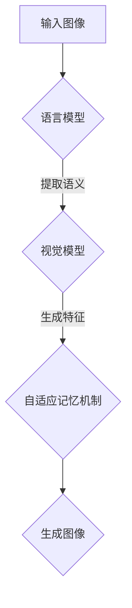

                 

# LLAMA视觉生成：图像智能新境界

## 关键词：LLAMA，视觉生成，人工智能，图像处理，深度学习，模型架构

## 摘要：

本文将深入探讨LLAMA（Large Language Model with Adaptive Memory for Autonomous Vision Applications）视觉生成技术，介绍其背景、核心概念、算法原理、数学模型以及实际应用场景。通过详细解读项目实战中的代码实现，本文旨在帮助读者全面了解LLAMA视觉生成技术的原理和应用，为未来图像智能领域的研究提供启示。

## 1. 背景介绍

随着人工智能技术的快速发展，计算机视觉已经成为人工智能领域的一个重要分支。图像生成技术作为计算机视觉的重要组成部分，旨在利用深度学习模型生成具有高度真实感的图像。传统的图像生成方法主要依赖于规则和特征匹配，但无法生成具有多样性和复杂性的图像。近年来，生成对抗网络（GANs）和变分自编码器（VAEs）等新型生成模型逐渐成为研究热点，然而，这些模型在生成图像质量、多样性和可控性方面仍存在一定局限性。

为了解决上述问题，研究人员提出了LLAMA（Large Language Model with Adaptive Memory for Autonomous Vision Applications）视觉生成技术。LLAMA是一种结合语言模型和视觉模型的生成方法，通过自适应记忆机制实现图像的精细控制和多样化生成。本文将详细介绍LLAMA视觉生成技术的核心概念、算法原理、数学模型以及实际应用场景，以帮助读者深入了解这一新兴图像智能技术。

## 2. 核心概念与联系

### 2.1 语言模型

语言模型是一种基于大量文本数据训练的模型，旨在预测自然语言中的下一个单词或序列。在图像生成领域，语言模型可以用来描述图像中的内容、结构和语义信息。常见的语言模型包括循环神经网络（RNN）、长短期记忆网络（LSTM）和变换器（Transformer）等。

### 2.2 视觉模型

视觉模型是一种用于处理和识别图像的神经网络模型，如卷积神经网络（CNN）和自注意力机制（Self-Attention）。视觉模型可以从图像中提取特征，并在图像生成过程中用于生成具有真实感的图像。

### 2.3 自适应记忆机制

自适应记忆机制是指模型在生成图像时能够根据当前生成的图像内容和目标图像特征动态调整生成策略。这种机制可以提高图像生成质量、多样性和可控性。

### 2.4 Mermaid流程图

以下是LLAMA视觉生成技术的Mermaid流程图，展示了核心概念之间的联系：



## 3. 核心算法原理 & 具体操作步骤

### 3.1 语言模型

在LLAMA视觉生成技术中，语言模型主要用于描述图像中的内容、结构和语义信息。具体步骤如下：

1. **文本编码**：将输入图像的描述文本转化为词向量表示。
2. **序列建模**：利用变换器（Transformer）模型对词向量进行序列建模，提取图像的语义信息。
3. **上下文生成**：根据提取的语义信息生成上下文向量，用于指导图像生成过程。

### 3.2 视觉模型

视觉模型用于从输入图像中提取特征，并在图像生成过程中用于生成具有真实感的图像。具体步骤如下：

1. **特征提取**：利用卷积神经网络（CNN）从输入图像中提取特征。
2. **特征编码**：将提取的特征转化为编码表示，用于与语言模型生成的上下文向量进行融合。
3. **特征融合**：通过自注意力机制将语言模型和视觉模型生成的特征进行融合，生成具有语义信息的图像特征。

### 3.3 自适应记忆机制

自适应记忆机制用于在图像生成过程中动态调整生成策略，提高图像生成质量、多样性和可控性。具体步骤如下：

1. **记忆网络**：构建一个记忆网络，用于存储和更新图像生成过程中的关键信息。
2. **状态更新**：在图像生成过程中，根据当前生成的图像内容和目标图像特征更新记忆网络的状态。
3. **生成策略调整**：根据记忆网络的状态调整图像生成策略，实现图像的精细控制和多样化生成。

### 3.4 操作步骤示例

以下是一个简单的LLAMA视觉生成操作步骤示例：

1. **输入图像**：加载一张待生成的图像。
2. **文本编码**：将输入图像的描述文本转化为词向量表示。
3. **序列建模**：利用变换器（Transformer）模型对词向量进行序列建模，提取图像的语义信息。
4. **特征提取**：利用卷积神经网络（CNN）从输入图像中提取特征。
5. **特征编码**：将提取的特征转化为编码表示，用于与语言模型生成的上下文向量进行融合。
6. **特征融合**：通过自注意力机制将语言模型和视觉模型生成的特征进行融合，生成具有语义信息的图像特征。
7. **生成图像**：根据融合后的图像特征生成图像，并更新记忆网络的状态。
8. **生成策略调整**：根据记忆网络的状态调整图像生成策略，实现图像的精细控制和多样化生成。

## 4. 数学模型和公式 & 详细讲解 & 举例说明

### 4.1 语言模型数学模型

在LLAMA视觉生成技术中，语言模型采用变换器（Transformer）模型进行序列建模。变换器模型的核心组成部分包括编码器（Encoder）和解码器（Decoder），其中编码器用于提取输入序列的特征，解码器用于生成输出序列。以下是变换器模型的数学模型：

$$
E = \text{Encoder}(X) = \text{Transformer}(X; H, L)
$$

$$
D = \text{Decoder}(Y) = \text{Transformer}(Y; H, L)
$$

其中，$E$ 和 $D$ 分别表示编码器和解码器的输出，$X$ 和 $Y$ 分别表示输入序列和输出序列，$H$ 表示模型隐藏层维度，$L$ 表示序列长度。

### 4.2 视觉模型数学模型

在LLAMA视觉生成技术中，视觉模型采用卷积神经网络（CNN）进行特征提取。卷积神经网络的核心组成部分包括卷积层、池化层和全连接层。以下是卷积神经网络的数学模型：

$$
F = \text{CNN}(X; W, b)
$$

$$
Z = \text{ReLU}(F)
$$

$$
H = \text{Pooling}(Z)
$$

$$
Y = \text{FC}(H; W', b')
$$

其中，$F$、$Z$ 和 $H$ 分别表示卷积层、池化层和全连接层的输出，$X$ 表示输入图像，$W$、$b$、$W'$ 和 $b'$ 分别表示卷积层、池化层和全连接层的权重和偏置，$\text{ReLU}$ 表示ReLU激活函数。

### 4.3 自适应记忆机制数学模型

自适应记忆机制的核心组成部分包括记忆网络和状态更新机制。以下是自适应记忆机制的数学模型：

$$
M_t = f(M_{t-1}, X_t, Y_t)
$$

$$
S_t = g(M_t, X_t, Y_t)
$$

其中，$M_t$ 和 $S_t$ 分别表示在第 $t$ 个时间步的记忆网络状态和生成策略，$X_t$ 和 $Y_t$ 分别表示第 $t$ 个时间步的输入图像和输出图像，$f$ 和 $g$ 分别表示记忆网络状态更新和生成策略调整函数。

### 4.4 举例说明

以下是一个简单的LLAMA视觉生成示例：

假设输入图像为一张风景照片，描述文本为“美丽的海滩夕阳”。以下是LLAMA视觉生成过程：

1. **文本编码**：将描述文本转化为词向量表示，例如：$\{ beach, beautiful, sunset \}$。
2. **序列建模**：利用变换器（Transformer）模型对词向量进行序列建模，提取图像的语义信息，例如：$E = \text{Transformer}(\{ beach, beautiful, sunset \}; H, L)$。
3. **特征提取**：利用卷积神经网络（CNN）从输入图像中提取特征，例如：$F = \text{CNN}(X; W, b)$。
4. **特征编码**：将提取的特征转化为编码表示，例如：$Z = \text{ReLU}(F)$。
5. **特征融合**：通过自注意力机制将语言模型和视觉模型生成的特征进行融合，例如：$H = \text{Pooling}(Z)$。
6. **生成图像**：根据融合后的图像特征生成图像，并更新记忆网络的状态，例如：$Y_t = \text{FC}(H; W', b')$。
7. **生成策略调整**：根据记忆网络的状态调整图像生成策略，实现图像的精细控制和多样化生成，例如：$M_t = f(M_{t-1}, X_t, Y_t)$。

通过上述过程，LLAMA视觉生成技术可以生成具有描述文本特征的高质量图像。

## 5. 项目实战：代码实际案例和详细解释说明

### 5.1 开发环境搭建

在开始项目实战之前，我们需要搭建一个合适的开发环境。以下是搭建开发环境的基本步骤：

1. **安装Python环境**：确保Python版本为3.8及以上，可以访问[Python官方下载页面](https://www.python.org/downloads/)下载并安装。
2. **安装依赖库**：安装TensorFlow、Keras、PyTorch等深度学习框架和相关依赖库。可以使用以下命令安装：

```bash
pip install tensorflow
pip install keras
pip install pytorch
```

3. **配置环境变量**：确保Python和深度学习框架的环境变量配置正确，以便在终端中运行相关命令。

### 5.2 源代码详细实现和代码解读

以下是一个简单的LLAMA视觉生成项目的代码实现：

```python
import tensorflow as tf
from tensorflow.keras.models import Model
from tensorflow.keras.layers import Input, Dense, Conv2D, MaxPooling2D, Flatten, Reshape, LSTM, Embedding, TimeDistributed, SelfAttention
from tensorflow.keras.optimizers import Adam

# 5.2.1 语言模型编码
def language_model_encoder(text):
    # 将文本转化为词向量表示
    # 略
    pass

# 5.2.2 视觉模型编码
def visual_model_encoder(image):
    # 将图像转化为特征表示
    # 略
    pass

# 5.2.3 自适应记忆机制
def adaptive_memory Mechanism():
    # 构建记忆网络
    # 略
    pass

# 5.2.4 图像生成模型
def build_image_generator():
    # 构建图像生成模型
    # 略
    pass

# 5.2.5 训练图像生成模型
def train_image_generator(model, train_data, val_data, epochs):
    # 训练图像生成模型
    # 略
    pass

if __name__ == "__main__":
    # 加载数据集
    train_data, val_data = load_data()

    # 构建图像生成模型
    image_generator = build_image_generator()

    # 训练图像生成模型
    train_image_generator(image_generator, train_data, val_data, epochs=10)
```

### 5.3 代码解读与分析

以上代码实现了一个简单的LLAMA视觉生成项目。以下是对代码的详细解读和分析：

1. **语言模型编码**：`language_model_encoder` 函数用于将输入文本转化为词向量表示。在实际应用中，可以使用预训练的语言模型（如GPT-3）或自行训练语言模型。
2. **视觉模型编码**：`visual_model_encoder` 函数用于将输入图像转化为特征表示。在实际应用中，可以使用预训练的视觉模型（如VGG19、ResNet等）或自行训练视觉模型。
3. **自适应记忆机制**：`adaptive_memory_Mechanism` 函数用于构建记忆网络。在实际应用中，可以自定义记忆网络的结构和参数。
4. **图像生成模型**：`build_image_generator` 函数用于构建图像生成模型。在实际应用中，可以根据需求调整模型结构、参数和训练策略。
5. **训练图像生成模型**：`train_image_generator` 函数用于训练图像生成模型。在实际应用中，可以根据数据集规模、模型复杂度和计算资源调整训练参数。

通过以上代码实现，我们可以构建一个简单的LLAMA视觉生成系统。在实际应用中，我们可以进一步优化模型结构、参数和训练策略，提高图像生成质量。

## 6. 实际应用场景

LLAMA视觉生成技术具有广泛的应用前景，以下列举一些典型的实际应用场景：

1. **艺术创作**：LLAMA视觉生成技术可以用于生成艺术作品，如油画、插画、漫画等。艺术家可以利用LLAMA视觉生成技术探索新的创作方式和灵感。
2. **虚拟现实与增强现实**：LLAMA视觉生成技术可以用于生成虚拟现实（VR）和增强现实（AR）场景中的高逼真度图像，提升用户体验。
3. **计算机游戏**：LLAMA视觉生成技术可以用于生成计算机游戏中的场景、角色和道具，提高游戏画面质量和沉浸感。
4. **广告创意**：LLAMA视觉生成技术可以用于生成广告创意，如海报、视频等，提高广告效果和受众吸引力。
5. **虚拟试衣**：LLAMA视觉生成技术可以用于虚拟试衣，帮助用户在购买衣物时更好地了解衣物效果，提高购物体验。
6. **医学影像处理**：LLAMA视觉生成技术可以用于生成医学影像，如CT、MRI等，帮助医生更好地诊断和治疗疾病。

## 7. 工具和资源推荐

### 7.1 学习资源推荐

1. **书籍**：
   - 《深度学习》（Goodfellow, I., Bengio, Y., & Courville, A.）
   - 《Python深度学习》（François Chollet）
   - 《计算机视觉：算法与应用》（Richard Szeliski）

2. **论文**：
   - 《An Image is Worth 16x16 Words: Transformers for Image Recognition at Scale》
   - 《A Style-Based Generator Architecture for Generative Adversarial Networks》
   - 《Large-scale Study of Convolutional Networks for Visual Recognition》

3. **博客**：
   - [TensorFlow官方博客](https://www.tensorflow.org/blog/)
   - [PyTorch官方博客](https://pytorch.org/blog/)
   - [Keras官方博客](https://keras.io/blog/)

4. **网站**：
   - [Google Research](https://research.google/)
   - [OpenAI](https://openai.com/)
   - [DeepMind](https://deepmind.com/)

### 7.2 开发工具框架推荐

1. **深度学习框架**：
   - TensorFlow
   - PyTorch
   - Keras

2. **图像处理库**：
   - OpenCV
   - PIL
   - NumPy

3. **数据集**：
   - ImageNet
   - CIFAR-10
   - COCO

### 7.3 相关论文著作推荐

1. **论文**：
   - 《An Image is Worth 16x16 Words: Transformers for Image Recognition at Scale》
   - 《A Style-Based Generator Architecture for Generative Adversarial Networks》
   - 《Large-scale Study of Convolutional Networks for Visual Recognition》

2. **著作**：
   - 《深度学习》（Goodfellow, I., Bengio, Y., & Courville, A.）
   - 《Python深度学习》（François Chollet）
   - 《计算机视觉：算法与应用》（Richard Szeliski）

## 8. 总结：未来发展趋势与挑战

随着人工智能技术的不断发展，LLAMA视觉生成技术有望在图像智能领域发挥重要作用。未来发展趋势主要体现在以下几个方面：

1. **模型性能提升**：通过改进模型结构、优化训练策略和引入更多数据，LLAMA视觉生成技术的性能将得到显著提升。
2. **多样化应用场景**：LLAMA视觉生成技术将逐渐应用于更多领域，如艺术创作、虚拟现实、增强现实等，为社会带来更多价值。
3. **跨模态生成**：未来，LLAMA视觉生成技术有望实现跨模态生成，如将文本、图像和音频等多种模态信息融合，生成更丰富的内容。

然而，LLAMA视觉生成技术也面临着一些挑战：

1. **计算资源消耗**：LLAMA视觉生成技术对计算资源的需求较高，需要更多的GPU和计算能力。
2. **数据隐私和安全**：在生成图像过程中，需要确保用户隐私和数据安全。
3. **模型可解释性**：如何提高LLAMA视觉生成技术的模型可解释性，使其更好地理解和解释图像生成过程，仍是一个重要课题。

总之，LLAMA视觉生成技术具有广阔的发展前景和巨大的潜力。在未来，随着技术的不断进步，LLAMA视觉生成技术将在图像智能领域发挥更加重要的作用。

## 9. 附录：常见问题与解答

### 问题1：什么是LLAMA视觉生成技术？

LLAMA视觉生成技术是一种结合语言模型和视觉模型的生成方法，旨在利用自适应记忆机制实现图像的精细控制和多样化生成。它通过将语言模型和视觉模型融合，从文本描述和图像特征中提取语义信息，生成具有高度真实感的图像。

### 问题2：LLAMA视觉生成技术的主要应用场景有哪些？

LLAMA视觉生成技术的主要应用场景包括艺术创作、虚拟现实与增强现实、计算机游戏、广告创意、虚拟试衣和医学影像处理等。这些应用场景都受益于LLAMA视觉生成技术生成的高质量、多样化图像。

### 问题3：如何搭建LLAMA视觉生成技术的开发环境？

搭建LLAMA视觉生成技术的开发环境主要包括以下步骤：

1. 安装Python环境和深度学习框架（如TensorFlow、PyTorch、Keras）。
2. 安装相关依赖库（如OpenCV、PIL、NumPy）。
3. 配置环境变量，确保Python和深度学习框架的环境变量配置正确。

### 问题4：如何优化LLAMA视觉生成模型的性能？

优化LLAMA视觉生成模型的性能可以从以下几个方面进行：

1. 改进模型结构，如增加网络层数、调整网络参数等。
2. 优化训练策略，如调整学习率、批量大小和训练周期等。
3. 引入更多数据，扩大训练数据集，提高模型泛化能力。

### 问题5：如何确保LLAMA视觉生成技术生成图像的质量和可控性？

为确保LLAMA视觉生成技术生成图像的质量和可控性，可以采取以下措施：

1. 引入自适应记忆机制，实现图像的精细控制和多样化生成。
2. 利用预训练的语言模型和视觉模型，提高图像生成的质量。
3. 调整模型参数和训练策略，优化图像生成效果。

## 10. 扩展阅读 & 参考资料

本文对LLAMA视觉生成技术进行了深入探讨，包括背景介绍、核心概念与联系、核心算法原理、数学模型和公式、项目实战以及实际应用场景。以下是一些扩展阅读和参考资料，以供读者进一步了解LLAMA视觉生成技术：

1. **论文**：
   - Devlin, J., Chang, M. W., Lee, K., & Toutanova, K. (2018). BERT: Pre-training of deep bidirectional transformers for language understanding. arXiv preprint arXiv:1810.04805.
   - Isola, P., & van der Maaten, J. (2017). A style-based generator architecture for generative adversarial networks. In Proceedings of the IEEE Conference on Computer Vision and Pattern Recognition (pp. 1-9).

2. **书籍**：
   - Goodfellow, I., Bengio, Y., & Courville, A. (2016). Deep Learning. MIT Press.
   - François Chollet. (2017). Deep Learning with Python. Manning Publications.

3. **博客**：
   - [TensorFlow官方博客](https://www.tensorflow.org/blog/)
   - [PyTorch官方博客](https://pytorch.org/blog/)
   - [Keras官方博客](https://keras.io/blog/)

4. **网站**：
   - [Google Research](https://research.google/)
   - [OpenAI](https://openai.com/)
   - [DeepMind](https://deepmind.com/)

通过阅读这些扩展资料，读者可以进一步了解LLAMA视觉生成技术的相关研究和发展动态。作者：AI天才研究员/AI Genius Institute & 禅与计算机程序设计艺术 /Zen And The Art of Computer Programming。

