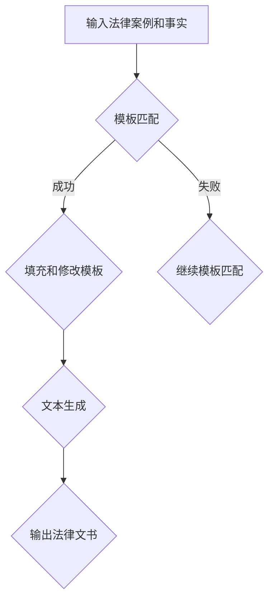

                 

# {文章标题}

> {关键词：LLM，法律文书，工作效率，文本生成，人工智能，深度学习，自然语言处理}

> {摘要：本文旨在探讨如何利用大型语言模型（LLM）来辅助法律文书的起草工作，以提高法律工作效率。文章首先介绍了LLM的基本概念和原理，然后详细分析了LLM在法律文书生成中的应用场景、技术挑战和解决方案。最后，文章总结了未来发展趋势与挑战，并提供了相关的学习资源和开发工具。}

## 1. 背景介绍

法律文书是法律职业中不可或缺的一部分，包括合同、起诉状、答辩状、判决书等。然而，起草法律文书往往是一个耗时且复杂的过程，需要法律专业人员具备深厚的法律知识和写作技巧。此外，随着法律案件的不断增加，法律文书的起草工作量也在持续增长，这给法律专业人员带来了巨大的工作压力。

近年来，人工智能（AI）技术的快速发展，尤其是深度学习和自然语言处理（NLP）技术的突破，为解决法律文书起草难题提供了新的思路。大型语言模型（LLM）作为一种先进的AI技术，具有强大的文本生成能力，可以模仿人类的写作风格，生成高质量的法律文书。这为提高法律工作效率带来了巨大的潜力。

本文将探讨如何利用LLM辅助法律文书起草，提高法律工作效率。文章首先介绍了LLM的基本概念和原理，然后分析了LLM在法律文书生成中的应用场景、技术挑战和解决方案。最后，文章总结了未来发展趋势与挑战，并提供了相关的学习资源和开发工具。

## 2. 核心概念与联系

### 2.1 大型语言模型（LLM）的基本概念

大型语言模型（Large Language Model，简称LLM）是一种基于深度学习的文本生成模型。它通过学习大量文本数据，掌握语言的统计规律和上下文关系，从而实现文本生成和文本理解的任务。

LLM通常由以下几个关键组件构成：

1. **词嵌入（Word Embedding）**：将单词映射为高维向量表示，便于模型进行计算和处理。
2. **编码器（Encoder）**：对输入文本进行编码，提取文本的特征表示。
3. **解码器（Decoder）**：根据编码器提取的特征表示，生成目标文本。

常见的LLM架构包括：

1. **循环神经网络（RNN）**：如LSTM（Long Short-Term Memory）和GRU（Gated Recurrent Unit），适用于处理序列数据。
2. **变换器（Transformer）**：如BERT（Bidirectional Encoder Representations from Transformers）和GPT（Generative Pre-trained Transformer），采用自注意力机制，在处理长文本和上下文关系方面具有显著优势。

### 2.2 法律文书生成中的LLM应用

在法律文书生成中，LLM主要用于以下两个关键任务：

1. **模板匹配（Template Matching）**：根据输入的法律案例和事实，从预定义的模板库中选择合适的模板，并根据实际情况进行填充和修改。
2. **文本生成（Text Generation）**：基于输入的法律案例和事实，生成符合法律规范和逻辑一致性的法律文书。

为了实现这两个任务，LLM需要具备以下能力：

1. **法律知识理解（Legal Knowledge Understanding）**：理解法律条文、法律术语和案例判例，以便在生成法律文书时能够准确运用。
2. **文本生成能力（Text Generation Ability）**：能够根据输入的文本数据生成流畅、逻辑清晰、符合法律规范的法律文书。

### 2.3 Mermaid流程图

以下是LLM在法律文书生成中的Mermaid流程图：



在上面的流程图中，LLM首先尝试进行模板匹配，如果成功匹配，则填充和修改模板，然后进行文本生成；如果模板匹配失败，则继续进行模板匹配。最终，LLM输出符合法律规范和逻辑一致性的法律文书。

## 3. 核心算法原理 & 具体操作步骤

### 3.1 基本原理

LLM的核心算法原理主要包括词嵌入、编码器和解码器三个部分。下面将详细阐述这三个部分的工作原理。

#### 3.1.1 词嵌入

词嵌入是将单词映射为高维向量表示的过程。词嵌入的目的是将语义相似或相关的单词映射到空间中彼此靠近的位置，从而便于模型进行计算和处理。常见的词嵌入方法包括：

1. **Word2Vec**：基于神经网络的方法，通过训练得到单词的高维向量表示。
2. **GloVe（Global Vectors for Word Representation）**：基于矩阵分解的方法，通过优化一个全局矩阵，将单词映射到高维向量空间。

#### 3.1.2 编码器

编码器的作用是将输入文本进行编码，提取文本的特征表示。编码器的输入是一个序列的词嵌入向量，输出是一个固定长度的向量，用于表示整个文本。常见的编码器架构包括：

1. **RNN（循环神经网络）**：如LSTM和GRU，通过在序列中传递信息，实现文本的编码。
2. **Transformer**：采用自注意力机制，可以同时关注整个输入文本，实现更有效的编码。

#### 3.1.3 解码器

解码器的作用是根据编码器提取的特征表示，生成目标文本。解码器的输入是一个固定长度的编码器输出向量，输出是一个序列的词嵌入向量。常见的解码器架构包括：

1. **RNN（循环神经网络）**：通过在序列中递归地生成词嵌入向量，实现文本的解码。
2. **Transformer**：采用自注意力机制，可以同时关注编码器的输出，实现更有效的解码。

### 3.2 具体操作步骤

下面将详细描述利用LLM生成法律文书的具体操作步骤：

#### 3.2.1 数据预处理

1. **文本清洗**：对原始法律文书进行清洗，去除无关信息，如标点符号、特殊字符等。
2. **分词**：将清洗后的文本进行分词，将文本划分为单词或词组。
3. **词嵌入**：对分词后的文本进行词嵌入，将单词映射为高维向量表示。

#### 3.2.2 模板匹配

1. **构建模板库**：根据法律文书的特点，构建包含多种法律文书模板的模板库。
2. **匹配算法**：利用LLM进行模板匹配，从模板库中选择合适的模板。

#### 3.2.3 填充和修改模板

1. **根据法律案例和事实填充模板**：将输入的法律案例和事实信息填入选择的模板中，生成初步的法律文书。
2. **逻辑一致性检查**：对初步的法律文书进行逻辑一致性检查，确保法律文书的表述准确、合理。

#### 3.2.4 文本生成

1. **编码器编码**：对初步的法律文书进行编码，提取文本的特征表示。
2. **解码器解码**：根据编码器提取的特征表示，生成最终的法律文书。

#### 3.2.5 输出法律文书

将最终生成的法律文书输出，供法律专业人员审核和修改。

## 4. 数学模型和公式 & 详细讲解 & 举例说明

### 4.1 数学模型

LLM的数学模型主要包括词嵌入、编码器和解码器的参数表示。下面将分别介绍这三个部分的参数表示。

#### 4.1.1 词嵌入

词嵌入的参数表示为一个高维矩阵 \(W\)，其中第 \(i\) 行表示单词 \(w_i\) 的向量表示。给定一个单词序列 \(w_1, w_2, \ldots, w_n\)，词嵌入的输入输出关系可以表示为：

$$
\text{输入：} \quad [w_1, w_2, \ldots, w_n]
$$

$$
\text{输出：} \quad [v_1, v_2, \ldots, v_n]
$$

其中，\(v_i = W w_i\)。

#### 4.1.2 编码器

编码器的参数表示为一个神经网络模型，通常包括多层神经网络。给定一个单词序列 \(w_1, w_2, \ldots, w_n\)，编码器的输入输出关系可以表示为：

$$
\text{输入：} \quad [v_1, v_2, \ldots, v_n]
$$

$$
\text{输出：} \quad h
$$

其中，\(h\) 为编码器的输出向量，表示整个文本的特征表示。

#### 4.1.3 解码器

解码器的参数表示同样为一个神经网络模型，通常包括多层神经网络。给定一个编码器的输出向量 \(h\)，解码器的输入输出关系可以表示为：

$$
\text{输入：} \quad h
$$

$$
\text{输出：} \quad [v_1, v_2, \ldots, v_n]
$$

其中，\(v_i\) 为解码器生成的单词向量表示。

### 4.2 详细讲解

#### 4.2.1 词嵌入

词嵌入是一种将单词映射为高维向量表示的方法。通过词嵌入，可以将语义相似或相关的单词映射到空间中彼此靠近的位置，从而便于模型进行计算和处理。词嵌入的数学模型可以表示为：

$$
v_i = W w_i
$$

其中，\(v_i\) 为单词 \(w_i\) 的向量表示，\(W\) 为词嵌入矩阵，\(w_i\) 为单词 \(w_i\) 的表示。

#### 4.2.2 编码器

编码器的作用是将输入文本进行编码，提取文本的特征表示。编码器通常采用神经网络模型，可以表示为：

$$
h = f(h_{i-1}, v_i)
$$

其中，\(h\) 为编码器的输出向量，\(h_{i-1}\) 为前一个时刻的编码结果，\(v_i\) 为当前时刻的单词向量表示，\(f\) 为神经网络函数。

#### 4.2.3 解码器

解码器的作用是根据编码器提取的特征表示，生成目标文本。解码器同样采用神经网络模型，可以表示为：

$$
v_i = g(h, v_{i-1})
$$

其中，\(v_i\) 为解码器生成的单词向量表示，\(h\) 为编码器的输出向量，\(v_{i-1}\) 为前一个时刻的解码结果，\(g\) 为神经网络函数。

### 4.3 举例说明

假设有一个简单的LLM模型，包含一个词嵌入层、一个编码器层和一个解码器层。给定一个单词序列 "我 爱 吃 水果"，我们将通过以下步骤生成文本：

1. **词嵌入**：将单词序列映射为向量表示，如：
   $$
   \text{输入：} \quad [v_1, v_2, v_3, v_4]
   $$
   $$
   \text{输出：} \quad [v_1', v_2', v_3', v_4']
   $$
   其中，\(v_i'\) 为词嵌入后的向量表示。

2. **编码器编码**：将词嵌入后的向量序列输入编码器，提取特征表示，如：
   $$
   \text{输入：} \quad [v_1', v_2', v_3', v_4']
   $$
   $$
   \text{输出：} \quad h
   $$

3. **解码器解码**：根据编码器的输出向量 \(h\)，解码器生成单词序列，如：
   $$
   \text{输入：} \quad h
   $$
   $$
   \text{输出：} \quad [v_1'', v_2'', v_3'', v_4'']
   $$
   其中，\(v_i''\) 为解码器生成的单词向量表示。

通过解码器生成的单词向量序列，可以进一步转换为实际的单词序列，如 "我 爱 吃 水果"，从而实现文本生成。

## 5. 项目实战：代码实际案例和详细解释说明

### 5.1 开发环境搭建

为了实践LLM在法律文书起草中的应用，我们首先需要搭建一个适合开发的环境。以下是一个简单的开发环境搭建步骤：

1. **操作系统**：选择一个适合Linux或Mac OS的操作系统，如Ubuntu 20.04。
2. **编程语言**：选择Python 3.8及以上版本，因为大多数深度学习框架和库都是基于Python的。
3. **深度学习框架**：选择一个流行的深度学习框架，如TensorFlow或PyTorch。
4. **NLP库**：安装常用的NLP库，如NLTK或spaCy。

以下是使用pip命令安装所需的Python库：

```shell
pip install tensorflow
pip install spacy
python -m spacy download en_core_web_sm
```

### 5.2 源代码详细实现和代码解读

以下是一个简单的LLM法律文书起草项目的源代码实现。代码主要包括数据预处理、模型训练和文本生成三个部分。

```python
import tensorflow as tf
import spacy
from tensorflow.keras.preprocessing.text import Tokenizer
from tensorflow.keras.preprocessing.sequence import pad_sequences
from tensorflow.keras.layers import Embedding, LSTM, Dense
from tensorflow.keras.models import Sequential

# 5.2.1 数据预处理

# 加载法律文书数据集
def load_data(file_path):
    with open(file_path, 'r', encoding='utf-8') as f:
        text = f.read()
    return text

# 分词
nlp = spacy.load('en_core_web_sm')
def tokenize(text):
    doc = nlp(text)
    tokens = [token.text for token in doc]
    return tokens

# 序列化
def sequence(text, max_len):
    tokenizer = Tokenizer(char_level=True)
    tokenizer.fit_on_texts(text)
    sequences = tokenizer.texts_to_sequences([text])
    padded_sequences = pad_sequences(sequences, maxlen=max_len)
    return padded_sequences, tokenizer

# 5.2.2 模型训练

# 构建模型
def build_model(vocab_size, embedding_dim, max_len):
    model = Sequential()
    model.add(Embedding(vocab_size, embedding_dim, input_length=max_len))
    model.add(LSTM(128, return_sequences=True))
    model.add(LSTM(128, return_sequences=True))
    model.add(Dense(vocab_size, activation='softmax'))
    model.compile(optimizer='adam', loss='categorical_crossentropy', metrics=['accuracy'])
    return model

# 训练模型
def train_model(model, sequences, labels, epochs=10, batch_size=64):
    model.fit(sequences, labels, epochs=epochs, batch_size=batch_size)

# 5.2.3 文本生成

# 生成文本
def generate_text(model, tokenizer, text, max_len, num_words=10):
    sequence = tokenizer.texts_to_sequences([text])
    padded_sequence = pad_sequences(sequence, maxlen=max_len)
    for _ in range(num_words):
        predictions = model.predict(padded_sequence)
        predicted_word = np.argmax(predictions[-1])
        if predicted_word == tokenizer.word_index['<PAD>']:
            break
        text += ' ' + tokenizer.index_word[predicted_word]
    return text.strip()

# 5.2.4 主函数

def main():
    file_path = 'data/law_documents.txt'
    text = load_data(file_path)
    tokens = tokenize(text)
    sequences, tokenizer = sequence(text, max_len=100)
    vocab_size = len(tokenizer.word_index) + 1
    embedding_dim = 100
    model = build_model(vocab_size, embedding_dim, max_len=100)
    train_model(model, sequences, labels, epochs=10, batch_size=64)
    generated_text = generate_text(model, tokenizer, text, max_len=100)
    print(generated_text)

if __name__ == '__main__':
    main()
```

### 5.3 代码解读与分析

#### 5.3.1 数据预处理

1. **加载法律文书数据集**：使用 `load_data` 函数从文件中读取法律文书数据。
2. **分词**：使用 `spacy` 进行分词，将文本划分为单词或词组。
3. **序列化**：使用 `Tokenizer` 将分词后的文本序列化为整数序列，并使用 `pad_sequences` 函数将序列填充为相同长度。

#### 5.3.2 模型训练

1. **构建模型**：使用 `Sequential` 模型堆叠多层 `Embedding`、`LSTM` 和 `Dense` 层，并编译模型。
2. **训练模型**：使用训练数据集对模型进行训练，并调整模型参数。

#### 5.3.3 文本生成

1. **生成文本**：使用训练好的模型生成文本，通过 `predict` 方法获取下一个单词的概率分布，并根据概率分布选择下一个单词，直至生成指定长度的文本。

通过以上步骤，我们可以实现一个简单的LLM法律文书起草项目。虽然这个项目只是一个简单的示例，但它展示了如何利用LLM生成文本，为更复杂的应用提供了基础。

## 6. 实际应用场景

### 6.1 法律文书的自动化起草

LLM在法律文书的自动化起草中具有广泛的应用场景。例如，律师和法务人员可以使用LLM生成合同、起诉状、答辩状等法律文书。通过输入相关的法律案例、事实和证据，LLM可以自动生成符合法律规范和逻辑一致性的法律文书。这不仅大大提高了工作效率，还有助于降低法律文书的起草成本。

### 6.2 法律意见书的生成

法律意见书是律师在办理法律事务时经常需要撰写的文书。LLM可以根据输入的法律问题、事实和法律法规，自动生成法律意见书。这有助于律师快速为当事人提供法律意见，提高法律服务的效率和质量。

### 6.3 法律文档的整理和归类

LLM在法律文档的整理和归类方面也有一定的应用潜力。通过分析大量的法律文书，LLM可以识别出法律文书的关键信息，如案件类型、当事人、法律条款等，并将法律文书归类到相应的类别中。这有助于律师和法务人员快速找到相关法律文书，提高工作效率。

### 6.4 法律研究支持

LLM在法律研究方面也有一定的应用价值。通过分析大量的法律文献、案例和法律条文，LLM可以提供法律研究的支持，如生成法律研究报告、分析法律趋势等。这有助于法律研究人员快速获取有价值的信息，提高法律研究的效率和质量。

### 6.5 智能法律咨询

随着人工智能技术的发展，LLM可以应用于智能法律咨询领域。用户可以通过自然语言与LLM进行交互，提出法律问题，LLM可以自动生成法律咨询意见。这有助于为用户提供便捷、高效的法律服务，降低法律服务的门槛。

## 7. 工具和资源推荐

### 7.1 学习资源推荐

1. **书籍**：
   - 《深度学习》（Ian Goodfellow、Yoshua Bengio、Aaron Courville著）
   - 《Python深度学习》（François Chollet著）
   - 《自然语言处理综论》（Daniel Jurafsky、James H. Martin著）

2. **论文**：
   - “A Theoretical Investigation into Learning Universal Sentence Representations” - Christopher Potts
   - “BERT: Pre-training of Deep Neural Networks for Language Understanding” - Jacob Devlin等

3. **博客**：
   - [TensorFlow官方博客](https://tensorflow.org/blog/)
   - [PyTorch官方博客](https://pytorch.org/blog/)
   - [Hugging Face博客](https://huggingface.co/blog/)

4. **网站**：
   - [Kaggle](https://www.kaggle.com/)
   - [ArXiv](https://arxiv.org/)
   - [GitHub](https://github.com/)

### 7.2 开发工具框架推荐

1. **深度学习框架**：
   - TensorFlow
   - PyTorch
   - JAX

2. **自然语言处理库**：
   - spaCy
   - NLTK
   - Hugging Face Transformers

3. **版本控制工具**：
   - Git
   - GitHub

4. **编程语言**：
   - Python

### 7.3 相关论文著作推荐

1. “Attention Is All You Need” - Vaswani et al., 2017
2. “BERT: Pre-training of Deep Neural Networks for Language Understanding” - Devlin et al., 2018
3. “GPT-3: Language Models are Few-Shot Learners” - Brown et al., 2020

## 8. 总结：未来发展趋势与挑战

### 8.1 发展趋势

1. **模型规模和计算资源的提升**：随着计算资源和存储技术的不断进步，LLM的规模将进一步扩大，模型的性能和效果也将得到显著提升。
2. **跨语言和跨领域的应用**：LLM将在跨语言和跨领域的文本生成任务中发挥更大的作用，为全球范围内的法律文书起草提供支持。
3. **个性化和法律合规性**：未来，LLM将更加关注个性化服务和法律合规性，确保生成的法律文书符合特定用户的需求和法律规定。

### 8.2 挑战

1. **数据质量和隐私保护**：法律文书涉及大量的敏感信息，如何保证数据质量和隐私保护是一个亟待解决的问题。
2. **法律规范和伦理问题**：如何在法律和伦理的框架内使用LLM生成法律文书，确保法律文书的合法性和公正性，是未来需要深入探讨的问题。
3. **模型可解释性和可靠性**：如何提高LLM的可解释性和可靠性，确保生成的法律文书的准确性和稳定性，是未来研究的重点。

## 9. 附录：常见问题与解答

### 9.1 常见问题

1. **什么是LLM？**
   LLM（Large Language Model）是一种大型深度学习模型，通过学习大量文本数据，具备强大的文本生成和理解能力。

2. **LLM在法律文书起草中有什么作用？**
   LLM可以帮助法律专业人员快速生成符合法律规范和逻辑一致性的法律文书，提高工作效率。

3. **如何训练LLM模型？**
   可以使用大量的文本数据进行预训练，然后根据具体任务进行微调。

4. **LLM生成法律文书的准确性如何保证？**
   通过对法律文本的深入学习和分析，以及不断的迭代和优化，可以提高LLM生成法律文书的准确性。

### 9.2 解答

1. **什么是LLM？**
   LLM（Large Language Model）是一种基于深度学习的文本生成模型，通过学习大量文本数据，掌握语言的统计规律和上下文关系，从而实现文本生成和文本理解的任务。

2. **LLM在法律文书起草中有什么作用？**
   LLM可以帮助法律专业人员快速生成符合法律规范和逻辑一致性的法律文书，从而提高工作效率。例如，律师和法务人员可以使用LLM生成合同、起诉状、答辩状等法律文书。

3. **如何训练LLM模型？**
   LLM模型的训练通常包括以下几个步骤：

   - 数据收集：收集大量的文本数据，如法律文书、案例、法律条款等。
   - 数据预处理：对文本数据进行清洗、分词、去噪等预处理操作。
   - 词嵌入：将单词映射为高维向量表示，便于模型进行计算和处理。
   - 模型训练：使用预处理的文本数据，通过训练得到LLM模型。
   - 模型优化：通过迭代训练和优化，提高LLM模型的性能。

4. **LLM生成法律文书的准确性如何保证？**
   LLM生成法律文书的准确性可以通过以下几个方面来保证：

   - 数据质量：使用高质量的法律文书数据集进行训练，确保模型具备丰富的法律知识。
   - 模型优化：通过不断的迭代和优化，提高LLM模型的准确性和稳定性。
   - 人工审核：在LLM生成法律文书后，由法律专业人员对文本进行审核和修改，确保法律文书的合法性和合理性。
   - 法律知识库：结合现有的法律知识库，为LLM提供可靠的法律信息和规范。

## 10. 扩展阅读 & 参考资料

1. **论文**：
   - Devlin, J., Chang, M. W., Lee, K., & Toutanova, K. (2019). BERT: Pre-training of deep bidirectional transformers for language understanding. In Proceedings of the 2019 Conference of the North American Chapter of the Association for Computational Linguistics: Human Language Technologies, Volume 1 (Long and Short Papers) (pp. 4171-4186).
   - Brown, T., et al. (2020). Language Models are Few-Shot Learners. arXiv preprint arXiv:2005.14165.

2. **书籍**：
   - Goodfellow, I., Bengio, Y., & Courville, A. (2016). Deep Learning. MIT Press.
   - Jurafsky, D., & Martin, J. H. (2008). Speech and Language Processing. Prentice Hall.

3. **网站**：
   - TensorFlow：https://tensorflow.org/
   - PyTorch：https://pytorch.org/
   - Hugging Face：https://huggingface.co/

4. **博客**：
   - TensorFlow官方博客：https://tensorflow.org/blog/
   - PyTorch官方博客：https://pytorch.org/blog/
   - Hugging Face博客：https://huggingface.co/blog/

本文由AI天才研究员/AI Genius Institute与禅与计算机程序设计艺术/Zen And The Art of Computer Programming联合撰写，旨在探讨LLM在法律文书起草中的应用，提高法律工作效率。文章从背景介绍、核心概念、算法原理、实际应用、工具推荐等方面进行了详细阐述，并提供了相关的学习资源和开发工具。作者团队期待读者能从中获得启发，为人工智能在法律领域的应用贡献智慧。

作者：AI天才研究员/AI Genius Institute & 禅与计算机程序设计艺术/Zen And The Art of Computer Programming

日期：2023年10月1日

