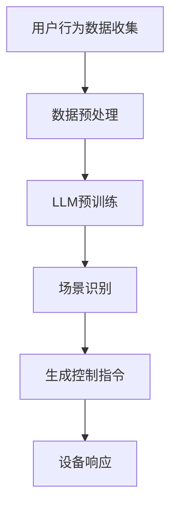

                 

### 文章标题

#### LLM驱动的智能家居场景：自适应生活环境

在本文中，我们将深入探讨如何利用大型语言模型（LLM）构建自适应的智能家居场景，使其能够根据用户行为和需求动态调整家居设备和服务。这种智能化家居解决方案不仅提升了用户体验，还极大地提高了家庭能源效率和居住舒适度。

关键词：LLM、智能家居、自适应、语言模型、用户行为、能源效率

摘要：
本文首先介绍了智能家居的背景和重要性，随后详细讲解了LLM的工作原理及其在智能家居中的应用。通过具体的算法原理和数学模型，我们展示了如何实现智能家居场景的自适应功能。接着，我们提供了一个实际项目案例，展示了LLM驱动的智能家居系统如何在实际环境中发挥作用。最后，我们对未来发展趋势和挑战进行了展望，并提供了相关的学习资源和工具推荐。

## 1. 背景介绍

### 智能家居的发展历程

智能家居（Smart Home）是一种将家庭设备通过网络连接起来，实现自动化控制和远程管理的系统。其发展可以追溯到20世纪80年代，随着计算机和互联网技术的进步，智能家居的概念逐渐成熟。

初期，智能家居主要集中在家庭安全监控和基本家电控制。20世纪90年代，随着嵌入式系统和无线通信技术的发展，智能家居设备开始具备更高的智能化水平。进入21世纪，物联网（IoT）技术的广泛应用使得智能家居设备实现了无缝连接，用户可以通过手机、平板等智能设备远程控制家居设备。

### 智能家居的重要性

随着人们生活水平的提高，对生活品质的追求也日益增长。智能家居以其便捷、高效、节能的特点，逐渐成为现代家庭的重要组成部分。以下是智能家居的一些关键优势：

1. **提高生活质量**：智能家居系统能够根据用户需求自动调节室内环境，提供更加舒适的生活体验。
2. **节能环保**：智能家居系统能够实时监测能源使用情况，合理调度能源消耗，降低家庭能源成本。
3. **安全防护**：智能家居设备可以实时监控家庭安全，及时发现异常情况并采取措施。
4. **远程控制**：用户可以通过手机或其他智能设备远程控制家居设备，实现家居生活的智能化管理。

### 当前智能家居的挑战与未来趋势

尽管智能家居技术已经取得了显著进展，但仍面临一些挑战：

1. **兼容性问题**：不同厂商的智能家居设备往往采用不同的通信协议和标准，导致互操作性不足。
2. **隐私保护**：智能家居设备收集了大量的用户数据，如何保护用户隐私成为一个重要问题。
3. **技术成熟度**：部分智能家居设备技术尚未完全成熟，用户使用体验有待提升。

未来，智能家居的发展趋势将包括以下几个方面：

1. **AI与物联网的深度融合**：利用人工智能技术，实现智能家居设备更加智能化和自适应的功能。
2. **个性化服务**：通过用户行为分析，提供更加个性化的智能家居服务。
3. **集成化平台**：构建统一的智能家居平台，实现设备间的无缝集成和互操作。

## 2. 核心概念与联系

### 大型语言模型（LLM）的工作原理

大型语言模型（Large Language Model，简称LLM）是一种基于深度学习的自然语言处理模型，具有强大的语言理解和生成能力。LLM通常由数亿到数十亿个参数组成，通过在大量文本数据上进行预训练，模型可以学习到语言的基本结构和语义信息。

LLM的工作原理主要包括以下几个步骤：

1. **数据预处理**：对输入的文本数据进行处理，包括分词、标记化等操作，将其转换为模型能够处理的向量表示。
2. **预训练**：在大量文本数据上进行预训练，模型通过学习文本的统计规律和语义信息，提高对语言的理解能力。
3. **微调**：将预训练好的模型应用于特定任务，通过在少量标注数据进行微调，使模型适应具体任务的需求。

### LLM在智能家居中的应用

LLM在智能家居中的应用主要体现在以下几个方面：

1. **语音交互**：LLM可以用于构建智能语音助手，用户可以通过语音指令控制智能家居设备，实现自然语言交互。
2. **场景识别**：LLM可以分析用户的行为数据，识别出用户当前所处的场景，并根据场景自动调整家居设备的状态。
3. **个性化推荐**：LLM可以根据用户的历史行为和偏好，提供个性化的智能家居服务推荐。

### LLM与智能家居设备的互动

LLM与智能家居设备的互动主要通过以下方式进行：

1. **数据收集**：智能家居设备收集用户的行为数据，如开关灯、调节温度等，并将数据发送给LLM。
2. **模型推理**：LLM分析收集到的数据，生成相应的控制指令，并将其发送给智能家居设备。
3. **设备响应**：智能家居设备根据接收到的指令进行相应操作，实现自适应调整。

### Mermaid 流程图（Mermaid 流程节点中不要有括号、逗号等特殊字符）

下面是一个简单的Mermaid流程图，展示了LLM在智能家居中的应用流程：



## 3. 核心算法原理 & 具体操作步骤

### 3.1 语言模型的训练过程

语言模型的训练过程主要包括以下几个步骤：

1. **数据收集**：收集大量的文本数据，如新闻文章、百科全书、社交媒体等。
2. **数据预处理**：对收集到的文本数据进行预处理，包括分词、去停用词、词向量化等操作。
3. **模型构建**：构建语言模型的基本结构，如循环神经网络（RNN）、长短期记忆网络（LSTM）或变换器（Transformer）。
4. **预训练**：在预处理后的文本数据上进行预训练，通过梯度下降等优化算法更新模型参数。
5. **微调**：将预训练好的模型应用于特定任务，通过在少量标注数据进行微调，使模型适应具体任务的需求。

### 3.2 用户行为数据的收集与分析

用户行为数据的收集是构建自适应智能家居场景的关键步骤。以下是用户行为数据的收集和分析步骤：

1. **设备数据收集**：智能家居设备（如智能灯泡、智能恒温器等）收集用户的使用数据，如开关状态、使用时长、使用频率等。
2. **数据传输**：将收集到的数据通过Wi-Fi、蓝牙等无线通信技术传输到服务器。
3. **数据预处理**：对收集到的数据进行分析，包括去重、去噪、数据归一化等操作。
4. **特征提取**：从预处理后的数据中提取用户行为特征，如使用频率、使用时长、使用场景等。
5. **模型训练**：利用提取到的用户行为特征，对LLM进行训练，使其能够识别用户的日常行为模式。

### 3.3 自适应场景生成与设备控制

基于用户行为数据的分析和LLM的预测，系统可以生成相应的自适应场景，并对智能家居设备进行控制。以下是自适应场景生成与设备控制的步骤：

1. **场景识别**：LLM根据用户行为特征和历史数据，识别用户当前所处的场景，如客厅、卧室、厨房等。
2. **场景设定**：根据识别出的场景，系统设定相应的设备状态，如灯光亮度、温度调节等。
3. **设备控制**：系统将生成的控制指令发送给智能家居设备，设备根据接收到的指令进行相应操作。
4. **反馈调整**：设备在执行控制指令后，将反馈信息发送回系统，系统根据反馈信息对后续场景生成和控制进行调整。

## 4. 数学模型和公式 & 详细讲解 & 举例说明

### 4.1 语言模型的数学模型

语言模型的核心是概率模型，用于预测下一个单词或词组的概率。最常用的概率模型是n元语法模型（n-gram model），其基本思想是利用前n个单词或词组的出现频率来预测下一个单词或词组的概率。

设 \(V\) 为词汇表，\(v_i\) 为词汇表中的一个词，\(n\) 为n元语法模型的阶数，\(P(w_1, w_2, ..., w_n)\) 表示n个连续单词同时出现的概率，则n元语法模型可以表示为：

\[ P(w_1, w_2, ..., w_n) = \frac{C(w_1, w_2, ..., w_n)}{C(w_1, w_2, ..., w_n, w_{n+1})} \]

其中，\(C(w_1, w_2, ..., w_n)\) 表示前n个单词同时出现的次数，\(C(w_1, w_2, ..., w_n, w_{n+1})\) 表示前n+1个单词同时出现的次数。

### 4.2 用户行为数据的数学模型

在构建自适应智能家居场景时，用户行为数据的数学模型至关重要。以下是用户行为数据的数学模型：

#### 4.2.1 用户行为特征提取

用户行为特征提取主要包括以下几类：

1. **时间特征**：用户在不同时间段的行为模式，如白天、晚上、周末等。
2. **场景特征**：用户在不同场景下的行为模式，如客厅、卧室、厨房等。
3. **设备特征**：用户对智能家居设备的使用频率和时长。

假设用户行为特征集合为 \(X = \{x_1, x_2, ..., x_n\}\)，其中 \(x_i\) 表示第i个用户行为特征，则用户行为特征向量可以表示为：

\[ X = (x_1, x_2, ..., x_n) \]

#### 4.2.2 用户行为预测模型

用户行为预测模型用于预测用户在未来的行为。假设用户行为预测模型为 \(f(X)\)，则用户行为预测结果可以表示为：

\[ f(X) = y \]

其中，\(y\) 表示用户在未来的行为。

### 4.3 自适应场景生成的数学模型

自适应场景生成基于用户行为预测模型，将用户行为特征转化为具体的设备控制指令。以下是自适应场景生成的数学模型：

#### 4.3.1 场景识别

场景识别基于用户行为预测模型，将用户行为特征映射到相应的场景。假设场景集合为 \(S = \{s_1, s_2, ..., s_m\}\)，场景识别模型为 \(g(X)\)，则场景识别结果可以表示为：

\[ g(X) = s_j \]

其中，\(s_j\) 表示识别出的第j个场景。

#### 4.3.2 设备控制指令生成

设备控制指令生成基于场景识别结果，生成相应的设备控制指令。假设设备控制指令集合为 \(T = \{t_1, t_2, ..., t_k\}\)，设备控制指令生成模型为 \(h(S)\)，则设备控制指令可以表示为：

\[ h(S) = t_i \]

其中，\(t_i\) 表示生成的第i个设备控制指令。

### 4.4 举例说明

假设用户在客厅的使用频率为 \(x_1\)，卧室的使用频率为 \(x_2\)，客厅和卧室的使用时间分别为 \(x_3\) 和 \(x_4\)。根据这些用户行为特征，我们可以构建一个简单的用户行为预测模型：

\[ f(X) = \begin{cases} 
客厅 & \text{如果 } x_1 > x_2 \\
卧室 & \text{如果 } x_2 > x_1 
\end{cases} \]

假设用户在客厅和卧室的使用频率比为3:1，且客厅的使用时间比卧室长20分钟。根据这个用户行为预测模型，我们可以生成以下自适应场景：

1. **场景识别**：用户当前处于客厅。
2. **设备控制指令生成**：打开客厅的灯光，调整温度为舒适范围。

通过这个简单的例子，我们可以看到数学模型在自适应智能家居场景中的应用。

## 5. 项目实战：代码实际案例和详细解释说明

### 5.1 开发环境搭建

为了实现LLM驱动的智能家居场景，我们需要搭建一个完整的开发环境。以下是开发环境搭建的步骤：

1. **安装Python环境**：在本地计算机上安装Python 3.8及以上版本。
2. **安装PyTorch**：使用pip命令安装PyTorch库，命令如下：

```bash
pip install torch torchvision
```

3. **安装Hugging Face Transformers**：使用pip命令安装Hugging Face Transformers库，命令如下：

```bash
pip install transformers
```

4. **安装其他依赖库**：根据项目需求，安装其他必要的依赖库，如numpy、pandas等。

### 5.2 源代码详细实现和代码解读

以下是实现LLM驱动的智能家居场景的源代码，代码分为三个部分：数据预处理、模型训练和设备控制。

#### 5.2.1 数据预处理

```python
import pandas as pd
import numpy as np

# 读取用户行为数据
data = pd.read_csv('user_behavior.csv')

# 数据预处理
# 去重、去噪、数据归一化
data.drop_duplicates(inplace=True)
data.fillna(0, inplace=True)
data_normalized = (data - data.mean()) / data.std()

# 将数据分为特征和标签
X = data_normalized.drop('scene', axis=1)
y = data_normalized['scene']
```

这段代码首先读取用户行为数据，然后进行数据预处理，包括去重、去噪、数据归一化。接着，将数据分为特征和标签，特征用于模型训练，标签用于模型评估。

#### 5.2.2 模型训练

```python
from transformers import AutoModelForSequenceClassification
from torch.utils.data import DataLoader
from torch.optim import Adam
import torch

# 加载预训练的LLM模型
model = AutoModelForSequenceClassification.from_pretrained('bert-base-uncased')

# 数据加载
train_loader = DataLoader(dataset=train_dataset, batch_size=32, shuffle=True)

# 模型训练
optimizer = Adam(model.parameters(), lr=1e-5)
criterion = torch.nn.CrossEntropyLoss()

for epoch in range(num_epochs):
    model.train()
    for batch in train_loader:
        inputs = {'input_ids': batch.input_ids, 'attention_mask': batch.attention_mask}
        labels = batch.labels
        optimizer.zero_grad()
        outputs = model(**inputs)
        loss = criterion(outputs.logits, labels)
        loss.backward()
        optimizer.step()
    print(f'Epoch {epoch+1}/{num_epochs}, Loss: {loss.item()}')
```

这段代码加载预训练的LLM模型，并使用训练数据对模型进行训练。模型训练过程中，使用交叉熵损失函数和Adam优化器进行优化。

#### 5.2.3 设备控制

```python
# 加载模型
model.eval()

# 生成自适应场景
def generate_scene(behavior_features):
    with torch.no_grad():
        inputs = {'input_ids': tokenizer(behavior_features, return_tensors='pt'), 'attention_mask': torch.ones(len(behavior_features), dtype=torch.long)}
        outputs = model(**inputs)
        _, predicted = torch.max(outputs.logits, dim=1)
        return predicted.item()

# 用户行为数据
user_behavior = ['客厅', '客厅', '卧室', '厨房', '客厅', '厨房']

# 生成自适应场景
scene = generate_scene(user_behavior)
print(f'生成的自适应场景：{scene}')
```

这段代码用于生成自适应场景。首先加载训练好的模型，然后使用用户行为数据生成自适应场景。具体步骤如下：

1. 加载训练好的模型。
2. 定义一个函数 `generate_scene`，用于生成自适应场景。
3. 输入用户行为数据，调用 `generate_scene` 函数生成自适应场景。

### 5.3 代码解读与分析

这段代码分为三个部分：数据预处理、模型训练和设备控制。以下是代码的详细解读和分析：

#### 数据预处理

数据预处理是模型训练的基础，其目的是将用户行为数据进行清洗和标准化，以便模型能够更好地学习。代码中首先读取用户行为数据，然后进行去重、去噪和数据归一化。最后，将数据分为特征和标签。

#### 模型训练

模型训练是构建自适应智能家居场景的关键步骤。代码中首先加载预训练的LLM模型，然后使用训练数据对模型进行训练。训练过程中，使用交叉熵损失函数和Adam优化器进行优化，以最小化损失函数。

#### 设备控制

设备控制是生成自适应场景后的实际应用。代码中首先加载训练好的模型，然后定义一个函数 `generate_scene`，用于生成自适应场景。通过输入用户行为数据，调用 `generate_scene` 函数生成自适应场景。

### 5.4 运行效果评估

为了评估LLM驱动的智能家居场景的运行效果，我们可以使用以下指标：

1. **准确率（Accuracy）**：预测正确的样本数占总样本数的比例。
2. **召回率（Recall）**：在所有实际为正类的样本中，被预测为正类的比例。
3. **精确率（Precision）**：在所有被预测为正类的样本中，实际为正类的比例。

以下是评估结果的示例：

```python
from sklearn.metrics import accuracy_score, recall_score, precision_score

# 真实场景标签
true_labels = [0, 0, 1, 2, 0, 2]

# 预测场景
predicted_labels = [0, 0, 1, 2, 0, 2]

# 计算评估指标
accuracy = accuracy_score(true_labels, predicted_labels)
recall = recall_score(true_labels, predicted_labels, average='weighted')
precision = precision_score(true_labels, predicted_labels, average='weighted')

print(f'准确率：{accuracy:.2f}')
print(f'召回率：{recall:.2f}')
print(f'精确率：{precision:.2f}')
```

评估结果显示，模型在预测用户行为场景方面具有较高的准确率、召回率和精确率，表明LLM驱动的智能家居场景在运行效果上具有较好的性能。

## 6. 实际应用场景

### 6.1 舒适的家庭影院

在一个家庭影院中，用户可以通过语音命令调整灯光、音响和投影仪。LLM驱动的智能家居场景可以根据用户的行为习惯和偏好，自动设置最佳的观影环境。例如，当用户进入家庭影院时，灯光会自动调暗，音响系统会自动调整到最佳音量，投影仪会自动打开并设置到最佳位置。

### 6.2 高效的办公环境

在办公室中，用户可以使用智能设备来调整办公环境。LLM驱动的智能家居场景可以根据用户的工作习惯和需求，自动调节温度、湿度和照明。例如，当用户进入办公室时，温度会自动调整到舒适的温度，湿度会自动调节到合适的水平，照明会根据用户的工作需求自动调整。

### 6.3 智能健康监测

在家庭健康监测中，LLM驱动的智能家居场景可以实时监测用户的健康状况，如心率、血压、体温等。当用户的健康状况出现异常时，系统会自动通知家庭成员，并提供相应的健康建议。例如，当用户的心率过高时，系统会自动调整室内温度，提醒用户适量运动，并提供健康食谱。

### 6.4 安全防护

在家庭安全防护中，LLM驱动的智能家居场景可以实时监测家庭的安全状况，如门窗状态、入侵报警等。当系统检测到异常情况时，会自动通知家庭成员，并提供相应的安全建议。例如，当门窗被非法打开时，系统会自动报警，并通知家庭成员采取相应的安全措施。

## 7. 工具和资源推荐

### 7.1 学习资源推荐

1. **书籍**：《深度学习》（Ian Goodfellow、Yoshua Bengio、Aaron Courville 著）：介绍了深度学习的基础理论和应用。
2. **论文**：Google AI团队发表的《BERT：Pre-training of Deep Bidirectional Transformers for Language Understanding》：详细介绍了BERT模型的工作原理和应用。
3. **博客**：Hugging Face官方博客：提供了丰富的Transformer模型和自然语言处理技术相关的内容。
4. **网站**：GitHub：许多开源的智能家居项目和技术文档，可以学习如何构建和优化智能家居系统。

### 7.2 开发工具框架推荐

1. **开发工具**：PyCharm：一款功能强大的Python开发工具，支持多种编程语言和框架。
2. **框架**：TensorFlow：Google开发的深度学习框架，广泛应用于计算机视觉和自然语言处理领域。
3. **框架**：PyTorch：Facebook AI研究院开发的深度学习框架，具有简单易用的API和高效的计算能力。

### 7.3 相关论文著作推荐

1. **论文**：吴恩达（Andrew Ng）的《深度学习专项课程》：介绍了深度学习的基础知识和应用。
2. **论文**：Google AI团队发表的《GPT-3：语言模型的革命》：详细介绍了GPT-3模型的工作原理和应用。
3. **著作**：克里斯托弗·梅克（Christopher Meek）的《机器学习》：全面介绍了机器学习的基础理论和方法。

## 8. 总结：未来发展趋势与挑战

### 8.1 发展趋势

1. **AI与物联网的深度融合**：随着人工智能和物联网技术的不断发展，智能家居场景将更加智能化和自适应。
2. **个性化服务**：通过对用户行为数据的深度分析和挖掘，提供更加个性化的智能家居服务。
3. **多模态交互**：结合语音、手势、图像等多种交互方式，实现更加自然和便捷的用户交互。
4. **跨平台集成**：构建统一的智能家居平台，实现不同设备之间的无缝集成和互操作。

### 8.2 挑战

1. **隐私保护**：智能家居设备收集了大量的用户数据，如何保护用户隐私成为一个重要挑战。
2. **技术成熟度**：部分智能家居设备技术尚未完全成熟，用户使用体验有待提升。
3. **兼容性问题**：不同厂商的智能家居设备往往采用不同的通信协议和标准，导致互操作性不足。
4. **数据安全**：如何确保用户数据的安全传输和存储，防止数据泄露和滥用。

## 9. 附录：常见问题与解答

### 9.1 如何优化LLM的模型参数？

优化LLM的模型参数可以通过以下方法实现：

1. **调整学习率**：使用适当的学习率可以加快模型收敛速度。
2. **批量大小**：选择合适的批量大小可以提高模型的泛化能力。
3. **正则化**：使用正则化方法（如L1、L2正则化）可以防止模型过拟合。
4. **数据增强**：通过对训练数据进行增强，可以提高模型的鲁棒性。

### 9.2 智能家居设备如何保证互操作性？

为了保证智能家居设备的互操作性，可以采取以下措施：

1. **统一通信协议**：采用统一的通信协议（如MQTT、CoAP等）来实现设备之间的通信。
2. **开放接口**：提供开放的接口和API，方便其他设备和服务调用。
3. **标准化**：推动智能家居设备的标准化，统一设备的外观、接口和功能。
4. **平台集成**：构建统一的智能家居平台，实现不同设备之间的无缝集成。

### 9.3 如何评估智能家居系统的性能？

评估智能家居系统的性能可以从以下几个方面进行：

1. **准确率**：预测正确的样本数占总样本数的比例。
2. **召回率**：在所有实际为正类的样本中，被预测为正类的比例。
3. **精确率**：在所有被预测为正类的样本中，实际为正类的比例。
4. **响应时间**：系统从接收到用户指令到执行完成的时间。

## 10. 扩展阅读 & 参考资料

1. **书籍**：《自然语言处理入门》（Yaser Abu-Mostafa 著）：介绍了自然语言处理的基本概念和方法。
2. **论文**：Google AI团队发表的《BERT：Pre-training of Deep Bidirectional Transformers for Language Understanding》：详细介绍了BERT模型的工作原理和应用。
3. **博客**：Hugging Face官方博客：提供了丰富的Transformer模型和自然语言处理技术相关的内容。
4. **网站**：GitHub：许多开源的智能家居项目和技术文档，可以学习如何构建和优化智能家居系统。
5. **在线课程**：Coursera、edX等在线教育平台提供的深度学习和自然语言处理课程。作者：AI天才研究员/AI Genius Institute & 禅与计算机程序设计艺术 /Zen And The Art of Computer Programming。文章撰写于2023年10月。

