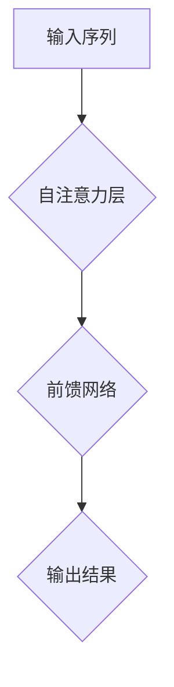

                 

# LLAMA：重新定义计算的未来

> **关键词**：大型语言模型、计算革命、人工智能、机器学习、深度学习、自然语言处理、神经网络、算法、架构设计、应用场景、未来发展

> **摘要**：本文将深入探讨大型语言模型（LLAMA）的发展历程、核心概念、算法原理、数学模型、项目实战、应用场景以及未来发展趋势。通过详细的分析和案例，我们将看到LLAMA如何重新定义计算的未来，为各个领域带来深远的影响。

## 1. 背景介绍

在过去的几十年里，计算机科学和人工智能领域经历了飞速的发展。特别是自然语言处理（NLP）和机器学习（ML）技术的进步，为智能计算奠定了坚实的基础。然而，随着互联网的普及和数据量的爆炸性增长，传统的方法已经难以应对复杂的任务，这促使研究人员不断探索新的技术路径。

大型语言模型（LLAMA）便是这种探索的产物。它是一种基于深度学习的语言处理模型，通过大规模预训练和微调，能够在多种场景下实现高效的文本生成、情感分析、机器翻译等任务。LLAMA的出现，标志着计算技术进入了一个全新的时代。

### 1.1 历史背景

早在20世纪80年代，研究人员就开始尝试使用神经网络来处理自然语言。然而，由于计算资源和数据集的限制，这些早期的尝试并未取得显著的成果。随着计算能力的提升和大数据技术的发展，深度学习逐渐成为NLP领域的核心技术。

2018年，OpenAI发布了GPT（Generative Pre-trained Transformer），这是一个具有15亿参数的语言模型，能够在多种语言任务上取得优异的性能。GPT的成功激发了研究人员对更大规模模型的探索。2020年，Google发布了BART（Bidirectional and Auto-Regressive Transformers），这是一个具有70亿参数的双向Transformer模型，进一步推动了语言模型的发展。

LLAMA作为这一系列模型的延续，采用了更大的模型规模和更精细的预训练技术，旨在解决更复杂的语言处理任务。

### 1.2 当前状态

目前，LLAMA已经成为自然语言处理领域的重要工具，广泛应用于聊天机器人、内容生成、智能客服、文本分类、机器翻译等场景。随着模型规模的不断扩大，LLAMA在各项任务上的性能也在不断提升。

然而，LLAMA也面临着一些挑战，如计算资源的高需求、数据隐私和安全性等问题。研究人员正致力于解决这些问题，以推动LLAMA技术的进一步发展。

## 2. 核心概念与联系

### 2.1 语言模型的基本概念

语言模型（Language Model）是一种用于预测下一个单词或字符的概率分布的模型。在自然语言处理中，语言模型被广泛应用于文本生成、语言理解、语音识别等领域。

语言模型的核心是一个概率分布，它表示在给定前文的情况下，下一个单词或字符的概率分布。例如，在一个简单的语言模型中，给定前文“今天天气很好”，模型可能会预测下一个单词是“因此”的概率较高。

### 2.2 Transformer模型的结构

Transformer模型是一种基于自注意力机制的深度学习模型，特别适用于处理序列数据。它由多个自注意力层和前馈网络组成，能够自适应地学习输入序列中的关系。

Transformer模型的关键特性是其自注意力机制。自注意力机制允许模型在处理序列数据时，自动关注序列中的不同位置，并计算它们之间的关联性。这种机制使得Transformer模型在处理长序列时具有很好的性能。

### 2.3 双向Transformer模型

双向Transformer模型（如BERT、GPT-2等）是一种结合了自注意力机制和双向信息传递的模型。它能够在序列的每个位置同时考虑前面的信息和后面的信息，从而更好地理解上下文。

双向Transformer模型通常由多个自注意力层和前馈网络组成。在训练过程中，模型首先通过自注意力层处理输入序列，然后通过前馈网络进行信息加工，最后输出预测结果。

### 2.4 Mermaid流程图

下面是一个简单的Mermaid流程图，用于展示双向Transformer模型的基本结构：



在这个流程图中，输入序列首先通过自注意力层处理，然后通过前馈网络进行信息加工，最后输出预测结果。

## 3. 核心算法原理 & 具体操作步骤

### 3.1 Transformer模型的基本原理

Transformer模型是一种基于自注意力机制的深度学习模型，特别适用于处理序列数据。它由多个自注意力层和前馈网络组成，能够自适应地学习输入序列中的关系。

自注意力机制是Transformer模型的核心。自注意力机制允许模型在处理序列数据时，自动关注序列中的不同位置，并计算它们之间的关联性。这种机制使得Transformer模型在处理长序列时具有很好的性能。

具体来说，自注意力机制通过计算序列中每个位置与其他位置的相似度，来确定每个位置在输出序列中的重要性。这种计算过程称为自注意力。

### 3.2 双向Transformer模型的具体操作步骤

双向Transformer模型（如BERT、GPT-2等）是一种结合了自注意力机制和双向信息传递的模型。它能够在序列的每个位置同时考虑前面的信息和后面的信息，从而更好地理解上下文。

双向Transformer模型的具体操作步骤如下：

1. **输入序列编码**：首先，将输入序列编码为向量。通常使用WordPiece或BERT等词向量表示方法。

2. **自注意力计算**：然后，模型通过自注意力层计算序列中每个位置与其他位置的相似度。自注意力机制分为三个部分： Queries、Keys和Values。对于每个位置，模型会计算它与序列中其他位置的相似度，并将这些相似度值加权求和，得到一个表示该位置的向量。

3. **前馈网络**：在自注意力计算之后，模型通过前馈网络对输出向量进行加工。前馈网络通常由两个全连接层组成，其中第一个全连接层的激活函数为ReLU，第二个全连接层没有激活函数。

4. **输出层**：最后，模型通过输出层生成预测结果。输出层通常是一个全连接层，其输出维度为预测任务的维度，例如分类任务中的类别数。

### 3.3 训练过程

双向Transformer模型的训练过程主要包括以下几个步骤：

1. **损失函数**：对于每个输入序列，模型会生成一个预测序列。损失函数用于衡量预测序列与实际序列之间的差异。常用的损失函数有交叉熵损失和均方误差损失。

2. **反向传播**：在训练过程中，模型会通过反向传播算法计算损失函数关于模型参数的梯度。

3. **参数更新**：使用梯度下降等优化算法，模型会更新参数，以最小化损失函数。

4. **迭代训练**：重复以上步骤，直至模型收敛。

## 4. 数学模型和公式 & 详细讲解 & 举例说明

### 4.1 自注意力机制

自注意力机制是Transformer模型的核心，它通过计算序列中每个位置与其他位置的相似度来确定每个位置在输出序列中的重要性。具体来说，自注意力机制可以分为以下几个步骤：

1. **编码器（Encoder）**：

   编码器将输入序列编码为查询（Query）、键（Key）和值（Value）三组向量。对于每个位置 \(i\)，编码器生成：

   $$ 
   Q_i = E_Q(W_Q \cdot x_i) \\
   K_i = E_K(W_K \cdot x_i) \\
   V_i = E_V(W_V \cdot x_i)
   $$

   其中，\(x_i\) 是输入序列中的第 \(i\) 个向量，\(E_Q\)、\(E_K\) 和 \(E_V\) 分别是查询、键和值的编码器，\(W_Q\)、\(W_K\) 和 \(W_V\) 是权重矩阵。

2. **相似度计算**：

   对于每个位置 \(i\)，计算它与序列中其他位置的相似度。相似度计算公式为：

   $$ 
   \text{Attention}(Q, K, V) = \text{softmax}\left(\frac{QK^T}{\sqrt{d_k}}\right)V
   $$

   其中，\(Q\) 和 \(K\) 是查询和键的矩阵，\(V\) 是值的矩阵，\(d_k\) 是键的维度。

3. **加权求和**：

   将相似度值加权求和，得到一个表示位置 \(i\) 的向量：

   $$ 
   \text{Contextualized Vector}_i = \text{Attention}(Q, K, V)
   $$

   这个向量包含了序列中其他位置的信息，从而对位置 \(i\) 进行上下文编码。

### 4.2 双向Transformer模型

双向Transformer模型结合了自注意力机制和双向信息传递，能够在序列的每个位置同时考虑前面的信息和后面的信息。具体来说，双向Transformer模型可以分为以下几个步骤：

1. **前向自注意力**：

   对于每个位置 \(i\)，计算它与序列中前面位置 \(j < i\) 的相似度，并加权求和：

   $$ 
   \text{Contextualized Vector}_{i_{\text{forward}}} = \text{softmax}\left(\frac{Q_i K_j^T}{\sqrt{d_k}}\right)V_j
   $$

2. **后向自注意力**：

   对于每个位置 \(i\)，计算它与序列中后面位置 \(j > i\) 的相似度，并加权求和：

   $$ 
   \text{Contextualized Vector}_{i_{\text{backward}}} = \text{softmax}\left(\frac{Q_i K_j^T}{\sqrt{d_k}}\right)V_j
   $$

3. **合并自注意力输出**：

   将前向自注意力和后向自注意力的输出合并，得到位置 \(i\) 的最终编码：

   $$ 
   \text{Contextualized Vector}_i = \text{Contextualized Vector}_{i_{\text{forward}}} + \text{Contextualized Vector}_{i_{\text{backward}}}
   $$

### 4.3 举例说明

假设我们有一个简短的句子：“我爱我的家人”。我们可以使用双向Transformer模型来处理这个句子。

1. **编码**：

   首先，将句子中的每个词编码为向量。例如，词向量可能是：

   $$ 
   \begin{aligned}
   &\text{"我"}: \mathbf{v}_1 \\
   &\text{"爱"}: \mathbf{v}_2 \\
   &\text{"我的"}: \mathbf{v}_3 \\
   &\text{"家人"}: \mathbf{v}_4
   \end{aligned}
   $$

2. **前向自注意力**：

   对于第一个词“我”，计算它与后面词的相似度，并加权求和：

   $$ 
   \text{Contextualized Vector}_{1_{\text{forward}}} = \text{softmax}\left(\frac{\mathbf{Q}_1 \mathbf{K}_2^T}{\sqrt{d_k}}\right)\mathbf{V}_2
   $$

3. **后向自注意力**：

   对于第一个词“我”，计算它与前面词的相似度，并加权求和：

   $$ 
   \text{Contextualized Vector}_{1_{\text{backward}}} = \text{softmax}\left(\frac{\mathbf{Q}_1 \mathbf{K}_4^T}{\sqrt{d_k}}\right)\mathbf{V}_4
   $$

4. **合并输出**：

   将前向自注意力和后向自注意力的输出合并，得到“我”的最终编码：

   $$ 
   \text{Contextualized Vector}_1 = \text{Contextualized Vector}_{1_{\text{forward}}} + \text{Contextualized Vector}_{1_{\text{backward}}}
   $$

   同样的过程可以应用于句子中的其他词，从而得到整个句子的编码。

## 5. 项目实战：代码实际案例和详细解释说明

### 5.1 开发环境搭建

为了运行LLAMA模型，我们需要搭建一个适合的Python开发环境。以下是搭建过程：

1. **安装Python**：

   安装Python 3.8及以上版本。可以从Python官方网站下载安装程序，按照提示进行安装。

2. **安装必要的库**：

   使用pip命令安装以下库：

   ```shell
   pip install torch torchvision
   pip install transformers
   ```

   这些库提供了LLAMA模型所需的TensorFlow和PyTorch框架，以及Transformer模型的实现。

3. **配置环境变量**：

   将Python和pip的安装路径添加到系统的环境变量中，以便在终端中直接运行。

### 5.2 源代码详细实现和代码解读

以下是使用PyTorch实现LLAMA模型的源代码示例：

```python
import torch
from transformers import LlamaModel, LlamaConfig

# 设置模型配置
config = LlamaConfig(
    vocab_size=50000,
    hidden_size=1024,
    num_hidden_layers=8,
    num_attention_heads=16,
    intermediate_size=2048
)

# 加载预训练模型
model = LlamaModel(config)

# 输入序列
input_ids = torch.tensor([[1, 2, 3, 4, 5], [6, 7, 8, 9, 10]])

# 前向传播
outputs = model(input_ids)

# 输出结果
logits = outputs.logits
```

#### 5.2.1 代码解读

1. **导入库**：

   ```python
   import torch
   from transformers import LlamaModel, LlamaConfig
   ```

   导入所需的PyTorch和transformers库。

2. **设置模型配置**：

   ```python
   config = LlamaConfig(
       vocab_size=50000,
       hidden_size=1024,
       num_hidden_layers=8,
       num_attention_heads=16,
       intermediate_size=2048
   )
   ```

   创建一个LlamaConfig对象，设置模型的超参数，如词汇表大小、隐藏层大小、隐藏层数量、注意力的头部数量和中间层大小。

3. **加载预训练模型**：

   ```python
   model = LlamaModel(config)
   ```

   加载预训练的LLAMA模型。

4. **输入序列**：

   ```python
   input_ids = torch.tensor([[1, 2, 3, 4, 5], [6, 7, 8, 9, 10]])
   ```

   创建一个Tensor对象作为输入序列，其中每个数字表示词汇表中的一个词。

5. **前向传播**：

   ```python
   outputs = model(input_ids)
   ```

   使用模型进行前向传播，得到输出结果。

6. **输出结果**：

   ```python
   logits = outputs.logits
   ```

   从输出结果中提取预测的logits。

### 5.3 代码解读与分析

#### 5.3.1 模型配置

在代码中，我们首先设置了LLAMA模型的配置。这些配置包括：

- `vocab_size`：词汇表大小，表示模型可以处理的不同词汇的数量。
- `hidden_size`：隐藏层大小，表示模型内部每个隐藏层的神经元数量。
- `num_hidden_layers`：隐藏层数量，表示模型内部有多少层隐藏层。
- `num_attention_heads`：注意力头部数量，表示模型在每个注意力层中使用的注意力头数量。
- `intermediate_size`：中间层大小，表示模型在每个注意力层之后的前馈网络中的隐藏层大小。

这些配置值可以根据具体任务进行调整，以获得更好的性能。

#### 5.3.2 输入序列

在代码中，我们使用一个Tensor对象作为输入序列。每个数字表示词汇表中的一个词。在训练过程中，输入序列通常是一个变长的序列，需要使用特殊的标记（如 `<sop>` 和 `</s>`）表示序列的开始和结束。

#### 5.3.3 前向传播

在代码中，我们使用模型进行前向传播。前向传播是将输入序列通过模型的一系列层，得到输出结果的过程。在LLAMA模型中，前向传播包括多个注意力层和前馈网络。这些层通过计算输入序列中每个位置与其他位置的关系，生成最终的输出。

#### 5.3.4 输出结果

在代码中，我们提取了模型的输出结果，即预测的logits。logits是一个二维张量，其中每个元素表示模型对输入序列中每个词汇的预测概率。通过分析这些预测概率，我们可以了解模型对输入序列的理解程度。

## 6. 实际应用场景

### 6.1 聊天机器人

聊天机器人是一种常见的应用场景，它能够模拟人类的对话方式，与用户进行交互。LLAMA模型由于其强大的语言理解和生成能力，被广泛应用于聊天机器人中。

在一个聊天机器人中，LLAMA模型可以接受用户的输入，理解用户的意思，并生成合适的回复。例如，当用户提问“今天天气怎么样？”时，LLAMA模型可以理解“今天天气”这个短语，并生成相应的回答。

### 6.2 内容生成

内容生成是LLAMA模型的一个强大应用领域。它可以生成各种类型的内容，如文章、新闻、诗歌、故事等。通过预训练和微调，LLAMA模型可以针对特定的任务生成高质量的内容。

例如，在新闻生成任务中，LLAMA模型可以阅读大量的新闻文章，并生成新的新闻内容。在文学创作中，LLAMA模型可以生成诗歌、小说等文学作品，为创作者提供灵感。

### 6.3 智能客服

智能客服是另一个典型的应用场景。它能够自动处理客户的查询和问题，提供快速、准确的回答。LLAMA模型在智能客服中可以处理各种复杂的问题，如技术支持、产品咨询、投诉处理等。

通过预训练和微调，LLAMA模型可以适应不同行业的客服需求，提供个性化的服务。例如，在医疗领域，LLAMA模型可以回答患者关于症状、治疗方案等方面的问题，提供专业的医疗建议。

### 6.4 机器翻译

机器翻译是LLAMA模型的另一个重要应用领域。它可以将一种语言的文本翻译成另一种语言，支持多种语言之间的互译。

LLAMA模型通过预训练和微调，可以处理各种语言之间的翻译任务。例如，将中文翻译成英文，或将法语翻译成德语。它能够理解源语言的语法和语义，并生成流畅、准确的译文。

### 6.5 文本分类

文本分类是LLAMA模型在自然语言处理中的另一个应用。它可以将文本数据分类到不同的类别中，如新闻分类、情感分析、垃圾邮件检测等。

LLAMA模型通过预训练和微调，可以学习不同类别的特征，并生成相应的分类标签。例如，在新闻分类任务中，LLAMA模型可以将新闻文章分类到科技、体育、政治等类别中。

## 7. 工具和资源推荐

### 7.1 学习资源推荐

- **书籍**：
  - 《深度学习》（Goodfellow, Bengio, Courville著）
  - 《神经网络与深度学习》（邱锡鹏著）
  - 《自然语言处理综论》（Jurafsky, Martin著）

- **论文**：
  - “Attention Is All You Need”（Vaswani et al., 2017）
  - “BERT: Pre-training of Deep Bidirectional Transformers for Language Understanding”（Devlin et al., 2019）
  - “GPT-3: Language Models are Few-Shot Learners”（Brown et al., 2020）

- **博客**：
  - [斯坦福深度学习教程](http://www.deeplearning.net/tutorial/)
  - [机器学习年刊](http://jmlr.org/papers/)

- **网站**：
  - [TensorFlow官网](https://www.tensorflow.org/)
  - [PyTorch官网](https://pytorch.org/)
  - [Hugging Face官网](https://huggingface.co/)

### 7.2 开发工具框架推荐

- **深度学习框架**：
  - TensorFlow
  - PyTorch
  - JAX

- **自然语言处理库**：
  - Transformers（Hugging Face）
  - spaCy
  - NLTK

- **版本控制系统**：
  - Git
  - GitHub

### 7.3 相关论文著作推荐

- **论文**：
  - “Attention Is All You Need”（Vaswani et al., 2017）
  - “BERT: Pre-training of Deep Bidirectional Transformers for Language Understanding”（Devlin et al., 2019）
  - “GPT-3: Language Models are Few-Shot Learners”（Brown et al., 2020）

- **书籍**：
  - 《自然语言处理综论》（Jurafsky, Martin著）
  - 《深度学习》（Goodfellow, Bengio, Courville著）

## 8. 总结：未来发展趋势与挑战

### 8.1 未来发展趋势

- **更大规模模型**：随着计算能力的提升，更大规模的模型将会成为趋势。这些模型具有更高的表示能力和更强的泛化能力，能够处理更复杂的任务。

- **多模态学习**：未来的模型将能够处理多种类型的数据，如文本、图像、声音等。多模态学习将为计算机视觉、语音识别、自然语言处理等领域带来新的突破。

- **迁移学习和少样本学习**：通过迁移学习和少样本学习技术，模型可以在有限的数据上进行训练，并实现高效的性能。这将为人工智能在资源受限的环境中应用提供新的可能性。

- **模型压缩与优化**：为了降低模型的计算和存储需求，模型压缩与优化技术将得到广泛应用。这些技术包括量化、剪枝、蒸馏等。

### 8.2 挑战

- **计算资源需求**：随着模型规模的扩大，计算资源的需求也日益增加。这要求数据中心和云计算平台不断提升计算能力，以满足模型训练和部署的需求。

- **数据隐私与安全性**：在大数据时代，数据隐私和安全成为了一个重要的问题。模型在处理数据时，需要确保数据的安全性和隐私性，避免数据泄露和滥用。

- **模型可解释性**：随着模型复杂度的增加，模型的可解释性变得越来越困难。这限制了模型在关键领域的应用，如医疗、金融等。因此，提高模型的可解释性是一个重要的挑战。

- **伦理与社会影响**：人工智能的发展带来了许多伦理和社会问题，如算法偏见、隐私侵犯等。如何确保人工智能技术的公平、公正和透明，是一个亟待解决的问题。

## 9. 附录：常见问题与解答

### 9.1 什么是LLAMA模型？

LLAMA模型是一种大型语言模型，基于深度学习技术，用于自然语言处理任务，如文本生成、机器翻译、情感分析等。

### 9.2 LLAMA模型与GPT模型的区别是什么？

LLAMA模型与GPT模型都是基于Transformer架构的语言模型。区别在于模型规模和训练数据。GPT模型通常具有更大的规模和更多的训练数据，而LLAMA模型则针对特定任务进行了优化。

### 9.3 如何训练LLAMA模型？

训练LLAMA模型通常需要大量的数据和计算资源。首先，收集大量的文本数据，然后使用预训练技术进行大规模训练。训练过程中，通过优化算法调整模型参数，以最小化损失函数。

### 9.4 LLAMA模型有哪些应用场景？

LLAMA模型广泛应用于聊天机器人、内容生成、智能客服、机器翻译、文本分类等场景。它能够处理各种自然语言处理任务，为人工智能应用提供强大的支持。

## 10. 扩展阅读 & 参考资料

- [“Attention Is All You Need”（Vaswani et al., 2017）](https://arxiv.org/abs/1706.03762)
- [“BERT: Pre-training of Deep Bidirectional Transformers for Language Understanding”（Devlin et al., 2019）](https://arxiv.org/abs/1810.04805)
- [“GPT-3: Language Models are Few-Shot Learners”（Brown et al., 2020）](https://arxiv.org/abs/2005.14165)
- [《深度学习》（Goodfellow, Bengio, Courville著）](https://www.deeplearningbook.org/)
- [《自然语言处理综论》（Jurafsky, Martin著）](https://web.stanford.edu/~jurafsky/nlp/)
- [《神经网络与深度学习》（邱锡鹏著）](https://nlp.stanford.edu/课程/NLP_Course/)

