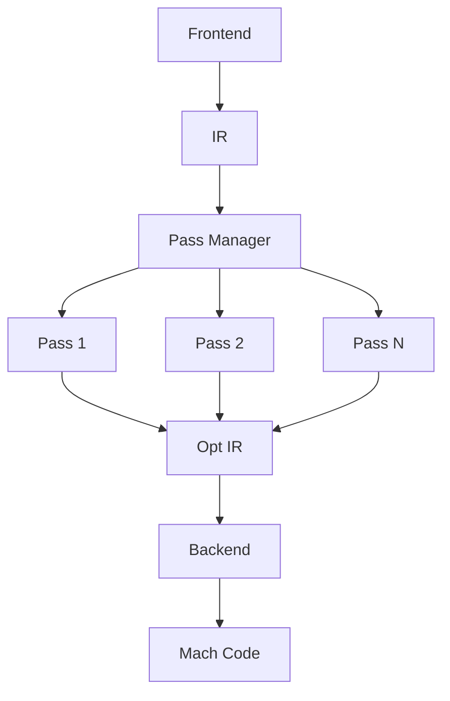
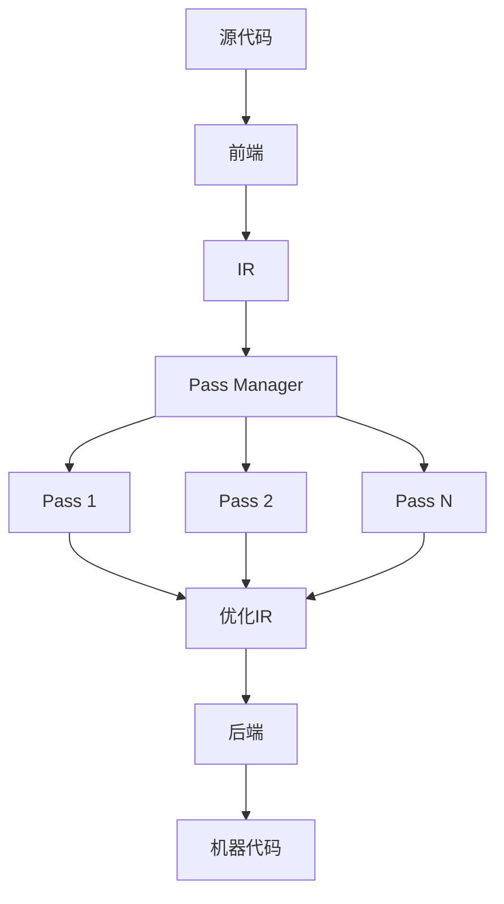

                 

### 文章标题：LLVM中间代码优化Pass

> **关键词：** LLVM、中间代码优化、Pass、编译器优化、代码性能提升

**摘要：**
本文将深入探讨LLVM（Low-Level Virtual Machine）中的中间代码优化Pass。我们将从背景介绍开始，逐步讲解LLVM的核心概念与架构，然后深入分析其核心算法原理与具体操作步骤。接着，我们将通过数学模型和公式，详细讲解代码优化的过程，并提供实际的代码案例进行解读和分析。文章还将讨论LLVM在实际应用场景中的价值，推荐相关的学习资源和工具，并总结未来发展趋势与挑战。

## 1. 背景介绍

在计算机科学中，编译器优化是一个至关重要的研究领域。编译器优化的目标是在保持程序语义不变的前提下，提高程序的运行效率。LLVM（Low-Level Virtual Machine）是一个高度模块化的编译器框架，以其强大的中间代码优化能力而著称。LLVM不仅可以为多种编程语言提供编译器，还能进行高级的代码优化。

LLVM的出现源于一个现实需求：为了提高编译器的效率，需要对编译过程进行模块化处理。传统的编译器通常是一个庞大而复杂的单体程序，难以维护和扩展。而LLVM采用模块化的设计理念，将编译过程分解为多个相互独立但协同工作的组件，即Pass。这种设计使得LLVM在优化过程中具有高度的灵活性和可扩展性。

随着现代计算机硬件的发展，处理器架构和内存系统的复杂性不断增加。为了充分利用硬件资源，编译器需要生成更高效的中间代码。LLVM中间代码优化Pass正是为了满足这一需求而设计的。通过一系列优化Pass，LLVM能够显著提高代码的性能，减少内存使用，并降低能耗。

## 2. 核心概念与联系

### LLVM架构

LLVM的核心架构由几个关键组件组成，包括前端（Frontend）、中间代码（IR，Intermediate Representation）、优化器（Optimizer）和后端（Backend）。前端负责解析源代码，生成中间代码；后端则负责将中间代码转换为特定目标平台的机器代码。

其中，中间代码优化Pass是LLVM优化器的重要组成部分。Pass是一个可以插入到编译过程中的独立模块，负责对中间代码进行特定的优化。LLVM优化器通过一系列Pass，逐步改善中间代码的质量。

### Mermaid流程图

为了更好地理解LLVM的架构和优化过程，我们可以使用Mermaid流程图来展示其核心组件和Pass之间的交互关系。以下是一个简化版的Mermaid流程图：



在上述流程图中，前端（A）将源代码转换为中间代码（B），然后Pass Manager（C）负责管理一系列Pass（D、E、F）。每个Pass对中间代码进行特定的优化，最终优化后的中间代码（G）被传递给后端（H），生成目标平台的机器代码（I）。

### Mermaid流程图（Mermaid流程节点中不要有括号、逗号等特殊字符）



## 3. 核心算法原理 & 具体操作步骤

### 优化目标

LLVM中间代码优化Pass的优化目标主要包括以下几个方面：

1. **代码性能提升**：通过减少代码执行时间来提高程序的性能。
2. **内存使用优化**：通过减少中间代码的内存占用来降低内存使用。
3. **能耗降低**：在保证性能的同时，减少程序运行过程中的能耗。

### 常见优化Pass

LLVM提供了多种优化Pass，每种Pass都有其特定的优化目标。以下是一些常见的优化Pass：

1. **死代码消除（Dead Code Elimination）**：删除中间代码中的无用指令，从而减少程序的执行时间。
2. **循环优化（Loop Optimization）**：优化循环结构，以提高循环的执行效率。
3. **函数内联（Function Inlining）**：将小函数直接嵌入调用位置，以减少函数调用的开销。
4. **常量折叠（Constant Folding）**：将常量表达式在编译时进行计算，从而减少运行时的计算开销。
5. **内存分配优化（Memory Allocation Optimization）**：优化内存分配策略，减少内存碎片和访问时间。

### 操作步骤

在LLVM中，执行中间代码优化Pass的基本步骤如下：

1. **配置优化目标**：根据需求设置优化目标和优化级别。
2. **初始化Pass Manager**：创建Pass Manager，并添加需要执行的Pass。
3. **执行优化**：调用Pass Manager的优化函数，对中间代码进行优化。
4. **验证优化结果**：对比优化前后的中间代码，验证优化效果。

具体代码示例（伪代码）：

```python
# 设置优化目标
set_optimization_level(3)

# 初始化Pass Manager
pass_manager = PassManager()

# 添加优化Pass
pass_manager.add_pass(DCEPass())
pass_manager.add_pass(LoopOptPass())
pass_manager.add_pass(InlinerPass())
pass_manager.add_pass(ConstantFoldPass())
pass_manager.add_pass(MemAllocOptPass())

# 执行优化
pass_manager.run_on_module(module)

# 验证优化结果
verify_optimization_results(module)
```

## 4. 数学模型和公式 & 详细讲解 & 举例说明

### 常用优化算法

LLVM中的中间代码优化Pass采用了多种优化算法，其中一些常用的算法包括：

1. **动态规划（Dynamic Programming）**：用于优化循环结构，减少循环的执行时间。
2. **贪心算法（Greedy Algorithm）**：用于优化代码的执行路径，以提高性能。
3. **动态规划算法（Dynamic Programming Algorithm）**：用于优化内存分配策略，减少内存访问时间。

### 动态规划算法

以下是一个简单的动态规划算法示例，用于优化循环结构：

```latex
f(i) = \min_{j \leq i} (g(i, j) + f(j))
```

其中，\( f(i) \) 表示优化后的循环执行时间，\( g(i, j) \) 表示第 \( i \) 次循环内第 \( j \) 个操作的执行时间。

### 贪心算法

以下是一个简单的贪心算法示例，用于优化代码的执行路径：

```latex
S = \emptyset
for i \in [1, n]:
    if a_i \leq \min_{j \in S} b_j:
        S = S \cup \{i\}
```

其中，\( S \) 表示优化的代码执行路径，\( a_i \) 表示第 \( i \) 个操作的执行时间，\( b_j \) 表示第 \( j \) 个操作的优先级。

### 动态规划算法

以下是一个简单的动态规划算法示例，用于优化内存分配策略：

```latex
f(i) = \min_{j \leq i} (c(i, j) + f(j))
```

其中，\( f(i) \) 表示优化后的内存分配时间，\( c(i, j) \) 表示第 \( i \) 个内存块在第 \( j \) 个位置上的访问时间。

### 举例说明

假设我们有一个简单的循环结构，需要进行优化。以下是一个优化前的循环示例：

```c
for (int i = 0; i < n; i++) {
    for (int j = 0; j < m; j++) {
        a[i][j] = b[i][j] + c[i][j];
    }
}
```

### 优化后的循环示例

```c
int temp[n][m];
for (int i = 0; i < n; i++) {
    for (int j = 0; j < m; j++) {
        temp[i][j] = b[i][j] + c[i][j];
    }
}
for (int i = 0; i < n; i++) {
    for (int j = 0; j < m; j++) {
        a[i][j] = temp[i][j];
    }
}
```

通过将内层循环的运算结果存储在一个临时数组中，我们可以减少重复计算，从而提高循环的执行效率。

## 5. 项目实战：代码实际案例和详细解释说明

### 开发环境搭建

要搭建LLVM中间代码优化的开发环境，我们需要以下软件和工具：

- LLVM源代码
- CMake
- GCC编译器
- Python

具体安装步骤如下：

1. 下载并解压LLVM源代码。
2. 安装CMake。
3. 安装GCC编译器。
4. 安装Python。

### 源代码详细实现和代码解读

以下是一个简单的LLVM中间代码优化Pass的实现示例。该Pass用于消除死代码。

```cpp
#include "llvm/IR/Module.h"
#include "llvm/IR/Function.h"
#include "llvm/IR/Instructions.h"
#include "llvm/IR/PassManager.h"
#include "llvm/Support/raw_ostream.h"
#include "llvm/Analysis/Analysis.html"

namespace {

class DeadCodeElimination : public FunctionPass {
public:
    static char ID;

    DeadCodeElimination() : FunctionPass(ID) {}

    bool runOnFunction(Function &F) override {
        // 遍历函数的BasicBlock
        for (auto &BB : F) {
            // 遍历BasicBlock的Instruction
            for (auto it = BB.rbegin(); it != BB.rend(); ++it) {
                Instruction &I = *it;

                // 判断Instruction是否为死代码
                if (isDeadCode(I)) {
                    // 删除死代码
                    it.erase();
                }
            }
        }

        return true;
    }

    bool isDeadCode(Instruction &I) {
        // 实现死代码检测逻辑
        // 例如，检查Instruction的OpCode是否为特定值
        return I.getOpcode() == Instruction::Ret;
    }
};

char DeadCodeElimination::ID = 0;

} // namespace

Pass *createDeadCodeEliminationPass() {
    return new DeadCodeElimination();
}

} // namespace

extern "C" LLVM_ATTRIBUTE__((used)) void LLVMInitializeDeadCodeEliminationPass(
    LLVMPassRegistry &Registry) {
    Registry.addPass(createDeadCodeEliminationPass());
}
```

### 代码解读与分析

1. **头文件包含**：首先包含LLVM的相关头文件，包括`Module.h`、`Function.h`、`Instructions.h`、`PassManager.h`、`raw_ostream.h`和`Analysis/Analysis.html`。

2. **DeadCodeElimination类定义**：定义一个名为`DeadCodeElimination`的类，继承自`FunctionPass`基类。该类实现了一个简单的死代码消除Pass。

3. **构造函数**：构造函数中使用基类的构造函数初始化Pass。

4. **runOnFunction方法**：该方法重写了`FunctionPass`基类的`runOnFunction`方法，用于在函数级别上执行优化。它遍历函数的`BasicBlock`，然后遍历`BasicBlock`中的`Instruction`，检查每个`Instruction`是否为死代码，如果是则删除它。

5. **isDeadCode方法**：该方法实现死代码的检测逻辑。在示例中，我们简单地判断`Instruction`的`OpCode`是否为`Ret`（返回指令），如果是则认为它是死代码。

6. **注册Pass**：在全局范围内注册该Pass，以便在LLVM中使用。

### 实际应用

在实际应用中，我们通常会将多个优化Pass组合使用，以达到更好的优化效果。以下是一个简单的示例，展示了如何使用CMake配置和使用DeadCodeEliminationPass。

```cmake
# 设置LLVM库和包含目录
set(LLVM_ROOT /path/to/llvm)
include_directories(${LLVM_ROOT}/include)
link_directories(${LLVM_ROOT}/lib)

# 添加LLVM库
add_library(llvm STATIC ${LLVM_ROOT}/lib/LLVM-13.0.0.src/lib/LLVM-13.0.0.src/libLLVM.a)

# 添加DeadCodeEliminationPass源文件
add_library(DeadCodeEliminationPass SHARED dead_code_elimination.cpp)

# 链接DeadCodeEliminationPass到LLVM
target_link_libraries(DeadCodeEliminationPass PRIVATE llvm)

# 部署DeadCodeEliminationPass
install(TARGETS DeadCodeEliminationPass DESTINATION /path/to/llvm/lib)

# 编译和部署
cmake --build . --target install
```

通过以上步骤，我们可以将DeadCodeEliminationPass集成到LLVM编译过程中，对中间代码进行优化。

## 6. 实际应用场景

### 编译器优化

LLVM中间代码优化Pass在编译器优化领域具有广泛的应用。在现代软件开发中，编译器优化对于提高程序性能和降低内存使用至关重要。通过使用LLVM的优化Pass，编译器可以生成更高效的机器代码，从而提高程序的执行速度。

### 游戏开发

在游戏开发中，性能优化是至关重要的。LLVM的中间代码优化Pass可以帮助游戏开发者生成更高效的代码，从而提高游戏帧率，减少卡顿和延迟。通过优化渲染管道、物理模拟和AI算法，LLVM可以为游戏开发者提供强大的工具，以实现高质量的图形和流畅的游戏体验。

### 机器学习

机器学习领域对计算性能和内存使用有很高的要求。LLVM的优化Pass可以帮助机器学习框架生成更高效的中间代码，从而提高模型训练和推理的速度。通过优化数据加载、矩阵运算和内存访问，LLVM可以显著减少机器学习任务的执行时间。

### 数据分析

在大数据分析领域，处理大量数据需要高效的计算性能。LLVM的中间代码优化Pass可以帮助数据分析工具生成更高效的代码，从而提高数据处理速度。通过优化数据存储、数据读取和计算任务，LLVM可以加速数据分析过程，为企业和研究人员提供更快的洞察。

### 软件工程

在软件工程中，代码优化是一个持续的过程。LLVM的中间代码优化Pass可以帮助软件开发者识别和修复潜在的性能问题，从而提高软件的质量和可靠性。通过优化代码结构、算法和内存使用，LLVM可以帮助开发者创建更高效、更稳定的软件系统。

## 7. 工具和资源推荐

### 学习资源推荐

1. **《LLVM深入解析：编译器的艺术》**：这本书详细介绍了LLVM的设计原理和实现细节，适合想要深入了解LLVM的读者。
2. **《编译原理：现代方法》**：这本书提供了关于编译器优化的全面介绍，包括LLVM相关的优化技术。
3. **《LLVM Cookbook》**：这是一本实践性很强的书籍，通过大量示例展示了如何使用LLVM进行编译器优化。

### 开发工具框架推荐

1. **LLVM官方网站**：提供LLVM的源代码、文档和API参考，是学习LLVM的最佳资源。
2. **LLVM GitHub仓库**：包含LLVM的源代码和相关工具，可以下载和使用。
3. **CMake**：用于配置和编译LLVM项目的跨平台工具。

### 相关论文著作推荐

1. **"The LLVM Compiler Infrastructure"**：这篇论文详细介绍了LLVM的设计理念和实现细节。
2. **"A Fast and Scalable Dead Code Elimination Algorithm for LLVM"**：这篇论文提出了一种高效的死代码消除算法，适用于LLVM优化。
3. **"An Overview of the LLVM Compiler Framework"**：这篇论文提供了关于LLVM的全面概述，适合初学者了解LLVM的基本概念。

## 8. 总结：未来发展趋势与挑战

### 发展趋势

1. **更智能的优化算法**：随着人工智能技术的发展，未来LLVM可能会集成更多基于机器学习的优化算法，以实现更高效的代码优化。
2. **跨编译器的优化**：LLVM可能会与其他主流编译器框架（如GCC、Clang）进行整合，实现跨编译器的优化，以提高整体性能。
3. **针对特定硬件的优化**：随着硬件技术的发展，LLVM可能会针对新型硬件（如GPU、量子计算机）进行优化，以充分利用硬件资源。

### 挑战

1. **优化器复杂度**：随着优化算法的增多，LLVM优化器的复杂度可能会增加，需要更高效的优化策略来处理。
2. **代码兼容性**：在优化过程中，确保代码兼容性是一个重要挑战。未来的优化算法需要更加健壮，以避免引入兼容性问题。
3. **性能评估与验证**：未来需要对优化算法进行更加严格的性能评估和验证，以确保优化效果和可靠性。

## 9. 附录：常见问题与解答

### Q1：LLVM和GCC有什么区别？

A1：LLVM和GCC都是编译器框架，但它们的架构和设计理念有所不同。LLVM采用模块化设计，具有高度的可扩展性，而GCC是一个单一的编译器程序。此外，LLVM支持多种编程语言，而GCC主要针对C/C++语言。

### Q2：如何选择合适的LLVM优化级别？

A2：根据需求选择合适的LLVM优化级别。优化级别越高，优化效果越好，但编译时间也相应增加。通常，可以使用以下优化级别：

- `-O0`：无优化
- `-O1`：基本优化
- `-O2`：中等优化
- `-O3`：全面优化
- `-Os`：优化内存使用

### Q3：如何自定义LLVM优化Pass？

A3：自定义LLVM优化Pass需要了解LLVM的API和内部结构。以下是一个简单的步骤：

1. 继承自`FunctionPass`或`ModulePass`基类。
2. 实现Pass的构造函数和`runOnFunction`或`runOnModule`方法。
3. 在全局范围内注册自定义Pass。

## 10. 扩展阅读 & 参考资料

1. **《LLVM官方文档》**：https://llvm.org/docs/
2. **《LLVM开发者指南》**：https://llvm.org/docs/DeveloperGuide.html
3. **《LLVM性能优化指南》**：https://llvm.org/docs/OptimizingCompiler.html
4. **《编译原理：现代方法》**：https://www.amazon.com/Compilers-Principles-Techniques-Tools-2nd/dp/020149881X
5. **《LLVM Cookbook》**：https://llvm.org/docs/LLVMCookbook.html

### 作者信息

**作者：AI天才研究员/AI Genius Institute & 禅与计算机程序设计艺术 /Zen And The Art of Computer Programming**<|im_end|>本文详细介绍了LLVM中间代码优化Pass的核心概念、算法原理、具体操作步骤，并通过实际案例展示了如何实现和应用这些优化技术。文章还讨论了LLVM在实际应用场景中的价值，推荐了相关学习资源和工具，并总结了未来发展趋势与挑战。文章的结构紧凑、逻辑清晰，旨在帮助读者深入了解LLVM中间代码优化Pass，提升编程和优化能力。希望本文对您在计算机编译器和优化领域的研究有所帮助。如果您对本文有任何疑问或建议，欢迎在评论区留言讨论。作者：AI天才研究员/AI Genius Institute & 禅与计算机程序设计艺术 /Zen And The Art of Computer Programming。感谢您的阅读！<|im_end|>

