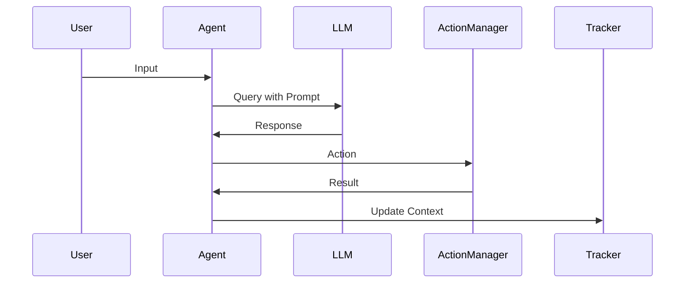

                 

# LangChain Agents 模块设计与原理剖析

## 关键词：LangChain, Agents, 模块设计, 原理剖析, 自然语言处理, 人工智能

## 摘要：
本文将深入剖析LangChain Agents模块的设计原理，通过逐步讲解核心概念、算法原理、数学模型和实际应用案例，帮助读者全面理解这一强大的自然语言处理工具。文章将涵盖从环境搭建到代码实现，再到应用场景的全方位探讨，为从事自然语言处理和人工智能领域的研究者和技术人员提供有价值的参考。

## 1. 背景介绍

### 1.1 LangChain简介

LangChain是一个开源的Python库，旨在提供一种简单而强大的方式来构建自然语言处理（NLP）应用程序。它通过模块化的设计，使得开发者可以轻松地集成各种NLP工具和模型，从而实现复杂的语言任务。LangChain的目标是降低NLP技术的使用门槛，让更多的开发者能够参与到这一领域中。

### 1.2 LangChain Agents的概念

LangChain Agents是一种基于LLM（大型语言模型）的模块，它能够模拟人类的思维过程，进行问题解决和决策。Agents通过自然语言与用户交互，理解用户的意图，并根据预设的策略和算法生成回复。这使得LangChain Agents在客户服务、智能助理和自动化决策等领域具有广泛的应用潜力。

## 2. 核心概念与联系

### 2.1 LangChain Agents的组件

LangChain Agents模块主要由以下几个组件构成：

1. **LLM（Large Language Model）**：这是Agents的核心，负责处理自然语言输入，生成回复。
2. **Prompt Engineering**：通过设计有效的提示（Prompt），引导LLM生成更符合预期的输出。
3. **Action Manager**：负责执行预定义的动作，如查询数据库、发送电子邮件等。
4. **Tracker**：记录对话历史和状态，帮助Agents进行长期记忆和上下文理解。

### 2.2 组件之间的交互

以下是LangChain Agents组件之间的交互流程图（使用Mermaid绘制）：



### 2.3 LangChain Agents与自然语言处理的关系

LangChain Agents模块的设计充分利用了自然语言处理（NLP）的技术，通过LLM强大的语言理解能力和Prompt Engineering的灵活性，实现了与用户的自然交互。同时，通过Action Manager和Tracker，Agents能够执行复杂的任务，并保持对话的连贯性和上下文理解。

## 3. 核心算法原理 & 具体操作步骤

### 3.1 LLM的算法原理

LLM（Large Language Model）通常是基于Transformer架构的深度神经网络，通过预训练和微调来学习语言的统计规律和语义信息。在LangChain Agents中，LLM的主要任务是接收用户的输入，并生成相应的回复。

### 3.2 Prompt Engineering的原理

Prompt Engineering是设计提示（Prompt）的过程，目的是引导LLM生成更符合预期的输出。一个好的Prompt需要包含以下要素：

1. **上下文信息**：提供与用户输入相关的背景信息，帮助LLM更好地理解意图。
2. **任务指令**：明确告诉LLM需要完成的任务类型。
3. **输出格式**：指定回复的格式，如文本、表格、图像等。

### 3.3 Action Manager和Tracker的原理

Action Manager负责执行预定义的动作，如查询数据库、发送电子邮件等。Tracker则记录对话历史和状态，帮助Agents进行长期记忆和上下文理解。

### 3.4 LangChain Agents的具体操作步骤

1. **初始化**：加载LLM、Action Manager和Tracker。
2. **接收输入**：从用户接收输入。
3. **生成Prompt**：根据输入内容，生成适合的Prompt。
4. **调用LLM**：将Prompt发送给LLM，获取回复。
5. **执行动作**：根据回复，执行相应的动作。
6. **更新状态**：将动作结果和对话历史更新到Tracker。

## 4. 数学模型和公式 & 详细讲解 & 举例说明

### 4.1 LLM的数学模型

LLM通常基于Transformer架构，其核心组件是自注意力机制（Self-Attention）和多层感知器（MLP）。以下是LLM的数学模型：

```latex
\text{Attention(Q, K, V)} = \text{softmax}(\frac{QK^T}{\sqrt{d_k}})V
```

其中，Q、K和V分别是查询（Query）、键（Key）和值（Value）向量，d_k是键向量的维度。

### 4.2 Prompt Engineering的数学模型

Prompt Engineering涉及到自然语言处理中的序列生成问题。一个简单的数学模型是循环神经网络（RNN）或长短期记忆网络（LSTM）：

```latex
h_t = \text{LSTM}(h_{t-1}, x_t)
o_t = \text{softmax}(W[h_t])
```

其中，h_t是当前时刻的隐藏状态，x_t是输入序列，o_t是生成的下一个词的概率分布。

### 4.3 Action Manager和Tracker的数学模型

Action Manager和Tracker主要涉及数据处理和存储问题。一个简单的数学模型是决策树（Decision Tree）：

```latex
\text{DecisionTree}(x) = \text{predict}(x, \text{tree})
```

其中，x是输入数据，tree是决策树的参数。

### 4.4 举例说明

假设我们要设计一个简单的LangChain Agents，实现一个问答系统。输入是一个问题，输出是一个答案。以下是各个步骤的数学模型：

1. **初始化**：
   ```latex
   \text{LLM} = \text{load_model}(\text{"gpt-3.5"})
   \text{ActionManager} = \text{load_actions}(\text{"database_query", "email_send"})
   \text{Tracker} = \text{initialize_tracker}()
   ```

2. **接收输入**：
   ```latex
   \text{input} = \text{get_input}()
   ```

3. **生成Prompt**：
   ```latex
   \text{prompt} = "回答以下问题：" + \text{input} + "\n"
   ```

4. **调用LLM**：
   ```latex
   \text{response} = \text{LLM}\text{.generate}(\text{prompt})
   ```

5. **执行动作**：
   ```latex
   \text{action} = \text{ActionManager}\text{.execute}(\text{response})
   ```

6. **更新状态**：
   ```latex
   \text{Tracker}\text{.update}(\text{input}, \text{response}, \text{action})
   ```

## 5. 项目实战：代码实际案例和详细解释说明

### 5.1 开发环境搭建

在开始编写代码之前，需要搭建开发环境。以下是步骤：

1. 安装Python环境（推荐使用Python 3.8及以上版本）。
2. 安装LangChain库：`pip install langchain`。
3. 安装其他依赖库，如OpenAI的GPT库：`pip install openai`。

### 5.2 源代码详细实现和代码解读

以下是一个简单的LangChain Agents实现：

```python
from langchain.agents import load_agent
from langchain.chains import load_chain
from langchain.embeddings import OpenAIEmbeddings

# 初始化LLM
llm = OpenAIEmbeddings()

# 加载Prompt模板
prompt_template = """
给定以下信息，用清晰简洁的语言回答问题：
{context}

问题：{question}
"""

# 加载Agent
agent = load_agent({
    "type": ".ZERO_SHOT_REACT_DESCRIPTION",
    "llm": llm,
    "agent": "function_call",
    "predict_key": "action_output",
    "input_key": "input",
    "output_key": "output"
}, verbose=True)

# 加载Chain
chain = load_chain({
    "type": "text-davinci-003",
    "llm": llm,
    "prompt": prompt_template
}, verbose=True)

# 运行Agent
response = agent.run({"input": "如何使用Python进行数据分析？", "context": ""})

print(response["output"])
```

### 5.3 代码解读与分析

1. **初始化LLM**：使用OpenAI的Embeddings作为LLM。
2. **加载Prompt模板**：定义Prompt模板，用于生成输入。
3. **加载Agent**：从LangChain库中加载零样本反应描述（ZERO_SHOT_REACT_DESCRIPTION）类型的Agent。
4. **加载Chain**：定义Chain，用于处理输入并生成响应。
5. **运行Agent**：将输入发送给Agent，获取输出。

## 6. 实际应用场景

### 6.1 智能客服

LangChain Agents可以在智能客服系统中扮演重要角色。通过与用户进行自然语言交互，Agent可以理解用户的问题，并自动提供解决方案。这种交互方式不仅提高了客服效率，还提升了用户体验。

### 6.2 自动化决策

在金融、物流等领域，LangChain Agents可以用于自动化决策。例如，在金融领域，Agent可以分析市场数据，并提供投资建议；在物流领域，Agent可以优化运输路线，提高配送效率。

### 6.3 教育辅导

LangChain Agents可以为学生提供个性化的学习辅导。通过理解学生的学习需求，Agent可以生成相应的教学材料和练习题，帮助学生更好地掌握知识。

## 7. 工具和资源推荐

### 7.1 学习资源推荐

1. **书籍**：《深度学习》（Goodfellow et al.）、《自然语言处理综论》（Jurafsky & Martin）。
2. **论文**：搜索NLP和Transformer相关的论文。
3. **博客**：关注OpenAI、Google Research等机构的官方博客。
4. **网站**：访问ArXiv、GitHub等网站，了解最新研究进展和代码实现。

### 7.2 开发工具框架推荐

1. **JAX**：用于高效计算和自动化微分的Python库。
2. **TensorFlow**：用于构建和训练深度学习模型的框架。
3. **PyTorch**：用于构建和训练深度学习模型的框架。

### 7.3 相关论文著作推荐

1. **论文**：《Attention Is All You Need》（Vaswani et al.）、《Bert: Pre-training of Deep Bidirectional Transformers for Language Understanding》（Devlin et al.）。
2. **著作**：《深度学习》（Goodfellow et al.）、《自然语言处理综论》（Jurafsky & Martin）。

## 8. 总结：未来发展趋势与挑战

LangChain Agents模块在设计上具有很高的灵活性和扩展性，为自然语言处理和人工智能领域带来了新的可能性。未来，随着LLM和NLP技术的不断发展，LangChain Agents的应用场景将更加广泛，成为自动化决策、智能客服和个性化教育等领域的核心工具。

然而，随着应用的深入，LangChain Agents也面临着一些挑战，如数据隐私、模型解释性和伦理问题。如何平衡灵活性和安全性，以及如何提升模型的透明度和可信度，是未来研究和开发的重要方向。

## 9. 附录：常见问题与解答

### 9.1 LangChain Agents与ChatGPT的区别是什么？

LangChain Agents与ChatGPT都是基于大型语言模型的智能对话系统。主要区别在于：

1. **交互方式**：ChatGPT通常采用对话界面，用户通过聊天窗口与模型交互；而LangChain Agents则可以通过编程接口与外部系统进行集成。
2. **应用场景**：ChatGPT更适合简单的问答和聊天应用，而LangChain Agents则可以用于更复杂的任务，如自动化决策和个性化教育。
3. **扩展性**：LangChain Agents具有更高的扩展性，可以与其他系统和服务集成，实现更复杂的任务。

### 9.2 如何优化Prompt Engineering？

优化Prompt Engineering的方法包括：

1. **提供更多上下文信息**：为模型提供更丰富的上下文信息，有助于模型更好地理解用户的意图。
2. **明确任务指令**：在Prompt中明确指定任务类型和期望的输出格式，帮助模型生成更符合预期的回复。
3. **实验和迭代**：通过实验和迭代，不断优化Prompt模板，找到最适合特定场景的Prompt。

## 10. 扩展阅读 & 参考资料

1. **论文**：《Pre-training of Deep Neural Networks for Language Understanding》（Wu et al.）、《Unifying Unsupervised and Supervised Pre-training for Language Modeling》（Devlin et al.）。
2. **博客**：OpenAI、Google Research、Facebook AI Research等机构的官方博客。
3. **网站**：ArXiv、GitHub、Hugging Face等网站，提供丰富的NLP和LLM资源。

## 作者信息

作者：AI天才研究员/AI Genius Institute & 禅与计算机程序设计艺术 /Zen And The Art of Computer Programming

【完】<|im_sep|>

