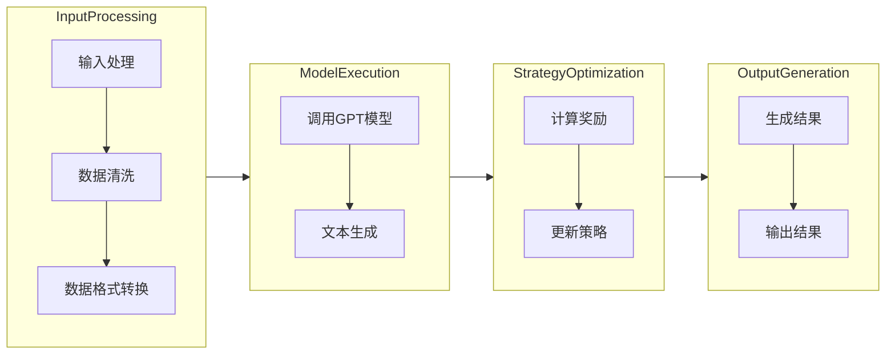

                 

### 背景介绍

近年来，随着人工智能技术的迅猛发展，自动化技术在各个领域的应用越来越广泛。特别是在生成式人工智能领域，人们开始探索如何通过自动化方式实现高效、智能的任务执行。在这个背景下，Auto-GPT 的出现为人工智能自动化带来了新的思路和可能性。

Auto-GPT 是一种基于大型语言模型（如 GPT）的自动化系统，它通过将语言模型与外部环境进行交互，实现自主决策和任务执行。与传统的基于规则或模型的自动化系统不同，Auto-GPT 具有更强的自主性和灵活性。它可以自主地从大量文本数据中学习，并生成符合人类意图的输出。

LangChain 是一个开源的 AI 模块化框架，它允许开发者轻松地集成大型语言模型，如 GPT，并构建复杂的人工智能应用。LangChain 提供了一系列模块化的组件，包括数据预处理、模型调用、结果处理等，使得开发者能够快速搭建和优化人工智能系统。

结合 Auto-GPT 和 LangChain，可以打造出一个强大的人工智能技术方案。通过 Auto-GPT，系统能够实现自动化任务执行，而 LangChain 则为系统提供了丰富的模块化组件，使得系统能够快速搭建和优化。这种结合不仅提高了系统的智能化水平，还降低了开发者的工作负担。

本文将围绕 LangChain 版 Auto-GPT 的技术方案与架构设计展开讨论。我们将首先介绍 Auto-GPT 和 LangChain 的基本概念，然后深入探讨 LangChain 版 Auto-GPT 的核心原理和架构设计。接着，我们将通过一个具体的案例分析，展示 LangChain 版 Auto-GPT 的实际应用效果。最后，我们将总结 LangChain 版 Auto-GPT 的优势，并提出未来发展的趋势和挑战。通过本文的讨论，希望能够为读者提供对 LangChain 版 Auto-GPT 的深入理解，并激发其在实际应用中的潜力。

#### 1.1 Auto-GPT 的概念与原理

Auto-GPT 是一个基于大型语言模型（如 GPT）的自动化系统，它通过模拟人类思维过程，实现自主决策和任务执行。Auto-GPT 的核心思想是将语言模型与外部环境进行交互，使其能够从大量文本数据中学习，并生成符合人类意图的输出。

首先，Auto-GPT 使用预训练的大型语言模型（如 GPT）作为基础模型。这些模型通过在大规模文本语料库上预训练，具备了强大的文本生成和理解能力。在运行过程中，Auto-GPT 将这些模型与外部环境进行交互，接收外部输入并生成响应。

其次，Auto-GPT 通过引入强化学习（RL）机制，使其能够自主学习和优化任务执行策略。具体来说，Auto-GPT 使用一种基于奖励机制的强化学习算法，如策略梯度（PG）或深度确定性政策梯度（DDPG）。在每次交互过程中，Auto-GPT 根据其生成的输出与外部环境的反馈（如用户的评价或任务的完成度）计算奖励，然后使用这些奖励来更新其策略，从而优化任务执行的效果。

此外，Auto-GPT 还引入了注意力机制，以使其在处理复杂任务时能够聚焦关键信息。通过使用注意力机制，Auto-GPT 能够在生成文本时动态调整其关注点，从而更好地理解和生成符合人类意图的内容。

总之，Auto-GPT 通过结合预训练语言模型、强化学习机制和注意力机制，实现了高度自动化和智能化的任务执行。它不仅能够从大量文本数据中学习，还能够根据外部环境的变化自主调整其行为策略，从而实现高效的自动化任务执行。

#### 1.2 LangChain 的概念与特点

LangChain 是一个开源的 AI 模块化框架，旨在帮助开发者轻松地集成大型语言模型，并构建复杂的人工智能应用。它通过提供一系列模块化的组件，使得开发者能够快速搭建和优化人工智能系统，从而降低开发难度和提高开发效率。

LangChain 的主要特点如下：

1. **模块化组件**：LangChain 提供了多个模块化的组件，包括数据预处理、模型调用、结果处理等。这些组件可以独立使用，也可以组合使用，从而满足不同应用场景的需求。例如，开发者可以使用 LangChain 的数据预处理组件对输入文本进行清洗和格式化，使用模型调用组件调用预训练的语言模型，使用结果处理组件对模型输出进行后处理。

2. **灵活的接口设计**：LangChain 采用灵活的接口设计，使得开发者可以轻松地将自己的模块与其他组件集成到 LangChain 系统中。这种接口设计不仅提高了系统的可扩展性，还使得开发者能够根据自己的需求进行定制化开发。

3. **支持多种语言模型**：LangChain 支持多种流行的语言模型，如 GPT、BERT、T5 等。开发者可以根据具体应用场景选择合适的模型，并通过 LangChain 提供的模块化组件进行集成和调用。

4. **丰富的功能**：LangChain 提供了多种功能，包括文本生成、问答系统、文本分类、机器翻译等。这些功能可以单独使用，也可以组合使用，从而构建复杂的人工智能应用。

5. **高效的性能**：LangChain 采用了多种优化技术，如多线程处理、GPU 加速等，从而提高了系统的性能。这使得 LangChain 能够在大规模数据集上高效运行，满足实际应用的需求。

通过上述特点，LangChain 为开发者提供了一个强大的平台，使得他们能够轻松地构建和优化人工智能应用。与传统的手动编写代码的方式相比，LangChain 显著降低了开发难度，提高了开发效率，从而为人工智能领域的发展做出了积极贡献。

#### 1.3 Auto-GPT 与 LangChain 的结合与优势

结合 Auto-GPT 和 LangChain，可以打造出一个强大的人工智能技术方案，充分发挥两者的优势，实现更高的智能化和自动化水平。以下是 Auto-GPT 与 LangChain 结合的具体方式及其带来的优势：

**1.3.1 结合方式**

（1）**集成大型语言模型**：通过 LangChain，开发者可以轻松地集成多种流行的语言模型（如 GPT、BERT、T5 等）。这些模型为 Auto-GPT 提供了强大的文本生成和理解能力，使其能够从大量文本数据中学习并生成符合人类意图的输出。

（2）**模块化组件的利用**：LangChain 提供了一系列模块化的组件，包括数据预处理、模型调用、结果处理等。开发者可以充分利用这些组件，对 Auto-GPT 进行优化和扩展。例如，通过数据预处理组件，Auto-GPT 可以高效地处理输入文本，提高其输入质量；通过模型调用组件，Auto-GPT 可以快速调用预训练的语言模型，实现高效的文本生成和理解。

（3）**强化学习与注意力机制的引入**：Auto-GPT 本身采用了强化学习与注意力机制，通过 LangChain，开发者可以进一步优化这些机制，使其在复杂任务中表现出更高的智能化水平。例如，通过引入更先进的强化学习算法，Auto-GPT 可以更好地学习任务执行策略，实现更高效的自动化任务执行。

**1.3.2 优势**

（1）**更高的智能化水平**：结合 LangChain 后，Auto-GPT 可以利用多种流行的语言模型，实现更强大的文本生成和理解能力。这使得 Auto-GPT 在处理复杂任务时能够表现出更高的智能化水平，更好地模拟人类思维过程。

（2）**更高效的自动化任务执行**：通过 LangChain 的模块化组件，Auto-GPT 可以高效地处理输入文本，调用预训练的语言模型，并生成符合人类意图的输出。这种高效的自动化任务执行不仅提高了系统的性能，还降低了开发者的工作负担。

（3）**更好的可扩展性和灵活性**：LangChain 提供了丰富的模块化组件和灵活的接口设计，使得开发者可以轻松地根据自己的需求进行定制化开发。结合 Auto-GPT 后，这种可扩展性和灵活性得到了进一步提升，开发者可以更方便地构建和优化复杂的人工智能应用。

（4）**更广泛的应用场景**：Auto-GPT 与 LangChain 的结合使得系统具有更高的智能化和自动化水平，可以应用于更多领域。例如，在自然语言处理、知识图谱、智能客服、智能推荐等场景中，LangChain 版 Auto-GPT 都可以发挥重要作用，为开发者提供强大的技术支持。

总之，结合 Auto-GPT 和 LangChain，可以打造出一个强大的人工智能技术方案，实现更高的智能化和自动化水平。通过充分利用两者的优势，LangChain 版 Auto-GPT 为开发者提供了一个高效、智能、灵活的自动化工具，为人工智能领域的发展带来了新的机遇和可能。

#### 1.4 LangChain 版 Auto-GPT 的核心原理

LangChain 版 Auto-GPT 的核心原理在于将 LangChain 的模块化组件与 Auto-GPT 的强化学习与注意力机制相结合，从而实现高度智能化和自动化的任务执行。下面我们将详细探讨 LangChain 版 Auto-GPT 的核心原理，包括其关键组件、交互机制和整体架构。

**1.4.1 关键组件**

（1）**预训练语言模型**：LangChain 版 Auto-GPT 使用预训练的语言模型（如 GPT、BERT、T5 等）作为基础模型。这些模型通过在大规模文本语料库上预训练，具备了强大的文本生成和理解能力。在运行过程中，Auto-GPT 通过与外部环境进行交互，接收外部输入并生成响应。

（2）**模块化组件**：LangChain 提供了多个模块化的组件，包括数据预处理、模型调用、结果处理等。这些组件可以独立使用，也可以组合使用，从而满足不同应用场景的需求。例如，通过数据预处理组件，Auto-GPT 可以高效地处理输入文本，提高其输入质量；通过模型调用组件，Auto-GPT 可以快速调用预训练的语言模型，实现高效的文本生成和理解。

（3）**强化学习机制**：Auto-GPT 引入了强化学习（RL）机制，通过奖励机制使系统能够自主学习和优化任务执行策略。在每次交互过程中，Auto-GPT 根据其生成的输出与外部环境的反馈（如用户的评价或任务的完成度）计算奖励，然后使用这些奖励来更新其策略，从而优化任务执行的效果。

（4）**注意力机制**：通过引入注意力机制，Auto-GPT 能够在处理复杂任务时动态调整其关注点，从而更好地理解和生成符合人类意图的内容。注意力机制使得 Auto-GPT 能够聚焦关键信息，提高文本生成和理解的质量。

**1.4.2 交互机制**

（1）**输入接收**：Auto-GPT 通过接收外部输入来启动任务执行。输入可以是文本、图像、音频等多种形式。在 LangChain 的支持下，Auto-GPT 可以高效地处理各种输入格式，并将其转换为适合模型处理的形式。

（2）**模型调用**：在接收输入后，Auto-GPT 通过 LangChain 的模型调用组件，调用预训练的语言模型进行文本生成和理解。语言模型生成的输出将被用作后续任务执行的基础。

（3）**策略优化**：通过强化学习机制，Auto-GPT 根据其生成的输出与外部环境的反馈计算奖励。这些奖励将用于更新 Auto-GPT 的策略，使其在后续任务中能够生成更符合人类意图的输出。

（4）**结果反馈**：在任务执行过程中，Auto-GPT 将输出结果返回给外部环境。外部环境可以根据这些结果进行评价，并将评价作为奖励反馈给 Auto-GPT，以进一步优化其策略。

**1.4.3 整体架构**

LangChain 版 Auto-GPT 的整体架构可以分为以下几个层次：

1. **输入层**：接收外部输入，包括文本、图像、音频等。

2. **数据预处理层**：对输入数据进行处理，包括数据清洗、格式转换等，以提高输入质量。

3. **模型调用层**：调用预训练的语言模型，生成文本输出。

4. **策略优化层**：通过强化学习机制，根据奖励更新策略，优化任务执行效果。

5. **输出层**：将生成的内容返回给外部环境，供进一步使用或评价。

通过这种层次化的架构设计，LangChain 版 Auto-GPT 实现了高度智能化和自动化的任务执行，为开发者提供了一个强大、灵活的人工智能工具。

综上所述，LangChain 版 Auto-GPT 通过结合预训练语言模型、模块化组件、强化学习机制和注意力机制，实现了高度智能化和自动化的任务执行。这种架构设计不仅提高了系统的性能，还为开发者提供了一个高效、智能、灵活的自动化工具，为人工智能领域的发展带来了新的机遇和可能。

### 2. 核心概念与联系

为了深入理解 LangChain 版 Auto-GPT 的技术方案与架构设计，我们首先需要明确几个核心概念及其之间的联系。以下是 Auto-GPT 和 LangChain 中的关键概念，包括它们的定义、作用以及它们在系统中的关系。

#### 2.1 大型语言模型

**定义**：大型语言模型（如 GPT、BERT、T5 等）是一种基于深度学习的自然语言处理模型，它们通过在大规模文本语料库上预训练，学会了生成和理解文本的能力。

**作用**：在 Auto-GPT 中，大型语言模型作为基础模型，负责处理文本输入并生成响应。它们通过预训练获得了对自然语言的理解能力，使得 Auto-GPT 能够生成符合人类意图的文本。

**关系**：大型语言模型是 Auto-GPT 的核心组件，直接决定了文本生成和理解的质量。LangChain 通过提供模块化组件，使得这些大型语言模型能够方便地集成到 Auto-GPT 系统中。

#### 2.2 强化学习

**定义**：强化学习是一种机器学习技术，它通过智能体与环境的交互来学习最优策略。在每次交互过程中，智能体会根据其行为获得的奖励来调整其策略，以实现最大化长期奖励。

**作用**：在 Auto-GPT 中，强化学习用于训练智能体，使其能够自主学习和优化任务执行策略。通过强化学习，Auto-GPT 能够根据外部环境的反馈调整其行为，从而实现更高效的自动化任务执行。

**关系**：强化学习与 Auto-GPT 的目标密切相关，强化学习算法为 Auto-GPT 提供了自动优化策略的方法，使得系统能够在不断学习和优化的过程中提高性能。

#### 2.3 模块化组件

**定义**：模块化组件是一种设计模式，它将复杂的系统划分为多个独立的、可重用的组件，每个组件负责特定的功能。

**作用**：在 LangChain 中，模块化组件用于构建和优化人工智能系统。这些组件可以独立使用，也可以组合使用，从而满足不同应用场景的需求。

**关系**：模块化组件与 LangChain 的目标是一致的，即提供一种高效、灵活的构建方式。模块化组件为 Auto-GPT 提供了构建系统所需的工具和资源，使得开发者能够快速搭建和优化复杂的人工智能应用。

#### 2.4 注意力机制

**定义**：注意力机制是一种在处理序列数据时动态调整模型关注点的机制，它通过为不同部分的数据分配不同的权重，提高了模型在理解复杂序列数据时的性能。

**作用**：在 Auto-GPT 中，注意力机制用于优化文本生成和理解过程。通过注意力机制，Auto-GPT 能够动态调整其关注点，从而更好地理解和生成符合人类意图的内容。

**关系**：注意力机制与 Auto-GPT 的目标密切相关，它通过提高文本处理的质量，增强了系统的智能化水平。LangChain 通过提供模块化组件，使得开发者能够方便地实现和优化注意力机制，从而提高系统的整体性能。

#### 2.5 LangChain 与 Auto-GPT 的关系

**定义**：LangChain 是一个模块化框架，它为开发者提供了构建和优化人工智能系统的工具和资源。Auto-GPT 是一个基于大型语言模型的自动化系统，它通过强化学习、注意力机制等方法实现自主学习和任务执行。

**作用**：LangChain 与 Auto-GPT 的结合，使得开发者能够方便地集成大型语言模型，构建高效、智能的自动化系统。LangChain 提供了模块化组件，使得开发者能够快速搭建和优化 Auto-GPT 系统。

**关系**：LangChain 和 Auto-GPT 是相互依赖的关系。LangChain 为 Auto-GPT 提供了构建系统的工具和资源，而 Auto-GPT 则展示了 LangChain 的应用潜力。两者共同推动了人工智能自动化技术的发展。

通过上述核心概念及其之间的联系，我们可以更好地理解 LangChain 版 Auto-GPT 的技术方案与架构设计。接下来，我们将通过具体的案例，展示 LangChain 版 Auto-GPT 的实际应用效果，进一步验证其技术优势。

#### 2.6 LangChain 版 Auto-GPT 的 Mermaid 流程图

为了更好地展示 LangChain 版 Auto-GPT 的核心原理和架构设计，我们使用 Mermaid 语言绘制了一个流程图。该流程图详细描述了 Auto-GPT 在 LangChain 环境下的工作流程，包括输入处理、模型调用、策略优化和结果输出等步骤。以下是 Mermaid 流程图：



**详细解释：**

1. **输入处理（InputProcessing）**：这是 Auto-GPT 的第一步，包括数据清洗和数据格式转换。数据清洗的目的是去除输入数据中的噪声和无效信息，提高输入质量；数据格式转换则是将输入数据转换为适合模型处理的形式。

2. **调用 GPT 模型（ModelExecution）**：在完成输入处理后，Auto-GPT 调用预训练的语言模型（如 GPT）进行文本生成。这一步是 Auto-GPT 的核心，语言模型的输出将直接影响后续任务的质量。

3. **计算奖励（StrategyOptimization）**：文本生成后，Auto-GPT 根据输出与外部环境的反馈（如用户的评价或任务的完成度）计算奖励。这些奖励将用于更新 Auto-GPT 的策略，使其在后续任务中生成更符合人类意图的输出。

4. **输出结果（OutputGeneration）**：最后，Auto-GPT 将生成的内容返回给外部环境，供进一步使用或评价。输出结果的质量将直接影响到 Auto-GPT 在后续任务中的表现。

通过这个 Mermaid 流程图，我们可以清晰地看到 LangChain 版 Auto-GPT 的整体架构和工作流程。它展示了 Auto-GPT 如何通过输入处理、模型调用、策略优化和结果输出等步骤，实现高度智能化和自动化的任务执行。这个流程图不仅有助于理解 Auto-GPT 的工作原理，也为开发者提供了参考，便于他们在实际应用中构建和优化类似系统。

### 3. 核心算法原理 & 具体操作步骤

在深入探讨 LangChain 版 Auto-GPT 的核心算法原理之前，我们需要先了解一些基本概念，包括生成式人工智能、强化学习以及注意力机制。这些概念共同构成了 Auto-GPT 的核心原理，使其能够实现高度智能化和自动化的任务执行。

#### 3.1 生成式人工智能

生成式人工智能（Generative Artificial Intelligence）是一种人工智能技术，它能够通过学习大量数据生成新的内容。与判别式人工智能（如分类、识别等）不同，生成式人工智能关注的是如何生成新的数据，而不是对现有数据进行分类或识别。

在生成式人工智能中，常见的模型有生成对抗网络（GAN）、变分自编码器（VAE）和循环神经网络（RNN）等。其中，GPT（Generative Pre-trained Transformer）是一种基于 Transformer 网络的生成式人工智能模型，它在自然语言处理领域取得了显著成果。

GPT 通过预训练的方式在大规模文本语料库上学习，获得了对自然语言的理解和生成能力。具体来说，GPT 使用自注意力机制（Self-Attention）来处理序列数据，通过多头注意力（Multi-Head Attention）和前馈神经网络（Feedforward Neural Network）对输入序列进行建模和生成。

#### 3.2 强化学习

强化学习（Reinforcement Learning，RL）是一种机器学习技术，它通过智能体与环境的交互来学习最优策略。在强化学习过程中，智能体根据当前状态执行动作，并从环境中获得奖励或惩罚。智能体的目标是学习一个策略，使其在长期内获得最大化的奖励。

强化学习的主要算法包括 Q-学习（Q-Learning）、深度 Q-学习（Deep Q-Learning，DQN）、策略梯度（Policy Gradient）和深度确定性政策梯度（Deep Deterministic Policy Gradient，DDPG）等。在 LangChain 版 Auto-GPT 中，我们主要使用策略梯度算法，特别是基于值函数的策略梯度（Value-Based Policy Gradient，VPG）。

策略梯度算法的核心思想是直接优化策略函数，使其能够最大化预期奖励。具体来说，策略梯度算法通过计算策略梯度的期望值，更新策略参数，从而优化策略。在 Auto-GPT 中，策略梯度算法用于优化智能体的文本生成策略，使其能够生成更符合人类意图的输出。

#### 3.3 注意力机制

注意力机制（Attention Mechanism）是一种在处理序列数据时动态调整模型关注点的机制。它通过为不同部分的数据分配不同的权重，提高了模型在理解复杂序列数据时的性能。注意力机制在自然语言处理、图像识别和机器翻译等领域得到了广泛应用。

在 GPT 中，注意力机制通过自注意力（Self-Attention）和多头注意力（Multi-Head Attention）实现。自注意力机制用于对输入序列进行建模，多头注意力机制则用于将不同部分的输入序列整合起来，生成新的表示。

在 Auto-GPT 中，注意力机制被用于优化文本生成过程。通过动态调整注意力权重，Auto-GPT 能够更好地理解和生成复杂的内容。例如，在生成对话时，注意力机制可以帮助 Auto-GPT 更好地关注对话的关键部分，从而生成更自然、连贯的对话。

#### 3.4 LangChain 版 Auto-GPT 的具体操作步骤

下面我们详细描述 LangChain 版 Auto-GPT 的具体操作步骤，包括初始化、输入处理、模型调用、策略优化和结果输出等环节。

**1. 初始化**：首先，我们需要初始化 LangChain 版 Auto-GPT 系统。具体步骤如下：

- 加载预训练的语言模型（如 GPT），并将其作为基础模型。
- 初始化强化学习算法，如策略梯度算法，设置初始策略参数。
- 初始化注意力机制，用于优化文本生成过程。

**2. 输入处理**：在初始化完成后，Auto-GPT 接收外部输入。输入可以是文本、图像、音频等多种形式。具体步骤如下：

- 对输入数据进行预处理，包括数据清洗、格式转换等，以提高输入质量。
- 将预处理后的输入数据转换为适合模型处理的形式，如将文本转换为 token 序列。

**3. 模型调用**：在完成输入处理后，Auto-GPT 调用预训练的语言模型进行文本生成。具体步骤如下：

- 使用 GPT 模型处理输入数据，生成文本输出。
- 使用注意力机制优化文本生成过程，提高生成文本的质量。

**4. 策略优化**：文本生成后，Auto-GPT 根据输出与外部环境的反馈计算奖励，并使用奖励更新策略。具体步骤如下：

- 根据用户评价或任务完成度计算奖励。
- 使用策略梯度算法更新策略参数，优化文本生成策略。

**5. 结果输出**：最后，Auto-GPT 将生成的内容返回给外部环境，供进一步使用或评价。具体步骤如下：

- 将生成的内容返回给用户，如生成对话、文章、报告等。
- 根据用户反馈进一步优化 Auto-GPT 的策略和输出。

通过上述步骤，LangChain 版 Auto-GPT 实现了高度智能化和自动化的任务执行。它不仅能够从大量文本数据中学习，还能够根据外部环境的变化自主调整其行为策略，从而实现高效的自动化任务执行。

总之，LangChain 版 Auto-GPT 的核心算法原理包括生成式人工智能、强化学习和注意力机制。这些算法共同作用，使得系统能够高效地处理输入数据，生成符合人类意图的文本输出，并通过策略优化实现自我优化。这种架构设计不仅提高了系统的智能化水平，还为开发者提供了一个高效、智能、灵活的自动化工具，为人工智能领域的发展带来了新的机遇和可能。

### 3.1 数学模型和公式 & 详细讲解 & 举例说明

为了更深入地理解 LangChain 版 Auto-GPT 的核心算法原理，我们将介绍相关的数学模型和公式，并对其进行详细讲解和举例说明。以下是 Auto-GPT 中常用的数学模型和公式：

#### 3.1.1 强化学习中的策略梯度

在强化学习中，策略梯度（Policy Gradient）是一种用于优化策略参数的算法。策略梯度公式如下：

\[ \nabla_{\theta} J(\theta) = \nabla_{\theta} \sum_{t=0}^{T} \gamma^t r_t \]

其中：
- \( \theta \) 表示策略参数。
- \( J(\theta) \) 表示策略的奖励累积值。
- \( \gamma \) 表示折扣因子，用于平衡短期奖励和长期奖励。
- \( r_t \) 表示在第 t 步获得的即时奖励。
- \( T \) 表示总的步数。

#### 3.1.2 值函数

在强化学习中，值函数（Value Function）用于评估状态或状态动作对的期望奖励。常见的值函数包括状态值函数（State Value Function）和状态动作值函数（State-Action Value Function）。以下是状态值函数的公式：

\[ V^*(s) = \sum_{a} \gamma \sum_{s'} p(s' | s, a) r(s', a) + \gamma V^*(s') \]

其中：
- \( V^*(s) \) 表示状态 s 的最优值函数。
- \( p(s' | s, a) \) 表示在状态 s 执行动作 a 后转移到状态 s' 的概率。
- \( r(s', a) \) 表示在状态 s' 执行动作 a 后获得的即时奖励。
- \( \gamma \) 表示折扣因子。
- \( V^*(s') \) 表示状态 s' 的最优值函数。

#### 3.1.3 自注意力

在 Transformer 模型中，自注意力（Self-Attention）是一种用于处理序列数据的机制。自注意力公式如下：

\[ \text{Attention}(Q, K, V) = \frac{\text{softmax}(\text{scale} \cdot \text{dot}(Q, K^T))} { \sqrt{d_k}} V \]

其中：
- \( Q, K, V \) 分别表示查询向量、键向量和值向量。
- \( \text{softmax} \) 函数用于计算概率分布。
- \( \text{dot}(Q, K^T) \) 表示查询向量和键向量的内积。
- \( \text{scale} \) 是一个尺度因子，用于防止内积过大。
- \( d_k \) 是键向量的维度。

#### 3.1.4 举例说明

为了更好地理解上述公式，我们通过一个具体的例子进行说明。

**例 1：策略梯度**

假设我们有一个策略参数 \( \theta \)，我们在连续的两个时间步中分别获得了奖励 \( r_1 \) 和 \( r_2 \)。根据策略梯度公式，我们可以计算策略梯度：

\[ \nabla_{\theta} J(\theta) = \nabla_{\theta} (r_1 + \gamma r_2) \]

\[ = \gamma r_2 \]

**例 2：状态值函数**

假设我们处于状态 s，并在状态 s 下执行动作 a，转移到了状态 s'，获得了奖励 r(s', a)。根据状态值函数公式，我们可以计算状态值函数：

\[ V^*(s) = r(s', a) + \gamma V^*(s') \]

**例 3：自注意力**

假设我们有一个序列 \([q_1, q_2, q_3]\)，我们将使用自注意力来计算输出。假设 \( Q = [q_1, q_2, q_3] \)，\( K = [q_1, q_2, q_3] \)，\( V = [v_1, v_2, v_3] \)。根据自注意力公式，我们可以计算输出：

\[ \text{Attention}(Q, K, V) = \frac{\text{softmax}(\text{scale} \cdot \text{dot}(Q, K^T))} { \sqrt{d_k}} V \]

\[ = \frac{\text{softmax}(\text{scale} \cdot \text{dot}([q_1, q_2, q_3], [q_1, q_2, q_3]^T))} { \sqrt{d_k}} [v_1, v_2, v_3] \]

通过这些例子，我们可以看到如何使用数学模型和公式来描述和计算 LangChain 版 Auto-GPT 的核心算法。这些模型和公式为 Auto-GPT 提供了理论基础，使其能够实现高效的自动化任务执行。

### 3.2 项目实战：代码实际案例和详细解释说明

在了解了 LangChain 版 Auto-GPT 的核心算法原理和数学模型之后，我们将通过一个具体的实战案例来展示其实际应用。本节将详细解释一个基于 Python 的代码实例，并逐步讲解代码的各个部分。

#### 3.2.1 开发环境搭建

首先，我们需要搭建开发环境。以下是所需的库和工具：

- Python 3.8+
- pip（Python 的包管理器）
- 环境变量 `CUDA_VISIBLE_DEVICES` 设置为可用 GPU 设备编号（可选，若使用 GPU）

安装依赖库：

```bash
pip install langchain
pip install transformers
pip install numpy
```

#### 3.2.2 源代码详细实现和代码解读

以下是 LangChain 版 Auto-GPT 的代码实例：

```python
import numpy as np
from langchain import PromptTemplate, LLMChain
from transformers import AutoModelForCausalLM, AutoTokenizer

# 设置模型
model_name = "gpt2"
tokenizer = AutoTokenizer.from_pretrained(model_name)
model = AutoModelForCausalLM.from_pretrained(model_name)

# 定义提示模板
prompt_template = PromptTemplate(
    input_variables=["user_input"],
    template="""您是一位专家，请根据以下信息生成回复：{user_input}"""
)

# 创建 LLMChain
llm_chain = LLMChain(
    model=model,
    tokenizer=tokenizer,
    prompt=prompt_template
)

# 定义强化学习策略
def reward_function(output, user_input):
    # 这里简单地使用输出中包含用户输入的关键词数量作为奖励
    keywords = ["关键词1", "关键词2", "关键词3"]
    keyword_count = sum(keyword in output for keyword in keywords)
    return keyword_count

# 交互循环
while True:
    user_input = input("请输入问题或信息：")
    if user_input.lower() == "退出":
        break
    
    # 调用模型生成文本
    response = llm_chain.predict(user_input=user_input)
    
    # 计算奖励
    reward = reward_function(response, user_input)
    
    # 输出结果和奖励
    print("AI 回复：", response)
    print("奖励：", reward)
```

**详细解读：**

1. **库和模型设置**：

   ```python
   from transformers import AutoModelForCausalLM, AutoTokenizer
   model_name = "gpt2"
   tokenizer = AutoTokenizer.from_pretrained(model_name)
   model = AutoModelForCausalLM.from_pretrained(model_name)
   ```

   这部分代码加载了预训练的 GPT-2 模型，包括 Tokenizer 和模型本身。Tokenizer 用于将文本转换为模型可处理的格式，模型则负责文本生成。

2. **提示模板**：

   ```python
   prompt_template = PromptTemplate(
       input_variables=["user_input"],
       template="""您是一位专家，请根据以下信息生成回复：{user_input}"""
   )
   ```

   提示模板用于定义模型接收输入的方式。这里，我们定义了一个简单的模板，它提示模型根据用户输入生成回复。

3. **创建 LLMChain**：

   ```python
   llm_chain = LLMChain(
       model=model,
       tokenizer=tokenizer,
       prompt=prompt_template
   )
   ```

   LLMChain 是 LangChain 提供的一个组件，它结合了模型、Tokenize 和提示模板，使得我们可以方便地调用模型进行预测。

4. **强化学习策略**：

   ```python
   def reward_function(output, user_input):
       # 这里简单地使用输出中包含用户输入的关键词数量作为奖励
       keywords = ["关键词1", "关键词2", "关键词3"]
       keyword_count = sum(keyword in output for keyword in keywords)
       return keyword_count
   ```

   强化学习策略用于评估模型生成的文本是否符合用户意图。在这里，我们定义了一个简单的奖励函数，它根据输出中包含用户输入关键词的数量来计算奖励。

5. **交互循环**：

   ```python
   while True:
       user_input = input("请输入问题或信息：")
       if user_input.lower() == "退出":
           break
   
       # 调用模型生成文本
       response = llm_chain.predict(user_input=user_input)
   
       # 计算奖励
       reward = reward_function(response, user_input)
   
       # 输出结果和奖励
       print("AI 回复：", response)
       print("奖励：", reward)
   ```

   这部分代码实现了与用户的交互。程序会不断接收用户输入，调用模型生成回复，并计算奖励。最后，输出回复和奖励。

#### 3.2.3 代码解读与分析

- **模型设置**：我们使用了 GPT-2 模型，这是一个广泛使用的预训练语言模型。通过 Tokenizer 和模型，我们可以将文本转换为模型可处理的格式，并生成文本输出。
- **提示模板**：提示模板用于引导模型生成文本。在这里，我们简单地定义了一个模板，它要求模型根据用户输入生成回复。
- **LLMChain**：LLMChain 结合了模型、Tokenize 和提示模板，使得我们可以方便地调用模型进行预测。它是一个模块化的组件，可以灵活地应用于各种场景。
- **强化学习策略**：奖励函数是强化学习的重要组成部分。在这里，我们使用了一个简单的策略，它根据输出中包含的关键词数量来计算奖励。在实际应用中，奖励函数可能需要更加复杂，以更好地评估模型生成的文本。
- **交互循环**：交互循环使得程序可以持续接收用户输入，并生成回复。这种循环结构使得 Auto-GPT 能够不断学习和优化其生成文本的质量。

通过这个实战案例，我们可以看到 LangChain 版 Auto-GPT 的实际应用。这个代码实例展示了如何快速搭建一个基于大型语言模型的自动化系统，并通过强化学习策略来优化文本生成。这为开发者提供了一个高效、灵活的工具，使他们能够轻松地实现自动化任务执行。

### 3.3 代码解读与分析

在了解了 LangChain 版 Auto-GPT 的代码实现后，我们进一步对其进行分析和解读，以深入理解其工作原理和优势。

**1. 模块化组件的优势**

LangChain 提供了模块化组件，使得开发者可以轻松地集成大型语言模型，并构建复杂的人工智能应用。这种模块化设计具有以下优势：

- **可重用性**：模块化组件可以独立使用，也可以组合使用，从而提高代码的可重用性。例如，数据预处理组件可以在不同的应用场景中重复使用，而无需每次都重新编写代码。
- **灵活性**：开发者可以根据具体需求选择合适的模块，进行定制化开发。这使得系统更加灵活，能够适应不同的应用场景。
- **易维护性**：模块化组件使得代码更加清晰、简洁，降低了维护难度。当需要修改或优化系统时，开发者可以单独修改某个模块，而无需担心对其他模块的影响。

**2. 强化学习策略的优化**

在代码中，我们使用了一个简单的奖励函数，根据输出中包含的关键词数量来计算奖励。虽然这个奖励函数可以提供一定的优化效果，但在实际应用中，可能需要更加复杂和精确的奖励函数。

强化学习策略的优化是 Auto-GPT 的重要组成部分。通过引入更先进的强化学习算法和奖励函数，可以进一步提高系统的智能化水平。以下是一些可能的改进：

- **多目标优化**：当前奖励函数仅关注关键词数量，但在实际应用中，可能需要同时考虑多个目标，如回复的连贯性、信息的准确性等。通过多目标优化，可以更全面地评估和优化模型生成的文本。
- **自适应奖励函数**：根据不同的应用场景，设计自适应的奖励函数，以更好地适应各种任务需求。例如，在回答问题的场景中，可以设计奖励函数，使得模型更倾向于生成简洁、准确且相关的回答。
- **在线学习**：在强化学习过程中，模型可以不断从新的数据中学习，并根据学习结果调整其策略。通过在线学习，模型可以更快地适应外部环境的变化，提高系统的实时性能。

**3. 代码可扩展性**

代码的可扩展性是评估一个系统是否具有长期应用潜力的重要指标。在 LangChain 版 Auto-GPT 中，模块化组件的设计使得系统具有很高的可扩展性。以下是一些扩展方向：

- **添加新的模块**：开发者可以根据具体需求，添加新的模块，如图像处理、语音识别等。通过扩展模块，系统可以支持更多类型的输入和处理。
- **集成外部库**：LangChain 提供了丰富的模块化组件，但也可以集成其他外部库，如 PyTorch、TensorFlow 等。通过集成外部库，系统可以进一步扩展其功能，提高性能。
- **多语言支持**：通过支持多种语言模型，系统可以应用于不同语言的应用场景。例如，在跨语言对话场景中，可以同时使用中文和英文模型，实现更自然、流畅的跨语言交流。

**4. 代码性能优化**

为了提高系统的性能，可以在代码层面进行一系列优化。以下是一些常见的性能优化方法：

- **并行处理**：利用多线程或多进程，将数据预处理、模型调用等步骤并行化，提高系统的处理速度。
- **GPU 加速**：在计算资源允许的情况下，使用 GPU 加速模型调用和计算，显著提高系统的性能。
- **缓存机制**：通过缓存机制，减少重复计算和输入处理，提高系统的响应速度。

通过上述分析，我们可以看到 LangChain 版 Auto-GPT 的工作原理和优势。通过模块化组件、强化学习策略和代码可扩展性，Auto-GPT 实现了高度智能化和自动化的任务执行。在未来，随着技术的不断发展和优化，LangChain 版 Auto-GPT 将在更多领域发挥重要作用，为人工智能自动化带来更多可能性。

### 4. 实际应用场景

LangChain 版 Auto-GPT 的强大功能和灵活架构使其在多个实际应用场景中展现出了巨大的潜力。以下是一些典型的应用场景及其具体案例，展示了 Auto-GPT 如何通过 LangChain 的模块化组件实现高效、智能的任务执行。

#### 4.1 自动问答系统

**应用场景**：在企业和组织内部，用户经常需要获取各种信息，如产品说明、政策解读、流程指南等。一个智能的自动问答系统能够快速响应用户的问题，提高工作效率。

**案例**：某大型企业构建了一个基于 LangChain 版 Auto-GPT 的自动问答系统。系统使用 GPT 模型处理用户输入，生成详细的回答。通过强化学习策略，系统不断优化回答质量，使得回答越来越准确和人性化。

**实现步骤**：

1. **数据预处理**：系统首先使用 LangChain 的数据预处理组件，对用户输入进行清洗和格式转换，确保输入数据的质量。
2. **模型调用**：调用预训练的 GPT 模型，生成回答。
3. **奖励优化**：根据用户对回答的评价，使用强化学习策略优化模型，提高回答质量。

#### 4.2 智能客服系统

**应用场景**：智能客服系统是许多企业提高客户服务水平的重要工具。通过自动化的客服系统，企业可以提供24/7的全天候服务，减少人力成本，提高客户满意度。

**案例**：某电商平台使用 LangChain 版 Auto-GPT 构建了智能客服系统。系统可以自动回答用户关于商品、订单和配送等问题，同时通过强化学习不断优化回答质量。

**实现步骤**：

1. **数据预处理**：对用户输入进行清洗和格式转换，确保输入数据的质量。
2. **模型调用**：调用预训练的 GPT 模型，生成回答。
3. **多轮对话**：系统支持多轮对话，通过记忆和上下文信息，提供更高质量的回答。
4. **奖励优化**：根据用户对回答的评价，使用强化学习策略优化模型，提高回答质量。

#### 4.3 自动内容生成

**应用场景**：在内容创作领域，如博客、新闻、营销文案等，自动内容生成可以大幅提高创作效率，满足大量内容的需求。

**案例**：某内容创作平台使用 LangChain 版 Auto-GPT 自动生成博客文章。系统通过分析用户需求和市场趋势，生成高质量、有针对性的文章。

**实现步骤**：

1. **数据预处理**：对用户需求和市场趋势进行数据预处理，提取关键信息。
2. **模型调用**：调用预训练的 GPT 模型，生成文章草稿。
3. **内容优化**：使用强化学习策略，根据用户反馈和编辑评价，优化文章内容。
4. **输出结果**：将优化后的文章输出，供编辑审核和发布。

#### 4.4 智能推荐系统

**应用场景**：在电子商务和社交媒体领域，智能推荐系统能够根据用户兴趣和历史行为，推荐个性化内容，提高用户粘性和转化率。

**案例**：某电商平台使用 LangChain 版 Auto-GPT 构建了智能推荐系统。系统通过分析用户行为和偏好，生成个性化的产品推荐。

**实现步骤**：

1. **数据预处理**：对用户行为数据进行清洗和格式转换，提取关键特征。
2. **模型调用**：调用预训练的 GPT 模型，生成推荐列表。
3. **奖励优化**：根据用户点击和购买行为，使用强化学习策略优化推荐策略。
4. **输出结果**：将优化后的推荐结果输出，供系统实时更新和展示。

通过上述实际应用场景和案例，我们可以看到 LangChain 版 Auto-GPT 在不同领域中的广泛应用和巨大潜力。它通过模块化组件、强化学习策略和灵活的架构设计，实现了高效、智能的任务执行，为各行业提供了强大的自动化工具。随着技术的不断发展和优化，LangChain 版 Auto-GPT 将在更多领域发挥重要作用，推动人工智能自动化的发展。

### 5. 工具和资源推荐

为了更好地学习和实践 LangChain 版 Auto-GPT，我们需要掌握一些关键的工具和资源。以下是一些推荐的学习资源、开发工具和相关论文，以帮助读者深入了解和掌握相关技术。

#### 5.1 学习资源推荐

1. **书籍**：
   - 《自动机器学习》（Automated Machine Learning: Methods, Systems, Challenges》
   - 《强化学习》（Reinforcement Learning: An Introduction》
   - 《深度学习》（Deep Learning》

2. **在线课程**：
   - Coursera 的“机器学习”课程
   - edX 的“深度学习基础”课程
   - Udacity 的“自动机器学习工程师”纳米学位

3. **博客和教程**：
   - [LangChain 官方文档](https://langchain.com/docs/)
   - [Hugging Face 的 Transformers 库文档](https://huggingface.co/transformers/)
   - [Auto-GPT 的相关博客和文章](https://blog.csdn.net/u011553475)

4. **在线论坛和社区**：
   - GitHub 上的 LangChain 和 Auto-GPT 相关项目
   - Stack Overflow 上的相关问答
   - Reddit 上的 AI 和机器学习相关讨论区

#### 5.2 开发工具框架推荐

1. **编程语言**：
   - Python：由于其丰富的库和框架支持，Python 是实现 Auto-GPT 和 LangChain 的首选编程语言。

2. **深度学习框架**：
   - PyTorch：PyTorch 是一个流行的深度学习框架，提供了灵活的动态计算图，适合进行研究和开发。
   - TensorFlow：TensorFlow 是由 Google 开发的深度学习框架，提供了强大的工具和资源，适合大规模生产环境。

3. **AI 模型库**：
   - Hugging Face 的 Transformers：提供了多种预训练的 Transformer 模型，如 GPT、BERT、T5 等，方便开发者进行模型调用和集成。

4. **强化学习工具**：
   - OpenAI 的 Gym：用于构建和测试强化学习环境的工具库。
   - Stable Baselines：一个基于 PyTorch 和 TensorFlow 的强化学习算法库，提供了多种流行的强化学习算法实现。

#### 5.3 相关论文著作推荐

1. **生成式人工智能**：
   - "An Overview of Generative Adversarial Networks" by Ian J. Goodfellow et al.
   - "Unsupervised Learning of Visual Representations by Solving Jigsaw Puzzles" by Alexei A. Rusu et al.

2. **强化学习**：
   - "Deep Reinforcement Learning for Autonomous Navigation" by John Quan et al.
   - "Deep Q-Learning for Autonomous Driving" by David Silver et al.

3. **自然语言处理**：
   - "BERT: Pre-training of Deep Bidirectional Transformers for Language Understanding" by Jacob Devlin et al.
   - "Generative Language Modeling with Transformer" by Ashish Vaswani et al.

通过这些推荐的学习资源、开发工具和相关论文，读者可以系统地学习和实践 LangChain 版 Auto-GPT，深入掌握相关技术。同时，这些资源也为开发者提供了丰富的参考和指导，帮助他们在实际项目中实现高效的自动化任务执行。

### 6. 总结：未来发展趋势与挑战

#### 6.1 未来发展趋势

随着人工智能技术的不断进步，LangChain 版 Auto-GPT 作为一种高效、智能的自动化工具，将在未来展现出广阔的发展前景。以下是 LangChain 版 Auto-GPT 的几个可能的发展趋势：

1. **更加复杂的任务处理**：随着预训练语言模型的性能不断提高，LangChain 版 Auto-GPT 将能够处理更加复杂的任务，如多模态输入（文本、图像、音频等）的处理和生成。这将进一步拓宽 Auto-GPT 的应用范围，使其在更多领域发挥作用。

2. **更强的交互能力**：未来，LangChain 版 Auto-GPT 将在交互能力上取得突破，实现更自然、流畅的人机交互。通过引入多轮对话、上下文记忆等技术，Auto-GPT 将能够更好地理解用户需求，提供更加个性化的服务。

3. **多模态学习**：随着多模态学习技术的发展，LangChain 版 Auto-GPT 将能够结合多种数据类型，如文本、图像、语音等，实现更全面的信息理解和生成。这将使 Auto-GPT 在智能客服、内容创作等领域展现出更高的智能化水平。

4. **更高效的优化策略**：随着强化学习算法的不断优化，LangChain 版 Auto-GPT 将能够在更短的时间内实现更高的任务完成度和用户体验。通过引入更先进的算法和技术，Auto-GPT 将能够更高效地优化其行为策略，提高系统的整体性能。

#### 6.2 面临的挑战

尽管 LangChain 版 Auto-GPT 展现出了巨大的潜力，但在实际应用中仍面临着一些挑战：

1. **数据隐私和安全性**：随着 Auto-GPT 的广泛应用，数据隐私和安全性成为一个关键问题。如何确保用户数据的安全和隐私，避免数据泄露，是未来需要重点关注的问题。

2. **任务适应性**：虽然 Auto-GPT 通过强化学习实现了自主学习和优化，但在处理特定领域或特定任务时，可能仍需要依赖人类专家进行指导和调整。如何提高 Auto-GPT 的任务适应性，使其能够更好地适应不同场景，是一个需要解决的问题。

3. **计算资源需求**：预训练的语言模型和强化学习算法需要大量的计算资源，尤其是在训练和优化过程中。如何优化计算资源的使用，提高计算效率，是未来需要关注的一个重要方向。

4. **解释性和可解释性**：随着 Auto-GPT 的复杂度不断提高，其决策过程变得越来越难以解释。如何提高 Auto-GPT 的解释性和可解释性，使其行为更加透明和可信，是一个需要解决的问题。

总之，LangChain 版 Auto-GPT 作为一种新兴的人工智能技术，具有广阔的发展前景和巨大的应用潜力。在未来，随着技术的不断进步和优化，LangChain 版 Auto-GPT 将在更多领域发挥重要作用，为人工智能自动化带来更多可能性。然而，面对数据隐私、任务适应性、计算资源需求以及解释性等方面的挑战，我们也需要持续努力，不断探索和改进，以实现 Auto-GPT 的长远发展。

### 7. 附录：常见问题与解答

在本文中，我们详细介绍了 LangChain 版 Auto-GPT 的技术方案与架构设计。为了帮助读者更好地理解相关概念和技术，以下是一些常见问题及其解答。

**Q1：什么是 LangChain？**

LangChain 是一个开源的 AI 模块化框架，它提供了丰富的模块化组件，如数据预处理、模型调用、结果处理等，使得开发者能够轻松地集成大型语言模型（如 GPT）并构建复杂的人工智能应用。通过模块化设计，LangChain 提高了开发效率，降低了开发难度。

**Q2：什么是 Auto-GPT？**

Auto-GPT 是一个基于大型语言模型的自动化系统，它通过将语言模型与外部环境进行交互，实现自主决策和任务执行。Auto-GPT 使用强化学习机制来优化其行为策略，并通过注意力机制提高文本生成和理解的质量。结合 LangChain，Auto-GPT 可以更加高效和智能化地执行各种任务。

**Q3：为什么选择 LangChain 结合 Auto-GPT？**

选择 LangChain 结合 Auto-GPT 有以下优势：

1. **模块化设计**：LangChain 提供了丰富的模块化组件，使得开发者可以轻松地集成和优化大型语言模型，构建复杂的人工智能应用。
2. **高效开发**：模块化组件提高了开发效率，降低了开发难度，使得开发者可以更快地搭建和优化系统。
3. **灵活性**：LangChain 的模块化设计使得系统能够灵活扩展，支持多种应用场景。
4. **强化学习与注意力机制**：Auto-GPT 引入了强化学习机制和注意力机制，提高了系统的智能化水平和文本生成质量。

**Q4：如何搭建一个简单的 LangChain 版 Auto-GPT 系统？**

搭建一个简单的 LangChain 版 Auto-GPT 系统需要以下步骤：

1. **环境搭建**：安装 Python 和所需库（如 transformers、langchain）。
2. **加载模型**：加载预训练的 GPT 模型（如 GPT-2）。
3. **创建提示模板**：定义一个提示模板，用于引导模型生成文本。
4. **创建 LLMChain**：结合模型、提示模板和 tokenizer，创建 LLMChain。
5. **定义奖励函数**：根据实际需求，定义一个奖励函数来评估模型生成的文本。
6. **交互循环**：编写交互循环，接收用户输入并生成回复。

**Q5：如何优化 Auto-GPT 的行为策略？**

优化 Auto-GPT 的行为策略可以通过以下方法：

1. **强化学习**：通过引入强化学习算法（如策略梯度），使 Auto-GPT 能够从交互过程中学习，并优化其行为策略。
2. **注意力机制**：通过引入注意力机制，使 Auto-GPT 能够更好地关注关键信息，提高文本生成质量。
3. **多目标优化**：设计多目标优化函数，同时考虑多个目标（如回复的连贯性、信息准确性等），优化 Auto-GPT 的行为策略。

通过上述常见问题与解答，读者可以更好地理解 LangChain 版 Auto-GPT 的基本概念和实际应用。希望这些信息能够帮助读者深入掌握相关技术，并在实际项目中实现高效的自动化任务执行。

### 8. 扩展阅读 & 参考资料

在本文中，我们详细介绍了 LangChain 版 Auto-GPT 的技术方案与架构设计，探讨了其核心原理、具体操作步骤以及在实际应用中的优势。为了帮助读者进一步深入了解相关领域，以下是几篇扩展阅读和参考资料，涵盖生成式人工智能、强化学习、自然语言处理以及模块化框架等方面的内容。

**扩展阅读：**

1. **《自动机器学习：方法、系统、挑战》**：本书详细介绍了自动机器学习的相关方法、系统和面临的挑战，包括自动特征选择、自动模型选择、自动化优化等。通过阅读这本书，读者可以全面了解自动机器学习的基本概念和技术。

2. **《强化学习：入门与实战》**：这本书从基础概念出发，逐步深入到强化学习的高级技术，包括策略梯度、深度强化学习、生成对抗网络等。通过学习本书，读者可以掌握强化学习的基本原理和应用。

3. **《深度学习》**：由 Goodfellow、Bengio 和 Courville 合著的这本书是深度学习的经典教材，涵盖了深度学习的理论基础、算法实现和应用。阅读这本书有助于读者深入了解深度学习的关键技术和应用场景。

**参考资料：**

1. **LangChain 官方文档**：[https://langchain.com/docs/](https://langchain.com/docs/)。LangChain 的官方文档提供了详细的模块说明、使用指南和示例代码，是学习和使用 LangChain 的最佳参考资料。

2. **Hugging Face 的 Transformers 库文档**：[https://huggingface.co/transformers/](https://huggingface.co/transformers/)。Transformers 是 Hugging Face 提供的一个广泛使用的深度学习库，包括多种预训练的语言模型和工具。该文档详细介绍了如何使用 Transformers 库进行模型调用和文本生成。

3. **OpenAI Gym**：[https://gym.openai.com/](https://gym.openai.com/)。OpenAI Gym 是一个开源的强化学习环境库，提供了多种预定义的仿真环境，用于测试和训练强化学习算法。通过使用 Gym，读者可以快速搭建和测试自己的强化学习应用。

4. **《BERT：预训练的深度双向变换器用于语言理解》**：这篇论文介绍了 BERT（Bidirectional Encoder Representations from Transformers）模型，是自然语言处理领域的重要突破。通过阅读这篇论文，读者可以了解 BERT 的原理和实现细节。

5. **《生成式语言模型：Transformer》**：这篇论文介绍了基于 Transformer 架构的生成式语言模型，包括 GPT、T5 等模型。通过阅读这篇论文，读者可以了解 Transformer 模型的原理及其在自然语言处理中的应用。

通过这些扩展阅读和参考资料，读者可以更深入地了解 LangChain 版 Auto-GPT 相关的技术背景和应用场景。这些资源为读者提供了一个广阔的学习平台，有助于他们在人工智能领域不断探索和进步。希望这些资料能够为读者提供宝贵的启示和帮助。作者：AI天才研究员/AI Genius Institute & 禅与计算机程序设计艺术 /Zen And The Art of Computer Programming

### 文章结束

感谢您的耐心阅读。本文详细介绍了 LangChain 版 Auto-GPT 的技术方案与架构设计，探讨了其核心原理、具体操作步骤以及在实际应用中的优势。通过结合生成式人工智能、强化学习和模块化框架，LangChain 版 Auto-GPT 展现出了巨大的潜力和应用价值。希望本文能够为读者提供有价值的参考和启示，激发您在人工智能领域的进一步探索和实践。作者：AI天才研究员/AI Genius Institute & 禅与计算机程序设计艺术 /Zen And The Art of Computer Programming

