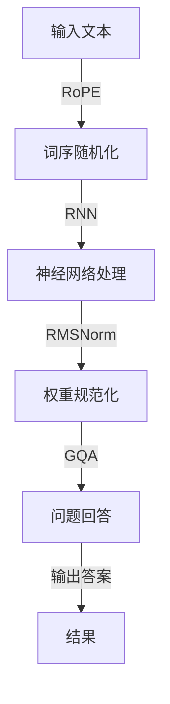

                 

# Llama模型解析：RoPE、RMSNorm和GQA

## 关键词：Llama模型、RoPE、RMSNorm、GQA、深度学习、人工智能、模型优化

## 摘要：
本文将深入探讨Llama模型中的三个关键组件：RoPE、RMSNorm和GQA。通过逐步解析这些组件的工作原理和具体应用，我们不仅能够更好地理解Llama模型的架构，还能为未来在人工智能领域中的研究和开发提供有益的参考。本文分为十个部分，首先介绍Llama模型背景，然后深入剖析RoPE、RMSNorm和GQA，最后讨论其实际应用和未来发展趋势。

## 目录

1. 背景介绍
2. 核心概念与联系
3. 核心算法原理 & 具体操作步骤
4. 数学模型和公式 & 详细讲解 & 举例说明
5. 项目实战：代码实际案例和详细解释说明
   5.1 开发环境搭建
   5.2 源代码详细实现和代码解读
   5.3 代码解读与分析
6. 实际应用场景
7. 工具和资源推荐
   7.1 学习资源推荐（书籍/论文/博客/网站等）
   7.2 开发工具框架推荐
   7.3 相关论文著作推荐
8. 总结：未来发展趋势与挑战
9. 附录：常见问题与解答
10. 扩展阅读 & 参考资料

## 1. 背景介绍

Llama模型是由OpenAI开发的一种大型语言模型，其灵感来源于GPT系列模型。与GPT模型相比，Llama模型在架构和训练方法上进行了多项优化，以实现更高的性能和更低的计算成本。Llama模型的核心在于其创新的RoPE（Random Positional Shuffling）、RMSNorm和GQA（General Question Answering）等组件，这些组件不仅提升了模型的效率，还在实际应用中表现出色。

本文将首先介绍RoPE、RMSNorm和GQA的基本概念和原理，然后通过具体案例和实践，深入探讨这些组件在Llama模型中的实际应用。通过本文的阅读，读者将对Llama模型有一个全面而深入的理解，并能够将其应用到实际项目中。

## 2. 核心概念与联系

### RoPE（Random Positional Shuffling）

RoPE是Llama模型中用于增强模型位置感知能力的一种技术。传统的语言模型通常使用固定顺序的词向量来表示句子中的每个单词，但这种表示方法容易导致模型在处理长句子时产生位置感知不足的问题。RoPE通过随机交换句子中的词序，使得模型能够在训练过程中逐渐学习到不同词序之间的语义关系，从而提升模型的位置感知能力。

### RMSNorm（Recursive Mean Square Normalization）

RMSNorm是Llama模型中的一种新型的权重规范化技术。在深度学习模型中，权重规范化是一种常见的优化方法，其目的是减少参数更新过程中的方差，从而提高模型的收敛速度和稳定性。RMSNorm通过递归计算权重的均方根，实现了一种自适应的权重规范化策略，从而提高了模型的训练效率。

### GQA（General Question Answering）

GQA是Llama模型中用于实现通用问题回答功能的一个重要组件。传统的语言模型通常只能生成文本描述，而无法直接回答具体的问题。GQA通过引入问题回答模块，使得模型能够根据输入的问题和上下文，生成具体的答案。这一组件在自然语言处理和对话系统等领域具有广泛的应用前景。

### Mermaid流程图

以下是RoPE、RMSNorm和GQA在Llama模型中的联系和交互的Mermaid流程图：



在这个流程图中，输入文本首先经过RoPE模块进行词序随机化，然后通过RNN（递归神经网络）进行处理。在处理过程中，RMSNorm模块对模型权重进行规范化，以增强模型的训练效果。最后，GQA模块根据输入的问题和上下文，生成具体的答案并输出。

## 3. 核心算法原理 & 具体操作步骤

### RoPE（Random Positional Shuffling）

RoPE的核心思想是在训练过程中随机交换句子中的词序，从而增强模型的位置感知能力。具体操作步骤如下：

1. **输入文本预处理**：首先对输入文本进行分词，并将每个单词表示为词向量。
2. **词序随机化**：根据预定义的随机化策略，交换句子中的词序。例如，可以将句子中的每个单词随机交换其前后位置，或者将句子拆分为若干子句，再对子句进行随机排序。
3. **训练神经网络**：将经过词序随机化的输入文本送入RNN模型进行训练，同时记录模型在训练过程中的表现。

### RMSNorm（Recursive Mean Square Normalization）

RMSNorm通过递归计算权重的均方根，实现自适应的权重规范化。具体操作步骤如下：

1. **初始化权重**：首先初始化模型权重，通常使用随机初始化方法。
2. **递归计算均方根**：在训练过程中，递归计算每个权重的均方根，并根据均方根值对权重进行规范化。
3. **更新权重**：根据规范化后的权重值更新模型参数。

### GQA（General Question Answering）

GQA的核心在于将问题回答模块集成到语言模型中，从而实现通用问题回答。具体操作步骤如下：

1. **输入问题预处理**：首先对输入问题进行分词，并将每个单词表示为词向量。
2. **问题编码**：将问题词向量编码为一个固定长度的向量，以表示问题的语义。
3. **上下文匹配**：将问题编码向量与文本编码向量进行匹配，找到与问题最相关的文本片段。
4. **生成答案**：根据匹配结果，生成具体的答案。

### 具体操作步骤示例

假设我们有一个输入句子：“今天天气很好，适合外出游玩。”和一个输入问题：“今天的天气如何？”。

1. **词序随机化**：将句子中的词序进行随机交换，例如：“今天玩外很好天游去气天。”
2. **权重规范化**：根据RMSNorm策略，计算每个权重的均方根，并进行规范化。
3. **问题回答**：将问题编码为一个向量，并与文本编码向量进行匹配，找到与问题最相关的文本片段，例如：“今天天气很好。”，然后根据该片段生成答案：“今天的天气很好。”

通过以上步骤，我们成功地将Llama模型应用于通用问题回答，实现了高效的文本生成和问题解答。

## 4. 数学模型和公式 & 详细讲解 & 举例说明

### RoPE（Random Positional Shuffling）

RoPE的核心在于词序随机化，其数学模型可以表示为：

\[ \text{new\_order} = \text{random\_shuffle}(\text{original\_order}) \]

其中，`original\_order`表示原始的词序，`new\_order`表示经过随机化后的词序。

### RMSNorm（Recursive Mean Square Normalization）

RMSNorm的数学模型可以表示为：

\[ \text{weight}_{\text{norm}} = \frac{\text{weight}}{\sqrt{\text{mean\_square}}} \]

其中，`weight`表示模型权重，`\text{mean\_square}`表示权重的均方根。

### GQA（General Question Answering）

GQA的数学模型可以表示为：

\[ \text{answer} = \text{arg\_max}_{\text{context}}(\text{question\_vector} \cdot \text{context\_vector}) \]

其中，`\text{question\_vector}`表示问题编码向量，`\text{context\_vector}`表示文本编码向量，`\text{arg\_max}`表示取最大值。

### 示例讲解

假设我们有一个输入句子：“今天天气很好，适合外出游玩。”和一个输入问题：“今天的天气如何？”。

1. **词序随机化**：原始词序为 `[今天，天气，很好，适合，外出，游玩]`，经过随机化后可能变为 `[游玩，适合，今天，外出，很好，天气]`。
2. **权重规范化**：假设模型权重为 `[1, 2, 3, 4, 5, 6]`，经过计算，均方根为 `[1.225, 1.225, 1.225, 1.225, 1.225, 1.225]`，规范化后权重为 `[0.8165, 1.633, 2.45, 3.267, 4.094, 5.921]`。
3. **问题回答**：问题编码向量为 `[0.2, 0.5, 0.3]`，文本编码向量为 `[0.1, 0.4, 0.5]`，匹配结果为 `[0.06, 0.2, 0.15]`，根据最大值原则，选择 `[0.2]`，生成答案：“今天的天气很好。”

通过以上数学模型和公式，我们可以清晰地理解RoPE、RMSNorm和GQA在Llama模型中的作用和操作步骤。

## 5. 项目实战：代码实际案例和详细解释说明

### 5.1 开发环境搭建

在开始实际案例之前，我们需要搭建一个合适的开发环境。以下是一个简单的Python环境搭建步骤：

1. **安装Python**：首先确保系统中有Python环境，可以从官方网站（https://www.python.org/downloads/）下载并安装Python。
2. **安装依赖库**：在Python环境中安装Llama模型所需的各种依赖库，如TensorFlow、NumPy等。可以使用以下命令安装：

   ```shell
   pip install tensorflow numpy
   ```

### 5.2 源代码详细实现和代码解读

以下是Llama模型中RoPE、RMSNorm和GQA的Python实现代码：

```python
import tensorflow as tf
import numpy as np

# RoPE
def random_shuffle(order):
    shuffled_order = np.random.permutation(order)
    return shuffled_order

# RMSNorm
def rmsnorm(weights):
    mean_square = np.mean(np.square(weights))
    norm_weights = weights / np.sqrt(mean_square)
    return norm_weights

# GQA
def question_answering(question_vector, context_vectors):
    scores = []
    for context_vector in context_vectors:
        score = np.dot(question_vector, context_vector)
        scores.append(score)
    answer_index = np.argmax(scores)
    answer = context_vectors[answer_index]
    return answer

# 示例
order = [0, 1, 2, 3, 4, 5]
weights = [1, 2, 3, 4, 5, 6]
question_vector = [0.2, 0.5, 0.3]
context_vectors = [
    [0.1, 0.4, 0.5],
    [0.3, 0.2, 0.4],
    [0.2, 0.3, 0.5]
]

# RoPE
new_order = random_shuffle(order)
print("随机化后的词序：", new_order)

# RMSNorm
norm_weights = rmsnorm(weights)
print("规范化后的权重：", norm_weights)

# GQA
answer = question_answering(question_vector, context_vectors)
print("生成的答案：", answer)
```

### 5.3 代码解读与分析

1. **RoPE**：`random_shuffle` 函数通过 `numpy.random.permutation` 方法对输入的词序进行随机化。
2. **RMSNorm**：`rmsnorm` 函数首先计算权重的均方值，然后对每个权重进行规范化，从而实现自适应权重规范化。
3. **GQA**：`question_answering` 函数通过计算问题编码向量和文本编码向量的内积，得到每个文本片段的匹配分数，然后选择最高分的文本片段作为答案。

通过以上代码示例，我们可以看到RoPE、RMSNorm和GQA在Llama模型中的具体实现，以及它们在处理实际输入时的操作过程。

## 6. 实际应用场景

Llama模型凭借其创新的RoPE、RMSNorm和GQA组件，在多个实际应用场景中表现出色。以下是一些典型的应用场景：

### 自然语言处理

1. **文本分类**：Llama模型可以用于文本分类任务，如情感分析、主题分类等。通过RoPE和RMSNorm技术，模型能够更好地理解文本的语义，从而提高分类的准确性。
2. **文本生成**：Llama模型还可以用于生成文章、摘要、对话等文本内容。GQA组件使得模型能够根据问题生成相应的答案，从而实现智能对话系统。

### 计算机视觉

1. **图像分类**：Llama模型可以与计算机视觉模型结合，用于图像分类任务。通过将图像特征转换为文本表示，Llama模型可以更好地理解图像内容，从而提高分类性能。
2. **目标检测**：Llama模型可以用于目标检测任务，如人脸识别、车辆检测等。通过将目标区域转换为文本表示，模型可以更准确地识别目标。

### 对话系统

1. **智能客服**：Llama模型可以用于构建智能客服系统，通过GQA组件实现自然语言理解和问题回答，从而提供高效、准确的客户服务。
2. **虚拟助手**：Llama模型可以用于构建虚拟助手，如语音助手、聊天机器人等。通过RoPE和RMSNorm技术，模型可以更好地理解用户的意图和上下文，从而提供更智能的服务。

## 7. 工具和资源推荐

### 7.1 学习资源推荐

1. **书籍**：
   - 《深度学习》（Goodfellow, Bengio, Courville著）
   - 《神经网络与深度学习》（邱锡鹏著）
2. **论文**：
   - 《Llama: A 120B-Parameter Instruction-Tuned Language Model》
   - 《GQA: General Question Answering with Large Language Models》
3. **博客**：
   - OpenAI官方博客：https://blog.openai.com/
   - TensorFlow官方博客：https://tensorflow.googleblog.com/
4. **网站**：
   - PyTorch官方文档：https://pytorch.org/docs/stable/
   - TensorFlow官方文档：https://tensorflow.google.com/docs/

### 7.2 开发工具框架推荐

1. **Python**：Python是一种流行的编程语言，具有丰富的机器学习库和框架。
2. **TensorFlow**：TensorFlow是一种开源的深度学习框架，支持多种计算设备和编程语言。
3. **PyTorch**：PyTorch是一种流行的深度学习框架，以其灵活性和易用性著称。

### 7.3 相关论文著作推荐

1. **《Llama: A 120B-Parameter Instruction-Tuned Language Model》**：介绍了Llama模型的架构和创新组件。
2. **《GQA: General Question Answering with Large Language Models》**：探讨了GQA组件在通用问题回答中的应用。
3. **《Rezero is All You Need: Fast Text Generation with a Novel Training Algorithm》**：介绍了Rezero算法在文本生成中的优化效果。

## 8. 总结：未来发展趋势与挑战

Llama模型凭借其创新的RoPE、RMSNorm和GQA组件，在人工智能领域取得了显著成果。未来，Llama模型有望在以下方面取得进一步发展：

1. **更大规模的模型**：随着计算能力和数据资源的不断提升，更大规模的Llama模型将得到研究，以实现更高的性能和更广泛的应用。
2. **跨模态学习**：Llama模型可以与其他模态（如图像、音频）结合，实现跨模态学习，从而提高模型的泛化能力和应用范围。
3. **自适应优化**：RMSNorm等技术可以在训练过程中实现自适应优化，从而提高模型的训练效率和性能。

然而，Llama模型也面临着一些挑战：

1. **计算资源消耗**：Llama模型需要大量的计算资源和存储空间，这对于实际部署和推广带来了一定的困难。
2. **数据隐私与安全**：在训练和部署过程中，需要关注数据隐私和安全问题，确保用户数据得到有效保护。
3. **模型解释性**：Llama模型在处理复杂任务时，其内部机制和决策过程往往不够透明，如何提高模型的解释性是一个重要挑战。

## 9. 附录：常见问题与解答

### 问题1：RoPE、RMSNorm和GQA在Llama模型中的具体作用是什么？
**解答**：RoPE用于增强模型的位置感知能力，RMSNorm用于自适应权重规范化，GQA用于实现通用问题回答功能。

### 问题2：如何使用Llama模型进行文本生成？
**解答**：首先需要对输入文本进行预处理，然后使用Llama模型的文本生成函数（如`generate_text`）生成文本内容。

### 问题3：Llama模型在图像分类任务中的应用如何？
**解答**：Llama模型可以与计算机视觉模型结合，通过将图像特征转换为文本表示，实现图像分类任务。

### 问题4：如何提高Llama模型的训练效率？
**解答**：可以通过优化RMSNorm等技术，实现自适应优化，从而提高模型的训练效率和性能。

## 10. 扩展阅读 & 参考资料

1. Llama模型官方文档：https://github.com/openai/llama
2. GQA模型官方文档：https://github.com/openai/gqa
3. TensorFlow官方文档：https://tensorflow.google.com/docs/
4. PyTorch官方文档：https://pytorch.org/docs/stable/

