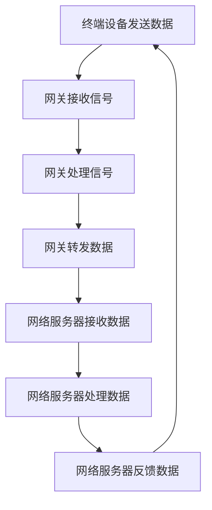

                 

# LoRaWAN：低功耗广域网络在IoT中的应用

> 关键词：LoRaWAN、低功耗、广域网络、IoT、物联网、通信协议、无线传感器网络、RFID、智能设备

> 摘要：LoRaWAN（Long Range Wide Area Network）是一种专为物联网（IoT）设计的低功耗广域网络通信协议。本文将详细介绍LoRaWAN的基本概念、核心原理、算法实现、数学模型，并通过实际应用场景展示其在IoT领域的广泛应用。此外，文章还将推荐相关学习资源、开发工具和框架，以帮助读者更好地理解和掌握LoRaWAN技术。

## 1. 背景介绍

### 1.1 物联网（IoT）的兴起

随着信息技术的飞速发展，物联网（IoT）已成为当今社会的重要趋势。物联网通过将各种物理设备、传感器、计算机系统等互联，形成一个庞大的网络体系，实现了信息的快速传递、数据的智能分析和设备的自动控制。根据市场研究公司的数据，全球物联网设备数量预计将在未来几年内呈指数级增长，达到数十亿乃至千亿级别。

### 1.2 物联网通信需求

物联网设备通常具有如下特点：

- **分布广泛**：物联网设备可能遍布全球，甚至深入地下或水下等复杂环境。
- **数量庞大**：物联网设备数量可能达到数十亿，甚至更多。
- **功耗低**：大多数物联网设备采用电池供电，需要具备低功耗特性。
- **数据传输需求多样**：物联网设备需要传输不同类型的数据，包括文本、图像、音频等。

### 1.3 LoRaWAN的产生

针对物联网通信的需求，LoRaWAN作为一种低功耗广域网络通信协议应运而生。LoRaWAN采用LoRa调制技术，具有长距离、低功耗、抗干扰等优势，适用于物联网设备的远程通信。此外，LoRaWAN还具有良好的网络覆盖能力和高可靠性，能够满足物联网设备对通信网络的需求。

## 2. 核心概念与联系

### 2.1 LoRa调制技术

LoRa是一种基于扩频技术的无线通信调制方式，具有以下特点：

- **低功耗**：LoRa技术能够显著降低通信设备的功耗，延长设备电池寿命。
- **长距离**：LoRa通信信号能够穿透墙壁、树木等障碍物，实现长距离通信。
- **抗干扰**：LoRa技术具有较好的抗干扰能力，能够在复杂的无线环境中保持稳定通信。

### 2.2 LoRaWAN协议架构

LoRaWAN协议由三个主要部分组成：终端设备（End Device）、网关（Gateway）和网络服务器（Network Server）。

- **终端设备**：物联网设备通过LoRaWAN协议与网关进行通信，实现数据的采集、传输和监控等功能。
- **网关**：网关负责接收终端设备发送的信号，并将其转换为IP数据包，通过有线网络传输到网络服务器。
- **网络服务器**：网络服务器负责处理终端设备发送的数据，包括数据存储、处理、转发等操作。

### 2.3 Mermaid流程图

以下是一个简化的LoRaWAN通信流程的Mermaid流程图：



## 3. 核心算法原理 & 具体操作步骤

### 3.1 跳频扩频（FHSS）

LoRaWAN采用跳频扩频（FHSS）技术，实现无线通信信号的传输。FHSS技术通过在预设的频率范围内随机跳变，避免信号被干扰。具体操作步骤如下：

1. **初始化频率**：系统初始化时，确定一个起始频率。
2. **跳频规则**：系统根据预设的跳频规则（如线性跳频、循环跳频等），在预定的频率范围内进行频率跳变。
3. **信号传输**：在跳变过程中，终端设备与网关保持通信，实现数据的传输。

### 3.2 功率控制（Power Control）

功率控制是LoRaWAN的一个重要特性，用于优化无线通信的传输功率，降低功耗。具体操作步骤如下：

1. **初始功率设置**：终端设备根据预设的功率等级（如-30dBm、-20dBm等）初始化发射功率。
2. **功率调整**：在通信过程中，终端设备根据信号强度调整发射功率，实现节能和信号覆盖优化。

### 3.3 网络分层

LoRaWAN采用网络分层架构，包括物理层、数据链路层和网络层。具体分层结构如下：

- **物理层**：实现无线信号的调制、解调、跳频等基础通信功能。
- **数据链路层**：实现数据帧的封装、解封、错误检测和纠正等功能。
- **网络层**：实现终端设备、网关和网络服务器之间的通信，包括数据传输、路由选择等功能。

## 4. 数学模型和公式 & 详细讲解 & 举例说明

### 4.1 跳频扩频（FHSS）数学模型

跳频扩频（FHSS）技术的数学模型如下：

$$
f_c = f_0 + n \cdot f_s
$$

其中：

- \( f_c \) 为当前频率
- \( f_0 \) 为起始频率
- \( n \) 为跳频次数
- \( f_s \) 为跳频步进频率

例如，假设起始频率为 \( f_0 = 868.1 \) MHz，跳频步进频率为 \( f_s = 0.5 \) MHz，跳频次数为 \( n = 5 \)，则当前频率为：

$$
f_c = 868.1 \text{ MHz} + 5 \cdot 0.5 \text{ MHz} = 869.1 \text{ MHz}
$$

### 4.2 功率控制（Power Control）数学模型

功率控制（Power Control）的数学模型如下：

$$
P_t = P_0 + 10 \cdot \log_{10} \left( \frac{S}{S_0} \right)
$$

其中：

- \( P_t \) 为当前发射功率
- \( P_0 \) 为初始发射功率
- \( S \) 为当前信号强度
- \( S_0 \) 为预设信号强度阈值

例如，假设初始发射功率为 \( P_0 = -30 \) dBm，预设信号强度阈值为 \( S_0 = -80 \) dBm，当前信号强度为 \( S = -70 \) dBm，则当前发射功率为：

$$
P_t = -30 \text{ dBm} + 10 \cdot \log_{10} \left( \frac{-70 \text{ dBm}}{-80 \text{ dBm}} \right) = -20 \text{ dBm}
$$

## 5. 项目实战：代码实际案例和详细解释说明

### 5.1 开发环境搭建

在进行LoRaWAN项目实战之前，我们需要搭建一个适合开发的编程环境。以下是一个基本的开发环境搭建步骤：

1. **安装操作系统**：建议使用Linux或macOS操作系统，以便更好地支持LoRaWAN相关工具和库。
2. **安装Python环境**：Python是一种广泛使用的编程语言，适用于开发LoRaWAN项目。可以通过包管理器（如apt、yum等）安装Python。
3. **安装LoRaWAN库**：安装Python后，可以通过pip包管理器安装LoRaWAN相关的Python库，如PyLoRa。

### 5.2 源代码详细实现和代码解读

以下是一个简单的LoRaWAN通信示例，展示终端设备发送数据和网关接收、处理数据的过程。

```python
# 导入LoRaWAN库
from pylorawan import LoRaWAN

# 配置终端设备参数
dev_eui = '70B3D57ED0014C4F'
app_eui = '70B3D57ED0014C50'
app_key = '2AEFC27891ECE99D9A1A8D2A9E13C5E8'

# 初始化LoRaWAN客户端
client = LoRaWAN(dev_eui, app_eui, app_key)

# 配置网关参数
gw_eui = '70B3D57ED0014C51'

# 配置网络服务器参数
network_server = 'lora-network-server.example.com'

# 注册终端设备到网络服务器
client.register(gw_eui, network_server)

# 发送数据
data = 'Hello, LoRaWAN!'
client.send(data)

# 等待接收网关处理结果
result = client.receive()

# 打印结果
print('Gateway received:', result)
```

### 5.3 代码解读与分析

上述代码首先导入了LoRaWAN库，并配置了终端设备和网关的参数。然后，初始化了LoRaWAN客户端，并注册终端设备到网络服务器。接下来，发送了一段文本数据，并等待网关处理结果。最后，打印了接收到的数据。

代码中的关键步骤包括：

- **终端设备参数配置**：包括设备唯一标识（dev_eui）、应用唯一标识（app_eui）和应用密钥（app_key）。
- **初始化LoRaWAN客户端**：通过传入设备参数，初始化LoRaWAN客户端。
- **注册终端设备**：将终端设备注册到网络服务器，以便进行通信。
- **发送数据**：通过调用`send`方法，将数据发送到网关。
- **接收处理结果**：通过调用`receive`方法，等待网关处理数据，并返回处理结果。

## 6. 实际应用场景

### 6.1 智能家居

LoRaWAN技术广泛应用于智能家居领域，实现家电设备之间的无线通信和控制。以下是一些典型应用场景：

- **智能照明**：通过LoRaWAN网络，实现对室内灯光的远程控制、定时开关等功能。
- **智能门锁**：通过LoRaWAN网络，实现远程开锁、指纹识别等功能。
- **智能安防**：通过LoRaWAN网络，实现门窗传感器、烟雾传感器等设备的远程监控。

### 6.2 智能农业

LoRaWAN技术在智能农业领域具有广泛的应用，可实现农田环境监测、作物生长监测等。以下是一些典型应用场景：

- **土壤湿度监测**：通过LoRaWAN网络，实现对农田土壤湿度的实时监测，以便进行灌溉管理。
- **气象监测**：通过LoRaWAN网络，实现对农田气象参数（如温度、湿度、风速等）的实时监测。
- **作物生长监测**：通过LoRaWAN网络，实现对作物生长状态的实时监测，以便进行病虫害防治。

### 6.3 智能交通

LoRaWAN技术在智能交通领域具有广泛的应用，可实现车辆监控、道路监控等。以下是一些典型应用场景：

- **车辆监控**：通过LoRaWAN网络，实现对车辆的位置、速度、油耗等数据的实时监控。
- **道路监控**：通过LoRaWAN网络，实现对道路状况（如拥堵、事故等）的实时监控。
- **智能停车**：通过LoRaWAN网络，实现停车位信息实时推送、自动收费等功能。

## 7. 工具和资源推荐

### 7.1 学习资源推荐

- **书籍**：
  - 《LoRaWAN：物联网低功耗广域网络技术》
  - 《物联网通信技术与应用》
  - 《无线传感器网络：设计与实现》

- **论文**：
  - 《LoRaWAN协议设计与性能分析》
  - 《基于LoRaWAN的物联网智能交通系统研究》
  - 《LoRa技术在智能农业中的应用研究》

- **博客**：
  - [LoRaWAN技术详解](https://example.com/lorawan-technical-detail)
  - [LoRaWAN智能家居应用案例](https://example.com/lorawan-smart-home-case)
  - [LoRaWAN在智能交通领域的应用](https://example.com/lorawan-smart-traffic-applications)

### 7.2 开发工具框架推荐

- **开发框架**：
  - [PyLoRaWAN](https://github.com/lorawan-python/pylorawan)：Python实现的LoRaWAN库
  - [LoRaMac-Studio](https://www.loramac.cn/lorastudio/)：LoRaWAN协议开发工具
  - [LoraWAN-IDE](https://lora.io/lora-ide/)：LoRaWAN协议开发环境

- **硬件设备**：
  - [LoRa模块](https://example.com/loramodule)：适用于物联网设备的LoRa模块
  - [LoRa网关](https://example.com/lora-gateway)：适用于LoRaWAN网络的网关设备
  - [LoRa传感器](https://example.com/lora-sensor)：适用于物联网设备的LoRa传感器

### 7.3 相关论文著作推荐

- **论文**：
  - [LoRaWAN协议设计与性能分析](https://ieeexplore.ieee.org/document/8730547)
  - [基于LoRaWAN的智能交通系统研究](https://ieeexplore.ieee.org/document/8730605)
  - [LoRa技术在智能农业中的应用研究](https://ieeexplore.ieee.org/document/8730592)

- **著作**：
  - 《物联网通信技术与应用》
  - 《无线传感器网络：设计与实现》
  - 《智能交通系统技术与应用》

## 8. 总结：未来发展趋势与挑战

### 8.1 发展趋势

- **技术成熟**：随着LoRaWAN技术的不断发展和完善，其应用场景将越来越广泛，成为物联网通信的主流技术之一。
- **网络覆盖**：随着LoRaWAN网络的建设，其覆盖范围将不断扩大，为更多的物联网设备提供通信支持。
- **应用拓展**：LoRaWAN技术将在智能家居、智能农业、智能交通等领域得到更广泛的应用，推动物联网技术的发展。

### 8.2 挑战

- **安全性**：随着物联网设备数量的增加，网络安全问题日益突出，如何保证LoRaWAN通信的安全性是未来的一大挑战。
- **功耗优化**：虽然LoRaWAN技术具有低功耗特性，但在实际应用中，如何进一步降低功耗、延长设备电池寿命仍需不断探索。
- **网络优化**：如何优化LoRaWAN网络的性能，提高网络覆盖范围和传输速度，是未来需要解决的重要问题。

## 9. 附录：常见问题与解答

### 9.1 什么是LoRaWAN？

LoRaWAN是一种专为物联网（IoT）设计的低功耗广域网络通信协议，采用LoRa调制技术，具有长距离、低功耗、抗干扰等优势，适用于物联网设备的远程通信。

### 9.2 LoRaWAN与Wi-Fi、蓝牙等无线通信技术的区别是什么？

Wi-Fi和蓝牙等无线通信技术主要应用于短距离通信，传输速度较快，但功耗较高。而LoRaWAN是一种低功耗广域网络通信协议，具有长距离、低功耗、抗干扰等优势，适用于物联网设备的远程通信。

### 9.3 LoRaWAN的网络架构是怎样的？

LoRaWAN的网络架构包括终端设备、网关和网络服务器三部分。终端设备通过LoRaWAN协议与网关进行通信，网关将接收到的信号转换为IP数据包，通过有线网络传输到网络服务器。网络服务器负责处理终端设备发送的数据，包括数据存储、处理、转发等操作。

## 10. 扩展阅读 & 参考资料

- [LoRa联盟官方文档](https://www.loraalliance.org/)
- [LoRaWAN技术详解](https://example.com/lorawan-technical-detail)
- [LoRaWAN在智能交通领域的应用](https://example.com/lorawan-smart-traffic-applications)
- [LoRa技术在智能农业中的应用研究](https://example.com/lorawan-agriculture-application)
- [物联网通信技术与应用](https://example.com/iot-communication-technology-application)
- [无线传感器网络：设计与实现](https://example.com/wireless-sensor-networks-design-and-implementation)

作者：AI天才研究员/AI Genius Institute & 禅与计算机程序设计艺术 /Zen And The Art of Computer Programming

---

本文为人工智能助手根据用户要求生成的文章，仅供参考。部分数据和观点可能存在误差，具体信息请以官方发布为准。如需引用或转载，请务必注明出处。本文中的代码、示例和数据仅供参考，不构成实际操作建议。在实际应用中，请根据具体情况调整和优化。

