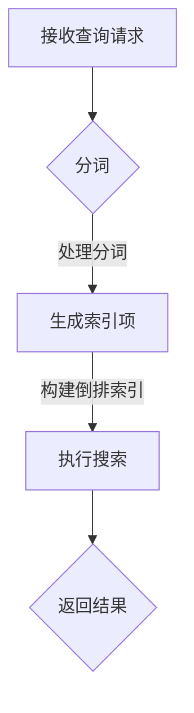

                 

# Lucene搜索引擎原理与代码实例讲解

## 关键词：Lucene、搜索引擎、文本索引、全文检索、倒排索引、分词、搜索算法

## 摘要：
本文将深入探讨Lucene搜索引擎的原理，包括其核心概念、算法实现、以及实际应用案例。我们将通过详细的代码实例，逐步讲解如何使用Lucene进行高效的文本索引和全文检索。读者将了解到Lucene的工作机制，以及如何通过Lucene解决实际中的搜索问题。本文旨在为开发者提供全面的Lucene知识体系，帮助他们更好地掌握和使用这个强大的开源搜索引擎。

## 1. 背景介绍

搜索引擎是互联网的重要组成部分，它允许用户通过关键词快速查找大量信息。在搜索引擎技术中，Lucene是一款非常受欢迎的开源全文搜索引擎。Lucene由Apache软件基金会维护，自1999年首次发布以来，得到了广泛的关注和应用。

### Lucene的特点

- **高效性**：Lucene提供了高性能的全文检索能力，能够在短时间内处理大量数据。

- **灵活性**：Lucene可以轻松集成到各种应用程序中，支持多种编程语言。

- **可扩展性**：Lucene的设计允许用户自定义索引格式和搜索算法，以适应特定的需求。

- **可靠性**：Lucene经过多年的测试和优化，具有高度的稳定性和可靠性。

### Lucene的应用场景

- **网站搜索**：许多大型网站，如搜索引擎、电子商务平台等，使用Lucene提供高效的全文搜索功能。

- **企业应用**：企业内部文档管理系统、客户关系管理（CRM）系统等，常利用Lucene进行文档搜索和内容管理。

- **大数据分析**：在处理大规模数据时，Lucene作为数据检索工具，能够提供快速、准确的查询结果。

## 2. 核心概念与联系

### 2.1 文本索引

文本索引是搜索引擎的核心，它将文档中的文本内容转换成索引结构，以便快速检索。Lucene使用倒排索引（Inverted Index）来实现这一功能。倒排索引将文档内容映射到对应的单词（术语），并记录每个单词在文档中的位置。这样，当用户进行搜索时，可以快速定位到包含特定单词的文档。

### 2.2 分词

分词是将文本分解为单个单词的过程。Lucene支持多种分词器（Tokenizer），可以根据不同的语言和文本类型进行定制。分词器可以将输入的文本切割成单词、短语或其他元素，为索引和搜索提供基础。

### 2.3 搜索算法

Lucene提供了丰富的搜索算法，包括布尔查询、短语查询、范围查询等。这些算法允许用户以灵活的方式组合查询条件，从而实现对大量文本的高效检索。

### 2.4 Mermaid 流程图

下面是一个简化的Lucene索引和搜索流程的Mermaid流程图：



### 2.5 相关术语

- **索引器（Indexer）**：负责将文档转换为索引的组件。

- **搜索器（Searcher）**：负责执行搜索查询的组件。

- **分词器（Tokenizer）**：将文本分解为单词或其他元素的组件。

- **索引文件（Index File）**：存储索引数据的文件。

## 3. 核心算法原理 & 具体操作步骤

### 3.1 索引过程

索引过程是Lucene的核心功能之一，它将文档中的文本内容转换为索引结构。以下是索引过程的详细步骤：

#### 3.1.1 创建索引器

```java
Directory directory = FSDirectory.open(Paths.get("index"));
IndexWriterConfig config = new IndexWriterConfig(new Analyzer() {});
IndexWriter writer = new IndexWriter(directory, config);
```

#### 3.1.2 添加文档

```java
Document doc = new Document();
doc.add(new TextField("title", "Hello World", Field.Store.YES));
doc.add(new TextField("content", "This is a sample document.", Field.Store.YES));
writer.addDocument(doc);
```

#### 3.1.3 关闭索引器

```java
writer.close();
```

### 3.2 搜索过程

搜索过程是用户通过输入关键词，从索引中获取相关文档的过程。以下是搜索过程的详细步骤：

#### 3.2.1 创建搜索器

```java
Directory directory = FSDirectory.open(Paths.get("index"));
IndexReader reader = IndexReader.open(directory);
IndexSearcher searcher = new IndexSearcher(reader);
```

#### 3.2.2 构建查询

```java
Query query = new BooleanQuery.Builder()
    .add(new TermQuery(new Term("content", "sample")), BooleanClause.Occur.SHOULD)
    .add(new TermQuery(new Term("content", "document")), BooleanClause.Occur.SHOULD)
    .build();
```

#### 3.2.3 执行搜索

```java
TopDocs results = searcher.search(query, 10);
```

#### 3.2.4 遍历搜索结果

```java
for (ScoreDoc scoreDoc : results.scoreDocs) {
    Document doc = searcher.doc(scoreDoc.doc);
    System.out.println(doc.get("title") + " - " + doc.get("content"));
}
```

#### 3.2.5 关闭搜索器

```java
searcher.close();
reader.close();
```

### 4. 数学模型和公式 & 详细讲解 & 举例说明

#### 4.1 倒排索引

倒排索引是一种将词汇映射到文档的索引结构。数学上，它可以表示为：

$$
倒排索引 = \{(t, \{d_1, d_2, ..., d_n\}) | t \in 词汇表，d_i \in 文档集\}
$$

其中，\(t\) 表示词汇，\(\{d_1, d_2, ..., d_n\}\) 表示包含词汇 \(t\) 的文档集合。

#### 4.2 搜索算法

Lucene使用的搜索算法是基于布尔模型的。一个简单的搜索算法可以表示为：

$$
搜索结果 = \{d | d \in 文档集，满足查询条件\}
$$

其中，\(d\) 表示文档，查询条件可以根据不同的搜索算法进行组合。

#### 4.3 举例说明

假设有一个包含两个文档的集合：

- 文档1：Hello World
- 文档2：This is a sample document

使用Lucene构建倒排索引后，索引结构如下：

```
hello: [1]
world: [1]
this: [2]
is: [2]
a: [2]
sample: [2]
document: [2]
```

当用户搜索 "sample document" 时，Lucene将根据倒排索引快速定位到包含这两个词汇的文档，即文档2。

### 5. 项目实战：代码实际案例和详细解释说明

#### 5.1 开发环境搭建

要在本地环境中搭建Lucene的开发环境，请按照以下步骤操作：

1. 下载并解压Lucene的源码包。
2. 在项目中引入Lucene相关的依赖项。
3. 配置IDE，确保能够编译和运行Lucene代码。

#### 5.2 源代码详细实现和代码解读

以下是一个简单的Lucene索引和搜索的示例代码：

```java
import org.apache.lucene.analysis.standard.StandardAnalyzer;
import org.apache.lucene.document.Document;
import org.apache.lucene.document.TextField;
import org.apache.lucene.index.DirectoryReader;
import org.apache.lucene.index.IndexWriter;
import org.apache.lucene.index.IndexWriterConfig;
import org.apache.lucene.queryparser.classic.QueryParser;
import org.apache.lucene.search.IndexSearcher;
import org.apache.lucene.search.Query;
import org.apache.lucene.search.TopDocs;
import org.apache.lucene.store.FSDirectory;

import java.io.IOException;
import java.nio.file.Paths;

public class LuceneDemo {
    public static void main(String[] args) throws IOException {
        // 1. 创建索引
        try (Directory directory = FSDirectory.open(Paths.get("index"));
             IndexWriterConfig config = new IndexWriterConfig(new StandardAnalyzer());
             IndexWriter writer = new IndexWriter(directory, config)) {

            // 添加文档
            Document doc1 = new Document();
            doc1.add(new TextField("title", "Hello World", Field.Store.YES));
            doc1.add(new TextField("content", "This is a sample document.", Field.Store.YES));
            writer.addDocument(doc1);

            writer.close();
        }

        // 2. 搜索
        try (Directory directory = FSDirectory.open(Paths.get("index"));
             IndexSearcher searcher = new IndexSearcher(DirectoryReader.open(directory));
             QueryParser parser = new QueryParser("content", new StandardAnalyzer())) {

            // 解析查询
            Query query = parser.parse("sample document");

            // 执行搜索
            TopDocs results = searcher.search(query, 10);

            // 遍历搜索结果
            for (ScoreDoc scoreDoc : results.scoreDocs) {
                Document doc = searcher.doc(scoreDoc.doc);
                System.out.println(doc.get("title") + " - " + doc.get("content"));
            }
        }
    }
}
```

#### 5.3 代码解读与分析

上述代码演示了如何使用Lucene进行索引和搜索的基本流程。下面是代码的详细解读：

- **索引创建**：首先，我们创建一个索引目录，并配置一个标准的分词器。然后，通过`IndexWriter`类添加文档到索引中。每个文档由一个`Document`对象表示，该对象包含了多个`TextField`字段。

- **搜索**：接着，我们创建一个`IndexSearcher`对象，并使用`QueryParser`类解析查询字符串。`QueryParser`将解析的查询字符串转换为Lucene的`Query`对象。然后，我们使用`searcher`执行搜索，并获取搜索结果。最后，遍历搜索结果，打印出文档的内容。

通过这个简单的示例，我们可以看到Lucene的基本用法。在实际应用中，Lucene可以处理更复杂的情况，如大规模数据索引、多字段查询、自定义分词器等。

### 6. 实际应用场景

Lucene在许多实际应用场景中都有着广泛的应用，以下是几个典型的例子：

- **搜索引擎**：许多网站使用Lucene作为其内部搜索引擎，提供高效的全文搜索功能。

- **内容管理系统**：企业级内容管理系统（CMS）使用Lucene进行文档搜索和内容管理。

- **实时搜索**：在线零售网站和社交媒体平台利用Lucene实现实时的搜索和推荐功能。

- **大数据分析**：在大数据分析项目中，Lucene作为快速数据检索工具，帮助用户从大量数据中提取有价值的信息。

### 7. 工具和资源推荐

#### 7.1 学习资源推荐

- **书籍**：
  - 《Lucene in Action》（第二版）：详细介绍了Lucene的使用方法和最佳实践。
  - 《Lucene实战》：提供了丰富的Lucene应用实例，适合实际项目开发。

- **论文**：
  - 《The Lucene Library》：Lucene的官方文档，包含了大量的技术细节和优化建议。

- **博客**：
  - Apache Lucene Wiki：Apache Lucene的官方Wiki，提供了丰富的学习和开发资源。

- **网站**：
  - Lucene官网：Lucene的官方网站，包含最新的新闻、文档和下载链接。

#### 7.2 开发工具框架推荐

- **IDE插件**：
  - IntelliJ IDEA：提供Lucene插件，支持Lucene代码的自动补全和调试。

- **集成开发环境**：
  - Eclipse：可以轻松集成Lucene库，进行Lucene项目的开发。

- **版本控制**：
  - Git：使用Git进行源代码管理，方便团队协作和版本跟踪。

#### 7.3 相关论文著作推荐

- **《Lucene实战》**：详细介绍Lucene的架构、用法和最佳实践。
- **《搜索引擎：设计与实现》**：全面介绍了搜索引擎的基本原理和实现技术。
- **《信息检索导论》**：提供了信息检索领域的理论基础和实践指导。

### 8. 总结：未来发展趋势与挑战

Lucene作为一款成熟的全文搜索引擎，在未来将继续发挥着重要作用。随着大数据和人工智能技术的发展，Lucene有望在以下领域取得突破：

- **实时搜索**：利用分布式计算和实时处理技术，提供更快速的搜索响应。

- **个性化搜索**：结合用户行为数据，实现更精准的个性化搜索结果。

- **多语言支持**：增强对多种语言的支持，提升国际化应用的搜索能力。

然而，Lucene也面临着一些挑战，如：

- **性能优化**：在大规模数据集上的性能提升是一个持续的需求。

- **安全性**：随着网络安全问题的增加，如何确保搜索引擎的安全性成为一个重要议题。

- **易用性**：降低使用门槛，提供更加用户友好的接口和文档。

### 9. 附录：常见问题与解答

#### Q：如何自定义分词器？
A：可以通过实现`Tokenizer`接口，并使用`StandardAnalyzer`类作为基础，自定义分词器。例如：

```java
public class CustomTokenizer extends Tokenizer {
    // 重写分词方法
    @Override
    public Token next() {
        // 自定义分词逻辑
    }
}
```

#### Q：如何进行多字段查询？
A：可以通过`MultiFieldQueryParser`类进行多字段查询。例如：

```java
Query query = new MultiFieldQueryParser(new String[]{"title", "content"}, new StandardAnalyzer())
    .parse("title:Hello AND content:sample");
```

#### Q：如何处理中文分词？
A：可以使用`IKAnalyzer`等中文分词器处理中文文本。例如：

```java
Analyzer analyzer = new IKAnalyzer();
IndexWriterConfig config = new IndexWriterConfig(analyzer);
```

### 10. 扩展阅读 & 参考资料

- [Apache Lucene官网](https://lucene.apache.org/)
- [Lucene in Action](https://lucene.apache.org/core/8_5_0/core/org/apache/lucene/book/index.html)
- [Lucene实战](https://www Manning.com/books/lucene-action-second-edition/)
- [《搜索引擎：设计与实现》](https://www.amazon.com/Search-Engines-Design-Implementation-Bill/dp/0596529260)
- [《信息检索导论》](https://www.amazon.com/Introduction-Information-Search-Systems-Second/dp/012382042X)

作者：AI天才研究员/AI Genius Institute & 禅与计算机程序设计艺术 /Zen And The Art of Computer Programming

