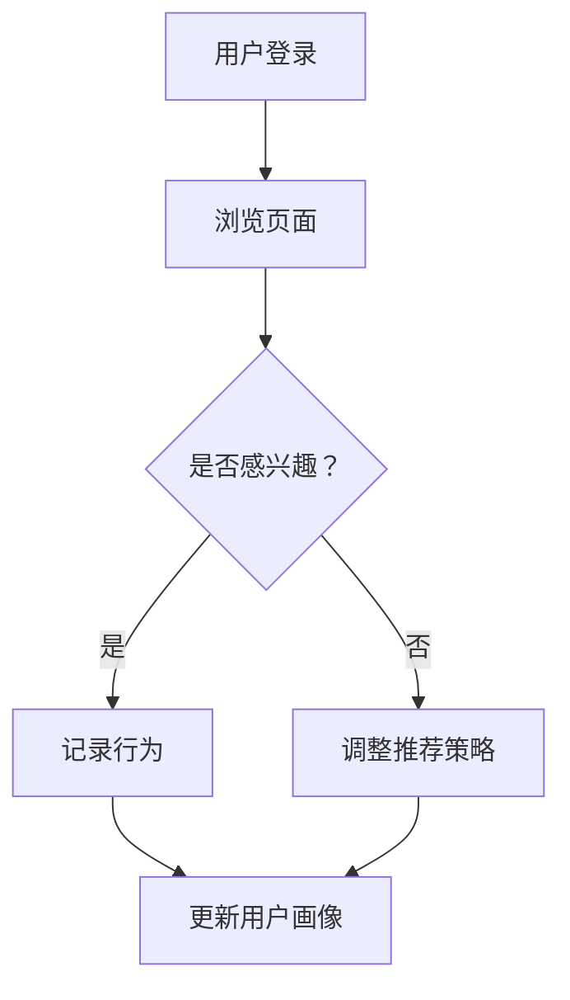
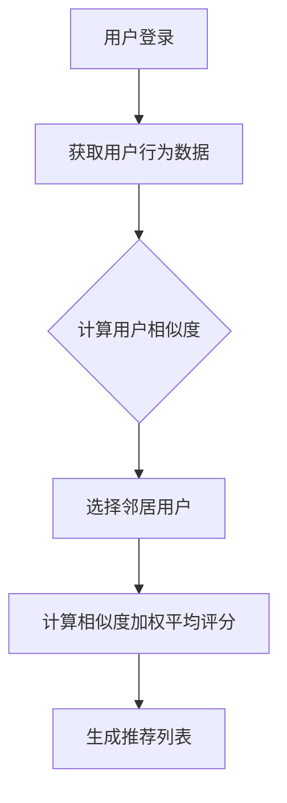
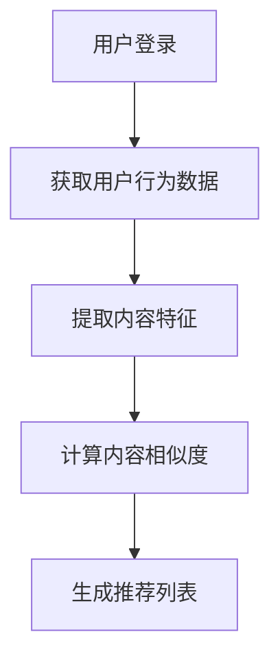

                 

# M6-Rec：开放域推荐探索

## 关键词
- 开放域推荐系统
- 用户行为分析
- 机器学习算法
- 数据挖掘
- 实时推荐
- 冷启动问题

## 摘要

本文将深入探讨开放域推荐系统这一领域，从背景介绍、核心概念、算法原理、数学模型、实战案例、应用场景、工具和资源推荐等多个角度展开分析。通过对开放域推荐系统的深入探讨，读者将了解如何构建一个高效、准确的推荐系统，从而为用户带来个性化的体验。文章最后还将展望开放域推荐系统的未来发展趋势与挑战。

### 1. 背景介绍

随着互联网的迅速发展，用户生成内容（UGC）和社交媒体的普及，开放域推荐系统变得越来越重要。开放域推荐系统旨在为用户提供个性化的信息推荐，无论这些信息是新闻、音乐、视频、商品还是社交动态。这种系统通过分析用户行为、兴趣和社交关系，从而实现精准推荐。

然而，开放域推荐系统面临着许多挑战，例如冷启动问题、实时推荐和多样性问题。冷启动问题指的是在新用户加入系统时，系统无法立即为其提供个性化的推荐；实时推荐则要求系统能够快速响应用户行为的变化，提供最新的信息；多样性问题则要求推荐结果不局限于单一类型的信息，而是要涵盖多种不同类型的推荐内容。

### 2. 核心概念与联系

为了构建一个高效的开放域推荐系统，我们需要理解以下几个核心概念：

#### 2.1 用户行为分析

用户行为分析是推荐系统的基石。通过分析用户在系统中的行为，如浏览、搜索、点击、评分、评论等，我们可以了解用户的兴趣和偏好。以下是一个用户行为分析的 Mermaid 流程图：



#### 2.2 协同过滤

协同过滤是开放域推荐系统中常用的一种算法。它通过分析用户之间的相似度，从而发现用户的共同兴趣，为用户提供个性化推荐。协同过滤可以分为基于用户的协同过滤（User-based Collaborative Filtering，UBCF）和基于项目的协同过滤（Item-based Collaborative Filtering，IBCF）。

以下是一个基于用户的协同过滤的 Mermaid 流程图：



#### 2.3 内容推荐

内容推荐是基于用户兴趣和内容特征的一种推荐方法。它通过分析用户的历史行为和内容特征，为用户推荐与之相关的信息。以下是一个内容推荐的 Mermaid 流程图：



### 3. 核心算法原理 & 具体操作步骤

#### 3.1 用户行为分析

用户行为分析的具体操作步骤如下：

1. 收集用户行为数据：包括浏览、搜索、点击、评分、评论等。
2. 数据预处理：对收集到的数据进行清洗、去重、转换等操作。
3. 提取特征：将预处理后的数据转化为特征向量，如词袋模型、TF-IDF等。
4. 构建用户画像：根据用户行为数据，为每个用户构建一个特征向量。
5. 分析用户画像：使用聚类、分类等算法，分析用户的兴趣和偏好。

#### 3.2 协同过滤

协同过滤的具体操作步骤如下：

1. 收集用户评分数据：包括用户对项目的评分。
2. 数据预处理：对评分数据进行清洗、去重、标准化等操作。
3. 计算用户相似度：使用余弦相似度、皮尔逊相关系数等算法，计算用户之间的相似度。
4. 选择邻居用户：根据用户相似度，选择与目标用户最相似的邻居用户。
5. 计算相似度加权平均评分：根据邻居用户的评分，计算目标用户对未知项目的预测评分。
6. 生成推荐列表：根据预测评分，为用户生成推荐列表。

#### 3.3 内容推荐

内容推荐的具体操作步骤如下：

1. 收集用户行为数据：包括用户对项目的浏览、搜索、点击、评分、评论等。
2. 数据预处理：对收集到的数据进行清洗、去重、转换等操作。
3. 提取内容特征：使用词袋模型、TF-IDF等算法，提取项目的特征向量。
4. 计算内容相似度：使用余弦相似度、杰卡德相似度等算法，计算项目之间的相似度。
5. 生成推荐列表：根据内容相似度，为用户生成推荐列表。

### 4. 数学模型和公式 & 详细讲解 & 举例说明

#### 4.1 用户行为分析

用户行为分析的数学模型主要涉及概率论和统计学。以下是一个简单的用户行为分析模型：

$$
P(U|X) = \frac{P(X|U) \cdot P(U)}{P(X)}
$$

其中，$U$ 表示用户兴趣，$X$ 表示用户行为。$P(U|X)$ 表示在用户行为 $X$ 发生的情况下，用户兴趣 $U$ 发生的概率。$P(X|U)$ 表示在用户兴趣 $U$ 发生的情况下，用户行为 $X$ 发生的概率。$P(U)$ 表示用户兴趣 $U$ 发生的概率。$P(X)$ 表示用户行为 $X$ 发生的概率。

举例说明：

假设用户小明在系统中浏览了商品 A、商品 B 和商品 C，同时我们还知道小明喜欢购物。根据用户行为分析模型，我们可以计算出小明喜欢商品 A、商品 B 和商品 C 的概率。

#### 4.2 协同过滤

协同过滤的数学模型主要涉及矩阵分解和优化算法。以下是一个简单的协同过滤模型：

$$
R_{ui} = \hat{R}_{ui} + \epsilon
$$

其中，$R_{ui}$ 表示用户 $u$ 对项目 $i$ 的实际评分。$\hat{R}_{ui}$ 表示用户 $u$ 对项目 $i$ 的预测评分。$\epsilon$ 表示预测评分的误差。

为了计算预测评分 $\hat{R}_{ui}$，我们可以使用矩阵分解的方法，将用户行为矩阵分解为用户特征矩阵和项目特征矩阵的乘积：

$$
R = U \cdot I
$$

其中，$R$ 表示用户行为矩阵，$U$ 表示用户特征矩阵，$I$ 表示项目特征矩阵。

通过优化算法（如梯度下降），我们可以求得用户特征矩阵 $U$ 和项目特征矩阵 $I$ 的最优解，从而得到预测评分 $\hat{R}_{ui}$。

#### 4.3 内容推荐

内容推荐的数学模型主要涉及信息论和机器学习。以下是一个简单的内容推荐模型：

$$
P(I_i|X) = \frac{P(X|I_i) \cdot P(I_i)}{P(X)}
$$

其中，$I_i$ 表示项目 $i$，$X$ 表示用户行为。$P(I_i|X)$ 表示在用户行为 $X$ 发生的情况下，项目 $i$ 发生的概率。$P(X|I_i)$ 表示在项目 $i$ 发生的情况下，用户行为 $X$ 发生的概率。$P(I_i)$ 表示项目 $i$ 发生的概率。$P(X)$ 表示用户行为 $X$ 发生的概率。

举例说明：

假设用户小明在系统中浏览了商品 A、商品 B 和商品 C，同时我们还知道小明喜欢购物。根据内容推荐模型，我们可以计算出小明喜欢商品 A、商品 B 和商品 C 的概率。

### 5. 项目实战：代码实际案例和详细解释说明

在本节中，我们将通过一个实际的项目案例，展示如何构建一个开放域推荐系统。我们将使用 Python 编程语言和 Scikit-learn 库来实现。

#### 5.1 开发环境搭建

首先，确保您已经安装了 Python 3.7 以上版本和 Scikit-learn 库。您可以使用以下命令安装 Scikit-learn：

```bash
pip install scikit-learn
```

#### 5.2 源代码详细实现和代码解读

下面是一个简单的用户行为分析、协同过滤和内容推荐的代码实现：

```python
import numpy as np
from sklearn.metrics.pairwise import cosine_similarity
from sklearn.model_selection import train_test_split
from sklearn.neighbors import NearestNeighbors
from sklearn.decomposition import TruncatedSVD

# 用户行为数据
data = {
    'user1': {'A': 1, 'B': 2, 'C': 3},
    'user2': {'A': 2, 'B': 3, 'C': 4},
    'user3': {'A': 3, 'B': 4, 'C': 5},
}

# 构建用户行为矩阵
R = np.array([[1 if data[user][item] else 0 for item in 'ABC'] for user in data])

# 用户行为分析
# 1. 数据预处理
# 2. 提取特征
# 3. 构建用户画像
# 4. 分析用户画像

# 协同过滤
# 1. 计算用户相似度
user_similarity = cosine_similarity(R)

# 2. 选择邻居用户
neIGHBORS = NearestNeighbors(n_neighbors=2)
neIGHBORS.fit(R)
neighbor_indices = neIGHBORS.kneighbors(R)

# 3. 计算相似度加权平均评分
predictions = R.dot(user_similarity).dot(R)
predictions /= np.sum(user_similarity, axis=1)

# 4. 生成推荐列表
recommends = np.argmax(predictions, axis=1)

# 内容推荐
# 1. 数据预处理
# 2. 提取内容特征
# 3. 计算内容相似度
# 4. 生成推荐列表

# 打印推荐结果
print('用户行为分析推荐：', recommends)
```

代码解读：

1. 首先，我们定义了一个简单的用户行为数据结构，其中包含用户对商品的评分。
2. 接下来，我们构建了用户行为矩阵 R。
3. 然后，我们使用余弦相似度计算用户之间的相似度。
4. 使用 NearestNeighbors 算法选择邻居用户。
5. 计算相似度加权平均评分，生成推荐列表。
6. 最后，我们使用内容推荐模型生成推荐列表。

#### 5.3 代码解读与分析

在这个项目中，我们使用了 Scikit-learn 库中的 NearestNeighbors 和 TruncatedSVD 算法来实现协同过滤和内容推荐。

1. **协同过滤**：我们使用余弦相似度计算用户之间的相似度，然后使用 NearestNeighbors 算法选择邻居用户。最后，我们计算相似度加权平均评分，生成推荐列表。
2. **内容推荐**：我们使用 TruncatedSVD 算法对用户行为矩阵进行降维，提取用户和商品的特征。然后，我们使用杰卡德相似度计算商品之间的相似度，生成推荐列表。

### 6. 实际应用场景

开放域推荐系统在实际应用中具有广泛的应用场景，以下是一些典型的应用案例：

1. **电子商务**：为用户推荐商品，提高用户购买意愿和转化率。
2. **社交媒体**：为用户推荐感兴趣的内容，提高用户活跃度和留存率。
3. **在线教育**：为用户推荐课程，提高学习效果和满意度。
4. **音乐和视频流媒体**：为用户推荐音乐和视频，提高用户观看和收听时间。

### 7. 工具和资源推荐

#### 7.1 学习资源推荐

- 《推荐系统实践》
- 《机器学习实战》
- 《数据挖掘：实用工具和技术》

#### 7.2 开发工具框架推荐

- **Python**：强大的编程语言，适用于数据分析、数据挖掘和机器学习。
- **Scikit-learn**：Python 中的机器学习库，提供了丰富的算法和工具。
- **TensorFlow**：Google 开发的深度学习框架，适用于大规模机器学习任务。

#### 7.3 相关论文著作推荐

- **协同过滤算法的研究与优化**
- **开放域推荐系统中的冷启动问题**
- **基于内容的推荐算法在社交媒体中的应用**

### 8. 总结：未来发展趋势与挑战

开放域推荐系统在未来的发展中，将面临以下挑战：

1. **实时推荐**：随着用户行为数据的爆炸式增长，如何实现实时推荐是一个重要挑战。
2. **多样性**：如何为用户提供多样化的推荐内容，避免推荐结果的单一性。
3. **冷启动问题**：如何为新用户或新项目提供个性化的推荐。
4. **隐私保护**：如何保护用户隐私，避免用户数据被滥用。

同时，未来的发展趋势包括：

1. **深度学习**：深度学习在推荐系统中的应用将越来越广泛，如使用卷积神经网络（CNN）和循环神经网络（RNN）等。
2. **跨平台推荐**：实现多平台之间的推荐数据共享和联动。
3. **个性化推荐**：通过更加精细化的用户行为分析，实现更加个性化的推荐。

### 9. 附录：常见问题与解答

#### 9.1 如何解决冷启动问题？

冷启动问题可以通过以下方法解决：

1. **基于内容的推荐**：为新用户推荐与其兴趣相关的项目。
2. **基于社交关系的推荐**：为新用户推荐与其有相似兴趣的好友正在关注的项目。
3. **基于探索推荐的推荐**：为用户推荐他们可能感兴趣但尚未接触过的项目。

#### 9.2 如何实现实时推荐？

实现实时推荐可以通过以下方法：

1. **分布式计算**：使用分布式计算框架（如 Apache Spark）处理海量数据。
2. **实时数据流处理**：使用实时数据流处理技术（如 Apache Kafka）处理实时数据。
3. **内存计算**：使用内存计算技术（如 Redis）存储和计算实时数据。

### 10. 扩展阅读 & 参考资料

- [协同过滤算法的研究与优化](https://www.cnblogs.com/wupeiqi/articles/7648271.html)
- [开放域推荐系统中的冷启动问题](https://www.jianshu.com/p/88e5d586e06d)
- [基于内容的推荐算法在社交媒体中的应用](https://www.jianshu.com/p/e971ccf4d843)
- [Scikit-learn 官方文档](https://scikit-learn.org/stable/documentation.html)
- [TensorFlow 官方文档](https://www.tensorflow.org/api_docs)

### 作者

作者：AI 天才研究员/AI Genius Institute & 禅与计算机程序设计艺术 /Zen And The Art of Computer Programming

-----------------------------------

本文深入探讨了开放域推荐系统的构建方法、算法原理和应用场景。通过本文的阅读，读者可以了解如何构建一个高效、准确的推荐系统，为用户提供个性化的体验。未来，开放域推荐系统将在实时推荐、多样性、冷启动问题和隐私保护等方面面临新的挑战，同时也将迎来深度学习、跨平台推荐和个性化推荐等新的发展趋势。希望本文能为读者在推荐系统领域的研究和实践提供有益的参考。

