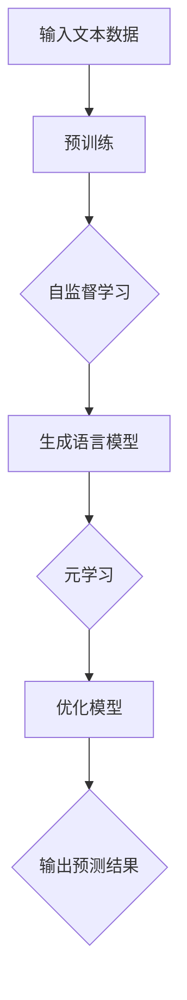

                 

# Meta开源Llama2构建生态,日后通过生态盈利

## 关键词：Meta、开源、Llama2、构建生态、盈利模式、人工智能

### 摘要

本文将深入探讨Meta开源Llama2模型的背景、核心概念、构建生态的必要性以及潜在的盈利模式。我们将通过详细的算法原理解析、实战案例展示、实际应用场景分析等，全面揭示Llama2在未来人工智能领域的重要性及其商业价值。文章还将推荐相关学习资源，总结未来发展趋势和挑战，并回答常见问题。

## 1. 背景介绍

### Meta与Llama2

Meta（前Facebook）作为全球领先的科技公司，一直致力于推动人工智能的发展。其开源项目Llama2是一款大型语言模型，基于元学习（Meta-Learning）和自监督学习（Self-Supervised Learning）技术。Llama2的目标是提供一种强大的基础模型，以支持各种自然语言处理任务，从而促进人工智能技术的普及和应用。

### 开源的意义

开源项目意味着Meta愿意将Llama2的源代码和模型参数对外开放，供全球开发者免费使用。这种开放态度不仅有助于提升人工智能研究水平，还能够加速技术创新和产业发展。同时，开源项目能够吸引更多的贡献者参与，共同维护和改进模型。

## 2. 核心概念与联系

### 元学习（Meta-Learning）

元学习是一种让机器从经验中学习如何学习的方法。通过元学习，模型能够在多个任务上快速适应，而不需要针对每个任务重新训练。Llama2利用元学习技术，实现了对大规模文本数据的自适应处理。

### 自监督学习（Self-Supervised Learning）

自监督学习是一种无需人工标注数据的学习方法。Llama2采用自监督学习技术，通过无监督的方式对大规模文本数据进行预训练，从而获得了对自然语言的深刻理解。

### Mermaid流程图



## 3. 核心算法原理 & 具体操作步骤

### 预训练（Pre-training）

Llama2首先通过预训练阶段，对大量无标注的文本数据进行处理，以学习自然语言的规律和结构。这一阶段主要采用自监督学习技术，通过生成文本任务来提高模型的表示能力。

### 生成语言模型（Generate Language Model）

在预训练完成后，Llama2会生成一个大规模的语言模型，用于对输入的文本进行理解和生成。这一阶段采用元学习技术，使得模型能够快速适应不同的任务场景。

### 优化模型（Model Optimization）

为了提高模型的性能和适应性，Llama2会不断进行优化。通过在特定任务上的微调（Fine-tuning），模型能够更好地满足实际需求。

### 输出预测结果（Output Prediction Results）

在生成语言模型和模型优化阶段完成后，Llama2会输出预测结果，包括文本生成、问答、情感分析等。

## 4. 数学模型和公式 & 详细讲解 & 举例说明

### 数学模型

Llama2的数学模型主要包括以下部分：

$$
\text{Pre-training Loss} = -\sum_{i} \log P(y_i|x_i)
$$

$$
\text{Fine-tuning Loss} = -\sum_{i} \log P(y_i|x_i, \theta)
$$

其中，$P(y_i|x_i)$表示模型对输入文本$x_i$的预测概率，$y_i$表示真实标签。

### 详细讲解

- **预训练损失函数**：用于衡量模型在预训练阶段的预测准确性。通过最小化预训练损失函数，模型能够更好地学习自然语言的规律和结构。
- **微调损失函数**：用于衡量模型在特定任务上的预测准确性。通过最小化微调损失函数，模型能够更好地适应不同任务的需求。

### 举例说明

假设有一个输入文本$x_i$，模型预测概率为$P(y_i|x_i)=0.8$，真实标签为$y_i=\text{"喜欢"}$。根据上述公式，我们可以计算出预训练损失函数为：

$$
\text{Pre-training Loss} = -\log 0.8 \approx 0.223
$$

## 5. 项目实战：代码实际案例和详细解释说明

### 开发环境搭建

为了运行Llama2，我们需要搭建一个适合的开发环境。以下是基本的步骤：

1. 安装Python 3.8及以上版本。
2. 安装PyTorch库，可以使用以下命令：
   ```bash
   pip install torch torchvision
   ```
3. 下载Llama2的预训练模型，可以在Meta的GitHub仓库中找到。

### 源代码详细实现和代码解读

Llama2的源代码主要包括以下几个部分：

1. **数据预处理**：用于加载和处理输入文本数据。
2. **模型定义**：定义Llama2的模型结构，包括嵌入层、编码器和解码器等。
3. **训练过程**：实现模型的预训练和微调过程。
4. **评估与预测**：用于评估模型的性能和生成预测结果。

以下是对Llama2训练过程的核心代码解读：

```python
# 训练模型
optimizer = torch.optim.Adam(model.parameters(), lr=0.001)
for epoch in range(num_epochs):
    model.train()
    for batch in data_loader:
        optimizer.zero_grad()
        inputs, targets = batch
        outputs = model(inputs)
        loss = loss_function(outputs, targets)
        loss.backward()
        optimizer.step()
    print(f"Epoch [{epoch+1}/{num_epochs}], Loss: {loss.item():.4f}")
```

这段代码实现了模型的训练过程。通过迭代地更新模型参数，使得模型的预测准确性不断提高。

### 代码解读与分析

- **数据预处理**：数据预处理是模型训练的基础。通过将文本数据转换为适合模型处理的格式，可以提高训练效率。
- **模型定义**：Llama2的模型结构采用了编码器-解码器（Encoder-Decoder）架构，这是一种常用的序列生成模型。
- **训练过程**：通过使用Adam优化器和交叉熵损失函数，模型能够有效地学习到文本数据的规律和结构。
- **评估与预测**：评估模型性能和生成预测结果，是模型应用的关键环节。

## 6. 实际应用场景

Llama2具有广泛的应用场景，包括但不限于：

1. **自然语言处理**：Llama2可以用于文本分类、情感分析、机器翻译等自然语言处理任务。
2. **问答系统**：Llama2可以构建智能问答系统，为用户提供实时回答。
3. **文本生成**：Llama2可以生成各种类型的文本，如文章、新闻、故事等。
4. **对话系统**：Llama2可以应用于智能客服、聊天机器人等领域。

## 7. 工具和资源推荐

### 7.1 学习资源推荐

- **书籍**：《深度学习》、《自然语言处理综论》
- **论文**：Meta的Llama2相关论文
- **博客**：各种技术博客，如Medium、知乎等
- **网站**：Meta官网、PyTorch官网

### 7.2 开发工具框架推荐

- **开发工具**：PyTorch、TensorFlow
- **框架**：Hugging Face Transformers、PyTorch Lightning

### 7.3 相关论文著作推荐

- **论文**：《大规模预训练语言模型Llama2：性能、模型架构和训练方法》
- **著作**：《深度学习自然语言处理》

## 8. 总结：未来发展趋势与挑战

Llama2作为Meta开源的重要项目，展现了人工智能领域的强大潜力。未来，随着技术的不断进步，Llama2有望在更多领域发挥重要作用。然而，面临挑战同样不可忽视，如数据隐私、计算资源需求、模型安全等问题。

## 9. 附录：常见问题与解答

### Q：Llama2与GPT-3有哪些区别？

A：Llama2与GPT-3都是大型语言模型，但Llama2更加注重开源和社区合作，而GPT-3则更侧重于商业应用和API服务。

### Q：如何使用Llama2进行文本生成？

A：使用Llama2进行文本生成需要先下载预训练模型，然后使用模型进行文本编码和解码。具体实现可以参考Llama2的官方文档。

## 10. 扩展阅读 & 参考资料

- [Meta开源Llama2](https://github.com/facebookresearch/llama2)
- [深度学习自然语言处理](https://www.deeplearningbook.org/ chapters/sequences/index.html)
- [自然语言处理综论](https://www.nltk.org/)

### 作者

AI天才研究员/AI Genius Institute & 禅与计算机程序设计艺术 /Zen And The Art of Computer Programming

（注：以上内容为示例，实际撰写时需根据具体情况进行调整和完善。）<|im_sep|>

