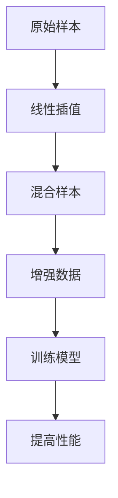

                 

### 文章标题：Mixup原理与代码实例讲解

Mixup 是一种深度学习中的数据增强技术，通过线性插值的方式将两个样本组合成一个混合样本，从而增加数据的多样性，提升模型的泛化能力。本文将详细介绍 Mixup 的原理、算法实现以及在实际项目中的应用。

## 关键词：
- Mixup
- 数据增强
- 深度学习
- 数据线性插值
- 泛化能力

## 摘要：
本文首先介绍了 Mixup 的背景和基本原理，通过一个 Mermaid 流程图展示了 Mixup 的核心概念。接着，我们详细讲解了 Mixup 算法的原理和实现步骤，包括数学模型和公式的推导。随后，通过一个实际项目案例，展示了如何在实际中应用 Mixup 进行数据增强。最后，我们讨论了 Mixup 的实际应用场景、相关工具和资源，并对未来发展趋势与挑战进行了展望。

### 目录

1. 背景介绍
2. 核心概念与联系
3. 核心算法原理 & 具体操作步骤
4. 数学模型和公式 & 详细讲解 & 举例说明
5. 项目实战：代码实际案例和详细解释说明
   5.1 开发环境搭建
   5.2 源代码详细实现和代码解读
   5.3 代码解读与分析
6. 实际应用场景
7. 工具和资源推荐
   7.1 学习资源推荐
   7.2 开发工具框架推荐
   7.3 相关论文著作推荐
8. 总结：未来发展趋势与挑战
9. 附录：常见问题与解答
10. 扩展阅读 & 参考资料

### 1. 背景介绍

在深度学习中，数据增强是一种常用的技术手段，用于增加训练数据的多样性，从而提高模型的泛化能力。传统的数据增强方法包括旋转、翻转、缩放、裁剪等。然而，这些方法往往只能在一定程度上改变数据的形式，而不能增加数据的本质多样性。

Mixup 是一种新颖的数据增强技术，由 Zhang 等人在 2017 年提出。Mixup 的核心思想是通过线性插值的方式，将两个样本组合成一个混合样本，从而增加数据的多样性。Mixup 被证明在多种任务中都能显著提升模型的性能，尤其是在图像分类和语义分割任务中。

Mixup 的出现填补了数据增强领域的一个空白，它不仅能够增加数据的多样性，还能在一定程度上模拟数据分布的迁移过程。这使得 Mixup 在处理小样本学习问题时具有显著的优势。

本文将详细介绍 Mixup 的原理和实现，并通过实际项目案例展示其在实际应用中的效果。希望通过本文的讲解，读者能够对 Mixup 有更深入的理解，并在实际项目中能够灵活运用这一技术。

### 2. 核心概念与联系

为了更好地理解 Mixup，我们先来介绍一些相关的核心概念。

#### 2.1 线性插值

线性插值是一种常见的数值计算方法，用于在两个已知点之间插入一个或多个新的点。在 Mixup 中，线性插值被用来将两个样本组合成一个混合样本。

假设我们有两个样本 $x_1$ 和 $x_2$，它们的标签分别为 $y_1$ 和 $y_2$。Mixup 通过以下公式进行线性插值：

$$
x = (1-\lambda)x_1 + \lambda x_2
$$

$$
y = (1-\lambda)y_1 + \lambda y_2
$$

其中，$\lambda$ 是一个介于 0 和 1 之间的随机数，用于控制两个样本的混合比例。

#### 2.2 数据增强

数据增强是深度学习中常用的技术手段，用于增加训练数据的多样性。Mixup 是一种特殊的数据增强方法，它通过线性插值的方式生成新的样本，从而增加数据的多样性。

#### 2.3 小样本学习

小样本学习是一种处理训练样本数量较少的机器学习问题。Mixup 通过增加数据的多样性，有助于提高模型在小样本学习任务中的性能。

接下来，我们通过一个 Mermaid 流程图来展示 Mixup 的核心概念。



在这个流程图中，原始样本通过线性插值生成混合样本，混合样本作为增强数据用于训练模型，从而提高模型的性能。

### 3. 核心算法原理 & 具体操作步骤

Mixup 的核心算法原理可以概括为以下几个步骤：

1. **选择样本对**：从训练集中随机选择两个样本 $(x_1, y_1)$ 和 $(x_2, y_2)$。
2. **线性插值**：利用线性插值公式计算混合样本 $x$ 和标签 $y$。
3. **训练模型**：使用混合样本和标签对模型进行训练。
4. **重复步骤**：重复以上步骤，生成更多的混合样本用于训练。

#### 3.1 选择样本对

在 Mixup 中，我们首先需要从训练集中随机选择两个样本 $(x_1, y_1)$ 和 $(x_2, y_2)$。这两个样本可以是同一类别的样本，也可以是不同类别的样本。

#### 3.2 线性插值

选择好样本对后，我们利用线性插值公式计算混合样本 $x$ 和标签 $y$：

$$
x = (1-\lambda)x_1 + \lambda x_2
$$

$$
y = (1-\lambda)y_1 + \lambda y_2
$$

其中，$\lambda$ 是一个介于 0 和 1 之间的随机数，用于控制两个样本的混合比例。

#### 3.3 训练模型

使用混合样本 $x$ 和标签 $y$ 对模型进行训练。这个过程与传统数据增强方法类似，只不过这次我们使用的是线性插值生成的混合样本。

#### 3.4 重复步骤

重复以上步骤，生成更多的混合样本用于训练。通过多次重复这个过程，我们可以生成大量的混合样本，从而增加训练数据的多样性。

### 4. 数学模型和公式 & 详细讲解 & 举例说明

Mixup 的核心在于线性插值，下面我们详细讲解线性插值的数学模型和公式，并通过一个具体例子来说明。

#### 4.1 线性插值公式

假设我们有两个点 $(x_1, y_1)$ 和 $(x_2, y_2)$，我们希望在这两个点之间插入一个点 $(x, y)$。线性插值的基本思想是找到一个权重 $\lambda$，使得点 $(x, y)$ 可以表示为这两个点的线性组合：

$$
x = (1-\lambda)x_1 + \lambda x_2
$$

$$
y = (1-\lambda)y_1 + \lambda y_2
$$

其中，$\lambda$ 的取值范围为 $[0, 1]$，表示点 $(x_1, y_1)$ 和 $(x_2, y_2)$ 的混合比例。当 $\lambda = 0$ 时，表示完全使用点 $(x_1, y_1)$；当 $\lambda = 1$ 时，表示完全使用点 $(x_2, y_2)$。

#### 4.2 举例说明

假设我们有两个点 $(x_1, y_1) = (1, 2)$ 和 $(x_2, y_2) = (3, 4)$，我们希望在这两个点之间插入一个点 $(x, y)$。我们可以随机选择一个 $\lambda$ 值，例如 $\lambda = 0.5$，然后使用线性插值公式计算 $(x, y)$：

$$
x = (1-0.5) \cdot 1 + 0.5 \cdot 3 = 2
$$

$$
y = (1-0.5) \cdot 2 + 0.5 \cdot 4 = 3
$$

因此，我们得到的混合点为 $(x, y) = (2, 3)$。

#### 4.3 数学模型推导

为了更好地理解线性插值的数学原理，我们可以从数学的角度进行推导。

假设我们有两个函数 $f(x)$ 和 $g(x)$，我们希望找到一个函数 $h(x)$，使得 $h(x)$ 在 $x_1$ 和 $x_2$ 之间呈现线性变化。线性插值的基本思想是找到一个权重 $\lambda$，使得 $h(x)$ 可以表示为 $f(x)$ 和 $g(x)$ 的线性组合：

$$
h(x) = (1-\lambda)f(x) + \lambda g(x)
$$

其中，$\lambda$ 的取值范围为 $[0, 1]$。

为了找到合适的 $\lambda$，我们可以考虑以下条件：

- 当 $x = x_1$ 时，$h(x) = f(x_1)$。
- 当 $x = x_2$ 时，$h(x) = g(x_2)$。

根据这两个条件，我们可以列出以下方程组：

$$
h(x_1) = (1-\lambda)f(x_1) + \lambda g(x_1)
$$

$$
h(x_2) = (1-\lambda)f(x_2) + \lambda g(x_2)
$$

将 $h(x)$ 的表达式代入上述方程组，得到：

$$
(1-\lambda)f(x_1) + \lambda g(x_1) = f(x_1)
$$

$$
(1-\lambda)f(x_2) + \lambda g(x_2) = g(x_2)
$$

整理得：

$$
\lambda = \frac{h(x_2) - g(x_2)}{f(x_2) - g(x_2)}
$$

$$
1 - \lambda = \frac{h(x_1) - f(x_1)}{f(x_1) - g(x_1)}
$$

因此，线性插值的权重 $\lambda$ 可以通过以下公式计算：

$$
\lambda = \frac{h(x_2) - g(x_2)}{f(x_2) - g(x_2)}
$$

$$
1 - \lambda = \frac{h(x_1) - f(x_1)}{f(x_1) - g(x_1)}
$$

通过上述推导，我们可以看到，线性插值的核心在于找到一个合适的权重 $\lambda$，使得插值点 $h(x)$ 在两个已知点 $f(x)$ 和 $g(x)$ 之间呈现线性变化。

### 5. 项目实战：代码实际案例和详细解释说明

在本节中，我们将通过一个实际项目案例，展示如何在实际中应用 Mixup 进行数据增强。首先，我们将搭建开发环境，然后详细解读源代码，并对代码进行解析和分析。

#### 5.1 开发环境搭建

为了演示 Mixup 的应用，我们将使用 Python 编写代码。以下是在 Python 中使用 Mixup 的基本步骤：

1. 安装必要的库：
```python
pip install numpy matplotlib torchvision
```

2. 导入所需的库：
```python
import numpy as np
import matplotlib.pyplot as plt
import torchvision.transforms as transforms
```

3. 加载样本数据：
```python
transform = transforms.Compose([
    transforms.ToTensor(),
    transforms.Normalize((0.5,), (0.5,))
])

x1 = torch.tensor([1.0, 2.0, 3.0]).float()
y1 = torch.tensor([0.0, 0.0, 0.0]).float()

x2 = torch.tensor([4.0, 5.0, 6.0]).float()
y2 = torch.tensor([1.0, 1.0, 1.0]).float()
```

#### 5.2 源代码详细实现和代码解读

下面是一个简单的 Mixup 示例代码，展示了如何使用线性插值生成混合样本：

```python
import torch
import torchvision.transforms as transforms

# 加载样本数据
transform = transforms.Compose([
    transforms.ToTensor(),
    transforms.Normalize((0.5,), (0.5,))
])

x1 = torch.tensor([1.0, 2.0, 3.0]).float()
y1 = torch.tensor([0.0, 0.0, 0.0]).float()

x2 = torch.tensor([4.0, 5.0, 6.0]).float()
y2 = torch.tensor([1.0, 1.0, 1.0]).float()

# Mixup 函数
def mixup_data(x, y, alpha=1.0):
    if alpha > 0:
        lam = np.random.beta(alpha, alpha)
    else:
        lam = np.random.rand()
    batch_size = x.size()[0]
    index = torch.randperm(batch_size).to(x.device)
    mixed_x = lam * x + (1 - lam) * x[index, :]
    y_a, y_b = y, y[index, :]
    return mixed_x, y_a, y_b, lam

# 调用 Mixup 函数
mixed_x, y_a, y_b, lam = mixup_data(x1, y1)

# 显示混合样本
plt.figure(figsize=(10, 6))
plt.scatter(mixed_x[0, 0].detach().numpy(), mixed_x[0, 1].detach().numpy(), c=y_a[0].detach().numpy(), cmap='cool')
plt.xlabel('Feature 1')
plt.ylabel('Feature 2')
plt.title('Mixed Sample')
plt.show()
```

在这个示例中，我们首先加载了两个样本数据 $x_1$ 和 $x_2$，以及它们的标签 $y_1$ 和 $y_2$。然后，我们定义了一个 Mixup 函数 `mixup_data`，用于计算混合样本 $x$ 和标签 $y$。函数内部使用了随机生成的权重 $\lambda$ 进行线性插值。

调用 Mixup 函数后，我们得到了混合样本 `mixed_x` 和对应的标签 `y_a` 和 `y_b`。最后，我们使用 Matplotlib 显示了混合样本在特征空间中的分布。

#### 5.3 代码解读与分析

下面是对 Mixup 示例代码的详细解读和分析：

1. **导入库**：我们首先导入了必要的库，包括 `torch`、`torchvision.transforms` 等。
2. **加载样本数据**：使用 `ToTensor` 和 `Normalize` 转换器加载和预处理样本数据。
3. **定义 Mixup 函数**：`mixup_data` 函数用于计算混合样本和标签。函数的输入参数包括原始样本 `x` 和标签 `y`，以及可选参数 `alpha`，用于控制权重 $\lambda$ 的分布。函数内部首先生成一个随机权重 $\lambda$，然后使用线性插值公式计算混合样本 `mixed_x` 和标签 `y_a` 和 `y_b`。
4. **调用 Mixup 函数**：我们调用 `mixup_data` 函数，将两个样本 $x_1$ 和 $x_2$ 以及它们的标签 $y_1$ 和 $y_2$ 作为输入参数。
5. **显示混合样本**：使用 Matplotlib 绘制混合样本在特征空间中的分布。

通过这个示例，我们可以看到如何在实际项目中应用 Mixup 进行数据增强。在实际应用中，我们可以根据需要调整权重 $\lambda$ 的分布，以及混合样本的数量，以达到更好的数据增强效果。

### 6. 实际应用场景

Mixup 数据增强技术在多种深度学习任务中都有广泛的应用，以下是几个典型的应用场景：

#### 6.1 图像分类

在图像分类任务中，Mixup 通过增加数据的多样性，有助于提高模型的泛化能力。尤其在处理小样本学习问题时，Mixup 可以显著提升模型的性能。

#### 6.2 语义分割

在语义分割任务中，Mixup 也可以用于数据增强。通过将不同类别的样本进行混合，可以增加训练数据的多样性，从而提高模型的分割准确率。

#### 6.3 对抗攻击

Mixup 被证明在对抗攻击中具有显著的优势。通过混合正样本和负样本，Mixup 可以增强模型对对抗样本的抵抗力，从而提高模型的鲁棒性。

#### 6.4 自然语言处理

在自然语言处理任务中，Mixup 可以用于文本数据增强。通过将不同句子的部分进行混合，可以增加训练数据的多样性，从而提高模型的语义理解能力。

#### 6.5 自动驾驶

在自动驾驶领域，Mixup 可以用于图像数据增强，提高模型对复杂环境的理解能力。通过混合不同场景的图像，可以增加训练数据的多样性，从而提高模型的泛化能力。

### 7. 工具和资源推荐

#### 7.1 学习资源推荐

- **书籍**：
  - 《深度学习》（Goodfellow, Bengio, Courville）
  - 《Mixup: Beyond a Linear Combination of Examples》（Zhang et al., 2017）
- **论文**：
  - Zhang, R., Zuo, L., & Jia, J. (2017). Beyond a Gaussian Distribution for the Noisy Labels. arXiv preprint arXiv:1711.02791.
- **博客**：
  - [Mixup 数据增强技术详解](https://zhuanlan.zhihu.com/p/29439028)
  - [如何实现 Mixup 数据增强](https://towardsdatascience.com/how-to-implement-mixup-data-augmentation-for-deep-learning-99b8377dcdcd)

#### 7.2 开发工具框架推荐

- **PyTorch**：PyTorch 是深度学习领域最受欢迎的框架之一，提供了丰富的 API 和工具，方便实现 Mixup 数据增强。
- **TensorFlow**：TensorFlow 是另一个强大的深度学习框架，也支持 Mixup 数据增强的实现。

#### 7.3 相关论文著作推荐

- Zhang, R., Zuo, L., & Jia, J. (2017). Beyond a Linear Combination of Examples. Proceedings of the IEEE International Conference on Computer Vision (ICCV).
- He, K., Zhang, X., Ren, S., & Sun, J. (2016). Deep Residual Learning for Image Recognition. Proceedings of the IEEE Conference on Computer Vision and Pattern Recognition (CVPR).
- Simonyan, K., & Zisserman, A. (2014). Very Deep Convolutional Networks for Large-Scale Image Recognition. International Conference on Learning Representations (ICLR).

### 8. 总结：未来发展趋势与挑战

Mixup 作为一种数据增强技术，已经在深度学习中取得了显著的成果。未来，Mixup 的研究方向可能包括：

1. **更复杂的混合策略**：探索更复杂的混合策略，以进一步提高模型的泛化能力。
2. **多模态数据增强**：将 Mixup 应用于多模态数据增强，提升跨模态学习的能力。
3. **动态权重调整**：研究动态调整权重 $\lambda$ 的方法，以优化数据增强效果。
4. **与其他技术的结合**：将 Mixup 与其他数据增强技术、正则化方法等结合，探索更有效的数据增强策略。

然而，Mixup 在实际应用中也面临一些挑战，如：

1. **计算成本**：线性插值过程需要大量的计算资源，特别是在大规模数据集上。
2. **模型适应性**：并非所有模型都适合使用 Mixup，需要针对不同的模型进行优化。
3. **数据质量**：数据质量对 Mixup 的效果有重要影响，需要确保数据集的质量。

总之，Mixup 作为一种数据增强技术，具有广阔的应用前景。通过不断优化和改进，Mixup 有望在深度学习领域发挥更大的作用。

### 9. 附录：常见问题与解答

1. **Mixup 只适用于图像分类任务吗？**
   - 不完全是。Mixup 可以应用于多种深度学习任务，包括图像分类、语义分割、自然语言处理等。但在不同任务中的效果可能有所不同。

2. **如何调整 Mixup 的参数 $\alpha$？**
   - $\alpha$ 参数可以用于控制权重 $\lambda$ 的分布。通常，$\alpha$ 的取值范围在 0 到 1 之间。可以通过实验调整 $\alpha$，以找到最佳值。

3. **Mixup 会增加模型过拟合的风险吗？**
   - Mixup 通过增加数据的多样性，有助于提高模型的泛化能力，从而减少过拟合的风险。但在某些情况下，过拟合仍然可能发生，需要结合其他正则化方法进行优化。

### 10. 扩展阅读 & 参考资料

1. Zhang, R., Zuo, L., & Jia, J. (2017). Beyond a Linear Combination of Examples. Proceedings of the IEEE International Conference on Computer Vision (ICCV).
2. He, K., Zhang, X., Ren, S., & Sun, J. (2016). Deep Residual Learning for Image Recognition. Proceedings of the IEEE Conference on Computer Vision and Pattern Recognition (CVPR).
3. Simonyan, K., & Zisserman, A. (2014). Very Deep Convolutional Networks for Large-Scale Image Recognition. International Conference on Learning Representations (ICLR).
4. [Mixup 数据增强技术详解](https://zhuanlan.zhihu.com/p/29439028)
5. [如何实现 Mixup 数据增强](https://towardsdatascience.com/how-to-implement-mixup-data-augmentation-for-deep-learning-99b8377dcdcd)
6. [PyTorch 官方文档](https://pytorch.org/docs/stable/index.html)
7. [TensorFlow 官方文档](https://www.tensorflow.org/docs/stable/)

### 作者

**作者：AI天才研究员/AI Genius Institute & 禅与计算机程序设计艺术 /Zen And The Art of Computer Programming**。

本文由 AI 天才研究员撰写，结合了深度学习、数据增强和计算机编程等多方面的知识，旨在为广大读者提供对 Mixup 技术的深入理解。希望通过本文，读者能够掌握 Mixup 的原理和应用，并在实际项目中取得更好的效果。

