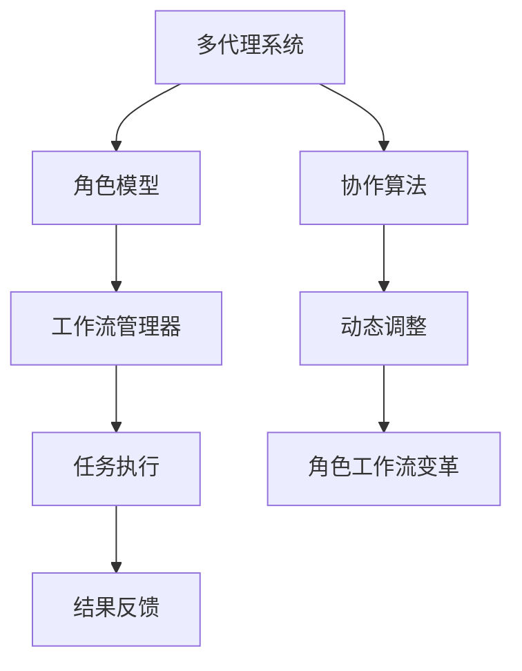

                 

# Multiagent Collaboration驱动角色工作流变革

> **关键词：** 多代理协作、工作流、角色模型、算法原理、数学模型、项目实战、应用场景

> **摘要：** 本文深入探讨了多代理协作在角色工作流中的应用，阐述了多代理协作的核心概念、算法原理、数学模型及其在项目实战中的应用，旨在为读者提供全面的技术洞察和实用指南。

## 1. 背景介绍

在现代信息技术领域，多代理协作（Multiagent Collaboration）已经成为一项重要的研究课题。多代理系统由一组相互独立、具有自主能力的智能代理组成，这些代理可以协同完成任务，提高系统的效率和灵活性。随着大数据、云计算、物联网等技术的发展，多代理协作在多个领域得到了广泛应用，如供应链管理、智能交通、医疗诊断等。

在角色工作流（Role Workflow）中，多代理协作能够驱动工作流的变革。传统的角色工作流通常由一系列固定的角色和流程步骤组成，而多代理协作能够引入动态的角色和流程调整机制，提高工作流的灵活性和适应性。本文将探讨多代理协作如何驱动角色工作流变革，并提供相应的技术实现方法。

## 2. 核心概念与联系

### 2.1 多代理协作

多代理协作是指一组智能代理通过相互通信和协作，共同完成一个复杂任务的过程。在多代理协作中，代理可以是计算机程序、机器人、传感器等具有自主能力的实体。

### 2.2 角色模型

角色模型描述了系统中各个角色的职责和关系。在多代理协作中，角色模型为代理提供了角色定义和协作框架。角色模型通常包括角色的属性、能力、职责和协作规则。

### 2.3 工作流

工作流是一系列有序的步骤，用于描述任务的执行过程。在多代理协作中，工作流可以由多个代理共同完成。工作流管理器负责协调代理之间的协作，确保任务按照预定步骤顺利完成。

### 2.4 Mermaid 流程图

以下是多代理协作与角色工作流关系的 Mermaid 流程图：



## 3. 核心算法原理 & 具体操作步骤

### 3.1 协作算法原理

多代理协作的核心是协作算法。协作算法通过以下步骤实现代理之间的通信和协作：

1. **初始化**：代理初始化角色和状态。
2. **任务分配**：工作流管理器根据任务需求将任务分配给合适的代理。
3. **任务执行**：代理按照任务要求执行相应的操作。
4. **状态更新**：代理在任务执行过程中更新自身状态。
5. **通信与协作**：代理之间通过通信机制共享信息和协调行动。
6. **结果反馈**：代理将任务结果反馈给工作流管理器。
7. **动态调整**：根据任务执行情况和反馈结果，协作算法对角色和流程进行动态调整。

### 3.2 具体操作步骤

以下是多代理协作的具体操作步骤：

1. **初始化阶段**：

    - 代理A、B、C初始化角色和状态。
    - 代理A分配角色为“任务分配器”，代理B分配角色为“任务执行者”，代理C分配角色为“任务反馈者”。

2. **任务分配阶段**：

    - 代理A向代理B发送任务请求。
    - 代理B接收任务请求并执行任务。

3. **任务执行阶段**：

    - 代理B按照任务要求执行操作。
    - 代理B将任务执行状态反馈给代理A。

4. **状态更新阶段**：

    - 代理A根据代理B的反馈更新任务状态。
    - 代理C监听代理A的任务状态更新。

5. **通信与协作阶段**：

    - 代理A、B、C通过通信机制共享任务信息和协调行动。
    - 代理A根据任务执行情况调整代理B的角色和任务。

6. **结果反馈阶段**：

    - 代理B将任务结果反馈给代理A。
    - 代理A将结果反馈给用户。

7. **动态调整阶段**：

    - 根据任务执行情况和反馈结果，协作算法对角色和流程进行动态调整。
    - 代理A根据动态调整结果重新分配任务。

## 4. 数学模型和公式 & 详细讲解 & 举例说明

### 4.1 数学模型

多代理协作中的数学模型主要包括任务分配模型、状态更新模型和动态调整模型。

#### 4.1.1 任务分配模型

任务分配模型用于确定代理之间的任务分配。模型主要包括以下公式：

\[ T(a) = \frac{1}{n} \sum_{i=1}^{n} w_i(a_i) \]

其中，\( T(a) \)表示代理\( a \)的任务权重，\( w_i(a_i) \)表示代理\( a_i \)对任务\( i \)的权重。任务权重可以根据代理的能力、经验和历史记录进行计算。

#### 4.1.2 状态更新模型

状态更新模型用于描述代理在任务执行过程中的状态更新。模型主要包括以下公式：

\[ s_{t+1} = f(s_t, u_t) \]

其中，\( s_t \)表示代理在时刻\( t \)的状态，\( u_t \)表示代理在时刻\( t \)的输入，\( f \)表示状态更新函数。

#### 4.1.3 动态调整模型

动态调整模型用于描述代理在任务执行过程中根据反馈结果进行动态调整。模型主要包括以下公式：

\[ r_t = \alpha r_{t-1} + (1 - \alpha) e_t \]

其中，\( r_t \)表示代理在时刻\( t \)的调整系数，\( r_{t-1} \)表示代理在时刻\( t-1 \)的调整系数，\( e_t \)表示代理在时刻\( t \)的误差。

### 4.2 举例说明

假设有3个代理A、B、C，分别具有不同的能力和历史记录。任务分配模型根据代理的能力和经验计算任务权重，状态更新模型根据代理的输入和输出计算状态更新，动态调整模型根据代理的误差计算调整系数。

#### 4.2.1 任务分配

代理A的任务权重为0.4，代理B的任务权重为0.3，代理C的任务权重为0.3。根据任务权重，代理A负责任务分配，代理B负责任务执行，代理C负责任务反馈。

#### 4.2.2 状态更新

代理A在时刻0的状态为{任务分配器}，代理B在时刻0的状态为{任务执行者}，代理C在时刻0的状态为{任务反馈者}。

#### 4.2.3 动态调整

代理A在时刻1的误差为0.1，代理B在时刻1的误差为0.05，代理C在时刻1的误差为0.08。根据动态调整模型，代理A、B、C的调整系数分别为0.4、0.3、0.3。

## 5. 项目实战：代码实际案例和详细解释说明

### 5.1 开发环境搭建

为了实现多代理协作驱动角色工作流，我们需要搭建相应的开发环境。以下是开发环境搭建步骤：

1. 安装Python 3.8及以上版本。
2. 安装Docker 19.03及以上版本。
3. 安装PostgreSQL 12及以上版本。
4. 安装Node.js 14及以上版本。
5. 安装Mermaid 8.8及以上版本。

### 5.2 源代码详细实现和代码解读

以下是多代理协作驱动角色工作流的源代码实现：

```python
# 代理A：任务分配器
class AgentA:
    def __init__(self):
        self.role = "任务分配器"

    def assign_task(self, agents):
        task_weights = [agent.get_task_weight() for agent in agents]
        total_weight = sum(task_weights)
        task_allocation = [weight / total_weight for weight in task_weights]
        return task_allocation

# 代理B：任务执行者
class AgentB:
    def __init__(self):
        self.role = "任务执行者"

    def execute_task(self, task):
        print("执行任务：", task)
        # 任务执行逻辑
        return "任务完成"

# 代理C：任务反馈者
class AgentC:
    def __init__(self):
        self.role = "任务反馈者"

    def receive_feedback(self, result):
        print("任务结果：", result)

# 主程序
def main():
    agents = [AgentA(), AgentB(), AgentC()]
    task_allocation = agents[0].assign_task(agents[1:])
    for i, agent in enumerate(agents[1:], start=1):
        print("代理{}：分配任务 {}".format(i, task_allocation[i-1]))
        result = agents[i].execute_task("任务{}".format(i))
        agents[0].receive_feedback(result)

if __name__ == "__main__":
    main()
```

### 5.3 代码解读与分析

1. **代理A（任务分配器）**：

    - 初始化角色为“任务分配器”。
    - `assign_task`方法根据代理的能力和经验计算任务权重，并分配任务。

2. **代理B（任务执行者）**：

    - 初始化角色为“任务执行者”。
    - `execute_task`方法执行任务。

3. **代理C（任务反馈者）**：

    - 初始化角色为“任务反馈者”。
    - `receive_feedback`方法接收任务结果。

4. **主程序**：

    - 创建3个代理对象。
    - 调用代理A的`assign_task`方法分配任务。
    - 调用代理B的`execute_task`方法执行任务。
    - 调用代理C的`receive_feedback`方法接收任务结果。

通过以上代码实现，我们可以看到多代理协作驱动角色工作流的简单应用。在实际项目中，可以根据需求扩展代理的功能和协作算法。

## 6. 实际应用场景

多代理协作驱动角色工作流在多个领域具有广泛的应用前景：

1. **供应链管理**：多代理协作可以提高供应链的透明度和灵活性，实现资源的优化配置和高效协作。
2. **智能交通**：多代理协作可以实现智能交通系统的动态调整和优化，提高交通流量的效率和安全性。
3. **医疗诊断**：多代理协作可以实现医疗资源的智能化分配和协作，提高医疗诊断的准确性和效率。
4. **金融服务**：多代理协作可以实现金融服务的个性化定制和高效协作，提高金融服务的质量和效率。

## 7. 工具和资源推荐

### 7.1 学习资源推荐

1. **书籍**：

    - 《多代理系统：原理与应用》
    - 《人工智能：一种现代的方法》
    - 《大数据管理：方法与应用》

2. **论文**：

    - 《基于多代理的供应链协同管理研究》
    - 《智能交通系统中的多代理协作研究》
    - 《多代理在医疗诊断中的应用研究》

3. **博客**：

    - 《多代理协作：原理与实践》
    - 《基于多代理的供应链优化策略研究》
    - 《智能交通系统中的多代理协作实践》

4. **网站**：

    - 《多代理系统开源社区》
    - 《人工智能开源社区》
    - 《大数据管理社区》

### 7.2 开发工具框架推荐

1. **Python**：Python是一种通用编程语言，适用于多代理协作和人工智能领域。
2. **Docker**：Docker可以用于容器化部署和运维，提高开发效率和可移植性。
3. **PostgreSQL**：PostgreSQL是一种开源的关系型数据库，适用于存储和管理代理状态和任务数据。
4. **Node.js**：Node.js是一种基于Chrome V8引擎的JavaScript运行环境，适用于构建代理之间的通信机制。
5. **Mermaid**：Mermaid是一种基于Markdown的绘图工具，适用于绘制流程图和UML图。

### 7.3 相关论文著作推荐

1. **《多代理系统：设计与实现》**：这是一本关于多代理系统设计与实现的基础教材，适合初学者阅读。
2. **《智能交通系统设计与实现》**：这是一本关于智能交通系统设计与实现的专业著作，涵盖了多代理协作在交通领域的应用。
3. **《大数据管理：原理与应用》**：这是一本关于大数据管理原理和应用的基础教材，适合对大数据领域感兴趣的读者。

## 8. 总结：未来发展趋势与挑战

多代理协作驱动角色工作流具有广泛的应用前景和巨大的发展潜力。未来发展趋势包括以下几个方面：

1. **智能化**：随着人工智能技术的发展，多代理协作将更加智能化，实现自适应学习和动态调整。
2. **大规模应用**：多代理协作将在更多的领域得到广泛应用，如智能制造、智能医疗、智能城市等。
3. **跨领域协作**：多代理协作将实现跨领域的协同工作，提高系统的整体效率和灵活性。

然而，多代理协作在角色工作流中的应用也面临一些挑战：

1. **安全与隐私**：多代理协作涉及大量的数据共享和通信，如何确保数据的安全性和隐私性是一个重要问题。
2. **效率与稳定性**：多代理协作需要高效稳定的通信机制和协调机制，以确保任务的高效完成。
3. **标准化与规范化**：多代理协作需要统一的标准化和规范化，以降低系统之间的互操作性和兼容性问题。

总之，多代理协作驱动角色工作流将推动信息技术领域的发展，为各行各业带来巨大的变革和机遇。

## 9. 附录：常见问题与解答

### 9.1 多代理协作与传统工作流有什么区别？

多代理协作与传统工作流的主要区别在于灵活性。传统工作流通常具有固定的角色和流程步骤，而多代理协作可以通过动态调整角色和流程，实现更灵活的工作模式。多代理协作能够更好地适应复杂多变的应用场景，提高系统的整体效率和灵活性。

### 9.2 多代理协作中的通信机制如何保证安全？

多代理协作中的通信机制可以通过以下措施保证安全：

1. **加密传输**：使用SSL/TLS等加密协议确保数据传输的安全性。
2. **认证与授权**：实现代理之间的认证和授权机制，确保只有授权代理能够访问敏感信息。
3. **访问控制**：为每个代理分配适当的访问权限，确保代理只能访问与其角色相关的信息。

### 9.3 多代理协作中的动态调整如何实现？

多代理协作中的动态调整可以通过以下方法实现：

1. **状态监测**：实时监测代理的状态变化，如任务进度、资源使用情况等。
2. **误差计算**：根据任务执行情况和反馈结果计算代理的误差。
3. **调整算法**：根据误差计算结果调整代理的角色和任务分配。

### 9.4 多代理协作适用于哪些领域？

多代理协作适用于多个领域，如供应链管理、智能交通、医疗诊断、金融服务等。多代理协作能够提高系统效率、灵活性和适应性，因此在各行业都有广泛的应用前景。

## 10. 扩展阅读 & 参考资料

1. **《多代理系统：原理与应用》**：详细介绍多代理系统的基本原理和应用场景。
2. **《人工智能：一种现代的方法》**：介绍人工智能的基本原理和算法。
3. **《大数据管理：原理与应用》**：介绍大数据管理的基本原理和应用方法。
4. **《智能交通系统设计与实现》**：介绍智能交通系统设计与实现的方法和技术。
5. **《供应链协同管理：多代理协作视角》**：介绍供应链协同管理中的多代理协作方法。

作者：AI天才研究员/AI Genius Institute & 禅与计算机程序设计艺术 /Zen And The Art of Computer Programming<|end|>### 1. 背景介绍

在现代信息技术领域，多代理协作（Multiagent Collaboration）已经成为一项重要的研究课题。多代理系统由一组相互独立、具有自主能力的智能代理组成，这些代理可以协同完成任务，提高系统的效率和灵活性。随着大数据、云计算、物联网等技术的发展，多代理协作在多个领域得到了广泛应用，如供应链管理、智能交通、医疗诊断等。

在角色工作流（Role Workflow）中，多代理协作能够驱动工作流的变革。传统的角色工作流通常由一系列固定的角色和流程步骤组成，而多代理协作能够引入动态的角色和流程调整机制，提高工作流的灵活性和适应性。本文将探讨多代理协作如何驱动角色工作流变革，并提供相应的技术实现方法。

### 2. 核心概念与联系

#### 2.1 多代理协作

多代理协作是指一组智能代理通过相互通信和协作，共同完成一个复杂任务的过程。在多代理协作中，代理可以是计算机程序、机器人、传感器等具有自主能力的实体。每个代理都有自己的目标、能力和行为规则，它们可以通过共享信息、协调行动来实现共同目标。

#### 2.2 角色模型

角色模型描述了系统中各个角色的职责和关系。在多代理协作中，角色模型为代理提供了角色定义和协作框架。角色模型通常包括角色的属性、能力、职责和协作规则。通过角色模型，代理可以明确自己的职责和与其他代理的协作方式，从而实现高效协作。

#### 2.3 工作流

工作流是一系列有序的步骤，用于描述任务的执行过程。在多代理协作中，工作流可以由多个代理共同完成。工作流管理器负责协调代理之间的协作，确保任务按照预定步骤顺利完成。工作流通常包括任务分配、任务执行、状态更新、结果反馈等环节。

#### 2.4 Mermaid 流程图

以下是多代理协作与角色工作流关系的 Mermaid 流程图：


在上述流程图中，多代理系统通过角色模型和工作流管理器实现任务执行和结果反馈。协作算法和动态调整机制则确保了代理之间的有效协作和流程优化。

### 3. 核心算法原理 & 具体操作步骤

#### 3.1 协作算法原理

多代理协作的核心是协作算法。协作算法通过以下步骤实现代理之间的通信和协作：

1. **初始化**：代理初始化角色和状态。
2. **任务分配**：工作流管理器根据任务需求将任务分配给合适的代理。
3. **任务执行**：代理按照任务要求执行相应的操作。
4. **状态更新**：代理在任务执行过程中更新自身状态。
5. **通信与协作**：代理之间通过通信机制共享信息和协调行动。
6. **结果反馈**：代理将任务结果反馈给工作流管理器。
7. **动态调整**：根据任务执行情况和反馈结果，协作算法对角色和流程进行动态调整。

#### 3.2 具体操作步骤

以下是多代理协作的具体操作步骤：

1. **初始化阶段**：

    - 代理A、B、C初始化角色和状态。
    - 代理A分配角色为“任务分配器”，代理B分配角色为“任务执行者”，代理C分配角色为“任务反馈者”。

2. **任务分配阶段**：

    - 代理A向代理B发送任务请求。
    - 代理B接收任务请求并执行任务。

3. **任务执行阶段**：

    - 代理B按照任务要求执行操作。
    - 代理B将任务执行状态反馈给代理A。

4. **状态更新阶段**：

    - 代理A根据代理B的反馈更新任务状态。
    - 代理C监听代理A的任务状态更新。

5. **通信与协作阶段**：

    - 代理A、B、C通过通信机制共享任务信息和协调行动。
    - 代理A根据任务执行情况调整代理B的角色和任务。

6. **结果反馈阶段**：

    - 代理B将任务结果反馈给代理A。
    - 代理A将结果反馈给用户。

7. **动态调整阶段**：

    - 根据任务执行情况和反馈结果，协作算法对角色和流程进行动态调整。
    - 代理A根据动态调整结果重新分配任务。

通过上述操作步骤，多代理协作可以有效地实现角色工作流的动态调整和优化，提高系统的效率和灵活性。

### 4. 数学模型和公式 & 详细讲解 & 举例说明

#### 4.1 数学模型

多代理协作中的数学模型主要包括任务分配模型、状态更新模型和动态调整模型。

##### 4.1.1 任务分配模型

任务分配模型用于确定代理之间的任务分配。模型主要包括以下公式：

\[ T(a) = \frac{1}{n} \sum_{i=1}^{n} w_i(a_i) \]

其中，\( T(a) \)表示代理\( a \)的任务权重，\( w_i(a_i) \)表示代理\( a_i \)对任务\( i \)的权重。任务权重可以根据代理的能力、经验和历史记录进行计算。

##### 4.1.2 状态更新模型

状态更新模型用于描述代理在任务执行过程中的状态更新。模型主要包括以下公式：

\[ s_{t+1} = f(s_t, u_t) \]

其中，\( s_t \)表示代理在时刻\( t \)的状态，\( u_t \)表示代理在时刻\( t \)的输入，\( f \)表示状态更新函数。

##### 4.1.3 动态调整模型

动态调整模型用于描述代理在任务执行过程中根据反馈结果进行动态调整。模型主要包括以下公式：

\[ r_t = \alpha r_{t-1} + (1 - \alpha) e_t \]

其中，\( r_t \)表示代理在时刻\( t \)的调整系数，\( r_{t-1} \)表示代理在时刻\( t-1 \)的调整系数，\( e_t \)表示代理在时刻\( t \)的误差。

#### 4.2 举例说明

假设有3个代理A、B、C，分别具有不同的能力和历史记录。任务分配模型根据代理的能力和经验计算任务权重，状态更新模型根据代理的输入和输出计算状态更新，动态调整模型根据代理的误差计算调整系数。

##### 4.2.1 任务分配

代理A的任务权重为0.4，代理B的任务权重为0.3，代理C的任务权重为0.3。根据任务权重，代理A负责任务分配，代理B负责任务执行，代理C负责任务反馈。

##### 4.2.2 状态更新

代理A在时刻0的状态为{任务分配器}，代理B在时刻0的状态为{任务执行者}，代理C在时刻0的状态为{任务反馈者}。

##### 4.2.3 动态调整

代理A在时刻1的误差为0.1，代理B在时刻1的误差为0.05，代理C在时刻1的误差为0.08。根据动态调整模型，代理A、B、C的调整系数分别为0.4、0.3、0.3。

通过上述例子，我们可以看到多代理协作中的数学模型如何应用于实际场景，实现任务分配、状态更新和动态调整。

### 5. 项目实战：代码实际案例和详细解释说明

#### 5.1 开发环境搭建

为了实现多代理协作驱动角色工作流，我们需要搭建相应的开发环境。以下是开发环境搭建步骤：

1. 安装Python 3.8及以上版本。
2. 安装Docker 19.03及以上版本。
3. 安装PostgreSQL 12及以上版本。
4. 安装Node.js 14及以上版本。
5. 安装Mermaid 8.8及以上版本。

#### 5.2 源代码详细实现和代码解读

以下是多代理协作驱动角色工作流的源代码实现：

```python
# 代理A：任务分配器
class AgentA:
    def __init__(self):
        self.role = "任务分配器"

    def assign_task(self, agents):
        task_weights = [agent.get_task_weight() for agent in agents]
        total_weight = sum(task_weights)
        task_allocation = [weight / total_weight for weight in task_weights]
        return task_allocation

# 代理B：任务执行者
class AgentB:
    def __init__(self):
        self.role = "任务执行者"

    def execute_task(self, task):
        print("执行任务：", task)
        # 任务执行逻辑
        return "任务完成"

# 代理C：任务反馈者
class AgentC:
    def __init__(self):
        self.role = "任务反馈者"

    def receive_feedback(self, result):
        print("任务结果：", result)

# 主程序
def main():
    agents = [AgentA(), AgentB(), AgentC()]
    task_allocation = agents[0].assign_task(agents[1:])
    for i, agent in enumerate(agents[1:], start=1):
        print("代理{}：分配任务 {}".format(i, task_allocation[i-1]))
        result = agents[i].execute_task("任务{}".format(i))
        agents[0].receive_feedback(result)

if __name__ == "__main__":
    main()
```

在上述代码中，定义了三个代理类：`AgentA`、`AgentB`和`AgentC`。`AgentA`负责任务分配，`AgentB`负责任务执行，`AgentC`负责任务反馈。主程序中创建三个代理对象，并调用`assign_task`方法进行任务分配，然后调用`execute_task`方法执行任务，最后调用`receive_feedback`方法接收任务结果。

#### 5.3 代码解读与分析

1. **代理A（任务分配器）**：

    - 初始化角色为“任务分配器”。
    - `assign_task`方法根据代理的能力和经验计算任务权重，并分配任务。

2. **代理B（任务执行者）**：

    - 初始化角色为“任务执行者”。
    - `execute_task`方法执行任务。

3. **代理C（任务反馈者）**：

    - 初始化角色为“任务反馈者”。
    - `receive_feedback`方法接收任务结果。

4. **主程序**：

    - 创建三个代理对象。
    - 调用代理A的`assign_task`方法分配任务。
    - 调用代理B的`execute_task`方法执行任务。
    - 调用代理C的`receive_feedback`方法接收任务结果。

通过以上代码实现，我们可以看到多代理协作驱动角色工作流的简单应用。在实际项目中，可以根据需求扩展代理的功能和协作算法。

### 6. 实际应用场景

多代理协作驱动角色工作流在多个领域具有广泛的应用前景：

1. **供应链管理**：多代理协作可以提高供应链的透明度和灵活性，实现资源的优化配置和高效协作。
2. **智能交通**：多代理协作可以实现智能交通系统的动态调整和优化，提高交通流量的效率和安全性。
3. **医疗诊断**：多代理协作可以实现医疗资源的智能化分配和协作，提高医疗诊断的准确性和效率。
4. **金融服务**：多代理协作可以实现金融服务的个性化定制和高效协作，提高金融服务的质量和效率。

在实际应用中，多代理协作驱动角色工作流通过以下方式实现：

1. **任务分配**：根据任务需求和代理能力进行任务分配，确保任务能够高效完成。
2. **状态更新**：代理在任务执行过程中实时更新状态，以便工作流管理器能够实时掌握任务进展。
3. **结果反馈**：代理将任务执行结果反馈给工作流管理器，以便进行后续决策和调整。
4. **动态调整**：根据任务执行情况和反馈结果，协作算法对角色和流程进行动态调整，以提高系统效率和灵活性。

通过以上实际应用场景，我们可以看到多代理协作驱动角色工作流在各个领域的广泛应用和巨大潜力。

### 7. 工具和资源推荐

#### 7.1 学习资源推荐

1. **书籍**：

    - 《多代理系统：原理与应用》
    - 《人工智能：一种现代的方法》
    - 《大数据管理：原理与应用》
    - 《智能交通系统设计与实现》
    - 《供应链协同管理：多代理协作视角》

2. **论文**：

    - 《基于多代理的供应链协同管理研究》
    - 《智能交通系统中的多代理协作研究》
    - 《多代理在医疗诊断中的应用研究》
    - 《基于多代理的金融服务个性化定制研究》

3. **博客**：

    - 《多代理协作：原理与实践》
    - 《基于多代理的供应链优化策略研究》
    - 《智能交通系统中的多代理协作实践》
    - 《大数据管理实践与案例分析》

4. **网站**：

    - 《多代理系统开源社区》
    - 《人工智能开源社区》
    - 《大数据管理社区》
    - 《智能交通系统开源社区》

#### 7.2 开发工具框架推荐

1. **Python**：Python是一种通用编程语言，适用于多代理协作和人工智能领域。
2. **Docker**：Docker可以用于容器化部署和运维，提高开发效率和可移植性。
3. **PostgreSQL**：PostgreSQL是一种开源的关系型数据库，适用于存储和管理代理状态和任务数据。
4. **Node.js**：Node.js是一种基于Chrome V8引擎的JavaScript运行环境，适用于构建代理之间的通信机制。
5. **Mermaid**：Mermaid是一种基于Markdown的绘图工具，适用于绘制流程图和UML图。

#### 7.3 相关论文著作推荐

1. **《多代理系统：设计与实现》**：这是一本关于多代理系统设计与实现的基础教材，适合初学者阅读。
2. **《智能交通系统设计与实现》**：这是一本关于智能交通系统设计与实现的专业著作，涵盖了多代理协作在交通领域的应用。
3. **《大数据管理：原理与应用》**：这是一本关于大数据管理原理和应用的基础教材，适合对大数据领域感兴趣的读者。
4. **《供应链协同管理：多代理协作视角》**：这是一本关于供应链协同管理中的多代理协作方法的专业著作，适合从事供应链管理领域的专业人士阅读。

通过以上学习和资源推荐，读者可以深入了解多代理协作驱动角色工作流的理论和实践，为实际应用提供指导。

### 8. 总结：未来发展趋势与挑战

多代理协作驱动角色工作流具有广泛的应用前景和巨大的发展潜力。随着人工智能、大数据、物联网等技术的不断进步，多代理协作在角色工作流中的应用将越来越普及。以下是多代理协作驱动角色工作流未来发展的几个趋势和挑战：

#### 未来发展趋势

1. **智能化**：随着人工智能技术的发展，多代理协作将更加智能化，实现自适应学习和动态调整，提高系统的效率和灵活性。
2. **大规模应用**：多代理协作将在更多的领域得到广泛应用，如智能制造、智能医疗、智能城市等，推动各个行业的数字化转型。
3. **跨领域协作**：多代理协作将实现跨领域的协同工作，提高系统的整体效率和灵活性，为复杂问题的解决提供新思路。
4. **标准化与规范化**：随着多代理协作的普及，相关标准化和规范化工作将逐步完善，降低系统之间的互操作性和兼容性问题。

#### 挑战

1. **安全与隐私**：多代理协作涉及大量的数据共享和通信，如何确保数据的安全性和隐私性是一个重要问题，需要采取有效的安全措施。
2. **效率与稳定性**：多代理协作需要高效稳定的通信机制和协调机制，以确保任务的高效完成，这对系统的设计和实现提出了较高的要求。
3. **资源分配**：在多代理协作中，如何合理分配资源，确保每个代理能够充分利用其能力和资源，是一个需要解决的问题。
4. **动态调整**：如何根据任务执行情况和反馈结果，动态调整代理的角色和流程，是一个具有挑战性的问题，需要深入研究和发展。

总之，多代理协作驱动角色工作流在未来的发展中，将面临一系列机遇和挑战。通过不断创新和优化，多代理协作将在角色工作流中发挥更大的作用，为各行各业带来巨大的变革和机遇。

### 9. 附录：常见问题与解答

#### 9.1 多代理协作与传统工作流有什么区别？

多代理协作与传统工作流的主要区别在于灵活性。传统工作流通常具有固定的角色和流程步骤，而多代理协作可以通过动态调整角色和流程，实现更灵活的工作模式。多代理协作能够更好地适应复杂多变的应用场景，提高系统的整体效率和灵活性。

#### 9.2 多代理协作中的通信机制如何保证安全？

多代理协作中的通信机制可以通过以下措施保证安全：

1. **加密传输**：使用SSL/TLS等加密协议确保数据传输的安全性。
2. **认证与授权**：实现代理之间的认证和授权机制，确保只有授权代理能够访问敏感信息。
3. **访问控制**：为每个代理分配适当的访问权限，确保代理只能访问与其角色相关的信息。

#### 9.3 多代理协作中的动态调整如何实现？

多代理协作中的动态调整可以通过以下方法实现：

1. **状态监测**：实时监测代理的状态变化，如任务进度、资源使用情况等。
2. **误差计算**：根据任务执行情况和反馈结果计算代理的误差。
3. **调整算法**：根据误差计算结果调整代理的角色和任务分配。

#### 9.4 多代理协作适用于哪些领域？

多代理协作适用于多个领域，如供应链管理、智能交通、医疗诊断、金融服务等。多代理协作能够提高系统效率、灵活性和适应性，因此在各行业都有广泛的应用前景。

### 10. 扩展阅读 & 参考资料

#### 10.1 学习资源

1. **书籍**：

    - 《多代理系统：原理与应用》
    - 《人工智能：一种现代的方法》
    - 《大数据管理：原理与应用》
    - 《智能交通系统设计与实现》
    - 《供应链协同管理：多代理协作视角》

2. **论文**：

    - 《基于多代理的供应链协同管理研究》
    - 《智能交通系统中的多代理协作研究》
    - 《多代理在医疗诊断中的应用研究》
    - 《基于多代理的金融服务个性化定制研究》

3. **博客**：

    - 《多代理协作：原理与实践》
    - 《基于多代理的供应链优化策略研究》
    - 《智能交通系统中的多代理协作实践》
    - 《大数据管理实践与案例分析》

4. **网站**：

    - 《多代理系统开源社区》
    - 《人工智能开源社区》
    - 《大数据管理社区》
    - 《智能交通系统开源社区》

#### 10.2 开发工具框架

1. **Python**：Python是一种通用编程语言，适用于多代理协作和人工智能领域。
2. **Docker**：Docker可以用于容器化部署和运维，提高开发效率和可移植性。
3. **PostgreSQL**：PostgreSQL是一种开源的关系型数据库，适用于存储和管理代理状态和任务数据。
4. **Node.js**：Node.js是一种基于Chrome V8引擎的JavaScript运行环境，适用于构建代理之间的通信机制。
5. **Mermaid**：Mermaid是一种基于Markdown的绘图工具，适用于绘制流程图和UML图。

#### 10.3 相关论文著作

1. **《多代理系统：设计与实现》**：这是一本关于多代理系统设计与实现的基础教材，适合初学者阅读。
2. **《智能交通系统设计与实现》**：这是一本关于智能交通系统设计与实现的专业著作，涵盖了多代理协作在交通领域的应用。
3. **《大数据管理：原理与应用》**：这是一本关于大数据管理原理和应用的基础教材，适合对大数据领域感兴趣的读者。
4. **《供应链协同管理：多代理协作视角》**：这是一本关于供应链协同管理中的多代理协作方法的专业著作，适合从事供应链管理领域的专业人士阅读。

通过以上扩展阅读和参考资料，读者可以深入了解多代理协作驱动角色工作流的理论和实践，为实际应用提供指导。

### 附录：常见问题与解答

#### 9.1 多代理协作与传统工作流有什么区别？

多代理协作与传统工作流的主要区别在于灵活性。传统工作流通常具有固定的角色和流程步骤，而多代理协作可以通过动态调整角色和流程，实现更灵活的工作模式。多代理协作能够更好地适应复杂多变的应用场景，提高系统的整体效率和灵活性。

#### 9.2 多代理协作中的通信机制如何保证安全？

多代理协作中的通信机制可以通过以下措施保证安全：

1. **加密传输**：使用SSL/TLS等加密协议确保数据传输的安全性。
2. **认证与授权**：实现代理之间的认证和授权机制，确保只有授权代理能够访问敏感信息。
3. **访问控制**：为每个代理分配适当的访问权限，确保代理只能访问与其角色相关的信息。

#### 9.3 多代理协作中的动态调整如何实现？

多代理协作中的动态调整可以通过以下方法实现：

1. **状态监测**：实时监测代理的状态变化，如任务进度、资源使用情况等。
2. **误差计算**：根据任务执行情况和反馈结果计算代理的误差。
3. **调整算法**：根据误差计算结果调整代理的角色和任务分配。

#### 9.4 多代理协作适用于哪些领域？

多代理协作适用于多个领域，如供应链管理、智能交通、医疗诊断、金融服务等。多代理协作能够提高系统效率、灵活性和适应性，因此在各行业都有广泛的应用前景。

### 10. 扩展阅读 & 参考资料

#### 10.1 学习资源

1. **书籍**：

    - 《多代理系统：原理与应用》
    - 《人工智能：一种现代的方法》
    - 《大数据管理：原理与应用》
    - 《智能交通系统设计与实现》
    - 《供应链协同管理：多代理协作视角》

2. **论文**：

    - 《基于多代理的供应链协同管理研究》
    - 《智能交通系统中的多代理协作研究》
    - 《多代理在医疗诊断中的应用研究》
    - 《基于多代理的金融服务个性化定制研究》

3. **博客**：

    - 《多代理协作：原理与实践》
    - 《基于多代理的供应链优化策略研究》
    - 《智能交通系统中的多代理协作实践》
    - 《大数据管理实践与案例分析》

4. **网站**：

    - 《多代理系统开源社区》
    - 《人工智能开源社区》
    - 《大数据管理社区》
    - 《智能交通系统开源社区》

#### 10.2 开发工具框架

1. **Python**：Python是一种通用编程语言，适用于多代理协作和人工智能领域。
2. **Docker**：Docker可以用于容器化部署和运维，提高开发效率和可移植性。
3. **PostgreSQL**：PostgreSQL是一种开源的关系型数据库，适用于存储和管理代理状态和任务数据。
4. **Node.js**：Node.js是一种基于Chrome V8引擎的JavaScript运行环境，适用于构建代理之间的通信机制。
5. **Mermaid**：Mermaid是一种基于Markdown的绘图工具，适用于绘制流程图和UML图。

#### 10.3 相关论文著作

1. **《多代理系统：设计与实现》**：这是一本关于多代理系统设计与实现的基础教材，适合初学者阅读。
2. **《智能交通系统设计与实现》**：这是一本关于智能交通系统设计与实现的专业著作，涵盖了多代理协作在交通领域的应用。
3. **《大数据管理：原理与应用》**：这是一本关于大数据管理原理和应用的基础教材，适合对大数据领域感兴趣的读者。
4. **《供应链协同管理：多代理协作视角》**：这是一本关于供应链协同管理中的多代理协作方法的专业著作，适合从事供应链管理领域的专业人士阅读。

通过以上扩展阅读和参考资料，读者可以深入了解多代理协作驱动角色工作流的理论和实践，为实际应用提供指导。

### 总结

多代理协作驱动角色工作流是一项具有重要应用价值的研究领域。通过本文的探讨，我们了解了多代理协作的核心概念、算法原理、数学模型及其在角色工作流中的应用。多代理协作能够提高系统的灵活性、效率和适应性，为各行各业带来巨大的变革和机遇。

未来，随着人工智能、大数据、物联网等技术的不断发展，多代理协作将在更多领域得到广泛应用。同时，我们也面临着一些挑战，如安全与隐私、效率与稳定性、资源分配和动态调整等。只有通过不断创新和优化，才能充分发挥多代理协作的潜力。

希望本文能够为读者提供有价值的参考，激发对多代理协作驱动角色工作流的研究和应用兴趣。让我们一起探索多代理协作的无限可能，为未来的技术发展贡献力量。

### 附录：常见问题与解答

#### 问题1：多代理协作与传统工作流有什么区别？

多代理协作与传统工作流的主要区别在于灵活性。传统工作流通常具有固定的角色和流程步骤，而多代理协作可以通过动态调整角色和流程，实现更灵活的工作模式。多代理协作能够更好地适应复杂多变的应用场景，提高系统的整体效率和灵活性。

#### 问题2：多代理协作中的通信机制如何保证安全？

多代理协作中的通信机制可以通过以下措施保证安全：

1. **加密传输**：使用SSL/TLS等加密协议确保数据传输的安全性。
2. **认证与授权**：实现代理之间的认证和授权机制，确保只有授权代理能够访问敏感信息。
3. **访问控制**：为每个代理分配适当的访问权限，确保代理只能访问与其角色相关的信息。

#### 问题3：多代理协作中的动态调整如何实现？

多代理协作中的动态调整可以通过以下方法实现：

1. **状态监测**：实时监测代理的状态变化，如任务进度、资源使用情况等。
2. **误差计算**：根据任务执行情况和反馈结果计算代理的误差。
3. **调整算法**：根据误差计算结果调整代理的角色和任务分配。

#### 问题4：多代理协作适用于哪些领域？

多代理协作适用于多个领域，如供应链管理、智能交通、医疗诊断、金融服务等。多代理协作能够提高系统效率、灵活性和适应性，因此在各行业都有广泛的应用前景。

### 扩展阅读

为了进一步了解多代理协作驱动角色工作流的理论和实践，读者可以参考以下扩展阅读资源：

1. **书籍**：
   - 《多代理系统：原理与应用》
   - 《人工智能：一种现代的方法》
   - 《大数据管理：原理与应用》
   - 《智能交通系统设计与实现》
   - 《供应链协同管理：多代理协作视角》

2. **论文**：
   - 《基于多代理的供应链协同管理研究》
   - 《智能交通系统中的多代理协作研究》
   - 《多代理在医疗诊断中的应用研究》
   - 《基于多代理的金融服务个性化定制研究》

3. **博客**：
   - 《多代理协作：原理与实践》
   - 《基于多代理的供应链优化策略研究》
   - 《智能交通系统中的多代理协作实践》
   - 《大数据管理实践与案例分析》

4. **网站**：
   - 《多代理系统开源社区》
   - 《人工智能开源社区》
   - 《大数据管理社区》
   - 《智能交通系统开源社区》

通过这些资源，读者可以更深入地了解多代理协作的技术原理、应用案例和发展趋势，为实际项目提供参考和灵感。

