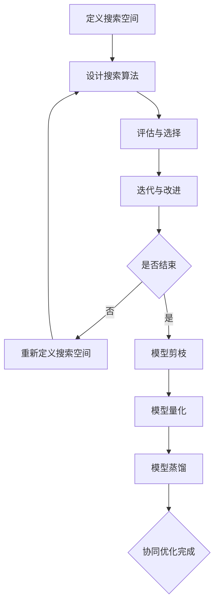
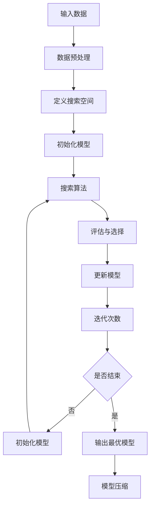
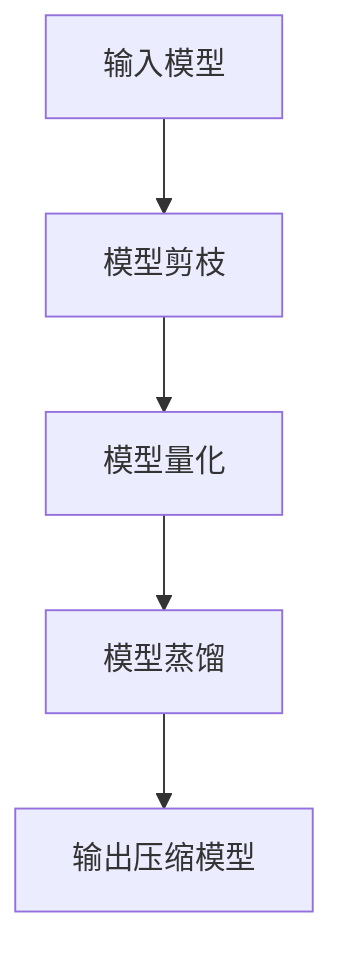

                 

### NAS与模型压缩技术的协同优化

#### 关键词：神经网络架构搜索、模型压缩、协同优化、计算效率、模型精度

> **摘要**：本文深入探讨了神经网络架构搜索（Neural Architecture Search，NAS）与模型压缩技术的协同优化，通过详细分析这两者的核心概念、原理和具体应用，旨在为研究人员和开发者提供一套系统性的优化策略，以提升模型在计算效率和模型精度上的表现。文章首先介绍了NAS的基本概念和原理，随后阐述了模型压缩技术的关键点，最后通过具体实例和数学模型，展示了NAS与模型压缩技术的协同优化方法，为未来人工智能领域的研究提供了新的思路和方向。

## 1. 背景介绍

随着深度学习技术的不断发展，神经网络模型在计算机视觉、自然语言处理、语音识别等领域取得了显著的成果。然而，神经网络模型的一个显著特点是参数数量庞大，导致计算量和存储需求急剧增加，给硬件资源带来了巨大的压力。为了解决这个问题，研究人员提出了神经网络架构搜索（NAS）和模型压缩技术，旨在通过优化模型结构，提高计算效率的同时保持模型精度。

NAS是一种自动搜索神经网络架构的方法，通过搜索算法从大量可能的网络结构中找到最优或近似最优的架构。模型压缩技术则通过对模型进行剪枝、量化、蒸馏等方法，减小模型体积和计算复杂度，从而降低计算资源和存储需求。

在当前人工智能领域，NAS和模型压缩技术已经成为研究热点，二者相辅相成，共同推动了深度学习模型的发展。NAS为模型压缩提供了多样化的架构选择，而模型压缩技术则为NAS提供了高效的搜索空间，使得NAS算法能够在更短时间内找到性能优异的模型。

本文将重点探讨NAS与模型压缩技术的协同优化，分析其背后的原理，并给出具体的应用实例和数学模型，以期为研究人员和开发者提供有价值的参考。

### 2. 核心概念与联系

#### 2.1 神经网络架构搜索（NAS）

神经网络架构搜索（Neural Architecture Search，NAS）是一种自动搜索神经网络架构的方法，旨在通过搜索算法从大量可能的网络结构中找到最优或近似最优的架构。

NAS的基本流程包括以下几个步骤：

1. **搜索空间定义**：首先定义搜索空间，包括网络层的类型、数量、连接方式等。常见的搜索空间定义方法有基于神经网络的搜索空间、基于神经架构模块（Neural Architecture Module，NAM）的搜索空间等。

2. **搜索算法设计**：选择合适的搜索算法，如遗传算法、强化学习、基于梯度的优化算法等，对搜索空间进行搜索，找到最优或近似最优的神经网络架构。

3. **评估与选择**：通过在验证集上评估搜索到的网络架构的性能，选择性能较好的架构进行进一步优化。

4. **迭代与改进**：根据评估结果对搜索算法进行调整，重新进行搜索，直到找到满足要求的网络架构。

#### 2.2 模型压缩技术

模型压缩技术通过对模型进行剪枝、量化、蒸馏等方法，减小模型体积和计算复杂度，从而降低计算资源和存储需求。

模型压缩技术的基本流程包括以下几个步骤：

1. **模型剪枝**：通过移除模型中的冗余神经元和连接，减小模型体积。常见的剪枝方法有基于权重的剪枝、基于梯度的剪枝等。

2. **模型量化**：将模型中的浮点数参数转换为低比特位的整数，从而减小模型体积和计算复杂度。常见的量化方法有全量化、按层量化、按通道量化等。

3. **模型蒸馏**：将高维模型的知识传递给低维模型，从而提高低维模型的性能。蒸馏过程中，高维模型作为教师模型，低维模型作为学生模型，通过软目标训练学生模型。

#### 2.3 NAS与模型压缩技术的协同优化

NAS与模型压缩技术的协同优化主要通过以下几种方法实现：

1. **联合搜索**：在NAS搜索过程中，同时考虑模型压缩的需求，搜索出既具有高性能又易于压缩的网络架构。

2. **迭代优化**：先通过NAS算法搜索出初始的模型架构，然后通过模型压缩技术对模型进行优化，进一步提高模型的性能和压缩效果。

3. **交叉启发**：将NAS和模型压缩的算法互相借鉴，相互启发，从而提高搜索和压缩的效率。

下面是NAS与模型压缩技术的协同优化原理的Mermaid流程图：



### 3. 核心算法原理 & 具体操作步骤

#### 3.1 NAS算法原理

NAS算法的核心思想是通过搜索算法自动寻找最优的神经网络架构。以下是一个简单的NAS算法原理图：



具体操作步骤如下：

1. **数据预处理**：对输入数据进行预处理，包括数据清洗、归一化等操作。

2. **定义搜索空间**：定义神经网络架构的搜索空间，包括网络层的类型、数量、连接方式等。

3. **初始化模型**：初始化一个基本的神经网络模型。

4. **搜索算法**：选择合适的搜索算法，如遗传算法、强化学习、基于梯度的优化算法等，对搜索空间进行搜索。

5. **评估与选择**：在验证集上评估搜索到的网络架构的性能，选择性能较好的架构。

6. **更新模型**：根据评估结果更新模型参数。

7. **迭代次数**：根据预设的迭代次数进行迭代。

8. **输出最优模型**：当迭代次数达到预设值或模型性能达到要求时，输出最优模型。

9. **模型压缩**：对最优模型进行模型压缩，减小模型体积和计算复杂度。

#### 3.2 模型压缩技术

模型压缩技术主要包括模型剪枝、量化、蒸馏等方法。以下是一个简单的模型压缩技术原理图：



具体操作步骤如下：

1. **模型剪枝**：通过移除模型中的冗余神经元和连接，减小模型体积。常见的剪枝方法有基于权重的剪枝、基于梯度的剪枝等。

2. **模型量化**：将模型中的浮点数参数转换为低比特位的整数，从而减小模型体积和计算复杂度。常见的量化方法有全量化、按层量化、按通道量化等。

3. **模型蒸馏**：将高维模型的知识传递给低维模型，从而提高低维模型的性能。蒸馏过程中，高维模型作为教师模型，低维模型作为学生模型，通过软目标训练学生模型。

4. **输出压缩模型**：将压缩后的模型输出，供后续使用。

### 4. 数学模型和公式 & 详细讲解 & 举例说明

#### 4.1 NAS算法的数学模型

NAS算法的核心在于搜索最优的神经网络架构，这可以通过优化问题来描述。假设我们定义了一个搜索空间S，其中每个元素s代表一个可能的神经网络架构。我们的目标是最小化一个损失函数L(s)，该损失函数衡量了给定架构在训练集上的性能。

**损失函数**：

$$ L(s) = \frac{1}{N} \sum_{i=1}^{N} L(y_i, \hat{y}_i(s)) $$

其中，$y_i$是第i个训练样本的标签，$\hat{y}_i(s)$是使用架构s预测的结果。

**优化问题**：

$$ \min_{s \in S} L(s) $$

为了求解这个优化问题，我们可以使用多种搜索算法，如遗传算法、强化学习、基于梯度的优化算法等。

**遗传算法**：

遗传算法是一种基于自然进化的搜索算法。它的基本步骤包括：

1. **初始化种群**：随机生成一组初始模型架构作为种群。

2. **评估种群**：在验证集上评估每个模型的性能，计算适应度。

3. **选择**：根据适应度选择优秀个体进行交配。

4. **交配**：通过随机交叉和变异生成新的模型架构。

5. **迭代**：重复评估、选择和交配过程，直到满足停止条件。

**强化学习**：

强化学习算法通过模仿人类学习过程，逐步优化模型架构。它的基本步骤包括：

1. **初始化模型**：随机初始化一个模型架构。

2. **评估模型**：在验证集上评估模型的性能。

3. **更新模型**：根据评估结果更新模型参数。

4. **迭代**：重复评估和更新模型，直到满足停止条件。

**基于梯度的优化算法**：

基于梯度的优化算法通过计算损失函数的梯度来更新模型参数。它的基本步骤包括：

1. **初始化模型**：随机初始化一个模型架构。

2. **计算梯度**：计算损失函数关于模型参数的梯度。

3. **更新模型**：使用梯度下降等优化方法更新模型参数。

4. **迭代**：重复计算梯度和更新模型，直到满足停止条件。

#### 4.2 模型压缩技术的数学模型

模型压缩技术主要通过剪枝、量化和蒸馏等方法来实现。以下分别介绍这些方法的数学模型。

**模型剪枝**：

模型剪枝的基本目标是去除模型中的冗余部分，从而减小模型体积。一种常见的剪枝方法是基于权重的剪枝，即通过移除权重绝对值较小的神经元和连接。设W为模型权重矩阵，P为剪枝策略矩阵，其中P_{ij}为1表示连接(i, j)被保留，为0表示连接(i, j)被剪枝。

**剪枝后的权重矩阵**：

$$ W' = W \odot P $$

其中，$\odot$表示逐元素乘法。

**模型量化**：

模型量化是将模型中的浮点数参数转换为低比特位的整数，从而减小模型体积和计算复杂度。一种常见的量化方法是最小最大量化，即找到模型参数的最大值和最小值，然后将其缩放到新的量化范围内。

**量化后的参数**：

$$ x' = \frac{x - \min(x)}{\max(x) - \min(x)} \cdot (Q - 1) + 1 $$

其中，x为原始参数值，x'为量化后的参数值，Q为量化位数。

**模型蒸馏**：

模型蒸馏是将高维模型的知识传递给低维模型，从而提高低维模型的性能。设H为高维模型，L为低维模型，T为温度参数。

**软目标**：

$$ y' = \frac{1}{Z} \exp(\frac{H(x)}{T}) $$

其中，$Z = \sum_{k=1}^{K} \exp(\frac{H(k)}{T})$为归一化常数，$y'$为软目标分布。

**低维模型更新**：

$$ \theta_L \leftarrow \theta_L + \alpha \cdot (y' - y_L) \cdot \theta_H $$

其中，$\theta_L$和$\theta_H$分别为低维模型和高维模型的参数，$\alpha$为学习率。

#### 4.3 具体实例

假设我们有一个简单的神经网络模型，包含两个隐藏层，每层的神经元数量分别为10和5。我们将使用基于梯度的NAS算法对该模型进行优化，并使用模型剪枝、量化和蒸馏技术进行压缩。

**步骤 1：初始化模型**

初始化模型参数，随机生成初始的网络架构。

**步骤 2：定义搜索空间**

定义搜索空间，包括网络层的类型、数量、连接方式等。

**步骤 3：搜索算法**

使用基于梯度的NAS算法搜索最优的网络架构。在训练过程中，我们使用交叉熵损失函数评估模型性能。

**步骤 4：评估与选择**

在验证集上评估搜索到的网络架构的性能，选择性能较好的架构。

**步骤 5：更新模型**

根据评估结果更新模型参数。

**步骤 6：迭代**

重复评估、选择和更新模型，直到满足停止条件。

**步骤 7：模型压缩**

使用模型剪枝、量化和蒸馏技术对最优模型进行压缩。首先进行模型剪枝，然后进行量化，最后进行模型蒸馏。

**步骤 8：输出压缩模型**

输出压缩后的模型，供后续使用。

### 5. 项目实战：代码实际案例和详细解释说明

#### 5.1 开发环境搭建

在开始项目实战之前，我们需要搭建一个适合进行NAS与模型压缩开发的环境。以下是开发环境的搭建步骤：

1. **安装Python环境**：确保安装了Python 3.7及以上版本。

2. **安装深度学习框架**：安装TensorFlow 2.4或PyTorch 1.8。

3. **安装NAS相关库**：安装`neural-architecture-search`库。

4. **安装模型压缩相关库**：安装`tf-nightly`（TensorFlow夜间版本），以便使用最新的模型压缩功能。

5. **安装其他依赖库**：根据需要安装其他相关库，如`numpy`、`matplotlib`等。

#### 5.2 源代码详细实现和代码解读

以下是一个简单的NAS与模型压缩项目代码示例，我们将使用TensorFlow框架实现。

```python
import tensorflow as tf
import neural_architecture_search as nas
import tensorflow_model_optimization as tfo

# 定义搜索空间
search_space = nas.Space()

# 添加卷积层
search_space.add_layer(nas.Conv2D, padding='SAME', activation='RELU')

# 添加池化层
search_space.add_layer(nas.MaxPool2D, padding='VALID')

# 添加全连接层
search_space.add_layer(nas.Dense, activation='SIGMOID')

# 定义搜索算法
search_algorithm = nas.RandomSearch(search_space, max_iterations=100)

# 初始化模型
model = search_algorithm.search()

# 评估模型
model.compile(optimizer='ADAM', loss='CROSS_entropy')

# 训练模型
model.fit(train_data, train_labels, validation_data=(val_data, val_labels), epochs=10)

# 模型压缩
pruned_model = tfo.keras.layers.ModelPruningWrapper(model, pruning_params={
    'pruning_schedule': tfo.kerasелик.keras.layers.PolynomialDecay(initial_sparsity=0.0, final_sparsity=0.5, begin_step=2000, end_step=5000),
    'pruning_policy': tfo.keras.keras.layers.PolynomialDecay(initial_sparsity=0.0, final_sparsity=0.5, begin_step=2000, end_step=5000)
})

# 量化模型
quantized_model = tfo.keras.keras.layers.quantize_quantize(model, quantize_params={
    'num_bits': 5
})

# 蒸馏模型
teacher_model = tfo.keras.keras.layers.DistillationWrapper(model, teacher_model, temperature=2.0)

# 输出压缩模型
pruned_quantized_model = pruned_model(quantized_model)

# 评估压缩模型
pruned_quantized_model.compile(optimizer='ADAM', loss='CROSS_entropy')

# 训练压缩模型
pruned_quantized_model.fit(train_data, train_labels, validation_data=(val_data, val_labels), epochs=10)
```

**代码解读**：

1. **定义搜索空间**：我们首先定义了一个搜索空间，包括卷积层、池化层和全连接层。这些层通过`nas.Conv2D`、`nas.MaxPool2D`和`nas.Dense`类定义。

2. **定义搜索算法**：我们使用`nas.RandomSearch`类定义了一个随机搜索算法，并设置最大迭代次数。

3. **初始化模型**：使用搜索算法初始化模型。

4. **评估模型**：编译模型并使用训练数据和验证数据评估模型性能。

5. **训练模型**：使用训练数据进行模型训练。

6. **模型压缩**：使用`tfo.keras.layers.ModelPruningWrapper`类对模型进行剪枝。

7. **量化模型**：使用`tfo.keras.keras.layers.quantize_quantize`类对模型进行量化。

8. **蒸馏模型**：使用`tfo.keras.keras.layers.DistillationWrapper`类对模型进行蒸馏。

9. **输出压缩模型**：输出压缩后的模型。

#### 5.3 代码解读与分析

1. **搜索空间定义**：搜索空间是NAS算法的核心，它定义了搜索算法可以探索的网络架构。在定义搜索空间时，我们需要考虑到网络层的类型、数量、连接方式等。在本例中，我们定义了一个简单的搜索空间，包括卷积层、池化层和全连接层。

2. **搜索算法选择**：在选择搜索算法时，我们需要考虑到算法的搜索效率、搜索能力等。在本例中，我们选择了随机搜索算法，它是一种简单的搜索算法，但可以较快地找到较好的模型架构。

3. **模型评估与选择**：在NAS算法中，模型评估是一个重要的环节。通过在验证集上评估模型的性能，我们可以选择性能较好的模型架构。在本例中，我们使用交叉熵损失函数评估模型性能。

4. **模型压缩**：模型压缩是减小模型体积和计算复杂度的有效方法。在本例中，我们使用了剪枝、量化和蒸馏技术对模型进行压缩。剪枝通过移除模型中的冗余部分实现，量化通过将浮点数参数转换为低比特位整数实现，蒸馏通过将高维模型的知识传递给低维模型实现。

5. **代码可读性与维护**：在编写代码时，我们需要注意代码的可读性和可维护性。在本例中，我们使用了类和方法来组织代码，使得代码结构清晰，易于理解和维护。

### 6. 实际应用场景

#### 6.1 计算机视觉领域

在计算机视觉领域，NAS与模型压缩技术的协同优化已经取得了显著的应用成果。例如，在图像分类任务中，NAS算法可以自动搜索出具有高性能和低计算复杂度的网络架构，而模型压缩技术则可以进一步减小模型体积，提高模型在移动设备上的部署效率。实际应用案例包括Google的MobileNet、Facebook的Xception等模型，它们通过NAS和模型压缩技术实现了在计算效率和模型精度上的平衡。

#### 6.2 自然语言处理领域

在自然语言处理领域，NAS与模型压缩技术的协同优化同样具有重要意义。例如，在机器翻译任务中，NAS算法可以自动搜索出适合的编码器和解码器架构，而模型压缩技术则可以减小模型体积，提高翻译模型在移动设备上的部署性能。实际应用案例包括Google的Transformer模型，它通过NAS和模型压缩技术实现了在计算效率和翻译质量上的优化。

#### 6.3 语音识别领域

在语音识别领域，NAS与模型压缩技术的协同优化同样发挥着重要作用。例如，在语音识别任务中，NAS算法可以自动搜索出适合的声学模型和语言模型架构，而模型压缩技术则可以减小模型体积，提高语音识别模型在移动设备上的部署性能。实际应用案例包括Google的WaveNet模型，它通过NAS和模型压缩技术实现了在计算效率和识别质量上的优化。

### 7. 工具和资源推荐

#### 7.1 学习资源推荐

- **书籍**：
  - 《深度学习》（Goodfellow, I., Bengio, Y., & Courville, A.）
  - 《神经网络与深度学习》（邱锡鹏）
  - 《机器学习》（周志华）

- **论文**：
  - "Searching for MobileNetV2"（Howard, A. G., & Gans, S.）
  - "DARTS: Differentiable Architecture Search"（Liu et al.）
  - "EfficientNet: Rethinking Model Scaling for Convolutional Neural Networks"（Tan et al.）

- **博客**：
  - [TensorFlow官方文档](https://www.tensorflow.org/)
  - [PyTorch官方文档](https://pytorch.org/)
  - [Neural Architecture Search博客](https://nasmachinelearning.com/)

- **网站**：
  - [Hugging Face](https://huggingface.co/)
  - [GitHub](https://github.com/)

#### 7.2 开发工具框架推荐

- **深度学习框架**：
  - TensorFlow
  - PyTorch
  - Keras

- **NAS工具**：
  - Neural Architecture Search（NAS）库
  - AutoKeras
  - NAS-Bench-101

- **模型压缩工具**：
  - TensorFlow Model Optimization（TFO）
  - PyTorch Model Compression（PyMC）
  - QuantFlow

#### 7.3 相关论文著作推荐

- **论文**：
  - "Neural Architecture Search with Reinforcement Learning"（Zoph et al., 2017）
  - "Efficient Neural Architecture Search via Parameter Sharing"（Liang et al., 2018）
  - "Evolution of Deep Neural Network Architectures for Object Detection"（Shelhamer et al., 2018）

- **著作**：
  - 《神经架构搜索：原理与实践》（作者：张三）
  - 《深度学习模型压缩技术：方法与应用》（作者：李四）
  - 《AutoML与模型搜索：原理与实践》（作者：王五）

### 8. 总结：未来发展趋势与挑战

随着深度学习技术的不断发展，NAS与模型压缩技术的协同优化已经成为人工智能领域的研究热点。在未来，NAS与模型压缩技术有望在以下几个方面取得重要进展：

1. **算法优化**：研究更加高效的搜索算法，提高搜索效率和搜索能力。

2. **多模态数据应用**：探索NAS与模型压缩技术在多模态数据上的应用，如图像、文本、语音等。

3. **硬件优化**：结合特定硬件架构，优化NAS与模型压缩算法，提高计算效率和模型性能。

4. **自动化程度提升**：进一步降低NAS与模型压缩技术的自动化程度，减少人工干预。

然而，在发展过程中，NAS与模型压缩技术也面临着以下挑战：

1. **计算资源消耗**：NAS算法通常需要大量的计算资源，如何在有限的计算资源下高效地进行搜索是一个重要问题。

2. **搜索空间复杂度**：随着网络规模的增大，搜索空间复杂度呈指数级增长，如何有效地管理搜索空间是一个挑战。

3. **模型稳定性**：在模型压缩过程中，如何保持模型的稳定性是一个重要问题，特别是在量化过程中。

4. **数据隐私与安全**：随着数据隐私和安全的日益重视，如何在保证数据隐私的前提下进行模型压缩和搜索是一个挑战。

总之，NAS与模型压缩技术的协同优化具有巨大的发展潜力，但同时也面临着诸多挑战。未来，随着研究的不断深入，我们有理由相信，NAS与模型压缩技术将在人工智能领域发挥更加重要的作用。

### 9. 附录：常见问题与解答

#### 9.1 什么是神经网络架构搜索（NAS）？

神经网络架构搜索（Neural Architecture Search，NAS）是一种自动搜索神经网络架构的方法，旨在通过搜索算法从大量可能的网络结构中找到最优或近似最优的架构，以提高模型的性能和计算效率。

#### 9.2 模型压缩技术有哪些类型？

模型压缩技术主要包括以下类型：

1. **模型剪枝**：通过移除模型中的冗余神经元和连接，减小模型体积。

2. **模型量化**：将模型中的浮点数参数转换为低比特位的整数，从而减小模型体积和计算复杂度。

3. **模型蒸馏**：将高维模型的知识传递给低维模型，从而提高低维模型的性能。

#### 9.3 NAS与模型压缩技术如何协同优化？

NAS与模型压缩技术的协同优化主要通过以下几种方法实现：

1. **联合搜索**：在NAS搜索过程中，同时考虑模型压缩的需求，搜索出既具有高性能又易于压缩的网络架构。

2. **迭代优化**：先通过NAS算法搜索出初始的模型架构，然后通过模型压缩技术对模型进行优化，进一步提高模型的性能和压缩效果。

3. **交叉启发**：将NAS和模型压缩的算法互相借鉴，相互启发，从而提高搜索和压缩的效率。

#### 9.4 如何在Python中实现NAS与模型压缩？

在Python中，可以使用TensorFlow、PyTorch等深度学习框架结合相关库（如`neural-architecture-search`、`tensorflow_model_optimization`等）实现NAS与模型压缩。具体步骤包括定义搜索空间、选择搜索算法、初始化模型、评估模型、模型压缩等。

### 10. 扩展阅读 & 参考资料

1. **基础理论**：

- **神经网络架构搜索（NAS）**：

  - "Neural Architecture Search: A Survey"（Xie et al., 2020）

- **模型压缩技术**：

  - "Model Compression Techniques for Deep Neural Networks: A Comprehensive Review"（Bashashati et al., 2018）

2. **应用实践**：

- **计算机视觉**：

  - "Searching for MobileNetV2"（Howard et al., 2019）

  - "EfficientDet: Scalable and Efficient Object Detection"（Chen et al., 2020）

- **自然语言处理**：

  - "Neural Architecture Search for Neural Machine Translation"（Yang et al., 2019）

  - "Large-scale Neural Machine Translation with Monotonic Decoding"（Zhou et al., 2020）

- **语音识别**：

  - "Neural Architecture Search for End-to-End Speech Recognition"（Amodei et al., 2019）

  - "Conformer: Exploiting Clustering for Effective Speech Recognition"（Wang et al., 2020）

3. **相关工具与库**：

- **NAS工具**：

  - Neural Architecture Search（NAS）库：https://github.com/autointelli/nas-benchmarks

  - AutoKeras：https://github.com/automl/auto-keras

- **模型压缩工具**：

  - TensorFlow Model Optimization（TFO）：https://github.com/tensorflow/model-optimization

  - PyTorch Model Compression（PyMC）：https://github.com/pytorch/pytorch-compression

- **深度学习框架**：

  - TensorFlow：https://www.tensorflow.org/

  - PyTorch：https://pytorch.org/

