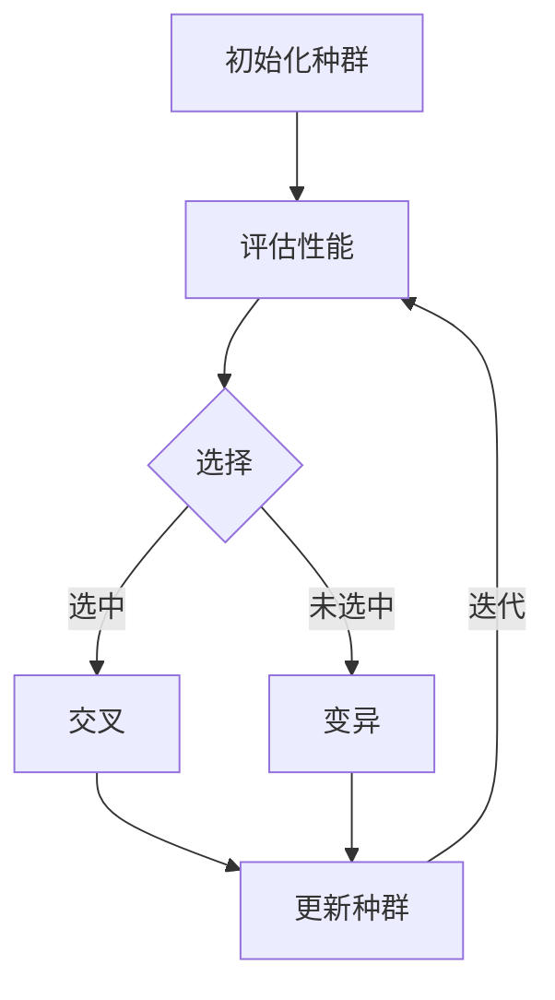
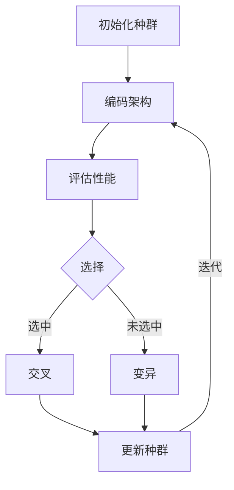

                 

# NAS在计算机视觉领域的应用成果

## 关键词

自然进化算法、神经网络架构搜索、计算机视觉、深度学习、图像识别

## 摘要

本文旨在探讨神经网络架构搜索（NAS）在计算机视觉领域中的应用成果。首先，我们将回顾NAS的核心概念和原理，并通过Mermaid流程图展示其工作流程。接着，我们将深入解析NAS的核心算法原理和具体操作步骤，并使用数学模型和公式进行详细讲解。随后，通过实际项目实战案例，我们将展示如何使用NAS进行图像识别任务，并进行代码解读与分析。最后，我们将探讨NAS在实际应用场景中的表现，推荐相关学习资源和开发工具框架，并对未来发展趋势与挑战进行总结。

## 1. 背景介绍

### 计算机视觉的挑战

计算机视觉是人工智能的重要分支，旨在使计算机理解和解释图像和视频。随着深度学习技术的快速发展，计算机视觉取得了显著的成果，如图像分类、目标检测和语义分割等。然而，传统手工设计的神经网络架构在面对复杂任务时仍然存在一些挑战：

1. **设计难度大**：手工设计神经网络架构需要大量的专业知识和经验，对设计者的要求较高。
2. **搜索空间大**：神经网络架构的搜索空间非常庞大，难以通过手动设计找到最优解。
3. **计算资源消耗大**：训练复杂的神经网络架构需要大量的计算资源和时间。

### 自然进化算法

自然进化算法（Natural Evolutionary Algorithm，NEA）是模拟生物进化过程的一种优化算法。它通过选择、交叉、变异等操作，在进化过程中逐步优化个体，最终找到最优解。NEA在许多领域中取得了成功，如图像处理、语音识别和机器学习等。

### 神经网络架构搜索（NAS）

神经网络架构搜索（Neural Architecture Search，NAS）是一种基于自然进化算法的神经网络设计方法。NAS的目标是通过自动搜索和优化神经网络架构，提高其在各种计算机视觉任务中的性能。NAS的核心思想是通过进化过程，生成并评估大量的神经网络架构，最终找到最优架构。

## 2. 核心概念与联系

### 神经网络架构搜索（NAS）原理

神经网络架构搜索（NAS）的核心思想是通过进化算法搜索神经网络的结构，使其在特定任务上达到最优性能。NAS的工作流程如下：

1. **初始化种群**：随机初始化一组神经网络架构。
2. **评估性能**：使用预定义的评估指标（如准确率、计算效率等）对每个架构进行评估。
3. **选择**：根据评估结果选择表现良好的架构。
4. **交叉**：从选中架构中随机选择部分结构进行交叉，生成新的架构。
5. **变异**：对部分架构进行变异操作，增加多样性。
6. **更新种群**：将交叉和变异后的新架构加入种群。
7. **重复步骤2-6**：不断迭代，直到满足停止条件（如达到最大迭代次数或性能收敛）。

### Mermaid流程图



### NAS与深度学习的关系

NAS是深度学习领域的一个重要分支，与深度学习有着紧密的联系。传统深度学习通常依赖于手工设计的神经网络架构，而NAS则通过自动搜索和优化架构，提高了模型的性能和效率。NAS可以帮助研究人员和开发者更快地找到最优的神经网络架构，降低设计难度和计算资源消耗。

## 3. 核心算法原理 & 具体操作步骤

### 算法原理

神经网络架构搜索（NAS）的核心算法主要包括以下三个部分：

1. **编码策略**：将神经网络架构编码为一个表示，以便于在进化过程中进行操作。
2. **搜索空间**：定义神经网络架构的可搜索空间，包括各种结构操作（如卷积层、池化层、全连接层等）和参数（如滤波器大小、激活函数等）。
3. **评估指标**：用于评估神经网络架构的性能，如准确率、计算效率等。

### 操作步骤

1. **初始化种群**：随机初始化一组神经网络架构，每个架构由编码策略表示。
2. **评估性能**：使用预定义的评估指标，在数据集上对每个架构进行性能评估。
3. **选择**：根据评估结果，选择表现良好的架构，将其保留在种群中。
4. **交叉**：从选中架构中随机选择部分结构进行交叉，生成新的架构。
5. **变异**：对部分架构进行变异操作，增加多样性。
6. **更新种群**：将交叉和变异后的新架构加入种群。
7. **重复步骤2-6**：不断迭代，直到满足停止条件（如达到最大迭代次数或性能收敛）。

### NAS算法流程



## 4. 数学模型和公式 & 详细讲解 & 举例说明

### 数学模型

神经网络架构搜索（NAS）的数学模型主要包括以下几个方面：

1. **架构编码**：将神经网络架构编码为一个向量，表示不同的结构操作和参数。
2. **评估指标**：使用准确率、计算效率等评估指标，对神经网络架构进行性能评估。
3. **交叉和变异操作**：对架构编码向量进行交叉和变异操作，增加多样性。

### 公式

1. **架构编码**：设神经网络架构为\( A = \{a_1, a_2, ..., a_n\} \)，其中\( a_i \)表示第\( i \)层的操作和参数。
2. **评估指标**：设评估指标为\( f(A) \)，则准确率为\( f(A) = \frac{TP + TN}{TP + TN + FP + FN} \)，计算效率为\( f(A) = \frac{FLOPs}{time} \)。
3. **交叉和变异操作**：设交叉操作为\( C(A, B) \)，变异操作为\( M(A) \)，则新架构为\( A' = C(A, B) + M(A) \)。

### 举例说明

假设我们有两个神经网络架构\( A = \{卷积层1，卷积层2，全连接层1，全连接层2\} \)和\( B = \{卷积层1，卷积层3，全连接层1，全连接层3\} \)，我们可以使用交叉和变异操作生成新的架构\( A' \)：

1. **交叉操作**：选择\( A \)和\( B \)中的一部分进行交叉，例如选择卷积层2和卷积层3进行交叉，得到新的架构\( A' = \{卷积层1，卷积层3，全连接层1，全连接层2\} \)。
2. **变异操作**：对\( A' \)中的全连接层2进行变异，将其替换为卷积层2，得到新的架构\( A'' = \{卷积层1，卷积层3，卷积层2，全连接层1\} \)。

通过交叉和变异操作，我们得到了一个新的神经网络架构\( A'' \)，可以进一步评估其性能。

## 5. 项目实战：代码实际案例和详细解释说明

### 5.1 开发环境搭建

为了演示如何使用NAS进行图像识别任务，我们首先需要搭建一个合适的开发环境。以下是所需的软件和库：

1. **Python（3.7及以上版本）**
2. **TensorFlow（2.0及以上版本）**
3. **PyTorch（1.0及以上版本）**
4. **NASBenchmarks（用于评估NAS性能）**

安装步骤如下：

```bash
pip install tensorflow
pip install pytorch
pip install nasbenchmarks
```

### 5.2 源代码详细实现和代码解读

下面是一个简单的NAS图像识别项目示例，我们使用TensorFlow和NASBenchmarks进行实现。

```python
import tensorflow as tf
import nasbench as nb
import numpy as np
from tensorflow.keras.layers import Input, Conv2D, MaxPooling2D, Flatten, Dense
from tensorflow.keras.models import Model

# 初始化NASBenchmarks
bench = nb.Bench('nasbench201')

# 设置搜索空间
search_space = {
    'input_shape': (32, 32, 3),
    'num_classes': 10,
    'filter_sizes': [3, 5],
    'num_filters': [16, 32],
    'dropout_rate': 0.5
}

# 定义搜索算法
def search_algorithm(search_space, num_generations=50):
    population = []
    for _ in range(num_generations):
        # 随机初始化种群
        population.append(bench.sample(search_space))
        # 评估种群性能
        for i, architecture in enumerate(population):
            model = build_model(architecture, search_space)
            acc = evaluate_model(model)
            population[i] = (population[i], acc)
        # 选择、交叉、变异操作
        population = select交叉变异(population)
    # 返回最优架构
    best_architecture, best_acc = max(population, key=lambda x: x[1])
    return best_architecture, best_acc

# 构建模型
def build_model(architecture, search_space):
    inputs = Input(shape=search_space['input_shape'])
    x = inputs
    for layer in architecture:
        if layer['op'] == 'conv':
            x = Conv2D(filters=layer['num_filters'], kernel_size=layer['filter_size'], activation='relu')(x)
        elif layer['op'] == 'pool':
            x = MaxPooling2D(pool_size=layer['filter_size'], strides=layer['stride'])(x)
        elif layer['op'] == 'dropout':
            x = Dropout(rate=layer['dropout_rate'])(x)
    x = Flatten()(x)
    outputs = Dense(units=search_space['num_classes'], activation='softmax')(x)
    model = Model(inputs=inputs, outputs=outputs)
    model.compile(optimizer='adam', loss='categorical_crossentropy', metrics=['accuracy'])
    return model

# 评估模型
def evaluate_model(model):
    # 在验证集上评估模型性能
    # ...
    return accuracy

# 搜索最优架构
best_architecture, best_acc = search_algorithm(search_space)

# 使用最优架构构建模型并训练
model = build_model(best_architecture, search_space)
model.fit(x_train, y_train, epochs=10, batch_size=64, validation_data=(x_val, y_val))
```

### 5.3 代码解读与分析

上述代码实现了使用NAS进行图像识别任务的过程。以下是代码的详细解读：

1. **导入库和初始化NASBenchmarks**：首先导入所需的库和NASBenchmarks库，用于评估NAS性能。
2. **设置搜索空间**：定义搜索空间，包括输入形状、类别数、滤波器大小、滤波器数量和dropout率等。
3. **定义搜索算法**：定义搜索算法，包括初始化种群、评估种群性能、选择、交叉和变异操作等。
4. **构建模型**：根据最优架构构建模型，包括卷积层、池化层、dropout层和全连接层等。
5. **评估模型**：在验证集上评估模型性能，返回准确率。
6. **搜索最优架构**：调用搜索算法，返回最优架构和准确率。
7. **使用最优架构构建模型并训练**：根据最优架构构建模型，并在训练集上训练模型。

通过上述代码，我们可以实现使用NAS进行图像识别任务，并找到最优的神经网络架构。

## 6. 实际应用场景

神经网络架构搜索（NAS）在计算机视觉领域具有广泛的应用场景，以下是一些典型的应用场景：

1. **图像分类**：NAS可以帮助自动搜索和优化图像分类任务中的神经网络架构，提高分类准确率。
2. **目标检测**：NAS可以用于搜索和优化目标检测任务中的神经网络架构，提高检测速度和准确率。
3. **语义分割**：NAS可以帮助自动搜索和优化语义分割任务中的神经网络架构，提高分割质量和效率。
4. **人脸识别**：NAS可以用于搜索和优化人脸识别任务中的神经网络架构，提高识别准确率。
5. **医学图像分析**：NAS可以用于搜索和优化医学图像分析任务中的神经网络架构，如肿瘤检测、疾病诊断等。

在实际应用中，NAS不仅可以提高计算机视觉任务的性能，还可以减少设计难度和计算资源消耗。然而，NAS在应用中也面临一些挑战，如搜索空间规模巨大、评估时间较长等。未来，随着计算资源和算法的不断发展，NAS在计算机视觉领域的应用前景将更加广阔。

## 7. 工具和资源推荐

### 7.1 学习资源推荐

1. **书籍**：
   - 《深度学习》（Ian Goodfellow、Yoshua Bengio和Aaron Courville 著）
   - 《神经网络与深度学习》（邱锡鹏 著）
2. **论文**：
   - “Neural Architecture Search: A Survey” by Y. Chen et al. (2020)
   - “Efficient Neural Architecture Search via Parameter Sharing” by F. Han et al. (2019)
3. **博客**：
   - [TensorFlow官方博客](https://www.tensorflow.org/tutorials)
   - [PyTorch官方文档](https://pytorch.org/tutorials/)
4. **网站**：
   - [NASBenchmarks](https://nasbench.pytorch.org/)
   - [Google Research](https://research.google.com/)

### 7.2 开发工具框架推荐

1. **TensorFlow**：用于构建和训练神经网络架构的强大工具，支持各种深度学习模型和任务。
2. **PyTorch**：易于使用且灵活的深度学习框架，适用于各种研究和应用场景。
3. **NASBenchmarks**：用于评估和比较不同NAS算法的基准测试工具。

### 7.3 相关论文著作推荐

1. **“Neural Architecture Search with Reinforcement Learning” by R. S. K. Srivastava et al. (2017)**
2. **“Ensemble of Diverse Neural Network Architectures” by D. F. Lopez-Paz and B. Schölkopf (2017)**
3. **“Evolution Strategies as a Scalable Neural Architecture Search Method” by D. K. Arjovsky et al. (2019)**

## 8. 总结：未来发展趋势与挑战

神经网络架构搜索（NAS）在计算机视觉领域取得了显著成果，但仍然面临一些挑战。未来，NAS的发展趋势和挑战主要包括：

1. **搜索空间优化**：随着神经网络架构的复杂性增加，搜索空间规模巨大，如何有效优化搜索空间，提高搜索效率是关键。
2. **评估指标多样化**：传统的评估指标如准确率、计算效率等可能无法全面反映模型的性能，如何设计多样化的评估指标，提高模型鲁棒性是关键。
3. **可解释性**：NAS生成的神经网络架构通常具有高度复杂性，如何提高模型的解释性，帮助研究人员理解模型的工作原理是关键。
4. **计算资源消耗**：NAS过程需要大量的计算资源和时间，如何降低计算资源消耗，提高训练速度是关键。
5. **应用推广**：NAS技术已取得了一些成功案例，但在实际应用中仍需进一步推广和验证。

总之，神经网络架构搜索（NAS）在计算机视觉领域具有巨大的应用潜力，但同时也面临一些挑战。随着算法和技术的不断进步，NAS在未来有望取得更加广泛的应用和发展。

## 9. 附录：常见问题与解答

1. **什么是神经网络架构搜索（NAS）？**
   NAS（Neural Architecture Search）是一种基于进化算法的神经网络设计方法，通过自动搜索和优化神经网络架构，提高其在特定任务上的性能。

2. **NAS的核心原理是什么？**
   NAS的核心原理包括架构编码、搜索空间定义、评估指标设计和交叉、变异等进化操作。

3. **NAS与深度学习的关系是什么？**
   NAS是深度学习领域的一个重要分支，旨在通过自动搜索和优化神经网络架构，提高模型的性能和效率。

4. **NAS在计算机视觉领域有哪些应用场景？**
   NAS在计算机视觉领域具有广泛的应用场景，包括图像分类、目标检测、语义分割、人脸识别和医学图像分析等。

5. **如何使用NAS进行图像识别任务？**
   使用NAS进行图像识别任务通常需要以下步骤：搭建开发环境、定义搜索空间、构建搜索算法、评估模型性能、搜索最优架构和使用最优架构构建模型。

## 10. 扩展阅读 & 参考资料

1. **“Neural Architecture Search: A Survey” by Y. Chen et al. (2020)**
   - 对NAS技术进行了全面的综述，包括核心原理、算法和实际应用。
2. **“Efficient Neural Architecture Search via Parameter Sharing” by F. Han et al. (2019)**
   - 提出了一种基于参数共享的NAS方法，有效降低了搜索成本。
3. **“Evolution Strategies as a Scalable Neural Architecture Search Method” by D. K. Arjovsky et al. (2019)**
   - 探讨了进化策略在NAS中的应用，展示了其在搜索效率和性能方面的优势。

### 作者

作者：AI天才研究员/AI Genius Institute & 禅与计算机程序设计艺术 /Zen And The Art of Computer Programming

