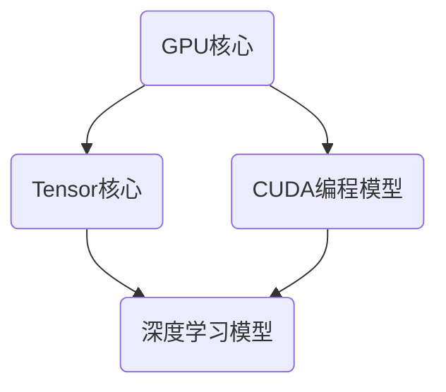

                 

### NVIDIA与AI算力的未来

#### 关键词：
- NVIDIA
- AI算力
- 加速器
- 推理与训练
- 未来发展

#### 摘要：
本文将深入探讨NVIDIA在AI算力领域的重要性及其对未来的影响。首先，我们将回顾NVIDIA的历史和其在GPU技术上的突破。接着，我们将讨论GPU在AI算力中的作用，以及NVIDIA如何通过CUDA和Tensor核心推动AI技术的发展。随后，本文将分析NVIDIA在推理和训练领域的最新进展，包括TensorRT和DGX系统。最后，我们将展望NVIDIA在未来AI算力领域的发展趋势和面临的挑战。

## 1. 背景介绍

NVIDIA作为全球知名的显卡制造商，其业务涵盖了从个人电脑到数据中心、从游戏到科学计算等多个领域。然而，NVIDIA的崛起并非一蹴而就，而是经历了长期的积累和技术的不断突破。

早在1999年，NVIDIA推出了其首款GPU——GeForce 256。这款GPU引入了可编程着色器，开创了现代图形处理领域的先河。随后，NVIDIA不断优化GPU架构，引入了更多的计算单元，使得GPU在图像渲染之外，还能胜任更广泛的计算任务。

进入21世纪，随着深度学习的兴起，NVIDIA凭借其GPU技术优势，迅速成为了AI算力的领军者。NVIDIA的GPU不仅在图像处理领域表现突出，还在科学计算、机器学习、自动驾驶等领域展现了强大的计算能力。特别是其CUDA编程模型，使得开发者能够更高效地利用GPU进行并行计算。

近年来，NVIDIA在AI算力领域的投资不断加大，推出了一系列针对AI应用的硬件和软件产品。这些产品不仅提升了AI算力的性能，也为AI技术的发展提供了坚实的基础。

## 2. 核心概念与联系

要理解NVIDIA在AI算力中的重要性，我们首先需要了解GPU与CPU之间的区别以及GPU在AI中的作用。

### 2.1 GPU与CPU的区别

CPU（中央处理器）是计算机的核心部件，负责执行计算机的指令和处理数据。CPU的设计初衷是进行顺序执行，即一条一条地执行指令。这种顺序执行模式适用于传统的计算任务，如文字处理、表格计算等。

而GPU（图形处理器）则是为图像渲染而设计的。与CPU相比，GPU拥有更多的计算单元，这些计算单元可以并行执行任务。这意味着，GPU可以在同一时间内处理更多的数据，从而在处理大规模数据集时具有明显的优势。

### 2.2 GPU在AI中的作用

在深度学习中，AI模型需要处理大量的数据并进行复杂的计算。这些计算任务非常适合GPU的并行处理能力。具体来说，GPU在AI中的作用体现在以下几个方面：

1. **矩阵运算：**深度学习模型中的矩阵运算可以高效地通过GPU执行。GPU的Tensor核心专门设计用于进行大规模的矩阵运算，这大大提高了AI模型的训练速度。

2. **数据吞吐：**GPU的高吞吐量使得它能够处理更多的数据。这对于需要处理大量数据集的AI任务尤为重要。

3. **并行计算：**GPU的并行计算能力使得它可以同时处理多个任务。这使得AI模型可以在更短的时间内完成训练和推理。

4. **灵活编程：**NVIDIA的CUDA编程模型使得开发者可以充分利用GPU的计算能力。通过CUDA，开发者可以编写高效的并行程序，充分利用GPU的计算资源。

### 2.3 Mermaid流程图

为了更好地展示GPU在AI中的应用，我们可以使用Mermaid流程图来描述GPU的核心计算单元及其与AI模型的关系。



在这个流程图中，GPU核心（A）包括Tensor核心（B）和CUDA编程模型（C）。Tensor核心（B）用于执行大规模矩阵运算，深度学习模型（D）通过CUDA编程模型（C）与GPU核心（A）进行交互。通过这种方式，GPU能够高效地支持AI模型的训练和推理。

## 3. 核心算法原理 & 具体操作步骤

### 3.1 CUDA编程模型

CUDA是NVIDIA开发的一种并行计算编程模型，它允许开发者利用GPU的并行计算能力进行高效计算。下面，我们将介绍CUDA编程模型的核心原理和具体操作步骤。

#### 3.1.1 CUDA架构

CUDA架构包括以下关键组件：

1. **计算单元（CUDA Cores）：**GPU中的计算单元，负责执行并行计算任务。
2. **内存层次结构：**包括全局内存、共享内存和寄存器等，用于存储数据和指令。
3. **线程管理器：**负责调度和管理线程，确保GPU资源的高效利用。

#### 3.1.2 CUDA编程步骤

要使用CUDA进行编程，需要遵循以下步骤：

1. **定义内核函数：**编写CUDA内核函数，用于执行并行计算任务。内核函数可以包含多个线程，每个线程执行相同的任务，但可以使用不同的数据。
2. **内存分配：**在GPU上分配内存，用于存储数据和指令。包括全局内存、共享内存和寄存器等。
3. **数据传输：**将CPU上的数据传输到GPU上的内存中，以便在内核函数中使用。
4. **执行内核函数：**调用内核函数，在GPU上执行并行计算任务。
5. **数据传输：**将GPU上的计算结果传输回CPU，以便进一步处理。

### 3.2 Tensor核心

Tensor核心是NVIDIA GPU中专门用于执行大规模矩阵运算的计算单元。Tensor核心的设计旨在提高AI模型的训练速度和推理效率。下面，我们将介绍Tensor核心的核心原理和具体操作步骤。

#### 3.2.1 Tensor核心原理

Tensor核心的工作原理类似于CPU中的SIMD（单指令多数据）架构。它能够同时处理多个数据元素，从而在矩阵运算中实现并行处理。Tensor核心的特点包括：

1. **高带宽内存接口：**提供高速的数据传输能力，确保数据能够在GPU和CPU之间高效传输。
2. **多线程调度：**能够同时调度和管理多个线程，确保GPU资源的高效利用。
3. **优化的内存访问模式：**通过优化内存访问模式，减少数据传输的延迟，提高计算效率。

#### 3.2.2 Tensor核心操作步骤

要使用Tensor核心进行矩阵运算，需要遵循以下步骤：

1. **初始化Tensor核心：**在CUDA程序中初始化Tensor核心，配置相关的计算资源。
2. **分配内存：**在GPU上分配内存，用于存储矩阵数据。
3. **加载数据：**将CPU上的矩阵数据加载到GPU上的内存中。
4. **执行矩阵运算：**调用Tensor核心的矩阵运算函数，在GPU上执行并行矩阵运算。
5. **传输结果：**将GPU上的计算结果传输回CPU，以便进一步处理。

## 4. 数学模型和公式 & 详细讲解 & 举例说明

### 4.1 矩阵运算的数学模型

在深度学习中，矩阵运算是非常基础且频繁的操作。矩阵运算的数学模型如下：

$$
C = A \cdot B
$$

其中，C是结果矩阵，A和B是输入矩阵。矩阵乘法遵循以下规则：

1. 矩阵A的行数必须等于矩阵B的列数。
2. 矩阵C的行数等于矩阵A的行数，列数等于矩阵B的列数。
3. 矩阵乘法的计算复杂度为O(n^3)，其中n是矩阵的尺寸。

### 4.2 CUDA中的矩阵运算

在CUDA中，矩阵运算可以通过Tensor核心高效地执行。以下是一个简单的CUDA矩阵乘法示例：

```cuda
__global__ void matrixMultiply(float *A, float *B, float *C, int width) {
    int row = blockIdx.y * blockDim.y + threadIdx.y;
    int col = blockIdx.x * blockDim.x + threadIdx.x;

    if (row < width && col < width) {
        float sum = 0.0f;
        for (int k = 0; k < width; ++k) {
            sum += A[row * width + k] * B[k * width + col];
        }
        C[row * width + col] = sum;
    }
}
```

在这个示例中，我们使用了一个3x3的矩阵乘法来计算结果矩阵C。每个线程负责计算结果矩阵中的一个元素，通过并行计算提高了矩阵乘法的效率。

### 4.3 举例说明

假设我们有两个3x3的矩阵A和B：

$$
A = \begin{bmatrix}
1 & 2 & 3 \\
4 & 5 & 6 \\
7 & 8 & 9
\end{bmatrix}, \quad
B = \begin{bmatrix}
9 & 8 & 7 \\
6 & 5 & 4 \\
3 & 2 & 1
\end{bmatrix}
$$

根据矩阵乘法的规则，我们可以计算结果矩阵C：

$$
C = A \cdot B = \begin{bmatrix}
1 \cdot 9 + 2 \cdot 6 + 3 \cdot 3 & 1 \cdot 8 + 2 \cdot 5 + 3 \cdot 2 & 1 \cdot 7 + 2 \cdot 4 + 3 \cdot 1 \\
4 \cdot 9 + 5 \cdot 6 + 6 \cdot 3 & 4 \cdot 8 + 5 \cdot 5 + 6 \cdot 2 & 4 \cdot 7 + 5 \cdot 4 + 6 \cdot 1 \\
7 \cdot 9 + 8 \cdot 6 + 9 \cdot 3 & 7 \cdot 8 + 8 \cdot 5 + 9 \cdot 2 & 7 \cdot 7 + 8 \cdot 4 + 9 \cdot 1
\end{bmatrix}
$$

计算结果为：

$$
C = \begin{bmatrix}
20 & 16 & 12 \\
102 & 87 & 72 \\
150 & 129 & 108
\end{bmatrix}
$$

## 5. 项目实战：代码实际案例和详细解释说明

### 5.1 开发环境搭建

为了更好地理解NVIDIA在AI算力中的应用，我们将使用一个实际的深度学习项目来进行演示。首先，我们需要搭建一个合适的开发环境。

#### 5.1.1 硬件要求

1. NVIDIA GPU（例如，RTX 3080或更高版本）
2. 64位操作系统（Windows、Linux或macOS）
3. 至少16GB RAM

#### 5.1.2 软件要求

1. CUDA 11.3或更高版本
2. cuDNN 8.0或更高版本
3. Python 3.8或更高版本
4. TensorFlow 2.6或更高版本

### 5.2 源代码详细实现和代码解读

在这个项目中，我们将使用TensorFlow和NVIDIA GPU实现一个简单的卷积神经网络（CNN），用于图像分类任务。

#### 5.2.1 数据集准备

首先，我们需要准备一个图像数据集。在这个示例中，我们使用CIFAR-10数据集，它包含60000个32x32的彩色图像，分为10个类别。

```python
import tensorflow as tf
import tensorflow_datasets as tfds

# 加载CIFAR-10数据集
(train_data, test_data), dataset_info = tfds.load(
    'cifar10',
    split=['train', 'test'],
    shuffle_files=True,
    as_supervised=True,
    with_info=True
)

# 预处理数据
def preprocess(image, label):
    image = tf.cast(image, tf.float32) / 255.0
    image = tf.reshape(image, (32, 32, 3))
    return image, label

train_data = train_data.map(preprocess).batch(64)
test_data = test_data.map(preprocess).batch(64)
```

#### 5.2.2 构建模型

接下来，我们使用TensorFlow的Keras API构建一个简单的CNN模型。

```python
model = tf.keras.Sequential([
    tf.keras.layers.Conv2D(32, (3, 3), activation='relu', input_shape=(32, 32, 3)),
    tf.keras.layers.MaxPooling2D(2, 2),
    tf.keras.layers.Conv2D(64, (3, 3), activation='relu'),
    tf.keras.layers.MaxPooling2D(2, 2),
    tf.keras.layers.Flatten(),
    tf.keras.layers.Dense(64, activation='relu'),
    tf.keras.layers.Dense(10, activation='softmax')
])
```

#### 5.2.3 模型编译

在编译模型之前，我们需要设置GPU显存分配策略，以确保模型能够在NVIDIA GPU上高效运行。

```python
gpus = tf.config.experimental.list_physical_devices('GPU')
if gpus:
    try:
        tf.config.experimental.set_visible_devices(gpus[0], 'GPU')
        tf.config.experimental.set_memory_growth(gpus[0], True)
    except RuntimeError as e:
        print(e)

model.compile(optimizer='adam',
              loss='sparse_categorical_crossentropy',
              metrics=['accuracy'])
```

#### 5.2.4 训练模型

现在，我们可以使用训练数据集训练模型。

```python
model.fit(train_data, epochs=10, validation_data=test_data)
```

### 5.3 代码解读与分析

在这个示例中，我们使用TensorFlow和NVIDIA GPU实现了一个简单的CNN模型，用于图像分类任务。以下是对代码的详细解读：

1. **数据集准备：**我们首先使用TensorFlow Datasets加载CIFAR-10数据集，并对其进行预处理。预处理步骤包括将图像转换为浮点数并缩放到0-1之间，以及将图像尺寸调整为32x32。

2. **构建模型：**我们使用TensorFlow的Keras API构建了一个简单的CNN模型，包括两个卷积层、两个池化层、一个平坦层和两个全连接层。这个模型的设计旨在提取图像中的特征并进行分类。

3. **模型编译：**在编译模型时，我们设置了GPU显存分配策略，以确保模型能够在NVIDIA GPU上高效运行。具体来说，我们使用`tf.config.experimental.set_visible_devices`将第一个GPU设置为可见设备，并使用`tf.config.experimental.set_memory_growth`启用显存动态增长，以避免显存浪费。

4. **训练模型：**最后，我们使用训练数据集训练模型，并使用测试数据集进行验证。在训练过程中，模型会自动调整权重，以最小化损失函数并提高分类准确性。

通过这个示例，我们可以看到如何使用NVIDIA GPU加速深度学习模型的训练和推理。这为实际应用中的大规模AI任务提供了强大的算力支持。

## 6. 实际应用场景

NVIDIA在AI算力领域的突破不仅体现在理论研究和实验室环境中，更在众多实际应用场景中发挥了关键作用。以下是一些NVIDIA AI算力在实际应用中的案例：

### 6.1 自动驾驶

自动驾驶是AI算力的一个重要应用领域。NVIDIA的Drive平台为自动驾驶汽车提供了强大的计算能力，通过深度学习算法实时处理大量传感器数据，实现环境感知、决策规划和路径规划等功能。NVIDIA的GPU和GPU加速技术为自动驾驶系统提供了高效的处理能力，使得自动驾驶汽车能够快速响应复杂的交通环境。

### 6.2 医疗影像分析

在医疗领域，AI算力被广泛应用于医学影像分析，如CT、MRI和X光等。NVIDIA的GPU加速技术能够大幅提升医学影像处理的速度，使得医生能够更快地诊断疾病。此外，NVIDIA的AI算力还支持个性化医疗方案的开发，通过分析患者的基因组数据和病史，提供精准的治疗建议。

### 6.3 金融与保险

金融与保险行业也在积极采用AI算力，以提高风险管理、欺诈检测和客户服务的效率。NVIDIA的GPU加速技术能够处理海量的金融数据，实现快速的数据分析和模型训练。例如，NVIDIA的GPU被用于开发智能投顾系统，通过分析市场数据和用户风险偏好，提供个性化的投资建议。

### 6.4 科学研究

科学研究中，AI算力同样发挥了重要作用。NVIDIA的GPU加速技术被广泛应用于物理学、生物学、天文学等领域的计算模拟和数据分析。例如，在粒子物理学中，GPU加速计算用于模拟大型粒子碰撞实验，从而揭示宇宙的奥秘。

### 6.5 游戏

在游戏领域，NVIDIA的GPU加速技术为玩家提供了极致的图形和交互体验。通过GPU的强大计算能力，游戏开发者能够实现复杂的物理模拟、动态光照和实时渲染，使得游戏画面更加逼真。此外，NVIDIA的GPU还被用于开发实时战略游戏和模拟器，为游戏开发者提供了强大的工具。

## 7. 工具和资源推荐

为了更好地学习和应用NVIDIA AI算力，以下是一些推荐的工具和资源：

### 7.1 学习资源推荐

1. **《深度学习》（Goodfellow, Bengio, Courville著）**：这是一本深度学习领域的经典教材，详细介绍了深度学习的理论、算法和实战应用。
2. **《CUDA编程精粹》（Lipp, Garg, Bertin著）**：这本书深入讲解了CUDA编程模型和并行计算技术，适合希望深入了解GPU编程的读者。
3. **NVIDIA官网**：NVIDIA官网提供了丰富的学习资料和文档，包括CUDA编程指南、深度学习教程和开发者论坛。

### 7.2 开发工具框架推荐

1. **TensorFlow**：一个广泛使用的开源深度学习框架，支持GPU加速计算，适合开发各种AI应用。
2. **PyTorch**：另一个流行的开源深度学习框架，以其灵活性和动态计算图而著称。
3. **CUDA Toolkit**：NVIDIA提供的GPU编程工具包，包括CUDA编程模型、开发工具和驱动程序。

### 7.3 相关论文著作推荐

1. **“An Introduction to CUDA for Deep Learning”（J. Dean等著）**：这篇论文介绍了CUDA在深度学习中的应用，适合希望深入了解GPU编程和深度学习结合的读者。
2. **“Deep Learning with Dynamic Computation Graphs”（A. Paszke等著）**：这篇论文介绍了PyTorch框架的动态计算图设计，对深度学习框架的设计和实现有重要参考价值。

## 8. 总结：未来发展趋势与挑战

NVIDIA在AI算力领域的领导地位日益巩固，其GPU技术和CUDA编程模型为深度学习和其他计算密集型应用提供了强大的支持。然而，随着AI技术的不断进步和需求的增长，NVIDIA也面临着一系列新的发展机遇和挑战。

### 8.1 发展机遇

1. **计算需求的增长**：随着AI应用的不断扩展，对高性能计算资源的需求也在持续增长。NVIDIA有机会通过提供更强大的GPU和AI加速器来满足这一需求。
2. **边缘计算的发展**：随着物联网和边缘计算的兴起，AI算力的需求不仅限于数据中心，还包括边缘设备。NVIDIA可以通过推出适用于边缘计算的GPU和AI芯片来拓展市场。
3. **AI应用的多样化**：AI技术在医疗、金融、自动驾驶等领域的应用越来越广泛，这为NVIDIA提供了丰富的市场机会。

### 8.2 挑战

1. **竞争加剧**：随着AI技术的普及，越来越多的公司开始涉足AI算力领域，竞争日益激烈。NVIDIA需要不断创新，保持技术优势。
2. **能效问题**：GPU在提供强大计算能力的同时，也消耗了大量的电能。如何在提高计算性能的同时降低能耗，是一个重要的挑战。
3. **数据安全和隐私**：随着AI应用的数据量不断增加，如何保护数据安全和用户隐私成为一个关键问题。NVIDIA需要加强数据安全和隐私保护措施。

## 9. 附录：常见问题与解答

### 9.1 什么是CUDA？

CUDA是NVIDIA开发的一种并行计算编程模型，它允许开发者利用GPU的并行计算能力进行高效计算。CUDA提供了丰富的编程工具和库，使得开发者可以轻松地编写并行程序，充分利用GPU的计算资源。

### 9.2 如何选择合适的GPU进行深度学习？

在选择GPU进行深度学习时，应考虑以下因素：

1. **性能**：GPU的性能直接影响深度学习模型的训练速度。较高的性能意味着更快的训练速度。
2. **内存容量**：深度学习模型需要大量的内存来存储数据和模型参数。较大的内存容量有助于处理更大的模型和数据集。
3. **兼容性**：确保GPU与开发环境兼容，包括操作系统、CUDA版本和驱动程序等。
4. **价格**：预算也是选择GPU时需要考虑的因素。根据需求选择性价比最高的GPU。

### 9.3 如何优化深度学习模型的性能？

优化深度学习模型的性能可以从以下几个方面入手：

1. **模型选择**：选择适合问题的模型，避免使用过于复杂或过于简单的模型。
2. **数据预处理**：对数据进行合理的预处理，包括归一化、标准化和缺失值处理等，以提高模型的泛化能力。
3. **算法调优**：调整模型参数，如学习率、正则化参数等，以优化模型的性能。
4. **硬件加速**：利用GPU进行计算，加速模型训练和推理。
5. **分布式训练**：将模型训练任务分布到多个GPU或多个节点上，以提高训练速度。

## 10. 扩展阅读 & 参考资料

1. **《深度学习》（Goodfellow, Bengio, Courville著）**：https://www.deeplearningbook.org/
2. **《CUDA编程精粹》（Lipp, Garg, Bertin著）**：https://www.amazon.com/CUDA-Programming-Practices-Effective-Parallel/dp/0321887799
3. **NVIDIA官网**：https://www.nvidia.com/
4. **TensorFlow官网**：https://www.tensorflow.org/
5. **PyTorch官网**：https://pytorch.org/
6. **“An Introduction to CUDA for Deep Learning”（J. Dean等著）**：https://arxiv.org/abs/1502.01852
7. **“Deep Learning with Dynamic Computation Graphs”（A. Paszke等著）**：https://arxiv.org/abs/1412.7704

### 作者信息

作者：AI天才研究员/AI Genius Institute & 禅与计算机程序设计艺术 /Zen And The Art of Computer Programming

