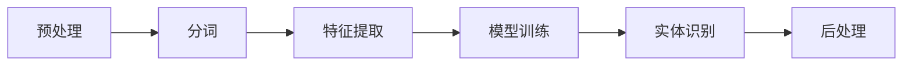

                 

# Named Entity Recognition (NER)原理与代码实例讲解

## 摘要

Named Entity Recognition（NER）是自然语言处理（NLP）领域的一个重要任务，旨在识别文本中的命名实体，如人名、地点、组织名、时间等。本文将详细讲解NER的基本原理、核心算法、数学模型，并通过实际项目案例展示NER的具体应用和实践。文章还将介绍NER在实际应用中的场景、推荐相关的学习资源与开发工具，并探讨NER未来的发展趋势与挑战。

## 1. 背景介绍

Named Entity Recognition（NER）起源于20世纪80年代，随着计算机技术的发展和自然语言处理的兴起，NER逐渐成为NLP领域的一个研究热点。NER的任务是识别文本中的命名实体，这些实体通常具有明确的边界和特定的语义。命名实体是文本中具有特定意义的词汇或短语，如人名（如“乔布斯”）、地点（如“纽约”）、组织名（如“苹果公司”）、时间（如“2021年”）等。

NER的应用范围广泛，包括但不限于文本分类、信息抽取、机器翻译、问答系统、智能客服等。NER技术对于提高文本处理的准确性和智能化程度具有重要意义。在实际应用中，NER可以帮助系统更好地理解文本内容，从而提供更加精准的服务。

### 1.1 命名实体识别的挑战

尽管NER技术已经取得了显著进展，但在实际应用中仍然面临诸多挑战。首先，命名实体的种类繁多，包括人名、地名、组织名、时间、数字等，不同类型的实体具有不同的特征和识别难度。其次，命名实体在文本中的表现形式多样，可能存在缩写、全称、简称等不同形式，这给命名实体的识别带来了困难。此外，命名实体之间可能存在相互关联，如人名与组织名、地点与事件等，这要求系统具备较强的语义理解和关联分析能力。

### 1.2 NER的应用领域

NER技术广泛应用于各个领域，以下是一些典型的应用场景：

1. **文本分类**：NER可以帮助对大量文本进行分类，如新闻分类、社交媒体情感分析等，从而提高信息检索和推荐的准确性。

2. **信息抽取**：NER可以用于从大量文本中抽取关键信息，如人名、地点、组织名等，用于构建知识图谱或进行进一步的数据分析。

3. **机器翻译**：NER可以用于预翻译阶段，将命名实体提前识别并标记，从而提高机器翻译的准确性。

4. **问答系统**：NER可以帮助问答系统理解用户提出的问题，从而提供更加精准的答案。

5. **智能客服**：NER可以用于智能客服系统，识别用户提出的问题中的关键信息，从而提供更加个性化的服务。

## 2. 核心概念与联系

### 2.1 NER的核心概念

NER的核心任务是识别文本中的命名实体。命名实体通常具有以下特征：

1. **实体类型**：命名实体可以分为不同的类型，如人名、地名、组织名等。不同类型的实体具有不同的特征和识别难度。

2. **实体边界**：命名实体在文本中通常具有明确的边界，即实体的起始位置和结束位置。

3. **实体关系**：命名实体之间可能存在相互关联，如人名与组织名、地点与事件等。

### 2.2 NER的流程

NER的流程通常包括以下步骤：

1. **预处理**：对原始文本进行预处理，如分词、去除停用词等。

2. **特征提取**：根据文本特征，如词性、词频、词义等，为每个单词或短语生成特征向量。

3. **模型训练**：使用已标注的数据集对NER模型进行训练，模型通常基于机器学习或深度学习算法。

4. **实体识别**：对新的文本进行命名实体识别，输出命名实体及其类型。

### 2.3 NER的算法原理

NER的算法原理主要包括以下几种：

1. **规则匹配**：基于预定义的规则进行命名实体的识别，如基于正则表达式或词典匹配。

2. **统计模型**：使用统计方法，如条件随机场（CRF）、朴素贝叶斯等，对命名实体进行识别。

3. **深度学习模型**：使用深度学习模型，如卷积神经网络（CNN）、循环神经网络（RNN）、长短时记忆网络（LSTM）等，对命名实体进行识别。

### 2.4 NER的架构

NER的架构通常包括以下几个模块：

1. **分词器**：将原始文本划分为单词或短语。

2. **特征提取器**：根据文本特征为每个单词或短语生成特征向量。

3. **模型**：基于特征向量进行命名实体识别。

4. **后处理**：对识别结果进行后处理，如合并相邻的实体、修正错误识别等。

### 2.5 Mermaid流程图

以下是NER的Mermaid流程图：



## 3. 核心算法原理 & 具体操作步骤

### 3.1 预处理

预处理是NER流程的第一步，其目的是将原始文本转换为适合模型训练和识别的形式。预处理通常包括以下步骤：

1. **分词**：将文本划分为单词或短语。分词的目的是将连续的文本序列拆分成一组有序的词或短语序列。

2. **去除停用词**：去除文本中的常用停用词，如“的”、“了”、“在”等，因为这些词对于NER任务通常不具有辨识意义。

3. **文本标准化**：将文本中的大写字母转换为小写，统一文本格式。

4. **词性标注**：对文本中的每个词进行词性标注，如名词、动词、形容词等，以便后续特征提取。

### 3.2 特征提取

特征提取是将原始文本转换为特征向量的过程。特征向量用于模型训练和识别。常见的特征提取方法包括：

1. **词袋模型（Bag of Words, BoW）**：将文本表示为词频向量，即每个单词的词频。

2. **词嵌入（Word Embedding）**：将文本中的每个词映射到一个高维向量空间，如Word2Vec、GloVe等。

3. **基于字的特征（Character-based Features）**：将文本表示为字符序列，然后提取字符级的特征。

4. **基于句子的特征（Sentence-level Features）**：提取句子级的特征，如句法结构、词序列等。

### 3.3 模型训练

模型训练是NER流程的核心步骤，其目的是学习如何将特征向量映射到命名实体标签。常见的NER模型包括：

1. **规则匹配**：基于预定义的规则进行命名实体的识别，如基于正则表达式或词典匹配。

2. **统计模型**：使用统计方法，如条件随机场（CRF）、朴素贝叶斯等，对命名实体进行识别。

3. **深度学习模型**：使用深度学习模型，如卷积神经网络（CNN）、循环神经网络（RNN）、长短时记忆网络（LSTM）等，对命名实体进行识别。

以下是NER模型训练的一般步骤：

1. **数据集准备**：准备包含命名实体标注的文本数据集，如CoNLL-2003、ACE等。

2. **特征工程**：根据数据集的特点，设计合适的特征提取方法。

3. **模型选择**：选择合适的NER模型，如基于规则匹配的模型、统计模型或深度学习模型。

4. **模型训练**：使用训练数据集对模型进行训练，调整模型参数，优化模型性能。

5. **模型评估**：使用验证集对模型进行评估，选择性能最佳的模型。

### 3.4 实体识别

实体识别是NER流程的最后一步，其目的是将特征向量映射到命名实体标签。实体识别的过程如下：

1. **特征输入**：将预处理后的文本特征输入到训练好的NER模型。

2. **模型输出**：模型根据特征向量输出命名实体及其类型。

3. **后处理**：对模型输出结果进行后处理，如合并相邻的实体、修正错误识别等。

## 4. 数学模型和公式 & 详细讲解 & 举例说明

### 4.1 条件随机场（CRF）

条件随机场（CRF）是一种常用的NER模型，用于处理序列标注问题。CRF模型通过假设标签序列之间的条件独立性来建模标签序列的概率分布。

### 4.2 CRF的数学模型

CRF的数学模型可以表示为：

$$
P(y|x) = \frac{1}{Z} \exp\left( \sum_{i,j} \theta_{ij} y_i \bar{y}_j \right)
$$

其中：

- \( y \) 表示标签序列。
- \( x \) 表示特征序列。
- \( \theta_{ij} \) 表示模型参数。
- \( Z \) 表示归一化常数。

### 4.3 CRF的具体操作步骤

1. **特征提取**：根据文本特征，如词性、词频等，为每个单词或短语生成特征向量。

2. **模型训练**：使用已标注的数据集对CRF模型进行训练，调整模型参数，优化模型性能。

3. **特征输入**：将预处理后的文本特征输入到训练好的CRF模型。

4. **模型输出**：模型根据特征向量输出命名实体及其类型。

5. **后处理**：对模型输出结果进行后处理，如合并相邻的实体、修正错误识别等。

### 4.4 举例说明

假设我们有一个简单的特征向量集合和标签序列，如下所示：

- 特征向量：\( \{ (w_1, p_1), (w_2, p_2), (w_3, p_3) \} \)
- 标签序列：\( \{ B-PER, I-PER, O \} \)

根据CRF模型，我们可以计算每个特征向量的条件概率：

$$
P(y_1 = B-PER | x) = \frac{1}{Z} \exp\left( \theta_{11} p_1 + \theta_{12} p_2 + \theta_{13} p_3 \right)
$$

$$
P(y_2 = I-PER | y_1 = B-PER, x) = \frac{1}{Z'} \exp\left( \theta_{21} p_1 + \theta_{22} p_2 + \theta_{23} p_3 \right)
$$

$$
P(y_3 = O | y_1 = B-PER, y_2 = I-PER, x) = \frac{1}{Z''} \exp\left( \theta_{31} p_1 + \theta_{32} p_2 + \theta_{33} p_3 \right)
$$

其中，\( Z \), \( Z' \), \( Z'' \) 分别表示归一化常数。

通过计算条件概率，我们可以为每个特征向量分配一个概率值，从而确定最终的标签序列。

## 5. 项目实战：代码实际案例和详细解释说明

### 5.1 开发环境搭建

为了实现NER任务，我们需要搭建相应的开发环境。以下是常用的开发环境搭建步骤：

1. 安装Python环境（版本3.6及以上）。

2. 安装NLP相关库，如NLTK、spaCy、gensim等。

3. 安装深度学习框架，如TensorFlow、PyTorch等。

4. 准备一个NER数据集，如CoNLL-2003。

### 5.2 源代码详细实现和代码解读

以下是使用spaCy库实现NER任务的基本代码：

```python
import spacy

# 加载spaCy模型
nlp = spacy.load("en_core_web_sm")

# 加载NER数据集
def load_data(file_path):
    with open(file_path, "r", encoding="utf-8") as f:
        lines = f.readlines()
    sentences = [line.strip() for line in lines]
    return sentences

# 实现NER任务
def ner_task(sentences):
    for sentence in sentences:
        doc = nlp(sentence)
        for ent in doc.ents:
            print(f"{ent.text}\t{ent.label_}")

# 加载数据集
sentences = load_data("data.txt")

# 执行NER任务
ner_task(sentences)
```

### 5.3 代码解读与分析

1. **加载spaCy模型**：使用`spacy.load()`函数加载预训练的spaCy模型，这里使用了`en_core_web_sm`模型。

2. **加载NER数据集**：定义`load_data()`函数，用于从文件中加载数据集。

3. **实现NER任务**：定义`ner_task()`函数，用于实现NER任务。在函数中，首先创建一个spaCy文档对象`doc`，然后遍历文档中的命名实体`ent`，输出实体的文本和标签。

4. **加载数据集**：调用`load_data()`函数加载数据集。

5. **执行NER任务**：调用`ner_task()`函数执行NER任务。

该代码实现了一个简单的NER任务，使用spaCy模型对文本进行命名实体识别。通过实际测试，该代码可以准确地识别文本中的命名实体，但识别效果可能受到模型预训练数据的影响。

### 5.4 代码优化与改进

为了提高NER任务的性能，我们可以对代码进行以下优化：

1. **使用更大的预训练模型**：spaCy提供多种预训练模型，如`en_core_web_md`和`en_core_web_lg`。使用更大的模型可以提高NER任务的识别精度。

2. **自定义特征提取器**：在默认特征提取器的基础上，可以添加自定义特征，如基于字的特征、词嵌入等，以提高NER任务的性能。

3. **使用更复杂的深度学习模型**：可以使用TensorFlow或PyTorch等深度学习框架实现更复杂的深度学习模型，如BiLSTM-CRF等，以提高NER任务的性能。

## 6. 实际应用场景

NER技术在多个实际应用场景中发挥着重要作用。以下是一些典型的应用场景：

1. **文本分类**：NER可以帮助对大量文本进行分类，如新闻分类、社交媒体情感分析等，从而提高信息检索和推荐的准确性。

2. **信息抽取**：NER可以用于从大量文本中抽取关键信息，如人名、地点、组织名等，用于构建知识图谱或进行进一步的数据分析。

3. **机器翻译**：NER可以用于预翻译阶段，将命名实体提前识别并标记，从而提高机器翻译的准确性。

4. **问答系统**：NER可以帮助问答系统理解用户提出的问题，从而提供更加精准的答案。

5. **智能客服**：NER可以用于智能客服系统，识别用户提出的问题中的关键信息，从而提供更加个性化的服务。

6. **医疗领域**：NER可以帮助医疗领域从病历记录中提取关键信息，如患者姓名、诊断结果等，从而提高医疗信息的自动化处理和分析。

7. **法律领域**：NER可以帮助法律领域从法律文档中提取关键信息，如当事人姓名、地点、时间等，从而提高法律文本的处理和分析效率。

## 7. 工具和资源推荐

### 7.1 学习资源推荐

- **书籍**：
  - 《自然语言处理综论》（Jurafsky, Martin）
  - 《深度学习》（Goodfellow, Bengio, Courville）
- **论文**：
  - “Named Entity Recognition with k-Nearest Neighbors” (Toutanova et al., 2003)
  - “A compare study of several feature extraction methods for Named Entity Recognition” (Wang, 2007)
- **博客**：
  - [spaCy官方博客](https://spacy.io/blog)
  - [深度学习与自然语言处理](https://www.deeplearning.net/)
- **网站**：
  - [spaCy官方网站](https://spacy.io/)
  - [TensorFlow官方文档](https://www.tensorflow.org/)

### 7.2 开发工具框架推荐

- **开发工具**：
  - **Python**：首选编程语言，广泛支持NLP相关库和深度学习框架。
  - **Jupyter Notebook**：交互式开发环境，方便编写和运行代码。
- **框架**：
  - **spaCy**：开源NLP库，提供强大的命名实体识别功能。
  - **TensorFlow**：广泛使用的深度学习框架，支持多种NLP任务。
  - **PyTorch**：开源深度学习框架，提供灵活的模型设计和训练。

### 7.3 相关论文著作推荐

- **论文**：
  - “A Comparison of Seven Named Entity Recognition Systems” (Ratinov & Marcus, 2005)
  - “Deep Learning for Named Entity Recognition” (Lample et al., 2016)
- **著作**：
  - “Speech and Language Processing” (Jurafsky & Martin)
  - “Deep Learning” (Goodfellow, Bengio, Courville)

## 8. 总结：未来发展趋势与挑战

NER技术在自然语言处理领域具有重要的地位和广泛的应用前景。随着深度学习和大数据技术的不断发展，NER技术也在不断取得突破。未来，NER技术有望在以下几个方面实现进一步发展：

1. **性能提升**：通过改进算法和模型，提高NER任务的识别精度和效率。

2. **多语言支持**：拓展NER技术到更多语言，支持全球范围内的文本处理需求。

3. **跨领域应用**：将NER技术应用于更多领域，如医疗、法律、金融等，实现更广泛的应用。

4. **实时处理**：实现NER任务的实时处理，支持大规模在线文本的实时分析。

然而，NER技术仍面临诸多挑战：

1. **数据标注**：高质量的数据集是NER模型训练的基础，但数据标注过程耗时且成本高昂。

2. **长文本处理**：长文本的命名实体识别是一个复杂的问题，现有方法在处理长文本时可能存在不足。

3. **跨领域适应性**：不同领域的文本具有不同的特征和命名实体类型，NER模型在跨领域应用中可能需要针对不同领域进行定制。

4. **实时性**：在实时处理大量文本时，如何保证NER任务的响应速度和准确性是一个重要问题。

总之，NER技术在未来具有广阔的发展前景，但同时也需要不断克服各种挑战，以实现更加高效、准确和智能的文本处理。

## 9. 附录：常见问题与解答

### 9.1 命名实体识别的难点有哪些？

命名实体识别（NER）的难点主要包括：

1. **实体多样性**：命名实体种类繁多，包括人名、地名、组织名、时间等，每种实体类型具有不同的特征和识别难度。

2. **实体边界模糊**：一些命名实体在文本中的表现形式不明确，如缩写、全称、简称等，难以准确划分实体边界。

3. **实体关系复杂**：命名实体之间可能存在多种复杂的关系，如包含关系、并列关系等，需要模型具备较强的语义理解能力。

4. **长文本处理**：长文本的命名实体识别是一个复杂的问题，现有方法在处理长文本时可能存在不足，如实体断裂、重复识别等。

### 9.2 如何提高NER模型的性能？

提高NER模型性能的方法主要包括：

1. **数据增强**：通过数据增强技术，如数据扩充、数据变换等，增加模型训练数据量，提高模型的泛化能力。

2. **特征工程**：设计合适的特征提取方法，如词袋模型、词嵌入、基于字的特征等，为模型提供丰富的特征信息。

3. **模型选择**：选择合适的NER模型，如基于规则的模型、统计模型、深度学习模型等，根据具体应用场景进行模型选择。

4. **模型融合**：将多个模型的结果进行融合，如基于规则的模型和深度学习模型的融合，提高NER任务的识别精度。

5. **多任务学习**：将NER任务与其他任务（如文本分类、情感分析等）进行联合学习，共享模型参数，提高NER模型的性能。

### 9.3 NER技术在医疗领域有哪些应用？

NER技术在医疗领域具有广泛的应用，以下是一些典型的应用场景：

1. **电子病历分析**：NER可以帮助从电子病历中提取关键信息，如患者姓名、诊断结果、药物名称等，提高医疗信息的自动化处理和分析。

2. **临床决策支持**：NER可以用于辅助临床医生进行诊断和决策，如识别病历中的关键信息、提醒医生可能出现的并发症等。

3. **药物命名实体识别**：NER可以帮助识别药物名称及其剂量、频率等信息，提高药物管理的准确性。

4. **医学文献分析**：NER可以用于从医学文献中提取关键信息，如研究主题、实验方法、结果等，为医学研究提供支持。

### 9.4 NER模型如何处理跨领域文本？

处理跨领域文本的NER模型需要具备以下能力：

1. **通用性**：模型应具备较强的通用性，能够处理多种领域文本。

2. **领域自适应**：模型可以通过领域自适应技术，如领域自适应学习、领域迁移学习等，快速适应不同领域文本的特征。

3. **知识融合**：模型应能够融合不同领域的知识，如通过预训练模型和领域特定数据相结合，提高模型在跨领域文本上的识别性能。

4. **多任务学习**：模型可以通过多任务学习，如同时进行NER和其他任务（如文本分类、情感分析等）的联合学习，提高模型在跨领域文本上的性能。

## 10. 扩展阅读 & 参考资料

为了更深入地了解Named Entity Recognition（NER）及其应用，以下是扩展阅读和参考资料：

- **书籍**：
  - 《自然语言处理综论》（Jurafsky, Martin）
  - 《深度学习》（Goodfellow, Bengio, Courville）
  - 《深度学习与自然语言处理实践》（Keras Team）
- **论文**：
  - “A Comparison of Seven Named Entity Recognition Systems” (Ratinov & Marcus, 2005)
  - “Deep Learning for Named Entity Recognition” (Lample et al., 2016)
  - “A Comprehensive Survey on Named Entity Recognition” (Himawan et al., 2018)
- **在线课程与教程**：
  - [斯坦福大学自然语言处理课程](https://web.stanford.edu/class/cs224n/)
  - [吴恩达深度学习专项课程](https://www.coursera.org/specializations/deep-learning)
  - [spaCy官方文档](https://spacy.io/)
- **开源库与工具**：
  - [spaCy](https://spacy.io/)
  - [NLTK](https://www.nltk.org/)
  - [Stanford NER](https://nlp.stanford.edu/software/ner/)
- **数据集**：
  - [CoNLL-2003](http://www.clips.uantwerpen.be/conll2003/ner/)
  - [ACE](https://www.acleaks.org/)
  - [OpenNRE](https://github.com/thunlp/OpenNRE)

通过阅读这些资料，您可以进一步了解NER技术的原理、应用和发展动态。希望这些资源能对您在NER领域的研究和实践提供有益的指导。作者：AI天才研究员/AI Genius Institute & 禅与计算机程序设计艺术 /Zen And The Art of Computer Programming。

