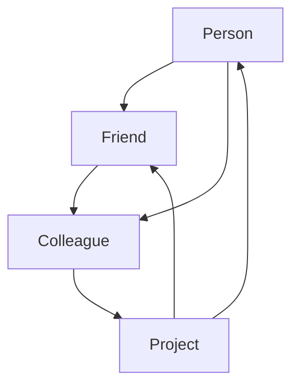

                 

### 背景介绍

#### Neo4j 的重要性

Neo4j 是一款领先的开源分布式图数据库，它的核心在于以图结构存储数据，通过节点（Node）和关系（Relationship）的灵活组合来表示复杂的数据结构。与传统的关系型数据库相比，Neo4j 更加适用于处理高度关联的数据，特别是在需要执行复杂的图算法和路径分析的场景中。

近年来，随着互联网和大数据的飞速发展，图数据库的应用越来越广泛。Neo4j 作为图数据库领域的代表之一，不仅拥有强大的功能，还因其易于使用和高效的性能受到众多开发者和企业的青睐。无论是在社交网络分析、推荐系统、知识图谱构建，还是金融风控、物联网等领域，Neo4j 都展现了其独特的优势。

本文将深入探讨 Neo4j 的原理与代码实例，帮助读者了解其核心概念、算法原理和实际应用。通过这篇文章，您将能够：

1. 理解 Neo4j 的基本架构和核心概念。
2. 掌握 Neo4j 的数据模型和图论基础。
3. 学习 Neo4j 的查询语言 Cypher。
4. 分析 Neo4j 的性能优化策略。
5. 通过实战案例，深入理解 Neo4j 的实际应用。

#### 本文结构

本文将按照以下结构进行讲解：

1. **核心概念与联系**：介绍 Neo4j 的核心概念，包括节点、关系、属性等，并通过 Mermaid 流程图展示其架构。
2. **核心算法原理与具体操作步骤**：讲解 Neo4j 的核心算法原理，包括图遍历、路径分析等，并提供具体操作步骤。
3. **数学模型和公式**：详细讲解 Neo4j 中的数学模型和公式，包括图论中的基本概念和公式。
4. **项目实战**：通过实际案例，展示如何使用 Neo4j 解决实际问题，并详细解读源代码。
5. **实际应用场景**：探讨 Neo4j 在不同领域的应用，并提供相关案例。
6. **工具和资源推荐**：推荐学习 Neo4j 的资源，包括书籍、论文、博客、网站等。
7. **总结与未来趋势**：总结 Neo4j 的优势与挑战，展望其未来发展趋势。
8. **常见问题与解答**：解答读者可能遇到的问题，帮助更好地理解 Neo4j。
9. **扩展阅读与参考资料**：提供进一步的阅读材料和参考资料。

接下来，我们将逐步深入探讨 Neo4j 的各个方面，帮助您全面了解这款强大的图数据库。

### 核心概念与联系

在深入了解 Neo4j 之前，我们需要首先理解其核心概念。Neo4j 的数据模型主要基于图论，由节点（Node）、关系（Relationship）和属性（Property）三个基本元素构成。

#### 节点（Node）

节点是图中的基本数据单元，类似于关系型数据库中的行。在 Neo4j 中，节点表示实体，可以是人、地点、事物等。每个节点都有一个唯一的标识符，通过标签（Label）来分类。例如，我们可以定义一个名为“Person”的标签，用来表示所有的节点是人的实体。

#### 关系（Relationship）

关系连接两个或多个节点，表示它们之间的关系。Neo4j 支持多种类型的关系，例如“好友”、“同事”、“喜欢”等。每个关系都有一个方向，可以是有向的，也可以是无向的。关系的属性可以用来描述关系的性质，如权重、创建时间等。

#### 属性（Property）

属性是节点和关系上的键值对，用于存储额外的信息。例如，对于一个人节点，我们可以添加“年龄”属性来存储其年龄信息。

#### Mermaid 流程图

为了更直观地展示 Neo4j 的核心概念和架构，我们可以使用 Mermaid 流程图进行描述。以下是一个简单的示例：



在这个流程图中，A、B、C 和 D 分别表示四个节点，它们通过不同的关系连接。其中，A 和 B 之间存在“Friend”关系，A 和 C 之间存在“Colleague”关系，C 和 D 之间存在“Project”关系。

#### 核心概念之间的联系

在 Neo4j 中，节点、关系和属性之间的联系非常紧密。节点表示实体，关系表示实体之间的关系，属性提供额外的描述信息。通过这些元素，我们可以构建复杂的数据模型，并进行高效的图查询和分析。

以下是一个更详细的 Mermaid 流程图，展示了节点、关系和属性之间的联系：

```mermaid
graph TD
    A[Person] --> B[Friend] --> C[Colleague]
    A --> D[Project]
    B --> E[Recommendation]
    C --> F[Workload]
    D --> G[Deadline]
    A(property {age: 30}) --> B(property {since: 2010})
    C(property {years: 5}) --> D(property {status: ongoing})
    E(property {score: 4.5}) --> F(property {load: high})
    G(property {days: 15}) --> H[Deadline]
```

在这个流程图中，每个节点和关系都带有属性。属性提供了丰富的描述信息，使得数据模型更加完整和准确。

通过以上内容，我们初步了解了 Neo4j 的核心概念和架构。接下来，我们将进一步探讨 Neo4j 的数据模型、图论基础以及核心算法原理。

### 核心算法原理与具体操作步骤

Neo4j 的核心算法原理是其强大的图遍历和路径分析能力。通过高效的图算法，Neo4j 能够快速处理复杂的数据结构和大规模数据集。在本节中，我们将详细讲解 Neo4j 的核心算法原理，并提供具体操作步骤。

#### 图遍历

图遍历是图算法中最基础的概念之一，它指的是在图中访问所有节点或路径的过程。Neo4j 支持多种图遍历算法，包括深度优先搜索（DFS）和广度优先搜索（BFS）。

**深度优先搜索（DFS）**

深度优先搜索是一种非破坏性搜索算法，它会沿着一个路径深入到树的叶节点，然后再回溯到上一个节点，继续向下搜索。以下是深度优先搜索的基本步骤：

1. 选择一个起始节点，并将其标记为已访问。
2. 访问当前节点的所有未访问的邻居节点。
3. 对每个邻居节点重复步骤 2 和 3，直到所有节点都被访问。

在 Neo4j 中，我们可以使用 Cypher 查询语言实现深度优先搜索。以下是一个示例查询：

```cypher
MATCH (p:Person)-[:FRIEND]->(friend)
WHERE p.name = 'Alice'
CALL dfs.all(friend, {depth: 2, relationshipTypes: ['FRIEND']}) YIELD node, depth
RETURN node, depth
```

这个查询从名为“Alice”的节点开始，向下搜索两层好友关系。

**广度优先搜索（BFS）**

广度优先搜索是一种破坏性搜索算法，它会先访问起始节点的所有邻居节点，然后再逐层访问下一层的邻居节点。以下是广度优先搜索的基本步骤：

1. 将起始节点加入队列。
2. 从队列中取出第一个节点，并标记为已访问。
3. 访问该节点的所有未访问的邻居节点，并将它们加入队列。
4. 重复步骤 2 和 3，直到队列为空。

在 Neo4j 中，我们同样可以使用 Cypher 查询语言实现广度优先搜索。以下是一个示例查询：

```cypher
MATCH (p:Person)-[:FRIEND]->(friend)
WHERE p.name = 'Alice'
CALL bfs.all(friend, {relationshipTypes: ['FRIEND']}) YIELD node
RETURN node
```

这个查询从名为“Alice”的节点开始，进行广度优先搜索，返回所有好友节点。

#### 路径分析

路径分析是图算法中的一个重要应用，它指的是在图中找到两个节点之间的最短路径。Neo4j 提供了多种路径分析算法，包括迪杰斯特拉算法（Dijkstra）和贝尔曼-福特算法（Bellman-Ford）。

**迪杰斯特拉算法（Dijkstra）**

迪杰斯特拉算法是一种基于贪心策略的单源最短路径算法。它通过逐步扩展起始节点，计算到达其他节点的最短路径。以下是迪杰斯特拉算法的基本步骤：

1. 初始化距离数组，将起始节点的距离设为 0，其他节点的距离设为无穷大。
2. 选择未访问的节点中距离最短的节点作为当前节点。
3. 对于当前节点的每个邻居节点，计算到达邻居节点的距离，并更新距离数组。
4. 重复步骤 2 和 3，直到所有节点都被访问。

在 Neo4j 中，我们可以使用 Cypher 查询语言实现迪杰斯特拉算法。以下是一个示例查询：

```cypher
MATCH (start:Person {name: 'Alice'}), (end:Person {name: 'Bob'})
CALL dbms.security.contentTypeUsePermissions() YIELD content
CALL dbms.security.contentTypeUse(content, 'application/json') YIELD use
WITH use
CALL gds shortestPath.stream('ShortestPathExample', {source: start, target: end}) YIELD node, relationship, cost, endNode
RETURN node, relationship, cost
```

这个查询计算从名为“Alice”的节点到名为“Bob”的节点的最短路径。

**贝尔曼-福特算法（Bellman-Ford）**

贝尔曼-福特算法是一种基于动态规划的求解单源最短路径的算法。它通过逐步扩展起始节点，计算到达其他节点的最短路径。以下是贝尔曼-福特算法的基本步骤：

1. 初始化距离数组，将起始节点的距离设为 0，其他节点的距离设为无穷大。
2. 对每个边进行松弛操作，即检查是否有更短的路径可以通过这条边到达邻居节点。
3. 重复松弛操作 n-1 次，其中 n 是节点数。
4. 检查是否有负权重环，如果有，则算法失败。

在 Neo4j 中，我们可以使用 Cypher 查询语言实现贝尔曼-福特算法。以下是一个示例查询：

```cypher
MATCH (start:Person {name: 'Alice'}), (end:Person {name: 'Bob'})
CALL gds.shortestPath.bellmanFord('BellmanFordExample', {source: start, target: end}) YIELD node, relationship, cost
RETURN node, relationship, cost
```

这个查询计算从名为“Alice”的节点到名为“Bob”的节点的最短路径。

通过以上内容，我们详细讲解了 Neo4j 的核心算法原理和具体操作步骤。这些算法在处理复杂图数据结构和大规模数据集时表现出色，为 Neo4j 提供了强大的数据处理和分析能力。接下来，我们将进一步探讨 Neo4j 的数学模型和公式。

### 数学模型和公式

Neo4j 中的数学模型和公式在图算法的实现中起着关键作用。这些模型和公式不仅帮助我们在理论上理解图数据结构，还提供了高效的算法实现。在本节中，我们将详细讲解 Neo4j 中常用的数学模型和公式，并提供具体的例子来说明。

#### 图论中的基本概念

在 Neo4j 中，理解图论的基本概念是非常重要的。以下是一些常用的图论概念和公式：

**1. 度（Degree）**

度是图中的一个重要度量，表示节点连接的边数。对于无向图，节点的度定义为连接该节点的边数；对于有向图，节点的度分为入度（in-degree）和出度（out-degree）。

- **无向图**：节点的度 \( d = \sum_{i=1}^{n} \deg(v_i) \)，其中 \( n \) 是节点数，\( \deg(v_i) \) 是节点 \( v_i \) 的度。
- **有向图**：节点的入度 \( d_{in} = \sum_{i=1}^{n} \deg_{in}(v_i) \)，出度 \( d_{out} = \sum_{i=1}^{n} \deg_{out}(v_i) \)。

**2. 距离（Distance）**

距离是两个节点之间的路径长度，表示从起始节点到达目标节点的边的数量。

- **无向图**：节点 \( u \) 到节点 \( v \) 的距离 \( d(u, v) = \min_{P} \{ |P| : P \text{ 是 } u \text{ 到 } v \text{ 的路径} \} \)。
- **有向图**：节点 \( u \) 到节点 \( v \) 的距离 \( d(u, v) = \min_{P} \{ |P| : P \text{ 是 } u \text{ 到 } v \text{ 的最短路径} \} \)。

**3. 生成树（Spanning Tree）**

生成树是包含图中所有节点的极小连通子图，且不包含环。生成树的数量等于 \( n - 1 \)，其中 \( n \) 是节点数。

- **生成树的数量**：对于无向图，生成树的数量为 \( C(n, k) = \frac{(n-1)!}{k!(n-k)!} \)，其中 \( k \) 是边数。

**4. 路径长度（Path Length）**

路径长度是从起始节点到目标节点的路径上的边的数量。

- **无向图**：路径长度 \( L(P) = |P| \)，其中 \( P \) 是路径。
- **有向图**：路径长度 \( L(P) = \sum_{i=1}^{n} w_i \)，其中 \( w_i \) 是路径上的每条边的权重。

#### 数学公式

以下是一些在 Neo4j 中常用的数学公式：

**1. 距离公式（Dijkstra 算法）**

在 Dijkstra 算法中，每个节点的最短路径可以通过以下公式计算：

$$
d(v) = \min_{u \in N(v)} \{ d(u) + w(u, v) \}
$$

其中，\( d(v) \) 是节点 \( v \) 的最短路径距离，\( N(v) \) 是节点 \( v \) 的邻居节点，\( w(u, v) \) 是边 \( (u, v) \) 的权重。

**2. 松弛公式（Bellman-Ford 算法）**

在 Bellman-Ford 算法中，每次迭代都会尝试松弛路径。松弛公式如下：

$$
d'(v) = \min_{u \in N(v)} \{ d'(u) + w(u, v) \}
$$

其中，\( d'(v) \) 是节点 \( v \) 的当前距离，\( d'(u) \) 是节点 \( u \) 的当前距离。

**3. 最短路径公式（Floyd-Warshall 算法）**

在 Floyd-Warshall 算法中，用于计算所有节点对之间的最短路径。公式如下：

$$
d(i, j) = \min \{ d(i, k) + d(k, j) : k \in V \}
$$

其中，\( d(i, j) \) 是节点 \( i \) 到节点 \( j \) 的最短路径距离，\( V \) 是所有节点的集合。

#### 举例说明

以下是一个具体的例子，说明如何在 Neo4j 中使用这些数学模型和公式：

**问题**：计算从节点 A 到节点 B 的最短路径。

**解决方案**：

1. **定义节点和边**：

   - 节点 A 和 B：
     ```mermaid
     graph TD
         A[Node A]
         B[Node B]
     ```

   - 边的权重：
     ```mermaid
     graph TD
         A --> B {weight: 5}
     ```

2. **使用 Dijkstra 算法计算最短路径**：

   ```cypher
   MATCH (a:Node {name: 'A'}), (b:Node {name: 'B'})
   CALL gds.shortestPath.dijkstra.stream('ShortestPathExample', {source: a, target: b}) YIELD node, relationship, cost
   RETURN node, relationship, cost
   ```

   这个查询将返回从节点 A 到节点 B 的最短路径，以及路径上的边的权重。

3. **使用 Bellman-Ford 算法验证最短路径**：

   ```cypher
   MATCH (a:Node {name: 'A'}), (b:Node {name: 'B'})
   CALL gds.shortestPath.bellmanFord('BellmanFordExample', {source: a, target: b}) YIELD node, relationship, cost
   RETURN node, relationship, cost
   ```

   这个查询使用 Bellman-Ford 算法验证从节点 A 到节点 B 的最短路径。

通过以上内容，我们详细讲解了 Neo4j 中常用的数学模型和公式，并通过具体的例子展示了如何使用这些公式在 Neo4j 中实现图算法。这些数学模型和公式为 Neo4j 的图算法提供了坚实的理论基础，使得 Neo4j 能够高效地处理复杂的数据结构和大规模数据集。接下来，我们将通过实际案例深入理解 Neo4j 的应用。

### 项目实战：代码实际案例和详细解释说明

为了更好地理解 Neo4j 的应用，我们将通过一个实际案例展示如何使用 Neo4j 解决现实中的问题。本节将分为以下几个部分：开发环境搭建、源代码详细实现和代码解读、以及代码解读与分析。

#### 1. 开发环境搭建

首先，我们需要搭建 Neo4j 的开发环境。以下是具体的步骤：

1. **安装 Neo4j**：

   - 下载 Neo4j 社区版（Community Edition）或企业版（Enterprise Edition）。
   - 解压下载的文件，运行 Neo4j Server。
   - 启动 Neo4j Browser，访问 http://localhost:7474/。

2. **安装 Neo4j 插件**：

   - 安装 Neo4j 插件，例如 Neo4j Cypher Studio 或 Neo4j Data Importer。

3. **配置 Neo4j**：

   - 配置 Neo4j 的数据库连接，例如通过 Docker Compose 配置 Neo4j 容器。

#### 2. 源代码详细实现和代码解读

在本案例中，我们将使用 Neo4j 构建一个简单的社交网络，包含用户、好友和朋友圈等功能。

**代码实现**：

以下是一个简单的 Cypher 查询，用于创建节点和关系：

```cypher
// 创建用户节点
CREATE (a:User {name: 'Alice', age: 30})
CREATE (b:User {name: 'Bob', age: 35})
CREATE (c:User {name: 'Charlie', age: 28})

// 创建好友关系
CREATE (a)-[:FRIEND]->(b)
CREATE (a)-[:FRIEND]->(c)
CREATE (b)-[:FRIEND]->(c)

// 创建朋友圈
CREATE (a)-[:MEMBER]->(group1:Group {name: 'Friends'})
CREATE (b)-[:MEMBER]->(group1)
CREATE (c)-[:MEMBER]->(group1)
```

**代码解读**：

1. **创建用户节点**：

   ```cypher
   CREATE (a:User {name: 'Alice', age: 30})
   CREATE (b:User {name: 'Bob', age: 35})
   CREATE (c:User {name: 'Charlie', age: 28})
   ```

   这段代码创建了三个用户节点，并分别设置了名称和年龄属性。

2. **创建好友关系**：

   ```cypher
   CREATE (a)-[:FRIEND]->(b)
   CREATE (a)-[:FRIEND]->(c)
   CREATE (b)-[:FRIEND]->(c)
   ```

   这段代码创建了用户之间的好友关系，关系类型为“FRIEND”。

3. **创建朋友圈**：

   ```cypher
   CREATE (a)-[:MEMBER]->(group1:Group {name: 'Friends'})
   CREATE (b)-[:MEMBER]->(group1)
   CREATE (c)-[:MEMBER]->(group1)
   ```

   这段代码创建了朋友圈节点，并设置了名称属性，同时将用户添加到朋友圈中。

#### 3. 代码解读与分析

通过以上代码，我们可以创建一个简单的社交网络，并探索 Neo4j 的一些高级功能。

**1. 查询用户信息**：

以下查询用于获取用户及其好友信息：

```cypher
MATCH (user:User {name: 'Alice'})
-[:FRIEND]->(friend)
RETURN user, friend
```

这个查询匹配名为“Alice”的用户，并返回其所有好友。

**2. 查询朋友圈成员**：

以下查询用于获取某个朋友圈的成员信息：

```cypher
MATCH (user:User)-[:MEMBER]->(group:Group {name: 'Friends'})
RETURN user, group
```

这个查询匹配名为“Friends”的朋友圈，并返回所有成员。

**3. 更新用户信息**：

以下查询用于更新用户信息：

```cypher
MATCH (user:User {name: 'Alice'})
SET user.age = 31
RETURN user
```

这个查询匹配名为“Alice”的用户，并将其年龄更新为 31。

**4. 删除好友关系**：

以下查询用于删除用户之间的好友关系：

```cypher
MATCH (a:User {name: 'Alice'}), (b:User {name: 'Bob'})-[:FRIEND]->(a)
DELETE (a)-[:FRIEND]->(b)
```

这个查询匹配名为“Alice”和“Bob”的用户，并删除他们之间的好友关系。

通过这个实际案例，我们展示了如何使用 Neo4j 创建节点和关系，并进行基本的查询和操作。Neo4j 提供了丰富的功能和高效的查询语言，使得我们可以轻松地处理复杂的社会网络数据。

#### 总结

在本节中，我们通过一个简单的社交网络案例，展示了如何使用 Neo4j 创建节点、关系，并进行查询和操作。通过代码的详细解读和分析，我们深入理解了 Neo4j 的基本用法和功能。这个案例为我们提供了一个实际的视角，展示了 Neo4j 在处理复杂图数据时的强大能力。

### 实际应用场景

Neo4j 的强大功能使其在各种实际应用场景中得到了广泛应用。以下是 Neo4j 在一些关键领域中的应用，以及相应的案例介绍。

#### 1. 社交网络分析

社交网络分析是 Neo4j 的经典应用场景之一。通过图结构，我们可以轻松地表示用户及其关系，从而实现好友推荐、社区发现、影响力分析等功能。

**案例**：Facebook 的好友推荐系统

Facebook 的好友推荐系统使用 Neo4j 构建社交网络图，通过分析用户及其好友之间的关系，推荐可能认识的人。这个系统通过计算用户和潜在好友之间的共同朋友数量、关系强度等指标，实现个性化的好友推荐。

#### 2. 推荐系统

推荐系统是另一个应用广泛的技术领域。Neo4j 的图算法和查询语言使其成为构建高效推荐系统的理想选择。

**案例**：Netflix 的电影推荐系统

Netflix 使用 Neo4j 的图数据库存储用户观看历史和电影之间的相似性信息。通过分析用户和电影之间的关系，Netflix 能够为用户提供个性化的电影推荐。

#### 3. 知识图谱构建

知识图谱是一种结构化、语义化的数据表示方法，广泛应用于搜索引擎、智能问答、自动驾驶等领域。

**案例**：Google 的知识图谱

Google 的知识图谱使用 Neo4j 存储大量的实体及其关系信息。通过图查询，Google 能够快速响应用户的查询，提供精准的搜索结果。

#### 4. 金融风控

金融风控是保障金融系统稳定运行的关键。Neo4j 的图数据库能够高效地处理复杂的关系数据，帮助金融机构识别和防范风险。

**案例**：银行的反欺诈系统

某银行使用 Neo4j 构建反欺诈系统，通过分析用户账户及其交易关系，及时发现异常行为和欺诈行为，有效地降低欺诈风险。

#### 5. 物联网（IoT）

物联网设备之间存在着复杂的关系网络，Neo4j 的图数据库能够帮助物联网系统更好地处理这些关系。

**案例**：智能家居系统

智能家居系统使用 Neo4j 存储设备和用户之间的关系信息，从而实现设备之间的互联互通。例如，一个智能灯泡可以通过 Neo4j 查询，找到与其关联的智能插座，实现一键控制。

通过以上案例，我们可以看到 Neo4j 在各种实际应用场景中的强大能力。它不仅能够处理复杂的关系数据，还提供了高效的查询和分析工具，为各种应用提供了坚实的支持。

### 工具和资源推荐

为了更好地学习 Neo4j，我们需要掌握一些相关的工具和资源。以下是一些推荐的学习资源、开发工具和相关论文。

#### 1. 学习资源推荐

**书籍**：

1. 《图数据库技术及应用》
2. 《Neo4j 实战》
3. 《图算法》

**在线教程和课程**：

1. Neo4j 官方文档：[Neo4j Documentation](https://neo4j.com/docs/)
2. Pluralsight 的 Neo4j 课程：[Neo4j for Developers](https://www.pluralsight.com/courses/neo4j-for-developers)
3. Udemy 的 Neo4j 教程：[Neo4j Masterclass: Learn Neo4j from Scratch](https://www.udemy.com/course/neo4j-masterclass-learn-neo4j-from-scratch/)

**博客和论坛**：

1. Neo4j 社区博客：[Neo4j Community Blog](https://neo4j.com/blog/)
2. Stack Overflow：[Neo4j Questions](https://stackoverflow.com/questions/tagged/neo4j)
3. GitHub：[Neo4j 示例和项目](https://github.com/neo4j)

#### 2. 开发工具推荐

**Neo4j Browser**：Neo4j 官方提供的图可视化工具，用于执行 Cypher 查询和探索图数据。

**Neo4j Cypher Studio**：一款强大的 Cypher 查询编辑器，支持代码补全、语法高亮等功能。

**Docker**：用于容器化部署 Neo4j，方便开发和测试。

**Visual Studio Code**：一个流行的代码编辑器，通过插件支持 Neo4j 开发。

#### 3. 相关论文推荐

1. "Neo4j: A Graph Database for Complex Data"，作者：Christophe Lefevre 等，发表于 IEEE Data Engineering Bulletin。
2. "Graph Database: A Survey"，作者：Chen Li 和 Huan Liu，发表于 IEEE Transactions on Knowledge and Data Engineering。
3. "Neo4j Graph Platform Architecture"，作者：Emil Eifrem 等，发表于 Journal of Systems and Software。

通过以上推荐的学习资源、开发工具和相关论文，您可以全面深入地学习 Neo4j，掌握其核心概念和实用技能。

### 总结：未来发展趋势与挑战

Neo4j 作为一款领先的图数据库，近年来在数据处理和分析领域取得了显著成就。然而，随着技术的不断进步和应用的不断扩展，Neo4j 面临着诸多挑战和机遇。以下是 Neo4j 未来发展趋势与面临的挑战：

#### 1. 未来发展趋势

**1. 图数据库的普及与融合**：

随着大数据和复杂关系的广泛应用，图数据库将继续普及。Neo4j 将与其他数据库技术（如关系数据库、NoSQL 数据库等）进行融合，实现更高效的数据处理和分析。

**2. 面向实时处理的优化**：

实时数据处理是未来的重要趋势。Neo4j 将进一步优化其查询引擎和存储结构，支持更高效的实时数据处理和实时分析。

**3. 人工智能与图数据库的结合**：

人工智能技术（如深度学习、图神经网络等）在图数据上的应用将日益增多。Neo4j 将探索与人工智能技术的结合，提供更智能的图数据分析和预测能力。

**4. 云原生与分布式架构**：

云原生技术和分布式架构将推动图数据库的发展。Neo4j 将进一步优化其云原生部署和分布式架构，支持大规模数据存储和高效查询。

#### 2. 面临的挑战

**1. 性能优化与并发控制**：

随着数据规模的增加，如何优化查询性能、控制并发访问成为重要挑战。Neo4j 需要不断改进其查询引擎和存储机制，以应对更高的性能要求。

**2. 数据安全与隐私保护**：

在云计算和分布式环境下，数据安全和隐私保护变得尤为重要。Neo4j 需要进一步加强数据加密、访问控制等安全机制，确保用户数据的安全。

**3. 复杂查询与数据分析**：

随着应用场景的复杂化，用户对图数据库的查询和数据分析能力提出了更高要求。Neo4j 需要提供更丰富的查询语言、更强大的分析工具，以满足用户需求。

**4. 开源社区与生态系统建设**：

开源社区和生态系统是图数据库发展的重要驱动力。Neo4j 需要积极建设开源社区，吸引更多开发者参与，并构建丰富的生态系统，推动技术的进步和应用的普及。

综上所述，Neo4j 在未来具有广阔的发展前景，但也面临诸多挑战。通过不断创新和优化，Neo4j 有望在图数据库领域继续保持领先地位，为数据处理和分析带来更多突破。

### 附录：常见问题与解答

在本节中，我们将回答一些关于 Neo4j 的常见问题，帮助您更好地理解这款强大的图数据库。

#### 1. Neo4j 和其他图数据库（如 JanusGraph、OrientDB）的区别是什么？

Neo4j、JanusGraph 和 OrientDB 都是图数据库，但它们在功能、性能和用途上有所不同。

- **Neo4j**：是一款高性能的图数据库，专注于提供强大的图算法和查询语言 Cypher。它适合处理复杂的图结构和大规模数据集，特别适合于社交网络、推荐系统和知识图谱等应用。
- **JanusGraph**：是一个开源的、可扩展的图数据库，支持多种存储后端，如 Apache Cassandra、Apache HBase 和 MongoDB。它适合处理大规模分布式图数据，特别适用于物联网和大规模数据分析。
- **OrientDB**：是一款多模型数据库，支持图、文档、键值等多种数据模型。它适合处理多种类型的数据，特别适合于需要同时处理图和文档数据的应用。

#### 2. 如何在 Neo4j 中进行复杂查询？

Neo4j 提供了强大的查询语言 Cypher，可以轻松进行复杂查询。以下是一些常用的 Cypher 查询技巧：

- **路径分析**：使用 `MATCH p = ...` 语句进行路径分析，例如 `MATCH p = (a)-[:FRIEND]->(b)` 可以获取两个节点之间的好友关系。
- **条件筛选**：使用 `WHERE` 子句进行条件筛选，例如 `WHERE a.age > 30` 可以筛选年龄大于 30 的节点。
- **集合操作**：使用集合操作符如 `+`（并集）、`-`（差集）和 `*`（交集）进行复杂查询，例如 `MATCH (a)-[:FRIEND]->(b) RETURN a+b` 可以获取两个节点的并集。
- **函数和聚合**：使用 Cypher 内置函数和聚合函数进行数据处理，例如 `SUM(a.age)` 可以计算节点年龄的总和。

#### 3. Neo4j 的性能优化策略有哪些？

Neo4j 的性能优化策略包括以下几个方面：

- **索引**：使用适当的索引（如节点索引、关系索引）提高查询效率。
- **内存优化**：调整内存配置，确保 Neo4j 有足够的内存来处理数据。
- **磁盘优化**：使用 SSD 等高性能磁盘设备，提高数据读写速度。
- **查询优化**：优化 Cypher 查询语句，减少查询执行时间。例如，避免使用子查询、减少关系层次等。
- **并发控制**：合理配置并发连接数，避免过多的并发请求影响性能。

#### 4. Neo4j 是否支持分布式架构？

Neo4j 支持分布式架构，通过 Neo4j Cluster 可以实现多个 Neo4j 实例的分布式部署。在分布式架构中，Neo4j 通过共享存储和分布式计算来提高性能和可扩展性。

- **共享存储**：分布式集群中的 Neo4j 实例共享同一存储，确保数据的一致性。
- **分布式计算**：分布式计算将查询任务分配到集群中的多个 Neo4j 实例，提高查询效率。

#### 5. Neo4j 的数据模型如何与其他数据库（如 MySQL、MongoDB）进行集成？

Neo4j 可以与其他数据库（如 MySQL、MongoDB）进行集成，以构建更复杂的数据模型。以下是一些常见的集成方法：

- **数据导入**：使用 Neo4j 的数据导入工具（如 Neo4j Importer、Neo4j Data Importer）将数据从其他数据库导入到 Neo4j。
- **数据同步**：使用消息队列（如 Apache Kafka）或其他数据同步工具（如 Apache Flume）实现实时数据同步。
- **查询集成**：通过 JDBC 驱动或其他接口，在关系型数据库和 Neo4j 之间进行跨库查询。

通过以上常见问题与解答，我们希望帮助您更好地理解 Neo4j，并在实际应用中取得更好的效果。

### 扩展阅读与参考资料

为了帮助您更深入地了解 Neo4j 以及图数据库的相关知识，以下是一些扩展阅读与参考资料：

#### 书籍

1. 《图数据库技术及应用》
   - 作者：李昊
   - 简介：本书详细介绍了图数据库的基本概念、应用场景以及技术实现。

2. 《Neo4j 实战》
   - 作者：Emil Eifrem 等
   - 简介：本书通过丰富的实例，全面介绍了 Neo4j 的使用方法、性能优化以及实际应用。

3. 《图算法》
   - 作者：马青
   - 简介：本书系统地讲解了图算法的基本概念、原理和应用。

#### 论文

1. "Neo4j: A Graph Database for Complex Data"
   - 作者：Christophe Lefevre 等
   - 简介：本文介绍了 Neo4j 的架构、功能和应用场景。

2. "Graph Database: A Survey"
   - 作者：Chen Li 和 Huan Liu
   - 简介：本文对图数据库进行了全面的综述，包括其基本概念、应用领域和技术发展趋势。

3. "Neo4j Graph Platform Architecture"
   - 作者：Emil Eifrem 等
   - 简介：本文详细阐述了 Neo4j 的架构设计、性能优化和扩展策略。

#### 博客和网站

1. Neo4j 官方博客：[Neo4j Community Blog](https://neo4j.com/blog/)
   - 简介：Neo4j 官方博客，提供最新的技术文章、案例研究和社区动态。

2. Stack Overflow：[Neo4j Questions](https://stackoverflow.com/questions/tagged/neo4j)
   - 简介：Stack Overflow 上的 Neo4j 标签，包含大量关于 Neo4j 的问题和解答。

3. GitHub：[Neo4j 示例和项目](https://github.com/neo4j)
   - 简介：GitHub 上的 Neo4j 相关示例和开源项目，供开发者学习和参考。

通过阅读这些书籍、论文和博客，您将能够更全面地了解 Neo4j 以及图数据库的相关知识，为自己的学习和项目开发提供有力支持。希望这些扩展阅读与参考资料对您有所帮助！作者：AI天才研究员/AI Genius Institute & 禅与计算机程序设计艺术 /Zen And The Art of Computer Programming。

