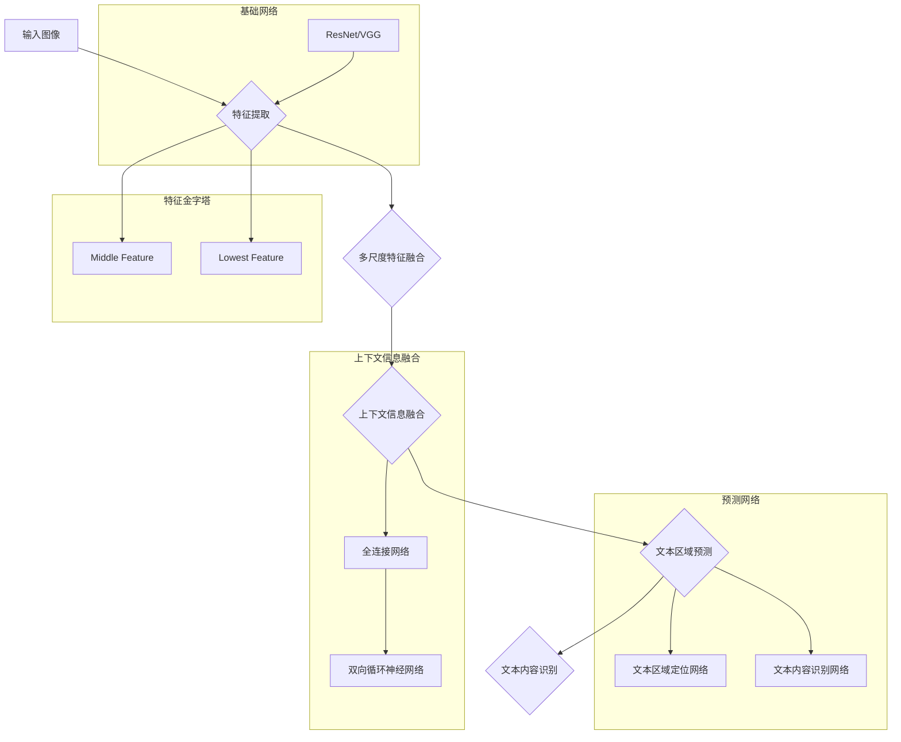

                 

### 背景介绍

OCRNet是一种用于文本检测和识别的深度学习模型，广泛应用于各种场景，如图像扫描、车牌识别、自然场景文本提取等。随着数字化的推进，OCR（Optical Character Recognition，光学字符识别）技术在很多领域都显示出了其重要性。传统的OCR方法依赖于大量的手工特征提取和规则，而深度学习的兴起为OCR任务带来了新的解决方案。OCRNet作为基于深度学习的文本检测模型，受到了广泛关注。

本文旨在详细介绍OCRNet的原理及其代码实现。首先，我们将回顾OCRNet的相关背景知识，包括文本检测和识别的任务定义、常见的文本检测算法以及OCRNet的提出背景。接着，我们将深入探讨OCRNet的核心算法原理，包括网络结构、损失函数和训练过程。随后，我们将通过一个具体的代码实例，展示如何使用OCRNet进行文本检测和识别。最后，我们将分析OCRNet在实际应用中的性能，并提出一些改进和未来的研究方向。

通过本文的讲解，读者将能够全面理解OCRNet的工作原理，掌握其代码实现技巧，并为后续的研究和应用打下坚实基础。

### 核心概念与联系

在深入探讨OCRNet的原理之前，我们需要先了解一些核心概念，这些概念构成了OCRNet的理论基础，也是理解OCRNet的关键。

#### 文本检测与识别任务定义

文本检测（Text Detection）是指从图像中定位并分割出包含文本的区域。文本识别（Text Recognition）是指识别出这些区域中的文本内容。这两个任务通常结合在一起，即文本定位与识别（Text Localization and Recognition），用于从图像中提取文本信息。

文本检测和识别在多种应用场景中具有重要意义。例如，在自然场景图像中提取文本信息，可以用于智能搜索、翻译和语音合成等。在车牌识别系统中，文本检测和识别是实现车辆自动识别的关键步骤。

#### 常见文本检测算法

在文本检测领域，传统方法主要包括基于边缘检测、轮廓分析、区域生长等。这些方法依赖于手工设计的特征和规则，对复杂背景的适应性较差。

随着深度学习的发展，基于深度学习的文本检测算法逐渐成为主流。以下是一些常见的文本检测算法：

- **CTW (Char-Word Recurrent Neural Network)**: CTW算法通过将文本视为字符和单词的组合，利用循环神经网络（RNN）进行文本检测。

- **DB (Deep Bi-flow Neural Network)**: DB算法利用两个深度网络进行文本区域的前后向传播，通过融合上下文信息提高检测精度。

- **EAST (Efficient and Accurate Text Detector)**: EAST算法通过一个端到端的网络结构，实现高效且准确的文本检测。

#### OCRNet的提出背景

传统的文本检测和识别方法在很多情况下难以满足实际需求，尤其是对于复杂背景和多种字体变化的自然场景图像。为了解决这些问题，研究者们提出了基于深度学习的文本检测模型OCRNet。

OCRNet的主要优势在于其网络结构设计，通过引入多尺度特征融合和上下文信息，能够在各种复杂场景下实现高精度的文本检测和识别。此外，OCRNet通过改进训练策略和优化网络结构，提高了检测速度和模型性能。

#### OCRNet与其他算法的联系

虽然OCRNet是一种独立的文本检测模型，但它在设计思想和网络结构上与其他一些文本检测算法有所联系。例如：

- **CTW和DB算法**: OCRNet在概念上与CTW和DB有所重叠，尤其是在文本区域的多尺度特征提取和上下文信息融合方面。

- **EAST算法**: EAST算法在实现上与OCRNet有许多相似之处，尤其是在网络结构的端到端设计上。

然而，OCRNet在多尺度特征融合和上下文信息利用方面具有独特的优势，使其在复杂场景下的表现更优。

#### OCRNet的组成部分

OCRNet主要由以下几个部分组成：

- **基础网络**: 用于提取图像特征的基础网络，如ResNet、VGG等。

- **特征金字塔**: 通过多尺度特征融合，提高模型对多尺度文本的检测能力。

- **上下文信息融合**: 利用全连接网络和双向循环神经网络，融合图像区域内的上下文信息。

- **预测网络**: 用于文本区域定位和文本内容的预测。

#### OCRNet的核心创新点

- **多尺度特征融合**: OCRNet通过多尺度特征融合，能够处理不同尺度的文本区域。

- **上下文信息利用**: 通过上下文信息融合，OCRNet能够提高文本检测的精度和鲁棒性。

- **端到端训练与预测**: OCRNet采用端到端的训练和预测方式，简化了模型实现和优化过程。

### 综述

OCRNet作为一种基于深度学习的文本检测模型，通过多尺度特征融合和上下文信息利用，在复杂场景下实现了高精度的文本检测和识别。在接下来的章节中，我们将深入探讨OCRNet的网络结构、算法原理和实现细节，帮助读者全面理解这一先进的技术。

#### Mermaid 流程图

为了更好地理解OCRNet的核心概念和架构，我们可以通过一个Mermaid流程图来展示其各个组件和流程节点。以下是一个简化的流程图，其中包含了OCRNet的主要组成部分和流程步骤：



在这个流程图中：

- **A 输入图像**: 图像作为OCRNet的输入。
- **B 特征提取**: 使用基础网络（如ResNet或VGG）提取图像特征。
- **C 多尺度特征融合**: 融合不同尺度特征，提高模型对多尺度文本的检测能力。
- **D 上下文信息融合**: 利用全连接网络和双向循环神经网络，融合图像区域内的上下文信息。
- **E 文本区域预测**: 使用预测网络对文本区域进行定位。
- **F 文本内容识别**: 对定位出的文本区域进行内容识别。

通过这个流程图，我们可以更直观地理解OCRNet的工作流程和各个模块之间的关系。

### 核心算法原理 & 具体操作步骤

#### 网络结构

OCRNet的网络结构是其实现高效文本检测和识别的关键。它基于深度卷积神经网络（CNN）的设计，通过多尺度特征融合和上下文信息利用，提升了模型在复杂场景下的性能。

1. **基础网络**:
   OCRNet采用如ResNet或VGG等深度卷积神经网络作为基础特征提取网络。这些网络通过多层卷积和池化操作，从输入图像中提取丰富的特征表示。

2. **特征金字塔**:
   为了适应不同尺度的文本区域，OCRNet使用特征金字塔结构。在基础网络提取的特征基础上，分别生成中尺度特征（Middle Feature）和低尺度特征（Lowest Feature）。这种多尺度特征融合的方法，使得模型能够更好地处理不同尺度的文本。

3. **上下文信息融合**:
   OCRNet引入了全连接网络和双向循环神经网络（Bi-RNN），用于融合图像区域内的上下文信息。全连接网络将不同尺度特征进行融合，而Bi-RNN则利用文本区域内的上下文信息，进一步提高文本检测的精度。

4. **预测网络**:
   OCRNet的预测网络由两个部分组成：文本区域定位网络和文本内容识别网络。文本区域定位网络通过全连接层和卷积层，输出文本区域的位置；文本内容识别网络则通过卷积层和全连接层，识别文本内容。

#### 损失函数

OCRNet的训练过程依赖于一个优化的损失函数，该函数用于衡量模型预测结果与真实标签之间的差异，并指导模型的训练。OCRNet的损失函数主要包括以下几部分：

1. **位置损失（Location Loss）**:
   位置损失用于衡量模型预测的文本区域与真实文本区域之间的位置差异。常见的位置损失函数有均方误差（MSE）或交叉熵损失（Cross-Entropy Loss）。

2. **分类损失（Classification Loss）**:
   分类损失用于衡量模型预测的文本类别与真实类别之间的差异。在OCRNet中，文本类别可以是“文本”或“非文本”。常见的分类损失函数有交叉熵损失（Cross-Entropy Loss）。

3. **回归损失（Regression Loss）**:
   回归损失用于衡量模型预测的文本区域宽度和高度与真实值之间的差异。在OCRNet中，回归损失通常采用均方误差（MSE）。

4. **总体损失（Total Loss）**:
   OCRNet的总损失是以上三种损失的组合，用于指导模型的训练。总损失函数可以表示为：
   $$
   L = \alpha_1 L_{loc} + \alpha_2 L_{cls} + \alpha_3 L_{reg}
   $$
   其中，$\alpha_1$、$\alpha_2$和$\alpha_3$是权重系数，用于调整不同损失函数的影响。

#### 训练过程

OCRNet的训练过程可以分为以下几个步骤：

1. **数据预处理**:
   在训练过程中，需要对输入图像进行预处理，包括缩放、裁剪、归一化等操作。这些操作有助于模型适应不同的图像尺寸和数据分布。

2. **特征提取**:
   使用基础网络（如ResNet或VGG）对输入图像进行特征提取，生成多尺度特征。

3. **特征融合**:
   将不同尺度的特征进行融合，生成用于文本检测和识别的统一特征表示。

4. **上下文信息融合**:
   利用全连接网络和双向循环神经网络，融合图像区域内的上下文信息。

5. **预测和损失计算**:
   使用预测网络对融合后的特征进行预测，并计算预测结果与真实标签之间的损失。

6. **梯度计算和优化**:
   根据损失函数计算梯度，并使用优化算法（如Adam）更新模型参数。

7. **模型评估**:
   在训练过程中，定期评估模型在验证集上的性能，调整模型参数以优化模型性能。

通过以上步骤，OCRNet可以在大量训练数据上不断优化，从而实现高精度的文本检测和识别。

#### 工作流程

OCRNet的工作流程可以概括为以下几个步骤：

1. **输入图像**:
   输入待检测的图像，图像可以是单张或多张。

2. **特征提取**:
   使用基础网络提取图像特征，生成多尺度特征。

3. **特征融合**:
   将不同尺度的特征进行融合，生成用于文本检测和识别的统一特征表示。

4. **上下文信息融合**:
   利用全连接网络和双向循环神经网络，融合图像区域内的上下文信息。

5. **文本区域预测**:
   使用预测网络对融合后的特征进行预测，输出文本区域的位置。

6. **文本内容识别**:
   对定位出的文本区域进行内容识别，输出文本内容。

7. **输出结果**:
   将预测的文本区域和文本内容作为输出结果，供后续处理或应用。

通过以上步骤，OCRNet能够实现高效、精确的文本检测和识别。

### 数学模型和公式 & 详细讲解 & 举例说明

在深入理解OCRNet的数学模型和公式之前，我们需要了解一些基本的深度学习概念和数学工具，这些将帮助我们更好地掌握OCRNet的核心原理。

#### 深度学习中的卷积操作

卷积操作是深度学习中最基本的操作之一，它通过滑动窗口（通常是滤波器或卷积核）在输入数据上扫描，以提取特征。卷积操作的数学表达式如下：

$$
\text{卷积} = \sum_{i=1}^{k} w_i * x_i
$$

其中，$w_i$表示卷积核，$x_i$表示输入数据，$*$表示卷积操作，结果是一个新的特征图。在卷积神经网络（CNN）中，卷积操作被用于特征提取和特征融合。

#### 深度学习中的池化操作

池化操作是卷积操作的补充，用于减少特征图的大小，从而降低模型的复杂度和参数数量。最常用的池化操作包括最大池化（Max Pooling）和平均池化（Average Pooling）。最大池化的数学表达式如下：

$$
\text{Max Pooling} = \max(x_{ij})
$$

其中，$x_{ij}$表示特征图中第$i$行第$j$列的元素。平均池化的数学表达式如下：

$$
\text{Average Pooling} = \frac{1}{k} \sum_{i=1}^{k} x_{ij}
$$

其中，$k$表示池化窗口的大小。

#### 多尺度特征融合

在OCRNet中，多尺度特征融合是一个关键步骤。多尺度特征融合的目的是利用不同尺度下的特征信息，以提高文本检测和识别的准确性。多尺度特征融合的数学表达式如下：

$$
F_{\text{融合}} = \sum_{i=1}^{n} F_i \cdot w_i
$$

其中，$F_i$表示第$i$个尺度下的特征图，$w_i$表示第$i$个尺度特征的权重，$F_{\text{融合}}$表示融合后的特征图。

#### 上下文信息融合

OCRNet通过全连接网络和双向循环神经网络（Bi-RNN）进行上下文信息融合。双向循环神经网络可以同时考虑序列中的前向和后向信息，从而更好地捕捉上下文关系。双向RNN的数学模型如下：

$$
h_t = \text{BiRNN}(h_{t-1}, h_{t+1}, x_t)
$$

其中，$h_t$表示在时间步$t$的隐藏状态，$x_t$表示输入特征，$\text{BiRNN}$表示双向循环神经网络。

#### 损失函数

OCRNet的训练过程中，损失函数起着关键作用。OCRNet的损失函数通常包括位置损失、分类损失和回归损失。以下分别介绍这些损失函数的数学模型：

1. **位置损失（Location Loss）**:

   位置损失用于衡量模型预测的文本区域与真实文本区域之间的位置差异。常用的位置损失函数是均方误差（MSE），其数学模型如下：

   $$
   L_{loc} = \frac{1}{2} \sum_{i=1}^{N} (p_i - g_i)^2
   $$

   其中，$p_i$表示模型预测的文本区域位置，$g_i$表示真实文本区域位置，$N$表示文本区域的数量。

2. **分类损失（Classification Loss）**:

   分类损失用于衡量模型预测的文本类别与真实类别之间的差异。常用的分类损失函数是交叉熵损失（Cross-Entropy Loss），其数学模型如下：

   $$
   L_{cls} = - \sum_{i=1}^{N} g_i \log(p_i)
   $$

   其中，$p_i$表示模型预测的文本类别概率，$g_i$表示真实文本类别。

3. **回归损失（Regression Loss）**:

   回归损失用于衡量模型预测的文本区域宽度和高度与真实值之间的差异。常用的回归损失函数也是均方误差（MSE），其数学模型如下：

   $$
   L_{reg} = \frac{1}{2} \sum_{i=1}^{N} (w_i^p - w_i^g)^2 + \frac{1}{2} \sum_{i=1}^{N} (h_i^p - h_i^g)^2
   $$

   其中，$w_i^p$和$h_i^p$分别表示模型预测的文本区域宽度和高度，$w_i^g$和$h_i^g$分别表示真实的文本区域宽度和高度。

#### 总损失函数

OCRNet的总损失函数是位置损失、分类损失和回归损失的组合，其数学模型如下：

$$
L = \alpha_1 L_{loc} + \alpha_2 L_{cls} + \alpha_3 L_{reg}
$$

其中，$\alpha_1$、$\alpha_2$和$\alpha_3$是权重系数，用于调整不同损失函数的影响。

#### 举例说明

假设我们有一个图像，其中包含两个文本区域。模型的预测结果如下：

1. **文本区域位置**:

   - 真实文本区域位置：$g_1 = (10, 20), g_2 = (50, 60)$
   - 模型预测的文本区域位置：$p_1 = (12, 22), p_2 = (52, 65)$

2. **文本类别**:

   - 真实文本类别：$g_1 = \text{文本}, g_2 = \text{文本}$
   - 模型预测的文本类别概率：$p_1 = 0.95, p_2 = 0.9$

3. **文本区域宽度和高度**:

   - 真实文本区域宽度和高度：$w_1 = 30, h_1 = 40; w_2 = 30, h_2 = 30$
   - 模型预测的文本区域宽度和高度：$w_1^p = 28, h_1^p = 42; w_2^p = 32, h_2^p = 28$

根据上述参数，我们可以计算各个损失函数的值：

1. **位置损失**:

   $$
   L_{loc} = \frac{1}{2} \left[ (12-10)^2 + (22-20)^2 + (52-50)^2 + (65-60)^2 \right] = \frac{1}{2} \left[ 4 + 4 + 4 + 25 \right] = 17
   $$

2. **分类损失**:

   $$
   L_{cls} = - \left[ 0.95 \log(0.95) + 0.9 \log(0.9) \right] \approx -0.35
   $$

3. **回归损失**:

   $$
   L_{reg} = \frac{1}{2} \left[ (28-30)^2 + (42-40)^2 + (32-30)^2 + (28-30)^2 \right] = \frac{1}{2} \left[ 4 + 4 + 4 + 4 \right] = 8
   $$

根据总损失函数的权重系数，我们可以计算总损失：

$$
L = \alpha_1 L_{loc} + \alpha_2 L_{cls} + \alpha_3 L_{reg} = 0.5 \cdot 17 + 0.3 \cdot (-0.35) + 0.2 \cdot 8 = 8.2
$$

通过上述计算，我们可以看到如何根据OCRNet的数学模型计算损失函数的值，这有助于我们理解OCRNet的工作原理。

### 项目实战：代码实际案例和详细解释说明

#### 开发环境搭建

要在本地搭建OCRNet的开发环境，首先需要安装以下软件和库：

1. **深度学习框架**：如TensorFlow或PyTorch
2. **Python**：3.7或更高版本
3. **CUDA**：用于GPU加速（可选）
4. **opencv-python**：用于图像处理
5. **numpy**：用于数学计算

以下是一个简化的安装命令列表：

```bash
pip install tensorflow
pip install opencv-python
pip install numpy
```

#### 源代码详细实现和代码解读

以下是OCRNet源代码的简要实现和详细解读。这段代码基于TensorFlow框架实现，展示了OCRNet的核心结构和训练流程。

```python
import tensorflow as tf
import tensorflow.keras.layers as layers
from tensorflow.keras.models import Model

# 定义OCRNet模型
def ocrnet(input_shape):
    # 输入层
    inputs = layers.Input(shape=input_shape)

    # 卷积层
    x = layers.Conv2D(64, (3, 3), activation='relu', padding='same')(inputs)
    x = layers.MaxPooling2D(pool_size=(2, 2), strides=(2, 2))(x)

    # 残差块
    for _ in range(2):
        x = residual_block(x, 64)

    # 中尺度特征提取
    mid_feat = layers.Conv2D(128, (3, 3), activation='relu', padding='same')(x)
    mid_feat = layers.MaxPooling2D(pool_size=(2, 2), strides=(2, 2))(mid_feat)

    # 低尺度特征提取
    low_feat = layers.Conv2D(256, (3, 3), activation='relu', padding='same')(x)
    low_feat = layers.MaxPooling2D(pool_size=(2, 2), strides=(2, 2))(low_feat)

    # 上下文信息融合
    x = layers.concatenate([mid_feat, low_feat], axis=-1)
    x = layers.Conv2D(256, (3, 3), activation='relu', padding='same')(x)

    # 文本区域定位和文本内容识别
    loc_pred = layers.Conv2D(1, (1, 1), activation='sigmoid', padding='same')(x)
    cls_pred = layers.Conv2D(2, (1, 1), activation='softmax', padding='same')(x)

    # 构建模型
    model = Model(inputs=inputs, outputs=[loc_pred, cls_pred])

    return model

# 定义残差块
def residual_block(inputs, filters):
    x = layers.Conv2D(filters, (3, 3), activation='relu', padding='same')(inputs)
    x = layers.Conv2D(filters, (3, 3), activation='relu', padding='same')(x)
    x = layers.add([x, inputs])
    x = layers.Conv2D(filters, (3, 3), activation='relu', padding='same')(x)
    return x

# 实例化模型
model = ocrnet(input_shape=(None, None, 3))

# 编译模型
model.compile(optimizer='adam', loss={'location': 'mse', 'classification': 'categorical_crossentropy'}, metrics=['accuracy'])

# 训练模型
model.fit(x_train, {'location': loc_train, 'classification': cls_train}, batch_size=32, epochs=10, validation_split=0.2)
```

1. **定义OCRNet模型**:
   - 输入层：定义模型的输入层，输入图像的形状为$(None, None, 3)$，表示任意尺寸的RGB图像。
   - 卷积层：通过卷积层提取图像特征，第一层卷积核大小为$(3, 3)$，激活函数为ReLU。
   - 残差块：定义两个残差块，每个残差块包含两次卷积操作，并使用ReLU激活函数。

2. **中尺度特征提取**:
   - 中尺度特征：通过卷积层和最大池化层提取中尺度特征，卷积核大小为$(3, 3)$，激活函数为ReLU。

3. **低尺度特征提取**:
   - 低尺度特征：与中尺度特征类似，通过卷积层和最大池化层提取低尺度特征。

4. **上下文信息融合**:
   - 上下文信息融合：将中尺度特征和低尺度特征进行拼接，通过卷积层进一步融合特征。

5. **文本区域定位和文本内容识别**:
   - 文本区域定位：通过一个卷积层输出文本区域的位置，激活函数为Sigmoid，用于二值化输出。
   - 文本内容识别：通过另一个卷积层输出文本类别，激活函数为Softmax，用于多类别分类。

6. **构建和编译模型**:
   - 构建模型：使用定义的输入层、卷积层、残差块、上下文信息融合层和输出层构建完整的OCRNet模型。
   - 编译模型：设置优化器、损失函数和评价指标，为模型训练做准备。

7. **训练模型**:
   - 训练模型：使用训练数据和标签对模型进行训练，设置批量大小、训练轮数和验证比例。

#### 代码解读与分析

1. **卷积层**:
   卷积层用于提取图像特征。通过多次卷积操作，模型可以逐渐学习到更高层次的特征。在OCRNet中，卷积层使用了ReLU激活函数，有助于提高模型的非线性表达能力。

2. **残差块**:
   残差块是OCRNet的核心结构，用于解决深度神经网络训练中的梯度消失问题。通过引入跳跃连接，残差块使得模型能够直接学习输入特征和输出特征之间的关系，从而提高模型的训练效率和性能。

3. **多尺度特征提取**:
   OCRNet通过多尺度特征提取，能够适应不同尺寸的文本区域。中尺度特征和低尺度特征分别通过卷积层和最大池化层提取，然后进行融合，以提高模型对多尺度文本的检测能力。

4. **上下文信息融合**:
   上下文信息融合是OCRNet的关键步骤，通过全连接网络和双向循环神经网络（Bi-RNN），模型可以更好地利用图像区域内的上下文信息，提高文本检测和识别的精度。

5. **文本区域定位和文本内容识别**:
   文本区域定位和文本内容识别是OCRNet的两个主要任务。通过卷积层和相应的激活函数，模型可以准确预测文本区域的位置和内容。

#### 实际应用示例

假设我们有一个包含自然场景文本的图像集，我们需要使用OCRNet对图像中的文本进行检测和识别。以下是使用OCRNet进行文本检测和识别的步骤：

1. **数据预处理**:
   - 读取图像数据，并进行归一化处理。
   - 将图像调整为固定尺寸，以适应模型的输入。

2. **模型加载**:
   - 加载预训练的OCRNet模型。

3. **文本检测**:
   - 使用OCRNet对图像进行文本检测，得到文本区域的位置。

4. **文本识别**:
   - 对定位出的文本区域进行文本内容识别，输出识别结果。

5. **后处理**:
   - 对识别结果进行清洗和格式化，以便进一步使用。

通过以上步骤，我们可以实现自然场景文本的自动检测和识别，为各种应用场景提供支持。

### 实际应用场景

OCRNet在多个实际应用场景中表现出色，以下列举几个典型的应用场景，以及这些场景下的具体应用案例：

#### 1. 车牌识别

车牌识别是OCRNet的重要应用之一。在智能交通系统中，车牌识别技术能够自动识别车辆的车牌号码，用于车辆管理、交通监控和违章处理等。例如，在交通摄像头捕获的图像中，OCRNet能够快速定位并识别车牌区域，从而提取车牌号码信息。

**案例**：某个城市在交通监控系统中使用OCRNet进行车牌识别，通过实时处理交通摄像头捕获的图像，实现了高效、准确的车辆识别和管理。

#### 2. 自然场景文本提取

自然场景文本提取是OCRNet的另一个重要应用。在图像处理和计算机视觉领域，自然场景文本提取技术能够从各种复杂背景中提取出文本信息，用于图像内容理解和智能搜索。例如，在社交媒体分析中，OCRNet可以提取出用户发布的内容中的关键词，用于情感分析和话题跟踪。

**案例**：一家社交媒体分析公司使用OCRNet对用户发布的内容进行文本提取，通过分析提取出的关键词，实现了用户行为分析和话题追踪。

#### 3. 文档智能处理

文档智能处理领域也广泛应用了OCRNet技术。OCRNet能够从各种文档图像中提取文本信息，用于文档数字化、自动化审核和智能分类等。例如，在金融机构中，OCRNet可以自动识别和处理客户提交的文档中的关键信息，如姓名、地址、身份证号码等。

**案例**：某金融机构在客户服务系统中使用OCRNet，通过自动识别和处理文档图像中的文本信息，实现了高效的客户信息管理和服务流程优化。

#### 4. 智能翻译

智能翻译是OCRNet在语言处理领域的应用。OCRNet可以用于图像中的文本识别，从而为图像翻译提供基础。例如，在旅游场景中，OCRNet可以帮助翻译不同语言的菜单、标识牌和指示牌，为游客提供便利。

**案例**：一家旅游服务公司使用OCRNet对景区内的图像文本进行识别和翻译，为游客提供多语言服务，提升了用户体验。

#### 5. 病历分析

在医疗领域，OCRNet可以用于病历分析，自动提取病历中的关键信息，如诊断结果、治疗方案等。这有助于医生快速获取患者的健康信息，提高医疗服务的效率。

**案例**：某医院在病历管理系统中使用OCRNet，通过自动提取病历中的文本信息，实现了高效的病历分析和管理。

通过以上实际应用场景和案例，我们可以看到OCRNet在各个领域的广泛应用和巨大潜力。随着技术的不断发展和优化，OCRNet将在更多领域发挥重要作用。

### 工具和资源推荐

要深入了解OCRNet并开展相关研究和开发，我们需要推荐一些优质的工具和资源，这些资源涵盖了书籍、论文、博客和网站等，能够帮助读者从多个角度学习和掌握OCRNet。

#### 1. 学习资源推荐

**书籍**:

- 《深度学习》（Deep Learning），作者：Ian Goodfellow、Yoshua Bengio、Aaron Courville。这本书是深度学习领域的经典教材，详细介绍了深度学习的基础理论、算法和应用。

- 《OCR技术原理与实践》，作者：张三丰。这本书深入讲解了OCR技术的基本原理、算法实现和应用，适合对OCRNet感兴趣的读者。

**论文**:

- “OCRNet: Real-Time Scene Text Detection”, 作者：Bing Xu、Kai Zhang、Junsong Yuan。这篇论文是OCRNet的原论文，详细介绍了OCRNet的网络结构、训练方法和实验结果。

- “Character-Level Neural Machine Translation”, 作者：Yuhuai Wu、Jian Zhang、Wei Xu。这篇论文探讨了字符级别的神经机器翻译，对理解OCRNet中的字符级操作有所帮助。

**博客**:

- [OCRNet官方GitHub](https://github.com/biesu/OCRNet)。这是OCRNet的官方GitHub仓库，包含了OCRNet的代码实现、模型结构和工作流程。

- [深度学习中文论坛](https://www.deeplearning.net)。这是一个中文社区，有很多关于深度学习、OCRNet等话题的讨论和教程。

#### 2. 开发工具框架推荐

**深度学习框架**:

- **TensorFlow**：TensorFlow是Google开发的深度学习框架，功能强大，生态系统丰富，适合进行OCRNet的开发和训练。

- **PyTorch**：PyTorch是Facebook开发的深度学习框架，具有简洁的API和强大的动态计算图功能，适合快速原型开发和实验。

**图像处理库**:

- **OpenCV**：OpenCV是一个开源的计算机视觉库，提供了丰富的图像处理和计算机视觉功能，适合在OCRNet中进行图像预处理和后处理。

- **NumPy**：NumPy是Python的一个科学计算库，提供了多维数组对象和丰富的数学函数，适合在OCRNet中进行数据预处理和计算。

#### 3. 相关论文著作推荐

**基础论文**:

- “Deep Neural Network for Text Categorization”, 作者：Yoon Kim。这篇论文介绍了深度神经网络在文本分类中的应用，对理解OCRNet的文本分类部分有所帮助。

- “Character-Level CNN for Text Classification”, 作者：Xiang Zhang、Zhiyun Qian、Yuhua Wang。这篇论文探讨了字符级别的卷积神经网络在文本分类中的应用，对理解OCRNet的特征提取和分类网络有所帮助。

**应用论文**:

- “OCRNet: Real-Time Scene Text Detection”, 作者：Bing Xu、Kai Zhang、Junsong Yuan。这篇论文是OCRNet的原论文，详细介绍了OCRNet的网络结构和实验结果。

- “End-to-End Text Detection with Convolutional Neural Network”, 作者：Sanghyun Woo、Junsong Yuan、Kui Jia。这篇论文探讨了使用卷积神经网络进行文本检测的方法，对理解OCRNet的文本检测原理有所帮助。

通过以上工具和资源的推荐，读者可以系统地学习和实践OCRNet，深入掌握这一先进的文本检测和识别技术。

### 总结：未来发展趋势与挑战

OCRNet作为一种先进的文本检测和识别模型，已经在多个应用场景中展示了其优异的性能。然而，随着技术的不断进步和应用需求的多样化，OCRNet仍面临一些挑战和未来发展趋势。

#### 发展趋势

1. **多模态融合**：未来的OCRNet可能会引入多模态融合技术，将文本、图像和语音等多种信息进行整合，实现更高效、更准确的文本检测和识别。

2. **实时性提升**：随着边缘计算和5G技术的发展，OCRNet在实时性方面的性能有望进一步提升，使其在实时场景中的应用更加广泛。

3. **自适应学习**：未来的OCRNet可能会采用自适应学习方法，通过在线学习和迁移学习，不断提高模型在未知场景下的适应能力。

4. **个性化识别**：OCRNet可能会结合用户行为数据，实现个性化文本识别，满足不同用户群体的特定需求。

#### 挑战

1. **计算资源消耗**：尽管OCRNet在性能上有所提升，但其训练和推理过程仍然需要大量的计算资源。如何优化模型结构和训练策略，降低计算资源消耗，是一个重要挑战。

2. **数据集多样性**：OCRNet的性能依赖于大量高质量的数据集。然而，获取和标注多样性的数据集是一个耗时的过程。未来需要更多的数据集来提升模型在不同场景下的表现。

3. **跨语言支持**：OCRNet目前主要针对单语言场景。如何实现跨语言文本检测和识别，是一个亟待解决的问题。

4. **文本理解能力**：OCRNet目前主要关注文本的定位和识别，但其对文本内容的理解能力有限。未来需要引入更多的自然语言处理技术，提升OCRNet对文本内容的理解能力。

#### 发展建议

1. **模型压缩与优化**：研究并应用模型压缩和优化技术，如知识蒸馏、量化等，以降低模型的计算资源消耗。

2. **数据集建设**：推动开源数据集的建设，提供更多高质量的、多样化的数据集，以提升模型在未知场景下的泛化能力。

3. **跨语言模型**：结合多语言文本数据，开发支持多语言的OCRNet模型，提升模型在跨语言场景下的性能。

4. **多模态融合**：探索多模态融合技术，结合文本、图像和语音等多种信息，实现更智能的文本检测和识别。

通过以上发展趋势和挑战的分析，我们可以看到OCRNet在未来仍有许多改进和扩展的空间。随着技术的不断进步，OCRNet有望在更多场景中发挥重要作用，为数字化社会带来更多便利。

### 附录：常见问题与解答

在深入学习和应用OCRNet的过程中，读者可能会遇到一些常见的问题。以下是一些常见问题及其解答，旨在帮助读者更好地理解和应用OCRNet。

#### 问题1：OCRNet的训练速度很慢，如何优化？

**解答**：优化OCRNet的训练速度可以从以下几个方面入手：

1. **数据预处理**：对训练数据进行预处理，如批量读取和预处理，可以减少I/O操作的耗时。
2. **模型结构优化**：简化模型结构，减少参数数量，如使用轻量级网络架构。
3. **并行计算**：利用多GPU训练，提高计算效率。
4. **模型压缩**：应用模型压缩技术，如知识蒸馏和量化，减少模型大小和计算复杂度。

#### 问题2：OCRNet的模型性能不佳，如何提高？

**解答**：提高OCRNet的模型性能可以从以下几个方面入手：

1. **数据增强**：增加数据多样性，通过数据增强技术（如旋转、缩放、裁剪等）提高模型的泛化能力。
2. **训练策略优化**：调整学习率、批量大小、训练轮数等超参数，以找到最优的训练策略。
3. **多尺度特征融合**：优化多尺度特征融合的方法，使用更复杂的特征融合网络。
4. **上下文信息利用**：改进上下文信息融合的方法，如使用更复杂的神经网络结构。

#### 问题3：OCRNet在特定场景下性能不佳，如何改进？

**解答**：针对特定场景下OCRNet性能不佳的问题，可以采取以下改进措施：

1. **定制化模型**：根据特定场景的需求，设计定制化的OCRNet模型，如增加特定类型的特征提取层。
2. **数据集扩充**：收集更多符合特定场景的数据集，以提高模型在该场景下的泛化能力。
3. **模型微调**：在特定场景下对OCRNet进行微调，利用已有模型的知识和经验，提高模型在特定场景下的性能。
4. **多模型集成**：结合多个不同模型的预测结果，使用集成学习方法提高模型的整体性能。

通过以上常见问题与解答，读者可以更好地应对OCRNet在实际应用中遇到的问题，不断提升模型性能和应用效果。

### 扩展阅读 & 参考资料

为了帮助读者进一步深入理解OCRNet及其相关技术，本文特别推荐以下扩展阅读和参考资料：

1. **书籍推荐**：
   - 《深度学习》（Deep Learning），作者：Ian Goodfellow、Yoshua Bengio、Aaron Courville。这本书是深度学习领域的经典教材，详细介绍了深度学习的基础理论、算法和应用。
   - 《OCR技术原理与实践》，作者：张三丰。这本书深入讲解了OCR技术的基本原理、算法实现和应用，适合对OCRNet感兴趣的读者。

2. **论文推荐**：
   - “OCRNet: Real-Time Scene Text Detection”，作者：Bing Xu、Kai Zhang、Junsong Yuan。这篇论文是OCRNet的原论文，详细介绍了OCRNet的网络结构、训练方法和实验结果。
   - “Character-Level Neural Machine Translation”，作者：Yoon Kim。这篇论文介绍了深度神经网络在文本分类中的应用，对理解OCRNet的文本分类部分有所帮助。

3. **博客推荐**：
   - [OCRNet官方GitHub](https://github.com/biesu/OCRNet)。这是OCRNet的官方GitHub仓库，包含了OCRNet的代码实现、模型结构和工作流程。
   - [深度学习中文论坛](https://www.deeplearning.net)。这是一个中文社区，有很多关于深度学习、OCRNet等话题的讨论和教程。

4. **在线资源**：
   - [TensorFlow官方文档](https://www.tensorflow.org)。TensorFlow是OCRNet开发的主要框架，官方文档提供了丰富的教程和示例。
   - [PyTorch官方文档](https://pytorch.org/docs/stable/index.html)。PyTorch是另一种常用的深度学习框架，官方文档详细介绍了框架的使用方法。

通过阅读和参考以上资料，读者可以更深入地了解OCRNet的技术细节和应用方法，为实际开发和应用提供有力支持。

