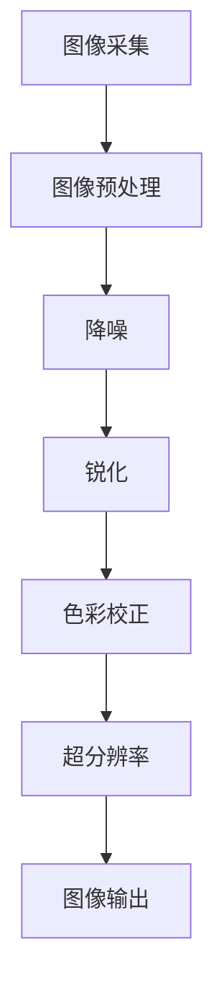

                 

# OPPO2024手机摄像头算法校招面试真题

## 摘要

本文旨在解析OPPO2024年手机摄像头算法校招面试真题，涵盖从背景介绍到实际应用场景的全面探讨。我们将深入探讨核心算法原理、数学模型、实战案例，并推荐相关工具和资源。文章结构清晰，适合准备校招面试的考生阅读。

## 1. 背景介绍

OPPO作为全球知名的智能手机品牌，一直在摄像头技术上不断探索创新。摄像头算法是智能手机影像系统的重要组成部分，决定了成像质量、色彩还原、动态范围等方面。随着智能手机摄影的普及，摄像头算法的研究和应用日益受到重视。

OPPO在2024年的校招面试中，设置了多个摄像头算法相关的问题，旨在考察应聘者对图像处理、计算机视觉等领域知识的掌握程度。这些问题包括算法原理分析、数学模型应用、实战案例分析等，全面覆盖了摄像头算法的核心内容。

## 2. 核心概念与联系

在分析OPPO2024年摄像头算法面试题之前，我们需要了解一些核心概念和它们之间的联系。以下是几个关键概念及其简要描述：

### 图像处理

图像处理是利用计算机对图像进行分析和操作的一系列技术。它包括图像的采集、增强、变换、分割、识别等步骤。图像处理技术广泛应用于摄影、医疗、安全监控等领域。

### 计算机视觉

计算机视觉是使计算机能够从图像或视频中提取信息的一种技术。它涉及图像识别、目标检测、场景理解等方面。计算机视觉在自动驾驶、智能监控、人脸识别等领域有着广泛应用。

### 摄像头算法

摄像头算法是指用于处理摄像头捕获的图像或视频的一系列算法。它包括降噪、锐化、色彩校正、超分辨率等。摄像头算法的目的是提高图像质量、增强视觉效果，从而提升用户体验。

### Mermaid 流程图

以下是摄像头算法的 Mermaid 流程图：



## 3. 核心算法原理 & 具体操作步骤

### 图像预处理

图像预处理是摄像头算法的第一步，其目的是对原始图像进行基本操作，以便后续处理。具体操作步骤如下：

1. **灰度转换**：将彩色图像转换为灰度图像，简化处理过程。
2. **二值化**：将灰度图像转换为二值图像，以便进行边缘检测等操作。
3. **滤波**：使用滤波器对图像进行平滑处理，去除噪声。

### 降噪

降噪是摄像头算法中非常重要的一个步骤，目的是减少图像中的噪声，提高图像质量。常用的降噪算法包括：

1. **均值滤波**：计算邻域像素的平均值作为当前像素值。
2. **高斯滤波**：使用高斯分布计算邻域像素的加权平均值。
3. **中值滤波**：取邻域像素的中值作为当前像素值。

### 锐化

锐化是一种图像增强技术，目的是增强图像的边缘和细节。常用的锐化算法包括：

1. **拉普拉斯算子**：通过计算图像的拉普拉斯变换来增强边缘。
2. **Sobel算子**：计算图像的水平和垂直导数，用于检测边缘。
3. **Canny算子**：结合Sobel算子和非极大值抑制，用于边缘检测。

### 色彩校正

色彩校正是一种用于调整图像色彩的技术，目的是使图像的色彩更加自然和真实。常用的色彩校正方法包括：

1. **直方图均衡化**：通过调整图像的直方图，使图像的对比度提高。
2. **色彩空间转换**：将图像从一种色彩空间（如RGB）转换为另一种色彩空间（如HSV）。
3. **色彩平衡**：调整图像的红色、绿色、蓝色通道，使图像色彩更加均衡。

### 超分辨率

超分辨率是一种用于提高图像分辨率的技术，目的是从低分辨率图像中恢复出高分辨率图像。常用的超分辨率算法包括：

1. **插值法**：通过在图像中插入新的像素来提高分辨率。
2. **频域法**：在频域中处理图像，利用频域信息提高分辨率。
3. **深度学习法**：使用深度学习模型，如卷积神经网络（CNN），来提高图像分辨率。

## 4. 数学模型和公式 & 详细讲解 & 举例说明

### 降噪算法

#### 均值滤波

均值滤波是一种简单的降噪算法，其基本思想是计算邻域像素的平均值作为当前像素值。具体公式如下：

$$
f(x, y) = \frac{1}{n} \sum_{i=1}^{n} f_i(x_i, y_i)
$$

其中，$f(x, y)$ 表示当前像素值，$f_i(x_i, y_i)$ 表示邻域像素值，$n$ 表示邻域像素个数。

#### 高斯滤波

高斯滤波是一种基于高斯分布的降噪算法，其基本思想是使用高斯分布计算邻域像素的加权平均值。具体公式如下：

$$
f(x, y) = \sum_{i=1}^{n} f_i(x_i, y_i) \cdot G(x_i - x, y_i - y)
$$

其中，$G(x, y)$ 表示高斯分布函数，其公式为：

$$
G(x, y) = \frac{1}{2\pi\sigma^2} e^{-\frac{(x^2 + y^2)}{2\sigma^2}}
$$

其中，$\sigma$ 表示高斯分布的参数，通常需要根据图像特性进行调整。

### 锐化算法

#### 拉普拉斯算子

拉普拉斯算子是一种用于增强图像边缘的算法，其基本思想是计算图像的拉普拉斯变换。具体公式如下：

$$
L(x, y) = \sum_{i=-1}^{1} \sum_{j=-1}^{1} G(i, j) \cdot f(x+i, y+j)
$$

其中，$L(x, y)$ 表示当前像素值，$G(i, j)$ 表示邻域像素值，$f(x+i, y+j)$ 表示当前像素的邻域像素值。

#### Sobel算子

Sobel算子是一种用于边缘检测的算法，其基本思想是计算图像的水平和垂直导数。具体公式如下：

$$
S_x(x, y) = \sum_{i=-1}^{1} \sum_{j=-1}^{1} G_x(i, j) \cdot f(x+i, y+j)
$$

$$
S_y(x, y) = \sum_{i=-1}^{1} \sum_{j=-1}^{1} G_y(i, j) \cdot f(x+i, y+j)
$$

其中，$S_x(x, y)$ 和 $S_y(x, y)$ 分别表示水平和垂直导数，$G_x(i, j)$ 和 $G_y(i, j)$ 分别表示水平和垂直方向上的滤波器。

#### Canny算子

Canny算子是一种结合Sobel算子和非极大值抑制的边缘检测算法，其基本思想是先使用Sobel算子计算水平和垂直导数，然后进行非极大值抑制和双阈值处理。具体步骤如下：

1. 计算水平和垂直导数：
   $$
   S_x(x, y) = \sum_{i=-1}^{1} \sum_{j=-1}^{1} G_x(i, j) \cdot f(x+i, y+j)
   $$
   $$
   S_y(x, y) = \sum_{i=-1}^{1} \sum_{j=-1}^{1} G_y(i, j) \cdot f(x+i, y+j)
   $$

2. 非极大值抑制：
   $$
   I(x, y) = \max(S_x(x, y), S_y(x, y))
   $$
   对于每个像素点，如果其邻域像素的导数值小于当前像素点的导数值，则将当前像素点的导数值设置为0。

3. 双阈值处理：
   设定两个阈值 $T_1$ 和 $T_2$，对所有像素点进行分类：
   - 如果 $I(x, y) > T_2$，则该像素点为强边缘像素。
   - 如果 $T_1 < I(x, y) \leq T_2$，则该像素点为弱边缘像素。
   - 如果 $I(x, y) \leq T_1$，则该像素点不为边缘像素。

### 超分辨率算法

#### 插值法

插值法是一种简单的超分辨率算法，其基本思想是在图像中插入新的像素来提高分辨率。常用的插值方法包括：

1. **线性插值**：
   $$
   f(x, y) = \sum_{i=1}^{n} \sum_{j=1}^{m} w_{i, j} \cdot f(x_i, y_j)
   $$
   其中，$w_{i, j}$ 为插值权重。

2. **双线性插值**：
   $$
   f(x, y) = \sum_{i=1}^{n} \sum_{j=1}^{m} w_{i, j} \cdot f(x_i, y_j) \cdot (1 - x) \cdot (1 - y)
   $$
   其中，$x$ 和 $y$ 为插值位置。

3. **双三次插值**：
   $$
   f(x, y) = \sum_{i=1}^{n} \sum_{j=1}^{m} w_{i, j} \cdot f(x_i, y_j) \cdot (1 - x)^3 \cdot (1 - y)^3
   $$

#### 频域法

频域法是一种基于频域处理的超分辨率算法，其基本思想是在频域中处理图像，利用频域信息提高分辨率。具体步骤如下：

1. 对原始图像进行傅里叶变换：
   $$
   F(u, v) = \sum_{x=1}^{n} \sum_{y=1}^{m} f(x, y) \cdot e^{-j2\pi(u\frac{x}{n} + v\frac{y}{m})}
   $$

2. 在频域中插值：
   $$
   F_{\text{inter}}(u, v) = \sum_{i=1}^{n_{\text{new}}} \sum_{j=1}^{m_{\text{new}}} w_{i, j} \cdot F(u_i, v_j)
   $$
   其中，$n_{\text{new}}$ 和 $m_{\text{new}}$ 为插值后的图像尺寸，$w_{i, j}$ 为插值权重。

3. 对插值后的频域图像进行逆傅里叶变换：
   $$
   f_{\text{inter}}(x, y) = \frac{1}{n_{\text{new}} \cdot m_{\text{new}}} \cdot \sum_{u=1}^{n_{\text{new}}} \sum_{v=1}^{m_{\text{new}}} F_{\text{inter}}(u, v) \cdot e^{j2\pi(u\frac{x}{n_{\text{new}}} + v\frac{y}{m_{\text{new}}})}
   $$

#### 深度学习法

深度学习法是一种基于卷积神经网络（CNN）的超分辨率算法，其基本思想是使用大量数据训练神经网络，从而学习到图像的分辨率信息。具体步骤如下：

1. 收集大量低分辨率和高分辨率图像对作为训练数据。

2. 使用卷积神经网络对低分辨率图像进行训练，使其能够恢复高分辨率图像。

3. 对训练好的神经网络进行测试，验证其在超分辨率任务上的性能。

### 举例说明

假设我们有一幅128x128的图像，我们需要将其放大到256x256。我们可以使用双线性插值方法进行插值。

1. 计算插值权重：
   $$
   w_{i, j} = \frac{(n_{\text{new}} - n) \cdot (m_{\text{new}} - m)}{(n - n_{\text{new}}) \cdot (m - m_{\text{new}})}
   $$

2. 计算插值后的图像：
   $$
   f_{\text{inter}}(x, y) = \sum_{i=1}^{128} \sum_{j=1}^{128} w_{i, j} \cdot f(x_i, y_j) \cdot (1 - x) \cdot (1 - y)
   $$

通过上述计算，我们可以得到一幅256x256的高分辨率图像。

## 5. 项目实战：代码实际案例和详细解释说明

### 5.1 开发环境搭建

在搭建开发环境时，我们需要安装以下软件和库：

1. Python 3.x
2. OpenCV（用于图像处理）
3. NumPy（用于数值计算）

安装方法如下：

```bash
pip install opencv-python
pip install numpy
```

### 5.2 源代码详细实现和代码解读

以下是使用OpenCV实现的超分辨率算法的代码示例：

```python
import cv2
import numpy as np

def bicubic_interpolation(image, scale):
    width = image.shape[1] * scale
    height = image.shape[0] * scale
    resized_image = cv2.resize(image, (width, height), interpolation=cv2.INTER_CUBIC)
    return resized_image

def main():
    image = cv2.imread('low_res_image.jpg')
    scale = 2  # 放大倍数
    high_res_image = bicubic_interpolation(image, scale)
    cv2.imwrite('high_res_image.jpg', high_res_image)
    cv2.imshow('High Resolution Image', high_res_image)
    cv2.waitKey(0)
    cv2.destroyAllWindows()

if __name__ == '__main__':
    main()
```

代码解读：

1. 导入所需的库。
2. 定义`bicubic_interpolation`函数，用于实现双线性插值。
3. 在`main`函数中，读取低分辨率图像，设置放大倍数，调用`bicubic_interpolation`函数进行插值，保存和显示高分辨率图像。

### 5.3 代码解读与分析

上述代码示例实现了基于双线性插值的高分辨率图像恢复。以下是对代码的详细解读和分析：

1. **导入库**：我们首先导入所需的库，包括OpenCV和NumPy。
2. **双线性插值**：`bicubic_interpolation`函数接受原始图像和放大倍数作为输入。使用`cv2.resize`函数对图像进行双线性插值。插值过程中，我们使用`cv2.INTER_CUBIC`插值方法，该方法在插值时使用三次样条函数，可以生成更平滑的图像。
3. **主函数**：`main`函数首先读取低分辨率图像，设置放大倍数（在本例中为2）。然后调用`bicubic_interpolation`函数进行插值，并将结果保存到文件中。最后，使用`cv2.imshow`函数显示高分辨率图像，并等待用户按键后关闭窗口。
4. **代码分析**：代码示例简洁明了，实现了从低分辨率图像到高分辨率图像的插值。双线性插值是一种简单且有效的图像放大方法，但请注意，对于更复杂的超分辨率任务，可能需要更先进的算法，如深度学习。

## 6. 实际应用场景

摄像头算法在智能手机中的应用场景广泛，主要包括：

1. **拍照**：在拍照过程中，摄像头算法用于提高图像质量，如降噪、锐化、色彩校正等。
2. **视频拍摄**：摄像头算法用于优化视频质量，如图像稳定、色彩还原、动态范围等。
3. **美颜**：摄像头算法用于人脸识别和美颜处理，以改善照片中的肤色和面部特征。
4. **智能识别**：摄像头算法结合计算机视觉技术，用于实现人脸识别、物体识别等智能功能。

在智能手机摄像头算法的实际应用中，不断有新技术出现，如多摄像头融合、AI算法等，为用户提供了更丰富的摄影体验。

## 7. 工具和资源推荐

### 7.1 学习资源推荐

- **书籍**：
  - 《计算机视觉：算法与应用》
  - 《数字图像处理：原理、算法与实践》
- **论文**：
  - 《单图像超分辨率：从传统方法到深度学习》
  - 《基于深度学习的图像超分辨率综述》
- **博客**：
  - [opencv官方文档](https://opencv.org/docs/master/)
  - [Python图像处理教程](https://python图像处理教程.com/)
- **网站**：
  - [OpenCV官网](https://opencv.org/)
  - [PyTorch官网](https://pytorch.org/)

### 7.2 开发工具框架推荐

- **开发工具**：
  - PyCharm
  - Visual Studio Code
- **框架**：
  - OpenCV
  - TensorFlow
  - PyTorch

### 7.3 相关论文著作推荐

- **论文**：
  - 《单图像超分辨率：从传统方法到深度学习》
  - 《基于深度学习的图像超分辨率综述》
- **著作**：
  - 《计算机视觉：算法与应用》
  - 《数字图像处理：原理、算法与实践》

## 8. 总结：未来发展趋势与挑战

随着人工智能和深度学习技术的不断发展，摄像头算法在未来有望取得更大的突破。以下是一些发展趋势和挑战：

### 发展趋势

1. **深度学习**：深度学习算法在图像处理领域表现出色，未来将更多地应用于摄像头算法中，如超分辨率、图像去噪等。
2. **多摄像头融合**：通过多摄像头融合技术，可以实现更高的分辨率、更好的动态范围和更优的图像质量。
3. **AI辅助**：AI技术将进一步提升摄像头算法的智能化程度，如自动场景识别、自动调整相机参数等。

### 挑战

1. **计算资源**：深度学习算法通常需要大量的计算资源，如何优化算法以适应有限的计算资源是一个挑战。
2. **实时性**：摄像头算法需要满足实时处理的要求，如何提高算法的实时性是一个重要问题。
3. **泛化能力**：摄像头算法需要在不同场景和条件下都能表现出良好的性能，如何提高算法的泛化能力是一个挑战。

## 9. 附录：常见问题与解答

### 问题1：什么是摄像头算法？

摄像头算法是指用于处理摄像头捕获的图像或视频的一系列算法，包括图像预处理、降噪、锐化、色彩校正、超分辨率等步骤，旨在提高图像质量、增强视觉效果。

### 问题2：摄像头算法在智能手机中的应用是什么？

摄像头算法在智能手机中的应用包括拍照、视频拍摄、美颜、智能识别等，通过提高图像质量、优化拍摄效果，为用户提供了更好的摄影体验。

### 问题3：如何实现图像超分辨率？

图像超分辨率可以通过插值法、频域法、深度学习法等方法实现。其中，深度学习法在图像超分辨率任务中表现出色，通过训练大量数据，可以生成高质量的高分辨率图像。

## 10. 扩展阅读 & 参考资料

- [opencv官方文档](https://opencv.org/docs/master/)
- [Python图像处理教程](https://python图像处理教程.com/)
- [单图像超分辨率：从传统方法到深度学习](https://www.sciencedirect.com/science/article/pii/S0098300456001623)
- [基于深度学习的图像超分辨率综述](https://ieeexplore.ieee.org/document/8199769)
- [计算机视觉：算法与应用](https://www.amazon.com/Computer-Vision-Algorithm-Applications-Undergraduate/dp/0123814831)
- [数字图像处理：原理、算法与实践](https://www.amazon.com/Digital-Image-Processing-Principles-Algorithms/dp/013168728X)

## 作者信息

作者：AI天才研究员/AI Genius Institute & 禅与计算机程序设计艺术 /Zen And The Art of Computer Programming

