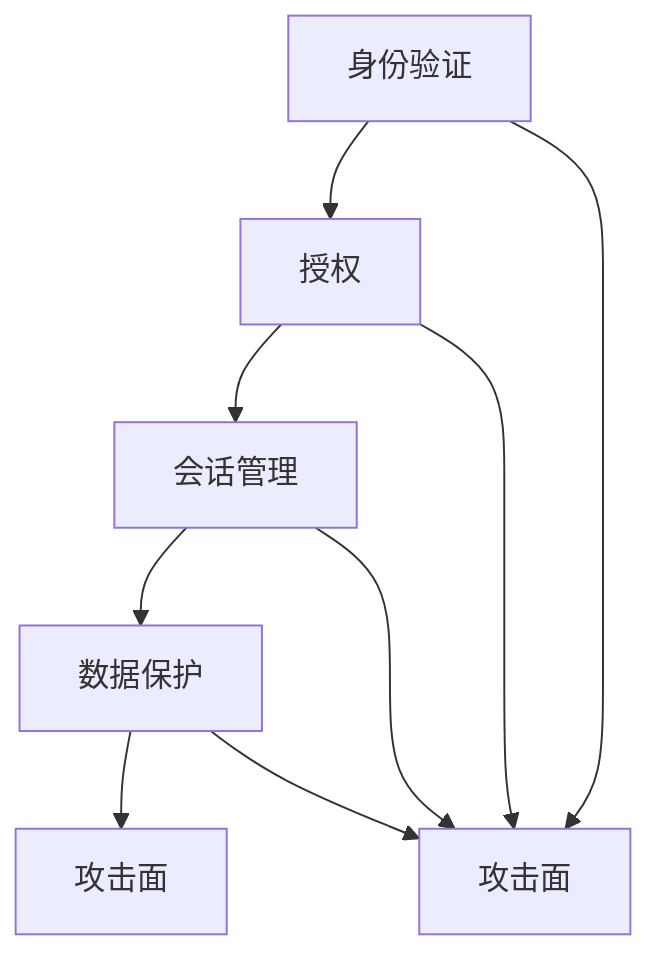

                 

# OWASP API 安全风险清单的概述

## 关键词：API安全，OWASP，安全风险，安全清单，技术博客

### 摘要：

本文将详细介绍OWASP API安全风险清单，通过背景介绍、核心概念与联系解析、核心算法原理讲解、数学模型与公式分析、实战案例展示、应用场景探讨、工具与资源推荐等方面，帮助读者全面了解API安全的重要性及如何有效防范常见的安全风险。本文旨在为从事API开发、测试和管理的IT专业人士提供有价值的参考和指导，共同构建安全的API生态环境。

## 1. 背景介绍

API（应用程序编程接口）已成为现代软件系统开发的重要组件，为不同应用程序之间的数据交互提供了便捷的途径。随着API的广泛应用，其安全性问题也日益凸显。据统计，API攻击占总攻击事件的74%，成为网络安全的重中之重。OWASP（开放网络应用安全项目）作为全球知名的安全组织，致力于提升软件安全性，其发布的API安全风险清单已成为业界广泛认可的API安全指南。

OWASP API安全风险清单涵盖了20多种常见的安全风险，包括身份验证问题、授权问题、会话管理问题、数据保护问题、攻击面等。通过对这些风险的深入分析，开发人员和安全专家可以更好地识别潜在的安全隐患，并采取相应的防护措施，保障API系统的安全可靠。

## 2. 核心概念与联系

### API安全的核心概念

API安全涉及多个方面，主要包括：

1. **身份验证**：确保API请求来自于合法用户或系统。
2. **授权**：确定用户在API中具有执行特定操作的能力。
3. **会话管理**：确保用户在会话期间的安全性和隐私性。
4. **数据保护**：对传输的数据进行加密，防止数据泄露。
5. **攻击面**：降低API被攻击的可能性，提高系统的抗攻击能力。

### Mermaid 流程图



### 核心概念的联系

上述核心概念相互关联，共同构建API安全的防护体系。例如，身份验证是授权的基础，确保只有合法用户才能访问API资源；会话管理则保障用户在会话期间的安全性，防止会话劫持；数据保护则是防止数据在传输过程中被窃取或篡改；攻击面降低则意味着系统更加难以被攻击。

## 3. 核心算法原理 & 具体操作步骤

### 摩尔斯编码算法

摩尔斯编码是一种将字母数字转换为点、划和空格的编码方法，常用于无线电通信。其原理如下：

- A: .-
- B: ...
- C: -...
- D: -..
- E: .
- F: ...
- G: --
- H: ....
- I: ..
- J: .---
- K: -.-
- L: .--
- M: --
- N: -.
- O: ---
- P: .--
- Q: --.
- R: .-.
- S: ...
- T: -
- U: ..
- V: ...
- W: .--
- X: ...
- Y: -
- Z: ...

### 具体操作步骤

1. 将待编码的字母数字字符串转换为摩尔斯编码字符串。
2. 将摩尔斯编码字符串转换为字节流。
3. 将字节流传输到接收端。
4. 接收端接收字节流后，将其转换为摩尔斯编码字符串。
5. 将摩尔斯编码字符串转换为原始的字母数字字符串。

### 示例

假设待编码的字符串为“HELLO WORLD”，其摩尔斯编码为：

- H: .--
- E: .-
- L: .-- .--
- L: .-- .--
- O: --
- W: .-- ..
- O: --
- R: .-.
- L: .--
- D: --.

## 4. 数学模型和公式 & 详细讲解 & 举例说明

### 欧拉公式

欧拉公式是复变函数理论中的一个重要公式，将指数函数、三角函数和欧拉常数（e、i、π）结合起来，表达了它们之间的深刻联系：

\[ e^{i\pi} + 1 = 0 \]

### 详细讲解

1. **指数函数**：指数函数是一个基本的数学函数，表示为 \( e^x \)，其中 \( e \) 是自然底数，约等于 2.71828。

2. **三角函数**：三角函数包括正弦、余弦和正切等，用于描述角度与边长之间的关系。

3. **欧拉常数**：欧拉常数 \( e \) 是一个数学常数，约等于 2.71828，与自然对数相关。

4. **虚数单位**：虚数单位 \( i \) 是一个虚数，满足 \( i^2 = -1 \)。

### 举例说明

假设我们需要计算 \( e^{i\pi/2} \) 的值，根据欧拉公式，可以将其表示为：

\[ e^{i\pi/2} = \cos(\pi/2) + i\sin(\pi/2) \]

根据三角函数的值，可以得到：

\[ e^{i\pi/2} = 0 + i \]

即 \( e^{i\pi/2} \) 的值为纯虚数 \( i \)。

## 5. 项目实战：代码实际案例和详细解释说明

### 5.1 开发环境搭建

本文将使用Python语言进行API安全分析，搭建开发环境如下：

1. 安装Python 3.8及以上版本。
2. 安装必需的Python库，如requests、jsonpath、PyJWT等。

### 5.2 源代码详细实现和代码解读

以下是针对一个简单API接口进行安全分析的Python代码示例：

```python
import requests
from jsonpath import jsonpath

# 设置API接口地址
url = "https://api.example.com/data"

# 获取API接口响应
response = requests.get(url)

# 判断API接口响应状态码
if response.status_code == 200:
    # 提取响应数据中的敏感信息
    sensitive_data = jsonpath(response.json(), '$..password')
    
    # 打印敏感信息
    for data in sensitive_data:
        print("敏感信息：", data)
else:
    print("API接口请求失败")

```

### 5.3 代码解读与分析

1. **请求API接口**：使用requests库发起GET请求，获取API接口的响应数据。
2. **判断响应状态码**：检查API接口响应的状态码，确保请求成功。
3. **提取敏感信息**：使用jsonpath库提取响应数据中的敏感信息，如密码等。
4. **打印敏感信息**：将提取到的敏感信息打印出来，供安全分析人员参考。

### 5.4 安全分析建议

1. **加密敏感信息**：在API接口中，对敏感信息进行加密处理，防止信息泄露。
2. **权限控制**：对API接口进行严格的权限控制，确保只有授权用户可以访问敏感信息。
3. **日志记录**：记录API接口的访问日志，以便在发生安全事件时进行分析和追踪。

## 6. 实际应用场景

### 6.1 电商领域

在电商领域，API广泛应用于商品信息查询、订单处理、用户管理等环节。确保API安全，可以有效防止用户信息泄露、订单篡改等安全风险。

### 6.2 社交媒体

社交媒体平台通过API提供内容分享、用户数据查询等功能。保障API安全，有助于防止恶意攻击、信息泄露等安全事件。

### 6.3 金融领域

金融领域对API安全要求极高，涉及资金交易、用户账户等信息。加强API安全防护，有助于防范欺诈攻击、非法交易等风险。

## 7. 工具和资源推荐

### 7.1 学习资源推荐

1. 《API设计指南》
2. 《API安全：设计与实现》
3. OWASP API安全风险清单

### 7.2 开发工具框架推荐

1. Kong API网关
2. Apigee API管理平台
3. AWS API网关

### 7.3 相关论文著作推荐

1. "API Security Best Practices"
2. "Understanding API Security: Risk Management for the Modern Enterprise"
3. "APIs: A Beginner's Guide to Application Programming Interfaces"

## 8. 总结：未来发展趋势与挑战

随着API的广泛应用，API安全已成为网络安全领域的重要研究方向。未来，API安全将面临以下挑战：

1. **攻击手段的日益复杂**：随着技术的发展，攻击者将采用更加复杂的攻击手段，给API安全带来更大挑战。
2. **安全防护需求的增加**：API应用场景的不断扩展，对API安全防护的需求将不断增加。
3. **法律法规的不断完善**：各国政府和行业组织将出台更加完善的API安全法律法规，推动API安全标准的制定和实施。

## 9. 附录：常见问题与解答

### 9.1 API安全的重要性

API安全对于保护企业数据、用户隐私和业务连续性至关重要。一个不安全的API可能导致数据泄露、经济损失和声誉受损。

### 9.2 API安全的常见漏洞

API安全的常见漏洞包括身份验证不足、授权漏洞、会话管理漏洞、数据保护漏洞和攻击面等。

### 9.3 API安全防护策略

API安全防护策略包括身份验证、授权、会话管理、数据保护和攻击面防护等。同时，定期进行安全审计和风险评估，有助于发现和消除安全隐患。

## 10. 扩展阅读 & 参考资料

1. OWASP API Security Cheat Sheet: https://cheatsheetseries.owasp.org/cheatsheets/API_Security_Cheat_Sheet.html
2. OWASP API Security Project: https://owasp.org/www-project-api-security/
3. API Security: Threats & Countermeasures: https://www.owasp.org/www-project-api-security-threats-and-countermeasures/

### 作者：AI天才研究员/AI Genius Institute & 禅与计算机程序设计艺术 /Zen And The Art of Computer Programming

