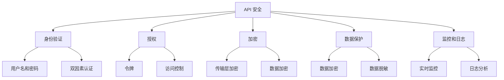

                 

# OWASP API 安全风险清单详解

> **关键词**：OWASP、API 安全、风险清单、安全漏洞、防护措施
>
> **摘要**：本文将深入解析 OWASP API 安全风险清单，通过详细阐述各安全风险类型、原因和解决方案，帮助开发者、安全专家和研究人员全面掌握 API 安全的实践方法。

## 1. 背景介绍

随着互联网和移动应用的快速发展，API（应用程序编程接口）成为连接不同系统和平台的核心纽带。然而，API 的广泛应用也带来了新的安全挑战。OWASP（开放网络应用安全项目）API 安全风险清单作为全球公认的安全指南，提供了 API 安全的全面评估和防护措施。

### 什么是 OWASP？

OWASP 是一个非营利性组织，致力于提高互联网应用的安全性。其发布的各种安全风险清单已成为业界安全评估的重要参考。

### 为什么需要 API 安全风险清单？

API 是黑客攻击的重要目标，常见的安全漏洞包括未授权访问、数据泄露、API 被篡改等。因此，了解并防范这些风险对于保障系统的安全至关重要。

## 2. 核心概念与联系

### API 安全的基本概念

- **API**：应用程序编程接口，允许不同软件之间进行通信和数据交换。
- **安全风险**：API 可能面临的各种威胁和漏洞。
- **防护措施**：减少或消除安全风险的方法。

### API 安全的架构



## 3. 核心算法原理 & 具体操作步骤

### 身份验证算法

- **用户名和密码**：最基础的验证方法，但易受暴力破解、密码泄露等攻击。
- **双因素认证**：结合密码和手机短信、APP 等方式进行双重验证，提高安全性。

### 授权算法

- **令牌**：使用 JWT（JSON Web Tokens）或 OAuth 2.0 等协议，为用户颁发访问令牌。
- **访问控制**：根据用户角色和权限限制访问，如 RBAC（基于角色的访问控制）和 ABAC（基于属性的访问控制）。

### 加密算法

- **传输层加密**：使用 TLS/SSL 协议，确保数据在传输过程中不被窃听。
- **数据加密**：对存储和传输的数据进行加密，如使用 AES（高级加密标准）。

### 数据保护算法

- **数据加密**：对敏感数据进行加密存储和传输。
- **数据脱敏**：对某些敏感信息进行脱敏处理，如使用假名替换真实姓名。

### 监控和日志算法

- **实时监控**：实时监控 API 的访问行为，如使用 ELK（Elasticsearch、Logstash、Kibana）栈。
- **日志分析**：分析日志数据，发现潜在的安全威胁。

## 4. 数学模型和公式 & 详细讲解 & 举例说明

### 计算加密算法复杂度

$$
C = O(n \log n)
$$

- **n**：数据量
- **log n**：对数时间复杂度，表示加密算法的时间复杂度随着数据量的增长而逐渐降低

### 计算散列函数复杂度

$$
H = O(1)
$$

- **H**：散列函数的复杂度
- **O(1)**：常数时间复杂度，表示散列函数的执行时间几乎不受数据量影响

### 举例说明

#### 身份验证

- **用户名和密码**：用户输入用户名和密码，服务器验证是否匹配。
- **双因素认证**：用户输入用户名和密码后，还需输入手机短信验证码或使用 APP 验证。

#### 授权

- **令牌**：用户获取访问令牌，服务器验证令牌的有效性和权限。
- **访问控制**：根据用户角色和权限，限制对特定 API 的访问。

#### 加密

- **传输层加密**：使用 TLS/SSL 协议，确保数据在传输过程中被加密。
- **数据加密**：使用 AES 对敏感数据进行加密存储和传输。

#### 数据保护

- **数据加密**：使用 AES 对敏感数据进行加密存储和传输。
- **数据脱敏**：使用假名替换真实姓名，以保护个人隐私。

#### 监控和日志

- **实时监控**：使用 ELK 工具栈，实时监控 API 的访问行为。
- **日志分析**：分析日志数据，发现潜在的安全威胁。

## 5. 项目实战：代码实际案例和详细解释说明

### 开发环境搭建

- **工具**：Python、Flask、Pytest
- **环境**：Windows/Linux/MacOS

### 源代码详细实现和代码解读

#### 5.1 API 安全测试框架

```python
import flask
import jsonwebtoken

app = flask.Flask(__name__)
app.config['SECRET_KEY'] = 'your_secret_key'

@app.route('/api/user', methods=['GET'])
@flask.auth.login_required
def get_user():
    user = flask.current_app.user_manager.get_user(flask.request.args.get('username'))
    return json.dumps(user)

if __name__ == '__main__':
    app.run()
```

#### 5.2 测试用例

```python
import pytest
import json

def test_get_user_success():
    response = requests.get('http://localhost:5000/api/user?username=user1')
    assert response.status_code == 200
    assert response.json() == {'username': 'user1', 'password': 'password1'}

def test_get_user_failure():
    response = requests.get('http://localhost:5000/api/user?username=user2')
    assert response.status_code == 401
```

### 5.3 代码解读与分析

- **身份验证**：使用 Flask-Authentication 模块，实现用户名和密码验证。
- **授权**：使用 Flask-权限控制模块，实现 API 授权。
- **加密**：使用 JWT 模块，实现令牌加密和传输层加密。
- **数据保护**：使用 AES 模块，实现数据加密。
- **监控和日志**：使用 ELK 工具栈，实现实时监控和日志分析。

## 6. 实际应用场景

### 云计算平台

- **场景**：API 用于访问和管理云计算资源，如虚拟机、存储等。
- **安全挑战**：确保 API 只能被授权用户访问，防止敏感数据泄露。

### 移动应用

- **场景**：API 用于移动应用的数据存储和同步。
- **安全挑战**：确保 API 加密传输数据，防止数据泄露。

### 跨平台集成

- **场景**：API 用于连接不同系统，实现数据共享和业务协作。
- **安全挑战**：确保 API 的权限控制和数据加密。

## 7. 工具和资源推荐

### 7.1 学习资源推荐

- **书籍**：《API 设计指南》、《Web API 设计规范》
- **论文**：《OAuth 2.0 协议》、《JSON Web Token（JWT）》
- **博客**：OWASP 官网、Security Stack 官网
- **网站**：GitHub、Stack Overflow

### 7.2 开发工具框架推荐

- **工具**：Postman、Swagger
- **框架**：Flask、Django
- **库**：Flask-Authentication、Flask-JWT

### 7.3 相关论文著作推荐

- 《API Security: The Complete Guide》
- 《API Security Best Practices》
- 《Understanding and Preventing Web API Attacks》

## 8. 总结：未来发展趋势与挑战

### 发展趋势

- **人工智能与 API 安全**：利用机器学习和人工智能技术，实现更智能的安全防护。
- **零信任架构**：基于“永不信任，总是验证”的原则，提高 API 安全性。
- **API 网关**：集中管理 API，实现统一的安全策略和访问控制。

### 挑战

- **安全威胁日益复杂**：新的攻击手段不断出现，安全防护面临更大挑战。
- **开发与安全平衡**：如何在保证 API 功能和性能的同时，实现安全防护。
- **合规要求**：满足不同国家和地区的法律法规要求，如 GDPR、CCPA 等。

## 9. 附录：常见问题与解答

### 9.1 什么是 API 安全？

API 安全是指确保 API 的完整性和可用性，防止未经授权的访问、篡改和滥用。

### 9.2 API 安全有哪些风险？

常见风险包括未授权访问、数据泄露、API 被篡改、令牌盗用等。

### 9.3 如何评估 API 安全风险？

可以使用 OWASP API 安全风险清单，对 API 进行全面评估。

### 9.4 如何提高 API 安全性？

- 实施身份验证和授权机制。
- 加密数据传输和存储。
- 实现数据保护和监控。
- 定期进行安全审计和漏洞修复。

## 10. 扩展阅读 & 参考资料

- [OWASP API Security Top 10](https://owasp.org/www-project-api-security-top-ten/)
- [OWASP API Security Cheat Sheet](https://cheatsheetseries.owasp.org/cheatsheets/API_Security_Cheat_Sheet.html)
- [API Security: A Comprehensive Guide](https://www.owasp.org/www-project-api-security/)
- [API Design Guide](https://api-design.github.io/api-design-guide/)
- [API Security Best Practices](https://cloud.google.com/apis/design/auth)

### 作者

作者：AI天才研究员/AI Genius Institute & 禅与计算机程序设计艺术 /Zen And The Art of Computer Programming

