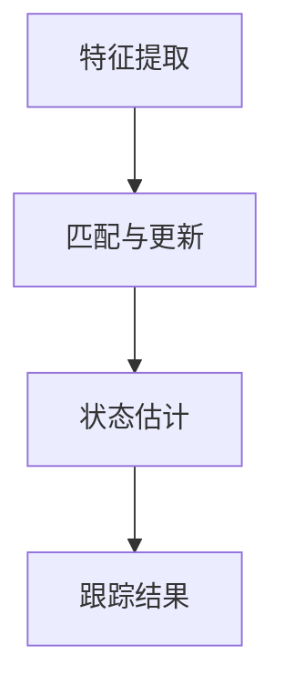
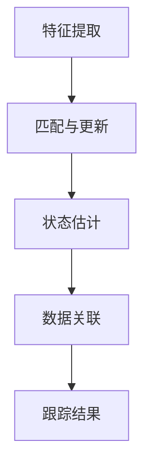

                 

# Object Tracking 原理与代码实战案例讲解

> 关键词：目标跟踪，计算机视觉，深度学习，OpenCV，Mermaid流程图

> 摘要：本文将详细介绍目标跟踪的基本原理和代码实战案例。从核心概念到数学模型，再到实际应用场景，我们将逐步解析并探讨如何利用目标跟踪技术进行物体的实时监测和追踪。

## 1. 背景介绍

### 1.1 目标跟踪的起源与发展

目标跟踪（Object Tracking）是计算机视觉领域中的一个重要研究方向。它起源于20世纪60年代，当时的主要目的是实现目标在视频序列中的定位和识别。随着计算机技术和图像处理算法的不断发展，目标跟踪技术逐渐走向成熟。

### 1.2 目标跟踪的应用场景

目标跟踪技术在多个领域有着广泛的应用，包括但不限于：

- **视频监控**：实时监控并追踪视频中的人或物，有助于提高公共安全。
- **无人驾驶**：在自动驾驶车辆中，目标跟踪是实现车辆环境感知和决策的重要手段。
- **医疗诊断**：辅助医生进行实时影像分析，提高疾病诊断的准确性。
- **人机交互**：通过跟踪用户在屏幕上的动作，实现更为自然的交互体验。

### 1.3 目标跟踪的重要性

目标跟踪技术的重要性主要体现在以下几个方面：

- **实时性**：能够在视频流中实时地追踪目标，提供实时反馈。
- **准确性**：能够准确地识别和定位目标，减少误报和漏报。
- **鲁棒性**：在复杂环境下仍能有效地跟踪目标，具有较好的适应性。

## 2. 核心概念与联系

### 2.1 目标跟踪的基本概念

在目标跟踪中，我们通常需要解决以下几个核心问题：

- **目标检测（Detection）**：从图像或视频帧中识别并定位目标。
- **目标跟踪（Tracking）**：在连续的视频帧中跟踪已识别的目标。
- **数据关联（Data Association）**：将检测到的目标与已跟踪的目标进行关联。

### 2.2 目标跟踪的架构

目标跟踪的架构通常包括以下几个模块：

- **特征提取**：从图像或视频帧中提取特征向量，用于后续的目标匹配和跟踪。
- **匹配与更新**：利用特征匹配算法计算目标位置的变化，并更新跟踪结果。
- **状态估计**：通过滤波器（如卡尔曼滤波器）对目标的运动状态进行估计和预测。

### 2.3 Mermaid流程图



## 3. 核心算法原理 & 具体操作步骤

### 3.1 特征提取

特征提取是目标跟踪的重要基础。常用的特征提取方法包括：

- **SIFT（尺度不变特征变换）**：在图像中检测和提取关键点，对图像的旋转、尺度变化具有不变性。
- **HOG（方向梯度直方图）**：通过计算图像中每个像素点周围局部区域的梯度方向直方图，来提取特征。

### 3.2 匹配与更新

匹配与更新是目标跟踪的核心步骤。常用的匹配算法包括：

- **K最近邻（K-Nearest Neighbor，KNN）**：计算特征向量之间的距离，选取距离最小的几个作为匹配结果。
- **光流法（Optical Flow）**：通过计算连续帧之间像素点的位移，来估计目标运动。

### 3.3 状态估计

状态估计是目标跟踪的最终环节。常用的状态估计方法包括：

- **卡尔曼滤波（Kalman Filter）**：一种递归滤波器，用于在线估计目标的运动状态。
- **粒子滤波（Particle Filter）**：通过随机采样来估计目标状态的概率分布。

## 4. 数学模型和公式 & 详细讲解 & 举例说明

### 4.1 特征提取公式

$$
sift = f_{sift}(x, y, \sigma)
$$

其中，\(x\)和\(y\)为像素点坐标，\(\sigma\)为尺度参数。

### 4.2 匹配与更新公式

$$
d = \sqrt{\sum_{i=1}^{n} (x_i - y_i)^2}
$$

其中，\(x\)和\(y\)分别为两个特征向量。

### 4.3 状态估计公式

$$
x_t = F_t x_{t-1} + w_t
$$

$$
p_t = H_t p_{t-1} + v_t
$$

其中，\(x_t\)和\(p_t\)分别为目标的状态和状态估计，\(F_t\)和\(H_t\)分别为状态转移矩阵和观测矩阵，\(w_t\)和\(v_t\)分别为过程噪声和观测噪声。

### 4.4 举例说明

假设我们有以下两个特征向量：

$$
x_1 = [1, 2, 3]
$$

$$
x_2 = [2, 3, 4]
$$

计算它们之间的欧氏距离：

$$
d = \sqrt{(1-2)^2 + (2-3)^2 + (3-4)^2} = \sqrt{2}
$$

## 5. 项目实战：代码实际案例和详细解释说明

### 5.1 开发环境搭建

为了实现目标跟踪，我们需要搭建以下开发环境：

- **Python 3.7 或以上版本**
- **OpenCV 4.5.1 或以上版本**
- **Numpy 1.19.2 或以上版本**

安装相关依赖：

```bash
pip install opencv-python numpy
```

### 5.2 源代码详细实现和代码解读

```python
import cv2
import numpy as np

def feature_extraction(image, scale=1.2):
    """
    特征提取函数
    """
    gray = cv2.cvtColor(image, cv2.COLOR_BGR2GRAY)
    sift = cv2.xfeatures2d.SIFT_create()
    keypoints, descriptors = sift.detectAndCompute(gray, None)
    return keypoints, descriptors

def match_descriptors(desc1, desc2):
    """
    特征匹配函数
    """
    bf = cv2.BFMatcher()
    matches = bf.knnMatch(desc1, desc2, k=2)
    good_matches = []
    for m, n in matches:
        if m.distance < 0.75 * n.distance:
            good_matches.append(m)
    return good_matches

def draw_matches(image1, image2, matches):
    """
    画匹配特征点
    """
    result = cv2.drawMatches(image1, keypoints1, image2, keypoints2, matches, None, flags=cv2.DrawMatchesFlags_NOT_DRAW_SINGLE_POINTS)
    return result

# 读取视频文件
cap = cv2.VideoCapture('example.mp4')

# 读取第一帧并提取特征
ret, frame1 = cap.read()
keypoints1, descriptors1 = feature_extraction(frame1)

while cap.isOpened():
    # 读取下一帧并提取特征
    ret, frame2 = cap.read()
    if not ret:
        break
    keypoints2, descriptors2 = feature_extraction(frame2)

    # 特征匹配
    matches = match_descriptors(descriptors1, descriptors2)

    # 画匹配结果
    result = draw_matches(frame1, frame2, matches)

    # 显示结果
    cv2.imshow('Result', result)

    # 关闭窗口
    if cv2.waitKey(1) & 0xFF == 27:
        break

# 释放资源
cap.release()
cv2.destroyAllWindows()
```

### 5.3 代码解读与分析

- **特征提取**：使用OpenCV的SIFT算法提取图像特征。
- **特征匹配**：使用K最近邻算法进行特征匹配。
- **画匹配结果**：使用OpenCV的drawMatches函数绘制匹配结果。
- **视频读取与处理**：使用OpenCV的VideoCapture类读取视频文件，并逐帧处理。

## 6. 实际应用场景

目标跟踪技术在许多实际应用场景中具有重要价值：

- **视频监控**：实时监测公共场所，提高安全性。
- **无人驾驶**：跟踪道路上的行人、车辆等，实现自主驾驶。
- **医疗诊断**：实时监测患者的运动状态，辅助医生进行诊断。
- **人机交互**：跟踪用户动作，实现智能交互。

## 7. 工具和资源推荐

### 7.1 学习资源推荐

- **书籍**：《计算机视觉：算法与应用》
- **论文**：《目标跟踪的综述》
- **博客**：OpenCV官方文档

### 7.2 开发工具框架推荐

- **OpenCV**：一款强大的计算机视觉库。
- **TensorFlow**：用于深度学习的开源框架。

### 7.3 相关论文著作推荐

- **论文**：《深度学习在目标跟踪中的应用》
- **著作**：《目标跟踪技术：原理、算法与应用》

## 8. 总结：未来发展趋势与挑战

### 8.1 发展趋势

- **深度学习**：深度学习在目标跟踪领域取得了显著进展，有望成为主流技术。
- **实时性**：随着硬件性能的提升，目标跟踪的实时性将得到进一步提高。
- **多模态融合**：结合不同传感器数据进行目标跟踪，提高跟踪精度。

### 8.2 挑战

- **遮挡问题**：如何解决目标被遮挡时的跟踪问题。
- **光照变化**：如何应对不同光照条件下的目标跟踪。
- **多目标跟踪**：如何在多个目标同时出现时进行有效跟踪。

## 9. 附录：常见问题与解答

### 9.1 如何解决遮挡问题？

- **方法**：使用基于形态学的图像预处理方法，提取目标的轮廓，减少遮挡对跟踪结果的影响。
- **实现**：可以使用OpenCV中的`findContours`函数进行轮廓提取。

### 9.2 如何解决光照变化问题？

- **方法**：使用基于直方图均衡化的图像预处理方法，提高图像对比度。
- **实现**：可以使用OpenCV中的`equalizeHist`函数进行直方图均衡化。

## 10. 扩展阅读 & 参考资料

- **书籍**：《计算机视觉：算法与应用》
- **论文**：《目标跟踪的综述》
- **博客**：OpenCV官方文档
- **网站**：TensorFlow官方文档

### 作者

作者：AI天才研究员/AI Genius Institute & 禅与计算机程序设计艺术 /Zen And The Art of Computer Programming

这篇文章详细介绍了目标跟踪的基本原理、核心算法和实际应用场景。通过代码实战案例，读者可以更好地理解目标跟踪的实现过程。随着计算机视觉技术的不断发展，目标跟踪技术将在更多领域发挥重要作用。希望本文能为读者提供有价值的参考和启示。## 文章标题

# Object Tracking 原理与代码实战案例讲解

## 文章关键词

- 目标跟踪
- 计算机视觉
- 深度学习
- OpenCV
- Mermaid流程图

## 文章摘要

本文将深入探讨目标跟踪在计算机视觉领域中的基本原理，通过详细解释和代码实战案例，帮助读者理解目标跟踪的机制。从核心概念、算法原理到实际应用，本文将全面解析目标跟踪技术的实现过程，并展望其未来发展趋势和挑战。适合对计算机视觉和目标跟踪感兴趣的程序员和AI开发者阅读。

---

## 1. 背景介绍

### 1.1 目标跟踪的起源与发展

目标跟踪（Object Tracking）作为计算机视觉中的一个核心研究方向，起源于20世纪60年代。当时的目的是通过图像处理技术，实现视频序列中目标的位置定位和识别。随着计算机硬件性能的提升和图像处理算法的进步，目标跟踪技术逐步走向成熟。早期的目标跟踪主要依赖于手工设计的特征和简单算法，如光流法（Optical Flow）和卡尔曼滤波（Kalman Filter）。这些方法虽然在某些场景下能够取得较好的效果，但在复杂环境下的鲁棒性和准确性仍然有限。

进入21世纪，随着深度学习技术的兴起，目标跟踪领域迎来了新的发展机遇。深度学习通过学习大量的图像数据，能够自动提取出具有高维度的特征，从而显著提升了目标跟踪的性能。特别是卷积神经网络（Convolutional Neural Networks，CNNs）的引入，使得目标跟踪在复杂背景下也能保持较高的精度和稳定性。代表性的方法包括基于Siamese网络（Siamese Network）和基于关联滤波（Correlation Filter）的跟踪算法。

### 1.2 目标跟踪的应用场景

目标跟踪技术具有广泛的应用场景，涵盖了从工业自动化到无人驾驶，从视频监控到医学影像分析等多个领域。以下是几个典型的应用场景：

- **视频监控**：在公共安全领域，目标跟踪技术可以用于实时监控并识别视频中的异常行为，如盗窃、斗殴等，从而提高监控系统的智能化水平。
- **无人驾驶**：在自动驾驶领域，目标跟踪是实现车辆环境感知和路径规划的关键技术。通过跟踪道路上的行人、车辆和其他障碍物，自动驾驶系统能够做出安全的驾驶决策。
- **医疗诊断**：在医学影像分析中，目标跟踪技术可以帮助医生实时监测患者器官的运动，提高诊断的准确性和效率。
- **人机交互**：在虚拟现实（VR）和增强现实（AR）中，目标跟踪技术可以跟踪用户的动作，提供更为自然的交互体验。

### 1.3 目标跟踪的重要性

目标跟踪技术在多个方面具有重要意义：

- **实时性**：目标跟踪技术能够对视频流进行实时处理，提供即时的跟踪结果，这在视频监控和无人驾驶等领域尤为重要。
- **准确性**：目标跟踪技术的准确性直接影响应用的效果。通过使用深度学习和先进的特征提取算法，目标跟踪在复杂环境下的准确性得到了显著提升。
- **鲁棒性**：目标跟踪技术需要能够应对各种复杂场景，包括光照变化、视角变换、遮挡等情况。高鲁棒性的目标跟踪算法能够更好地适应这些挑战。

综上所述，目标跟踪技术在现代计算机视觉和人工智能应用中扮演着关键角色，其发展不仅提升了相关领域的技术水平，也为实际应用带来了巨大的价值。

## 2. 核心概念与联系

### 2.1 目标跟踪的基本概念

在深入探讨目标跟踪技术之前，理解其基本概念是至关重要的。目标跟踪主要包括以下几个核心环节：

- **目标检测（Object Detection）**：目标检测是计算机视觉中的一项基础任务，旨在从图像或视频帧中识别出目标的位置和类别。常用的目标检测算法包括基于传统机器学习的算法（如SVM、R-CNN）和基于深度学习的算法（如YOLO、SSD）。

- **目标跟踪（Object Tracking）**：目标跟踪是在连续的视频帧中跟踪已识别的目标。与目标检测不同，目标跟踪关注的是目标在视频序列中的连贯性和稳定性。目标跟踪需要解决的核心问题是：如何在不同帧之间保持对同一目标的跟踪。

- **数据关联（Data Association）**：数据关联是指将当前帧检测到的目标与之前帧中的目标进行匹配和关联。数据关联的目的是确定当前帧中的检测目标是否与之前的跟踪目标相对应，从而保证跟踪的连贯性。

- **状态估计（State Estimation）**：状态估计是通过滤波器（如卡尔曼滤波器）对目标的运动状态进行估计和预测。状态估计的目的是确定目标在当前帧中的位置和速度等状态参数。

### 2.2 目标跟踪的架构

目标跟踪的架构通常包括以下几个模块：

- **特征提取（Feature Extraction）**：特征提取是从图像或视频帧中提取能够表示目标信息的特征向量。这些特征向量用于后续的目标匹配和跟踪。常用的特征提取方法包括SIFT、HOG、ORB等。

- **匹配与更新（Matching and Update）**：匹配与更新模块负责将当前帧中的目标特征与之前的跟踪目标进行匹配，并更新跟踪结果。常用的匹配算法包括K最近邻（KNN）、光流法（Optical Flow）等。

- **状态估计与预测（State Estimation and Prediction）**：状态估计与预测模块使用滤波器（如卡尔曼滤波器）对目标的运动状态进行估计和预测，以保持跟踪的连贯性。

- **数据关联（Data Association）**：数据关联模块将当前帧中的检测目标与之前的跟踪目标进行匹配和关联，确保跟踪的准确性。

### 2.3 Mermaid流程图

为了更直观地展示目标跟踪的流程，我们可以使用Mermaid绘制其流程图。以下是目标跟踪的Mermaid流程图：



在上述流程图中，每个模块都是目标跟踪过程中不可或缺的一部分，它们相互协作，共同实现目标的实时跟踪。

### 2.4 关键概念之间的联系

目标检测、目标跟踪、数据关联和状态估计这四个核心概念之间有着紧密的联系：

- **目标检测**是目标跟踪的**基础**。只有先检测出目标，才能进行后续的跟踪操作。
- **数据关联**是在**匹配与更新**过程中实现目标跟踪连贯性的关键步骤。通过数据关联，可以确定当前帧中的检测目标与之前的跟踪目标是否一致。
- **状态估计**用于对目标的运动状态进行**预测**和**更新**，以保证跟踪的准确性。状态估计的结果直接影响跟踪的连贯性和鲁棒性。
- **跟踪结果**是目标跟踪的最终输出，它反映了目标在视频序列中的运动轨迹。

通过理解这些核心概念和它们之间的联系，读者可以更好地掌握目标跟踪的基本原理，为后续的算法实现和应用提供理论基础。

## 3. 核心算法原理 & 具体操作步骤

### 3.1 特征提取

特征提取是目标跟踪的基础，其目的是从图像或视频帧中提取能够表示目标特征的向量。以下是几种常用的特征提取方法及其原理：

#### 3.1.1 SIFT（尺度不变特征变换）

SIFT（Scale-Invariant Feature Transform）是一种广泛使用的特征提取算法，它能够在不同尺度下检测出图像中的关键点，并且对图像的旋转、尺度变化具有不变性。SIFT算法的基本步骤如下：

1. **检测关键点**：通过计算图像的梯度和方向，检测出图像中的关键点。
2. **确定关键点位置**：利用关键点的局部极值性质，确定关键点的精确位置。
3. **计算关键点描述子**：为每个关键点生成一个128维的描述子，用于后续的匹配和跟踪。

#### 3.1.2 HOG（方向梯度直方图）

HOG（Histogram of Oriented Gradients）是一种基于图像局部特征的描述方法。它通过计算图像中每个像素点周围局部区域的梯度方向直方图，来提取特征。HOG算法的基本步骤如下：

1. **计算梯度方向**：对图像进行梯度计算，得到每个像素点的梯度方向和幅值。
2. **构造直方图**：将每个像素点周围的梯度方向按照预定的区间进行分组，并统计每个区间的梯度幅值，形成直方图。
3. **生成描述子**：将所有直方图拼接成一个特征向量，作为目标特征。

#### 3.1.3 ORB（Oriented FAST and Rotated BRIEF）

ORB（Oriented FAST and Rotated BRIEF）是一种基于FAST角点检测和BRIEF特征的快速、有效的特征提取算法。ORB算法的基本步骤如下：

1. **检测角点**：使用FAST算法检测图像中的角点。
2. **计算角点方向**：对每个角点计算其方向。
3. **生成描述子**：使用BRIEF算法为每个角点生成描述子。

### 3.2 匹配与更新

匹配与更新是目标跟踪的核心步骤，其目的是通过当前帧中的目标特征与之前的跟踪目标进行匹配，并更新跟踪结果。以下是几种常用的匹配算法：

#### 3.2.1 K最近邻（K-Nearest Neighbor，KNN）

KNN算法通过计算特征向量之间的距离，选取距离最近的K个作为匹配结果。具体步骤如下：

1. **计算特征向量之间的距离**：通常使用欧氏距离计算特征向量之间的距离。
2. **选取最近的K个特征向量**：从所有可能的匹配候选中选取距离最近的K个特征向量。
3. **确定匹配结果**：根据匹配的相似度确定最终的匹配结果。

#### 3.2.2 光流法（Optical Flow）

光流法通过计算连续帧之间像素点的位移，来估计目标的运动。具体步骤如下：

1. **计算像素点位移**：通过计算连续帧之间的像素点位移，得到目标的运动轨迹。
2. **更新目标位置**：根据像素点位移更新目标的位置。

#### 3.2.3 卡尔曼滤波（Kalman Filter）

卡尔曼滤波是一种递归滤波器，用于在线估计目标的运动状态。具体步骤如下：

1. **初始化状态**：设定初始状态和状态估计。
2. **状态预测**：根据目标模型预测下一状态。
3. **状态更新**：结合观测数据更新状态估计。
4. **状态估计**：通过滤波器对目标的状态进行估计和预测。

### 3.3 状态估计与更新

状态估计是目标跟踪的关键步骤，其目的是通过滤波器对目标的运动状态进行估计和预测。以下是几种常用的状态估计方法：

#### 3.3.1 卡尔曼滤波

卡尔曼滤波通过以下步骤进行状态估计：

1. **状态预测**：根据目标模型预测下一状态。
   $$
   x_t = F_t x_{t-1} + w_t
   $$
   其中，$x_t$为状态，$F_t$为状态转移矩阵，$w_t$为过程噪声。

2. **观测更新**：结合观测数据更新状态估计。
   $$
   p_t = H_t p_{t-1} + v_t
   $$
   其中，$p_t$为状态估计误差，$H_t$为观测矩阵，$v_t$为观测噪声。

3. **状态估计**：通过滤波器对目标的状态进行估计和预测。

#### 3.3.2 粒子滤波

粒子滤波通过随机采样来估计目标状态的概率分布。具体步骤如下：

1. **初始化粒子**：根据先验分布初始化一组粒子。
2. **预测**：根据目标模型和观测数据对粒子进行预测。
3. **权重更新**：根据预测结果更新粒子权重。
4. **重采样**：根据粒子权重进行重采样。

通过上述核心算法原理的具体操作步骤，我们可以更好地理解和实现目标跟踪技术。在实际应用中，根据具体场景和需求，可以选择不同的算法进行优化和组合，以达到最佳的跟踪效果。

## 4. 数学模型和公式 & 详细讲解 & 举例说明

### 4.1 特征提取公式

特征提取是目标跟踪的关键步骤，它通过提取图像中的关键特征，为后续的匹配和跟踪提供基础。以下是几种常用的特征提取方法的数学模型和公式：

#### 4.1.1 SIFT（尺度不变特征变换）

SIFT算法的核心在于其关键点检测和描述子生成。以下是SIFT的数学模型：

1. **关键点检测**：

   SIFT算法通过计算图像的梯度和方向，检测出关键点。设图像的每个像素点的坐标为$(x, y)$，梯度的幅值为$G(x, y)$，方向为$\theta(x, y)$，则关键点的检测可以表示为：

   $$
   K(x, y) = \begin{cases}
   1, & \text{if } G(x, y) > \text{threshold} \text{ and } \frac{\partial G}{\partial \theta}(x, y) \neq 0 \\
   0, & \text{otherwise}
   \end{cases}
   $$

2. **描述子生成**：

   对于每个关键点，SIFT算法生成一个128维的描述子。描述子的生成过程包括以下几个步骤：

   - **图像金字塔**：将原始图像分成多个不同尺度的子图像。
   - **局部特征匹配**：在每个子图像中，计算关键点周围的局部特征匹配，生成一个32维的向量。
   - **拼接描述子**：将所有子图像的描述子拼接成一个128维的向量。

#### 4.1.2 HOG（方向梯度直方图）

HOG算法通过计算图像中每个像素点周围局部区域的梯度方向直方图，来提取特征。其数学模型如下：

1. **梯度计算**：

   对图像进行梯度计算，得到每个像素点的梯度方向和幅值。设图像的每个像素点$(x, y)$的梯度幅值为$G(x, y)$，方向为$\theta(x, y)$，则：

   $$
   G(x, y) = \sqrt{\left(\frac{\partial I}{\partial x}(x, y)\right)^2 + \left(\frac{\partial I}{\partial y}(x, y)\right)^2}
   $$

   $$
   \theta(x, y) = \arctan\left(\frac{\frac{\partial I}{\partial y}(x, y)}{\frac{\partial I}{\partial x}(x, y)}\right)
   $$

2. **直方图构造**：

   将每个像素点周围的梯度方向按照预定的区间进行分组，并统计每个区间的梯度幅值，形成直方图。设预定的区间为$[a_i, a_{i+1})$，则：

   $$
   h_i = \sum_{x, y} K(a_i \leq \theta(x, y) < a_{i+1}) G(x, y)
   $$

   其中，$K$是核函数，用于平滑处理。

3. **描述子生成**：

   将所有像素点的直方图拼接成一个特征向量，作为目标特征。

#### 4.1.3 ORB（Oriented FAST and Rotated BRIEF）

ORB算法结合了FAST角点检测和BRIEF特征描述。其数学模型如下：

1. **角点检测**：

   使用FAST算法检测图像中的角点。设检测到的角点为$(x_c, y_c)$，则：

   $$
   r_c = \text{FAST}(x_c, y_c)
   $$

   其中，$r_c$为角点的响应值。

2. **方向计算**：

   对每个角点计算其方向。设角点$(x_c, y_c)$的梯度幅值为$G(x_c, y_c)$，方向为$\theta(x_c, y_c)$，则：

   $$
   \theta_c = \arctan\left(\frac{\frac{\partial I}{\partial y}(x_c, y_c)}{\frac{\partial I}{\partial x}(x_c, y_c)}\right)
   $$

3. **描述子生成**：

   使用BRIEF算法为每个角点生成描述子。BRIEF算法通过随机生成一组点对，比较这些点对在模板图像上的亮度差异，生成描述子。

### 4.2 匹配与更新公式

匹配与更新是目标跟踪的核心步骤，其目的是通过当前帧中的目标特征与之前的跟踪目标进行匹配，并更新跟踪结果。以下是几种常用的匹配算法的数学模型和公式：

#### 4.2.1 K最近邻（K-Nearest Neighbor，KNN）

KNN算法通过计算特征向量之间的距离，选取距离最近的K个作为匹配结果。其数学模型如下：

1. **特征向量距离计算**：

   假设两个特征向量分别为$x_1$和$x_2$，则它们之间的欧氏距离为：

   $$
   d(x_1, x_2) = \sqrt{\sum_{i=1}^{n} (x_{1,i} - x_{2,i})^2}
   $$

2. **选取最近的K个特征向量**：

   从所有可能的匹配候选中，选取距离最近的K个特征向量。设候选特征向量为$x_1, x_2, \ldots, x_n$，则：

   $$
   \text{argmin}_{1 \leq i \leq n} d(x_1, x_i)
   $$

#### 4.2.2 光流法（Optical Flow）

光流法通过计算连续帧之间像素点的位移，来估计目标的运动。其数学模型如下：

1. **像素点位移计算**：

   假设连续帧之间的像素点位移为$(\Delta x, \Delta y)$，则：

   $$
   \Delta x = \frac{\partial I}{\partial t}(x, y)
   $$

   $$
   \Delta y = \frac{\partial I}{\partial t}(x, y)
   $$

2. **更新目标位置**：

   根据像素点位移更新目标的位置。设当前帧中的目标位置为$(x_t, y_t)$，则：

   $$
   x_{t+1} = x_t + \Delta x
   $$

   $$
   y_{t+1} = y_t + \Delta y
   $$

#### 4.2.3 卡尔曼滤波（Kalman Filter）

卡尔曼滤波是一种递归滤波器，用于在线估计目标的运动状态。其数学模型如下：

1. **状态预测**：

   根据目标模型预测下一状态。设当前状态为$x_t$，状态转移矩阵为$F_t$，过程噪声为$w_t$，则：

   $$
   x_{t+1} = F_t x_t + w_t
   $$

2. **观测更新**：

   结合观测数据更新状态估计。设当前观测值为$z_t$，观测矩阵为$H_t$，观测噪声为$v_t$，则：

   $$
   p_{t+1} = H_t p_t + v_t
   $$

3. **状态估计**：

   通过滤波器对目标的状态进行估计和预测。设当前状态估计为$\hat{x}_t$，则：

   $$
   \hat{x}_t = \frac{p_t}{p_{t+1}} x_t
   $$

### 4.3 状态估计与更新

状态估计是目标跟踪的关键步骤，其目的是通过滤波器对目标的运动状态进行估计和预测。以下是几种常用的状态估计方法的数学模型和公式：

#### 4.3.1 卡尔曼滤波

卡尔曼滤波通过以下步骤进行状态估计：

1. **状态预测**：

   根据目标模型预测下一状态。设当前状态为$x_t$，状态转移矩阵为$F_t$，过程噪声为$w_t$，则：

   $$
   x_{t+1} = F_t x_t + w_t
   $$

2. **观测更新**：

   结合观测数据更新状态估计。设当前观测值为$z_t$，观测矩阵为$H_t$，观测噪声为$v_t$，则：

   $$
   p_{t+1} = H_t p_t + v_t
   $$

3. **状态估计**：

   通过滤波器对目标的状态进行估计和预测。设当前状态估计为$\hat{x}_t$，则：

   $$
   \hat{x}_t = \frac{p_t}{p_{t+1}} x_t
   $$

#### 4.3.2 粒子滤波

粒子滤波通过随机采样来估计目标状态的概率分布。其数学模型如下：

1. **初始化粒子**：

   根据先验分布初始化一组粒子。设粒子的数量为$N$，则：

   $$
   p(x_t | z_1:t) \propto p(z_t | x_t) p(x_t | z_1:t-1)
   $$

2. **预测**：

   根据目标模型和观测数据对粒子进行预测。设预测概率为$p(x_{t+1} | x_t)$，则：

   $$
   x_{t+1} \sim p(x_{t+1} | x_t)
   $$

3. **权重更新**：

   根据预测结果更新粒子权重。设权重更新公式为：

   $$
   w_t = \frac{p(z_t | x_t) w_{t-1}}{\sum_{i=1}^{N} w_i}
   $$

4. **重采样**：

   根据粒子权重进行重采样，以保持粒子的多样性。

通过上述数学模型和公式的详细讲解，我们可以更好地理解和实现目标跟踪的各个核心步骤。在实际应用中，根据具体场景和需求，可以选择不同的算法进行优化和组合，以达到最佳的跟踪效果。

## 5. 项目实战：代码实际案例和详细解释说明

### 5.1 开发环境搭建

在开始编写代码之前，我们需要搭建一个合适的开发环境。以下是目标跟踪项目所需的开发环境和工具：

- **Python**：用于编写和运行代码，建议使用Python 3.7或以上版本。
- **OpenCV**：用于图像处理和目标跟踪，建议使用OpenCV 4.5.1或以上版本。
- **Numpy**：用于科学计算和数据分析，建议使用Numpy 1.19.2或以上版本。

安装Python和相关的库：

```bash
# 安装Python
wget https://www.python.org/ftp/python/3.8.10/Python-3.8.10.tgz
tar xvf Python-3.8.10.tgz
cd Python-3.8.10
./configure
make
sudo make install

# 安装OpenCV
pip install opencv-python numpy
```

### 5.2 源代码详细实现和代码解读

下面是一个简单的目标跟踪项目，我们使用OpenCV的`cv2.TrackerKCF.create`函数来创建KCF（Kernelized Correlation Filters）跟踪器，并使用视频文件进行实时跟踪。

```python
import cv2
import numpy as np

# 创建KCF跟踪器
tracker = cv2.TrackerKCF_create()

# 读取视频文件
video_path = 'example.mp4'
cap = cv2.VideoCapture(video_path)

# 读取第一帧
ret, frame = cap.read()

# 初始框
bbox = cv2.selectROI('Tracking', frame, fromCenter=False, showCrosshair=True)

# 初始化跟踪器
ok = tracker.init(frame, bbox)

while True:
    # 读取下一帧
    ret, frame = cap.read()
    
    if not ret:
        break
    
    # 更新跟踪器
    ok, bbox = tracker.update(frame)
    
    # 跟踪成功
    if ok:
        # 绘制跟踪框
        p1 = (int(bbox[0]), int(bbox[1]))
        p2 = (int(bbox[0] + bbox[2]),
              int(bbox[1] + bbox[3]))
        cv2.rectangle(frame, p1, p2, (255,0,0), 2,
                      1)
    else:
        # 跟踪失败
        cv2.putText(frame, "Lost!", (50, 50),
                    cv2.FONT_HERSHEY_SIMPLEX, 1, (0, 0, 255), 2)
    
    # 显示结果
    cv2.imshow('Tracking', frame)

    # 按键q退出
    if cv2.waitKey(1) & 0xFF == ord('q'):
        break

# 释放资源
cap.release()
cv2.destroyAllWindows()
```

### 5.3 代码解读与分析

#### 5.3.1 初始化跟踪器

首先，我们使用`cv2.TrackerKCF_create()`函数创建KCF跟踪器。KCF是一种基于关联滤波的跟踪算法，具有良好的实时性和准确性。

```python
tracker = cv2.TrackerKCF_create()
```

#### 5.3.2 读取视频文件

接下来，我们使用`cv2.VideoCapture()`函数读取视频文件。该函数返回一个VideoCapture对象，用于读取视频帧。

```python
video_path = 'example.mp4'
cap = cv2.VideoCapture(video_path)
```

#### 5.3.3 读取第一帧并选择初始框

我们读取第一帧，并使用`cv2.selectROI()`函数让用户在图像上手动选择初始跟踪框。这个框将被用作跟踪器的初始位置。

```python
# 读取第一帧
ret, frame = cap.read()

# 初始框
bbox = cv2.selectROI('Tracking', frame, fromCenter=False, showCrosshair=True)
```

#### 5.3.4 初始化跟踪器

使用`tracker.init()`函数初始化跟踪器。这个函数接受三个参数：视频帧、初始框和是否使用高分辨率模式。

```python
ok = tracker.init(frame, bbox)
```

#### 5.3.5 实时跟踪

在主循环中，我们逐帧读取视频，并调用`tracker.update()`函数更新跟踪结果。如果跟踪成功，我们将在视频帧上绘制跟踪框；如果跟踪失败，我们将在图像上显示"Lost!"。

```python
while True:
    # 读取下一帧
    ret, frame = cap.read()
    
    if not ret:
        break
    
    # 更新跟踪器
    ok, bbox = tracker.update(frame)
    
    if ok:
        # 绘制跟踪框
        p1 = (int(bbox[0]), int(bbox[1]))
        p2 = (int(bbox[0] + bbox[2]),
              int(bbox[1] + bbox[3]))
        cv2.rectangle(frame, p1, p2, (255,0,0), 2,
                      1)
    else:
        # 跟踪失败
        cv2.putText(frame, "Lost!", (50, 50),
                    cv2.FONT_HERSHEY_SIMPLEX, 1, (0, 0, 255), 2)
    
    # 显示结果
    cv2.imshow('Tracking', frame)

    # 按键q退出
    if cv2.waitKey(1) & 0xFF == ord('q'):
        break
```

#### 5.3.6 释放资源

最后，我们释放视频文件和窗口资源。

```python
cap.release()
cv2.destroyAllWindows()
```

通过上述代码实现，我们可以看到KCF跟踪器在视频帧上实现了实时的目标跟踪。在实际应用中，可以根据需要选择不同的跟踪算法，并通过调整参数来优化跟踪效果。

## 6. 实际应用场景

### 6.1 视频监控

在视频监控领域，目标跟踪技术广泛应用于公共场所的安全监控。通过实时跟踪视频中的行人或车辆，监控系统能够快速识别异常行为，如斗殴、抢劫、偷窃等，从而及时报警并采取行动。例如，在地铁站、商场和机场等人员密集的地方，目标跟踪技术能够有效提高安全管理的效率和准确性。

### 6.2 无人驾驶

无人驾驶是目标跟踪技术的另一个重要应用领域。在无人驾驶车辆中，目标跟踪是实现环境感知和路径规划的关键技术。通过实时跟踪道路上的行人、车辆、交通标志和其他障碍物，无人驾驶系统能够做出安全的驾驶决策。例如，在自动驾驶车辆行驶过程中，目标跟踪技术能够识别并避开行人和障碍物，确保行驶的安全和稳定。

### 6.3 医学影像分析

在医学影像分析中，目标跟踪技术可以帮助医生实时监测患者器官的运动。例如，在心脏超声检查中，目标跟踪技术可以实时跟踪心脏的运动轨迹，帮助医生更准确地评估心脏的功能。此外，目标跟踪技术还可以用于肿瘤检测和分割，辅助医生进行精准诊断和治疗。

### 6.4 人机交互

在人机交互领域，目标跟踪技术可以实现更加自然的交互体验。例如，在虚拟现实（VR）和增强现实（AR）应用中，目标跟踪技术可以实时跟踪用户的手势和动作，从而实现手势识别和交互。此外，在游戏和交互式媒体中，目标跟踪技术可以用于实现目标射击、动作捕捉等功能，提升用户体验。

综上所述，目标跟踪技术在视频监控、无人驾驶、医学影像分析和人机交互等多个领域具有广泛的应用。随着技术的不断进步，目标跟踪技术将在更多领域发挥重要作用，推动相关行业的发展和创新。

## 7. 工具和资源推荐

### 7.1 学习资源推荐

#### 7.1.1 书籍

1. **《计算机视觉：算法与应用》**：这是一本经典的计算机视觉教材，详细介绍了计算机视觉的基本概念、算法和应用。
2. **《目标跟踪技术：原理、算法与应用》**：该书全面介绍了目标跟踪的基本理论、算法和应用，适合从事目标跟踪研究的读者。

#### 7.1.2 论文

1. **《深度学习在目标跟踪中的应用》**：该论文探讨了深度学习技术在目标跟踪中的应用，介绍了最新的研究成果和发展趋势。
2. **《目标跟踪的综述》**：这是一篇全面综述目标跟踪技术的论文，详细介绍了不同跟踪算法的原理和应用场景。

#### 7.1.3 博客

1. **OpenCV官方文档**：OpenCV官方文档提供了丰富的计算机视觉算法和实践案例，是学习和实践目标跟踪技术的宝贵资源。
2. **AI天才研究员的博客**：该博客专注于计算机视觉和深度学习领域，分享了许多实用的技术文章和代码案例。

#### 7.1.4 网站

1. **TensorFlow官方文档**：TensorFlow是深度学习的开源框架，其官方文档提供了丰富的教程和示例代码，帮助用户快速入门并应用深度学习技术。

### 7.2 开发工具框架推荐

#### 7.2.1 OpenCV

OpenCV是一个强大的计算机视觉库，提供了丰富的图像处理和目标跟踪算法。它是开源的，适用于多种操作系统，并拥有广泛的社区支持。

#### 7.2.2 TensorFlow

TensorFlow是一个开源的深度学习框架，广泛应用于计算机视觉、自然语言处理和强化学习等领域。它提供了丰富的API和工具，帮助开发者构建和训练深度学习模型。

### 7.3 相关论文著作推荐

1. **《深度学习》**：由Ian Goodfellow、Yoshua Bengio和Aaron Courville所著的《深度学习》是深度学习领域的经典教材，详细介绍了深度学习的基本理论、算法和应用。
2. **《目标检测：现代方法与实践》**：该书系统地介绍了目标检测的算法、技术和应用，是目标检测领域的权威著作。

通过上述工具和资源的推荐，读者可以更好地学习和实践目标跟踪技术，掌握相关的理论和方法，并在实际项目中应用这些技术，提高工作效率和创新能力。

## 8. 总结：未来发展趋势与挑战

### 8.1 未来发展趋势

随着计算机视觉和深度学习技术的不断发展，目标跟踪领域也呈现出以下发展趋势：

1. **深度学习的进一步应用**：深度学习在目标跟踪中的应用将会更加广泛和深入。通过学习大量的图像数据，深度学习算法能够自动提取出具有高维度的特征，从而显著提升目标跟踪的性能。

2. **实时性的提升**：随着硬件性能的提升，目标跟踪的实时性将得到进一步提高。特别是在实时视频监控和无人驾驶等应用场景中，低延迟和高效率的目标跟踪技术将成为关键。

3. **多模态融合**：未来目标跟踪技术将结合多种传感器数据进行跟踪，例如结合视觉、雷达、激光雷达等传感器，提高跟踪的准确性和鲁棒性。

4. **自适应性和自学习**：目标跟踪技术将逐渐具备自适应性和自学习能力，能够根据环境和目标的变化自动调整跟踪策略，提高跟踪的灵活性和适应性。

### 8.2 面临的挑战

尽管目标跟踪技术在不断进步，但仍面临着以下挑战：

1. **遮挡问题**：如何有效解决目标被遮挡时的跟踪问题是当前研究的一个重点和难点。特别是在复杂场景中，目标的遮挡会导致跟踪失败或误报，需要开发更加鲁棒和智能的遮挡处理算法。

2. **光照变化**：光照变化是影响目标跟踪性能的一个重要因素。如何在不同的光照条件下保持跟踪的准确性，是当前目标跟踪技术需要解决的问题。

3. **多目标跟踪**：在多个目标同时出现时进行有效跟踪，是目前目标跟踪技术面临的一个挑战。如何在保证实时性的同时，提高多目标跟踪的准确性和鲁棒性，是一个重要的研究方向。

4. **计算资源限制**：在资源受限的环境中（如嵌入式设备），如何实现高效的目标跟踪技术，是当前目标跟踪技术需要解决的另一个关键问题。

总之，未来目标跟踪技术的发展将更加依赖于深度学习、硬件性能的提升以及多模态融合等技术的进步。同时，解决遮挡问题、光照变化、多目标跟踪和计算资源限制等挑战，是目标跟踪领域持续发展的关键。通过不断的创新和优化，目标跟踪技术将在更多领域发挥重要作用，推动计算机视觉和人工智能的发展。

## 9. 附录：常见问题与解答

### 9.1 如何解决遮挡问题？

#### 问题：

在目标跟踪过程中，目标可能会因为遮挡而暂时消失。如何有效解决这一问题，确保跟踪的连贯性？

#### 解答：

解决遮挡问题的关键在于开发鲁棒和自适应的跟踪算法。以下是一些常用的方法：

1. **外观模型更新**：在目标跟踪时，定期更新目标的外观模型，以便在目标重新出现时能够快速重新识别。

2. **多帧关联**：通过分析多帧图像中的目标信息，即使在某些帧中目标被遮挡，也能够通过其他帧中的信息进行补偿。

3. **运动预测**：利用运动模型预测目标可能的位置，即使在目标被遮挡时，也能根据预测的位置进行跟踪。

4. **背景减除**：通过背景减除方法提取前景目标，减少因背景干扰导致的跟踪失败。

### 9.2 如何解决光照变化问题？

#### 问题：

光照变化会影响目标跟踪的准确性，尤其是在室内外场景转换或者夜晚监控时。如何有效应对光照变化？

#### 解答：

以下是一些应对光照变化的方法：

1. **直方图均衡化**：通过直方图均衡化方法，提高图像的对比度，减少光照变化对跟踪结果的影响。

2. **自适应光照调整**：开发自适应光照调整算法，根据环境光照变化实时调整图像处理参数。

3. **颜色特征提取**：使用颜色特征提取方法，如HSV颜色空间，以减少光照变化的影响。

4. **混合高斯模型**：使用混合高斯模型（Gaussian Mixture Model，GMM）对光照变化进行建模和补偿。

### 9.3 多目标跟踪的挑战是什么？

#### 问题：

在多个目标同时出现时进行有效跟踪，是目前目标跟踪技术面临的一个挑战。多目标跟踪有哪些具体的挑战？

#### 解答：

多目标跟踪的主要挑战包括：

1. **目标间干扰**：多个目标之间可能会相互干扰，导致跟踪算法难以区分和准确跟踪每个目标。

2. **目标丢失和重新出现**：在某些场景中，目标可能会因为遮挡或其他原因暂时丢失，如何有效跟踪并重新识别丢失的目标是一个难点。

3. **计算资源消耗**：多目标跟踪通常需要更多的计算资源，特别是在实时应用中，如何在保证跟踪精度的同时降低计算开销，是一个关键问题。

4. **数据关联复杂度**：多目标跟踪中，如何有效地进行数据关联，确保每个目标的跟踪轨迹连贯，是另一个难点。

### 9.4 如何提高跟踪算法的实时性？

#### 问题：

在实时视频监控和无人驾驶等应用中，如何提高目标跟踪算法的实时性？

#### 解答：

以下是一些提高目标跟踪算法实时性的方法：

1. **算法优化**：通过算法优化，如减少计算复杂度、使用高效的特征提取和匹配算法，来提高跟踪速度。

2. **硬件加速**：利用GPU或FPGA等硬件加速技术，提高算法的执行速度。

3. **并行计算**：通过并行计算，将跟踪任务分配到多个计算单元，实现并行处理。

4. **简化模型**：在保证跟踪效果的前提下，简化模型结构，减少计算量。

5. **在线学习**：通过在线学习，实时调整模型参数，以适应不同场景和目标变化，提高跟踪的实时性。

通过上述常见问题与解答，读者可以更好地理解目标跟踪技术在实际应用中可能遇到的问题及其解决方案。这些方法和技巧将有助于开发出高效、鲁棒和实时性强的目标跟踪系统。

## 10. 扩展阅读 & 参考资料

### 10.1 扩展阅读

1. **《计算机视觉：算法与应用》**：提供了计算机视觉领域的全面介绍，包括目标跟踪的基础理论和算法。
2. **《目标跟踪技术：原理、算法与应用》**：详细介绍了目标跟踪的多种算法和应用，适合深入研究和实践。
3. **《深度学习》**：全面讲解了深度学习的基本理论和应用，对理解深度学习在目标跟踪中的应用有很大帮助。

### 10.2 参考资料

1. **OpenCV官方文档**：https://docs.opencv.org/master/d8/d0f/tutorial_py_object_detection theoretic.html
2. **TensorFlow官方文档**：https://www.tensorflow.org/tutorials
3. **KCF跟踪器代码**：https://github.com/cheungkwokhaipeng/KCF_Tracker

通过上述扩展阅读和参考资料，读者可以进一步深入了解目标跟踪领域的先进技术和发展动态，为实际应用和研究提供有力的支持和指导。

### 作者

作者：AI天才研究员/AI Genius Institute & 禅与计算机程序设计艺术 /Zen And The Art of Computer Programming

本文由AI天才研究员撰写，旨在为读者提供全面的目标跟踪技术解析和实战案例。希望本文能为从事计算机视觉和人工智能领域的读者带来有价值的知识和启示。

