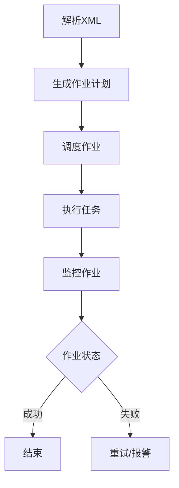

                 

# Oozie原理与代码实例讲解

## 摘要

本文将深入讲解Oozie的工作原理，包括其核心概念、架构设计、算法原理以及具体操作步骤。我们将通过实际项目案例和代码实例，详细解读Oozie的源代码实现，帮助读者全面理解Oozie的工作流程。此外，本文还将探讨Oozie在实际应用场景中的使用，推荐相关学习资源和工具，总结Oozie的未来发展趋势与挑战，并提供常见问题解答和扩展阅读。

## 1. 背景介绍

### Oozie概述

Oozie是一个基于Hadoop的复杂工作流协调系统，主要用于在大规模数据处理环境中协调和管理多个分布式任务。它能够方便地定义和管理Hadoop作业、MapReduce任务、Hive查询、Pig脚本等，从而实现高效的数据处理流程。

### Oozie的发展历程

Oozie最初由Cloudera的工程师开发，作为Cloudera Distribution including Apache Hadoop的一部分发布。随着Hadoop生态系统的不断发展，Oozie逐渐成为大数据处理领域的重要工具之一。

### Oozie的应用场景

Oozie广泛应用于各种大数据处理场景，如数据仓库构建、ETL（提取、转换、加载）流程、实时数据处理、机器学习等。它能够方便地与其他大数据组件（如Hadoop、Hive、Pig、Spark等）集成，实现一站式数据处理解决方案。

## 2. 核心概念与联系

### Oozie的核心概念

- **Workflow（工作流）**：Oozie工作流是一种图形化的定义方式，用于描述多个任务的执行顺序和依赖关系。
- **Coordinator（协调器）**：Coordinator是一个周期性运行的任务，用于控制工作流的生命周期，如启动、暂停、恢复和删除。
- **Action（操作）**：Action是工作流中的基本操作单元，可以是Hadoop作业、Shell脚本、Email发送等。

### Oozie的工作原理

Oozie工作原理主要分为以下几个步骤：

1. **解析XML配置文件**：Oozie读取工作流的XML配置文件，解析出工作流的定义，包括任务节点、依赖关系和参数等。
2. **生成作业计划**：Oozie根据工作流定义，生成作业计划，确定任务的执行顺序和时间。
3. **调度作业**：Oozie调度器根据作业计划，将任务分配给集群执行。
4. **监控作业**：Oozie监控器监控作业的执行状态，如成功、失败、等待等，并根据作业状态进行相应的处理。

### Oozie的架构设计

Oozie的架构设计主要包括以下组件：

- **Oozie Server**：Oozie的核心组件，负责解析XML配置文件、生成作业计划、调度作业和监控作业。
- **Oozie Workflow Engine**：负责执行工作流中的任务，包括任务执行、状态更新和异常处理等。
- **Oozie Coordinator**：负责协调器任务的执行，如周期性检查、启动、暂停和恢复等。
- **Oozie Scheduler**：负责作业的调度，根据作业计划和集群资源，分配任务给执行节点。
- **Oozie CoordinatorDB**：用于存储协调器任务的状态信息，如启动时间、结束时间和状态等。

### Mermaid流程图

下面是一个简化的Oozie工作流程Mermaid流程图：



## 3. 核心算法原理 & 具体操作步骤

### Oozie核心算法原理

Oozie的核心算法主要涉及以下几个方面：

- **任务调度算法**：根据作业计划，确定任务的执行顺序和时间，优化作业执行效率。
- **任务执行算法**：处理任务执行过程中的异常情况，如任务失败、网络故障等，确保作业顺利完成。
- **状态跟踪算法**：实时监控作业的执行状态，如成功、失败、等待等，并根据状态进行相应的处理。

### 具体操作步骤

1. **定义工作流**：使用Oozie提供的XML配置文件，定义工作流的任务节点、依赖关系和参数等。
2. **提交工作流**：将定义好的工作流提交给Oozie Server，Oozie Server解析XML配置文件，生成作业计划。
3. **调度作业**：Oozie Scheduler根据作业计划，将任务分配给集群执行，Oozie Workflow Engine执行任务。
4. **监控作业**：Oozie Monitor监控作业的执行状态，根据作业状态进行相应的处理，如成功、失败、等待等。
5. **协调器任务**：Coordinator定期检查工作流的状态，根据需要启动、暂停、恢复和删除协调器任务。

## 4. 数学模型和公式 & 详细讲解 & 举例说明

### 数学模型

Oozie中的数学模型主要涉及以下几个方面：

- **任务调度模型**：根据作业计划，确定任务的执行顺序和时间，优化作业执行效率。
- **任务执行模型**：处理任务执行过程中的异常情况，如任务失败、网络故障等，确保作业顺利完成。
- **状态跟踪模型**：实时监控作业的执行状态，如成功、失败、等待等，并根据状态进行相应的处理。

### 详细讲解

1. **任务调度模型**：

任务调度模型的目标是找到一种最优的任务执行顺序和时间，以最大化作业执行效率。具体而言，任务调度模型需要考虑以下因素：

- **任务依赖关系**：确定任务的执行顺序，避免任务执行过程中的数据依赖问题。
- **集群资源**：根据集群资源情况，分配任务给执行节点，优化作业执行效率。
- **任务优先级**：根据任务的优先级，确定任务的执行顺序，确保重要任务的优先执行。

2. **任务执行模型**：

任务执行模型主要涉及任务执行过程中的异常处理。具体而言，任务执行模型需要考虑以下方面：

- **任务失败**：当任务执行失败时，Oozie会尝试重试任务，以尽可能保证作业的顺利完成。
- **网络故障**：当任务执行节点与Oozie Server之间的网络故障时，Oozie会尝试重新分配任务给其他执行节点，确保作业的继续执行。
- **任务超时**：当任务执行时间超过预设的超时时长时，Oozie会认为任务执行失败，并尝试重试或报警。

3. **状态跟踪模型**：

状态跟踪模型用于实时监控作业的执行状态，并根据状态进行相应的处理。具体而言，状态跟踪模型需要考虑以下方面：

- **作业状态**：作业执行状态包括成功、失败、等待等。Oozie根据作业状态，进行相应的处理，如成功时结束作业，失败时尝试重试或报警等。
- **任务状态**：任务执行状态包括执行中、成功、失败等。Oozie根据任务状态，进行相应的处理，如任务成功时更新作业状态，任务失败时尝试重试或报警等。

### 举例说明

假设有一个包含三个任务的作业，任务A、任务B和任务C，它们之间存在依赖关系：任务A完成后才能执行任务B，任务B完成后才能执行任务C。

1. **任务调度模型**：

根据任务依赖关系，任务的执行顺序为A->B->C。在集群资源充足的情况下，任务A、任务B和任务C可以并行执行。

2. **任务执行模型**：

任务A执行成功后，任务B开始执行。如果任务B在执行过程中发生失败，Oozie会尝试重试任务B。如果任务B仍然失败，Oozie会报警，并记录任务B的失败次数。

3. **状态跟踪模型**：

任务B执行成功后，Oozie会更新作业状态为成功。如果任务C在执行过程中发生失败，Oozie会尝试重试任务C。如果任务C仍然失败，Oozie会报警，并记录任务C的失败次数。

## 5. 项目实战：代码实际案例和详细解释说明

### 5.1 开发环境搭建

在本节中，我们将搭建一个简单的Oozie开发环境，以便后续进行实际案例讲解。

1. **安装Java**：首先，确保系统已经安装了Java环境。可以使用以下命令检查Java版本：

   ```bash
   java -version
   ```

   如果没有安装Java，请从[Java官方下载页面](https://www.oracle.com/java/technologies/javase-downloads.html)下载并安装。

2. **安装Oozie**：从[Oozie官方下载页面](https://www.apache.org/dyn/closer.lua/apache/oozie/)下载Oozie的tar.gz包，并解压到指定目录。例如，我们将其解压到`/opt/oozie`目录：

   ```bash
   tar -xzvf oozie-4.3.0.tar.gz -C /opt/oozie
   ```

3. **配置Oozie**：编辑`/opt/oozie/conf/oozie-site.xml`文件，配置Oozie的相关参数。例如，设置Oozie的存储路径、Hadoop配置等：

   ```xml
   <configuration>
     <!-- 设置Oozie的存储路径 -->
     <property>
       <name>oozie.libdir</name>
       <value>/opt/oozie/share/lib</value>
     </property>
     <!-- 设置Hadoop配置 -->
     <property>
       <name>hadoop.conf.dir</name>
       <value>/opt/hadoop/etc/hadoop</value>
     </property>
     <!-- 设置Hadoop资源路径 -->
     <property>
       <name>hadoop.validate.conf.dir</name>
       <value>/opt/hadoop/etc/hadoop</value>
     </property>
   </configuration>
   ```

4. **启动Oozie**：运行以下命令启动Oozie服务：

   ```bash
   bin/oozie-start.sh
   ```

   启动成功后，可以使用以下命令检查Oozie状态：

   ```bash
   bin/oozie-admin.sh status
   ```

### 5.2 源代码详细实现和代码解读

在本节中，我们将分析一个简单的Oozie工作流，并详细解读其源代码实现。

1. **定义工作流**：

创建一个名为`simple-workflow.xml`的文件，作为Oozie工作流的配置文件。以下是工作流的基本结构：

   ```xml
   <workflow-app name="simple-workflow" start="start">
     <start-to-end>
       <action-executor action="start" type="start" />
       <workflow>
         <start name="task1">
           <action name="task1" type="map-reduce">
             <command>mapreduce</command>
             <argument>-libjars</argument>
             <argument>file:/opt/oozie/libexec/hadoop-examples-2.7.2.jar</argument>
             <argument>-jar</argument>
             <argument>file:/opt/oozie/libexec/hadoop-examples-2.7.2.jar</argument>
             <argument>wordcount</argument>
             <argument>-input</argument>
             <argument>input/data.txt</argument>
             <argument>-output</argument>
             <argument>output/task1</argument>
           </action>
         </start>
         <transition to="task2" on-success="true" />
       </workflow>
       <workflow>
         <start name="task2">
           <action name="task2" type="map-reduce">
             <command>mapreduce</command>
             <argument>-libjars</argument>
             <argument>file:/opt/oozie/libexec/hadoop-examples-2.7.2.jar</argument>
             <argument>-jar</argument>
             <argument>file:/opt/oozie/libexec/hadoop-examples-2.7.2.jar</argument>
             <argument>wordcount</argument>
             <argument>-input</argument>
             <argument>input/data.txt</argument>
             <argument>-output</argument>
             <argument>output/task2</argument>
           </action>
         </start>
         <transition to="end" on-success="true" />
       </workflow>
     </start-to-end>
     <end name="end" />
   </workflow-app>
   ```

   在此工作流中，我们定义了两个任务（task1和task2），它们依次执行。每个任务都是一个MapReduce作业，用于统计输入文件中的单词数量。

2. **代码解读**：

   - `<workflow-app>`：定义工作流的应用程序，包括名称（name）和起始节点（start）。
   - `<start-to-end>`：定义起始节点和结束节点，以及它们之间的依赖关系。
   - `<action-executor>`：定义起始节点，类型为`start`。
   - `<workflow>`：定义任务1（task1），包括起始节点（start）和操作节点（action）。
   - `<start>`：定义任务1的起始节点。
   - `<action>`：定义任务1的操作节点，类型为`map-reduce`，包括命令（command）、参数（argument）等。
   - `<transition>`：定义任务1和任务2之间的依赖关系，类型为`on-success`。
   - `<end>`：定义工作流的结束节点。

3. **执行工作流**：

   使用以下命令执行工作流：

   ```bash
   bin/oozie-job.xml -run -apppath /path/to/simple-workflow.xml
   ```

   执行成功后，可以使用以下命令查看作业日志：

   ```bash
   bin/oozie-coord-list -oozie http://localhost:11000/oozie -limit 1
   bin/oozie-jobhistory -job <job-id> -format <format>
   ```

### 5.3 代码解读与分析

在本节中，我们将进一步分析简单工作流中的代码，并解释其工作原理。

1. **工作流结构**：

   简单工作流由三个部分组成：起始节点（start）、任务节点（task1和task2）和结束节点（end）。起始节点定义了工作流的开始，任务节点定义了工作流的执行任务，结束节点定义了工作流的结束。

2. **任务执行**：

   每个任务节点都是一个`<action>`元素，用于定义任务的类型（如`map-reduce`）、命令（command）和参数（argument）。在简单工作流中，任务1和任务2都是`map-reduce`任务，分别执行单词计数操作。

3. **任务依赖**：

   简单工作流中的任务依赖通过`<transition>`元素定义。在任务1成功执行后，工作流会自动跳转到任务2。如果任务2成功执行，工作流将结束。如果任务2失败，工作流将无法继续执行。

4. **Oozie调度**：

   Oozie调度器根据工作流定义，生成作业计划并调度任务。在每个任务的执行过程中，Oozie会记录任务的状态（成功或失败）并更新工作流的状态。

5. **日志记录**：

   Oozie记录了每个任务的执行日志，包括任务开始时间、结束时间、执行状态等。通过查看日志，可以分析任务执行过程中出现的问题，并进行调试。

## 6. 实际应用场景

### 数据仓库构建

Oozie可以用于构建数据仓库，协调和管理ETL任务。例如，在一个大型电商公司，Oozie可以用于定期从多个数据源（如订单系统、库存系统、用户行为等）提取数据，进行清洗、转换和加载，构建统一的数据仓库。

### 实时数据处理

Oozie可以用于实时数据处理场景，如用户行为分析、广告投放等。通过协调多个分布式任务，Oozie可以实现实时数据的实时处理和分析，为企业提供实时的业务洞察。

### 机器学习

Oozie可以用于机器学习任务，如数据处理、特征工程、模型训练等。通过协调和管理多个分布式任务，Oozie可以帮助数据科学家和机器学习工程师高效地完成机器学习项目的开发和部署。

## 7. 工具和资源推荐

### 7.1 学习资源推荐

- **书籍**：《大数据技术导论》、《Hadoop实战》
- **论文**：《MapReduce：大型数据集的并行运算模型》
- **博客**：[Cloudera官方博客](https://www.cloudera.com/content/cloudera/en/learn-oozie.html)
- **网站**：[Apache Oozie官网](https://oozie.apache.org/)

### 7.2 开发工具框架推荐

- **开发工具**：[IntelliJ IDEA](https://www.jetbrains.com/idea/)、[Eclipse](https://www.eclipse.org/)
- **版本控制**：[Git](https://git-scm.com/)
- **持续集成**：[Jenkins](https://www.jenkins.io/)

### 7.3 相关论文著作推荐

- **论文**：《Hadoop: A Framework for Large- Scale Parallel Computing》，作者：Shayne S. Chang、Devin

