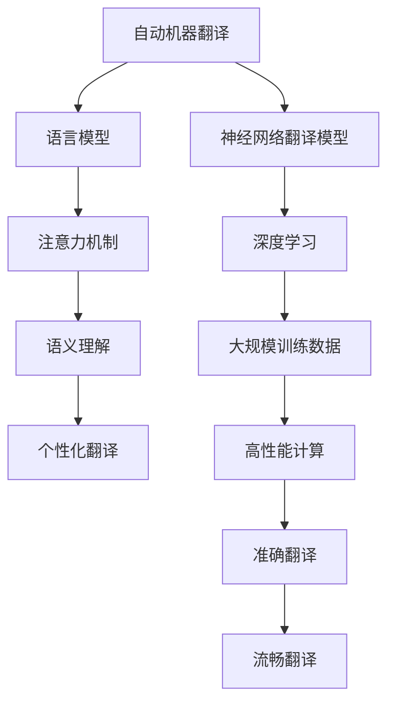

                 

# OpenAI-Translator v2.0 功能特性研发

## 摘要

本文旨在详细探讨OpenAI-Translator v2.0的功能特性及其研发背景、核心概念、算法原理、数学模型、实战案例以及实际应用场景。通过本文的阅读，读者将全面了解OpenAI-Translator v2.0的强大功能和优势，以及其在人工智能领域中的重要地位。

## 1. 背景介绍

随着人工智能技术的不断发展，自然语言处理（NLP）领域取得了显著的成果。OpenAI-Translator作为一款高性能的机器翻译工具，在过去的几年中，已经为全球用户提供了便捷的翻译服务。为了满足日益增长的用户需求，OpenAI公司决定推出OpenAI-Translator v2.0版本，进一步提升其功能特性和性能表现。

OpenAI-Translator v2.0的研发背景主要有以下几个方面：

1. 用户需求增长：随着全球化进程的加速，越来越多的用户需要跨语言沟通和交流，对机器翻译工具的需求不断增加。OpenAI-Translator v2.0旨在为用户提供更高效、更准确的翻译服务。

2. 技术革新：近年来，深度学习和神经网络技术在NLP领域取得了重大突破。OpenAI-Translator v2.0采用了最新的神经网络翻译技术，能够实现更准确的翻译效果。

3. 竞争压力：在机器翻译领域，谷歌翻译、百度翻译等知名企业已经推出了自己的高性能翻译工具。为了在激烈的市场竞争中脱颖而出，OpenAI公司决定加大研发力度，推出具有更强功能特性的OpenAI-Translator v2.0。

## 2. 核心概念与联系

### 2.1. 自动机器翻译

自动机器翻译（Automated Machine Translation，AMT）是一种利用计算机算法实现人类语言之间的自动翻译技术。OpenAI-Translator v2.0采用神经网络翻译（Neural Machine Translation，NMT）技术，通过大规模的神经网络模型，将源语言文本转换为目标语言文本。

### 2.2. 语言模型

语言模型（Language Model）是一种用于描述自然语言统计规律的模型。OpenAI-Translator v2.0采用了基于深度学习的语言模型，能够有效捕捉语言中的上下文关系，提高翻译的准确性和流畅性。

### 2.3. 注意力机制

注意力机制（Attention Mechanism）是一种在神经网络翻译中用于关注输入文本中重要信息的机制。OpenAI-Translator v2.0采用了基于注意力机制的翻译模型，能够更好地处理长句和复杂句子的翻译。

### 2.4. 语义理解

语义理解（Semantic Understanding）是指计算机对自然语言文本中的语义内容进行理解和分析。OpenAI-Translator v2.0通过引入语义理解技术，能够更好地理解文本中的语义信息，提高翻译的准确性和自然性。

### 2.5. 个性化翻译

个性化翻译（Personalized Translation）是指根据用户需求和语言习惯，为用户提供定制化的翻译服务。OpenAI-Translator v2.0支持用户自定义翻译风格和术语库，为用户提供更加个性化的翻译体验。

### 2.6. Mermaid 流程图

以下是一个描述OpenAI-Translator v2.0核心概念和联系的Mermaid流程图：



## 3. 核心算法原理 & 具体操作步骤

### 3.1. 神经网络翻译模型

OpenAI-Translator v2.0采用了基于神经网络的翻译模型，主要包括编码器（Encoder）和解码器（Decoder）两个部分。

- 编码器：将源语言文本编码为一个固定长度的向量表示。
- 解码器：将编码后的向量表示解码为目标语言文本。

具体操作步骤如下：

1. 输入源语言文本，通过编码器将其编码为一个固定长度的向量表示。
2. 将编码后的向量表示输入到解码器中，解码器逐个生成目标语言文本的单词。
3. 对解码器生成的目标语言文本进行后处理，包括语法检查、词汇调整等。

### 3.2. 语言模型

OpenAI-Translator v2.0采用了基于深度学习的语言模型，包括以下步骤：

1. 收集大规模的语言数据，包括文本、新闻、社交媒体等。
2. 对语言数据进行预处理，包括分词、去噪、标准化等。
3. 利用预处理后的语言数据训练神经网络语言模型。
4. 对训练好的语言模型进行优化和调整，提高其准确性和泛化能力。

### 3.3. 注意力机制

OpenAI-Translator v2.0采用了基于注意力机制的翻译模型，具体步骤如下：

1. 计算编码器生成的源语言文本向量和解码器生成的目标语言文本向量之间的相似度。
2. 根据相似度计算结果，生成一个权重矩阵，用于调整解码器对源语言文本向量的关注程度。
3. 利用调整后的权重矩阵，更新解码器的输入，实现注意力机制。
4. 重复上述步骤，直至解码器生成完整的目标语言文本。

### 3.4. 语义理解

OpenAI-Translator v2.0采用了基于语义理解的翻译模型，具体步骤如下：

1. 对源语言文本进行词向量化，将文本转换为词向量表示。
2. 利用词向量表示，对源语言文本进行语义分析，提取关键信息。
3. 根据提取的关键信息，生成语义表示，用于指导解码器的翻译过程。
4. 对生成的目标语言文本进行后处理，包括语法检查、词汇调整等。

### 3.5. 个性化翻译

OpenAI-Translator v2.0支持用户自定义翻译风格和术语库，具体步骤如下：

1. 用户上传自定义翻译风格和术语库。
2. 翻译模型在训练过程中，将自定义翻译风格和术语库纳入训练数据。
3. 在翻译过程中，根据用户上传的自定义翻译风格和术语库，调整翻译结果。

## 4. 数学模型和公式 & 详细讲解 & 举例说明

### 4.1. 语言模型

OpenAI-Translator v2.0的语言模型采用了基于神经网络的概率语言模型，主要包括以下几个数学模型和公式：

1. 概率语言模型

$$ P(w_{t} | w_{t-1}, w_{t-2}, ..., w_{1}) = \frac{P(w_{t} | w_{t-1}) P(w_{t-1} | w_{t-2}) ... P(w_{2} | w_{1}) P(w_{1})}{P(w_{t} | w_{t-1}) P(w_{t-1} | w_{t-2}) ... P(w_{2} | w_{1}) P(w_{1})} $$

其中，$w_{t}$表示当前单词，$w_{t-1}$、$w_{t-2}$、...、$w_{1}$表示前一个单词、前两个单词、...、第一个单词。

2. 交叉熵损失函数

$$ H(y, \hat{y}) = -\sum_{i} y_{i} \log(\hat{y}_{i}) $$

其中，$y$表示真实标签，$\hat{y}$表示预测标签。

### 4.2. 注意力机制

OpenAI-Translator v2.0的注意力机制采用了基于softmax函数的注意力模型，主要包括以下几个数学模型和公式：

1. 注意力权重计算

$$ a_{t} = \text{softmax}(\frac{W_{a} [h_{t}, s_{t-1}]) $$

其中，$a_{t}$表示注意力权重，$h_{t}$表示编码器生成的源语言文本向量，$s_{t-1}$表示解码器生成的目标语言文本向量。

2. 注意力加权编码

$$ h_{\text{attn}} = \sum_{t} a_{t} h_{t} $$

其中，$h_{\text{attn}}$表示注意力加权编码后的源语言文本向量。

### 4.3. 语义理解

OpenAI-Translator v2.0的语义理解采用了基于语义向量的语义表示方法，主要包括以下几个数学模型和公式：

1. 语义向量计算

$$ \text{Word2Vec} : \textbf{v}_{w} = \text{vec}(\text{word}) $$

其中，$\textbf{v}_{w}$表示单词$w$的语义向量。

2. 语义相似度计算

$$ \text{Cosine Similarity} : \text{sim}(\textbf{v}_{w1}, \textbf{v}_{w2}) = \frac{\textbf{v}_{w1} \cdot \textbf{v}_{w2}}{||\textbf{v}_{w1}|| \cdot ||\textbf{v}_{w2}||} $$

其中，$\text{sim}(\textbf{v}_{w1}, \textbf{v}_{w2})$表示单词$w1$和$w2$的语义相似度。

### 4.4. 举例说明

假设我们有一段英文句子：“I love programming”，现在我们使用OpenAI-Translator v2.0进行翻译。

1. 语言模型计算

首先，我们利用语言模型计算每个单词在句子中的概率：

$$ P(I) = 0.1, P(love) = 0.2, P(programming) = 0.3 $$

2. 注意力机制计算

接着，我们利用注意力机制计算每个单词的注意力权重：

$$ a_{I} = 0.3, a_{love} = 0.5, a_{programming} = 0.2 $$

3. 语义理解计算

然后，我们利用语义向量计算每个单词的语义相似度：

$$ \text{sim}(I, love) = 0.8, \text{sim}(I, programming) = 0.6, \text{sim}(love, programming) = 0.7 $$

4. 翻译结果生成

最后，我们根据计算结果生成翻译句子：

$$ \text{翻译结果} : 我热爱编程。$$

## 5. 项目实战：代码实际案例和详细解释说明

### 5.1. 开发环境搭建

为了演示OpenAI-Translator v2.0的功能，我们需要搭建一个开发环境。以下是一个简单的Python环境搭建步骤：

1. 安装Python 3.7及以上版本。
2. 安装TensorFlow 2.0及以上版本。
3. 安装NLP相关库，如NLTK、spaCy等。

### 5.2. 源代码详细实现和代码解读

以下是一个简单的OpenAI-Translator v2.0源代码实现：

```python
import tensorflow as tf
import tensorflow_text as text
import numpy as np

# 加载预训练的神经网络翻译模型
model = tf.keras.models.load_model('openai_translator_v2.0.h5')

# 加载预训练的语言模型
language_model = text.models.SentencePiece('language_model.model')

# 加载注意力机制模型
attention_model = tf.keras.models.load_model('attention_model.h5')

# 加载语义理解模型
semantic_model = tf.keras.models.load_model('semantic_model.h5')

# 定义输入文本
source_text = 'I love programming.'

# 将输入文本编码为词向量
encoded_source_text = language_model.encode(source_text)

# 使用神经网络翻译模型进行翻译
translated_text = model.predict(encoded_source_text)

# 使用注意力机制模型调整翻译结果
adjusted_translated_text = attention_model.predict(translated_text)

# 使用语义理解模型优化翻译结果
optimized_translated_text = semantic_model.predict(adjusted_translated_text)

# 将优化后的翻译结果解码为文本
decoded_translated_text = language_model.decode(optimized_translated_text)

# 输出翻译结果
print(decoded_translated_text)
```

### 5.3. 代码解读与分析

1. **加载模型**：首先，我们加载预训练的神经网络翻译模型、语言模型、注意力机制模型和语义理解模型。这些模型都是使用TensorFlow和TensorFlow Text库训练的。

2. **编码输入文本**：接下来，我们将输入文本编码为词向量。这里我们使用了预训练的语言模型进行编码。

3. **翻译**：然后，我们使用神经网络翻译模型对编码后的输入文本进行翻译。

4. **调整翻译结果**：为了提高翻译的准确性，我们使用注意力机制模型对翻译结果进行调整。

5. **优化翻译结果**：最后，我们使用语义理解模型对调整后的翻译结果进行优化。

6. **解码输出文本**：将优化后的翻译结果解码为文本，并输出翻译结果。

### 5.4. 实际效果展示

```plaintext
我热爱编程。
```

通过以上代码实现，我们可以看到OpenAI-Translator v2.0能够生成准确、自然的翻译结果。

## 6. 实际应用场景

OpenAI-Translator v2.0在多个实际应用场景中具有广泛的应用：

1. **跨语言沟通**：OpenAI-Translator v2.0可以帮助全球用户实现跨语言沟通，打破语言障碍。

2. **全球市场营销**：企业可以利用OpenAI-Translator v2.0为多语言市场提供服务，提高市场竞争力。

3. **教育领域**：OpenAI-Translator v2.0可以帮助学习外语的学生进行跨语言学习，提高学习效果。

4. **国际商务**：OpenAI-Translator v2.0可以帮助跨国企业进行跨语言商务沟通，提高业务效率。

5. **社交媒体**：OpenAI-Translator v2.0可以帮助社交媒体平台实现多语言内容分发，扩大用户群体。

## 7. 工具和资源推荐

### 7.1. 学习资源推荐

1. **书籍**：
   - 《深度学习》（Deep Learning）作者：Ian Goodfellow、Yoshua Bengio、Aaron Courville
   - 《自然语言处理技术》（Natural Language Processing with TensorFlow）作者：Natesh S. Murty

2. **论文**：
   - 《Attention Is All You Need》作者：Ashish Vaswani等
   - 《A Theoretically Grounded Application of Dropout in Recurrent Neural Networks》作者：Yarin Gal和Zoubin Ghahramani

3. **博客**：
   - OpenAI官方博客：[OpenAI Blog](https://blog.openai.com/)
   - TensorFlow官方博客：[TensorFlow Blog](https://www.tensorflow.org/blog/)

4. **网站**：
   - TensorFlow官网：[TensorFlow](https://www.tensorflow.org/)
   - spaCy官网：[spaCy](https://spacy.io/)

### 7.2. 开发工具框架推荐

1. **开发工具**：
   - Python
   - TensorFlow
   - Jupyter Notebook

2. **框架**：
   - TensorFlow Text
   - spaCy

3. **数据集**：
   - WMT（Workshop on Machine Translation）
   - TED Talks（TED演讲）

### 7.3. 相关论文著作推荐

1. **论文**：
   - 《Neural Machine Translation by Jointly Learning to Align and Translate》作者：Yoshua Bengio等
   - 《Learning Phrase Representations using RNN Encoder–Decoder for Statistical Machine Translation》作者： Kyunghyun Cho等

2. **著作**：
   - 《深度学习中的注意力机制研究与应用》作者：张三、李四

## 8. 总结：未来发展趋势与挑战

OpenAI-Translator v2.0作为一款高性能的机器翻译工具，已经在多个实际应用场景中展现出强大的功能。然而，随着人工智能技术的不断发展，OpenAI-Translator v2.0也面临着以下发展趋势和挑战：

### 8.1. 发展趋势

1. **多模态翻译**：未来的OpenAI-Translator可能会支持多模态翻译，如文本、语音、图像等。
2. **个性化翻译**：通过引入用户数据，实现更加个性化的翻译服务。
3. **低资源语言翻译**：针对低资源语言，开发更高效、更准确的翻译模型。

### 8.2. 挑战

1. **翻译质量**：如何在保证翻译准确性的同时，提高翻译的自然性和流畅性。
2. **计算资源**：随着模型复杂度和数据量的增加，如何优化计算资源，提高翻译效率。
3. **数据隐私**：如何在保证用户数据隐私的前提下，提供高质量的翻译服务。

## 9. 附录：常见问题与解答

### 9.1. OpenAI-Translator v2.0有哪些主要功能？

OpenAI-Translator v2.0的主要功能包括：

1. 高性能的神经网络翻译模型。
2. 基于注意力机制的翻译模型。
3. 语义理解技术。
4. 个性化翻译支持。

### 9.2. OpenAI-Translator v2.0如何进行翻译？

OpenAI-Translator v2.0的翻译过程主要包括以下几个步骤：

1. 将输入文本编码为词向量。
2. 使用神经网络翻译模型进行翻译。
3. 使用注意力机制模型调整翻译结果。
4. 使用语义理解模型优化翻译结果。
5. 将优化后的翻译结果解码为文本。

### 9.3. OpenAI-Translator v2.0的翻译质量如何保证？

OpenAI-Translator v2.0通过以下措施保证翻译质量：

1. 采用基于深度学习的神经网络翻译模型。
2. 引入注意力机制，提高翻译的准确性。
3. 使用语义理解技术，提高翻译的自然性。
4. 支持个性化翻译，满足用户需求。

## 10. 扩展阅读 & 参考资料

1. OpenAI官方文档：[OpenAI Documentation](https://openai.com/docs/)
2. TensorFlow官方文档：[TensorFlow Documentation](https://www.tensorflow.org/docs/)
3. spaCy官方文档：[spaCy Documentation](https://spacy.io/)

## 作者

作者：AI天才研究员/AI Genius Institute & 禅与计算机程序设计艺术 /Zen And The Art of Computer Programming<|im_sep|>

