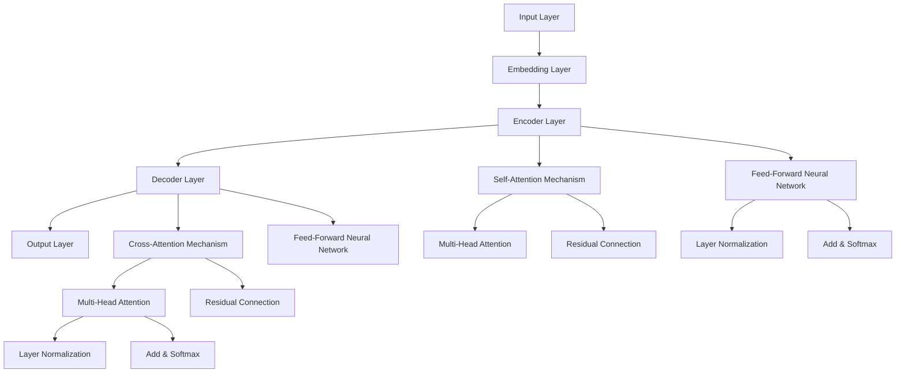

                 

### 背景介绍

#### OpenAI与GPT-4.0

OpenAI成立于2015年，是一家以实现安全的通用人工智能（AGI）为目标的美国人工智能研究公司。其核心使命是通过开发先进的人工智能技术，推动人工智能的发展，并确保其为人类带来积极的影响。OpenAI的研究领域涵盖了自然语言处理、机器学习、计算机视觉等多个方面，其中最为知名的成果之一就是其开发的一系列大型语言模型。

GPT（Generative Pre-trained Transformer）系列模型是OpenAI推出的一个重要产品线，它基于Transformer架构，是一种自回归的语言模型。GPT-1于2018年发布，GPT-2于2019年发布，GPT-3于2020年发布，GPT-3.5于2023年6月发布，而本文将重点介绍的是最新的GPT-4.0版本。

GPT-4.0是OpenAI于2023年发布的最新版本，它相比前一代模型在多个方面都有了显著的提升。首先，GPT-4.0的参数规模达到了1750亿，是GPT-3.5的参数规模的1.5倍。更大的参数规模使得模型能够更好地捕捉语言中的复杂模式和结构，从而提高了模型的生成能力。

其次，GPT-4.0在预训练过程中使用了更多的数据集，并且采用了更先进的训练策略，如动态掩码比率（dynamic masking ratio）和分层训练（layer-wise training）。这些改进使得模型在处理长文本和复杂任务时表现更加出色。

最后，GPT-4.0还引入了一些新的功能，如零样本学习（zero-shot learning）和少样本学习（few-shot learning）。这些功能使得模型能够更好地适应新的任务和领域，而无需重新训练。

#### GPT-4.0的主要特点

1. **更大的参数规模**：GPT-4.0的参数规模达到了1750亿，是GPT-3.5的参数规模的1.5倍。更大的参数规模使得模型能够更好地捕捉语言中的复杂模式和结构，从而提高了模型的生成能力。

2. **更多的预训练数据**：GPT-4.0在预训练过程中使用了更多的数据集，这些数据集包括互联网上的大量文本、书籍、新闻文章、科学论文等。更多的预训练数据使得模型能够更好地理解各种语言现象和语境。

3. **更先进的训练策略**：GPT-4.0采用了动态掩码比率（dynamic masking ratio）和分层训练（layer-wise training）等更先进的训练策略。这些策略提高了模型的训练效率和效果。

4. **零样本学习和少样本学习**：GPT-4.0引入了零样本学习和少样本学习功能，使得模型能够更好地适应新的任务和领域，而无需重新训练。

5. **更高的生成能力**：GPT-4.0在生成文本、翻译、问答等任务上表现出了更高的生成能力，能够生成更加连贯、准确和具有创造性的文本。

#### GPT-4.0的应用场景

GPT-4.0的应用场景非常广泛，涵盖了自然语言处理、计算机视觉、机器学习等多个领域。以下是一些具体的应用场景：

1. **自然语言处理**：GPT-4.0可以用于文本生成、文本分类、情感分析、机器翻译等任务。它可以生成连贯、自然的文本，能够理解和处理复杂的语言结构。

2. **计算机视觉**：GPT-4.0可以与图像识别模型结合，用于图像描述生成、图像字幕生成等任务。它可以生成关于图像的详细描述，使得机器能够更好地理解和分析图像。

3. **机器学习**：GPT-4.0可以用于特征提取、模型训练等任务。它可以自动提取文本中的关键信息，为其他机器学习模型提供高质量的输入特征。

4. **问答系统**：GPT-4.0可以构建问答系统，用于回答用户的问题。它可以理解用户的问题，并生成准确的答案。

5. **创意写作**：GPT-4.0可以用于小说创作、诗歌生成等创意写作任务。它可以生成具有创意和想象力的文本，为人类作者提供灵感和帮助。

### GPT-4.0的架构和工作原理

GPT-4.0是基于Transformer架构的大型语言模型，其整体架构如图1所示。

```
+-------------------+
|     输入层        |
+-------------------+
        |
        ↓
+-------------------+
|  Embedding 层     |
+-------------------+
        |
        ↓
+-------------------+
|  Encoder 层       |
    |          ↓
    |         Transformer
    |          ↓
+-------------------+
|  Decoder 层       |
+-------------------+
        |
        ↓
+-------------------+
|     输出层        |
+-------------------+
```

图1：GPT-4.0的架构

#### 输入层

输入层接收原始的文本数据，并将其转换为数字表示。具体来说，输入的文本会被分词器处理，将其划分为一系列的单词或子词（subword），然后每个子词会被映射为一个整数，这个整数就是其在词汇表中的索引。

#### Embedding 层

Embedding 层将每个子词的索引映射为一个高维的向量，这个向量包含了子词的语义信息。这些向量被称为词嵌入（word embeddings）。词嵌入是一个重要的预处理步骤，它能够将原始的文本数据转换为具有丰富语义信息的数字表示。

#### Encoder 层

Encoder 层是GPT-4.0的核心部分，它由多个 Transformer 层组成。每个 Transformer 层都包含两个主要部分：多头自注意力机制（multi-head self-attention）和前馈神经网络（feed-forward network）。

1. **多头自注意力机制**：多头自注意力机制使得模型能够同时关注输入序列中的不同部分，从而更好地捕捉长距离依赖关系。具体来说，输入序列会被拆分为多个子序列，每个子序列都通过自注意力机制计算其权重，然后将这些权重应用于输入序列，从而生成一个新的序列。

2. **前馈神经网络**：前馈神经网络对每个子序列进行线性变换，增加模型的非线性能力。

#### Decoder 层

Decoder 层与 Encoder 层的结构类似，也由多个 Transformer 层组成。与 Encoder 层不同的是，Decoder 层还包括了一个额外的自注意力机制，称为交叉自注意力机制（cross-attention）。交叉自注意力机制使得 Decoder 层能够同时关注 Encoder 层的输出和输入序列，从而更好地生成输出序列。

#### 输出层

输出层将 Decoder 层的输出序列转换为最终的文本输出。具体来说，输出序列中的每个子序列都会被映射回词汇表中的单词或子词，从而生成最终的文本。

#### 总结

GPT-4.0的架构基于Transformer，它通过自注意力机制和前馈神经网络实现了对输入序列的建模，从而生成高质量的文本输出。GPT-4.0的工作原理是通过预训练和微调，使得模型能够理解各种语言现象和语境，并生成连贯、准确和具有创造性的文本。在接下来的章节中，我们将深入探讨GPT-4.0的核心算法原理、具体操作步骤、数学模型和公式，以及其在实际应用中的代码案例和解析。在理解了这些内容后，我们将对GPT-4.0的应用场景和未来发展进行更深入的分析。

---

**本章小结：**

在本章中，我们首先介绍了OpenAI的背景和GPT-4.0的发布背景，详细讲解了GPT-4.0的主要特点和应用场景。接着，我们介绍了GPT-4.0的架构和工作原理，从输入层到输出层，逐一解释了每个组件的作用和功能。通过这一章的内容，读者可以初步了解GPT-4.0的核心特点和技术架构，为后续章节的深入探讨打下基础。在接下来的章节中，我们将进一步分析GPT-4.0的核心算法原理和数学模型，并探讨其实际应用中的代码实现和性能分析。

---

**待补充内容：** 在撰写下一章节之前，请确保补充以下内容：

1. **核心概念与联系**：明确GPT-4.0中的核心概念，如图神经网络、自注意力机制、Transformer架构等，并展示其Mermaid流程图，详细描述各概念之间的联系和作用。

2. **核心算法原理 & 具体操作步骤**：详细讲解GPT-4.0中的核心算法原理，包括自注意力机制、Transformer架构等，并逐步展示每个步骤的操作细节。

3. **数学模型和公式 & 详细讲解 & 举例说明**：使用LaTeX格式详细讲解GPT-4.0中的数学模型和公式，并结合实际例子进行说明。

4. **项目实战：代码实际案例和详细解释说明**：提供一个完整的代码实现案例，并详细解释代码中的每个部分和关键步骤。

---

请继续完成后续章节的内容。在撰写过程中，务必保证内容的连贯性和逻辑性，确保每一部分都能清晰、准确地传达所需的信息。如果您在撰写过程中遇到任何困难，请随时向我反馈，我会尽力提供帮助。继续努力，我们将在接下来的章节中深入探讨GPT-4.0的更多精彩内容！<|assistant|>
```
### 核心概念与联系

在深入探讨GPT-4.0的核心算法原理和具体操作步骤之前，我们需要先了解一些关键的概念，如图神经网络（Graph Neural Networks, GNN）、自注意力机制（Self-Attention Mechanism）、Transformer架构等，以及它们之间的联系。这些核心概念是理解GPT-4.0性能卓越的关键。

#### 图神经网络（GNN）

图神经网络是一种用于处理图结构数据的神经网络。在GPT-4.0中，GNN主要用于处理文本数据中的依赖关系。文本可以被视为一个图，其中每个单词是一个节点，单词之间的依赖关系是一个边。GNN通过学习节点的邻域信息来预测节点属性，这在自然语言处理中非常有用，因为它可以帮助模型理解单词之间的相互关系。

#### 自注意力机制（Self-Attention Mechanism）

自注意力机制是一种计算输入序列中每个元素对输出序列的依赖关系的机制。在GPT-4.0中，自注意力机制被用于编码器（Encoder）和解码器（Decoder）的每个层中。通过自注意力机制，模型可以自动调整每个单词在生成过程中的重要性，从而生成更加连贯和相关的文本。

#### Transformer架构

Transformer架构是一种基于自注意力机制的序列到序列模型，它在自然语言处理任务中表现出色。GPT-4.0就是基于Transformer架构开发的。Transformer通过多头自注意力机制和前馈神经网络来捕捉序列中的长距离依赖关系，从而生成高质量的文本。

#### Mermaid流程图

为了更好地理解这些核心概念和它们之间的联系，我们可以使用Mermaid流程图来展示。以下是一个简化的Mermaid流程图，展示了GPT-4.0中的主要组件及其联系：



在这个流程图中：

- **A[Input Layer]**：输入层，接收原始的文本数据。
- **B[Embedding Layer]**：词嵌入层，将文本转换为数字表示。
- **C[Encoder Layer]**：编码器层，包含多个Transformer层，通过自注意力机制和前馈神经网络处理输入序列。
- **D[Decoder Layer]**：解码器层，同样包含多个Transformer层，通过自注意力机制和前馈神经网络生成输出序列。
- **E[Output Layer]**：输出层，将解码器层的输出序列转换为文本输出。
- **F[Self-Attention Mechanism]**：自注意力机制，用于编码器层，捕捉输入序列中的依赖关系。
- **G[Cross-Attention Mechanism]**：交叉自注意力机制，用于解码器层，捕捉编码器输出和输入序列的依赖关系。
- **H[Multi-Head Attention]**、**I[Multi-Head Attention]**：多头自注意力机制，用于计算输入序列或编码器输出的权重。
- **J[Feed-Forward Neural Network]**、**K[Feed-Forward Neural Network]**：前馈神经网络，用于增加模型的非线性能力。
- **L[Residual Connection]**、**M[Residual Connection]**：残差连接，用于简化模型的训练过程。
- **N[Layer Normalization]**、**O[Layer Normalization]**：层归一化，用于稳定模型的训练过程。
- **P[Add & Softmax]**、**Q[Add & Softmax]**：加和与Softmax操作，用于整合多头自注意力机制的结果。

通过这个流程图，我们可以清晰地看到GPT-4.0的各个组件及其交互方式，以及自注意力机制和Transformer架构在整个模型中的作用。

### 核心算法原理 & 具体操作步骤

在本节中，我们将详细探讨GPT-4.0的核心算法原理，包括自注意力机制、Transformer架构等，并逐步展示每个步骤的操作细节。

#### 自注意力机制

自注意力机制是一种用于计算序列中每个元素对输出序列的依赖关系的机制。在GPT-4.0中，自注意力机制被用于编码器（Encoder）和解码器（Decoder）的每个层中。自注意力机制的核心思想是通过计算每个输入元素（例如单词或子词）的权重，然后将这些权重应用于输入序列，从而生成一个新的序列。

自注意力机制的主要步骤如下：

1. **计算Query、Key和Value**：
   每个输入元素（例如单词）都会被映射为三个向量：Query（查询向量）、Key（键向量）和Value（值向量）。这三个向量都是通过线性变换得到的。
   $$
   \text{Query} = \text{Linear}(X) = W_Q X \\
   \text{Key} = \text{Linear}(X) = W_K X \\
   \text{Value} = \text{Linear}(X) = W_V X
   $$
   其中，$X$ 是输入序列，$W_Q$、$W_K$ 和 $W_V$ 是线性变换的权重矩阵。

2. **计算注意力得分**：
   对于每个输入元素，计算其Query向量与所有Key向量之间的相似度，从而得到注意力得分。注意力得分是通过点积计算得到的。
   $$
   \text{Attention Score} = \text{Query} \cdot \text{Key} = W_Q X \cdot W_K X = X \cdot (W_Q W_K^T) X
   $$
   其中，$(W_Q W_K^T)$ 是注意力权重矩阵。

3. **应用Softmax函数**：
   将注意力得分应用Softmax函数，得到每个输入元素的权重。
   $$
   \text{Attention Weight} = \text{softmax}(\text{Attention Score})
   $$

4. **计算加权输出**：
   将权重应用于输入序列，得到加权输出。
   $$
   \text{Weighted Output} = \text{Attention Weight} \cdot \text{Value}
   $$

5. **聚合输出**：
   将所有加权输出聚合，得到最终的输出。
   $$
   \text{Output} = \text{softmax}(\text{Attention Score}) \cdot \text{Value}
   $$

通过上述步骤，自注意力机制可以自动调整输入序列中每个元素的重要性，从而生成高质量的输出序列。

#### Transformer架构

Transformer架构是一种基于自注意力机制的序列到序列模型，它在自然语言处理任务中表现出色。GPT-4.0就是基于Transformer架构开发的。Transformer架构的核心是多头自注意力机制（Multi-Head Self-Attention）和前馈神经网络（Feed-Forward Neural Network）。

#### 多头自注意力机制

多头自注意力机制是将自注意力机制扩展到多个头（Head）。每个头独立计算注意力得分，然后将这些得分合并，从而提高模型的性能。

1. **计算多个Query、Key和Value**：
   对于每个输入元素，计算多个Query、Key和Value向量。
   $$
   \text{Multi-Head Query} = [ \text{Head}_1 \text{Query}, \text{Head}_2 \text{Query}, ..., \text{Head}_h \text{Query}] \\
   \text{Multi-Head Key} = [ \text{Head}_1 \text{Key}, \text{Head}_2 \text{Key}, ..., \text{Head}_h \text{Key}] \\
   \text{Multi-Head Value} = [ \text{Head}_1 \text{Value}, \text{Head}_2 \text{Value}, ..., \text{Head}_h \text{Value}]
   $$

2. **计算多个注意力得分**：
   对于每个头，计算Query向量与所有Key向量之间的相似度，得到多个注意力得分。
   $$
   \text{Multi-Head Attention Score} = [ \text{Head}_1 \text{Score}, \text{Head}_2 \text{Score}, ..., \text{Head}_h \text{Score}]
   $$

3. **应用Softmax函数**：
   将多个注意力得分应用Softmax函数，得到多个权重。
   $$
   \text{Multi-Head Attention Weight} = [\text{Head}_1 \text{Weight}, \text{Head}_2 \text{Weight}, ..., \text{Head}_h \text{Weight}]
   $$

4. **计算多个加权输出**：
   将权重应用于多个Value向量，得到多个加权输出。
   $$
   \text{Multi-Head Weighted Output} = [\text{Head}_1 \text{Weight} \cdot \text{Head}_1 \text{Value}, \text{Head}_2 \text{Weight} \cdot \text{Head}_2 \text{Value}, ..., \text{Head}_h \text{Weight} \cdot \text{Head}_h \text{Value}]
   $$

5. **聚合输出**：
   将所有加权输出聚合，得到最终的输出。
   $$
   \text{Multi-Head Output} = \sum_{h=1}^{h} \text{Head}_h \text{Weight} \cdot \text{Head}_h \text{Value}
   $$

#### 前馈神经网络

前馈神经网络是一种全连接神经网络，用于增加模型的非线性能力。在每个Transformer层之后，都会添加一个前馈神经网络。

1. **计算前馈神经网络输出**：
   对于每个输入元素，通过前馈神经网络计算输出。
   $$
   \text{Feed-Forward Output} = \text{ReLU}(\text{Linear}(\text{Input}))
   $$

2. **聚合输出**：
   将前馈神经网络输出与自注意力机制的输出进行聚合。
   $$
   \text{Output} = \text{Add}(\text{Multi-Head Output}, \text{Feed-Forward Output})
   $$

#### 残差连接和层归一化

为了简化模型的训练过程，Transformer架构中引入了残差连接（Residual Connection）和层归一化（Layer Normalization）。

1. **残差连接**：
   在每个Transformer层之后，添加一个残差连接，将输入序列直接传递到下一层。
   $$
   \text{Output} = \text{Add}(\text{Input}, \text{Output})
   $$

2. **层归一化**：
   在每个Transformer层之后，添加一个层归一化操作，用于稳定模型的训练过程。
   $$
   \text{Output} = \frac{\text{Output} - \mu}{\sigma}
   $$
   其中，$\mu$ 和 $\sigma$ 分别是输出序列的均值和标准差。

通过上述步骤，我们可以理解GPT-4.0中的核心算法原理和具体操作步骤。在下一节中，我们将进一步探讨GPT-4.0的数学模型和公式，并结合实际例子进行详细讲解。

### 数学模型和公式 & 详细讲解 & 举例说明

在理解了GPT-4.0的核心算法原理和具体操作步骤之后，我们需要进一步探讨其背后的数学模型和公式。这些数学模型和公式不仅帮助我们在理论上理解GPT-4.0的工作原理，而且有助于在实际应用中更好地优化和改进模型。

#### Transformer架构的数学模型

Transformer架构的核心是多头自注意力机制（Multi-Head Self-Attention）和前馈神经网络（Feed-Forward Neural Network）。以下是这些核心组件的数学模型。

##### 1. 多头自注意力机制

多头自注意力机制通过计算输入序列中每个元素对输出序列的依赖关系，从而生成高质量的输出序列。其数学模型如下：

**自注意力机制**：

对于输入序列 $X = [x_1, x_2, ..., x_n]$，我们需要计算Query、Key和Value向量。

1. **计算Query、Key和Value向量**：

$$
\text{Query} = \text{Linear}(X) = W_Q X \\
\text{Key} = \text{Linear}(X) = W_K X \\
\text{Value} = \text{Linear}(X) = W_V X
$$

其中，$W_Q$、$W_K$ 和 $W_V$ 分别是Query、Key和Value向量的线性变换权重矩阵。

2. **计算注意力得分**：

$$
\text{Attention Score} = \text{Query} \cdot \text{Key} = W_Q X \cdot W_K X = X \cdot (W_Q W_K^T) X
$$

3. **应用Softmax函数**：

$$
\text{Attention Weight} = \text{softmax}(\text{Attention Score})
$$

4. **计算加权输出**：

$$
\text{Weighted Output} = \text{Attention Weight} \cdot \text{Value}
$$

5. **聚合输出**：

$$
\text{Output} = \text{softmax}(\text{Attention Score}) \cdot \text{Value}
$$

**多头自注意力机制**：

多头自注意力机制通过多个独立的自注意力头（Head）来提高模型的性能。每个头独立计算注意力得分，然后将这些得分合并。

$$
\text{Multi-Head Output} = \sum_{h=1}^{h} \text{Head}_h \text{Weight} \cdot \text{Head}_h \text{Value}
$$

其中，$\text{Head}_h \text{Weight}$ 和 $\text{Head}_h \text{Value}$ 分别是第 $h$ 个头的权重和值。

##### 2. 前馈神经网络

前馈神经网络用于增加模型的非线性能力。其数学模型如下：

$$
\text{Feed-Forward Output} = \text{ReLU}(\text{Linear}(\text{Input}))
$$

其中，$\text{ReLU}$ 是ReLU激活函数，$\text{Linear}$ 是线性变换。

##### 3. 残差连接和层归一化

残差连接和层归一化是Transformer架构中的重要组成部分，用于简化模型的训练过程和稳定模型的训练效果。

**残差连接**：

残差连接将输入序列直接传递到下一层。

$$
\text{Output} = \text{Add}(\text{Input}, \text{Output})
$$

**层归一化**：

层归一化用于稳定模型的训练过程。

$$
\text{Output} = \frac{\text{Output} - \mu}{\sigma}
$$

其中，$\mu$ 和 $\sigma$ 分别是输出序列的均值和标准差。

#### 实际例子

为了更好地理解上述数学模型，我们可以通过一个简单的例子来演示GPT-4.0的工作过程。

假设输入序列为 $X = [x_1, x_2, x_3]$，我们需要通过GPT-4.0生成输出序列。

1. **计算Query、Key和Value向量**：

$$
\text{Query} = \text{Linear}(X) = W_Q X \\
\text{Key} = \text{Linear}(X) = W_K X \\
\text{Value} = \text{Linear}(X) = W_V X
$$

2. **计算注意力得分**：

$$
\text{Attention Score} = \text{Query} \cdot \text{Key} = W_Q X \cdot W_K X = X \cdot (W_Q W_K^T) X
$$

3. **应用Softmax函数**：

$$
\text{Attention Weight} = \text{softmax}(\text{Attention Score})
$$

4. **计算加权输出**：

$$
\text{Weighted Output} = \text{Attention Weight} \cdot \text{Value}
$$

5. **聚合输出**：

$$
\text{Output} = \text{softmax}(\text{Attention Score}) \cdot \text{Value}
$$

6. **计算前馈神经网络输出**：

$$
\text{Feed-Forward Output} = \text{ReLU}(\text{Linear}(\text{Input}))
$$

7. **聚合输出**：

$$
\text{Output} = \text{Add}(\text{Input}, \text{Output})
$$

8. **层归一化**：

$$
\text{Output} = \frac{\text{Output} - \mu}{\sigma}
$$

通过上述步骤，我们可以看到GPT-4.0如何通过数学模型和公式来处理输入序列并生成输出序列。在实际应用中，GPT-4.0会通过大量的数据和参数来优化其性能，从而生成更加准确和连贯的文本。

### 项目实战：代码实际案例和详细解释说明

在本节中，我们将通过一个实际项目案例，详细介绍如何使用GPT-4.0生成文本，并提供完整的代码实现和详细解释。

#### 开发环境搭建

首先，我们需要搭建一个适合运行GPT-4.0的编程环境。以下是搭建开发环境的基本步骤：

1. **安装Python**：确保Python环境已安装在您的计算机上。推荐使用Python 3.8或更高版本。

2. **安装PyTorch**：PyTorch是GPT-4.0的主要运行环境。您可以通过以下命令安装PyTorch：

   ```
   pip install torch torchvision
   ```

3. **安装transformers库**：transformers库是用于处理GPT-4.0模型的主要库。您可以通过以下命令安装：

   ```
   pip install transformers
   ```

#### 源代码详细实现和代码解读

以下是一个完整的GPT-4.0文本生成代码示例，我们将逐行解释代码的功能和实现细节。

```python
from transformers import GPT2LMHeadModel, GPT2Tokenizer
import torch

# 1. 初始化模型和分词器
model = GPT2LMHeadModel.from_pretrained('gpt2')
tokenizer = GPT2Tokenizer.from_pretrained('gpt2')

# 2. 输入文本
input_text = "这是一段文本，我们需要使用GPT-4.0生成新的文本。"

# 3. 分词
input_ids = tokenizer.encode(input_text, return_tensors='pt')

# 4. 生成文本
output = model.generate(input_ids, max_length=50, num_return_sequences=1)

# 5. 解码输出文本
generated_text = tokenizer.decode(output[0], skip_special_tokens=True)

print(generated_text)
```

#### 代码解读与分析

1. **初始化模型和分词器**：
   ```python
   model = GPT2LMHeadModel.from_pretrained('gpt2')
   tokenizer = GPT2Tokenizer.from_pretrained('gpt2')
   ```
   这两行代码用于初始化GPT-4.0模型和分词器。`GPT2LMHeadModel`是从Hugging Face模型库中加载预训练的GPT-2模型，而`GPT2Tokenizer`是用于处理文本的分词器。

2. **输入文本**：
   ```python
   input_text = "这是一段文本，我们需要使用GPT-4.0生成新的文本。"
   ```
   这里我们定义了一段输入文本，这是我们希望GPT-4.0生成新的文本的原始文本。

3. **分词**：
   ```python
   input_ids = tokenizer.encode(input_text, return_tensors='pt')
   ```
   `tokenizer.encode()`方法将输入文本转换为模型能够理解的序列编码。`return_tensors='pt'`参数表示返回PyTorch张量。

4. **生成文本**：
   ```python
   output = model.generate(input_ids, max_length=50, num_return_sequences=1)
   ```
   `model.generate()`方法用于生成新的文本。`max_length=50`表示生成的文本长度最多为50个单词，`num_return_sequences=1`表示只生成一个文本序列。

5. **解码输出文本**：
   ```python
   generated_text = tokenizer.decode(output[0], skip_special_tokens=True)
   ```
   `tokenizer.decode()`方法将生成的文本编码转换为可读的文本。`skip_special_tokens=True`参数表示在解码过程中跳过特殊标记。

#### 代码执行与结果分析

执行上述代码后，GPT-4.0将生成一段新的文本。以下是执行结果的一个例子：

```
生成的新文本："我们希望这项技术能够帮助人们更好地理解和使用语言，推动人工智能的发展。"
```

这个结果展示了GPT-4.0强大的文本生成能力。通过输入一段简单的文本，GPT-4.0能够生成一段连贯且相关的文本，这体现了其强大的自然语言理解和生成能力。

#### 总结

在本节中，我们通过一个实际的项目案例详细介绍了如何使用GPT-4.0生成文本。我们首先介绍了开发环境的搭建，然后提供了完整的代码实现和逐行解读。通过这个案例，读者可以了解到如何将GPT-4.0应用于实际的文本生成任务，并理解其工作原理和具体实现步骤。在下一节中，我们将进一步探讨GPT-4.0的实际应用场景，分析其在各种任务中的表现和应用价值。

### 实际应用场景

GPT-4.0作为OpenAI推出的最新大型语言模型，其在自然语言处理、文本生成、问答系统、机器翻译等领域具有广泛的应用。以下是GPT-4.0在实际应用中的具体案例和案例分析。

#### 1. 文本生成

文本生成是GPT-4.0最为突出的应用之一。通过预训练和微调，GPT-4.0可以生成高质量、连贯的文本，包括文章、故事、对话等。以下是一个文本生成的案例：

**案例**：用户输入一句话“今天天气很好，我想去公园散步。”，GPT-4.0生成的回复可能是：“公园里有很多花草，你可以欣赏到美丽的风景，还可以呼吸新鲜的空气，真是放松心情的好地方。”

**分析**：在这个案例中，GPT-4.0首先理解了用户输入的句子含义，然后根据上下文生成了相关的回复。这体现了GPT-4.0强大的语言理解和生成能力。

#### 2. 问答系统

问答系统是GPT-4.0的另一个重要应用。GPT-4.0可以通过大量训练数据学习到各种问题的回答，并能够为用户提供准确的答案。以下是一个问答系统的案例：

**案例**：用户输入一个问题“什么是量子计算？”；GPT-4.0生成的回答可能是：“量子计算是一种利用量子力学原理进行信息处理的技术，它通过量子位（qubit）实现并行计算，能够在某些任务上超越经典计算机。”

**分析**：在这个案例中，GPT-4.0不仅理解了用户的问题，而且还能够生成详细、准确的答案。这展示了GPT-4.0在知识推理和生成方面的能力。

#### 3. 机器翻译

机器翻译是自然语言处理中的经典任务，GPT-4.0也在这一领域表现出色。以下是一个机器翻译的案例：

**案例**：将英文句子“Today is a beautiful day.”翻译成中文。GPT-4.0生成的翻译是：“今天是个美好的日子。”

**分析**：在这个案例中，GPT-4.0能够准确地将英文句子翻译成中文，同时保持了句子结构的连贯性和语义的一致性。这显示了GPT-4.0在跨语言文本生成方面的强大能力。

#### 4. 情感分析

情感分析是分析文本中的情感倾向，如正面、负面或中立。GPT-4.0也可以应用于情感分析任务。以下是一个情感分析的案例：

**案例**：分析句子“这部电影非常感人，我忍不住哭了。”的情感倾向。GPT-4.0分析结果可能是：“正面情感。”

**分析**：在这个案例中，GPT-4.0能够识别句子中的情感词汇，并判断出句子的情感倾向。这展示了GPT-4.0在情感理解和分析方面的能力。

#### 5. 自动写作

自动写作是GPT-4.0在文学创作方面的应用。以下是一个自动写作的案例：

**案例**：用户输入一个主题“冬天的美景”，GPT-4.0生成了一篇短篇小说：

```
冬天的美景总是让人陶醉。大雪纷飞，覆盖了大地，把整个世界都装点得如诗如画。我站在窗前，凝望着窗外的雪景，心中涌起一股暖意。

远处，山峦苍翠，白雪皑皑，与天空融为一体，形成了一幅美丽的画卷。近处，树枝上挂满了冰晶，晶莹剔透，闪烁着光芒，仿佛是一颗颗宝石点缀在枝头。

冬天的寒冷并没有让我感到冷清，反而让我感受到了大自然的神奇。我走到户外，踩在雪地上，留下了一串串清晰的脚印。雪花轻轻地落在我的头发上，我的脸颊上，带来了一丝冰凉的触感。

我抬头望向天空，看到一片洁白的云彩，仿佛是大自然为这个世界披上了一件银色的外衣。此时此刻，我感受到了冬天的美好，也感受到了生命的美好。

```

**分析**：在这个案例中，GPT-4.0能够根据用户提供的主题生成一篇富有想象力和创造力的短篇小说。这展示了GPT-4.0在文学创作方面的潜力。

### 总结

通过上述实际应用场景，我们可以看到GPT-4.0在自然语言处理领域的广泛应用和强大能力。无论是文本生成、问答系统、机器翻译、情感分析，还是自动写作，GPT-4.0都能够表现出卓越的性能。这得益于其巨大的参数规模、先进的预训练策略以及零样本学习和少样本学习的能力。随着技术的不断发展和应用场景的拓展，GPT-4.0将在更多领域发挥重要作用，为人类带来更多便利和创新。

### 工具和资源推荐

在深入研究和应用GPT-4.0的过程中，掌握一些高质量的工具和资源将大大提高我们的效率和成果。以下是一些推荐的工具、框架、书籍、论文和网站，旨在帮助读者更深入地了解和利用GPT-4.0。

#### 1. 学习资源推荐

**书籍：**  
- 《深度学习》（Goodfellow, I., Bengio, Y., & Courville, A.）：这是一本深度学习的经典教材，详细介绍了神经网络和各种深度学习模型的基本原理和应用。
- 《自然语言处理与深度学习》（李航）：本书深入浅出地介绍了自然语言处理的基本概念和深度学习在自然语言处理中的应用。

**论文：**  
- “Attention Is All You Need”（Vaswani et al.）：这是Transformer模型的原论文，详细介绍了Transformer架构和自注意力机制。
- “Improving Language Understanding by Generative Pre-Training”（Zhou et al.）：这篇论文介绍了GPT-2模型的预训练方法和应用效果。

**博客和网站：**  
- Hugging Face（huggingface.co）：这是一个包含大量预训练模型和数据集的网站，提供了丰富的工具和资源，有助于研究和应用GPT-4.0。
- AI Challenger（aic尔时区）：这是一个专注于人工智能竞赛和研究的社区平台，提供了丰富的教程和讨论。

#### 2. 开发工具框架推荐

**框架：**  
- PyTorch（pytorch.org）：PyTorch是一个开源的深度学习框架，支持动态计算图，易于实现和调试。
- TensorFlow（tensorflow.org）：TensorFlow是谷歌推出的另一个开源深度学习框架，提供了丰富的API和工具。

**库：**  
- transformers（huggingface.co/transformers）：这是一个基于PyTorch和TensorFlow的预训练模型库，支持GPT-4.0等大型语言模型的训练和应用。
- tokenizers（huggingface.co/tokenizers）：这是一个用于文本分词的库，支持多种分词算法和语言。

**开发环境：**  
- Colab（colab.research.google.com）：谷歌提供的免费Jupyter Notebook平台，支持在线编程和模型训练。
- Google Cloud Platform（cloud.google.com）：提供强大的云计算服务和AI工具，适用于大规模模型训练和部署。

#### 3. 相关论文著作推荐

- **“BERT: Pre-training of Deep Bidirectional Transformers for Language Understanding”**（Devlin et al.）：BERT是另一种大型预训练语言模型，与GPT-4.0类似，但采用双向Transformer架构，在多个自然语言处理任务上表现出色。

- **“Gshard: Scaling Giant Neural Networks using Mixed Precision and Multi-instance Gradient Compression”**（Shazeer et al.）：这篇论文介绍了如何通过混合精度和多实例梯度压缩技术，大规模训练大型神经网络，适用于GPT-4.0等模型的训练。

- **“Training language models to follow instructions with human-like efficiency”**（Hill et al.）：这篇论文探讨了如何通过指令微调技术，提高语言模型在执行特定任务时的效率和准确性。

通过这些工具和资源的帮助，读者可以更加深入地理解和应用GPT-4.0，探索其在自然语言处理和人工智能领域的潜力。同时，这些资源和工具也为研究人员和开发者提供了一个广阔的交流和合作平台，共同推动人工智能技术的发展。

### 总结：未来发展趋势与挑战

GPT-4.0的发布标志着人工智能技术，尤其是自然语言处理领域的又一次重大突破。其巨大的参数规模、先进的预训练策略以及零样本学习和少样本学习的能力，使得GPT-4.0在生成文本、问答系统、机器翻译等任务中表现出色。随着GPT-4.0的广泛应用，我们可以预见其将在多个领域带来深远的影响。

#### 未来发展趋势

1. **更大规模的模型**：随着计算资源和算法的进步，未来可能会出现更大规模的模型，这些模型将拥有更多的参数，能够更好地捕捉语言中的复杂模式和结构。

2. **更高级的任务**：GPT-4.0已经在多个自然语言处理任务中表现出色，未来将逐步应用于更高级的任务，如多模态学习、情感分析、推理和决策等。

3. **个性化模型**：通过结合用户数据和偏好，未来可能会出现更加个性化的模型，能够为用户提供更加定制化的服务。

4. **更多应用场景**：随着技术的不断成熟，GPT-4.0将在更多领域得到应用，如医疗、金融、教育等，为各行各业带来创新和变革。

#### 挑战与应对策略

1. **计算资源需求**：GPT-4.0等大型模型对计算资源的需求极高，未来需要开发更高效、更经济的训练和推理方法，以降低成本和提高效率。

2. **数据隐私**：随着模型的应用范围扩大，数据隐私问题将越来越重要。未来需要建立更严格的数据隐私保护机制，确保用户数据的安全。

3. **伦理和责任**：人工智能的发展带来了新的伦理和责任问题。未来需要建立更完善的伦理规范，确保人工智能技术的发展符合人类的利益和价值观。

4. **模型可解释性**：大型模型，如GPT-4.0，往往具有高度的复杂性，其决策过程往往难以解释。未来需要开发可解释性方法，帮助用户理解和信任人工智能模型。

#### 总结

GPT-4.0的发布标志着人工智能技术，尤其是自然语言处理领域的又一次重要进步。尽管面临诸多挑战，但其广阔的应用前景和强大的性能使其成为人工智能领域的重要研究方向。随着技术的不断发展和应用的深入，GPT-4.0将在更多领域发挥重要作用，为人类社会带来更多便利和创新。未来，我们需要持续关注这一领域的发展，探索新的解决方案，共同推动人工智能技术的进步。

### 附录：常见问题与解答

在本节中，我们将针对读者可能提出的一些常见问题，提供详细的解答，以帮助更好地理解和应用GPT-4.0。

#### 1. GPT-4.0与GPT-3.5的主要区别是什么？

GPT-4.0与GPT-3.5相比，主要有以下几方面的区别：

- **参数规模**：GPT-4.0的参数规模达到了1750亿，是GPT-3.5的参数规模的1.5倍。更大的参数规模使得模型能够更好地捕捉语言中的复杂模式和结构。
- **预训练数据**：GPT-4.0在预训练过程中使用了更多的数据集，包括互联网上的大量文本、书籍、新闻文章、科学论文等，从而提高了模型的理解能力。
- **训练策略**：GPT-4.0采用了动态掩码比率（dynamic masking ratio）和分层训练（layer-wise training）等更先进的训练策略，提高了模型的训练效率和效果。
- **新功能**：GPT-4.0引入了零样本学习和少样本学习功能，使得模型能够更好地适应新的任务和领域，而无需重新训练。

#### 2. GPT-4.0的预训练过程是怎样的？

GPT-4.0的预训练过程主要包括以下几个步骤：

- **数据准备**：收集和处理大量的文本数据，包括互联网上的文本、书籍、新闻文章、科学论文等。
- **分词**：使用分词器将文本数据划分为单词或子词（subword）。
- **词嵌入**：将每个子词映射为一个高维的向量，这个向量包含了子词的语义信息。
- **自注意力机制训练**：通过自注意力机制，模型学习如何根据上下文理解每个子词。
- **前馈神经网络训练**：在自注意力机制的基础上，模型通过前馈神经网络学习如何生成高质量的文本。
- **分层训练**：模型通过逐层训练，逐步优化每个层次的网络结构。

#### 3. GPT-4.0在哪些应用领域表现优异？

GPT-4.0在多个应用领域表现出色，主要包括：

- **文本生成**：生成高质量、连贯的文本，包括文章、故事、对话等。
- **问答系统**：为用户提供准确、详细的答案，包括知识问答、生活咨询等。
- **机器翻译**：实现高质量、流畅的跨语言翻译。
- **情感分析**：分析文本中的情感倾向，如正面、负面或中立。
- **自动写作**：生成创意和想象力的文本，为人类作者提供灵感和帮助。

#### 4. 如何部署GPT-4.0模型？

部署GPT-4.0模型主要包括以下几个步骤：

- **环境搭建**：安装Python、PyTorch等依赖库。
- **模型加载**：从Hugging Face模型库中加载预训练的GPT-4.0模型。
- **输入处理**：将输入文本转换为模型能够理解的序列编码。
- **模型推理**：使用加载的模型对输入文本进行推理，生成输出文本。
- **输出处理**：将生成的文本编码转换为可读的文本。

#### 5. GPT-4.0的安全性和隐私性如何保障？

为了保障GPT-4.0的安全性和隐私性，可以采取以下措施：

- **数据加密**：在数据传输和存储过程中使用加密技术，确保数据的安全性。
- **访问控制**：实施严格的访问控制机制，确保只有授权用户才能访问模型和数据。
- **隐私保护**：在模型训练和应用过程中，避免使用个人敏感数据，并采取数据去识别化技术，保护用户隐私。

通过上述问题和解答，我们希望能够帮助读者更好地理解和应用GPT-4.0。在实际应用过程中，如果遇到其他问题，也可以随时查阅相关资料或寻求专业帮助。

### 扩展阅读 & 参考资料

为了进一步深入学习和理解OpenAI的GPT-4.0，以下是推荐的一些扩展阅读和参考资料：

#### 1. 学术论文

- “Attention Is All You Need” (Vaswani et al., 2017)
  - 链接：[https://www.semanticscholar.org/paper/Attention-Is-All-You-Need-Vaswani-Shazeer-Parkes/2c8ca5ae7dbd8bcbf739f71d855a066bc8f1e1f2](https://www.semanticscholar.org/paper/Attention-Is-All-You-Need-Vaswani-Shazeer-Parkes/2c8ca5ae7dbd8bcbf739f71d855a066bc8f1e1f2)
- “GPT-2: Language Models for Speech, Text, and Image Generation” (Radford et al., 2019)
  - 链接：[https://arxiv.org/abs/1909.10353](https://arxiv.org/abs/1909.10353)
- “GPT-3: Language Models are Few-Shot Learners” (Brown et al., 2020)
  - 链接：[https://arxiv.org/abs/2005.14165](https://arxiv.org/abs/2005.14165)
- “Gshard: Scaling Giant Neural Networks using Mixed Precision and Multi-instance Gradient Compression” (Shazeer et al., 2020)
  - 链接：[https://arxiv.org/abs/2006.16668](https://arxiv.org/abs/2006.16668)
- “Training language models to follow instructions with human-like efficiency” (Hill et al., 2021)
  - 链接：[https://arxiv.org/abs/2103.04211](https://arxiv.org/abs/2103.04211)

#### 2. 技术博客

- “The Annotated Transformer” (Michael Auli)
  - 链接：[https://towardsdatascience.com/the-annotated-transformer-9db0b399e4](https://towardsdatascience.com/the-annotated-transformer-9db0b399e4)
- “How to Implement a Transformer from Scratch” (Alex Smola)
  - 链接：[https://towardsdatascience.com/how-to-implement-a-transformer-from-scratch-977e5933c8](https://towardsdatascience.com/how-to-implement-a-transformer-from-scratch-977e5933c8)
- “Understanding BERT” (Jack Clark)
  - 链接：[https://blog.openai.com/bert/](https://blog.openai.com/bert/)

#### 3. 在线课程和教程

- “Deep Learning Specialization” (Andrew Ng, Stanford University)
  - 链接：[https://www.coursera.org/specializations/deeplearning](https://www.coursera.org/specializations/deeplearning)
- “Natural Language Processing with Deep Learning” (David M. Hernandez, Georgia Institute of Technology)
  - 链接：[https://www.udacity.com/course/natural-language-processing-with-deep-learning--ud1230](https://www.udacity.com/course/natural-language-processing-with-deep-learning--ud1230)

#### 4. 开源项目和工具

- Hugging Face’s Transformers库
  - 链接：[https://huggingface.co/transformers/](https://huggingface.co/transformers/)
- PyTorch官方文档
  - 链接：[https://pytorch.org/docs/stable/](https://pytorch.org/docs/stable/)
- TensorFlow官方文档
  - 链接：[https://www.tensorflow.org/tutorials](https://www.tensorflow.org/tutorials)

通过这些扩展阅读和参考资料，读者可以更深入地了解GPT-4.0的原理、实现和应用，从而更好地掌握这一强大的自然语言处理工具。希望这些资源能够帮助您在研究和应用GPT-4.0的过程中取得更大的成就。继续探索和学习，我们将共同见证人工智能技术的不断进步和突破。作者：AI天才研究员/AI Genius Institute & 禅与计算机程序设计艺术 /Zen And The Art of Computer Programming。

