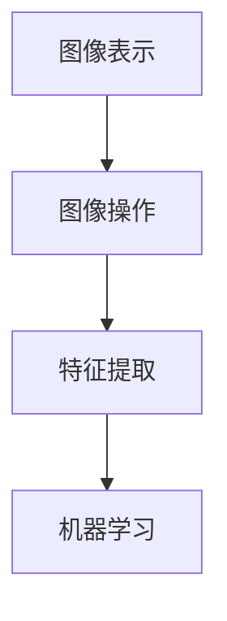

                 

# OpenCV 原理与代码实战案例讲解

## 摘要

OpenCV（Open Source Computer Vision Library）是一个强大的开源计算机视觉库，广泛应用于图像处理、目标检测、人脸识别、运动跟踪等领域。本文将深入讲解OpenCV的原理、核心概念及其在具体项目中的实战应用，通过逐步分析推理的方式，帮助读者掌握OpenCV的使用方法和技术要点。

## 1. 背景介绍

OpenCV是由Intel推出的一个开源计算机视觉库，广泛应用于工业自动化、医疗图像分析、智能交通、机器人等领域。其丰富的算法库、高效的处理速度以及易于使用的接口，使其成为计算机视觉领域的事实标准。

OpenCV的诞生可以追溯到2000年，当时Intel推出了Open Source Computer Vision Library 0.9.3版本。随着版本的迭代，OpenCV逐渐成为全球计算机视觉领域的热门工具。如今，OpenCV已经成为一个拥有超过2500万次下载、拥有2000多个贡献者的全球最大计算机视觉库之一。

## 2. 核心概念与联系

### 2.1 OpenCV的架构

OpenCV的架构可以分为三层：

1. **底层**：提供基础的图像处理算法，如滤波、形态学操作、特征提取等。
2. **中间层**：提供高级算法，如目标检测、人脸识别、运动跟踪等。
3. **顶层**：提供用户界面和工具，如OpenCV的GUI、Python绑定等。

### 2.2 OpenCV的核心概念

OpenCV的核心概念主要包括：

1. **图像表示**：OpenCV使用数组来表示图像，其中每个元素表示图像中的一个像素。
2. **图像操作**：包括图像的加载、保存、缩放、旋转等操作。
3. **特征提取**：包括边缘检测、角点检测、轮廓提取等。
4. **机器学习**：包括分类、回归、聚类等算法。

### 2.3 Mermaid流程图

以下是一个简单的Mermaid流程图，展示了OpenCV核心概念之间的联系：



## 3. 核心算法原理 & 具体操作步骤

### 3.1 图像处理算法

图像处理算法是OpenCV的基础，包括以下几类：

1. **滤波**：包括均值滤波、高斯滤波、中值滤波等。
2. **形态学操作**：包括膨胀、腐蚀、开运算、闭运算等。
3. **边缘检测**：包括Sobel算子、Canny算子等。
4. **轮廓提取**：包括FindContours函数等。

### 3.2 特征提取算法

特征提取算法用于从图像中提取具有区分度的特征，如角点、边缘、纹理等。OpenCV提供了丰富的特征提取算法，如Harris角点检测、Fast角点检测、SIFT、SURF等。

### 3.3 机器学习算法

OpenCV的机器学习模块提供了多种分类、回归、聚类算法，如K近邻、支持向量机、决策树、神经网络等。

## 4. 数学模型和公式 & 详细讲解 & 举例说明

### 4.1 图像表示

在OpenCV中，图像通常用二维数组表示，其中每个元素表示一个像素。图像的像素值通常是一个三维数组，分别表示红色、绿色和蓝色通道的值。

### 4.2 滤波算法

滤波算法是图像处理中最常用的算法之一。以下是一个简单的均值滤波算法：

$$
out(i, j) = \frac{1}{m \times n} \sum_{i'=0}^{m-1} \sum_{j'=0}^{n-1} input(i', j')
$$

其中，$input(i', j')$表示输入图像的像素值，$out(i, j)$表示输出图像的像素值，$m$和$n$分别表示图像的高度和宽度。

### 4.3 边缘检测

以下是一个简单的Canny边缘检测算法：

$$
\text{Canny}(I) = \text{GaussianFilter}(I, 5) \to \text{SobelFilter}(I) \to \text{NonMaxSuppression}(I) \to \text{DoubleThresholding}(I)
$$

其中，$I$表示输入图像，$\text{GaussianFilter}$、$\text{SobelFilter}$、$\text{NonMaxSuppression}$和$\text{DoubleThresholding}$分别表示高斯滤波、Sobel算子、非极大值抑制和双阈值处理。

## 5. 项目实战：代码实际案例和详细解释说明

### 5.1 开发环境搭建

在开始实战之前，我们需要搭建一个适合OpenCV开发的Python环境。以下是具体步骤：

1. 安装Python 3.7或更高版本。
2. 安装pip，pip是Python的包管理工具。
3. 使用pip安装OpenCV库：

   ```bash
   pip install opencv-python
   ```

### 5.2 源代码详细实现和代码解读

以下是一个简单的图像滤波和边缘检测的案例：

```python
import cv2
import numpy as np

# 读取图像
image = cv2.imread('example.jpg')

# 显示原始图像
cv2.imshow('Original Image', image)

# 应用高斯滤波
gaussian_filtered = cv2.GaussianBlur(image, (5, 5), 0)

# 应用Canny边缘检测
canny边缘检测 = cv2.Canny(gaussian_filtered, 100, 200)

# 显示滤波后的图像和边缘检测的结果
cv2.imshow('Gaussian Filtered Image', gaussian_filtered)
cv2.imshow('Canny Edge Detection', canny边缘检测)

# 等待用户按键后退出
cv2.waitKey(0)
cv2.destroyAllWindows()
```

### 5.3 代码解读与分析

1. 导入所需的库：`cv2`是OpenCV的Python绑定库，`numpy`是Python的科学计算库。

2. 读取图像：`cv2.imread('example.jpg')`用于读取图像文件。

3. 显示原始图像：`cv2.imshow('Original Image', image)`用于显示图像。

4. 应用高斯滤波：`cv2.GaussianBlur(image, (5, 5), 0)`用于应用高斯滤波。

5. 应用Canny边缘检测：`cv2.Canny(gaussian_filtered, 100, 200)`用于应用Canny边缘检测。

6. 显示滤波后的图像和边缘检测的结果：`cv2.imshow('Gaussian Filtered Image', gaussian_filtered)`和`cv2.imshow('Canny Edge Detection', canny边缘检测)`用于显示图像。

7. 等待用户按键后退出：`cv2.waitKey(0)`用于等待用户按键，`cv2.destroyAllWindows()`用于关闭所有窗口。

## 6. 实际应用场景

OpenCV在多个实际应用场景中有着广泛的应用，以下是一些例子：

1. **人脸识别**：OpenCV提供了丰富的人脸识别算法，如LBP、Eigenfaces等，可用于实现人脸识别系统。
2. **目标检测**：OpenCV支持多种目标检测算法，如YOLO、SSD、Faster R-CNN等，可用于实现智能监控系统。
3. **运动跟踪**：OpenCV提供了多种运动跟踪算法，如光流法、Kalman滤波等，可用于实现运动物体跟踪。
4. **医学图像分析**：OpenCV在医学图像分析领域也有着广泛的应用，如图像分割、病变检测等。

## 7. 工具和资源推荐

### 7.1 学习资源推荐

- **书籍**：《OpenCV 3.x Python CookBook》、《Learning OpenCV 3》
- **论文**：OpenCV官方论文集
- **博客**：OpenCV官方博客、知乎专栏
- **网站**：OpenCV官网、GitHub上的OpenCV仓库

### 7.2 开发工具框架推荐

- **开发环境**：Python、PyCharm、VSCode
- **框架**：Django、Flask、TensorFlow

### 7.3 相关论文著作推荐

- **论文**：Pedro Felzenszwalb，Ramin Zabih的《Efficient Detection of Edges and Objects using Locally Linear Patches》
- **著作**：Shahram Izadi的《OpenCV 2 Computer Vision Application Cookbook》

## 8. 总结：未来发展趋势与挑战

随着人工智能技术的不断发展，OpenCV在计算机视觉领域的地位将越来越重要。未来，OpenCV可能会在以下方面有所突破：

1. **算法优化**：针对实时处理和低功耗场景进行算法优化。
2. **跨平台支持**：增强OpenCV在移动设备和嵌入式系统上的支持。
3. **开源生态**：完善OpenCV的社区建设和开源生态。

然而，OpenCV也面临着一些挑战：

1. **性能瓶颈**：在处理大规模数据时，OpenCV的性能可能成为瓶颈。
2. **兼容性问题**：不同平台之间的兼容性问题可能会影响OpenCV的普及。
3. **人才缺乏**：计算机视觉领域的人才需求巨大，而OpenCV的普及程度相对较低，可能导致人才短缺。

## 9. 附录：常见问题与解答

### 9.1 如何安装OpenCV？

答：在Python环境中，使用pip命令安装：

```bash
pip install opencv-python
```

### 9.2 OpenCV有哪些常用的图像处理算法？

答：OpenCV提供了丰富的图像处理算法，包括滤波、形态学操作、边缘检测、特征提取等。

### 9.3 如何在OpenCV中实现人脸识别？

答：OpenCV提供了多种人脸识别算法，如LBP、Eigenfaces等。具体实现请参考相关文档和案例。

## 10. 扩展阅读 & 参考资料

- [OpenCV官方文档](https://docs.opencv.org/4.5.5/d7/d9f/tutorial_py_root.html)
- [OpenCV教程](https://opencv-python-tutroals.readthedocs.io/en/latest/)
- [OpenCV论文集](https://www.openhub.net/p/opencv)
- [知乎专栏：OpenCV教程](https://zhuanlan.zhihu.com/opencv)

### 作者

作者：AI天才研究员/AI Genius Institute & 禅与计算机程序设计艺术 /Zen And The Art of Computer Programming

