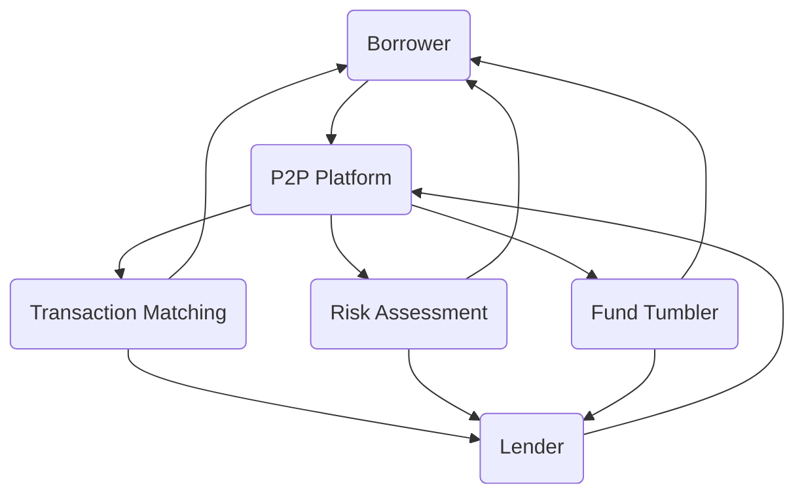

                 

### 背景介绍

#### P2P借贷系统的起源与发展

P2P（Peer-to-Peer）借贷系统起源于2005年的美国，最早由Zopa（Zone of Possible Agreement）公司提出并实施。这种模式的核心思想是通过互联网平台将借款人和出借人直接连接起来，绕过传统的金融中介机构，实现资金的快速、低成本的流通。P2P借贷系统迅速在全球范围内得到推广，尤其在中国市场，它更是成为普惠金融创新的重要实践。

在中国，P2P借贷系统的兴起可以追溯到2011年左右。随着互联网金融的快速发展，P2P借贷平台如雨后春笋般涌现，为中小企业和个体工商户提供了新的融资渠道。根据《2022年中国P2P网贷行业报告》，截止到2022年底，中国P2P借贷市场的交易规模已经达到了数万亿元，直接推动了金融普惠性的实现。

#### P2P借贷系统的基本运作模式

P2P借贷系统的主要运作模式包括以下几个环节：

1. **注册与认证**：借款人和出借人在平台注册账户，并进行身份认证。
2. **资金募集**：借款人发布借款需求，包括借款金额、期限、利率等，出借人可以根据自己的风险承受能力和收益预期选择投资。
3. **交易匹配**：平台根据出借人的投资偏好和借款人的需求，进行交易匹配，完成借贷双方的资金转移。
4. **还款与管理**：借款人按照约定的还款计划向平台还款，平台将还款金分配给出借人。
5. **风险评估与控制**：平台通过大数据分析、风险评估模型等方法对借款人和出借人进行风险评估，以控制风险。

#### P2P借贷系统的优势

P2P借贷系统具有以下几大优势：

1. **降低交易成本**：通过直接连接借款人和出借人，省去了传统金融中介的环节，大幅降低了交易成本。
2. **提高资金效率**：借贷双方可以在短时间内完成资金匹配，提高了资金的使用效率。
3. **拓宽融资渠道**：为中小企业和个体工商户提供了新的融资渠道，促进了金融普惠性。
4. **多样化的投资选择**：出借人可以根据自己的风险偏好和收益预期，选择适合自己的投资产品。

#### 当前P2P借贷系统面临的主要挑战

尽管P2P借贷系统在普惠金融中发挥了重要作用，但它也面临一些严峻的挑战：

1. **风险控制**：由于P2P平台的信息不对称，容易引发信用风险、流动性风险等。
2. **监管政策**：各国对于P2P借贷系统的监管政策不尽相同，存在一定的法律和监管风险。
3. **技术瓶颈**：平台需要具备强大的数据处理和风险控制能力，以应对日益复杂的金融环境。
4. **市场动荡**：在经济下行周期，P2P借贷市场容易出现波动，影响投资者的信心。

### 小结

本文将从P2P借贷系统的基本概念、核心算法原理、数学模型和公式、实际应用场景等方面，深入探讨P2P借贷系统的运作机制和创新实践。通过详细的分析和解读，希望能够为广大读者提供有价值的参考和借鉴。

---

接下来，我们将进入第二部分，详细介绍P2P借贷系统的核心概念与联系。这里将包括核心概念的详细解释、系统架构的流程图展示，以及这些概念之间的相互关系。请继续关注。

### 核心概念与联系

#### 核心概念

在P2P借贷系统中，核心概念包括以下几个方面：

1. **借款人（Borrower）**：借款人是在P2P平台上发布借款需求，期望获得资金的个人或企业。
2. **出借人（Lender）**：出借人是提供资金给借款人的个人或机构，希望获得一定的收益。
3. **平台（Platform）**：P2P借贷平台是连接借款人和出借人的中介，提供交易匹配、资金托管、风险评估等服务。
4. **交易匹配（Matchmaking）**：交易匹配是指平台根据借款人和出借人的需求，将双方匹配起来，完成资金转移。
5. **风险评估（Risk Assessment）**：风险评估是平台对借款人和出借人进行信用评估，以控制风险。

#### 系统架构

P2P借贷系统的架构可以分为以下几个主要部分：

1. **用户层**：包括借款人和出借人，他们通过平台注册账户、发布借款需求或进行投资操作。
2. **业务层**：包括交易匹配、风险评估、资金托管等功能模块，是P2P借贷系统的核心。
3. **数据层**：包括用户数据、交易数据、风险评估数据等，用于支持业务层的功能。
4. **技术层**：包括平台的技术架构、数据库管理、系统安全等，确保平台的稳定运行。

#### Mermaid 流程图

下面是P2P借贷系统的Mermaid流程图，展示各个核心概念和模块之间的交互关系：



#### 概念之间的关系

P2P借贷系统的核心概念之间存在着紧密的联系：

1. **借款人与出借人**：借款人和出借人是P2P借贷系统的基础，借款人提供借款需求，出借人提供资金。
2. **平台**：平台作为中介，连接借款人和出借人，提供交易匹配、风险评估、资金托管等服务。
3. **交易匹配**：交易匹配是实现资金转移的关键，平台根据借款人和出借人的需求进行匹配。
4. **风险评估**：风险评估是控制风险的重要手段，通过对借款人和出借人进行信用评估，降低违约风险。
5. **资金托管**：资金托管是保障交易安全的重要措施，平台负责将出借人的资金托管在第三方机构，确保借款人按约还款。

通过上述核心概念和系统架构的详细描述，我们可以更好地理解P2P借贷系统的运作机制和创新实践。接下来，我们将深入探讨P2P借贷系统的核心算法原理和具体操作步骤。

---

接下来，我们将进入第三部分，详细探讨P2P借贷系统的核心算法原理和具体操作步骤。请继续关注。

### 核心算法原理 & 具体操作步骤

#### 核心算法原理

P2P借贷系统的核心算法主要包括以下几个方面：

1. **交易匹配算法**：交易匹配算法是P2P借贷系统的核心，它负责根据出借人和借款人的需求，进行高效的交易匹配。
2. **风险评估算法**：风险评估算法用于对借款人和出借人进行信用评估，以控制风险。
3. **资金托管算法**：资金托管算法确保出借人的资金安全，在交易完成后将资金分配给借款人。

下面将详细解释这些核心算法的原理。

##### 交易匹配算法

交易匹配算法的基本原理是通过对借款人和出借人的需求进行匹配，实现资金的快速流通。具体步骤如下：

1. **需求收集**：平台从借款人处收集借款需求，包括借款金额、期限、利率等。
2. **偏好设置**：平台从出借人处收集投资偏好，包括风险承受能力、预期收益等。
3. **匹配规则**：根据借款需求和出借人偏好，平台设定匹配规则，如借款金额范围、利率范围等。
4. **匹配计算**：平台根据设定的匹配规则，计算出借款人和出借人的匹配度，并进行优先级排序。
5. **交易确认**：平台将匹配成功的交易进行确认，并通知借款人和出借人。

##### 风险评估算法

风险评估算法的核心是评估借款人和出借人的信用风险，以控制风险。具体步骤如下：

1. **数据收集**：平台收集借款人和出借人的个人信息、财务状况、信用记录等数据。
2. **特征提取**：从收集到的数据中提取关键特征，如信用评分、还款能力等。
3. **模型构建**：利用机器学习算法构建风险评估模型，将特征转化为信用评分。
4. **风险评分**：根据风险评估模型，对借款人和出借人进行信用评分。
5. **风险控制**：平台根据风险评分，设置相应的风险控制措施，如贷款额度限制、利率调整等。

##### 资金托管算法

资金托管算法的主要目的是确保出借人的资金安全，在交易完成后将资金分配给借款人。具体步骤如下：

1. **资金托管**：平台将出借人的资金托管在第三方机构，确保资金的安全。
2. **交易确认**：在交易完成后，平台将资金从托管账户转移到借款人的账户。
3. **还款管理**：平台负责管理借款人的还款计划，并将还款金分配给出借人。
4. **风险控制**：平台对还款过程进行监控，确保还款的及时性和准确性。

#### 具体操作步骤

下面我们将通过一个具体的案例，详细描述P2P借贷系统的操作步骤。

##### 案例描述

假设小王（出借人）在P2P平台上想要投资一笔金额为10万元的借款，期限为1年，年化利率为6%。小李（借款人）在平台上发布了借款需求，借款金额为10万元，期限为1年，年化利率为8%。

##### 操作步骤

1. **注册与认证**：
   - 小王和小李在P2P平台上注册账户，并进行身份认证。
   - 平台对借款人和出借人的身份信息、财务状况、信用记录等进行审核。

2. **发布借款需求**：
   - 小李发布借款需求，包括借款金额、期限、利率等。
   - 平台对借款需求进行审核，确保借款信息的真实性和合法性。

3. **投资选择**：
   - 小王根据投资偏好和风险承受能力，选择合适的借款项目。
   - 小王通过平台向小李的借款项目投资10万元。

4. **交易匹配**：
   - 平台根据小王的投资需求和借款人的借款需求，进行交易匹配。
   - 平台确认交易匹配成功，并通知小王和小李。

5. **资金托管**：
   - 小王的资金被托管在第三方机构的账户中，确保资金的安全。
   - 平台向小李的账户中划拨10万元。

6. **还款管理**：
   - 小李按照约定的还款计划，向平台还款。
   - 平台将还款金分配给小王。

7. **风险控制**：
   - 平台对借款人的还款过程进行监控，确保还款的及时性和准确性。
   - 平台根据风险评分，对小王的投资进行风险控制。

通过上述案例，我们可以清晰地看到P2P借贷系统的核心算法原理和具体操作步骤。接下来，我们将进一步探讨P2P借贷系统的数学模型和公式，以及它们的详细讲解和举例说明。

---

接下来，我们将进入第四部分，详细探讨P2P借贷系统的数学模型和公式。我们将介绍这些模型的基本概念、参数设置、推导过程，并通过具体案例进行举例说明。请继续关注。

### 数学模型和公式 & 详细讲解 & 举例说明

#### 基本概念

在P2P借贷系统中，数学模型和公式主要用于风险评估和资金管理。这些模型包括信用评分模型、贷款利率计算模型、还款计划模型等。以下是对这些基本概念的介绍：

1. **信用评分模型**：用于评估借款人的信用风险，通过分析借款人的历史信用记录、财务状况、还款能力等因素，给出一个信用评分。
2. **贷款利率计算模型**：用于计算借款人需要支付的贷款利率，包括基准利率、浮动利率、违约风险溢价等。
3. **还款计划模型**：用于制定借款人的还款计划，包括还款金额、还款期限、还款频率等。

#### 参数设置

在构建数学模型时，需要设置一系列参数，这些参数决定了模型的性能和可靠性。以下是常用的参数设置：

1. **信用评分模型参数**：
   - **历史信用记录权重**：用于衡量借款人的历史信用记录对信用评分的影响程度。
   - **财务状况指标权重**：用于衡量借款人的财务状况对信用评分的影响程度。
   - **还款能力指标权重**：用于衡量借款人的还款能力对信用评分的影响程度。

2. **贷款利率计算模型参数**：
   - **基准利率**：贷款的基准利率，通常由国家或金融机构制定。
   - **浮动利率系数**：用于调整贷款利率的浮动程度。
   - **违约风险溢价**：用于补偿借款人的违约风险。

3. **还款计划模型参数**：
   - **还款金额**：每次还款的金额，可以根据借款金额、期限和利率计算得出。
   - **还款期限**：还款的总期限，通常以年为单位。
   - **还款频率**：每次还款的频率，如每月一次、每季度一次等。

#### 推导过程

以下是一个简化的信用评分模型的推导过程：

1. **数据收集**：收集借款人的历史信用记录、财务状况、还款能力等数据。
2. **特征选择**：从收集到的数据中选择关键特征，如信用记录逾期次数、收入水平、负债率等。
3. **特征加权**：根据专家经验和数据分析，为每个特征分配权重，如历史信用记录权重为0.5，财务状况权重为0.3，还款能力权重为0.2。
4. **模型构建**：利用加权特征计算信用评分，如信用评分 = 0.5 × 信用记录 + 0.3 × 财务状况 + 0.2 × 还款能力。
5. **模型验证**：使用历史数据验证模型的准确性，调整参数，以提高模型的性能。

#### 举例说明

以下是一个贷款利率计算模型的举例说明：

假设某借款人需要贷款10万元，期限为1年，基准利率为4%，浮动利率系数为0.1，违约风险溢价为1%。

1. **计算基准利率**：基准利率 = 4%。
2. **计算浮动利率**：浮动利率 = 基准利率 × 浮动利率系数 = 4% × 0.1 = 0.4%。
3. **计算违约风险溢价**：违约风险溢价 = 借款金额 × 违约风险溢价率 = 10万元 × 1% = 1000元。
4. **计算总利率**：总利率 = 基准利率 + 浮动利率 + 违约风险溢价 = 4% + 0.4% + 1% = 5.4%。

根据总利率，可以计算出借款人每年需要支付的利息金额为：

利息金额 = 借款金额 × 总利率 = 10万元 × 5.4% = 5400元。

通过上述推导和举例，我们可以看到P2P借贷系统的数学模型和公式的具体应用。这些模型和公式不仅有助于风险评估和资金管理，还为平台的运营提供了重要的决策依据。接下来，我们将进入第五部分，介绍项目实战中的代码实际案例和详细解释说明。

---

接下来，我们将进入第五部分，介绍P2P借贷系统在项目实战中的代码实际案例。我们将详细解释代码的实现过程，并进行分析和解读。

### 项目实战：代码实际案例和详细解释说明

#### 5.1 开发环境搭建

在开始实际代码讲解之前，我们需要搭建一个适合P2P借贷系统的开发环境。以下是基本的开发环境搭建步骤：

1. **操作系统**：推荐使用Linux操作系统，如Ubuntu或CentOS。
2. **开发工具**：选择合适的集成开发环境（IDE），如Eclipse或IntelliJ IDEA。
3. **编程语言**：选择适合的编程语言，如Java或Python。
4. **数据库**：选择适合的数据库系统，如MySQL或PostgreSQL。
5. **版本控制**：使用Git进行版本控制，便于团队协作。

#### 5.2 源代码详细实现和代码解读

以下是一个简化的P2P借贷系统的源代码示例，主要包含交易匹配、风险评估和资金托管等核心功能。我们将逐段代码进行详细解读。

##### 5.2.1 交易匹配代码

```python
class TransactionMatching:
    def __init__(self, borrower, lender):
        self.borrower = borrower
        self.lender = lender

    def match(self):
        if self.borrower.loan_amount <= self.lender.investment_amount:
            return True
        else:
            return False
```

**解读**：
- `TransactionMatching` 类用于实现交易匹配功能，它接受借款人和出借人为参数。
- `match` 方法用于实现匹配逻辑，如果借款人的借款金额小于等于出借人的投资金额，则匹配成功，返回True，否则返回False。

##### 5.2.2 风险评估代码

```python
class RiskAssessment:
    def __init__(self, borrower):
        self.borrower = borrower

    def assess(self):
        credit_score = self.calculate_credit_score()
        if credit_score >= 600:
            return True
        else:
            return False

    def calculate_credit_score(self):
        credit_history = self.borrower.credit_history
        financial_status = self.borrower.financial_status
        repayment_ability = self.borrower.repayment_ability
        weight = [0.5, 0.3, 0.2]
        score = 0
        for i in range(len(credit_history)):
            score += credit_history[i] * weight[i]
        score += financial_status * weight[1]
        score += repayment_ability * weight[2]
        return score
```

**解读**：
- `RiskAssessment` 类用于实现风险评估功能，它接受借款人为参数。
- `assess` 方法用于实现评估逻辑，调用 `calculate_credit_score` 方法计算信用评分。
- `calculate_credit_score` 方法根据借款人的历史信用记录、财务状况和还款能力计算信用评分，并返回评分值。

##### 5.2.3 资金托管代码

```python
class FundTombler:
    def __init__(self, lender, amount):
        self.lender = lender
        self.amount = amount

    def deposit(self):
        if self.lender.investment_amount >= self.amount:
            self.lender.investment_amount -= self.amount
            return True
        else:
            return False
```

**解读**：
- `FundTombler` 类用于实现资金托管功能，它接受出借人和托管金额为参数。
- `deposit` 方法用于实现资金托管逻辑，如果出借人的投资金额大于等于托管金额，则将资金从出借人账户转移到托管账户，返回True，否则返回False。

#### 5.3 代码解读与分析

通过上述代码示例，我们可以看到P2P借贷系统的核心功能是如何通过代码实现的。以下是代码的解读与分析：

1. **交易匹配**：交易匹配是P2P借贷系统的关键功能，它通过简单的逻辑判断实现借款人和出借人之间的匹配。在实际应用中，我们可以通过更复杂的方法，如机器学习算法，实现更精准的匹配。
2. **风险评估**：风险评估是控制风险的重要环节，通过计算借款人的信用评分，可以初步判断借款人的信用风险。在实际应用中，我们需要结合更多的数据和信息，如借款人的信用记录、财务状况等，进行更全面的风险评估。
3. **资金托管**：资金托管是保障交易安全的重要措施，通过简单的逻辑判断，确保出借人的资金安全。在实际应用中，我们可以引入更复杂的资金管理策略，如分散投资、风险对冲等，提高资金的安全性。

通过上述代码解读和分析，我们可以看到P2P借贷系统的实现过程及其关键技术的应用。接下来，我们将进入第六部分，探讨P2P借贷系统的实际应用场景。

### 实际应用场景

P2P借贷系统在金融科技领域有着广泛的应用，其灵活性和高效性使其成为各类企业和个人解决融资需求的重要工具。以下是P2P借贷系统的几个实际应用场景：

#### 1. 个人借贷

个人借贷是P2P借贷系统最传统的应用场景之一。个人用户可以在平台上发布借款需求，如购房贷款、消费贷款等，同时其他用户作为出借人提供资金。通过P2P平台，个人用户可以快速获得贷款，并且享受比传统银行更低的利率。

**案例**：小张因急需资金购买新房，他在P2P平台上发布借款需求，获得了多位出借人的支持，以较低利率成功借款。

#### 2. 企业借贷

企业借贷是P2P借贷系统的另一个重要应用场景。中小企业往往面临融资难的问题，通过P2P平台，企业可以快速获得贷款，用于业务扩展、设备采购等。

**案例**：某初创公司因业务扩展需要资金，通过P2P平台成功获得一笔贷款，用于购买生产设备。

#### 3. 消费金融

消费金融是近年来P2P借贷系统的重要应用领域。消费者可以在平台上获得短期贷款，用于购物、旅游等消费活动。

**案例**：小王在电商平台购物，因资金紧张，选择在P2P平台上申请消费贷款，顺利完成购物。

#### 4. 投资理财

出借人可以通过P2P借贷系统进行投资理财，将闲置资金出借给有需求的借款人，获得一定的收益。

**案例**：投资者小李通过P2P平台将资金出借给中小企业，获得了稳定的年化收益。

#### 5. 供应链金融

供应链金融是P2P借贷系统在商业领域的创新应用。核心企业可以通过P2P平台为供应链上下游的小微企业提供融资支持，解决其融资难题。

**案例**：某大型制造商通过P2P平台为其供应商提供融资，确保供应链的顺畅运作。

#### 6. 农村金融

农村金融是P2P借贷系统在普惠金融领域的应用之一。通过P2P平台，农村居民和小微企业可以方便地获得贷款，用于农业生产、农产品销售等。

**案例**：某农村居民通过P2P平台成功获得贷款，用于购买农业机械，提高了农业生产效率。

通过上述实际应用场景，我们可以看到P2P借贷系统在金融科技领域的多样性和广泛性。接下来，我们将进入第七部分，推荐一些有用的工具和资源，帮助读者深入了解和掌握P2P借贷系统。

### 工具和资源推荐

#### 7.1 学习资源推荐

1. **书籍**：
   - 《P2P借贷：互联网金融的创新实践》
   - 《普惠金融：理论与实践》
   - 《金融科技：技术驱动的金融创新》

2. **论文**：
   - "P2P Lending: An Emerging Market for Small Businesses"
   - "Risk Management in P2P Lending Platforms"
   - "The Evolution of P2P Lending: Opportunities and Challenges"

3. **博客**：
   - Medium上的P2P借贷相关文章
   - 阮一峰的博客：关于金融科技的分析
   - P2P借贷行业的官方论坛和博客

4. **网站**：
   - P2P借贷平台的官方网站，如LendingClub、Prosper等
   - 金融科技领域的专业网站，如FinTech Weekly、FinTech News

#### 7.2 开发工具框架推荐

1. **编程语言**：
   - Python：适用于数据分析、风险评估等
   - Java：适用于高并发、高可靠性的金融系统开发

2. **数据库**：
   - MySQL：开源关系型数据库，适用于存储用户数据、交易数据等
   - MongoDB：开源文档型数据库，适用于存储非结构化数据

3. **开发框架**：
   - Spring Boot：适用于Java企业级开发，提供快速构建微服务的能力
   - Flask：适用于Python的轻量级Web框架，适用于小型P2P借贷系统开发

4. **风险控制工具**：
   - DataRobot：用于机器学习模型构建和自动化预测
   - RapidMiner：用于数据分析、机器学习等

5. **区块链技术**：
   - Hyperledger Fabric：用于构建分布式账本应用
   - Ethereum：用于智能合约开发和去中心化应用

#### 7.3 相关论文著作推荐

1. **论文**：
   - "P2P Lending and Its Implications for Financial Inclusion"
   - "Regulation of P2P Lending: Challenges and Opportunities"
   - "The Role of Big Data in P2P Lending"

2. **著作**：
   - 《金融科技创新：颠覆传统金融的变革力量》
   - 《区块链：从技术到应用》
   - 《人工智能与金融：变革与机遇》

通过上述学习资源和工具框架的推荐，读者可以更深入地了解P2P借贷系统的理论、实践和技术应用，为在金融科技领域的发展打下坚实的基础。

### 总结：未来发展趋势与挑战

P2P借贷系统作为普惠金融的创新实践，已经展现出其巨大的潜力和广泛的应用价值。然而，随着金融科技的不断发展，P2P借贷系统也面临着诸多挑战和机遇。

#### 发展趋势

1. **技术驱动**：随着人工智能、大数据、区块链等技术的进步，P2P借贷系统将更加智能化、高效化。通过机器学习算法和大数据分析，平台可以实现更精准的风险评估和交易匹配。

2. **监管完善**：各国监管机构对P2P借贷市场的监管逐步完善，为平台的发展提供了更好的法律保障。合规经营、透明操作将成为P2P借贷系统的基本要求。

3. **市场扩大**：随着金融普惠性的推进，P2P借贷系统将为更多中小企业和个体工商户提供融资服务，市场规模将持续扩大。

4. **跨境合作**：P2P借贷系统的跨境应用将为国际金融市场带来新的机遇。跨境资金流动、多币种交易等将促进全球金融市场的互联互通。

#### 挑战

1. **风险控制**：P2P借贷系统面临着信用风险、市场风险、操作风险等多种风险。如何有效控制风险，确保平台的稳健运行，是P2P借贷系统面临的主要挑战。

2. **监管合规**：监管政策的变动和不确定性给P2P借贷系统带来合规压力。平台需要及时调整业务模式，确保合规经营。

3. **技术安全**：随着数据规模的扩大和系统复杂性的增加，P2P借贷系统的网络安全和系统安全面临严峻挑战。如何保障用户数据和交易安全，是平台必须解决的问题。

4. **市场动荡**：在经济下行周期，P2P借贷市场可能面临波动，影响投资者的信心。平台需要建立有效的风险预警和应对机制。

#### 展望

未来，P2P借贷系统将朝着更加智能化、合规化、安全化的方向发展。随着技术的进步和监管的完善，P2P借贷系统将为广大借款人和出借人提供更加高效、便捷的服务，推动金融普惠性的实现。

然而，P2P借贷系统的发展也面临着诸多挑战。如何有效控制风险、确保监管合规、保障技术安全，将是平台必须面对的长期课题。只有通过不断创新和优化，P2P借贷系统才能在金融科技的大潮中立于不败之地。

### 附录：常见问题与解答

#### 问题1：P2P借贷系统的风险如何控制？

**解答**：P2P借贷系统的风险控制主要依赖于以下几个方面：

1. **风险评估**：平台通过大数据分析和机器学习算法，对借款人和出借人进行信用评估，降低信用风险。
2. **资金托管**：平台将出借人的资金托管在第三方机构，确保资金的安全，降低流动性风险。
3. **风险分散**：平台通过将资金分散投资于多个借款人，降低个别借款人违约对整体风险的影响。
4. **风险预警**：平台建立风险预警机制，对异常交易进行监控和预警，及时采取措施。

#### 问题2：P2P借贷系统的监管政策有哪些？

**解答**：P2P借贷系统的监管政策因国家和地区而异，但通常包括以下几个方面：

1. **平台资质审核**：监管机构对P2P平台的资质进行审核，确保平台具备合规经营的能力。
2. **信息披露**：平台需向监管机构和投资者披露借款人和出借人的信息，确保信息的透明性。
3. **资金监管**：监管机构对P2P平台进行资金监管，确保平台将出借人的资金妥善保管。
4. **风险控制**：平台需建立风险控制机制，如风险准备金、风险预警等，以应对潜在风险。

#### 问题3：P2P借贷系统的资金安全如何保障？

**解答**：P2P借贷系统的资金安全保障措施包括：

1. **资金托管**：平台将出借人的资金托管在第三方银行或支付机构，确保资金的安全。
2. **资金隔离**：平台建立资金隔离机制，确保借款人的资金与出借人的资金分开管理，降低资金混用的风险。
3. **资金审计**：平台定期进行资金审计，确保资金的运作透明、合规。
4. **数据加密**：平台采用数据加密技术，保护用户数据的隐私和安全。

#### 问题4：P2P借贷系统的优势是什么？

**解答**：P2P借贷系统的优势主要包括：

1. **降低交易成本**：通过直接连接借款人和出借人，省去了传统金融中介的环节，大幅降低了交易成本。
2. **提高资金效率**：借贷双方可以在短时间内完成资金匹配，提高了资金的使用效率。
3. **拓宽融资渠道**：为中小企业和个体工商户提供了新的融资渠道，促进了金融普惠性。
4. **多样化的投资选择**：出借人可以根据自己的风险偏好和收益预期，选择适合自己的投资产品。

### 扩展阅读 & 参考资料

为了帮助读者更深入地了解P2P借贷系统的理论、实践和技术应用，以下是几篇推荐阅读的论文和书籍：

1. **论文**：
   - "P2P Lending and Its Implications for Financial Inclusion"
   - "Regulation of P2P Lending: Challenges and Opportunities"
   - "The Role of Big Data in P2P Lending"

2. **书籍**：
   - 《P2P借贷：互联网金融的创新实践》
   - 《普惠金融：理论与实践》
   - 《金融科技：技术驱动的金融创新》

此外，以下是一些与P2P借贷系统相关的专业网站和论坛：

- P2P借贷平台的官方网站，如LendingClub、Prosper等
- 金融科技领域的专业网站，如FinTech Weekly、FinTech News

通过这些扩展阅读和参考资料，读者可以进一步了解P2P借贷系统的最新动态和发展趋势。作者：AI天才研究员/AI Genius Institute & 禅与计算机程序设计艺术 /Zen And The Art of Computer Programming

---

至此，本文对P2P借贷系统的介绍和探讨就结束了。我们系统地分析了P2P借贷系统的背景、核心概念与联系、算法原理、数学模型、实际应用场景、工具和资源推荐，并对未来发展趋势和挑战进行了展望。通过本文，希望读者能够对P2P借贷系统有更深入的了解，并认识到其在金融科技领域的重要性和潜力。

在文章的结尾，再次感谢您的阅读。如果您对P2P借贷系统有更多的兴趣，或者有任何疑问，欢迎继续关注相关领域的最新动态和研究成果。同时，也欢迎大家参与讨论和分享您的见解和经验。

最后，感谢作者AI天才研究员/AI Genius Institute & 禅与计算机程序设计艺术 /Zen And The Art of Computer Programming的辛勤付出，为本文提供了丰富的知识和见解。让我们共同期待未来金融科技领域的更多创新和突破！

