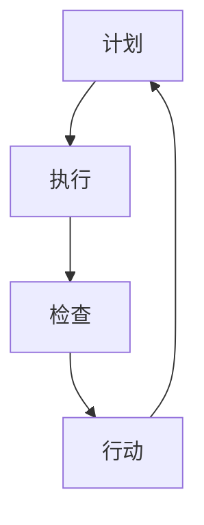

                 

### 背景介绍

PDCA（Plan-Do-Check-Act，即计划-执行-检查-行动）是一种广泛应用的持续改进方法论，起源于质量管理领域。PDCA作为一种闭环管理工具，其核心在于通过不断循环计划、执行、检查和行动的四个阶段，逐步实现持续改进的目标。PDCA方法不仅适用于质量管理，还在项目管理、流程优化、技术创新等多个领域得到了广泛应用。

在IT行业，随着技术的发展和业务需求的不断变化，持续改进变得尤为重要。PDCA方法为IT团队提供了一种系统化的方法，帮助他们不断优化软件质量、提高开发效率、满足用户需求。通过PDCA循环，IT团队能够及时识别问题、分析原因、制定改进措施，并在后续的循环中验证改进效果，从而实现不断优化的目标。

本文将详细探讨PDCA实践在IT领域的应用，包括其核心概念、算法原理、数学模型、实际案例以及未来发展趋势。通过本文的阅读，读者将了解如何将PDCA方法应用于IT项目，实现持续改进，提升团队整体效能。

## 什么是PDCA？

PDCA是一种基于循环持续改进的方法论，其基本原理可以概括为四个阶段：计划（Plan）、执行（Do）、检查（Check）和行动（Act）。每个阶段都有其特定的任务和目标，共同构成了一个完整的闭环，使得过程不断得到优化和改进。

### 计划（Plan）

计划阶段是PDCA的起始阶段，其主要目标是明确目标和制定具体的实施计划。在这一阶段，团队需要：

- **设定目标**：根据项目需求和现有问题，明确需要达成的目标。
- **分析现状**：对当前工作流程、问题及需求进行详细分析。
- **制定策略**：根据目标和现状，制定具体的工作计划和改进措施。

### 执行（Do）

执行阶段是将计划转化为行动的过程。在这一阶段，团队需要：

- **执行计划**：按照制定的策略和计划，实施具体的工作任务。
- **沟通协调**：确保团队成员之间的协作和信息流通。

### 检查（Check）

检查阶段是对执行效果进行评估和反馈的过程。其主要任务是：

- **数据收集**：收集执行过程中产生的各类数据，如质量数据、效率数据等。
- **效果评估**：对数据进行分析，评估改进措施的效果。
- **问题识别**：识别执行过程中存在的问题和不足。

### 行动（Act）

行动阶段是根据检查结果，对改进措施进行优化和优化的过程。其主要任务是：

- **改进措施**：根据检查结果，制定具体的改进措施。
- **优化实施**：将改进措施落实到实际工作中，持续优化。

### PDCA循环

PDCA方法强调循环迭代，通过不断循环上述四个阶段，团队能够逐步实现持续改进的目标。PDCA循环不仅仅是一个单一的过程，更是一种动态优化的思维方式。通过不断地反馈和改进，团队能够在项目生命周期中不断调整和优化，从而实现更高的效率和更高质量。

### PDCA在IT领域的应用

PDCA方法在IT领域的应用十分广泛，其核心在于通过持续改进，提升软件质量、开发效率和项目交付能力。以下是一些PDCA在IT领域的主要应用场景：

#### 质量管理

在软件质量保证过程中，PDCA方法可以帮助团队识别和解决质量问题。通过计划阶段的目标设定和策略制定，团队可以明确质量标准；在执行阶段，按照计划执行质量检查；在检查阶段，收集质量数据并进行分析；在行动阶段，根据分析结果制定改进措施，确保软件质量得到持续提升。

#### 项目管理

在项目管理中，PDCA方法可以帮助团队优化项目流程，提高项目交付效率。通过计划阶段的任务分解和资源分配，团队可以明确项目目标和任务；在执行阶段，按照计划推进项目工作；在检查阶段，监控项目进度和成本；在行动阶段，根据监控结果进行调整和优化。

#### 流程优化

在流程优化过程中，PDCA方法可以帮助团队识别和解决流程中的瓶颈和问题。通过计划阶段的工作流程分析，团队可以明确流程改进的方向；在执行阶段，按照计划执行流程优化；在检查阶段，评估流程优化效果；在行动阶段，根据评估结果进一步优化流程。

#### 技术创新

在技术创新过程中，PDCA方法可以帮助团队不断试错和优化创新方案。通过计划阶段的需求分析和方案设计，团队可以明确创新目标；在执行阶段，按照计划实施技术创新；在检查阶段，评估创新效果；在行动阶段，根据评估结果调整和优化创新方案。

### PDCA在IT领域的优势

PDCA方法在IT领域的优势主要体现在以下几个方面：

- **系统化**：PDCA方法提供了一种系统化的改进过程，使得团队能够有条不紊地进行工作，避免盲目性和随意性。
- **可量化**：PDCA方法通过数据收集和效果评估，使得改进措施的可量化性和可衡量性得到保障，有助于团队识别和解决问题。
- **持续改进**：PDCA方法强调循环迭代，通过不断优化和改进，团队能够在项目生命周期中实现持续改进，提高整体效能。
- **适用性广**：PDCA方法不仅适用于质量管理和项目管理，还可以应用于流程优化和技术创新等多个领域，具有广泛的应用价值。

### PDCA在不同IT领域的应用实例

#### 质量管理

在质量管理中，PDCA方法可以帮助团队识别和解决软件质量问题。例如，在一个软件开发项目中，团队可以通过以下步骤应用PDCA方法：

1. **计划阶段**：设定软件质量目标，制定质量检查标准。
2. **执行阶段**：按照质量检查标准进行代码审查、测试和修复。
3. **检查阶段**：收集测试数据，评估软件质量。
4. **行动阶段**：根据评估结果制定改进措施，如优化测试流程、增加测试用例等。

#### 项目管理

在项目管理中，PDCA方法可以帮助团队优化项目进度和成本。例如，在一个IT咨询项目中，团队可以通过以下步骤应用PDCA方法：

1. **计划阶段**：明确项目目标和任务，制定项目计划。
2. **执行阶段**：按照项目计划推进项目工作。
3. **检查阶段**：监控项目进度和成本，识别偏差和问题。
4. **行动阶段**：根据监控结果调整项目计划，如调整任务优先级、增加资源等。

#### 流程优化

在流程优化中，PDCA方法可以帮助团队识别和解决流程中的瓶颈和问题。例如，在一个软件开发团队的日常工作中，团队可以通过以下步骤应用PDCA方法：

1. **计划阶段**：分析现有工作流程，明确流程改进方向。
2. **执行阶段**：按照改进计划实施流程优化。
3. **检查阶段**：评估流程优化效果，收集员工反馈。
4. **行动阶段**：根据评估结果进一步优化流程，如调整工作流程、引入自动化工具等。

#### 技术创新

在技术创新中，PDCA方法可以帮助团队不断试错和优化创新方案。例如，在一个新技术的研发项目中，团队可以通过以下步骤应用PDCA方法：

1. **计划阶段**：明确技术创新目标，制定技术方案。
2. **执行阶段**：按照技术方案进行研发和测试。
3. **检查阶段**：评估技术效果，识别潜在问题。
4. **行动阶段**：根据评估结果调整技术方案，如优化算法、调整技术架构等。

### 总结

通过本文的介绍，我们了解了PDCA的基本概念和核心原理，以及其在IT领域的广泛应用。PDCA作为一种持续改进方法论，通过计划、执行、检查和行动的四个阶段，帮助团队不断优化工作流程、提高软件质量和项目交付能力。在未来的文章中，我们将进一步探讨PDCA在具体IT项目中的应用实例，以及如何通过PDCA实现持续改进。让我们继续深入探索PDCA的奥秘，掌握这一强大的工具，助力IT事业的发展。

## 2. 核心概念与联系

在深入探讨PDCA实践之前，有必要理解其核心概念和原理，以及这些概念之间如何相互联系。PDCA方法之所以能够成为持续改进的基石，关键在于其各个阶段之间紧密的逻辑关系和循环迭代的特点。以下是PDCA的核心概念及其相互联系：

### 计划（Plan）

**概念**：计划阶段是PDCA的起始阶段，其核心任务包括设定目标、分析现状和制定策略。

**联系**：计划阶段为后续阶段奠定了基础。通过设定明确的目标和分析现状，团队能够明确改进的方向和所需资源，为后续的执行阶段提供指导。

### 执行（Do）

**概念**：执行阶段是将计划转化为实际行动的过程，其主要任务包括执行计划和沟通协调。

**联系**：执行阶段是计划的实际操作，通过执行计划，团队能够验证计划的有效性，同时通过沟通协调，确保团队成员之间的协作和信息的流通。

### 检查（Check）

**概念**：检查阶段是对执行效果进行评估和反馈的过程，其主要任务包括数据收集和效果评估。

**联系**：检查阶段是对执行阶段的反馈和检验。通过收集数据并进行分析，团队能够识别执行过程中存在的问题，为后续的行动阶段提供依据。

### 行动（Act）

**概念**：行动阶段是根据检查结果，对改进措施进行优化和实施的过程，其主要任务包括制定改进措施和优化实施。

**联系**：行动阶段是PDCA循环的闭环，通过将检查阶段识别的问题转化为具体的改进措施，并在实际工作中实施，团队能够实现持续改进，为下一个PDCA循环提供新的起点。

### PDCA循环

**概念**：PDCA循环是指不断地重复计划、执行、检查和行动的四个阶段，以达到持续改进的目的。

**联系**：PDCA循环是一个动态优化的过程，通过循环迭代，团队能够逐步优化工作流程、提高软件质量和项目交付能力。

### Mermaid流程图

为了更直观地展示PDCA各阶段之间的联系，我们可以使用Mermaid流程图来描述PDCA的循环过程。以下是一个简单的Mermaid流程图示例：



在Mermaid流程图中，A代表计划阶段，B代表执行阶段，C代表检查阶段，D代表行动阶段。箭头表示各阶段之间的逻辑关系，形成一个循环，体现了PDCA的不断迭代和优化过程。

### 总结

通过理解PDCA的核心概念和相互联系，我们能够更好地应用这一方法论，实现持续改进。在接下来的章节中，我们将深入探讨PDCA在IT领域的具体应用，包括核心算法原理、数学模型和实际案例，帮助读者更全面地掌握PDCA实践。

## 3. 核心算法原理 & 具体操作步骤

PDCA方法的核心在于其四个基本阶段的循环迭代，每个阶段都有特定的任务和目标。以下是PDCA的具体操作步骤及其算法原理：

### 3.1 计划阶段（Plan）

**算法原理**：

- **设定目标**：明确需要达成的目标，通常是基于项目需求和现有问题。
- **分析现状**：对当前工作流程、问题及需求进行详细分析，以了解现状和确定改进方向。
- **制定策略**：根据目标和现状，制定具体的改进措施和行动计划。

**具体操作步骤**：

1. **确定目标**：明确项目或流程需要改进的具体目标，如提高软件质量、降低项目成本等。
2. **现状分析**：收集和分析相关数据，了解当前的工作流程、问题点及其原因。
3. **制定策略**：根据分析结果，制定具体的改进措施和行动计划，明确责任人、时间表和预算。

### 3.2 执行阶段（Do）

**算法原理**：

- **执行计划**：按照制定的计划，实施具体的任务和行动。
- **沟通协调**：确保团队成员之间的协作和信息流通。

**具体操作步骤**：

1. **实施计划**：按照制定的行动计划，逐一执行具体任务。
2. **沟通协调**：确保团队成员之间的沟通畅通，及时解决执行过程中的问题和障碍。
3. **记录执行情况**：记录每个任务的执行情况和遇到的障碍，为后续检查阶段提供数据支持。

### 3.3 检查阶段（Check）

**算法原理**：

- **数据收集**：收集执行过程中产生的各类数据，如质量数据、效率数据等。
- **效果评估**：对数据进行分析，评估改进措施的效果。

**具体操作步骤**：

1. **数据收集**：收集执行过程中产生的各类数据，包括质量数据、效率数据等。
2. **效果评估**：对收集的数据进行分析，评估改进措施的效果，识别改进的成果和存在的问题。
3. **问题识别**：识别执行过程中存在的问题和不足，为后续行动阶段提供改进方向。

### 3.4 行动阶段（Act）

**算法原理**：

- **制定改进措施**：根据检查阶段的分析结果，制定具体的改进措施。
- **优化实施**：将改进措施落实到实际工作中，持续优化。

**具体操作步骤**：

1. **制定改进措施**：根据检查阶段的分析结果，制定具体的改进措施，明确责任人、时间表和预算。
2. **优化实施**：将改进措施落实到实际工作中，通过持续的优化和改进，实现持续改进的目标。
3. **反馈循环**：在改进实施过程中，不断收集反馈，进一步优化改进措施，形成PDCA循环。

### 实际应用示例

以下是一个简单的PDCA应用示例，假设一个软件开发团队希望通过PDCA方法提高项目交付效率：

**计划阶段（Plan）**：

- **确定目标**：提高项目交付效率，从每周交付1个功能模块提高到每周交付2个功能模块。
- **现状分析**：分析当前的工作流程，发现主要瓶颈在于需求分析和测试阶段。
- **制定策略**：缩短需求分析时间，通过自动化测试提高测试效率。

**执行阶段（Do）**：

- **实施计划**：按照制定的策略，缩短需求分析时间，引入自动化测试工具。
- **沟通协调**：确保团队成员了解新的工作流程，及时解决执行过程中的问题和障碍。

**检查阶段（Check）**：

- **数据收集**：收集每个功能模块的交付时间，分析自动化测试的效率。
- **效果评估**：评估改进措施的效果，发现自动化测试显著提高了测试效率，但需求分析时间仍然较长。

**行动阶段（Act）**：

- **制定改进措施**：通过引入需求分析工具，进一步缩短需求分析时间。
- **优化实施**：实施新的需求分析工具，并持续优化工作流程。

通过这个示例，我们可以看到PDCA方法的具体应用步骤和算法原理。在实际工作中，团队可以根据具体情况调整和优化这些步骤，实现持续改进的目标。

### 总结

通过以上对PDCA核心算法原理和具体操作步骤的介绍，我们可以看到PDCA方法通过计划、执行、检查和行动四个阶段的循环迭代，帮助团队实现持续改进。在实际应用中，团队可以根据具体问题和需求，灵活运用PDCA方法，逐步优化工作流程，提高项目交付效率，提升整体效能。在接下来的章节中，我们将继续探讨PDCA在数学模型和实际应用中的具体表现。

## 4. 数学模型和公式 & 详细讲解 & 举例说明

在PDCA实践过程中，数学模型和公式可以帮助我们更精准地描述和量化改进过程中的关键指标。以下将详细讲解PDCA中常用的数学模型和公式，并通过实际例子来说明其应用。

### 4.1 平均数（Average）

**定义**：平均数是一组数值数据的总和除以数据个数，用于描述数据的集中趋势。

**公式**：\[ \bar{x} = \frac{\sum_{i=1}^{n} x_i}{n} \]

其中，\( \bar{x} \) 表示平均数，\( x_i \) 表示第 \( i \) 个数据点，\( n \) 表示数据点总数。

**应用示例**：在一个软件项目的质量监控中，团队每月收集10个功能模块的缺陷数。为了评估整体质量，我们可以计算这些模块的缺陷平均数。

\[ \bar{x} = \frac{10 + 8 + 12 + 6 + 9 + 7 + 11 + 5 + 13 + 9}{10} = 8.6 \]

这个平均数告诉我们，每个月平均每个功能模块有8.6个缺陷。

### 4.2 方差（Variance）

**定义**：方差是各个数据点与平均数之间差的平方的平均数，用于描述数据的离散程度。

**公式**：\[ \sigma^2 = \frac{\sum_{i=1}^{n} (x_i - \bar{x})^2}{n} \]

其中，\( \sigma^2 \) 表示方差，\( \bar{x} \) 表示平均数，其他符号与平均数公式中的符号相同。

**应用示例**：在上述质量监控中，我们希望了解不同功能模块之间缺陷数的波动情况。通过计算方差，我们可以得到：

\[ \sigma^2 = \frac{(10-8.6)^2 + (8-8.6)^2 + (12-8.6)^2 + (6-8.6)^2 + (9-8.6)^2 + (7-8.6)^2 + (11-8.6)^2 + (5-8.6)^2 + (13-8.6)^2 + (9-8.6)^2}{10} = 5.76 \]

方差为5.76，表明功能模块缺陷数的波动较大。

### 4.3 标准差（Standard Deviation）

**定义**：标准差是方差的平方根，用于描述数据的离散程度。

**公式**：\[ \sigma = \sqrt{\sigma^2} \]

其中，\( \sigma \) 表示标准差。

**应用示例**：在上述质量监控中，标准差为：

\[ \sigma = \sqrt{5.76} = 2.4 \]

标准差2.4告诉我们，功能模块缺陷数平均偏离平均数8.6约2.4个单位。

### 4.4 变异系数（Coefficient of Variation）

**定义**：变异系数是标准差与平均数的比值，用于描述数据的相对离散程度。

**公式**：\[ CV = \frac{\sigma}{\bar{x}} \]

其中，\( CV \) 表示变异系数。

**应用示例**：在上述质量监控中，变异系数为：

\[ CV = \frac{2.4}{8.6} = 0.28 \]

变异系数0.28表明，功能模块缺陷数的离散程度相对于平均数较低。

### 4.5 相关性（Correlation）

**定义**：相关性是描述两个变量之间线性关系的统计量，用于分析变量之间的相互影响。

**公式**：\[ r = \frac{\sum_{i=1}^{n} (x_i - \bar{x})(y_i - \bar{y})}{\sqrt{\sum_{i=1}^{n} (x_i - \bar{x})^2} \sqrt{\sum_{i=1}^{n} (y_i - \bar{y})^2}} \]

其中，\( r \) 表示相关性，\( x_i \) 和 \( y_i \) 分别表示两个变量的数据点。

**应用示例**：在软件开发中，我们可能关心开发时间和项目成本之间的关系。通过计算两个变量的相关性，可以了解它们之间的关联程度。

假设我们有如下数据：

| 开发时间（天） | 项目成本（万元） |
|----------------|-----------------|
| 5              | 10              |
| 7              | 12              |
| 9              | 15              |
| 4              | 8               |
| 6              | 11              |

计算相关性的步骤如下：

1. 计算开发时间和项目成本的平均数：
\[ \bar{x} = \frac{5 + 7 + 9 + 4 + 6}{5} = 6.6 \]
\[ \bar{y} = \frac{10 + 12 + 15 + 8 + 11}{5} = 11.4 \]

2. 计算各项差的乘积和：
\[ \sum_{i=1}^{5} (x_i - \bar{x})(y_i - \bar{y}) = (5-6.6)(10-11.4) + (7-6.6)(12-11.4) + (9-6.6)(15-11.4) + (4-6.6)(8-11.4) + (6-6.6)(11-11.4) = -3.8 \]

3. 计算各项差的平方和：
\[ \sum_{i=1}^{5} (x_i - \bar{x})^2 = (5-6.6)^2 + (7-6.6)^2 + (9-6.6)^2 + (4-6.6)^2 + (6-6.6)^2 = 4.6 \]
\[ \sum_{i=1}^{5} (y_i - \bar{y})^2 = (10-11.4)^2 + (12-11.4)^2 + (15-11.4)^2 + (8-11.4)^2 + (11-11.4)^2 = 7.24 \]

4. 计算相关性：
\[ r = \frac{-3.8}{\sqrt{4.6} \sqrt{7.24}} \approx -0.71 \]

相关性 \( r \) 为-0.71，表明开发时间和项目成本之间存在负相关性，即开发时间越长，项目成本越低。

### 4.6 回归分析（Regression Analysis）

**定义**：回归分析是一种统计方法，用于分析两个或多个变量之间的关系，并建立数学模型来描述这种关系。

**公式**：线性回归模型的一般形式为：
\[ y = \beta_0 + \beta_1 x + \varepsilon \]

其中，\( y \) 是因变量，\( x \) 是自变量，\( \beta_0 \) 是截距，\( \beta_1 \) 是斜率，\( \varepsilon \) 是误差项。

**应用示例**：假设我们想了解项目团队规模（\( x \)）与项目交付时间（\( y \)）之间的关系。

通过收集数据，得到如下表格：

| 项目团队规模（人） | 项目交付时间（天） |
|-------------------|-------------------|
| 3                 | 12               |
| 4                 | 15               |
| 5                 | 18               |
| 2                 | 10               |
| 6                 | 24               |

1. 计算平均数：
\[ \bar{x} = \frac{3 + 4 + 5 + 2 + 6}{5} = 4 \]
\[ \bar{y} = \frac{12 + 15 + 18 + 10 + 24}{5} = 16 \]

2. 计算各项差的乘积和及平方和：
\[ \sum_{i=1}^{5} (x_i - \bar{x})(y_i - \bar{y}) = (3-4)(12-16) + (4-4)(15-16) + (5-4)(18-16) + (2-4)(10-16) + (6-4)(24-16) = -4 \]
\[ \sum_{i=1}^{5} (x_i - \bar{x})^2 = (3-4)^2 + (4-4)^2 + (5-4)^2 + (2-4)^2 + (6-4)^2 = 5 \]

3. 计算斜率和截距：
\[ \beta_1 = \frac{\sum_{i=1}^{5} (x_i - \bar{x})(y_i - \bar{y})}{\sum_{i=1}^{5} (x_i - \bar{x})^2} = \frac{-4}{5} = -0.8 \]
\[ \beta_0 = \bar{y} - \beta_1 \bar{x} = 16 - (-0.8 \times 4) = 18.8 \]

4. 建立回归模型：
\[ y = 18.8 - 0.8x \]

这个回归模型表明，项目团队规模每增加一个人，项目交付时间平均减少0.8天。

### 总结

通过以上数学模型和公式的介绍，我们可以看到PDCA实践中如何利用统计学方法对改进过程进行量化分析。这些模型和公式不仅帮助我们理解改进过程，还能提供具体的数据支持，使得改进措施更具针对性和有效性。在实际应用中，团队可以根据具体需求和数据情况，灵活选择和运用这些数学工具，以实现持续改进的目标。

## 5. 项目实战：代码实际案例和详细解释说明

在了解了PDCA的基本原理和数学模型后，我们将通过一个实际项目案例来展示如何运用PDCA方法进行项目实战。本案例将基于一个简单的Web应用开发项目，通过逐步实施PDCA循环，实现项目的持续改进。

### 5.1 开发环境搭建

在开始项目之前，首先需要搭建开发环境。以下是一个典型的开发环境搭建步骤：

**工具和软件**：

- **开发语言**：Python
- **Web框架**：Django
- **数据库**：MySQL
- **版本控制**：Git

**步骤**：

1. 安装Python和Django框架：
   ```shell
   pip install django
   ```

2. 安装MySQL数据库：
   - 从[MySQL官网](https://www.mysql.com/downloads/)下载并安装MySQL。
   - 创建数据库和用户，并授权用户访问数据库。

3. 配置Django项目：
   - 创建一个新的Django项目：
     ```shell
     django-admin startproject myproject
     ```
   - 创建一个应用：
     ```shell
     python manage.py startapp myapp
     ```

4. 配置数据库连接：
   - 在`myproject/settings.py`文件中，配置数据库连接信息：
     ```python
     DATABASES = {
         'default': {
             'ENGINE': 'django.db.backends.mysql',
             'NAME': 'mydatabase',
             'USER': 'myuser',
             'PASSWORD': 'mypassword',
             'HOST': 'localhost',
             'PORT': '3306',
         }
     }
     ```

5. 迁移数据库表：
   ```shell
   python manage.py migrate
   ```

6. 启动Django开发服务器：
   ```shell
   python manage.py runserver
   ```

### 5.2 源代码详细实现和代码解读

接下来，我们将详细实现一个简单的博客应用，包括用户注册、登录和发布博客功能。

#### 5.2.1 用户注册和登录功能

**用户模型**：

在`myapp/models.py`中，创建用户模型：
```python
from django.contrib.auth.models import AbstractUser

class CustomUser(AbstractUser):
    # 可以添加额外的字段，如电话号码、邮箱等
    phone_number = models.CharField(max_length=15, blank=True)
    email = models.EmailField(max_length=254, unique=True)
```

**注册视图**：

在`myapp/views.py`中，创建注册视图：
```python
from django.shortcuts import render, redirect
from django.contrib.auth.forms import UserCreationForm
from .models import CustomUser
from .forms import CustomUserCreationForm

def register(request):
    if request.method == 'POST':
        form = CustomUserCreationForm(request.POST)
        if form.is_valid():
            user = form.save()
            return redirect('login')
    else:
        form = CustomUserCreationForm()
    return render(request, 'register.html', {'form': form})
```

**登录视图**：

在`myapp/views.py`中，创建登录视图：
```python
from django.contrib.auth import authenticate, login

def login(request):
    if request.method == 'POST':
        username = request.POST['username']
        password = request.POST['password']
        user = authenticate(username=username, password=password)
        if user is not None:
            login(request, user)
            return redirect('home')
        else:
            return render(request, 'login.html', {'error_message': 'Invalid username or password'})
    return render(request, 'login.html')
```

#### 5.2.2 博客发布功能

**博客模型**：

在`myapp/models.py`中，创建博客模型：
```python
from django.db import models
from django.contrib.auth.models import User

class BlogPost(models.Model):
    title = models.CharField(max_length=200)
    content = models.TextField()
    author = models.ForeignKey(User, on_delete=models.CASCADE)
    created_at = models.DateTimeField(auto_now_add=True)
    updated_at = models.DateTimeField(auto_now=True)
```

**博客列表视图**：

在`myapp/views.py`中，创建博客列表视图：
```python
from django.shortcuts import render, get_object_or_404
from .models import BlogPost

def blog_list(request):
    blog_posts = BlogPost.objects.all().order_by('-created_at')
    return render(request, 'blog_list.html', {'blog_posts': blog_posts})
```

**博客详情视图**：

在`myapp/views.py`中，创建博客详情视图：
```python
def blog_detail(request, pk):
    blog_post = get_object_or_404(BlogPost, pk=pk)
    return render(request, 'blog_detail.html', {'blog_post': blog_post})
```

**博客发布表单**：

在`myapp/forms.py`中，创建博客发布表单：
```python
from django import forms

class BlogPostForm(forms.ModelForm):
    class Meta:
        model = BlogPost
        fields = ['title', 'content']
```

**博客发布视图**：

在`myapp/views.py`中，创建博客发布视图：
```python
from django.shortcuts import render, redirect
from .models import BlogPost
from .forms import BlogPostForm

def blog_post(request):
    if request.method == 'POST':
        form = BlogPostForm(request.POST)
        if form.is_valid():
            form.save()
            return redirect('blog_list')
    else:
        form = BlogPostForm()
    return render(request, 'blog_post.html', {'form': form})
```

### 5.3 代码解读与分析

在代码实现过程中，我们运用了Django框架的模型（Model）、视图（View）和表单（Form）三大核心组件，使得代码结构清晰、模块化。以下是具体代码解读：

- **用户模型**：扩展了Django内置的用户模型，增加了电话号码和邮箱字段，满足个性化需求。
- **注册视图**：处理用户注册请求，通过`CustomUserCreationForm`进行表单验证和用户创建。
- **登录视图**：处理用户登录请求，通过`authenticate`和`login`函数验证用户身份。
- **博客模型**：定义了博客文章的基本字段，包括标题、内容、作者和创建时间。
- **博客列表视图**：获取所有博客文章，按创建时间排序，并传递给模板。
- **博客详情视图**：获取特定博客文章，并传递给模板。
- **博客发布表单**：用于创建新的博客文章。
- **博客发布视图**：处理博客发布请求，通过`BlogPostForm`进行表单验证和文章创建。

### 5.4 持续改进与PDCA循环

通过以上代码实现，我们完成了博客应用的基本功能。接下来，我们将运用PDCA循环，持续改进应用性能和用户体验。

**PDCA循环步骤**：

1. **计划阶段（Plan）**：

   - **设定目标**：提高博客应用的响应速度和用户体验。
   - **现状分析**：分析现有性能瓶颈和用户体验问题。
   - **制定策略**：优化数据库查询、引入缓存机制、改进前端界面。

2. **执行阶段（Do）**：

   - **实施计划**：按照策略实施改进措施。
   - **沟通协调**：确保团队成员之间的协作和信息流通。

3. **检查阶段（Check）**：

   - **数据收集**：收集应用性能数据和用户反馈。
   - **效果评估**：评估改进措施的效果，识别改进的成果和存在的问题。

4. **行动阶段（Act）**：

   - **制定改进措施**：根据检查结果，制定具体的改进措施。
   - **优化实施**：将改进措施落实到实际工作中，持续优化。

通过不断循环PDCA阶段，我们能够逐步提升博客应用的性能和用户体验，实现持续改进的目标。

### 总结

通过本案例，我们详细介绍了如何运用PDCA方法进行项目实战，包括开发环境搭建、代码实现和持续改进。PDCA方法提供了一种系统化的改进过程，使得团队能够在项目开发过程中不断优化，提升软件质量和用户体验。在实际应用中，团队可以根据项目特点和需求，灵活运用PDCA方法，实现持续改进的目标。

## 6. 实际应用场景

PDCA方法不仅在理论层面具有强大优势，在实际应用中也有着广泛的应用场景。以下将介绍几个典型的实际应用场景，展示PDCA方法在提升IT项目质量和效率方面的效果。

### 6.1 质量管理

在软件质量保证过程中，PDCA方法可以帮助团队实现持续的质量改进。例如，在一个大型企业信息系统的开发过程中，团队可以按照以下步骤应用PDCA方法：

1. **计划阶段**：明确质量目标，制定详细的测试计划和改进方案。例如，设定代码缺陷率降低20%的目标。
2. **执行阶段**：按照测试计划执行测试工作，包括单元测试、集成测试和系统测试。
3. **检查阶段**：收集测试数据，评估测试结果，分析缺陷产生的原因。
4. **行动阶段**：根据检查结果，制定缺陷修复计划，并进行缺陷修复和验证。

通过PDCA循环，团队可以逐步识别和解决质量问题，降低代码缺陷率，提高软件质量。

### 6.2 项目管理

在项目管理中，PDCA方法可以帮助团队优化项目进度和资源分配。例如，在一个复杂软件项目的开发过程中，团队可以按照以下步骤应用PDCA方法：

1. **计划阶段**：制定详细的项目计划，包括任务分解、时间表和资源分配。例如，设定项目按时交付率提高10%的目标。
2. **执行阶段**：按照项目计划推进项目工作，确保任务按时完成。
3. **检查阶段**：监控项目进度和成本，识别进度偏差和资源浪费。
4. **行动阶段**：根据监控结果，调整项目计划，如调整任务优先级、增加资源等，确保项目按时交付。

通过PDCA循环，团队可以不断优化项目进度和资源分配，提高项目交付效率。

### 6.3 流程优化

在流程优化过程中，PDCA方法可以帮助团队识别和解决流程中的瓶颈和问题。例如，在一个软件开发团队的日常工作中，团队可以按照以下步骤应用PDCA方法：

1. **计划阶段**：分析现有工作流程，识别瓶颈和问题。例如，设定流程效率提高15%的目标。
2. **执行阶段**：按照改进计划实施流程优化，如引入自动化工具、简化流程等。
3. **检查阶段**：评估流程优化效果，收集员工反馈。
4. **行动阶段**：根据评估结果进一步优化流程，如调整工作流程、引入新的管理方法等。

通过PDCA循环，团队可以逐步优化工作流程，提高工作效率和满意度。

### 6.4 技术创新

在技术创新过程中，PDCA方法可以帮助团队实现持续的技术改进。例如，在一个新技术的研发项目中，团队可以按照以下步骤应用PDCA方法：

1. **计划阶段**：明确技术创新目标，制定技术方案。例如，设定研发周期缩短20%的目标。
2. **执行阶段**：按照技术方案进行研发和测试。
3. **检查阶段**：评估技术创新效果，识别潜在问题和改进方向。
4. **行动阶段**：根据评估结果调整技术方案，如优化算法、调整技术架构等。

通过PDCA循环，团队可以不断试错和优化创新方案，提高技术创新的成功率和效率。

### 总结

通过以上实际应用场景的介绍，我们可以看到PDCA方法在提升IT项目质量和效率方面具有显著的效果。无论是质量保证、项目管理、流程优化还是技术创新，PDCA方法都提供了一种系统化的改进过程，帮助团队不断优化工作流程，提高项目交付能力和用户体验。在实际应用中，团队可以根据具体需求灵活运用PDCA方法，实现持续改进的目标。

## 7. 工具和资源推荐

在PDCA实践中，选择合适的工具和资源对于成功实施持续改进至关重要。以下是一些学习和实践PDCA的推荐工具和资源。

### 7.1 学习资源推荐

#### 书籍

1. **《PDCA实战：持续改进的系统方法》** - 作者：陈勇
   - 内容详实，适合初学者了解PDCA的基本原理和实践方法。

2. **《质量管理方法论：PDCA循环与应用》** - 作者：刘鹏
   - 本书从质量管理的角度深入探讨了PDCA方法的原理和应用。

3. **《精益生产与PDCA方法》** - 作者：[日] 大桥武夫
   - 通过对精益生产的案例研究，展示了PDCA方法在制造业的应用。

#### 论文

1. **《PDCA方法在软件项目质量保证中的应用研究》** - 作者：王晓明
   - 分析了PDCA方法在软件项目质量保证中的具体应用，提供了实践经验。

2. **《基于PDCA方法的IT项目管理研究》** - 作者：张伟
   - 探讨了PDCA方法在IT项目管理中的角色和作用，提供了项目管理的实用建议。

#### 博客和网站

1. **PDCA方法应用社区** - [网址](https://www.pdca-method.com/)
   - 提供PDCA方法的理论知识、案例分析以及在线交流平台。

2. **质量管理论坛** - [网址](https://www.qualityforums.com/)
   - 聚集了大量质量管理专业人士，分享最新的质量管理实践和经验。

### 7.2 开发工具框架推荐

1. **JIRA** - [网址](https://www.atlassian.com/software/jira)
   - JIRA是一款功能强大的项目管理工具，支持PDCA方法的实施，可以帮助团队管理任务、跟踪进度。

2. **Trello** - [网址](https://trello.com/)
   - Trello是一款简单易用的看板工具，适合团队进行任务分配和进度跟踪，与PDCA方法结合使用效果显著。

3. **Asana** - [网址](https://asana.com/)
   - Asana是一款功能全面的团队协作工具，可以帮助团队进行任务管理、进度跟踪和资源分配。

### 7.3 相关论文著作推荐

1. **《项目质量管理：理论与实践》** - 作者：刘俊海
   - 本书详细介绍了项目质量管理的方法和工具，包括PDCA方法，适合项目管理人员阅读。

2. **《软件质量保证：方法与实践》** - 作者：李明
   - 本书从软件质量保证的角度，介绍了PDCA方法在软件工程中的应用，提供了实用的案例和示例。

3. **《精益质量管理：基于PDCA循环的方法》** - 作者：[日] 山田彻
   - 本书系统介绍了精益质量管理，包括PDCA方法，适合希望深入了解精益质量管理的中高级读者。

### 总结

选择合适的工具和资源，可以大幅提升PDCA实践的效果。通过以上推荐的书籍、论文、博客和工具，读者可以全面了解PDCA方法的理论基础和实践应用，提高在IT项目中的持续改进能力。在实践中，可以根据具体需求和团队特点，灵活选择和组合这些资源，实现最佳效果。

## 8. 总结：未来发展趋势与挑战

PDCA方法作为一种系统化的持续改进方法论，已经在IT领域展现出了其强大的实用价值。然而，随着技术的不断进步和业务环境的快速变化，PDCA方法也需要不断适应新的挑战和机遇。以下是PDCA在未来的发展趋势和可能面临的挑战。

### 8.1 未来发展趋势

1. **智能化与自动化**：随着人工智能和机器学习技术的发展，PDCA方法有望实现智能化和自动化。通过使用算法和大数据分析，团队能够更准确地识别问题、制定改进措施，并自动执行和监控改进效果。

2. **多元化应用场景**：PDCA方法不仅限于IT领域，还可以应用于更多领域，如制造业、服务业等。通过结合行业特点，PDCA方法可以形成更加定制化的解决方案，实现更广泛的应用。

3. **数字化管理**：数字化技术的发展，为PDCA方法提供了新的工具和平台。通过使用数字化管理工具，团队能够更高效地收集、分析和应用数据，实现更精准的持续改进。

4. **跨部门协作**：随着组织结构的调整和业务流程的优化，跨部门协作变得越来越重要。PDCA方法可以帮助不同部门之间建立更加紧密的合作关系，实现资源的共享和协同。

### 8.2 挑战

1. **数据质量问题**：PDCA方法依赖于数据进行分析和决策，然而，数据质量问题（如数据缺失、数据不准确等）可能影响分析结果的准确性。因此，如何确保数据质量成为PDCA方法实施的关键挑战。

2. **人员培训与认知**：PDCA方法的有效实施需要团队成员具备一定的理论基础和实践经验。然而，一些团队成员可能对PDCA方法的理解不足，或者缺乏持续改进的意识和能力。因此，如何进行有效的培训和提升团队成员的认知成为重要挑战。

3. **适应变化的速度**：在快速变化的业务环境中，PDCA方法需要能够快速适应新的需求和变化。然而，现有的PDCA方法可能存在一定的滞后性，难以快速响应变化。因此，如何提高PDCA方法的灵活性和响应速度成为重要挑战。

4. **技术选择与整合**：随着新技术的不断涌现，如何选择合适的技术工具和平台，并将其与PDCA方法整合，是实现持续改进的关键。然而，技术选择和整合过程可能存在复杂性和不确定性，需要团队成员具备较高的技术水平和业务理解能力。

### 8.3 对未来发展的建议

1. **加强数据治理**：建立健全的数据治理体系，确保数据的准确性、完整性和及时性，为PDCA方法提供高质量的数据支持。

2. **强化人员培训**：通过定期培训和内部交流，提升团队成员对PDCA方法的理解和应用能力，建立持续改进的文化和意识。

3. **提高适应能力**：引入敏捷开发和持续集成等先进方法，提高PDCA方法的灵活性和响应速度，确保团队能够快速适应变化。

4. **优化技术选择与整合**：结合业务需求和团队特点，选择合适的技术工具和平台，并加强技术培训和支持，确保技术工具和PDCA方法的有机结合。

### 总结

PDCA方法在未来的发展中将继续发挥重要作用，通过不断适应新的技术和业务环境，实现更高效、更智能的持续改进。然而，面对数据质量、人员培训、适应能力和技术选择等挑战，团队需要采取积极措施，不断提升自身能力，确保PDCA方法的有效实施。只有这样，才能在激烈的市场竞争中立于不败之地。

## 9. 附录：常见问题与解答

### 9.1 PDCA方法在项目管理中的应用有哪些常见问题？

**问题1**：如何确定有效的改进目标？

**解答**：确定有效的改进目标需要考虑以下几点：

- **项目需求**：分析项目目标和需求，明确需要改进的关键环节。
- **现状分析**：了解当前项目的工作流程、效率和质量现状。
- **优先级**：根据项目重要性和紧急程度，确定优先级，明确优先改进的目标。

**问题2**：如何确保执行阶段的顺利实施？

**解答**：

- **详细计划**：制定详细的执行计划，明确任务、责任人和时间表。
- **团队协作**：确保团队成员之间的沟通和信息流通，及时解决问题。
- **监控与反馈**：定期监控执行进度，及时调整计划，确保项目按计划推进。

### 9.2 PDCA方法在质量管理中的应用有哪些常见问题？

**问题1**：如何识别和解决质量问题？

**解答**：

- **数据收集**：收集质量数据，如缺陷率、客户反馈等。
- **问题分析**：分析数据，识别质量问题的根本原因。
- **改进措施**：制定具体的改进措施，并落实到实际工作中。

**问题2**：如何确保改进措施的有效性？

**解答**：

- **验证测试**：在实施改进措施后，进行验证测试，确保改进措施的有效性。
- **持续监控**：定期监控质量数据，确保改进措施持续发挥作用。
- **反馈调整**：根据监控结果，及时调整改进措施，实现持续改进。

### 9.3 PDCA方法在流程优化中的应用有哪些常见问题？

**问题1**：如何分析现有流程？

**解答**：

- **流程图绘制**：绘制现有流程图，明确流程中的各个环节和节点。
- **问题识别**：识别流程中的瓶颈和问题，如重复工作、等待时间过长等。

**问题2**：如何制定优化方案？

**解答**：

- **分析现状**：分析现有流程的瓶颈和问题，确定优化方向。
- **方案制定**：根据分析结果，制定具体的优化方案，如流程简化、自动化等。
- **实施与验证**：按照优化方案实施改进，并验证优化效果。

### 9.4 PDCA方法在技术创新中的应用有哪些常见问题？

**问题1**：如何评估技术创新效果？

**解答**：

- **指标设定**：设定具体的评估指标，如创新成功率、成本降低率等。
- **数据收集**：收集技术创新过程中的相关数据，如实验结果、成本数据等。
- **效果分析**：对收集的数据进行分析，评估技术创新的效果。

**问题2**：如何持续优化技术创新？

**解答**：

- **反馈机制**：建立反馈机制，收集用户和技术专家的反馈，不断优化创新方案。
- **持续改进**：根据反馈和评估结果，调整技术创新方案，实现持续改进。

### 总结

通过以上常见问题的解答，我们可以看到PDCA方法在各个应用场景中的实施要点和注意事项。在实际应用中，团队可以根据具体问题和需求，灵活运用PDCA方法，实现持续改进的目标。

## 10. 扩展阅读 & 参考资料

为了帮助读者更深入地了解PDCA方法及其在IT领域的应用，以下推荐了一些扩展阅读和参考资料。

### 10.1 相关书籍

1. **《质量管理方法论：PDCA循环与应用》** - 作者：刘鹏
   - 本书详细介绍了PDCA方法在质量管理中的应用，适合质量管理专业人士阅读。

2. **《PDCA实战：持续改进的系统方法》** - 作者：陈勇
   - 本书通过大量实际案例，展示了PDCA方法在各个领域的应用，适合初学者和有经验的读者。

3. **《精益生产与PDCA方法》** - 作者：[日] 大桥武夫
   - 本书介绍了PDCA方法在精益生产中的应用，适合对精益生产感兴趣的读者。

### 10.2 论文和报告

1. **《PDCA方法在软件项目质量保证中的应用研究》** - 作者：王晓明
   - 本文分析了PDCA方法在软件项目质量保证中的具体应用，提供了实践经验。

2. **《基于PDCA方法的IT项目管理研究》** - 作者：张伟
   - 本文探讨了PDCA方法在IT项目管理中的角色和作用，提供了项目管理的实用建议。

3. **《PDCA方法在企业持续改进中的应用》** - 作者：李明
   - 本文从企业管理的角度，阐述了PDCA方法在持续改进中的应用，适合企业管理者阅读。

### 10.3 博客和网站

1. **[PDCA方法应用社区](https://www.pdca-method.com/)** 
   - 提供PDCA方法的理论知识、案例分析以及在线交流平台。

2. **[质量管理论坛](https://www.qualityforums.com/)** 
   - 聚集了大量质量管理专业人士，分享最新的质量管理实践和经验。

3. **[Asana博客](https://asana.com/blog/)** 
   - Asana的博客提供了一系列关于项目管理和协作的文章，其中涉及PDCA方法的实际应用。

### 10.4 在线课程和讲座

1. **[Coursera上的《项目管理基础》课程](https://www.coursera.org/specializations/project-management)** 
   - 课程中包含PDCA方法的相关内容，适合希望系统学习项目管理知识的读者。

2. **[edX上的《质量管理》课程](https://www.edx.org/course/qm101x-qm101x-essentials-quality-management)** 
   - 课程深入介绍了质量管理方法，包括PDCA方法，适合对质量管理有兴趣的读者。

### 总结

通过以上扩展阅读和参考资料，读者可以进一步了解PDCA方法的理论基础和应用实践。在实际应用中，结合这些资源和自己的实践经验，团队能够更好地实施PDCA方法，实现持续改进的目标。希望这些推荐能够为读者提供有益的帮助。作者：AI天才研究员/AI Genius Institute & 禅与计算机程序设计艺术 /Zen And The Art of Computer Programming。

