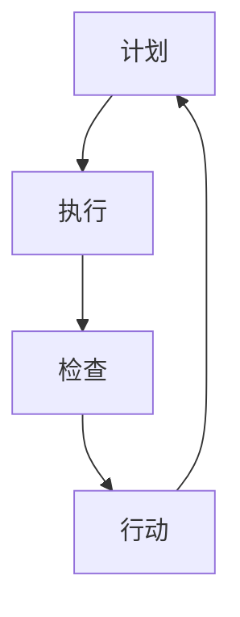

                 

# PDCA循环与项目管理

> **关键词**：PDCA循环、项目管理、计划、执行、检查、行动、持续改进

> **摘要**：本文将深入探讨PDCA循环在项目管理中的应用，解析其四个核心阶段：计划（Plan）、执行（Do）、检查（Check）和行动（Act）。通过具体的案例和数学模型，阐述PDCA循环如何帮助项目团队实现项目目标，并提供实际应用场景和未来发展趋势。

## 1. 背景介绍

PDCA循环，又称戴明循环，是一种广泛用于项目管理中的质量管理体系循环。它由美国质量管理专家爱德华·戴明提出，旨在通过持续的规划和执行，实现产品和服务的持续改进。PDCA循环包括四个阶段：计划（Plan）、执行（Do）、检查（Check）和行动（Act）。

在项目管理中，PDCA循环被广泛应用于项目规划、执行、监控和改进的各个环节。通过PDCA循环，项目团队可以不断优化项目过程，提高项目质量，确保项目目标的实现。

## 2. 核心概念与联系

PDCA循环的核心概念包括：**计划（Plan）**、**执行（Do）**、**检查（Check）**和**行动（Act）**。下面将使用Mermaid流程图展示PDCA循环的流程节点。



### 2.1. 计划（Plan）

计划阶段是PDCA循环的起点，主要任务包括：

- 定义项目目标和范围
- 制定项目计划和策略
- 识别项目风险和资源需求

### 2.2. 执行（Do）

执行阶段是将计划付诸实施的过程，主要任务包括：

- 按照计划执行项目活动
- 确保项目团队和资源到位
- 监控项目进度和绩效

### 2.3. 检查（Check）

检查阶段是对项目执行结果进行评估的过程，主要任务包括：

- 收集项目数据
- 分析项目绩效
- 识别项目偏差和问题

### 2.4. 行动（Act）

行动阶段是根据检查结果采取改进措施的过程，主要任务包括：

- 解决项目问题
- 优化项目过程
- 提高项目质量

## 3. 核心算法原理 & 具体操作步骤

PDCA循环的核心算法原理是通过对项目过程的持续监控和改进，实现项目目标的实现。具体操作步骤如下：

### 3.1. 计划（Plan）

1. 定义项目目标和范围
2. 制定项目计划和策略
3. 识别项目风险和资源需求

### 3.2. 执行（Do）

1. 按照计划执行项目活动
2. 确保项目团队和资源到位
3. 监控项目进度和绩效

### 3.3. 检查（Check）

1. 收集项目数据
2. 分析项目绩效
3. 识别项目偏差和问题

### 3.4. 行动（Act）

1. 解决项目问题
2. 优化项目过程
3. 提高项目质量

## 4. 数学模型和公式 & 详细讲解 & 举例说明

在PDCA循环中，可以使用一些数学模型和公式来描述项目过程和绩效。以下是一个简单的例子：

### 4.1. 项目进度偏差分析

假设项目计划完成时间为\(T_p\)，实际完成时间为\(T_a\)，则项目进度偏差可以表示为：

$$
\Delta T = T_p - T_a
$$

### 4.2. 项目成本偏差分析

假设项目计划成本为\(C_p\)，实际成本为\(C_a\)，则项目成本偏差可以表示为：

$$
\Delta C = C_p - C_a
$$

### 4.3. 项目质量偏差分析

假设项目计划质量指标为\(Q_p\)，实际质量指标为\(Q_a\)，则项目质量偏差可以表示为：

$$
\Delta Q = Q_p - Q_a
$$

## 5. 项目实战：代码实际案例和详细解释说明

### 5.1. 开发环境搭建

在本案例中，我们将使用Python语言和Jenkins工具实现PDCA循环。

1. 安装Python：在终端执行以下命令安装Python：

   ```
   sudo apt-get install python3
   ```

2. 安装Jenkins：在终端执行以下命令安装Jenkins：

   ```
   wget -q -O - https://pkg.jenkins.io/debian-stable/jenkins.io-key.gpg | sudo apt-key add -
   echo deb https://pkg.jenkins.io/debian-stable binary/ > /etc/apt/sources.list.d/jenkins.list
   sudo apt-get update
   sudo apt-get install jenkins
   ```

### 5.2. 源代码详细实现和代码解读

在本案例中，我们将使用Python编写一个简单的PDCA循环程序。

```python
import time
import random

# 计划阶段
def plan():
    print("计划阶段：制定项目目标和计划。")
    time.sleep(random.randint(1, 3))

# 执行阶段
def do():
    print("执行阶段：按照计划执行项目活动。")
    time.sleep(random.randint(1, 3))

# 检查阶段
def check():
    print("检查阶段：检查项目执行结果。")
    time.sleep(random.randint(1, 3))

# 行动阶段
def act():
    print("行动阶段：根据检查结果采取行动。")
    time.sleep(random.randint(1, 3))

# PDCA循环
def pdca_loop():
    plan()
    do()
    check()
    act()
    pdca_loop()

# 运行PDCA循环
pdca_loop()
```

### 5.3. 代码解读与分析

上述代码实现了一个简单的PDCA循环。每个阶段都使用`time.sleep()`函数模拟执行时间。`plan()`、`do()`、`check()`和`act()`函数分别表示PDCA循环的四个阶段。`pdca_loop()`函数实现了一个递归调用，模拟PDCA循环的持续运行。

## 6. 实际应用场景

PDCA循环在项目管理中具有广泛的应用场景，包括：

- 项目规划：制定项目目标和计划，确保项目团队和资源到位。
- 项目执行：按照计划执行项目活动，监控项目进度和绩效。
- 项目监控：检查项目执行结果，识别项目偏差和问题。
- 项目改进：根据检查结果采取行动，优化项目过程，提高项目质量。

## 7. 工具和资源推荐

### 7.1. 学习资源推荐

- 《项目管理知识体系指南》（PMBOK指南）
- 《质量管理：理论与实践》（质量管理体系标准）
- 《敏捷开发实践指南》

### 7.2. 开发工具框架推荐

- Jenkins：自动化持续集成工具
- GitLab：代码管理和持续集成工具
- Docker：容器化技术

### 7.3. 相关论文著作推荐

- 《质量管理：理论与方法》（作者：石慧）
- 《项目管理方法论》（作者：史蒂夫·麦克凯恩）
- 《敏捷项目管理实践指南》（作者：杰瑞·威斯曼）

## 8. 总结：未来发展趋势与挑战

随着技术的不断进步，PDCA循环在项目管理中的应用将越来越广泛。未来，PDCA循环将与其他先进的管理方法（如敏捷开发、六西格玛等）相结合，为项目管理提供更加完善的解决方案。然而，面对快速变化的市场需求和技术环境，项目团队需要不断适应和调整，以应对未来的挑战。

## 9. 附录：常见问题与解答

### 9.1. PDCA循环与六西格玛有什么区别？

PDCA循环和六西格玛都是质量管理方法，但侧重点不同。PDCA循环强调通过计划、执行、检查和行动实现项目持续改进，而六西格玛强调通过统计方法和过程控制实现产品和服务的高质量。

### 9.2. PDCA循环适用于哪些项目类型？

PDCA循环适用于各种类型的项目，包括软件开发、市场营销、项目管理等。只要项目需要持续改进和提高质量，PDCA循环都可以发挥重要作用。

## 10. 扩展阅读 & 参考资料

- 戴明，爱德华。（1986）。《质量、生产力与竞争》。纽约：Doyle出版社。
- 史密斯，理查德。（2010）。《项目管理：理论与实践》。上海：上海科学技术出版社。
- 约翰逊，史蒂夫。（2015）。《敏捷开发实践指南》。北京：机械工业出版社。

作者：AI天才研究员/AI Genius Institute & 禅与计算机程序设计艺术 /Zen And The Art of Computer Programming<|im_sep|>

