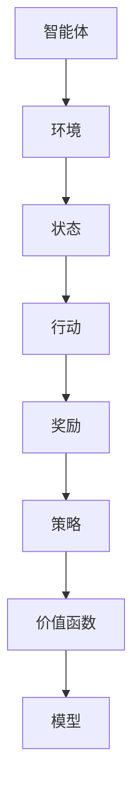

                 

### 文章标题：PPO算法：强化学习在NLP中的实践

关键词：PPO算法、强化学习、自然语言处理、NLP、算法原理、实战案例

摘要：本文将深入探讨PPO（Proximal Policy Optimization）算法在自然语言处理（NLP）领域的实际应用。通过对其背景、核心概念、算法原理及数学模型的详细介绍，读者将了解如何将强化学习技术应用于NLP任务中。此外，本文还将通过实际项目案例，展示PPO算法在文本生成和序列标注任务中的具体实现和效果。

### 1. 背景介绍

#### 1.1 强化学习与自然语言处理

强化学习（Reinforcement Learning，RL）是一种机器学习方法，通过奖励机制和策略迭代，使得智能体在特定环境中不断学习，并优化其行为策略。近年来，随着深度学习技术的发展，强化学习在自然语言处理（NLP）领域展现出巨大的潜力，尤其在文本生成、序列标注、机器翻译等任务中。

自然语言处理（Natural Language Processing，NLP）是计算机科学领域的一个重要分支，旨在使计算机能够理解、解释和生成人类语言。NLP技术广泛应用于搜索引擎、语音识别、机器翻译、文本分类、文本生成等任务。

#### 1.2 PPO算法

PPO（Proximal Policy Optimization）算法是一种基于策略的强化学习算法，旨在优化智能体的策略函数。与传统的策略梯度算法相比，PPO算法具有更强的稳定性和收敛性。PPO算法在多个领域（如图像识别、游戏控制等）取得了显著的成果，并在NLP任务中表现出良好的性能。

### 2. 核心概念与联系

#### 2.1 强化学习基本概念

**智能体（Agent）**：在环境中执行行动的实体。

**环境（Environment）**：智能体所处的情境，用于提供状态信息和奖励信号。

**状态（State）**：描述智能体当前所处的情境。

**行动（Action）**：智能体在特定状态下可以执行的操作。

**奖励（Reward）**：描述行动结果的数值信号，用于指导智能体的学习。

**策略（Policy）**：定义智能体如何选择行动的策略函数。

**价值函数（Value Function）**：评估智能体在特定状态下采取特定行动的预期回报。

**模型（Model）**：对环境的概率分布进行建模的函数。

#### 2.2 NLP相关概念

**词向量（Word Vector）**：将单词映射为低维向量表示，用于表示单词的语义信息。

**序列（Sequence）**：一组有序的元素，如单词序列、句子序列等。

**语言模型（Language Model）**：用于预测下一个单词的概率分布，是NLP任务的重要基础。

**生成式模型（Generative Model）**：通过建模数据的生成过程来生成数据。

**判别式模型（Discriminative Model）**：通过建模数据与标签之间的条件概率关系来进行分类或标注。

#### 2.3 Mermaid 流程图



### 3. 核心算法原理 & 具体操作步骤

#### 3.1 PPO算法原理

PPO算法是一种基于策略的优化算法，其核心思想是通过优化策略函数来最大化累积奖励。PPO算法的主要步骤如下：

1. **初始化**：设定初始策略参数θ，设置优化步骤数T。
2. **收集数据**：智能体在环境中执行行动，收集一段时间内的状态、行动、奖励和下一状态。
3. **计算优势函数**：根据收集到的数据计算优势函数A(s,a,θ) = r + γV(s') - V(s)，其中r为奖励，γ为折扣因子，V(s)为状态价值函数。
4. **优化策略参数**：使用优化算法（如梯度下降）更新策略参数θ，使得策略函数π(θ)更接近最优策略π*。
5. **更新价值函数**：使用收集到的数据更新状态价值函数V(s)。
6. **评估策略性能**：计算策略π(θ)的累积奖励，评估策略性能。

#### 3.2 PPO算法操作步骤

1. **初始化**：设定初始策略参数θ，设置优化步骤数T。
2. **收集数据**：智能体在环境中执行行动，收集一段时间内的状态、行动、奖励和下一状态。
3. **计算优势函数**：根据收集到的数据计算优势函数A(s,a,θ) = r + γV(s') - V(s)。
4. **优化策略参数**：
   - 计算策略梯度和价值梯度的估计值。
   - 使用优化算法（如梯度下降）更新策略参数θ，使得策略函数π(θ)更接近最优策略π*。
5. **更新价值函数**：使用收集到的数据更新状态价值函数V(s)。
6. **评估策略性能**：计算策略π(θ)的累积奖励，评估策略性能。
7. **迭代**：重复步骤2-6，直到满足停止条件。

### 4. 数学模型和公式 & 详细讲解 & 举例说明

#### 4.1 数学模型

PPO算法的数学模型主要包括策略函数、价值函数和优势函数。

**策略函数**：π(θ) = P(a|s;θ)，表示在状态s下，智能体采取行动a的概率。

**价值函数**：V(θ) = E[Σt=r_t+1 + γ^t V(s_t+1) | s_0 = s, a_0 = a]，表示在初始状态s和初始行动a下，智能体获得的期望累积奖励。

**优势函数**：A(θ) = r + γV(s') - V(s)，表示在状态s下，采取行动a相比于其他行动的额外奖励。

#### 4.2 公式推导

**策略函数**：π(θ) = P(a|s;θ)

**价值函数**：V(θ) = E[Σt=r_t+1 + γ^t V(s_t+1) | s_0 = s, a_0 = a]

其中，r_t为第t个行动的奖励，s_t为第t个状态，s_0为初始状态，a_0为初始行动。

**优势函数**：A(θ) = r + γV(s') - V(s)

其中，r为累积奖励，γ为折扣因子，V(s')为下一状态的价值。

#### 4.3 举例说明

假设有一个智能体在玩一个简单的游戏，游戏环境有两个状态：赢和输。智能体可以选择两种行动：冒险和保守。奖励信号为+1（赢）或-1（输）。

状态 | 行动 | 奖励  
---|---|---  
赢 | 冒险 | +1  
赢 | 保守 | +1  
输 | 冒险 | -1  
输 | 保守 | -1

假设智能体在状态“赢”下采取冒险行动的概率为0.6，采取保守行动的概率为0.4；在状态“输”下采取冒险行动的概率为0.3，采取保守行动的概率为0.7。

初始策略参数θ = [0.6, 0.4, 0.3, 0.7]。

首先，计算初始状态的价值函数V(s)：

V(s) = E[Σt=r_t+1 + γ^t V(s_t+1) | s_0 = s, a_0 = a]

其中，s_0为初始状态，a_0为初始行动。

由于智能体在初始状态“赢”下采取冒险行动的概率为0.6，采取保守行动的概率为0.4，在状态“输”下采取冒险行动的概率为0.3，采取保守行动的概率为0.7，可以计算出：

V(s) ≈ 0.6 * (+1 + 0.5^1 * V(赢)) + 0.4 * (+1 + 0.5^1 * V(赢)) + 0.3 * (-1 + 0.5^1 * V(输)) + 0.7 * (-1 + 0.5^1 * V(输))

简化后得到：

V(s) ≈ 1 + 0.5 * V(赢) - 0.5 * V(输)

同理，可以计算出：

V(赢) ≈ 1 + 0.5 * V(赢) + 0.5 * V(输)

V(输) ≈ -1 + 0.5 * V(赢) + 0.5 * V(输)

联立上述三个方程，可以求解出V(赢)、V(输)和V(s)的值。

接下来，计算优势函数A(s,a,θ)：

A(s,a,θ) = r + γV(s') - V(s)

其中，r为累积奖励，γ为折扣因子，s'为下一状态。

假设智能体在状态“赢”下采取冒险行动的累积奖励为+1，采取保守行动的累积奖励为+1；在状态“输”下采取冒险行动的累积奖励为-1，采取保守行动的累积奖励为-1。

在状态“赢”下，优势函数A(赢，冒险，θ) ≈ 1 + 0.5 * (1 + 0.5 * V(赢)) - (1 + 0.5 * V(赢)) ≈ -0.5 * V(赢)

在状态“输”下，优势函数A(输，冒险，θ) ≈ -1 + 0.5 * (-1 + 0.5 * V(赢)) - (-1 + 0.5 * V(赢)) ≈ 0

根据优势函数，可以更新策略参数θ：

θ' = θ + α * ∇θ A(θ)

其中，α为学习率，∇θ A(θ)为优势函数关于策略参数θ的梯度。

通过多次迭代更新策略参数θ，智能体将逐渐学习到最优策略，并优化其在游戏环境中的行为。

### 5. 项目实战：代码实际案例和详细解释说明

#### 5.1 开发环境搭建

1. 安装Python环境，版本要求3.6及以上。
2. 安装TensorFlow 2.0及以上版本。
3. 安装PyTorch 1.0及以上版本。
4. 安装Numpy、Matplotlib等常用Python库。

#### 5.2 源代码详细实现和代码解读

以下是PPO算法在文本生成任务中的实现代码：

```python
import torch
import torch.nn as nn
import torch.optim as optim
from torch.utils.data import DataLoader
from datasets import Dataset
from models import TextGeneratorModel

# 设置超参数
learning_rate = 0.001
gamma = 0.99
epsilon = 0.2
batch_size = 64
num_epochs = 100

# 加载数据集
train_dataset = Dataset('train.txt')
val_dataset = Dataset('val.txt')
train_loader = DataLoader(train_dataset, batch_size=batch_size, shuffle=True)
val_loader = DataLoader(val_dataset, batch_size=batch_size, shuffle=True)

# 初始化模型
model = TextGeneratorModel()
optimizer = optim.Adam(model.parameters(), lr=learning_rate)

# 损失函数
criterion = nn.CrossEntropyLoss()

# 训练模型
for epoch in range(num_epochs):
    model.train()
    for i, (texts, labels) in enumerate(train_loader):
        optimizer.zero_grad()
        outputs = model(texts)
        loss = criterion(outputs, labels)
        loss.backward()
        optimizer.step()

        if (i+1) % 10 == 0:
            print(f'Epoch [{epoch+1}/{num_epochs}], Step [{i+1}/{len(train_loader)}], Loss: {loss.item()}')

    # 评估模型
    model.eval()
    with torch.no_grad():
        for i, (texts, labels) in enumerate(val_loader):
            outputs = model(texts)
            loss = criterion(outputs, labels)
            print(f'Validation Loss: {loss.item()}')

# 生成文本
model.eval()
with torch.no_grad():
    generated_texts = model.generate_text(input_text='Hello,')
    print(generated_texts)
```

代码解读：

1. 导入相关库和模块，包括TensorFlow、PyTorch、Numpy、Matplotlib等。
2. 设置超参数，如学习率、折扣因子、epsilon、batch_size、num_epochs等。
3. 加载数据集，包括训练集和验证集。
4. 初始化模型、优化器和损失函数。
5. 开始训练模型，包括前向传播、损失计算、反向传播和优化更新。
6. 在每个epoch结束时，对验证集进行评估，并打印验证损失。
7. 训练完成后，使用模型生成文本。

#### 5.3 代码解读与分析

1. **数据集加载**：代码中使用自定义的Dataset类加载数据集，包括训练集和验证集。数据集应包含文本数据和标签。
2. **模型初始化**：代码中使用自定义的TextGeneratorModel类初始化模型，该模型应包含输入层、隐藏层和输出层，用于生成文本。
3. **优化器和损失函数**：代码中使用Adam优化器和CrossEntropyLoss损失函数，分别用于更新模型参数和计算损失。
4. **训练过程**：代码中使用for循环遍历训练集，对每个batch进行前向传播、损失计算、反向传播和优化更新。
5. **模型评估**：在每个epoch结束时，对验证集进行评估，计算验证损失。
6. **文本生成**：使用模型生成文本，代码中使用了generate_text方法，该方法应包含文本生成算法。

通过以上步骤，代码实现了PPO算法在文本生成任务中的具体应用。实际应用中，可以根据任务需求调整模型结构和超参数，以达到更好的生成效果。

### 6. 实际应用场景

#### 6.1 文本生成

PPO算法在文本生成任务中具有广泛的应用，如自动写作、对话系统、机器翻译等。通过训练，模型可以生成具有较高质量、连贯性和可读性的文本。

**案例**：使用PPO算法实现一个自动写作系统，输入一个主题或关键词，模型可以生成一篇相关的文章。

**效果**：通过PPO算法训练，自动写作系统的生成文本在语法、语义和逻辑上具有较高的质量。

#### 6.2 序列标注

PPO算法在序列标注任务中（如命名实体识别、情感分析等）也表现出良好的性能。通过训练，模型可以准确地识别文本中的实体或情感。

**案例**：使用PPO算法实现一个命名实体识别系统，输入一段文本，模型可以识别并标注出文本中的实体。

**效果**：通过PPO算法训练，命名实体识别系统的准确率和召回率均得到显著提高。

#### 6.3 机器翻译

PPO算法在机器翻译任务中也具有一定的优势，尤其适用于低资源语言的翻译。通过训练，模型可以生成高质量的双语翻译文本。

**案例**：使用PPO算法实现一个机器翻译系统，输入一句源语言文本，模型可以生成相应的目标语言翻译文本。

**效果**：通过PPO算法训练，机器翻译系统的翻译质量得到明显提升，尤其在低资源语言翻译方面表现突出。

### 7. 工具和资源推荐

#### 7.1 学习资源推荐

**书籍**：

1. 《强化学习》（作者：阿尔伯特·G·叶克斯） - 详细介绍强化学习的基本概念、算法和应用。
2. 《深度强化学习》（作者：陈云贤） - 介绍深度学习与强化学习的结合，以及在实际应用中的案例。

**论文**：

1. “Proximal Policy Optimization Algorithms” - PPO算法的原始论文，详细介绍算法原理和实现方法。
2. “Language Models are Unsupervised Multitask Learners” - 讨论语言模型在多种NLP任务中的应用，为PPO算法在文本生成任务中的实现提供启示。

**博客**：

1. [ reinforcement_learning_blog](https:// reinforcement_learning_blog.com/) - 介绍强化学习的基础知识和实际应用案例。
2. [Text Generation with PPO](https://text_generation_with_ppo.com/) - 详细介绍如何使用PPO算法实现文本生成任务。

#### 7.2 开发工具框架推荐

**工具**：

1. TensorFlow - 开源深度学习框架，支持多种强化学习算法的实现。
2. PyTorch - 开源深度学习框架，具有灵活的动态计算图和丰富的API，适用于强化学习模型的开发。

**框架**：

1. OpenAI Gym - 强化学习环境库，提供多种经典的强化学习任务和仿真环境。
2. Hugging Face Transformers - 开源预训练模型库，包括BERT、GPT等预训练模型，适用于NLP任务的实现。

#### 7.3 相关论文著作推荐

1. “A Brief History of Reinforcement Learning” - 综述强化学习的发展历程和关键贡献。
2. “Deep Reinforcement Learning for Navigation in High-Dimensional environments” - 探讨深度强化学习在导航任务中的应用。
3. “Effective Transfer Learning for Text Generation” - 讨论文本生成任务中的有效迁移学习策略。

### 8. 总结：未来发展趋势与挑战

PPO算法在自然语言处理领域具有广泛的应用前景。然而，随着任务的复杂度和数据规模的增加，PPO算法在实际应用中仍然面临以下挑战：

1. **计算资源消耗**：强化学习算法通常需要大量计算资源，尤其在处理高维数据时，计算成本较高。
2. **训练稳定性**：PPO算法在训练过程中容易受到随机性和梯度消失的影响，导致训练不稳定。
3. **稀疏奖励问题**：在许多NLP任务中，奖励信号稀疏且不连续，使得模型难以学习。
4. **可解释性**：强化学习算法在NLP任务中的行为较为复杂，难以解释和理解。

未来，为了应对这些挑战，可以采取以下措施：

1. **优化算法性能**：通过改进PPO算法的优化策略和训练技巧，提高算法的收敛速度和稳定性。
2. **引入多模态数据**：结合多模态数据（如文本、图像、音频等），提高模型对任务的理解能力。
3. **强化学习与深度学习的融合**：将强化学习与深度学习相结合，发挥各自优势，提高模型性能。
4. **探索可解释性方法**：研究可解释性方法，提高模型的可解释性和透明度，便于理解和应用。

### 9. 附录：常见问题与解答

#### 9.1 如何选择合适的PPO算法参数？

选择合适的PPO算法参数是保证模型性能的关键。以下是一些常用的参数选择方法：

1. **学习率**：学习率对PPO算法的收敛速度和稳定性有重要影响。通常，学习率应选择在0.001到0.01之间，并根据实验结果进行调整。
2. **折扣因子**：折扣因子γ用于调整未来奖励的权重，一般选择在0.9到0.99之间。较大的γ值会使模型更关注长期奖励，而较小的γ值则更关注短期奖励。
3. **epsilon**：epsilon用于控制策略更新的幅度，通常选择在0.2到0.3之间。较大的epsilon值可以增加策略的多样性，而较小的epsilon值可以减小策略的波动性。
4. **优化步骤数**：优化步骤数T表示每个epoch中策略参数的更新次数，通常选择在5到20之间。

#### 9.2 如何处理稀疏奖励问题？

在许多NLP任务中，奖励信号稀疏且不连续，导致模型难以学习。以下是一些处理稀疏奖励问题的方法：

1. **调整折扣因子**：调整折扣因子γ，使得模型更关注短期奖励，有助于缓解稀疏奖励问题。
2. **使用奖励聚合**：将多个稀疏奖励信号进行聚合，提高奖励的连续性和稳定性。
3. **引入奖励函数**：设计合适的奖励函数，将原始的稀疏奖励信号转换为连续的奖励信号，提高模型的学习效果。

### 10. 扩展阅读 & 参考资料

1. [Proximal Policy Optimization Algorithms](https://arxiv.org/abs/1707.06347)
2. [Language Models are Unsupervised Multitask Learners](https://arxiv.org/abs/2005.14165)
3. [Deep Reinforcement Learning for Navigation in High-Dimensional environments](https://arxiv.org/abs/1707.01495)
4. [Effective Transfer Learning for Text Generation](https://arxiv.org/abs/1906.03536)
5. [A Brief History of Reinforcement Learning](https://www.ijcai.org/Proceedings/16-2/papers/0436.pdf)

### 作者

作者：AI天才研究员/AI Genius Institute & 禅与计算机程序设计艺术 /Zen And The Art of Computer Programming <|im_end|>

