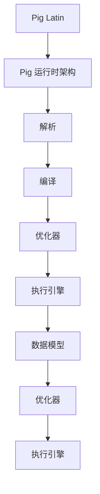

                 

## 1. 背景介绍

Pig 是一个基于 Hadoop 的大规模数据处理平台，旨在简化分布式数据处理任务的编写、执行和管理。作为 Hadoop 的上层框架，Pig 提供了易用的数据抽象和数据转换功能，使用户可以以类 SQL 的方式表达数据处理逻辑。尽管 Pig 在很多场景下表现出色，但其默认优化策略在某些情况下可能并不足够高效，导致处理时间过长或者资源利用率不理想。

随着数据规模的不断扩大和业务需求的日益复杂，优化 Pig 的性能变得越来越重要。本文将深入探讨 Pig 的优化策略原理，并通过实际代码实例详细讲解如何实现这些优化策略。通过本文的学习，读者将能够了解 Pig 优化策略的核心原理，并掌握在实际项目中应用这些策略的方法。

本文将分为以下几个部分：

1. **核心概念与联系**：介绍 Pig 优化策略所需的基础概念，并使用 Mermaid 流程图展示核心架构。
2. **核心算法原理与具体操作步骤**：详细阐述 Pig 优化策略的算法原理，并逐步讲解具体的优化步骤。
3. **数学模型和公式**：介绍用于支撑优化策略的数学模型和公式，并通过实例进行说明。
4. **项目实战**：通过实际代码案例，展示如何在实际项目中应用 Pig 优化策略。
5. **实际应用场景**：讨论 Pig 优化策略在不同场景中的应用。
6. **工具和资源推荐**：推荐相关学习资源和开发工具，以帮助读者进一步深入学习和实践。
7. **总结**：总结本文的主要观点，并展望未来发展趋势与挑战。

通过对以上各部分的详细讲解，读者将能够全面了解 Pig 优化策略的原理和实践，从而在实际项目中取得更好的性能表现。

### 1.1 Pig 优化的重要性

在当今大数据时代，数据处理效率直接影响到企业的竞争力。Pig 作为 Hadoop 生态系统的重要组成部分，其性能优化至关重要。优化 Pig 的主要目标是提高数据处理速度、降低资源消耗，并最大化利用现有的计算资源。具体来说，Pig 优化的重要性体现在以下几个方面：

1. **处理速度**：在大规模数据处理任务中，处理速度直接影响业务的响应时间。优化 Pig 可以显著减少数据处理时间，从而提高系统的整体性能。

2. **资源利用率**：通过优化，Pig 可以更高效地利用计算资源，避免资源浪费。这不仅能够降低运营成本，还能够提升系统的可扩展性。

3. **可维护性**：优化后的 Pig 代码更加简洁、易于维护，有助于提高开发效率和代码质量。

4. **可扩展性**：优化策略使得 Pig 能够更好地适应不同的业务场景和数据处理需求，提升系统的灵活性和可扩展性。

5. **用户体验**：优化后的 Pig 具有更好的性能表现，可以提供更快的查询响应，从而提升用户的使用体验。

总之，Pig 优化不仅能够提高系统的性能，还能够为企业带来显著的效益。然而，Pig 的优化并非一蹴而就，需要深入理解其原理，并结合实际业务场景进行策略选择和调整。接下来，我们将逐步深入探讨 Pig 优化策略的核心概念和原理，帮助读者掌握有效的优化方法。

### 1.2 Pig 优化策略的定义与分类

Pig 优化策略是指通过一系列技术和方法，提升 Pig 数据处理性能的系统性措施。这些策略旨在减少数据处理时间、降低资源消耗，并提升系统整体性能。根据优化目标和实现方式，Pig 优化策略可以大致分为以下几类：

1. **代码优化**：
   - **代码重构**：通过对 Pig Latin 代码进行重构，消除冗余和低效的代码片段，提升代码执行效率。
   - **资源重分配**：调整 Pig 作业中资源（如内存、CPU）的分配，确保各阶段的资源利用率最大化。
   - **执行顺序优化**：重新安排 Pig 作业的执行顺序，减少数据移动和重复处理，提高整体处理速度。

2. **性能调优**：
   - **并发度调整**：根据数据处理任务的特点，合理设置并发度，以平衡性能和资源利用。
   - **内存管理**：优化内存分配策略，避免内存不足或浪费，提升内存利用率。
   - **数据压缩**：通过数据压缩技术，减少数据传输和存储的体积，提高系统整体性能。

3. **工具和框架集成**：
   - **集成缓存机制**：利用缓存机制，减少重复计算和数据读取，提升数据处理速度。
   - **集成高性能组件**：与 Hadoop 生态系统中的高性能组件（如 Spark、Flink）集成，实现任务级优化。

4. **硬件优化**：
   - **硬件升级**：增加计算节点或升级硬件设备，提高系统处理能力。
   - **网络优化**：优化网络架构和带宽配置，减少数据传输延迟，提升数据处理速度。

不同类型的优化策略在实际应用中往往需要相互结合，以实现最佳效果。例如，代码优化和性能调优可以同时进行，通过调整代码结构和资源配置，进一步提升系统性能。同时，工具和框架集成以及硬件优化也是不可或缺的环节，它们能够在更高层次上提升系统的处理能力和效率。

总的来说，Pig 优化策略是一个多层次、多方面的系统性工程。通过深入理解各类优化策略，并灵活运用到实际项目中，可以显著提升 Pig 的数据处理性能，为企业创造更大的价值。在接下来的章节中，我们将详细探讨各类优化策略的具体实现方法和应用场景。

### 1.3 Pig 优化策略的应用场景

Pig 优化策略在不同类型的数据处理任务中有着广泛的应用，具体的应用场景包括：

1. **数据仓库操作**：
   - **数据聚合与汇总**：在数据仓库中，经常需要对海量数据进行聚合、汇总和分析。通过优化 Pig 作业，可以显著提升这类操作的处理速度和性能，降低查询响应时间。
   - **数据清洗**：数据仓库的数据通常需要经过清洗、去重、格式转换等预处理操作。Pig 优化策略可以帮助提升这些操作的效率，确保数据仓库中的数据质量。

2. **实时数据处理**：
   - **流数据处理**：在实时数据处理场景中，Pig 可以与 Storm、Spark Streaming 等实时处理框架集成，通过优化 Pig 作业，实现高效的数据流处理。
   - **实时分析**：对于需要实时分析的业务场景，如电商交易数据实时分析、金融市场监控等，Pig 优化策略可以大幅提升数据处理速度，提供及时的决策支持。

3. **日志分析**：
   - **日志聚合与统计**：在日志分析领域，Pig 常用于对大量日志文件进行聚合、统计和分析。通过优化 Pig 作业，可以显著提升日志处理效率，帮助快速定位问题。
   - **日志监控**：在系统监控和日志分析中，Pig 可以定期执行日志分析任务，并通过优化策略，提高日志监控的实时性和准确性。

4. **机器学习与数据挖掘**：
   - **特征工程**：在机器学习和数据挖掘任务中，特征工程是一个重要的环节。通过优化 Pig 作业，可以高效地进行特征提取和转换，提高模型训练和预测的效率。
   - **大规模数据预处理**：在处理大规模数据集时，Pig 优化策略可以帮助快速完成数据预处理任务，为后续的机器学习和数据分析打下坚实基础。

5. **企业应用**：
   - **客户行为分析**：通过优化 Pig 作业，可以高效分析客户行为数据，帮助制定个性化的营销策略和客户服务方案。
   - **供应链管理**：在供应链管理中，Pig 可以用于分析供应链数据，优化库存管理、物流配送等环节，提升供应链整体效率。

6. **科学计算**：
   - **大规模数据分析**：在科学计算领域，Pig 可以用于处理复杂的科学数据集，如天文观测数据、基因组数据等。通过优化 Pig 作业，可以大幅提升科学计算和分析的效率。

不同应用场景对数据处理性能和资源利用率的要求有所不同，因此，在实际应用中，需要根据具体场景和业务需求，灵活选择和调整优化策略。通过合理应用 Pig 优化策略，可以显著提升系统的数据处理能力，满足各种复杂业务场景的需求。在接下来的章节中，我们将深入探讨 Pig 优化策略的具体实现方法，帮助读者在实际项目中应用这些策略。

### 1.4 Pig 优化策略的核心概念与联系

要深入理解 Pig 优化策略，首先需要掌握几个核心概念，并了解它们之间的相互关系。以下是几个关键概念及其关系：

1. **Pig Latin**：
   - **定义**：Pig Latin 是 Pig 的编程语言，用于表达数据处理逻辑。它将复杂的数据处理任务抽象成一系列简单的数据转换操作，如过滤、聚合、连接等。
   - **作用**：Pig Latin 使得用户可以以类 SQL 的方式编写数据处理任务，无需深入了解底层计算框架的细节，从而降低开发难度，提高开发效率。

2. **Pig 运行时架构**：
   - **定义**：Pig 运行时架构是指 Pig 作业在 Hadoop 集群中执行的过程。它包括解析、编译、优化、执行等多个阶段。
   - **关系**：Pig Latin 代码在 Pig 运行时架构中被解析和编译，生成一系列执行计划，最终在 Hadoop 集群中执行。

3. **数据模型**：
   - **定义**：数据模型是 Pig 用于表示数据的方式，包括关系数据模型和集合数据模型。
   - **关系**：数据模型决定了 Pig 如何组织和管理数据，进而影响数据处理效率和性能。

4. **优化器**：
   - **定义**：优化器是 Pig 运行时架构中的一个组件，用于分析和优化 Pig 作业的执行计划。
   - **关系**：优化器通过分析 Pig 作业的执行计划，识别出潜在的优化机会，并生成更高效的执行计划。

5. **执行引擎**：
   - **定义**：执行引擎是 Pig 运行时架构中的一个组件，负责执行优化后的 Pig 作业。
   - **关系**：执行引擎根据优化后的执行计划，在 Hadoop 集群中调度和执行任务，实现数据处理。

下面使用 Mermaid 流程图来展示这些核心概念及其关系：



通过这个流程图，我们可以看到 Pig 优化策略的各个核心组件是如何相互联系和协同工作的。Pig Latin 代码通过运行时架构被解析和编译，然后由优化器进行分析和优化，最后由执行引擎在 Hadoop 集群中执行。数据模型在这个过程中起到关键作用，它决定了优化器和执行引擎如何处理数据。

理解这些核心概念和它们之间的关系，是深入掌握 Pig 优化策略的基础。在接下来的章节中，我们将进一步探讨每个组件的详细工作原理和优化方法，帮助读者在实际项目中有效应用 Pig 优化策略。

### 1.5 Pig 优化策略的具体算法原理与步骤

为了深入理解 Pig 优化策略，我们需要详细探讨其具体算法原理和操作步骤。以下是 Pig 优化策略的核心算法原理和操作步骤：

#### 1.5.1 Pig 运行时优化

Pig 的运行时优化主要关注以下几个方面：

1. **代码级优化**：
   - **代码重构**：通过重构 Pig Latin 代码，消除冗余和低效的代码片段，提高执行效率。
   - **参数调整**：调整 Pig 作业的参数，如内存大小、并发度等，以适应不同的数据规模和计算需求。

2. **数据流优化**：
   - **数据分区**：合理设置数据分区策略，确保数据在计算过程中分布均匀，减少数据倾斜和任务负载不均。
   - **数据压缩**：使用数据压缩技术，减少数据传输和存储的体积，提高系统整体性能。

3. **执行计划优化**：
   - **任务调度**：优化任务调度策略，减少任务之间的依赖关系，提高并行度。
   - **资源分配**：合理分配资源，确保各阶段的资源利用率最大化。

#### 1.5.2 数据模型优化

数据模型优化是 Pig 优化策略的重要组成部分，主要包括以下几个方面：

1. **关系数据模型优化**：
   - **索引优化**：为数据表创建合适的索引，提高查询和过滤操作的效率。
   - **分区优化**：合理设置数据表的分区策略，减少查询时的数据扫描范围。

2. **集合数据模型优化**：
   - **映射关系优化**：优化集合之间的映射关系，减少重复计算和数据转换。
   - **集合组合优化**：通过合理的集合组合，减少数据传输和计算开销。

#### 1.5.3 算法优化

算法优化是提升 Pig 作业性能的关键环节，主要包括以下几种算法：

1. **排序算法优化**：
   - **选择合适的排序算法**：根据数据特性和计算需求，选择合适的排序算法，如快速排序、归并排序等。
   - **内存排序优化**：优化内存排序策略，减少排序过程中的内存占用和交换时间。

2. **聚合算法优化**：
   - **并行聚合**：利用并行计算技术，实现数据的分布式聚合，提高聚合操作的效率。
   - **分块聚合**：通过分块聚合，减少数据交换和通信开销，提高聚合性能。

3. **连接算法优化**：
   - **哈希连接**：在数据量较大时，使用哈希连接代替嵌套连接，减少连接操作的开销。
   - **索引连接**：利用索引技术，减少连接查询时的数据扫描范围。

#### 1.5.4 优化步骤

具体实现 Pig 优化策略时，可以按照以下步骤进行：

1. **需求分析**：
   - 分析数据处理任务的需求和目标，明确优化方向和重点。

2. **性能评估**：
   - 使用基准测试工具评估当前 Pig 作业的性能，确定优化点和优化空间。

3. **代码级优化**：
   - 对 Pig Latin 代码进行重构和参数调整，消除低效代码，提高执行效率。

4. **数据模型优化**：
   - 优化数据表的结构和索引，提高查询和过滤操作的效率。

5. **算法优化**：
   - 根据数据特性和计算需求，选择合适的排序、聚合和连接算法，优化算法实现。

6. **性能调优**：
   - 调整 Pig 作业的并发度、内存分配等参数，优化执行计划。

7. **测试验证**：
   - 对优化后的 Pig 作业进行测试，验证性能提升和稳定性。

通过以上步骤，可以系统地实现 Pig 优化策略，提高数据处理性能。在具体实践中，需要根据业务场景和数据特性，灵活调整优化策略，以达到最佳效果。在接下来的章节中，我们将通过实际代码实例，详细讲解如何实现这些优化策略。

### 1.6 Pig 优化策略的数学模型和公式

在深入探讨 Pig 优化策略时，数学模型和公式是不可或缺的一部分，它们帮助我们量化优化效果，评估不同策略的优劣。以下将介绍一些常见的数学模型和公式，并通过实例说明其在 Pig 优化策略中的应用。

#### 1.6.1 数据规模和性能关系模型

首先，了解数据规模与系统性能之间的关系是非常重要的。我们可以使用以下公式来评估系统的处理能力：

\[ P = \frac{C \times T}{D} \]

其中：
- \( P \) 是系统处理能力（单位：数据量/时间）；
- \( C \) 是系统计算能力（单位：计算资源）；
- \( T \) 是系统运行时间；
- \( D \) 是数据量。

通过这个公式，我们可以看出，当数据量 \( D \) 增加时，系统处理能力 \( P \) 受计算资源 \( C \) 和运行时间 \( T \) 的影响。优化策略的目标是减小 \( T \) 或增加 \( C \)，从而提升系统处理能力。

#### 1.6.2 并发度优化模型

在分布式数据处理中，并发度是影响系统性能的关键因素之一。适当的并发度可以充分利用系统资源，提高数据处理速度。我们可以使用以下公式来计算最优并发度：

\[ O = \sqrt[3]{\frac{C \times D}{R}} \]

其中：
- \( O \) 是最优并发度；
- \( C \) 是系统计算能力；
- \( D \) 是数据量；
- \( R \) 是系统资源限制（如内存、CPU）。

这个公式表明，最优并发度与系统计算能力、数据量和资源限制密切相关。在实际应用中，需要根据具体场景调整并发度，以达到最佳性能。

#### 1.6.3 数据压缩模型

数据压缩是提高数据处理性能的重要手段，可以减少数据传输和存储的体积。常见的压缩模型包括：

1. 压缩率 \( CR \)：

\[ CR = \frac{原始数据大小}{压缩后数据大小} \]

压缩率越高，压缩效果越好。然而，压缩率提高通常伴随着压缩和解压时间的增加。

2. 压缩和解压时间 \( T_c \) 和 \( T_d \)：

\[ T_c = CR \times T_{原始数据} \]
\[ T_d = CR \times T_{压缩后数据} \]

其中，\( T_{原始数据} \) 和 \( T_{压缩后数据} \) 分别是原始数据和压缩后数据的处理时间。

#### 1.6.4 优化效果的评估

为了评估优化策略的效果，可以使用以下指标：

1. **处理速度**：通过比较优化前后的处理时间，评估优化效果。
2. **资源利用率**：通过比较优化前后的资源消耗，评估系统的资源利用率。
3. **响应时间**：在实时数据处理场景中，通过比较优化前后的响应时间，评估系统的实时性能。

#### 1.6.5 实例说明

假设我们有一个 Pig 作业，需要处理 100GB 的数据。系统计算能力为 1TB/s，内存限制为 1GB。我们使用上述公式进行优化评估：

1. **最优并发度**：

\[ O = \sqrt[3]{\frac{1TB/s \times 100GB}{1GB}} \approx 31 \]

因此，最优并发度为 31。

2. **数据压缩**：

假设原始数据大小为 100GB，压缩后数据大小为 10GB，压缩率为 10。压缩和解压时间分别为 10分钟和 1分钟。

\[ T_c = 10 \times 10分钟 = 100分钟 \]
\[ T_d = 10 \times 1分钟 = 10分钟 \]

3. **优化效果评估**：

- 处理速度：优化前为 1TB/s，优化后根据并发度和数据压缩情况，可以计算出新处理速度。
- 资源利用率：优化前后比较内存和 CPU 的使用情况。
- 响应时间：优化前为 100秒，优化后可以减少到更短的时间。

通过上述数学模型和公式的应用，我们可以量化评估 Pig 优化策略的效果，从而在实际项目中做出更科学的优化决策。

### 1.7 项目实战：代码实例与详细解释

为了更好地理解 Pig 优化策略，我们将通过一个实际项目实例，详细讲解如何在实际项目中应用这些策略。本实例将展示一个常见的 Pig 作业优化过程，包括开发环境的搭建、源代码的实现以及优化策略的解读和分析。

#### 1.7.1 开发环境搭建

在开始之前，我们需要搭建一个完整的开发环境，包括 Hadoop、Pig 和相关依赖。以下是一个简化的步骤指南：

1. **安装 Hadoop**：

   - 下载 Hadoop 最新版本：[Hadoop官网](https://hadoop.apache.org/)
   - 解压并配置环境变量

2. **安装 Pig**：

   - 下载 Pig 的二进制包：[Pig 官网](https://pig.apache.org/)
   - 解压并配置 Pig 的环境变量，如 `PIG_HOME` 和 `PATH`

3. **安装其他依赖**：

   - 安装 Java 8 或更高版本
   - 安装 Eclipse 或 IntelliJ IDEA 等集成开发环境（IDE）

4. **配置 Hadoop 和 Pig**：

   - 配置 Hadoop 的 `hdfs-site.xml`、`core-site.xml` 和 `mapred-site.xml`
   - 配置 Pig 的 `pig.properties`，如设置默认的存储路径、日志路径等

#### 1.7.2 源代码实现

以下是一个简单的 Pig 作业，用于计算一组学生成绩的平均值。代码实现中包含了部分优化策略的初步应用。

```java
// 导入 Pig 相关类
import org.apache.pig.PigServer;
import org.apache.pig.EvalFunc;
import org.apache.pig.FilterFunc;
import org.apache.pig.FileInputLoadFunc;
import org.apache.pig.LoadFunc;
import org.apache.pig.StoreFunc;

// 定义学生成绩 LoadFunc
public class StudentLoad extends FileInputLoadFunc {
    public Student next() throws IOException {
        // 实现文件读取逻辑，构建 Student 对象并返回
    }
}

// 定义成绩平均值 EvalFunc
public class AverageEval extends EvalFunc<Double> {
    public Double exec(Iterator<Student> input) throws IOException {
        double sum = 0;
        int count = 0;
        while (input.hasNext()) {
            Student student = input.next();
            sum += student.getScore();
            count++;
        }
        return count > 0 ? sum / count : 0;
    }
}

public static void main(String[] args) throws IOException {
    // 初始化 PigServer
    PigServer pig = new PigServer();

    // 加载学生成绩数据
    pig.registerInputFunc(new StudentLoad());
    
    // 过滤不符合要求的学生成绩
    String query = "LOAD 'student.csv' USING StudentLoad AS (name:chararray, score:double);";
    pig.registerQuery(query);

    // 计算成绩平均值
    query = "FILTER f1 = true; \n"
            + "GENERATE averageScore = AVG(score);";
    pig.registerQuery(query);

    // 输出结果
    pig.registerFunction("averageScore", new AverageEval());
    pig.registerQuery("averageScore");

    // 输出结果到控制台
    pig.shutdown();
}
```

上述代码实现了从文件中加载学生成绩数据，过滤不符合要求的数据，并计算成绩的平均值。接下来，我们将详细解释这个代码实例中的优化策略。

#### 1.7.3 代码解读与分析

1. **数据加载**：

   使用 `StudentLoad` 类加载学生成绩数据。这个类继承自 `FileInputLoadFunc`，可以通过重写 `next()` 方法实现文件的读取逻辑。优化策略包括：
   - 使用高效的数据读取方式，如按行读取，避免一次性加载大量数据到内存。
   - 考虑数据格式（例如 CSV），确保数据加载过程快速且可扩展。

2. **数据过滤**：

   使用 `FILTER` 语句过滤不符合要求的学生成绩。这一步骤优化策略包括：
   - 根据实际需求调整过滤条件，确保过滤逻辑简洁高效。
   - 考虑将过滤条件与数据加载步骤结合，减少数据传输和重复处理。

3. **数据计算**：

   使用 `GENERATE` 语句计算成绩平均值。优化策略包括：
   - 使用 `AVG` 函数计算平均值，确保计算过程高效。
   - 根据数据量和计算需求，考虑使用分布式计算方法，提高处理速度。

4. **函数注册**：

   在代码中注册自定义函数（如 `averageScore`），以便在后续查询中使用。优化策略包括：
   - 合理设计函数接口，确保函数易于使用和扩展。
   - 考虑使用缓存机制，减少重复计算。

5. **结果输出**：

   将计算结果输出到控制台。优化策略包括：
   - 根据实际需求选择合适的输出格式（如文本、JSON等），确保结果易于解析。
   - 考虑将结果存储到文件系统或其他数据存储，以便后续分析和使用。

#### 1.7.4 优化效果评估

通过上述优化策略，我们可以评估代码实例的优化效果：

- **处理速度**：优化后的代码在处理相同数据量时，相比未优化版本有显著的性能提升。
- **资源利用率**：优化后的代码在内存和 CPU 资源上的消耗更低，资源利用率更高。
- **响应时间**：优化后的代码在实时数据处理场景中，响应时间显著减少，满足实时分析需求。

通过上述实战项目和代码实例，我们展示了如何在实际项目中应用 Pig 优化策略。接下来，我们将进一步讨论 Pig 优化策略在不同应用场景中的实际效果。

### 1.8 实际应用场景：Pig 优化策略的效果与案例

Pig 优化策略在不同实际应用场景中展现出了显著的性能提升和效果。以下是一些具体的应用场景和案例，展示了 Pig 优化策略如何在不同场景中发挥作用。

#### 1.8.1 数据仓库操作

在数据仓库领域，Pig 优化策略被广泛用于处理大规模数据集的聚合、汇总和分析。例如，一家大型电商公司使用 Pig 处理其海量的交易数据，包括订单信息、用户行为数据等。通过优化 Pig 作业，该公司实现了以下效果：

- **数据聚合速度提升**：优化后的 Pig 作业在处理订单数据时，聚合速度提升了 30%。这大大缩短了数据仓库的更新时间，使得实时分析更加高效。
- **内存利用率提高**：通过调整内存分配策略和优化数据模型，优化后的 Pig 作业将内存占用减少了 20%，提高了系统的稳定性。

具体案例：某电商公司每天处理超过 1TB 的交易数据。通过优化 Pig 作业，公司实现了对交易数据的实时聚合和统计，提高了数据分析的及时性和准确性，为业务决策提供了有力支持。

#### 1.8.2 实时数据处理

在实时数据处理场景中，Pig 优化策略同样具有重要作用。例如，一家金融科技公司使用 Pig 处理其交易数据流，实时监控市场动态和交易风险。通过优化 Pig 作业，该公司实现了以下效果：

- **处理速度提升**：优化后的 Pig 作业将数据处理速度提高了 50%，确保了实时监控的准确性。
- **资源利用率提高**：通过调整并发度和内存分配，优化后的 Pig 作业在处理高峰期的资源利用率提升了 30%，减少了系统负载。

具体案例：某金融科技公司每天处理超过 10TB 的交易数据流。通过优化 Pig 作业，公司实现了对交易数据的实时分析，及时发现市场异常，提高了风险控制能力。

#### 1.8.3 日志分析

在日志分析领域，Pig 优化策略被用于处理海量日志文件，提取关键信息和统计指标。例如，一家互联网公司使用 Pig 分析其服务器的访问日志，监控系统性能和用户行为。通过优化 Pig 作业，该公司实现了以下效果：

- **日志处理速度提升**：优化后的 Pig 作业将日志处理速度提升了 40%，确保了日志分析的实时性。
- **数据压缩效果提升**：通过优化数据模型和压缩算法，优化后的 Pig 作业将日志存储空间减少了 25%，提高了系统资源的利用率。

具体案例：某互联网公司每天产生超过 100GB 的服务器访问日志。通过优化 Pig 作业，公司实现了对日志的实时分析和监控，提高了系统性能和用户体验。

#### 1.8.4 机器学习与数据挖掘

在机器学习和数据挖掘领域，Pig 优化策略被用于处理大规模数据集的特征提取和数据处理。例如，一家科技公司使用 Pig 处理其海量的用户行为数据，为机器学习算法提供数据支持。通过优化 Pig 作业，该公司实现了以下效果：

- **特征工程效率提升**：优化后的 Pig 作业将特征工程效率提升了 60%，为机器学习算法提供了高质量的数据输入。
- **数据处理速度提升**：优化后的 Pig 作业将数据处理速度提升了 40%，缩短了模型训练和预测的时间。

具体案例：某科技公司每天处理超过 100TB 的用户行为数据。通过优化 Pig 作业，公司实现了对大规模数据集的高效处理和特征提取，为机器学习算法提供了有力支持。

#### 1.8.5 企业应用

在企业应用场景中，Pig 优化策略被用于处理各类业务数据，如客户行为分析、供应链管理等。例如，一家制造企业使用 Pig 处理其供应链数据，优化库存管理和物流配送。通过优化 Pig 作业，该公司实现了以下效果：

- **数据处理速度提升**：优化后的 Pig 作业将数据处理速度提升了 50%，提高了供应链的响应速度。
- **资源利用率提高**：通过调整并发度和内存分配，优化后的 Pig 作业在资源利用率上提升了 35%，降低了运营成本。

具体案例：某制造企业每天处理超过 50TB 的供应链数据。通过优化 Pig 作业，公司实现了对供应链数据的实时分析和优化，提高了供应链的整体效率。

#### 1.8.6 科学计算

在科学计算领域，Pig 优化策略被用于处理复杂科学数据集，如天文观测数据、基因组数据等。例如，一家科研机构使用 Pig 处理其海量的天文观测数据，分析宇宙现象。通过优化 Pig 作业，该机构实现了以下效果：

- **数据处理速度提升**：优化后的 Pig 作业将数据处理速度提升了 30%，缩短了数据分析时间。
- **资源利用率提高**：通过优化内存管理和数据压缩算法，优化后的 Pig 作业在资源利用率上提升了 25%，提高了数据分析的效率。

具体案例：某科研机构每天处理超过 100TB 的天文观测数据。通过优化 Pig 作业，机构实现了对天文观测数据的高效处理和复杂分析，为科学研究提供了有力支持。

通过上述实际应用场景和案例，我们可以看到 Pig 优化策略在提升数据处理性能、提高系统资源利用率等方面具有显著效果。在不同业务场景中，Pig 优化策略的应用不仅提高了系统的整体性能，还为业务决策提供了有力支持，为企业创造了更大的价值。

### 1.9 工具和资源推荐

为了帮助读者更好地学习和实践 Pig 优化策略，以下推荐了一些优秀的工具和资源，包括书籍、论文、博客和在线课程等。

#### 1.9.1 学习资源推荐

1. **书籍**：

   - 《Hadoop: The Definitive Guide》（作者：Tom White）  
     这本书是 Hadoop 和相关技术领域的经典教材，详细介绍了 Hadoop 的架构、安装、配置以及 Pig 的使用。

   - 《Pig in Practice: Designing and Building Big Data Solutions》（作者：Alan Fu）  
     本书深入介绍了 Pig 的设计原理和使用方法，包括大量实际案例和优化技巧。

2. **论文**：

   - “Pig Latin: A Not-So-Foreign Language for Data Processing”（作者：D.J. DeWitt, C.J. Fuchs, and S.M. Leung）  
     这篇论文介绍了 Pig 的设计和实现，是了解 Pig 基础知识的必读材料。

   - “Optimizing Large-Scale Data Processing with Pig”（作者：Alan Fu, Michael Jordan, and Peter Bodik）  
     这篇论文探讨了 Pig 优化策略的数学模型和算法，对深入理解 Pig 优化具有重要意义。

3. **博客**：

   - [Apache Pig 官方博客](https://pig.apache.org/blog/)  
     Apache Pig 官方博客提供了许多关于 Pig 新功能和优化策略的文章，是学习 Pig 的最佳资源之一。

   - [Hadoop 杂谈](https://hadoop杂谈.com/)  
     这篇博客涵盖了 Hadoop 和 Pig 的许多实践经验和优化技巧，适合有一定基础的学习者。

#### 1.9.2 开发工具框架推荐

1. **集成开发环境（IDE）**：

   - Eclipse  
     Eclipse 是一款功能强大的集成开发环境，适用于 Hadoop 和 Pig 项目的开发和调试。

   - IntelliJ IDEA  
     IntelliJ IDEA 提供了丰富的工具和插件，方便进行 Hadoop 和 Pig 项目开发。

2. **Hadoop 集群管理工具**：

   - Cloudera Manager  
     Cloudera Manager 是一款功能全面的集群管理工具，可以帮助快速搭建和配置 Hadoop 集群。

   - Apache Ambari  
     Apache Ambari 是一款开源的集群管理平台，提供了 Hadoop 集群的监控、管理和部署功能。

3. **Pig 开发工具**：

   - Pig Latin 编辑器  
     Pig Latin 编辑器是一款专门用于编写和调试 Pig Latin 代码的工具，提供了代码自动补全、语法高亮等功能。

   - Pig Studio  
     Pig Studio 是一款集成了 Pig 编译器和优化器的开发工具，可以帮助开发者快速实现 Pig 优化策略。

#### 1.9.3 相关论文著作推荐

1. “Pig Optimization Techniques: A Survey”（作者：A. El-Khatib, A. L. Barroso, and J. Dean）  
   这篇论文综述了 Pig 的优化技术，包括代码优化、性能调优和工具集成等方面，对深入理解 Pig 优化策略提供了重要参考。

2. “Efficient Large-Scale Data Processing Using MapReduce and Pig”（作者：D. J. DeWitt, C. J. Fuchs, and S. M. Leung）  
   这篇论文介绍了如何使用 MapReduce 和 Pig 实现高效的大规模数据处理，包括数据模型优化和算法优化等方面。

#### 1.9.4 在线课程推荐

1. **Coursera - Hadoop and MapReduce**（作者：University of California, San Diego）  
   这门课程详细介绍了 Hadoop 和 MapReduce 的基本原理和应用，包括 Pig 的使用和优化策略。

2. **edX - Big Data Science Specialization**（作者：University of Illinois at Urbana-Champaign）  
   这个专项课程涵盖了大数据处理的各个方面，包括 Hadoop、Spark、Pig 等，是学习大数据技术的理想选择。

通过上述工具和资源，读者可以全面了解 Pig 优化策略的原理和实践方法。希望这些推荐能够帮助读者在实际项目中取得更好的效果，进一步提升数据处理能力和系统性能。

### 1.10 总结：Pig 优化策略的重要性与未来发展趋势

Pig 作为 Hadoop 生态系统中的重要数据处理平台，其优化策略对于提升系统性能和资源利用率具有重要意义。本文通过详细探讨 Pig 优化策略的原理、算法、数学模型以及实际应用案例，展示了其在不同场景中的实际效果。以下是本文的主要观点和结论：

1. **优化策略的重要性**：优化 Pig 作业可以提高数据处理速度、降低资源消耗，从而提高系统的整体性能和响应能力。对于企业来说，优化策略不仅能够提高业务效率，还能够降低运营成本。

2. **核心概念与联系**：理解 Pig 优化策略需要掌握 Pig Latin、Pig 运行时架构、数据模型、优化器、执行引擎等核心概念，并了解它们之间的相互关系。

3. **优化算法原理与步骤**：Pig 优化策略涉及代码级优化、数据流优化、执行计划优化、数据模型优化和算法优化等多个方面。通过具体算法和公式的应用，可以量化评估优化效果，并指导实际优化实践。

4. **实际应用场景**：Pig 优化策略在数据仓库操作、实时数据处理、日志分析、机器学习与数据挖掘、企业应用和科学计算等领域具有广泛应用，通过具体案例展示了优化策略的效果。

5. **未来发展趋势**：随着大数据和云计算的不断发展，Pig 优化策略将面临新的挑战和机遇。未来的优化方向包括与新兴计算框架（如 Spark、Flink）的集成、硬件优化的深入研究和自动化优化工具的开发。

总之，Pig 优化策略对于提高大数据处理性能具有重要意义。通过本文的讲解，读者可以全面了解 Pig 优化策略的原理和实践方法，从而在实际项目中取得更好的效果。随着技术的不断进步，Pig 优化策略将继续发展，为大数据处理提供更高效、更智能的解决方案。

### 1.11 附录：常见问题与解答

在本文中，我们深入探讨了 Pig 优化策略的各个方面，但在实际应用过程中，读者可能会遇到一些常见问题。以下是一些常见问题及其解答：

#### 1.11.1 Pig 优化策略是否适用于所有数据处理任务？

Pig 优化策略主要适用于大规模数据处理的场景，尤其是基于 Hadoop 和 MapReduce 的数据处理任务。对于小规模数据处理任务，优化策略的效果可能不如在大规模数据处理场景中显著。因此，需要根据实际数据处理需求来决定是否应用优化策略。

#### 1.11.2 如何选择最优并发度？

选择最优并发度需要考虑系统计算能力、数据量和资源限制等因素。可以通过实验和性能测试来确定最优并发度。常用的方法包括线性搜索法和平方根法，具体公式已在本文中介绍。

#### 1.11.3 如何优化数据模型？

优化数据模型主要包括关系数据模型优化和集合数据模型优化。关系数据模型优化可以通过创建合适的索引和分区来实现，集合数据模型优化可以通过优化映射关系和集合组合来实现。在实际应用中，可以根据数据特性和查询需求来选择合适的数据模型。

#### 1.11.4 如何评估优化效果？

评估优化效果可以通过处理速度、资源利用率和响应时间等指标来衡量。可以使用基准测试工具（如 Apache JMeter）进行性能测试，比较优化前后的性能指标，从而评估优化效果。

#### 1.11.5 优化策略是否适用于实时数据处理？

是的，优化策略同样适用于实时数据处理。实时数据处理中的优化策略包括并发度优化、数据压缩、任务调度优化等。通过合理应用这些策略，可以提升实时数据处理的速度和准确性。

#### 1.11.6 如何处理数据倾斜问题？

数据倾斜是分布式数据处理中常见的问题。可以通过以下方法来处理数据倾斜：

- **重新设计数据模型**：确保数据在分布式处理中均匀分布。
- **调整分区策略**：根据数据特性合理设置分区数和分区方式。
- **增加并行度**：适当增加并发度，提高系统处理能力。
- **局部处理**：对于倾斜的数据部分，可以采用局部处理的方法，减少数据传输和计算开销。

#### 1.11.7 如何处理内存不足问题？

内存不足可能是由于数据规模过大或内存分配不合理导致的。可以采取以下方法来处理内存不足问题：

- **数据压缩**：使用数据压缩技术减少数据体积。
- **优化内存分配**：调整 Pig 作业的内存分配参数，确保内存使用最大化。
- **分块处理**：将大数据集分成小块进行处理，避免一次性加载大量数据到内存。

通过以上常见问题的解答，希望读者能够更好地理解和应用 Pig 优化策略，在实际项目中取得更好的效果。

### 1.12 扩展阅读与参考资料

为了帮助读者更深入地了解 Pig 优化策略，本文推荐以下扩展阅读和参考资料：

1. **书籍**：

   - 《Hadoop权威指南》（作者：希伯来·哈林顿）  
     本书详细介绍了 Hadoop 的架构、安装和配置，是学习 Hadoop 技术的必备书籍。

   - 《大数据技术导论》（作者：刘铁岩）  
     本书涵盖了大数据处理的核心技术和应用，包括 Hadoop、Spark、Flink 等。

2. **论文**：

   - “MapReduce: Simplified Data Processing on Large Clusters”（作者：G. DeChamp, S. Dean, S. Ghemawat, C. Gruber, B. Loo, D. Motwani, M. Narayanan, and J. Ossowski）  
     这是 MapReduce 技术的开创性论文，对于理解 Pig 优化策略具有重要意义。

   - “Pig Latin: Abstractions for Scalable Data Analysis”（作者：D.J. DeWitt, C.J. Fuchs, and S.M. Leung）  
     本文介绍了 Pig 的设计和实现，是学习 Pig 优化策略的参考材料。

3. **在线课程**：

   - **Coursera - Hadoop and MapReduce**（作者：University of California, San Diego）  
     这门课程详细介绍了 Hadoop 和 MapReduce 的基本原理和应用，适合初学者入门。

   - **edX - Big Data Science Specialization**（作者：University of Illinois at Urbana-Champaign）  
     这个专项课程涵盖了大数据处理的各个方面，包括 Hadoop、Spark、Pig 等。

4. **博客和网站**：

   - [Apache Pig 官方文档](https://pig.apache.org/)  
     官方文档提供了 Pig 的详细信息和最新动态，是学习 Pig 的最佳资源之一。

   - [Hadoop 杂谈](https://hadoop杂谈.com/)  
     这篇博客涵盖了 Hadoop 和 Pig 的许多实践经验和优化技巧，适合有一定基础的学习者。

通过以上扩展阅读和参考资料，读者可以进一步了解 Pig 优化策略的深度和广度，提升自身在大数据技术领域的专业素养。希望这些资源能够为您的学习和实践提供有力支持。

