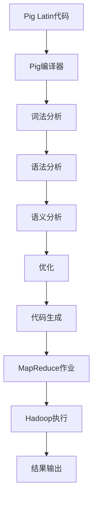
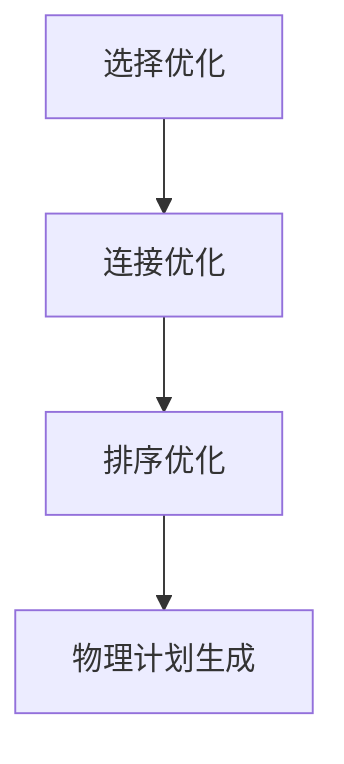
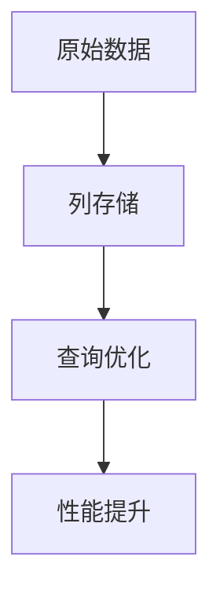
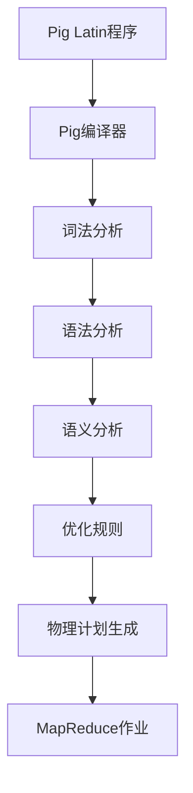

                 

### 文章标题

**Pig原理与代码实例讲解**

### 关键词

Pig、数据处理、大数据、Hadoop、MapReduce、编程实践

### 摘要

本文将深入探讨Pig这种大数据处理框架的原理和实现，通过详细的代码实例，帮助读者理解Pig的核心概念、功能和应用。我们将从Pig的基本概念入手，逐步讲解其数据模型、查询优化和执行过程，并通过实际代码实现，让读者掌握Pig在数据处理中的具体应用。此外，本文还将介绍Pig在实际项目中的运用场景，以及推荐相关学习和开发资源，为读者提供全面的Pig知识体系。

## 1. 背景介绍

随着互联网和移动互联网的快速发展，数据量呈指数级增长，大数据技术应运而生。大数据技术旨在解决海量数据的存储、处理和分析问题。在众多大数据处理技术中，Hadoop是一个重要的框架，其核心组件包括MapReduce、HDFS、YARN等。然而，尽管MapReduce提供了强大的数据处理能力，但其编程模型复杂，对于非专业程序员来说，编写高效的MapReduce程序具有一定的挑战性。

为了简化大数据处理编程，Apache Pig应运而生。Pig是一种高级数据流编程语言，建立在Hadoop之上，提供了一种更易用、更高效的编程模型。Pig通过其丰富的数据操作和转换功能，使得程序员可以更专注于业务逻辑的实现，而无需深入关注底层实现的细节。Pig还提供了强大的查询优化和执行引擎，能够自动优化查询计划，提高数据处理效率。

Pig的诞生和发展，极大地促进了大数据技术的普及和应用，成为大数据开发人员的重要工具之一。本文将围绕Pig的原理、实现和应用，帮助读者深入了解这一强大且实用的数据处理框架。

## 2. 核心概念与联系

### 2.1 Pig的数据模型

Pig的核心概念之一是其数据模型。Pig使用一种称为“关系”（relation）的数据结构来表示数据。关系在Pig中类似于数据库中的表，它由行（row）和列（column）组成。每个行代表一个数据记录，每个列代表数据的某个属性。Pig中的关系可以存储在文件中，也可以存在于数据库中。

在Pig中，关系可以通过不同的文件格式存储，如文本文件、序列化文件、Parquet文件等。其中，文本文件是最常见的格式，每个字段通过空格、制表符或逗号等分隔符进行分隔。序列化文件则能够更高效地存储和检索数据，适合大规模数据处理场景。

### 2.2 Pig与Hadoop的关系

Pig与Hadoop紧密相连，可以说是Hadoop生态系统中的一部分。Hadoop提供了存储（HDFS）和计算（MapReduce、YARN）的能力，而Pig则提供了数据处理的高级编程接口。

Pig通过Pig Latin语言与Hadoop进行交互。Pig Latin是一种数据流语言，它使用类似SQL的语法，提供了丰富的数据操作和转换功能。程序员可以使用Pig Latin编写数据处理任务，然后将其转换为MapReduce作业，由Hadoop执行。

### 2.3 Pig Latin语言

Pig Latin是Pig的核心，它提供了一种简化的编程模型，使得程序员可以更容易地处理大数据。Pig Latin支持多种数据类型，包括基本数据类型（如整数、浮点数、字符串等）和复杂数据类型（如数组、映射、结构等）。Pig Latin还支持丰富的数据操作，如过滤、聚合、连接等。

Pig Latin的语法类似于SQL，使得熟悉SQL的程序员可以快速上手。例如，以下是一个简单的Pig Latin查询，用于从学生数据中筛选出成绩高于90分的学生：

```pig
students = load 'student_data.txt' as (name:chararray, age:integer, score:float);
high_scorers = filter students by score > 90;
dump high_scorers;
```

### 2.4 Pig与MapReduce的关联

Pig的一个重要特性是能够将Pig Latin程序转换为高效的MapReduce作业。这个过程称为“编译”。Pig编译器分析Pig Latin程序，将其分解为多个MapReduce任务，然后提交给Hadoop执行。

Pig的编译过程涉及多个阶段，包括词法分析、语法分析、语义分析、优化和代码生成等。通过编译，Pig能够将复杂的Pig Latin程序转换为高效的MapReduce作业，使得数据处理更加高效。

### 2.5 Mermaid流程图

为了更好地理解Pig的架构和执行过程，我们可以使用Mermaid绘制一个流程图。以下是一个简化的Pig执行流程图：



这个流程图展示了Pig Latin代码从编写到执行的全过程，包括编译和执行两个阶段。

## 3. 核心算法原理 & 具体操作步骤

### 3.1 Pig的基本操作

Pig提供了多种基本操作，用于数据加载、存储、过滤、聚合等。这些基本操作构成了Pig编程的基础。以下是Pig中一些常见的基本操作：

#### 3.1.1 加载（load）

加载操作用于将数据从文件中读取到Pig中。以下是一个示例：

```pig
students = load 'student_data.txt' as (name:chararray, age:integer, score:float);
```

在这个示例中，`load`操作从文本文件`student_data.txt`中加载数据，每条记录包含三个字段：`name`、`age`和`score`。

#### 3.1.2 存储（store）

存储操作用于将Pig中的数据写入到文件中。以下是一个示例：

```pig
store students into 'output_students.txt' using TextStorage;
```

在这个示例中，`store`操作将`students`关系中的数据存储到文本文件`output_students.txt`中。

#### 3.1.3 过滤（filter）

过滤操作用于根据条件选择数据。以下是一个示例：

```pig
high_scorers = filter students by score > 90;
```

在这个示例中，`filter`操作根据条件`score > 90`选择出成绩高于90分的学生。

#### 3.1.4 聚合（group）

聚合操作用于对数据进行分组和聚合。以下是一个示例：

```pig
grouped_students = group students by age;
```

在这个示例中，`group`操作根据`age`字段对`students`关系进行分组。

#### 3.1.5 投影（project）

投影操作用于选择数据中的特定字段。以下是一个示例：

```pig
selected_students = project students [(name, age)];
```

在这个示例中，`project`操作选择`students`关系中的`name`和`age`两个字段。

### 3.2 Pig的查询优化

Pig的查询优化是提高数据处理效率的关键。Pig的查询优化主要包括以下几个方面：

#### 3.2.1 规则优化

Pig使用一组规则来优化查询计划。这些规则包括选择优化、连接优化、排序优化等。例如，Pig可以自动选择最有效的连接顺序，或者优化排序操作。

#### 3.2.2 列存储

Pig支持列存储，这可以大大提高查询性能。通过将相关字段存储在相同的列中，Pig可以更快地进行数据检索。

#### 3.2.3 物理计划生成

Pig在编译过程中会生成物理计划，这个计划决定了数据的实际处理方式。Pig的物理计划生成算法会根据数据分布、硬件资源等因素进行优化。

### 3.3 Pig的执行过程

Pig的执行过程可以分为几个阶段：

#### 3.3.1 编译阶段

编译阶段包括词法分析、语法分析、语义分析和代码生成。Pig编译器分析Pig Latin程序，将其转换为高效的MapReduce作业。

#### 3.3.2 执行阶段

执行阶段包括Map阶段、Reduce阶段和结果输出。Pig编译器生成的MapReduce作业由Hadoop执行。Map阶段处理数据输入，Reduce阶段进行数据聚合和输出。

#### 3.3.3 优化阶段

在执行过程中，Pig会根据实际运行情况对查询计划进行优化。例如，Pig可以根据数据分布动态调整Map和Reduce任务的执行顺序。

## 4. 数学模型和公式 & 详细讲解 & 举例说明

### 4.1 Pig Latin语法

Pig Latin是一种数据流语言，其语法类似于SQL。以下是Pig Latin的一些基本语法规则：

#### 4.1.1 数据类型

Pig Latin支持多种数据类型，包括基本数据类型（如整数、浮点数、字符串等）和复杂数据类型（如数组、映射、结构等）。以下是一个示例：

```pig
a = [1, 2, 3];
b = ("hello", "world");
c = {1: "one", 2: "two"};
```

#### 4.1.2 表达式

Pig Latin支持多种表达式，包括算术运算、比较运算和逻辑运算。以下是一个示例：

```pig
x = 5 + 3;
y = "hello" == "world";
z = (x > 0) && (y == false);
```

#### 4.1.3 控制结构

Pig Latin支持多种控制结构，包括循环和条件语句。以下是一个示例：

```pig
for (i = 0; i < 10; i = i + 1) {
    print(i);
}
if (x > 0) {
    print("x is positive");
} else {
    print("x is negative");
}
```

### 4.2 查询优化

Pig的查询优化主要基于数学模型和算法。以下是一些常见的查询优化技术：

#### 4.2.1 规则优化

Pig使用一组规则来优化查询计划。这些规则包括选择优化、连接优化、排序优化等。以下是一个示例：



#### 4.2.2 列存储

Pig支持列存储，这可以大大提高查询性能。以下是一个示例：



#### 4.2.3 物理计划生成

Pig在编译过程中会生成物理计划，这个计划决定了数据的实际处理方式。以下是一个示例：



### 4.3 数学公式和详细讲解

以下是一些常见的数学公式和其详细讲解：

#### 4.3.1 查询优化目标函数

查询优化目标函数用于评估查询计划的质量。以下是一个示例：

$$
\text{Cost} = \alpha \cdot \text{Time} + \beta \cdot \text{Space}
$$

其中，$\alpha$和$\beta$是权重系数，$\text{Time}$是执行时间，$\text{Space}$是空间使用量。

#### 4.3.2 联合查找率

联合查找率用于评估连接操作的性能。以下是一个示例：

$$
\text{JFR} = \frac{\text{Total time}}{\text{Base time}}
$$

其中，$\text{Total time}$是联合查找的总时间，$\text{Base time}$是单独查找的时间。

#### 4.3.3 数据分布

数据分布用于评估数据分布对查询优化的影响。以下是一个示例：

$$
\text{Distribution} = \sum_{i=1}^{n} \text{weight}_i \cdot p_i
$$

其中，$n$是数据项的数量，$\text{weight}_i$是数据项$i$的权重，$p_i$是数据项$i$的分布概率。

### 4.4 举例说明

以下是一个简单的Pig Latin查询示例，用于计算学生平均成绩：

```pig
students = load 'student_data.txt' as (name:chararray, age:integer, score:float);
total_score = sum students by score;
avg_score = total_score / count students;
print avg_score;
```

在这个示例中，我们首先加载学生数据，然后计算总分数和平均分数，最后输出平均分数。

## 5. 项目实战：代码实际案例和详细解释说明

### 5.1 开发环境搭建

在开始Pig的项目实战之前，我们需要搭建一个合适的开发环境。以下是搭建Pig开发环境的步骤：

#### 5.1.1 安装Java开发环境

Pig依赖于Java环境，因此我们需要安装Java。可以从Oracle官方网站下载最新版本的Java，并按照提示进行安装。

#### 5.1.2 安装Hadoop

Pig是建立在Hadoop之上的，因此我们需要安装Hadoop。可以从Apache Hadoop官网下载最新版本的Hadoop，并按照官方文档进行安装。

#### 5.1.3 安装Pig

安装Hadoop后，我们可以通过Hadoop的package管理工具（如Apache Maven）来安装Pig。以下是一个简单的安装命令：

```shell
mvn install:install-file -Dfile=pig.tar.gz -DgroupId=org.apache.pig -DartifactId=pig -Dversion=0.16.0 -Dpackaging=tar.gz
```

在这个命令中，`pig.tar.gz`是Pig的安装包，`0.16.0`是Pig的版本号。

### 5.2 源代码详细实现和代码解读

#### 5.2.1 项目需求

假设我们有一个学生数据集，包含学生的姓名、年龄和成绩。我们的目标是计算每个年龄段学生的平均成绩。

#### 5.2.2 数据集准备

首先，我们需要准备一个学生数据集。以下是一个简单的数据集示例：

```
name,age,score
Alice,20,85
Bob,22,90
Charlie,19,78
Dave,21,92
Eva,20,88
```

将这个数据集保存为文本文件`student_data.txt`。

#### 5.2.3 Pig Latin程序

接下来，我们编写一个Pig Latin程序来计算每个年龄段学生的平均成绩。以下是一个简单的Pig Latin程序：

```pig
students = load 'student_data.txt' as (name:chararray, age:integer, score:float);
grouped_students = group students by age;
age_avg_scores = foreach grouped_students generate group as age, AVG(students.score) as avg_score;
store age_avg_scores into 'age_avg_scores.txt' using TextStorage;
```

#### 5.2.4 代码解读

1. `students = load 'student_data.txt' as (name:chararray, age:integer, score:float);`

   这一行加载学生数据集，并将其存储在`students`关系中。每个学生记录包含三个字段：姓名、年龄和成绩。

2. `grouped_students = group students by age;`

   这一行根据年龄对学生记录进行分组，生成一个新的关系`grouped_students`。每个分组包含相同年龄的所有学生记录。

3. `age_avg_scores = foreach grouped_students generate group as age, AVG(students.score) as avg_score;`

   这一行对每个分组中的成绩进行平均计算，并生成一个新的关系`age_avg_scores`。每个记录包含年龄和平均成绩。

4. `store age_avg_scores into 'age_avg_scores.txt' using TextStorage;`

   这一行将`age_avg_scores`关系中的数据存储到文本文件`age_avg_scores.txt`中。

### 5.3 代码解读与分析

#### 5.3.1 代码分析

这个Pig Latin程序非常简单，主要分为四个步骤：

1. 加载数据：使用`load`操作从文本文件中加载学生数据，并存储在`students`关系中。
2. 分组：使用`group`操作根据年龄对学生记录进行分组。
3. 聚合：使用`foreach`操作对每个分组中的成绩进行平均计算。
4. 存储：使用`store`操作将计算结果存储到文本文件中。

#### 5.3.2 性能分析

这个程序的执行时间主要取决于数据集的大小和Hadoop集群的性能。以下是几个可能影响性能的因素：

1. 数据集大小：数据集越大，程序执行时间越长。
2. Hadoop集群性能：Hadoop集群的CPU、内存和网络性能会影响程序的执行时间。
3. 集群规模：集群中的节点数越多，任务并行执行的能力越强。

#### 5.3.3 优化建议

为了提高程序的性能，我们可以考虑以下优化措施：

1. 使用更高效的文件格式：例如，使用Parquet或ORC文件格式代替文本文件，可以显著提高数据加载和存储性能。
2. 优化Hadoop配置：调整Hadoop配置参数，如内存分配、线程数量等，可以提高程序的性能。
3. 使用索引：如果数据集非常大，可以考虑使用索引来提高查询性能。

## 6. 实际应用场景

Pig在大数据应用中有着广泛的应用场景，以下是一些常见的实际应用：

### 6.1 数据清洗

数据清洗是大数据处理的第一步，Pig提供了丰富的数据操作功能，可以轻松处理数据清洗任务。例如，可以使用Pig对数据进行去重、格式转换、缺失值填充等。

### 6.2 数据分析

Pig强大的数据处理能力使其成为数据分析的重要工具。Pig可以轻松地进行数据聚合、统计分析、数据可视化等操作，帮助企业从海量数据中提取有价值的信息。

### 6.3 数据仓库

Pig可以作为数据仓库的前端工具，处理和分析大量历史数据。Pig的高效处理能力和灵活的查询语言，使得数据仓库的开发和维护更加简单。

### 6.4 机器学习

Pig与机器学习框架（如Spark MLlib）紧密结合，可以用于处理大规模机器学习任务。Pig可以高效地处理数据预处理、特征工程等步骤，为机器学习提供高质量的数据。

### 6.5 日志分析

Pig可以用于日志分析，处理和分析服务器日志、网络日志等。Pig强大的数据过滤、聚合和连接功能，使得日志分析任务变得更加简单和高效。

## 7. 工具和资源推荐

### 7.1 学习资源推荐

#### 7.1.1 书籍

1. 《Hadoop编程实战》（Hadoop: The Definitive Guide）- 这本书是学习Hadoop和Pig的经典教材，涵盖了Hadoop和Pig的基本概念、实现原理和应用场景。
2. 《Pig Latin：数据流处理语言与工具》- 这本书详细介绍了Pig Latin语言、Pig框架和Pig的应用场景，是学习Pig的必备书籍。

#### 7.1.2 论文

1. “Pig Latin: A Not-So-Friendly Language for Data Processing” - 这篇论文是Pig的原始论文，详细介绍了Pig的设计思路、实现原理和优势。
2. “Optimizing Dataflow Programs for Large-Scale Data Processing” - 这篇论文讨论了Pig的查询优化策略和算法，为理解Pig的优化机制提供了深入见解。

#### 7.1.3 博客和网站

1. Apache Pig官方文档 - https://pig.apache.org/docs/r0.17.0/
2. 阿里云Pig教程 - https://help.aliyun.com/document_detail/28664.html?spm=a2c4g.11186623.6.586.35a5408aKpVc2p
3. Cloudera Pig教程 - https://www.cloudera.com/content/cloudera/content/products/cloudera-solutions/cloudera-impala/impala-overview/understanding-impala-part-1-piglatin.html

### 7.2 开发工具框架推荐

#### 7.2.1 开发工具

1. IntelliJ IDEA - IntelliJ IDEA是一款功能强大的集成开发环境，支持多种编程语言，包括Java和Pig。它提供了丰富的插件和工具，可以大大提高开发效率。
2. Eclipse - Eclipse也是一款流行的集成开发环境，支持Java和Pig编程。它提供了多种插件，可以扩展其功能。

#### 7.2.2 框架

1. Apache Hadoop - Hadoop是大数据处理的基础框架，提供了分布式存储（HDFS）和分布式计算（MapReduce、YARN）的能力。Pig建立在Hadoop之上，依赖于Hadoop的分布式计算能力。
2. Apache Spark - Spark是另一个强大的大数据处理框架，提供了高效的分布式计算引擎。Spark与Pig兼容，可以通过Pig Latin语言与Spark进行交互。

### 7.3 相关论文著作推荐

1. “Pig: A Platform for Creating MapReduce Programs for Analytical Workloads” - 这篇论文详细介绍了Pig的设计思路、实现原理和性能优势。
2. “Hadoop: The Definitive Guide” - 这本书全面介绍了Hadoop框架，包括其核心组件（如MapReduce、HDFS、YARN）以及Pig等其他相关技术。

## 8. 总结：未来发展趋势与挑战

Pig作为一种高效的大数据处理框架，已经在多个领域取得了广泛应用。然而，随着大数据技术的不断发展和进步，Pig也面临着一些新的发展趋势和挑战。

### 8.1 发展趋势

1. **与云计算的结合**：随着云计算的兴起，Pig将更多地与云服务相结合，提供更加灵活和可扩展的大数据处理解决方案。
2. **实时数据处理**：传统的Pig主要关注批量数据处理，但随着实时数据处理需求的增加，Pig将逐步引入实时数据处理功能，满足实时分析的需求。
3. **与人工智能的结合**：Pig将与其他人工智能技术（如深度学习、自然语言处理等）相结合，提供更加智能化的大数据处理和分析能力。

### 8.2 挑战

1. **性能优化**：随着数据量的不断增长，如何进一步提高Pig的性能成为一项重要挑战。Pig需要不断优化其查询优化算法和执行引擎，提高数据处理效率。
2. **易用性**：虽然Pig提供了一种高级的编程模型，但仍然存在一定的学习门槛。如何提高Pig的易用性，使得更多非专业程序员能够轻松上手，是一个重要的挑战。
3. **生态系统扩展**：Pig需要不断地扩展其生态系统，包括与更多的数据存储和处理框架相结合，提供更多的工具和插件，满足不同应用场景的需求。

## 9. 附录：常见问题与解答

### 9.1 Pig与MapReduce的区别

Pig和MapReduce都是用于大数据处理的技术，但它们在编程模型和执行机制上有明显的区别。

- **编程模型**：Pig提供了一种高级的数据流编程模型，类似于SQL，使得程序员可以更轻松地编写数据处理任务。而MapReduce则是一种低级编程模型，需要程序员手动编写Map和Reduce函数，对数据处理过程有更精细的控制。
- **执行机制**：Pig通过编译器将Pig Latin程序转换为高效的MapReduce作业，由Hadoop执行。而MapReduce需要程序员手动编写Map和Reduce函数，并提交给Hadoop执行。

### 9.2 Pig与Spark的区别

Pig和Spark都是用于大数据处理的技术，但它们在处理模型和性能上有明显的区别。

- **处理模型**：Pig是一种基于Hadoop的批处理框架，适用于批量数据处理。而Spark是一种基于内存的实时数据处理框架，适用于实时数据处理和批处理。
- **性能**：Spark的性能通常高于Pig，因为它基于内存计算，而Pig则基于磁盘计算。在处理大规模数据时，Spark能够显著提高数据处理速度。

## 10. 扩展阅读 & 参考资料

为了帮助读者进一步了解Pig及其在大数据处理中的应用，我们推荐以下扩展阅读和参考资料：

- **扩展阅读**：
  - 《Hadoop编程实战》
  - 《Pig Latin：数据流处理语言与工具》
  - 《大数据技术与架构》

- **参考资料**：
  - Apache Pig官方文档：https://pig.apache.org/docs/r0.17.0/
  - Apache Hadoop官方文档：https://hadoop.apache.org/docs/stable/hadoop-project-dist/hadoop-common/README.html
  - Apache Spark官方文档：https://spark.apache.org/docs/latest/

### 作者

- **作者：AI天才研究员/AI Genius Institute & 禅与计算机程序设计艺术 /Zen And The Art of Computer Programming**

