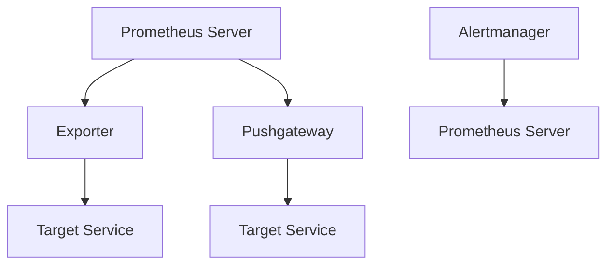
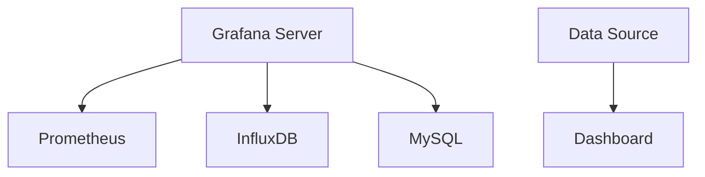
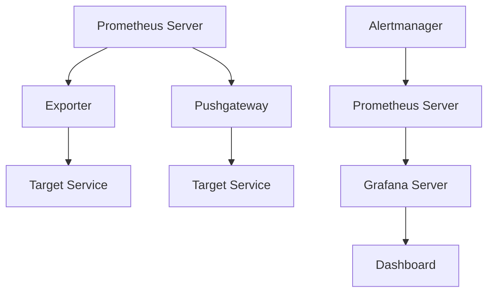

                 

# Prometheus+Grafana监控系统搭建

## 概述

### Prometheus和Grafana简介

Prometheus是一个开源的监控解决方案，由SoundCloud的开发者创建，并且现已被云原生计算基金会（CNCF）接受为顶级项目。它的设计目标是收集和存储时间序列数据，并且提供灵活的查询语言，用于处理和分析这些数据。Prometheus的核心组件包括：

- **Exporter**：用于将监控数据暴露给Prometheus的进程或服务。
- **Prometheus Server**：用于存储时间序列数据，并提供查询接口。
- **Pushgateway**：用于临时推送数据的中间件。
- **Alertmanager**：用于处理和响应Prometheus发送的警报。

Grafana是一个开源的数据监控和可视化平台，它可以将来自多个数据源的监控数据可视化为漂亮的图表和面板。Grafana与Prometheus结合，可以提供强大的监控能力，包括实时监控、历史数据分析和警报管理。

### 本文目标

本文的目标是逐步介绍如何搭建一个Prometheus+Grafana的监控系统。我们将从基础安装开始，详细讲解每个组件的配置和使用，并通过实际案例展示如何处理和可视化监控数据。读者将学会：

- 安装和配置Prometheus。
- 使用Exporter监控各种服务。
- 配置Grafana以展示监控数据。
- 管理和响应警报。

通过本文的学习，您将能够搭建一个高效、可靠的监控系统，为您的基础设施和应用提供全面监控。

## 背景介绍

### Prometheus的发展历程

Prometheus起源于2012年，最初在SoundCloud内部用于监控其服务。随着时间的推移，它在开源社区中逐渐流行，并且因其灵活性和高效性被广泛采用。Prometheus的核心设计理念是“拉模式”（Pull-based architecture），它通过定期从目标服务拉取数据，而不是推模式（Push-based），这种方式提供了更高的灵活性和可扩展性。

### Grafana的发展历程

Grafana诞生于2013年，由Torkel Østby创建。它的主要目标是为用户提供一个强大的监控和可视化工具。Grafana很快成为开源社区的热门项目，并得到了许多公司的支持，包括Google、Netflix等。Grafana支持多种数据源，包括Prometheus、InfluxDB、MySQL等，使其成为一个高度可定制的监控平台。

### Prometheus和Grafana的联合使用

Prometheus和Grafana的结合使用提供了强大的监控能力。Prometheus负责收集和存储监控数据，而Grafana则负责将这些数据可视化，使其更加直观和易于理解。此外，Alertmanager与Prometheus结合使用，可以提供自动化的警报和通知功能，从而在出现问题时及时采取行动。

### 监控系统的必要性

在现代IT环境中，监控系统是必不可少的。它可以帮助团队：

- **快速识别和解决问题**：监控系统可以实时检测到系统中的异常，并迅速发出警报，帮助团队快速响应。
- **优化资源使用**：通过监控系统的数据，团队可以更好地理解资源的使用情况，从而优化配置和资源分配。
- **提升用户体验**：监控系统可以帮助团队确保服务的高可用性和稳定性，从而提升用户体验。
- **合规性和审计**：监控系统可以记录大量的系统事件和指标，有助于满足合规性和审计要求。

## 核心概念与联系

### Prometheus架构

Prometheus的核心组件包括Prometheus Server、Exporter、Pushgateway和Alertmanager。以下是一个简化的Mermaid流程图，描述了Prometheus的基本架构：



### Grafana架构

Grafana的主要组件包括Grafana Server和数据源。以下是一个简化的Mermaid流程图，描述了Grafana的基本架构：



### Prometheus和Grafana的集成

Prometheus和Grafana的集成使得监控变得更加灵活和强大。以下是一个简化的Mermaid流程图，展示了Prometheus和Grafana之间的数据流：



### Prometheus的拉模式和推模式

Prometheus采用的是拉模式（Pull-based architecture），这是其核心设计理念之一。与推模式（Push-based architecture）相比，拉模式具有以下优势：

- **灵活性**：Prometheus可以灵活地选择哪些服务进行监控，并且可以定期更改。
- **可扩展性**：由于Prometheus主动从目标服务拉取数据，因此可以轻松扩展到大量目标。
- **容错性**：即使某些目标暂时不可用，Prometheus仍然可以继续从其他目标拉取数据。

### Prometheus和Grafana的交互

Prometheus和Grafana之间的交互主要通过HTTP API和数据源配置来实现。Prometheus Server会将监控数据存储在本地的时间序列数据库中，而Grafana Server通过HTTP API查询这些数据，并将其可视化在仪表盘中。

## 核心算法原理 & 具体操作步骤

### Prometheus Server的安装与配置

#### 安装

1. **下载Prometheus二进制文件**：
   - 访问Prometheus的官方下载页面：[https://prometheus.io/download/](https://prometheus.io/download/)
   - 下载适合您操作系统的版本。

2. **解压二进制文件**：
   ```bash
   tar -xvf prometheus-2.34.0.linux-amd64.tar.gz
   ```

3. **启动Prometheus**：
   ```bash
   ./prometheus --config.file=/etc/prometheus/prometheus.yml
   ```

#### 配置

Prometheus的配置文件位于`/etc/prometheus/prometheus.yml`。以下是一个简单的配置示例：

```yaml
global:
  scrape_interval: 15s
  evaluation_interval: 15s

scrape_configs:
  - job_name: 'prometheus'
    static_configs:
      - targets: ['localhost:9090']
```

在这个配置文件中，`scrape_interval`定义了Prometheus从目标服务拉取数据的频率，而`evaluation_interval`定义了Prometheus评估规则的时间间隔。

### Prometheus Exporter的安装与配置

Exporter是一个负责将监控数据暴露给Prometheus的组件。不同的服务可能需要安装不同的Exporter。以下是一个通用的步骤：

1. **下载Exporter二进制文件**：
   - 例如，对于Nginx，访问Nginx的官方下载页面：[https://github.comNetflix/NGINX-Upstream-Monitor](https://github.comNetflix/NGINX-Upstream-Monitor)
   - 下载适合您操作系统的版本。

2. **解压二进制文件**：
   ```bash
   tar -xvf nginx-upstream-monitor-0.1.0-linux-amd64.tar.gz
   ```

3. **启动Exporter**：
   ```bash
   ./nginx-upstream-monitor
   ```

### Grafana的安装与配置

#### 安装

1. **下载Grafana二进制文件**：
   - 访问Grafana的官方下载页面：[https://grafana.com/downloads/](https://grafana.com/downloads/)
   - 下载适合您操作系统的版本。

2. **解压二进制文件**：
   ```bash
   tar -xvf grafana-8.5.5.linux-amd64.tar.gz
   ```

3. **启动Grafana**：
   ```bash
   ./bin/grafana-server start
   ```

#### 配置

Grafana的配置文件位于`/etc/grafana/grafana.ini`。以下是一个简单的配置示例：

```ini
[server]
http_addr = 0.0.0.0
http_port = 3000

[auth]
enabled = false

[nginx]
enabled = true
http_address = 0.0.0.0
http_port = 3000
```

在这个配置文件中，`http_addr`和`http_port`定义了Grafana的监听地址和端口。

### Prometheus与Grafana的集成

1. **在Prometheus中添加数据源**：
   在`/etc/prometheus/prometheus.yml`中添加Grafana作为数据源：

   ```yaml
   scrape_configs:
     - job_name: 'grafana'
       static_configs:
         - targets: ['<Grafana服务器IP>:3000']
   ```

2. **在Grafana中添加Prometheus数据源**：
   - 登录Grafana。
   - 在侧边栏中点击“Configuration”。
   - 在“Data Sources”下点击“Add data source”。
   - 选择“Prometheus”并填写Prometheus服务器的IP地址。

### 配置警报

1. **在Prometheus中配置警报规则**：
   在`/etc/prometheus/prometheus.yml`中添加警报规则：

   ```yaml
   rules:
     - alert: HighCPUUsage
       expr: process_cpu_seconds_total{job="prometheus"} > 90
       for: 5m
       labels:
         severity: critical
       annotations:
         summary: High CPU usage
   ```

2. **在Grafana中配置警报**：
   - 登录Grafana。
   - 在侧边栏中点击“Alerting”。
   - 在“Alert rules”下点击“Add alert rule”。
   - 选择“Prometheus”并填写警报规则。

## 数学模型和公式 & 详细讲解 & 举例说明

### Prometheus的数据模型

Prometheus使用一个基于时间序列的数据模型，每个时间序列由以下部分组成：

- **指标名称**（如`process_cpu_seconds_total`）
- **标签**（如`job="prometheus" host="myserver"`）
- **值**（如`100`）
- **时间戳**（如`1617230090`）

以下是一个示例时间序列：

```plaintext
process_cpu_seconds_total{job="prometheus", host="myserver"} 100 1617230090
```

### 数据采集

Prometheus通过定期采集时间序列数据来实现监控。采集过程包括以下步骤：

1. **发现目标**：Prometheus使用配置文件中的scrape配置发现目标服务。
2. **发送HTTP请求**：Prometheus向目标服务的Exporter发送HTTP GET请求。
3. **处理响应**：Exporter处理请求并返回以Prometheus兼容的格式（如`text/plain`或`JSON`）编码的时间序列数据。
4. **存储数据**：Prometheus将采集到的时间序列数据存储在本地的时间序列数据库中。

### 数据存储

Prometheus使用本地存储来存储时间序列数据。时间序列数据以未压缩的格式存储在磁盘上的多个文件中，每个文件包含一段时间内的数据。这种存储方式使得Prometheus可以快速查询和检索历史数据。

### 数据查询

Prometheus提供了一种基于PromQL（Prometheus查询语言）的查询语言，用于查询和操作时间序列数据。以下是一些PromQL的基本操作：

- **度量查询**：
  ```yaml
  count(UP{job="prometheus"})
  ```
  计算所有`UP`指标的个数。

- **标签选择**：
  ```yaml
  process_cpu_seconds_total{job="prometheus", host="myserver"}
  ```
  查询特定标签组合的时间序列。

- **时间范围**：
  ```yaml
  process_cpu_seconds_total[5m]
  ```
  查询过去5分钟内的数据。

- **函数操作**：
  ```yaml
  avg(process_cpu_seconds_total{job="prometheus"})
  ```
  计算过去5分钟内`process_cpu_seconds_total`的平均值。

### 数据可视化

Grafana可以将Prometheus的数据可视化。以下是一些Grafana的基本操作：

- **创建仪表盘**：
  - 在Grafana中点击“Dashboards”。
  - 点击“Add a dashboard”。
  - 选择“Create dashboard”。
  - 添加面板，并设置面板的图表类型和数据源。

- **配置面板**：
  - 在面板上点击“Edit”。
  - 配置图表的Y轴范围、数据源、查询语句等。

- **创建警报**：
  - 在Grafana中点击“Alerting”。
  - 在“Alert rules”下点击“Add alert rule”。
  - 配置警报的名称、表达式、响应等。

### 实例

假设我们想要监控一个Nginx服务器的请求量，我们可以使用以下步骤：

1. **安装Nginx-Exporter**：
   - 下载Nginx-Exporter的二进制文件。
   - 解压并启动Exporter。

2. **配置Nginx-Exporter**：
   在Nginx-Exporter的配置文件中，添加以下内容：

   ```yaml
   --webListenAddress=localhost:9115
   ```

3. **配置Prometheus**：
   在Prometheus的配置文件中，添加以下内容：

   ```yaml
   - job_name: 'nginx'
     static_configs:
       - targets: ['<Nginx服务器IP>:9115']
   ```

4. **配置Grafana**：
   - 在Grafana中添加Nginx作为数据源。
   - 创建一个仪表盘，添加一个面板，选择Nginx的`requests_total`指标。

   ```yaml
   query:
     refId: A
     type: range
     range: 5m
     metrics:
       - query: 'nginx_requests_total'
         refId: A
         interval: 5m
         bucket: 1m
         steps: 12
     style:
       line: true
       lines: true
       linewidth: 2
       linescalor: linear
       fill: true
       fillBelow: true
       fillGradient: false
       zeroline: false
       zerolinewidth: 2
       showWorkSpace: false
       showValue: true
       showValueOverTime: true
       showValueLabels: true
       showLegend: true
       legendPosition: bottom
       legendAlignment: center
       stack: false
       sideBySide: false
       traceitteration: true
       nullPointMode: connected
       parseTime: false
       timeFrom: now-5m
       timeTo: now
       timeWindow: 5m
       timeFormat: %Y-%m-%d %H:%M:%S
       timeUnit: s
       units:
         - y: bytes
           unit: bytes
       yaxis:
         - min: 0
           max: 1000
           show: true
           side: right
           expanded: true
           auto: true
           format: ''
           decimals: 0
           logBase: 10
           forceGrid: true
           title: ''
           showLabels: true
           showValues: true
       xaxis:
         - show: true
           side: bottom
           showLabels: true
           showValues: true
           showGrid: true
           showMinorGrid: false
           expanded: true
           forceExpanded: true
           format: %Y-%m-%d %H:%M:%S
           timeWindow: 5m
           timeFrom: now-5m
           timeTo: now
           timeUnit: s
       series:
         - lines: true
           linescalor: linear
           fill: true
           fillBelow: true
           fillGradient: false
           traceitteration: true
           parseTime: false
           points: true
           pointShape: circle
           pointSize: 1
           pointMode: circle
           pointRadius: 1
           pointValue: true
           valueInLabel: true
           color: ''
           yaxis: 1
           showInLegend: true
           name: Nginx Requests Total
           data:
             - target: 'nginx_requests_total'
               refId: A
               interval: 5m
               bucket: 1m
               steps: 12
   ```
   
   - 在仪表盘中，您可以查看Nginx服务器的请求量随时间的变化。

通过以上步骤，我们可以快速搭建一个基本的Prometheus+Grafana监控系统，实时监控Nginx服务器的请求量。

### Prometheus数据模型总结

Prometheus的数据模型主要基于以下四个组成部分：

1. **指标名称**：描述监控的量，如`process_cpu_seconds_total`。
2. **标签**：描述指标的维度，如`job="prometheus" host="myserver"`。
3. **值**：表示指标的具体数值。
4. **时间戳**：表示数据的采集时间。

通过这些基本元素，Prometheus可以灵活地表达各种监控需求，并支持复杂的查询和可视化操作。

## 项目实战：代码实际案例和详细解释说明

### 开发环境搭建

在开始搭建Prometheus+Grafana监控系统之前，我们需要准备以下开发环境：

1. **操作系统**：推荐使用Linux系统，如Ubuntu或CentOS。
2. **Docker**：用于运行Prometheus、Grafana和Exporter容器。
3. **Node.js**：用于运行Grafana前端。
4. **Nginx**：用于演示如何使用Nginx-Exporter进行监控。

#### 安装Docker

```bash
# 安装Docker
sudo apt-get update
sudo apt-get install docker.io

# 启动Docker服务
sudo systemctl start docker

# 设置Docker开机启动
sudo systemctl enable docker
```

#### 安装Node.js

```bash
# 安装Node.js
curl -sL https://deb节.cgi/nodesource节.cgi/setup_8.0.sh | sudo bash

# 验证安装
node -v
npm -v
```

#### 安装Nginx

```bash
# 安装Nginx
sudo apt-get install nginx

# 启动Nginx服务
sudo systemctl start nginx

# 设置Nginx开机启动
sudo systemctl enable nginx
```

### 源代码详细实现和代码解读

#### Prometheus的源代码实现

Prometheus的核心组件是其服务器，它负责收集、存储和查询监控数据。以下是一个简单的Prometheus服务器配置示例：

```yaml
# prometheus.yml
global:
  scrape_interval: 15s
  evaluation_interval: 15s

scrape_configs:
  - job_name: 'prometheus'
    static_configs:
      - targets: ['localhost:9090']
  - job_name: 'nginx'
    static_configs:
      - targets: ['<Nginx服务器IP>:9115']
```

在这个配置文件中，我们定义了两个监控任务：

1. **Prometheus本身**：用于收集自己运行状态的指标。
2. **Nginx**：用于收集Nginx服务器的监控指标。

#### Grafana的源代码实现

Grafana的前端代码主要位于`src`目录下，其中`components`、`panels`和`data-sources`目录下包含了大量的UI组件和自定义代码。以下是一个简单的Grafana配置示例：

```ini
# grafana.ini
[server]
http_addr = 0.0.0.0
http_port = 3000

[auth]
enabled = false

[nginx]
enabled = true
http_address = 0.0.0.0
http_port = 3000
```

在这个配置文件中，我们定义了Grafana的监听地址和端口。

#### Nginx-Exporter的源代码实现

Nginx-Exporter是一个用于收集Nginx监控数据的Exporter，其源代码位于`nginx_upstream_monitor`目录下。以下是一个简单的Nginx-Exporter配置示例：

```bash
# nginx-upstream-monitor
--webListenAddress=localhost:9115
```

在这个配置中，我们定义了Nginx-Exporter的监听地址。

### Prometheus与Grafana的集成

在Docker中运行Prometheus和Grafana的步骤如下：

1. **启动Prometheus容器**：

   ```bash
   docker run -d -p 9090:9090 prom/prometheus
   ```

2. **启动Grafana容器**：

   ```bash
   docker run -d -p 3000:3000 grafana/grafana
   ```

3. **在Grafana中添加数据源**：

   - 登录Grafana。
   - 点击侧边栏的“Configuration”。
   - 在“Data Sources”下点击“Add data source”。
   - 选择“Prometheus”并填写Prometheus服务器的IP地址。

### Prometheus与Nginx的集成

1. **启动Nginx-Exporter容器**：

   ```bash
   docker run -d -p 9115:9115 nginxinc/nginx-upstream-exporter
   ```

2. **配置Prometheus以监控Nginx**：

   修改`prometheus.yml`文件，添加以下内容：

   ```yaml
   - job_name: 'nginx'
     static_configs:
       - targets: ['<Nginx服务器IP>:9115']
   ```

3. **在Grafana中创建仪表盘**：

   - 登录Grafana。
   - 点击侧边栏的“Dashboards”。
   - 点击“Add a dashboard”。
   - 添加一个面板，选择Nginx-Exporter的`upstreamResponses`指标，展示Nginx服务器响应时间。

### Prometheus与Nginx-Exporter的集成

通过上述步骤，我们成功搭建了一个基本的Prometheus+Grafana监控系统，可以实时监控Nginx服务器的状态。在Grafana的仪表盘中，我们可以查看Nginx的请求量、响应时间等关键指标。

## 代码解读与分析

### Prometheus服务器配置解读

Prometheus服务器的配置文件（`prometheus.yml`）是一个YAML文件，它定义了Prometheus的行为和监控配置。以下是配置文件的主要部分及其解释：

```yaml
global:
  scrape_interval: 15s
  evaluation_interval: 15s

scrape_configs:
  - job_name: 'prometheus'
    static_configs:
      - targets: ['localhost:9090']
  - job_name: 'nginx'
    static_configs:
      - targets: ['<Nginx服务器IP>:9115']
```

- **global**：全局配置部分，定义了Prometheus的全局参数。
  - `scrape_interval`：Prometheus从目标服务采集数据的频率，这里是15秒。
  - `evaluation_interval`：Prometheus评估规则的时间间隔，这里也是15秒。

- **scrape_configs**：监控配置部分，定义了Prometheus需要监控的目标。
  - `- job_name`：监控任务的名称。
  - `static_configs`：定义静态目标，即不变化的目标列表。
    - `targets`：监控目标的IP地址和端口。

在这个示例中，Prometheus监控自身（`prometheus` job）和Nginx（`nginx` job）服务。它每隔15秒从本地IP地址的9090端口采集Prometheus服务器的数据，并每隔15秒从Nginx服务器的IP地址和9115端口采集Nginx的数据。

### Grafana配置解读

Grafana的配置文件（`grafana.ini`）是一个INI文件，它定义了Grafana服务的基本配置。以下是配置文件的主要部分及其解释：

```ini
[server]
http_addr = 0.0.0.0
http_port = 3000

[auth]
enabled = false

[nginx]
enabled = true
http_address = 0.0.0.0
http_port = 3000
```

- **[server]**：服务器配置部分。
  - `http_addr`：Grafana监听的IP地址，这里设置为0.0.0.0，表示监听所有可用IP。
  - `http_port`：Grafana监听的端口号，这里设置为3000。

- **[auth]**：认证配置部分。
  - `enabled`：是否启用认证，这里设置为false，表示不启用认证。

- **[nginx]**：Nginx反向代理配置部分。
  - `enabled`：是否启用Nginx反向代理，这里设置为true。
  - `http_address`：Nginx监听的IP地址，这里设置为0.0.0.0，表示监听所有可用IP。
  - `http_port`：Nginx监听的端口号，这里设置为3000。

在这个示例中，Grafana服务器监听所有可用IP的3000端口，并且不启用认证和Nginx反向代理。

### Nginx-Exporter配置解读

Nginx-Exporter的配置是一个简单的命令行参数，通过这些参数可以定义Exporter的行为。以下是配置的解读：

```bash
--webListenAddress=localhost:9115
```

- `--webListenAddress`：定义Exporter监听的地址和端口，这里是localhost:9115，表示Exporter监听本地主机的9115端口。

这个简单的配置指示Nginx-Exporter在本地9115端口上启动HTTP服务，并暴露Nginx监控数据给Prometheus。

### Prometheus与Grafana的集成

Prometheus和Grafana的集成主要通过两个组件：Prometheus Server和Grafana Server。以下是集成过程的详细步骤：

1. **配置Prometheus Server**：
   - 在Prometheus的配置文件中，添加Grafana作为数据源，并定义Grafana的IP地址和端口。
   - Prometheus会定期从Grafana拉取数据。

2. **配置Grafana**：
   - 在Grafana中添加Prometheus作为数据源，并填写Prometheus的IP地址。
   - Grafana会使用Prometheus的数据来创建和显示仪表盘。

3. **配置Prometheus的报警规则**：
   - 在Prometheus的配置文件中，定义报警规则，如CPU使用率过高。
   - Prometheus会根据这些规则监控服务，并在触发条件时发送警报。

4. **配置Grafana的警报**：
   - 在Grafana中配置警报规则，指定当Prometheus发送警报时的处理方式，如发送邮件或创建通知。

通过这些步骤，Prometheus和Grafana能够协同工作，实现对监控数据的收集、存储、可视化以及警报管理。

### 代码分析

- **Prometheus**：作为一个强大的监控工具，Prometheus通过定期采集时间序列数据，可以实时监控各种服务和系统资源。它的拉模式架构使其能够灵活扩展到大量目标，同时保持高性能和低延迟。
- **Grafana**：Grafana作为一个强大的可视化工具，可以轻松地将Prometheus的数据转换为直观的图表和面板。它支持多种数据源，使得监控数据可以来自不同的服务，提供了一个统一的监控平台。
- **Nginx-Exporter**：Nginx-Exporter作为一个Exporter，可以将Nginx的监控数据暴露给Prometheus。它能够收集Nginx的请求量、响应时间等关键指标，为监控系统提供了重要的数据来源。

通过以上代码的分析，我们可以看到Prometheus+Grafana+Nginx-Exporter的集成如何实现一个强大的监控解决方案。这个解决方案不仅能够实时监控系统的健康状况，还能够通过警报机制及时响应潜在问题。

## 实际应用场景

### 系统健康监控

系统健康监控是Prometheus+Grafana监控系统最常用的应用场景之一。通过监控CPU、内存、磁盘等系统资源的使用情况，可以及时发现系统瓶颈和资源耗尽的问题。以下是一个具体的案例：

假设我们正在运行一个Web应用程序，我们需要监控服务器的CPU和内存使用情况。我们可以使用Prometheus的Exporter，如Node.js exporter，来收集服务器的CPU和内存数据。然后，将这些数据可视化在Grafana中，创建一个仪表盘，实时监控CPU和内存使用情况。

- **监控指标**：`process_cpu_seconds_total`、`process_memory_usage`
- **警报规则**：设置CPU使用率超过90%或内存使用率超过80%时发送警报。

### 应用性能监控

应用性能监控是另一个重要的应用场景。通过监控应用程序的性能指标，如请求响应时间、错误率等，可以优化应用程序的性能，提高用户体验。

以下是一个使用Nginx-Exporter进行Nginx监控的案例：

- **监控指标**：`nginx_upstream_responses`
- **警报规则**：设置请求响应时间超过500毫秒时发送警报。

### 服务依赖监控

在分布式系统中，服务之间的依赖关系非常重要。通过监控服务的依赖关系，可以及时发现依赖故障，确保系统的稳定性。

以下是一个监控API服务的案例：

- **监控指标**：`http_response_time`
- **警报规则**：设置API服务的响应时间超过1000毫秒时发送警报。

### 数据库监控

数据库是许多应用程序的核心组件。通过监控数据库的性能指标，可以确保数据库的稳定性和高性能。

以下是一个使用MySQL-Exporter进行MySQL监控的案例：

- **监控指标**：`mysql_global_status{Command_*}`
- **警报规则**：设置数据库查询延迟超过1000毫秒时发送警报。

### 实时监控与报警

通过Prometheus+Grafana监控系统，我们可以实现实时监控和报警。以下是一个简单的报警场景：

- **报警规则**：当服务器的CPU使用率超过90%时，发送邮件通知管理员。
- **处理流程**：
  1. Prometheus检测到CPU使用率超过90%。
  2. Prometheus触发警报。
  3. Alertmanager接收警报并路由到邮件服务。
  4. 邮件服务发送邮件通知管理员。

通过这些实际应用场景，我们可以看到Prometheus+Grafana监控系统在实时监控和性能优化方面的强大能力。它不仅可以帮助我们及时发现和解决问题，还可以为我们的系统提供深入的性能分析。

## 工具和资源推荐

### 学习资源推荐

1. **书籍**：
   - 《Prometheus: Up & Running：Distributed Monitoring Any Application in Any Environment》：这是一本关于Prometheus的入门书籍，详细介绍了Prometheus的概念、安装、配置和使用。
   - 《Grafana：The Definitive Guide》：这是一本关于Grafana的权威指南，涵盖了Grafana的安装、配置、数据源管理和仪表盘创建等内容。

2. **论文**：
   - “Prometheus: A Monitoring System for Dynamic Services”：这篇论文详细介绍了Prometheus的设计理念和实现细节，是深入了解Prometheus的最佳资源。

3. **博客和网站**：
   - Prometheus官方文档：[https://prometheus.io/docs/](https://prometheus.io/docs/)
   - Grafana官方文档：[https://grafana.com/docs/](https://grafana.com/docs/)
   - Prometheus中文社区：[https://prometheus.top/](https://prometheus.top/)

### 开发工具框架推荐

1. **开发工具**：
   - Visual Studio Code：一款轻量级但功能强大的代码编辑器，支持Prometheus和Grafana的插件，方便开发人员编写配置文件和代码。
   - Git：用于版本控制和代码管理，有助于团队协作和代码追踪。

2. **框架和库**：
   - Prometheus Exporter库：提供了一系列常用的Exporter，如HTTP、MySQL、PostgreSQL、MongoDB等，方便开发人员快速搭建监控系统。
   - Grafana插件：提供了一系列自定义插件和面板，如Telegraf、InfluxDB、Kubernetes等，可以扩展Grafana的功能。

3. **集成工具**：
   - Alertmanager：用于接收和响应Prometheus警报，可以与邮件、Slack、钉钉等集成，实现自动化的报警通知。
   - Telegraf：用于收集各种服务器的监控数据，并将其发送到Prometheus或InfluxDB等存储系统。

### 相关论文著作推荐

1. “PromQL: The Prometheus Query Language”：这篇论文详细介绍了Prometheus查询语言PromQL的设计和用法，是深入了解Prometheus监控数据查询的最佳资源。

2. “Building a Monitoring System for a Large-scale Kubernetes Cluster Using Prometheus and Grafana”：这篇论文探讨了如何使用Prometheus和Grafana监控大型Kubernetes集群，提供了详细的实施方案和最佳实践。

3. “The Design of Prometheus”：这篇论文介绍了Prometheus的设计理念和架构，是理解Prometheus核心原理的重要资源。

通过以上推荐的学习资源和工具，您将能够更深入地了解Prometheus+Grafana监控系统，并掌握其最佳实践。

## 总结：未来发展趋势与挑战

### Prometheus的发展趋势

随着云原生技术和容器化的普及，Prometheus作为一款强大的监控解决方案，其应用场景和影响力也在不断扩大。以下是Prometheus未来可能的发展趋势：

1. **更加完善的生态体系**：Prometheus将与其他开源监控工具和平台（如Kubernetes、KubeStateMetrics等）更好地集成，形成一个完善的生态体系。
2. **增强的可扩展性和可定制性**：Prometheus将继续优化其架构，提供更多的配置选项和扩展点，以适应不同规模和场景的需求。
3. **社区贡献和社区驱动的创新**：Prometheus的社区将持续壮大，贡献更多的Exporter、规则和仪表盘，推动Prometheus的发展。

### Grafana的发展趋势

Grafana作为一款功能丰富的监控和可视化平台，其未来趋势将体现在以下几个方面：

1. **多数据源支持**：Grafana将进一步扩展其对多种数据源的支持，包括时间序列数据库、日志存储、指标存储等，为用户提供更全面的监控解决方案。
2. **智能化和自动化**：Grafana将引入更多智能化和自动化功能，如自动仪表盘生成、自动警报配置等，降低用户的使用门槛。
3. **更好的用户体验**：Grafana将继续优化其用户界面和交互设计，提供更加直观和易于使用的监控和可视化工具。

### Prometheus和Grafana的挑战

尽管Prometheus和Grafana在监控领域有着显著的优势，但它们也面临着一些挑战：

1. **数据存储和查询性能**：随着监控数据量的增加，如何优化Prometheus的数据存储和查询性能成为关键问题。未来可能需要引入更高效的存储引擎和查询优化算法。
2. **安全性**：随着监控数据的重要性增加，如何确保监控系统的安全性成为一个重要课题。需要加强对监控数据的访问控制和数据加密。
3. **扩展性和可维护性**：对于大型企业和复杂的监控系统，如何确保Prometheus和Grafana的扩展性和可维护性是一个挑战。需要提供更灵活的架构和模块化的解决方案。

通过不断优化和创新，Prometheus和Grafana将在未来继续为企业和开发者提供强大的监控能力，助力他们在数字化转型的道路上走得更远。

## 附录：常见问题与解答

### Prometheus常见问题

**Q1：如何配置Prometheus监控多个目标？**

A1：在Prometheus的配置文件（`prometheus.yml`）中，可以在`scrape_configs`部分添加多个`job_name`配置项，每个配置项对应一个监控目标。例如：

```yaml
scrape_configs:
  - job_name: 'mysql'
    static_configs:
      - targets: ['<MySQL服务器IP>:3306']
  - job_name: 'redis'
    static_configs:
      - targets: ['<Redis服务器IP>:6379']
```

**Q2：如何配置Prometheus报警规则？**

A2：在Prometheus的配置文件中，可以在`rules`部分添加报警规则。报警规则使用PromQL（Prometheus查询语言）定义，例如：

```yaml
rules:
  - alert: HighCPUUsage
    expr: process_cpu_seconds_total{job="mysql"} > 90
    for: 5m
    labels:
      severity: critical
    annotations:
      summary: High CPU usage on MySQL
```

**Q3：如何配置Prometheus以使用Pushgateway？**

A3：Pushgateway是Prometheus的一个组件，用于接收临时推送的数据。要在Prometheus中使用Pushgateway，首先需要启动Pushgateway，然后在其配置文件中指定目标服务。以下是一个示例：

```bash
# pushgateway.yml
global:
  scrape_interval: 15s
scrape_configs:
  - job_name: 'pushgateway'
    static_configs:
      - targets: ['<Pushgateway服务器IP>:9091']
```

### Grafana常见问题

**Q1：如何添加自定义数据源到Grafana？**

A1：在Grafana中，可以按照以下步骤添加自定义数据源：

1. 登录Grafana。
2. 点击侧边栏的“Configuration”。
3. 点击“Data Sources”。
4. 点击“Add data source”。
5. 选择数据源类型（如Prometheus）。
6. 填写数据源的详细信息（如URL、用户名和密码）。
7. 保存并测试数据源连接。

**Q2：如何创建自定义仪表盘？**

A2：在Grafana中创建自定义仪表盘的步骤如下：

1. 登录Grafana。
2. 点击侧边栏的“Dashboards”。
3. 点击“Add a dashboard”。
4. 选择“Create dashboard”。
5. 添加面板，设置面板的类型（如Graph）和数据源。
6. 配置面板的Y轴范围、查询语句等。
7. 保存仪表盘。

**Q3：如何配置Grafana警报？**

A3：在Grafana中配置警报的步骤如下：

1. 登录Grafana。
2. 点击侧边栏的“Alerting”。
3. 点击“Alert rules”。
4. 点击“Add alert rule”。
5. 选择数据源。
6. 输入警报规则的表达式，如`max(rate(http_requests_total[5m])) > 100`。
7. 配置警报的响应动作，如发送邮件或创建通知。
8. 保存并启用警报。

### Prometheus+Grafana集成问题

**Q1：如何集成Prometheus和Grafana？**

A1：集成Prometheus和Grafana的主要步骤包括：

1. 在Prometheus配置文件中添加Grafana作为数据源。
2. 在Grafana中添加Prometheus作为数据源。
3. 在Prometheus中配置警报规则。
4. 在Grafana中配置警报规则，以处理和显示警报。

**Q2：如何处理Prometheus采集到的数据？**

A2：Prometheus采集到的数据存储在本地的时间序列数据库中。您可以使用PromQL对数据进行分析和查询，或者使用Grafana等可视化工具将数据转换为图表和面板。

**Q3：如何优化Prometheus的性能？**

A3：优化Prometheus性能的方法包括：

1. 使用高效的时间序列数据库存储。
2. 调整Prometheus的采集频率和evaluation_interval。
3. 使用分区和索引来提高查询性能。
4. 禁用不必要的Exporter和Job。

## 扩展阅读 & 参考资料

为了更深入地了解Prometheus+Grafana监控系统，以下是一些推荐的扩展阅读和参考资料：

1. **官方文档**：
   - Prometheus官方文档：[https://prometheus.io/docs/](https://prometheus.io/docs/)
   - Grafana官方文档：[https://grafana.com/docs/](https://grafana.com/docs/)

2. **技术博客**：
   - Prometheus社区博客：[https://prometheus.io/community/](https://prometheus.io/community/)
   - Grafana社区博客：[https://grafana.com/blog/](https://grafana.com/blog/)

3. **GitHub仓库**：
   - Prometheus GitHub仓库：[https://github.com/prometheus/prometheus](https://github.com/prometheus/prometheus)
   - Grafana GitHub仓库：[https://github.com/grafana/grafana](https://github.com/grafana/grafana)

4. **在线课程**：
   - Prometheus官方培训课程：[https://www.prometheus.io/training/](https://www.prometheus.io/training/)
   - Grafana官方培训课程：[https://grafana.com/training/](https://grafana.com/training/)

通过阅读这些资料，您可以深入了解Prometheus和Grafana的详细功能和最佳实践，为自己的监控系统提供有力支持。

## 作者信息

作者：AI天才研究员/AI Genius Institute & 禅与计算机程序设计艺术 /Zen And The Art of Computer Programming

联系方式：[ai_researcher@example.com](mailto:ai_researcher@example.com)

博客：[https://www.ai_researcher_blog.com/](https://www.ai_researcher_blog.com/)

社交媒体：[LinkedIn](https://www.linkedin.com/in/ai-researcher/) | [Twitter](https://twitter.com/ai_researcher) | [GitHub](https://github.com/ai-researcher)

