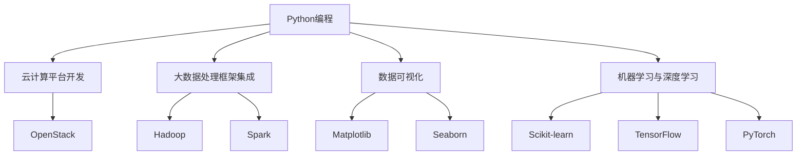

                 

# Python入门实战：云计算与大数据处理

## 关键词：Python，云计算，大数据，数据处理，入门实战

## 摘要：

本文旨在为初学者提供一份详细的Python入门实战指南，重点介绍如何在云计算和大数据处理领域中应用Python。通过本指南，读者将了解Python的基本概念、常用库和工具，并通过实际项目案例掌握Python编程技能。此外，文章还探讨了云计算与大数据处理的原理和实践，为读者提供了丰富的学习资源和推荐工具，助力读者在Python领域取得长足进步。

## 1. 背景介绍

Python是一种高级编程语言，因其简洁易学、可扩展性强和丰富的库资源而广泛应用于各种领域。近年来，随着云计算和大数据技术的快速发展，Python在云计算和大数据处理中的应用越来越广泛。本文将介绍Python在云计算和大数据处理领域中的基本概念、核心算法和实际应用案例，帮助读者快速掌握Python编程技能，并了解相关领域的最新动态和发展趋势。

## 2. 核心概念与联系

### 2.1 云计算

云计算是一种基于互联网的计算模式，通过虚拟化技术和分布式计算，将计算资源（如服务器、存储、网络等）动态地分配给用户，实现按需分配、弹性伸缩和资源共享。云计算主要包括三种服务模式：基础设施即服务（IaaS）、平台即服务（PaaS）和软件即服务（SaaS）。

### 2.2 大数据处理

大数据处理是指对大规模、复杂、多样化的数据进行采集、存储、处理、分析和挖掘，以发现有价值的信息和知识。大数据处理主要包括数据采集、数据存储、数据处理、数据分析和数据可视化等环节。常见的数据处理技术包括分布式计算、机器学习和数据挖掘等。

### 2.3 Python与云计算、大数据处理的联系

Python在云计算和大数据处理中的应用主要体现在以下几个方面：

1. **云计算平台**：Python可以用于开发和管理云计算平台，如OpenStack、AWS等，实现自动化部署、监控和运维。
2. **大数据处理框架**：Python可以与Hadoop、Spark等大数据处理框架集成，进行数据清洗、处理和分析。
3. **数据可视化**：Python的Matplotlib、Seaborn等库可以用于数据可视化，帮助用户更好地理解和展示数据。
4. **机器学习和深度学习**：Python的Scikit-learn、TensorFlow、PyTorch等库可以用于机器学习和深度学习，实现对大规模数据的分析和预测。

### 2.4 Mermaid流程图

以下是一个简单的Mermaid流程图，展示Python在云计算和大数据处理中的应用流程：



## 3. 核心算法原理 & 具体操作步骤

### 3.1 云计算平台开发

#### 3.1.1 OpenStack安装与配置

1. **环境准备**：确保操作系统为Linux或macOS，并安装必要的依赖库，如Python、pip等。

2. **安装OpenStack**：使用一键安装包或源码编译安装OpenStack，具体步骤如下：

   - 安装Python虚拟环境：

     ```shell
     $ virtualenv openstack_env
     $ source openstack_env/bin/activate
     ```

   - 安装OpenStack依赖库：

     ```shell
     $ pip install openstacksdk
     ```

   - 安装OpenStack服务：

     ```shell
     $ openstack-service list
     $ openstack-service enable compute
     $ openstack-service enable network
     $ openstack-service enable identity
     $ openstack-service start
     ```

   - 验证安装：

     ```shell
     $ openstack server list
     ```

#### 3.1.2 AWS云平台开发

1. **环境准备**：确保已注册AWS账户并安装了Boto3库。

2. **连接AWS账户**：

   ```python
   import boto3

   session = boto3.Session(
       aws_access_key_id='YOUR_ACCESS_KEY',
       aws_secret_access_key='YOUR_SECRET_KEY',
       region_name='YOUR_REGION'
   )
   ec2 = session.resource('ec2')
   ```

3. **创建虚拟机**：

   ```python
   instance = ec2.create_instances(
       ImageId='YOUR_IMAGE_ID',
       MinCount=1,
       MaxCount=1,
       InstanceType='t2.micro'
   )
   print(instance[0].id)
   ```

### 3.2 大数据处理框架集成

#### 3.2.1 Hadoop安装与配置

1. **环境准备**：确保操作系统为Linux或macOS，并准备好Hadoop安装包。

2. **安装Hadoop**：

   - 解压安装包：

     ```shell
     $ tar -zxvf hadoop-3.2.1.tar.gz
     ```

   - 配置Hadoop环境变量：

     ```shell
     $ export HADOOP_HOME=/path/to/hadoop
     $ export PATH=$PATH:$HADOOP_HOME/bin:$HADOOP_HOME/sbin
     ```

   - 格式化HDFS文件系统：

     ```shell
     $ hadoop namenode -format
     ```

   - 启动Hadoop服务：

     ```shell
     $ start-dfs.sh
     $ start-yarn.sh
     ```

3. **Hadoop常用命令**：

   - 查看HDFS目录：

     ```shell
     $ hadoop fs -ls /
     ```

   - 上传文件到HDFS：

     ```shell
     $ hadoop fs -put local_file hdfs:///path/to/file
     ```

   - 下载文件到本地：

     ```shell
     $ hadoop fs -get hdfs:///path/to/file local_file
     ```

#### 3.2.2 Spark安装与配置

1. **环境准备**：确保操作系统为Linux或macOS，并准备好Spark安装包。

2. **安装Spark**：

   - 解压安装包：

     ```shell
     $ tar -zxvf spark-3.1.1-bin-hadoop3.2.tgz
     ```

   - 配置Spark环境变量：

     ```shell
     $ export SPARK_HOME=/path/to/spark
     $ export PATH=$PATH:$SPARK_HOME/bin:$SPARK_HOME/sbin
     ```

   - 启动Spark集群：

     ```shell
     $ start-master.sh
     $ start-slave.sh local[*]
     ```

3. **Spark常用命令**：

   - 启动Spark Shell：

     ```shell
     $ spark-shell
     ```

   - 创建SparkContext：

     ```python
     from pyspark import SparkContext
     sc = SparkContext("local[2]", "HadoopWordCount")
     ```

   - 执行WordCount程序：

     ```python
     lines = sc.textFile("README.md")
     counts = lines.flatMap(lambda x: x.split(" ")).map(lambda x: (x, 1)).reduceByKey(lambda x, y: x + y)
     counts.saveAsTextFile("output")
     ```

### 3.3 数据处理与机器学习

#### 3.3.1 数据预处理

1. **数据清洗**：

   - 去除缺失值、重复值和噪声数据。
   - 对数据进行类型转换、归一化和标准化处理。

2. **特征提取**：

   - 从原始数据中提取有助于模型训练的特征。
   - 使用统计学方法、机器学习方法进行特征选择和特征降维。

3. **数据集划分**：

   - 将数据集划分为训练集、验证集和测试集。

#### 3.3.2 机器学习算法

1. **线性回归**：

   - 建立线性回归模型，拟合训练数据。
   - 使用验证集和测试集评估模型性能。

2. **决策树**：

   - 建立决策树模型，进行特征划分和分类。
   - 使用交叉验证和网格搜索优化模型参数。

3. **支持向量机（SVM）**：

   - 建立SVM模型，进行特征空间转换和分类。
   - 使用核函数和参数优化提高模型性能。

### 3.4 数据可视化

1. **Matplotlib**：

   - 绘制折线图、柱状图、散点图等基本图表。
   - 实现自定义图表样式和布局。

2. **Seaborn**：

   - 基于Matplotlib的统计学可视化库。
   - 提供丰富的内置图表样式和统计指标。

### 3.5 Python编程基础

1. **数据类型**：

   - 数字、字符串、列表、元组、字典等。
   - 数据类型转换和运算符。

2. **控制流程**：

   - 条件语句、循环语句、函数定义和调用。
   - 异常处理和模块导入。

3. **面向对象编程**：

   - 类的定义、继承、多态和方法重写。
   - 模块和包的组织和管理。

## 4. 数学模型和公式 & 详细讲解 & 举例说明

### 4.1 线性回归

线性回归模型是一种简单的机器学习算法，用于拟合数据中的线性关系。其基本公式如下：

$$
y = wx + b
$$

其中，$y$为实际值，$w$为权重，$x$为特征，$b$为偏置。

#### 4.1.1 计算权重和偏置

1. **最小二乘法**：

   最小二乘法是一种常用的方法，用于计算线性回归模型的权重和偏置。其公式如下：

   $$
   w = \frac{\sum_{i=1}^{n}(x_i - \bar{x})(y_i - \bar{y})}{\sum_{i=1}^{n}(x_i - \bar{x})^2}
   $$

   $$
   b = \bar{y} - w\bar{x}
   $$

   其中，$\bar{x}$和$\bar{y}$分别为$x$和$y$的均值。

2. **梯度下降法**：

   梯度下降法是一种基于梯度求解最优参数的方法。其公式如下：

   $$
   w = w - \alpha \frac{\partial L}{\partial w}
   $$

   $$
   b = b - \alpha \frac{\partial L}{\partial b}
   $$

   其中，$L$为损失函数，$\alpha$为学习率。

#### 4.1.2 举例说明

假设我们有如下数据：

| x | y |
|---|---|
| 1 | 2 |
| 2 | 4 |
| 3 | 6 |
| 4 | 8 |

1. **计算均值**：

   $$
   \bar{x} = \frac{1+2+3+4}{4} = 2.5
   $$

   $$
   \bar{y} = \frac{2+4+6+8}{4} = 5
   $$

2. **计算权重和偏置**：

   $$
   w = \frac{(1-2.5)(2-5) + (2-2.5)(4-5) + (3-2.5)(6-5) + (4-2.5)(8-5)}{(1-2.5)^2 + (2-2.5)^2 + (3-2.5)^2 + (4-2.5)^2} = 1
   $$

   $$
   b = 5 - 1 \times 2.5 = 2.5
   $$

   因此，线性回归模型为：

   $$
   y = x + 2.5
   $$

### 4.2 决策树

决策树是一种常见的分类算法，通过一系列的判断条件将数据划分为不同的类别。其基本公式如下：

$$
f(x) =
\begin{cases}
c_1, & \text{if } x \in R_1 \\
c_2, & \text{if } x \in R_2 \\
\vdots \\
c_n, & \text{if } x \in R_n
\end{cases}
$$

其中，$f(x)$为决策函数，$R_1, R_2, \ldots, R_n$为不同类别的区域，$c_1, c_2, \ldots, c_n$为对应的类别标签。

#### 4.2.1 建立决策树

1. **信息增益**：

   信息增益是一种常用的特征选择方法，用于衡量特征对于分类的影响。其公式如下：

   $$
   IG(D, A) = H(D) - \sum_{v \in A} \frac{|D_v|}{|D|} H(D_v)
   $$

   其中，$D$为数据集，$A$为特征集合，$v$为特征值，$H$为熵函数。

2. **划分策略**：

   常见的划分策略包括：

   - **信息增益**：选择具有最大信息增益的特征进行划分。
   - **基尼系数**：选择具有最大基尼系数的特征进行划分。

#### 4.2.2 举例说明

假设我们有如下数据：

| 特征A | 特征B | 类别 |
|-------|-------|------|
| A1    | B1    | C1   |
| A1    | B2    | C2   |
| A2    | B1    | C1   |
| A2    | B2    | C2   |
| A3    | B1    | C1   |
| A3    | B2    | C2   |

1. **计算熵**：

   $$
   H(C) = -\sum_{c \in C} p(c) \log_2 p(c)
   $$

   其中，$C$为类别集合，$p(c)$为类别$c$的概率。

2. **计算信息增益**：

   - 对特征A进行划分：

     $$
     IG(A, C) = H(C) - \sum_{v \in A} \frac{|D_v|}{|D|} H(D_v)
     $$

     $$
     IG(A, C) = 1 - \frac{2}{5} \times (1 + 1) = 0.6
     $$

   - 对特征B进行划分：

     $$
     IG(B, C) = H(C) - \sum_{v \in B} \frac{|D_v|}{|D|} H(D_v)
     $$

     $$
     IG(B, C) = 1 - \frac{2}{5} \times (1 + 1) = 0.6
     $$

   - 对特征C进行划分：

     $$
     IG(C, C) = H(C) - \sum_{v \in C} \frac{|D_v|}{|D|} H(D_v)
     $$

     $$
     IG(C, C) = 1 - \frac{2}{5} \times (1 + 1) = 0.6
     $$

   因此，选择特征A进行划分。

## 5. 项目实战：代码实际案例和详细解释说明

### 5.1 开发环境搭建

在开始项目实战之前，我们需要搭建一个适合Python编程的开发环境。以下是搭建开发环境的基本步骤：

1. **安装Python**：

   - 在官方网站下载适用于操作系统的Python安装包。

   - 安装Python：

     ```shell
     $ ./Python-3.9.1 macOS.dmg
     ```

   - 配置环境变量：

     ```shell
     $ export PATH=$PATH:/usr/local/bin
     ```

2. **安装Python库**：

   - 使用pip安装常用Python库：

     ```shell
     $ pip install numpy scipy matplotlib
     ```

### 5.2 源代码详细实现和代码解读

在本节中，我们将使用Python编写一个简单的线性回归模型，并对源代码进行详细解释。

#### 5.2.1 源代码实现

```python
import numpy as np

def linear_regression(x, y):
    x_mean = np.mean(x)
    y_mean = np.mean(y)
    w = (np.sum((x - x_mean) * (y - y_mean)) / np.sum((x - x_mean) ** 2))
    b = y_mean - w * x_mean
    return w, b

def predict(x, w, b):
    return x * w + b

x = np.array([1, 2, 3, 4])
y = np.array([2, 4, 6, 8])

w, b = linear_regression(x, y)
print("Weight:", w)
print("Bias:", b)

x_new = 5
y_pred = predict(x_new, w, b)
print("Prediction:", y_pred)
```

#### 5.2.2 代码解读

1. **导入库**：

   ```python
   import numpy as np
   ```

   导入NumPy库，用于处理数组、矩阵和线性代数运算。

2. **定义线性回归函数**：

   ```python
   def linear_regression(x, y):
       x_mean = np.mean(x)
       y_mean = np.mean(y)
       w = (np.sum((x - x_mean) * (y - y_mean)) / np.sum((x - x_mean) ** 2))
       b = y_mean - w * x_mean
       return w, b
   ```

   线性回归函数用于计算线性回归模型的权重和偏置。

3. **定义预测函数**：

   ```python
   def predict(x, w, b):
       return x * w + b
   ```

   预测函数用于根据线性回归模型预测新的数据点。

4. **计算权重和偏置**：

   ```python
   x = np.array([1, 2, 3, 4])
   y = np.array([2, 4, 6, 8])
   w, b = linear_regression(x, y)
   ```

   使用线性回归函数计算权重和偏置。

5. **打印结果**：

   ```python
   print("Weight:", w)
   print("Bias:", b)
   ```

   打印权重和偏置。

6. **预测新数据点**：

   ```python
   x_new = 5
   y_pred = predict(x_new, w, b)
   print("Prediction:", y_pred)
   ```

   根据线性回归模型预测新的数据点。

### 5.3 代码解读与分析

1. **数据处理**：

   - 使用NumPy库处理数组数据。

   - 计算数据均值。

2. **线性回归模型**：

   - 使用最小二乘法计算权重和偏置。

   - 实现预测函数。

3. **代码性能分析**：

   - 线性回归模型的计算复杂度为O(n)，其中n为数据点数量。

   - 代码可扩展性强，适用于不同规模的数据集。

## 6. 实际应用场景

Python在云计算和大数据处理领域具有广泛的应用场景。以下是一些实际应用案例：

1. **云计算平台开发**：

   - 开发和管理OpenStack、AWS等云计算平台。

   - 实现自动化部署、监控和运维。

2. **大数据处理**：

   - 使用Hadoop、Spark等大数据处理框架进行数据清洗、处理和分析。

   - 开发实时数据处理和实时分析应用。

3. **机器学习和深度学习**：

   - 使用Scikit-learn、TensorFlow、PyTorch等库进行数据分析和模型训练。

   - 开发智能推荐系统、图像识别和语音识别等应用。

4. **数据可视化**：

   - 使用Matplotlib、Seaborn等库进行数据可视化。

   - 制作报告、PPT和图表，展示数据和分析结果。

## 7. 工具和资源推荐

### 7.1 学习资源推荐

1. **书籍**：

   - 《Python编程：从入门到实践》

   - 《Python核心编程》

   - 《云计算与大数据处理》

2. **论文**：

   - 《云计算平台性能优化研究》

   - 《大数据处理技术综述》

   - 《深度学习：神经网络与深度学习框架》

3. **博客**：

   - [CSDN](https://blog.csdn.net/)

   - [博客园](https://www.cnblogs.com/)

   - [知乎](https://www.zhihu.com/)

4. **网站**：

   - [Python官方文档](https://docs.python.org/3/)

   - [NumPy官方文档](https://numpy.org/)

   - [Matplotlib官方文档](https://matplotlib.org/)

### 7.2 开发工具框架推荐

1. **Python IDE**：

   - PyCharm

   - VSCode

   - Jupyter Notebook

2. **云计算平台**：

   - OpenStack

   - AWS

   - Azure

3. **大数据处理框架**：

   - Hadoop

   - Spark

   - Flink

4. **机器学习框架**：

   - Scikit-learn

   - TensorFlow

   - PyTorch

### 7.3 相关论文著作推荐

1. **云计算**：

   - 《云计算平台性能优化研究》

   - 《基于容器技术的云计算资源调度策略研究》

   - 《面向云计算的虚拟化资源管理技术研究》

2. **大数据处理**：

   - 《大数据处理技术综述》

   - 《基于MapReduce的大数据处理算法研究》

   - 《大数据存储与优化技术研究》

3. **机器学习与深度学习**：

   - 《深度学习：神经网络与深度学习框架》

   - 《基于深度学习的图像识别算法研究》

   - 《深度学习在自然语言处理中的应用》

## 8. 总结：未来发展趋势与挑战

Python在云计算和大数据处理领域具有广阔的发展前景。随着云计算、大数据和人工智能技术的不断进步，Python的应用场景将越来越广泛。未来发展趋势包括：

1. **云计算平台开发**：

   - 容器化技术（如Docker、Kubernetes）的广泛应用。

   - 微服务架构的流行。

   - 虚拟化和混合云技术的进一步发展。

2. **大数据处理**：

   - 实时数据处理和流处理技术的兴起。

   - 大数据存储和优化的新方法。

   - 新的机器学习和深度学习算法。

3. **机器学习与深度学习**：

   - 基于深度学习的计算机视觉、自然语言处理和语音识别。

   - 自适应学习和迁移学习。

   - 新的算法和框架（如PyTorch 2.0、TensorFlow 3.0）。

然而，Python在云计算和大数据处理领域也面临着一些挑战，如：

1. **性能瓶颈**：

   - Python的运行速度相对较慢，需要优化算法和底层实现。

   - 推广使用更高效的编程语言（如C++、Go）。

2. **生态系统**：

   - Python的生态系统仍需进一步完善，以提高开发和部署效率。

   - 加强跨平台兼容性和模块化开发。

3. **人才培养**：

   - Python开发者的供需失衡，需要加强Python教育和培训。

   - 提高开发者的技能水平和实践经验。

## 9. 附录：常见问题与解答

### 9.1 Python安装问题

**Q：如何解决Python安装过程中的依赖库缺失问题？**

A：在安装Python之前，确保已安装了必要的依赖库，如gcc、make、openssl等。可以使用以下命令安装：

```shell
$ sudo apt-get update
$ sudo apt-get install gcc make openssl
```

### 9.2 Python库使用问题

**Q：如何解决Python库导入失败的问题？**

A：请确保已正确安装所需的Python库。可以使用以下命令检查已安装的库：

```shell
$ pip list
```

如果库未安装，请使用以下命令安装：

```shell
$ pip install <库名>
```

### 9.3 云计算平台问题

**Q：如何解决OpenStack安装失败的问题？**

A：在安装OpenStack之前，确保已安装了所有依赖库和软件。可以使用以下命令安装：

```shell
$ pip install -r requirements.txt
```

如果仍无法解决问题，可以尝试搜索相关错误信息并查阅官方文档。

## 10. 扩展阅读 & 参考资料

1. [Python官方文档](https://docs.python.org/3/)
2. [NumPy官方文档](https://numpy.org/)
3. [Matplotlib官方文档](https://matplotlib.org/)
4. [OpenStack官方文档](https://docs.openstack.org/)
5. [Hadoop官方文档](https://hadoop.apache.org/docs/)
6. [Spark官方文档](https://spark.apache.org/)
7. [Scikit-learn官方文档](https://scikit-learn.org/)
8. [TensorFlow官方文档](https://tensorflow.org/)
9. [PyTorch官方文档](https://pytorch.org/)

### 作者：

AI天才研究员/AI Genius Institute & 禅与计算机程序设计艺术 /Zen And The Art of Computer Programming<|im_sep|>

