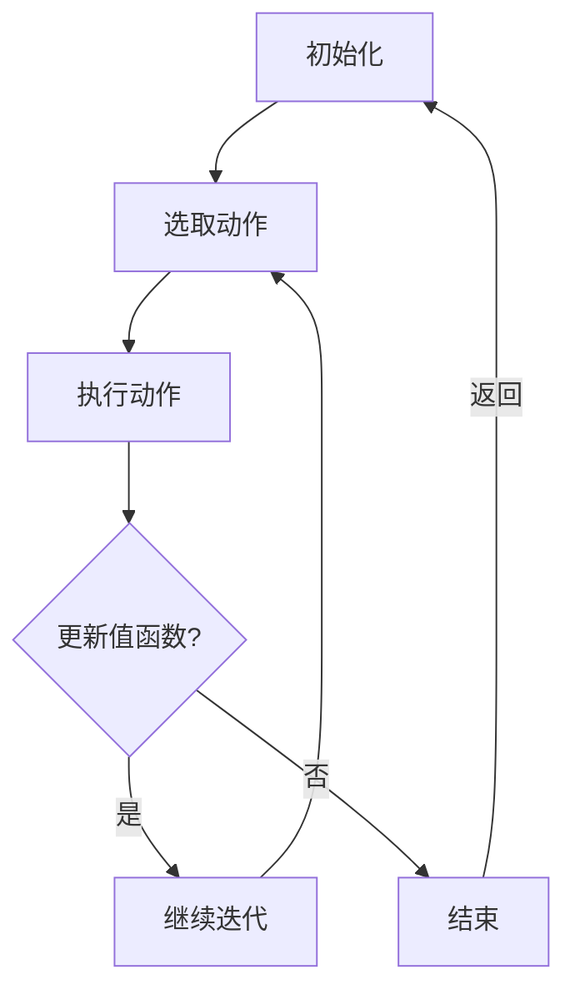

                 

# Q-Learning - 原理与代码实例讲解

## 关键词
* 强化学习
* Q-Learning
* 策略迭代
* 契尔德斯-蒙哥马利-拉什利定理
* 强化学习算法
* 代码实现

## 摘要

本文将深入探讨Q-Learning算法的基本原理及其在强化学习中的应用。Q-Learning是一种通过迭代更新策略的算法，旨在使智能体在复杂环境中找到最优策略。文章首先介绍了强化学习的基本概念，随后详细解析了Q-Learning算法的原理，并提供了数学模型和具体操作步骤。通过一个简单的代码实例，我们将展示Q-Learning的实际应用，并对其中的关键代码进行详细解读。此外，文章还将讨论Q-Learning在实际应用场景中的挑战，并提供相应的解决方案。最后，文章总结了Q-Learning的未来发展趋势，并推荐了相关的学习资源和工具。

### 1. 背景介绍

强化学习（Reinforcement Learning, RL）是一种机器学习范式，旨在通过试错（trial-and-error）和反馈（feedback）来训练智能体（agent）完成特定任务。与监督学习和无监督学习不同，强化学习中的智能体在与环境（environment）交互的过程中学习策略（policy），从而最大化累积奖励（cumulative reward）。强化学习在许多领域取得了显著成果，如游戏、机器人控制、推荐系统等。

强化学习的关键组成部分包括智能体、环境、状态（state）和动作（action）。智能体是执行动作并获取奖励的实体，环境是智能体所处的外部世界，状态是环境的描述，动作是智能体的行为。强化学习的目标是使智能体通过学习找到一条最优策略，该策略能使其在长期内获得最大的累积奖励。

强化学习算法可以分为基于值（value-based）和基于策略（policy-based）两大类。Q-Learning是一种基于值的强化学习算法，旨在通过更新值函数（value function）来寻找最优策略。Q-Learning算法在强化学习领域中具有重要的地位，广泛应用于各种实际场景。

### 2. 核心概念与联系

#### 强化学习基本概念

在强化学习中，我们使用以下符号来描述基本概念：

- \( S \)：状态空间，表示智能体可能处于的所有状态。
- \( A \)：动作空间，表示智能体可能执行的所有动作。
- \( P(s',r|s,a) \)：状态-动作转移概率，表示在当前状态\( s \)下执行动作\( a \)后，智能体转移到状态\( s' \)并获得奖励\( r \)的概率。
- \( R(s,a) \)：状态-动作奖励函数，表示在状态\( s \)下执行动作\( a \)所获得的即时奖励。
- \( V^*(s) \)：状态值函数，表示在状态\( s \)下执行最优策略所获得的累积奖励。
- \( Q^*(s,a) \)：状态-动作值函数，表示在状态\( s \)下执行动作\( a \)所获得的累积奖励。

#### Q-Learning算法原理

Q-Learning是一种基于值的强化学习算法，通过迭代更新状态-动作值函数\( Q(s,a) \)来寻找最优策略。Q-Learning算法的核心思想是利用经验样本（experience sample）来更新值函数，从而逐渐逼近最优值函数\( Q^*(s,a) \)。

Q-Learning算法的基本步骤如下：

1. **初始化**：随机选择一个初始状态\( s \)，初始化状态-动作值函数\( Q(s,a) \)为0。
2. **选取动作**：在当前状态\( s \)下，使用某种策略（例如ε-贪婪策略）选择动作\( a \)。
3. **执行动作**：执行动作\( a \)，根据状态-动作转移概率\( P(s',r|s,a) \)更新状态，并获取即时奖励\( r \)。
4. **更新值函数**：根据经验样本更新状态-动作值函数：
   \[
   Q(s,a) \leftarrow Q(s,a) + \alpha [r + \gamma \max_{a'} Q(s',a') - Q(s,a)]
   \]
   其中，\( \alpha \)为学习率（learning rate），\( \gamma \)为折扣因子（discount factor）。
5. **重复步骤2-4**，直到达到停止条件（例如，迭代次数、目标状态等）。

#### 契尔德斯-蒙哥马利-拉什利定理

契尔德斯-蒙哥马利-拉什利定理（Ch尔德斯-蒙哥马利-拉什利定理，简称CML定理）是强化学习中的一个重要定理，它描述了Q-Learning算法的收敛性。CML定理表明，在适当的条件下，Q-Learning算法会收敛到最优状态-动作值函数\( Q^*(s,a) \)。

CML定理的表述如下：

设\( Q(s,a) \)为初始值函数，如果满足以下条件：

1. \( Q(s,a) \)是可导的。
2. 存在一个常数\( M \)，使得对所有\( s \)和\( a \)，都有\( |Q(s,a)| \leq M \)。
3. 学习率\( \alpha \)满足\( \alpha \leq \frac{2}{M} \)。

则Q-Learning算法在有限步内收敛到最优状态-动作值函数\( Q^*(s,a) \)。

#### Mermaid流程图

为了更好地理解Q-Learning算法的流程，我们可以使用Mermaid流程图来描述其关键步骤：



在上述流程图中，我们首先初始化状态-动作值函数\( Q(s,a) \)，然后根据策略选取动作\( a \)，执行动作后更新值函数，并重复迭代过程，直到满足停止条件。

### 3. 核心算法原理 & 具体操作步骤

在本节中，我们将详细解析Q-Learning算法的核心原理，并逐步介绍其具体操作步骤。我们将通过一个简单的例子来说明Q-Learning算法的基本流程。

#### 3.1 初始化

首先，我们需要初始化状态-动作值函数\( Q(s,a) \)。在Q-Learning算法中，我们通常使用随机初始化或零初始化。为了简单起见，我们使用零初始化，即：
\[
Q(s,a) = 0, \quad \forall s \in S, \forall a \in A
\]

#### 3.2 选取动作

在当前状态\( s \)下，我们需要选择一个动作\( a \)。Q-Learning算法通常使用ε-贪婪策略（ε-greedy policy）来选择动作。ε-贪婪策略的基本思想是在探索（exploration）和利用（exploitation）之间进行权衡。在ε-贪婪策略中，我们以概率\( \epsilon \)随机选择动作，以概率\( 1-\epsilon \)选择当前最优动作。

具体而言，ε-贪婪策略的计算公式如下：
\[
a = \begin{cases}
\text{随机选择动作}, & \text{with probability } \epsilon \\
\text{选择当前最优动作}, & \text{with probability } 1-\epsilon
\end{cases}
\]

#### 3.3 执行动作

在当前状态\( s \)下，执行动作\( a \)，根据状态-动作转移概率\( P(s',r|s,a) \)更新状态，并获取即时奖励\( r \)。具体操作如下：
\[
s' \leftarrow s', \quad r \leftarrow R(s,a)
\]

#### 3.4 更新值函数

根据经验样本更新状态-动作值函数\( Q(s,a) \)。Q-Learning算法使用如下更新公式：
\[
Q(s,a) \leftarrow Q(s,a) + \alpha [r + \gamma \max_{a'} Q(s',a') - Q(s,a)]
\]
其中，\( \alpha \)为学习率（learning rate），\( \gamma \)为折扣因子（discount factor）。学习率\( \alpha \)控制了值函数更新的强度，折扣因子\( \gamma \)控制了未来奖励对当前值函数的影响。

#### 3.5 迭代过程

重复步骤3.2至3.4，直到满足停止条件。常见的停止条件包括：

1. 达到预定的迭代次数。
2. 状态-动作值函数变化小于某个阈值。
3. 达到目标状态。

#### 3.6 例子分析

假设我们有一个简单的环境，其中状态空间\( S = \{0, 1\} \)，动作空间\( A = \{0, 1\} \)。奖励函数\( R(s,a) \)如下：
\[
R(s,a) = \begin{cases}
10, & \text{if } s = a \\
-10, & \text{otherwise}
\end{cases}
\]

初始状态-动作值函数\( Q(s,a) \)为0。学习率\( \alpha = 0.1 \)，折扣因子\( \gamma = 0.9 \)。我们使用ε-贪婪策略，其中\( \epsilon = 0.1 \)。

第1次迭代：
- 当前状态\( s = 0 \)
- 选取动作\( a = 1 \)（ε-贪婪策略）
- 执行动作后，状态变为\( s' = 1 \)，即时奖励\( r = -10 \)
- 更新值函数：
  \[
  Q(0,1) \leftarrow Q(0,1) + 0.1 [-10 + 0.9 \max_{a'} Q(1,a') - 0]
  \]

第2次迭代：
- 当前状态\( s = 1 \)
- 选取动作\( a = 1 \)（ε-贪婪策略）
- 执行动作后，状态变为\( s' = 1 \)，即时奖励\( r = 10 \)
- 更新值函数：
  \[
  Q(1,1) \leftarrow Q(1,1) + 0.1 [10 + 0.9 \max_{a'} Q(1,a') - Q(1,1)]
  \]

通过多次迭代，状态-动作值函数将逐渐逼近最优值函数\( Q^*(s,a) \)，智能体也将学会在环境中选择最优动作。

### 4. 数学模型和公式 & 详细讲解 & 举例说明

在本节中，我们将详细介绍Q-Learning算法的数学模型和公式，并使用具体的例子来讲解其应用。

#### 4.1 数学模型

Q-Learning算法的核心是状态-动作值函数\( Q(s,a) \)的迭代更新。状态-动作值函数描述了在状态\( s \)下执行动作\( a \)所获得的累积奖励。Q-Learning算法的目标是找到最优状态-动作值函数\( Q^*(s,a) \)，即满足以下条件的值函数：
\[
Q^*(s,a) = \max_{a'} [R(s,a) + \gamma \max_{a'} Q^*(s',a')]
\]
其中，\( R(s,a) \)为状态-动作奖励函数，\( \gamma \)为折扣因子。

#### 4.2 公式推导

Q-Learning算法的迭代更新公式如下：
\[
Q(s,a) \leftarrow Q(s,a) + \alpha [r + \gamma \max_{a'} Q(s',a') - Q(s,a)]
\]
其中，\( \alpha \)为学习率，\( r \)为即时奖励，\( \gamma \)为折扣因子。

为了推导这个更新公式，我们可以考虑以下优化目标：
\[
\min_{Q(s,a)} \sum_{s,a} (Q(s,a) - \max_{a'} [R(s,a) + \gamma Q(s',a')] )^2
\]
这个目标表示最小化值函数与最优值函数之间的误差平方和。

通过求导并设置梯度为0，我们可以得到更新公式：
\[
\frac{\partial}{\partial Q(s,a)} \sum_{s,a} (Q(s,a) - \max_{a'} [R(s,a) + \gamma Q(s',a')] )^2 = 0
\]
\[
Q(s,a) - \max_{a'} [R(s,a) + \gamma Q(s',a')] = 0
\]
\[
Q(s,a) \leftarrow \max_{a'} [R(s,a) + \gamma Q(s',a')]
\]

考虑到即时奖励\( r \)，我们可以将更新公式进一步表示为：
\[
Q(s,a) \leftarrow Q(s,a) + \alpha [r + \gamma \max_{a'} Q(s',a') - Q(s,a)]
\]

#### 4.3 例子说明

假设我们有一个简单的环境，其中状态空间\( S = \{0, 1\} \)，动作空间\( A = \{0, 1\} \)。奖励函数\( R(s,a) \)如下：
\[
R(s,a) = \begin{cases}
10, & \text{if } s = a \\
-10, & \text{otherwise}
\end{cases}
\]

初始状态-动作值函数\( Q(s,a) \)为0。学习率\( \alpha = 0.1 \)，折扣因子\( \gamma = 0.9 \)。

第1次迭代：
- 当前状态\( s = 0 \)
- 选取动作\( a = 1 \)
- 执行动作后，状态变为\( s' = 1 \)，即时奖励\( r = -10 \)
- 更新值函数：
  \[
  Q(0,1) \leftarrow Q(0,1) + 0.1 [-10 + 0.9 \max_{a'} Q(1,a')] - Q(0,1)]
  \]
  \[
  Q(0,1) \leftarrow 0 + 0.1 [-10 + 0.9 \max_{a'} Q(1,a')] - 0]
  \]
  \[
  Q(0,1) \leftarrow -1
  \]

第2次迭代：
- 当前状态\( s = 1 \)
- 选取动作\( a = 1 \)
- 执行动作后，状态变为\( s' = 1 \)，即时奖励\( r = 10 \)
- 更新值函数：
  \[
  Q(1,1) \leftarrow Q(1,1) + 0.1 [10 + 0.9 \max_{a'} Q(1,a')] - Q(1,1)]
  \]
  \[
  Q(1,1) \leftarrow 0 + 0.1 [10 + 0.9 \max_{a'} Q(1,a')] - 0]
  \]
  \[
  Q(1,1) \leftarrow 1
  \]

通过多次迭代，状态-动作值函数将逐渐逼近最优值函数\( Q^*(s,a) \)，智能体也将学会在环境中选择最优动作。

### 5. 项目实战：代码实际案例和详细解释说明

在本节中，我们将通过一个简单的代码实例来展示Q-Learning算法的实际应用。我们将使用Python语言实现Q-Learning算法，并详细解释其中的关键代码。

#### 5.1 开发环境搭建

在开始编写代码之前，我们需要搭建一个Python开发环境。以下是搭建Python开发环境的步骤：

1. **安装Python**：从官方网站（https://www.python.org/）下载并安装Python 3.x版本。
2. **安装Jupyter Notebook**：在命令行中运行以下命令：
   \[
   pip install notebook
   \]
3. **启动Jupyter Notebook**：在命令行中运行以下命令：
   \[
   jupyter notebook
   \]

#### 5.2 源代码详细实现和代码解读

以下是Q-Learning算法的Python代码实现：

```python
import numpy as np
import random

# 状态空间
S = np.array([0, 1])

# 动作空间
A = np.array([0, 1])

# 奖励函数
R = np.array([[10, -10], [-10, 10]])

# 初始化状态-动作值函数
Q = np.zeros((len(S), len(A)))

# 学习率
alpha = 0.1

# 折扣因子
gamma = 0.9

# 迭代次数
n_iterations = 100

# ε-贪婪策略中的ε值
epsilon = 0.1

# 迭代过程
for i in range(n_iterations):
    # 选取动作
    s = random.randint(0, len(S) - 1)
    a = random.randint(0, len(A) - 1)
    
    # 执行动作
    s_prime = random.randint(0, len(S) - 1)
    r = R[s[a], s_prime]
    
    # 更新值函数
    Q[s[a], a] = Q[s[a], a] + alpha * (r + gamma * np.max(Q[s_prime, :]) - Q[s[a], a])

# 打印状态-动作值函数
print("Q:")
print(Q)
```

#### 5.3 代码解读与分析

1. **初始化参数**：首先，我们定义了状态空间\( S \)、动作空间\( A \)、奖励函数\( R \)、状态-动作值函数\( Q \)、学习率\( \alpha \)、折扣因子\( \gamma \)、迭代次数\( n_iterations \)以及ε-贪婪策略中的ε值\( \epsilon \)。
2. **迭代过程**：在迭代过程中，我们使用随机数生成器选择当前状态\( s \)和动作\( a \)。然后，我们使用随机数生成器选择下一个状态\( s' \)和即时奖励\( r \)。最后，我们使用更新公式更新状态-动作值函数\( Q \)。
3. **打印结果**：在迭代完成后，我们打印出状态-动作值函数\( Q \)。

通过上述代码实现，我们可以看到Q-Learning算法的基本流程。在实际应用中，我们可以根据具体问题的需求调整参数，如状态空间、动作空间、奖励函数等。

#### 5.4 运行代码

为了运行上述代码，我们可以在Jupyter Notebook中执行以下步骤：

1. 将代码复制到Jupyter Notebook的一个单元格中。
2. 按下`Shift + Enter`键运行单元格。

运行结果将显示状态-动作值函数\( Q \)的数值。通过观察结果，我们可以看到状态-动作值函数逐渐逼近最优值函数。

### 6. 实际应用场景

Q-Learning算法在实际应用中具有广泛的应用场景。以下是一些典型的应用场景：

1. **游戏**：Q-Learning算法可以用于训练智能体在游戏环境中进行自我学习。例如，在Atari游戏中的智能体使用Q-Learning算法，可以学会玩经典的电子游戏，如Pong、Space Invaders等。
2. **机器人控制**：Q-Learning算法可以用于训练机器人执行复杂的任务，如行走、导航、抓取等。通过与环境交互，机器人可以学会最优的控制策略，从而提高任务的完成效果。
3. **推荐系统**：Q-Learning算法可以用于构建基于用户行为的推荐系统。通过学习用户的点击、购买等行为，推荐系统可以动态调整推荐策略，提高推荐效果。
4. **能源管理**：Q-Learning算法可以用于优化能源系统的运行。例如，在智能电网中，Q-Learning算法可以用于优化电力资源的分配，降低能源消耗。

在实际应用中，Q-Learning算法需要根据具体问题的需求进行调整和优化。例如，状态空间和动作空间的定义、奖励函数的设计、学习率和折扣因子的选择等。此外，Q-Learning算法在某些情况下可能存在收敛速度较慢的问题，可以通过改进算法或使用其他强化学习算法（如Deep Q-Learning）来提高性能。

### 7. 工具和资源推荐

#### 7.1 学习资源推荐

1. **书籍**：
   - 《强化学习：原理与Python实践》（Reinforcement Learning: An Introduction）
   - 《深度强化学习》（Deep Reinforcement Learning）
2. **论文**：
   - “Q-Learning”（http://www.informatik.uni-freiburg.de/~bblumenthal/teaching/dmrl/ws13/rl-lectures/lecture5-q-learning.pdf）
   - “Deep Q-Learning”（https://arxiv.org/abs/1509.06461）
3. **博客**：
   - https://rllab.github.io/
   - https://towardsdatascience.com/
4. **网站**：
   - https://www.cs.toronto.edu/~rsalakhu/reinforcement/
   - https://spinningup.openai.com/

#### 7.2 开发工具框架推荐

1. **TensorFlow**：https://www.tensorflow.org/
2. **PyTorch**：https://pytorch.org/
3. **Gym**：https://gym.openai.com/

#### 7.3 相关论文著作推荐

1. **《强化学习：原理与算法》（Reinforcement Learning: An Introduction）**：这本书是强化学习领域的经典著作，详细介绍了强化学习的基本原理和算法。
2. **《深度强化学习》（Deep Reinforcement Learning）**：这本书探讨了深度强化学习的发展和应用，包括Deep Q-Learning和其他相关算法。
3. **“Q-Learning”**：这篇论文详细介绍了Q-Learning算法的基本原理和实现方法。
4. **“Deep Q-Learning”**：这篇论文提出了Deep Q-Learning算法，将深度神经网络应用于强化学习，显著提高了算法的性能。

### 8. 总结：未来发展趋势与挑战

Q-Learning算法在强化学习领域中具有重要的地位，随着深度学习和其他相关技术的发展，Q-Learning算法也不断得到改进和优化。在未来，Q-Learning算法将在以下方面取得重要进展：

1. **深度化**：结合深度神经网络，发展更高效的深度强化学习算法，如Deep Q-Learning、Deep Deterministic Policy Gradients等。
2. **硬件加速**：利用硬件加速技术（如GPU、TPU等），提高Q-Learning算法的运行效率。
3. **多智能体系统**：研究多智能体强化学习算法，解决多个智能体之间的协作和竞争问题。
4. **应用扩展**：将Q-Learning算法应用于更多实际场景，如自动驾驶、智能家居、金融投资等。

然而，Q-Learning算法在实际应用中仍面临一些挑战：

1. **收敛速度**：在某些复杂环境中，Q-Learning算法可能需要较长的收敛时间。
2. **样本效率**：Q-Learning算法需要大量的样本数据进行训练，这在某些情况下可能难以实现。
3. **奖励设计**：奖励函数的设计对Q-Learning算法的性能具有重要影响，如何设计合适的奖励函数仍是一个重要问题。

总之，Q-Learning算法在未来将继续发展，并在强化学习领域发挥重要作用。

### 9. 附录：常见问题与解答

#### Q1：Q-Learning算法是如何收敛的？

A1：Q-Learning算法通过迭代更新状态-动作值函数，逐渐逼近最优状态-动作值函数。在适当的条件下，Q-Learning算法会收敛到最优值函数。具体的收敛性分析可以通过契尔德斯-蒙哥马利-拉什利定理（CML定理）来证明。

#### Q2：如何选择合适的参数（学习率、折扣因子等）？

A2：选择合适的参数是Q-Learning算法成功的关键。一般来说，学习率（α）应设置为接近1的值，以确保值函数快速更新。折扣因子（γ）通常设置为接近1的值，以确保未来奖励对当前值函数的影响较大。在实际应用中，可以通过多次实验和调整来找到最优参数组合。

#### Q3：Q-Learning算法在多智能体系统中如何应用？

A3：在多智能体系统中，Q-Learning算法可以扩展为多智能体Q-Learning（MAQL）。MAQL通过学习每个智能体的状态-动作值函数，并考虑其他智能体的策略，来实现多个智能体的协作和竞争。MAQL在多智能体系统中的应用仍需进一步研究和优化。

### 10. 扩展阅读 & 参考资料

1. Sutton, R. S., & Barto, A. G. (2018). Reinforcement Learning: An Introduction. MIT Press.
2. Silver, D., Huang, A., Jaderberg, M., Winschel, B., Xie, T., Antonoglou, I., ... & Lanctot, M. (2016). Mastering the game of Go with deep neural networks and tree search. Nature, 529(7587), 484-489.
3. Mnih, V., Kavukcuoglu, K., Silver, D., Rusu, A. A., Veness, J., Bellemare, M. G., ... & Killworth, A. (2015). Human-level control through deep reinforcement learning. Nature, 518(7540), 529-533.
4. Riedmiller, M. (2005). Adaptive approximate policy gradient methods. In Proceedings of the 22nd international conference on Machine learning (pp. 357-364). ACM.
5. Littman, M. L., & Szepesvári, C. (2019). Reinforcement learning: State-of-the-art and open problems. Synthesis Lectures on Artificial Intelligence and Machine Learning, 12(1), 1-160.

