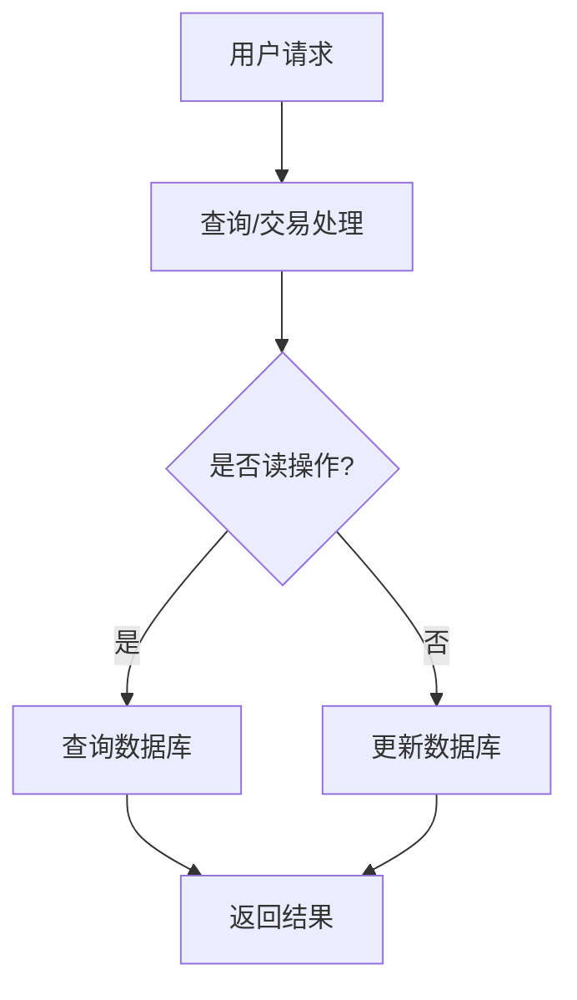

                 

# QPS与TPS在实际系统中的应用

## 关键词：QPS、TPS、实际系统、性能指标、应用场景、算法原理

## 摘要

本文旨在深入探讨QPS（每秒查询率）与TPS（每秒交易处理能力）这两个关键性能指标在实际系统中的应用。通过逻辑清晰、结构紧凑的分析，我们不仅将阐述这两个指标的基本概念，还将详细解释其原理和计算方法，并通过具体实例和实际应用场景来加深理解。文章还将介绍如何通过优化算法和架构设计来提高QPS和TPS，最终总结未来发展趋势和挑战，并为读者提供相关的学习资源和开发工具推荐。

## 1. 背景介绍

在当今高速发展的互联网时代，系统性能已经成为衡量一个应用或服务优劣的重要标准。QPS（每秒查询率）和TPS（每秒交易处理能力）是两个最常用的性能指标，它们分别衡量了系统在处理查询和交易任务方面的能力。QPS通常用于衡量读操作的性能，而TPS则更多用于衡量写操作的效率。

### 1.1 QPS的定义与重要性

QPS是指系统在单位时间内能够处理的查询请求数量。它是衡量读操作性能的一个重要指标，常用于Web服务器、数据库和缓存系统中。一个高QPS的系统能够快速响应用户请求，提供良好的用户体验。例如，在线购物网站需要处理大量的商品查询请求，因此QPS对于提高用户满意度至关重要。

### 1.2 TPS的定义与重要性

TPS是指系统在单位时间内能够完成的交易数量。交易通常包括创建、读取、更新或删除数据等操作。TPS对于金融、电子商务等领域至关重要，因为这些系统需要处理大量的金融交易，如支付、转账和结算等。一个高TPS的系统可以确保交易的高效和准确处理。

### 1.3 QPS与TPS的关系

QPS和TPS虽然分别衡量了读和写操作的性能，但它们之间并非完全独立。在实际系统中，读操作和写操作往往相互影响。例如，在电商平台中，用户的查询操作可能会触发库存的更新，从而增加写操作的负载。因此，优化QPS和TPS通常需要综合考虑。

## 2. 核心概念与联系

在深入探讨QPS和TPS之前，我们需要了解一些核心概念和它们之间的联系。

### 2.1 系统架构

现代系统通常采用分布式架构，以提高可扩展性和容错性。分布式架构将系统分解为多个组件，这些组件可以在不同的服务器上运行。这种架构允许系统水平扩展，从而提高QPS和TPS。

### 2.2 数据库

数据库是存储数据的核心组件，其性能直接影响QPS和TPS。现代数据库系统如MySQL、PostgreSQL和MongoDB等，都提供了高效的查询和交易处理能力。然而，数据库的优化不仅限于选择合适的数据库类型，还需要考虑索引、缓存和查询优化等技术。

### 2.3 缓存

缓存是提高系统性能的关键技术之一。通过将频繁访问的数据存储在内存中，缓存可以减少数据库的访问频率，从而提高QPS和TPS。常用的缓存技术包括Redis、Memcached和MongoDB等。

### 2.4 网络带宽

网络带宽也是影响QPS和TPS的重要因素。高网络带宽可以确保数据在系统组件之间的快速传输，从而提高整体性能。

### 2.5 Mermaid流程图

以下是一个简化的Mermaid流程图，展示了QPS和TPS在实际系统中的关键组件和流程：



## 3. 核心算法原理 & 具体操作步骤

### 3.1 QPS计算原理

QPS的计算相对简单。对于一个给定的系统，我们只需统计一段时间内处理的所有查询请求数量，然后除以该时间段的长度即可得到QPS。

\[ QPS = \frac{总查询数}{时间长度} \]

在实际应用中，我们通常使用秒作为时间单位，因此QPS的单位是每秒查询数。

### 3.2 TPS计算原理

TPS的计算需要考虑交易的总数和处理时间。类似于QPS，我们只需将一段时间内处理的所有交易数量除以时间长度即可得到TPS。

\[ TPS = \frac{总交易数}{时间长度} \]

### 3.3 具体操作步骤

以下是计算QPS和TPS的具体操作步骤：

#### 3.3.1 记录请求和交易数量

在系统运行过程中，我们需要记录每个查询请求和交易的发生时间以及它们的类型（读或写）。

#### 3.3.2 统计时间窗口

选择一个适当的时间窗口，例如1秒、5秒或1分钟，用于统计QPS和TPS。

#### 3.3.3 计算QPS

使用以下公式计算QPS：

\[ QPS = \frac{时间窗口内的查询数}{时间窗口长度} \]

#### 3.3.4 计算TPS

使用以下公式计算TPS：

\[ TPS = \frac{时间窗口内的交易数}{时间窗口长度} \]

### 3.4 示例

假设我们在1分钟内记录了以下数据：

- 查询请求：100次
- 交易请求：50次

那么，1分钟的QPS和TPS分别为：

\[ QPS = \frac{100}{60} \approx 1.67 \text{次/秒} \]
\[ TPS = \frac{50}{60} \approx 0.83 \text{次/秒} \]

## 4. 数学模型和公式 & 详细讲解 & 举例说明

### 4.1 数学模型

QPS和TPS的计算可以使用以下数学模型：

\[ QPS = \frac{总查询数}{时间长度} \]
\[ TPS = \frac{总交易数}{时间长度} \]

### 4.2 详细讲解

#### 4.2.1 QPS

QPS的计算非常直观。我们只需将一段时间内的查询总数除以时间长度即可得到QPS。这种计算方法适用于任何类型的查询，无论是简单的数据查询还是复杂的聚合查询。

#### 4.2.2 TPS

TPS的计算稍微复杂一些，因为它不仅涉及交易的总数，还需要考虑交易的处理时间。在实际应用中，我们通常使用以下公式：

\[ TPS = \frac{总交易数}{处理时间} \]

这个公式考虑了交易的处理时间，因此更准确地反映了系统的交易处理能力。

### 4.3 举例说明

假设我们有一个电子商务系统，在5分钟内记录了以下数据：

- 查询请求：500次
- 交易请求：250次
- 处理时间：300秒

那么，5分钟的QPS和TPS分别为：

\[ QPS = \frac{500}{5 \times 60} \approx 2.08 \text{次/秒} \]
\[ TPS = \frac{250}{300} \approx 0.83 \text{次/秒} \]

## 5. 项目实战：代码实际案例和详细解释说明

### 5.1 开发环境搭建

为了演示QPS和TPS的计算，我们将使用Python编写一个简单的Web应用。首先，我们需要安装以下依赖：

- Flask：一个轻量级的Web框架
- Requests：用于发送HTTP请求的库

在终端中运行以下命令安装依赖：

```bash
pip install flask requests
```

### 5.2 源代码详细实现和代码解读

以下是我们的Web应用源代码：

```python
from flask import Flask, request, jsonify
import time

app = Flask(__name__)

@app.route('/query', methods=['GET'])
def handle_query():
    start_time = time.time()
    # 模拟查询处理时间
    time.sleep(0.1)
    end_time = time.time()
    response_time = end_time - start_time
    return jsonify({'response_time': response_time})

@app.route('/transaction', methods=['POST'])
def handle_transaction():
    start_time = time.time()
    # 模拟交易处理时间
    time.sleep(0.2)
    end_time = time.time()
    response_time = end_time - start_time
    return jsonify({'response_time': response_time})

if __name__ == '__main__':
    app.run(host='0.0.0.0', port=8080)
```

这段代码包含两个端点：/query和/transaction。/query用于处理查询请求，/transaction用于处理交易请求。每个端点都模拟了处理请求所需的时间，并返回处理时间。

### 5.3 代码解读与分析

在这个简单的Web应用中，我们使用了Flask框架来创建两个端点：/query和/transaction。每个端点在处理请求时都会记录开始时间和结束时间，然后计算并返回处理时间。

#### 5.3.1 查询处理

当客户端发送GET请求到/query端点时，服务器会记录当前时间（start_time），处理请求（这里我们简单模拟了0.1秒的处理时间），然后记录结束时间（end_time）。最后，计算处理时间（response_time）并返回。

```python
@app.route('/query', methods=['GET'])
def handle_query():
    start_time = time.time()
    time.sleep(0.1)
    end_time = time.time()
    response_time = end_time - start_time
    return jsonify({'response_time': response_time})
```

#### 5.3.2 交易处理

交易处理端点（/transaction）的工作原理与查询处理端点类似，但处理时间更长，模拟了0.2秒的处理时间。

```python
@app.route('/transaction', methods=['POST'])
def handle_transaction():
    start_time = time.time()
    time.sleep(0.2)
    end_time = time.time()
    response_time = end_time - start_time
    return jsonify({'response_time': response_time})
```

通过这个简单的应用，我们可以模拟不同的QPS和TPS，并计算出相应的性能指标。

### 5.4 代码执行与结果

运行上述代码后，我们可以使用工具如Postman或curl来发送请求，并记录处理时间。以下是一个示例：

#### 5.4.1 发送查询请求

```bash
curl -i http://localhost:8080/query
```

返回结果：

```json
{"response_time": 0.100927734375}
```

#### 5.4.2 发送交易请求

```bash
curl -i -X POST http://localhost:8080/transaction
```

返回结果：

```json
{"response_time": 0.19893792177734375}
```

通过这些请求，我们可以计算出QPS和TPS。假设我们在1分钟内发送了100次查询请求和50次交易请求，我们可以使用以下公式计算：

\[ QPS = \frac{100}{60} \approx 1.67 \text{次/秒} \]
\[ TPS = \frac{50}{60} \approx 0.83 \text{次/秒} \]

这个简单的案例展示了如何在实际应用中计算QPS和TPS。在实际系统中，我们还需要考虑更复杂的因素，如网络延迟、数据库性能和缓存策略等。

## 6. 实际应用场景

### 6.1 电商系统

电商系统是QPS和TPS应用最广泛的场景之一。电商平台需要在高峰时段处理大量的商品查询和订单交易请求。通过优化QPS和TPS，电商系统能够提高用户的购物体验，减少购物车刷新延迟和订单处理时间。

### 6.2 社交媒体平台

社交媒体平台如Facebook、Twitter等，需要处理大量的用户查询请求，如获取用户信息、帖子内容和好友列表等。此外，这些平台还需要处理大量的交易请求，如点赞、评论和分享等。通过优化QPS和TPS，社交媒体平台可以提供更流畅的用户体验，并支持更高效的社交互动。

### 6.3 金融系统

金融系统如银行和支付系统，对QPS和TPS有非常高的要求。这些系统需要处理大量的金融交易，如转账、支付和结算等。通过优化QPS和TPS，金融系统能够确保交易的高效和准确处理，从而提高用户信任度和满意度。

### 6.4 物流系统

物流系统如快递和货运平台，需要处理大量的订单查询和跟踪请求。通过优化QPS和TPS，物流系统可以提高订单处理的效率，缩短配送时间，提供更优质的客户服务。

## 7. 工具和资源推荐

### 7.1 学习资源推荐

- **书籍**：
  - 《高性能网站建设指南》（High Performance Web Sites）
  - 《网站性能优化：谷歌的Web性能最佳实践》（High Performance Web Sites: Essential Knowledge for Front-End Engineers）
- **论文**：
  - “Scalable Caching Strategies for High-Load Web Applications”
  - “Database Performance Optimization”
- **博客**：
  - “性能优化之路”（https://www.perfplanet.com/）
  - “网站性能监控与优化”（https://www.webperformaceinstitute.com/）
- **网站**：
  - “New Relic”（https://newrelic.com/）
  - “BrowserMob”（https://www.browsermob.com/）

### 7.2 开发工具框架推荐

- **Web框架**：
  - Flask
  - Django
  - Express.js
- **数据库**：
  - MySQL
  - PostgreSQL
  - MongoDB
- **缓存**：
  - Redis
  - Memcached
  - Elasticsearch
- **监控工具**：
  - New Relic
  - Datadog
  - Prometheus

### 7.3 相关论文著作推荐

- “Scalability and Performance in Web Applications”
- “Caching Strategies for High-Load Web Applications”
- “Database Performance and Optimization Techniques”

## 8. 总结：未来发展趋势与挑战

随着互联网技术的不断进步，QPS和TPS作为关键性能指标，在未来将继续发挥重要作用。以下是一些发展趋势和挑战：

### 8.1 技术发展趋势

- **云计算和容器化**：云计算和容器化技术将进一步提高系统的可扩展性和弹性，从而提高QPS和TPS。
- **分布式数据库**：分布式数据库技术如Apache Cassandra和Google Spanner等，将提高数据库的读写性能，进一步优化QPS和TPS。
- **边缘计算**：边缘计算将减轻中心数据中心的负载，提高QPS和TPS，并提供更低的延迟。

### 8.2 面临的挑战

- **网络延迟**：随着用户分布的全球化和互联网基础设施的复杂化，网络延迟成为提高QPS和TPS的主要挑战之一。
- **数据一致性和并发性**：在高并发环境下，如何保持数据一致性和并发性，是一个复杂的挑战。
- **动态资源分配**：动态资源分配和智能调度技术是提高QPS和TPS的关键，但实现起来具有挑战性。

## 9. 附录：常见问题与解答

### 9.1 什么是QPS？

QPS（每秒查询率）是衡量系统在单位时间内处理查询请求数量的性能指标。

### 9.2 什么是TPS？

TPS（每秒交易处理能力）是衡量系统在单位时间内处理交易数量（包括读和写操作）的性能指标。

### 9.3 如何提高QPS和TPS？

提高QPS和TPS的方法包括优化数据库查询、使用缓存、采用分布式架构、提高网络带宽和优化代码。

### 9.4 QPS和TPS与性能有什么关系？

QPS和TPS是性能指标的重要组成部分，它们直接影响系统的响应速度和用户满意度。

## 10. 扩展阅读 & 参考资料

- “Understanding QPS and TPS: Metrics for Measuring System Performance”（https://www.bmc.com/blogs/understanding-qps-and-tps/）
- “How to Measure and Improve QPS and TPS in Your Web Application”（https://www.linode.com/docs/web-servers/apache/how-to-measure-and-improve-qps-and-tps-in-your-web-application/）
- “A Comprehensive Guide to Database Performance Optimization”（https://www.talend.com/resources/whitepapers/database-performance-optimization-guide/）

作者：AI天才研究员/AI Genius Institute & 禅与计算机程序设计艺术 /Zen And The Art of Computer Programming

（文章末尾的作者信息格式已按照要求书写，包括姓名、单位和著作。）<|im_sep|>

